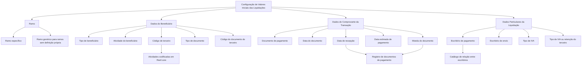

# Definição de Valores Iniciais das Liquidações no Reef

## 1. Metadados do Documento
- **Arquivo de Origem:** Não identificado no conteúdo fornecido
- **Tipo de Documento:** Especificação Técnica
- **Domínio / Sistema:** Reef / Reef.core / Liquidações de sinistros
- **Público-Alvo:** Desenvolvedores, Arquitetos, Operação e Negócio
- **Data/Versão Identificada:** Não identificada
- **Owner identificado:** `user:agonzalez_mapfre.com`
- **Lifecycle identificado:** `Approved Source`
- **Referências de navegação identificadas:** Documentación Reef, Mapfredocument, VL

---

## 2. Resumo Executivo & Contexto de Negócio

O documento descreve a definição de valores iniciais ou valores por defeito para atributos utilizados na geração de liquidações. O objetivo declarado é permitir maior eficiência operacional quando uma liquidação é criada, preenchendo atributos de forma inicial conforme lógicas de negócio configuradas.

A definição dos valores iniciais é organizada em três grupos principais: dados do beneficiário da liquidação, dados do comprovante da transação e dados particulares da liquidação. Cada grupo reúne propriedades que devolvem valores iniciais para campos relevantes da operação de liquidação.

O atributo **Ramo** determina o escopo da configuração de valores por defeito. Uma definição pode ser associada à chave de um ramo específico ou ao ramo genérico. A definição genérica aplica-se aos ramos que não possuam uma definição própria.

As lógicas de negócio descritas podem determinar atributos como tipo de beneficiário, atividade, código de terceiro, documento de pagamento, datas associadas a documentos de pagamento, moeda, escritórios de pagamento e envio, tipo de IVA e tipo de IVA ou retenção do terceiro. Em determinados casos, o núcleo do sistema possui comportamento padrão explicitamente indicado, como devolver `Exento` de I.V.A. para campos fiscais.

O documento apresenta títulos de lógicas de negócio e suas finalidades funcionais, mas não detalha implementações, métodos HTTP, contratos JSON, nomes técnicos de classes, estruturas de persistência ou regras de priorização além das explicitamente descritas.

---

## 3. Arquitetura, Componentes & Tecnologias Envolvidas

Os componentes e conceitos explicitamente mencionados são:

- **Reef:** Sistema no qual são definidas propriedades e lógicas de negócio para valores iniciais das liquidações.
- **Reef.core:** Referência para atividades codificadas, incluindo casos normalmente associados a fornecedores, tramitadores e agentes.
- **Núcleo:** Componente mencionado como responsável por devolver determinados valores padrão, como escritórios de pagamento, escritório de envio e `Exento` de I.V.A.
- **Liquidação:** Operação que recebe valores iniciais para dados do beneficiário, comprovante da transação e dados particulares.
- **Documentos de pagamento:** Documentos definidos na companhia e utilizáveis em sinistros, como faturas e documentos de indenização.
- **Registro de documentos de pagamento:** Fonte potencial de dados quando o documento de pagamento está definido para ser registrado antes da realização da liquidação.
- **Catálogo de relação entre escritórios:** Catálogo que relaciona escritórios geradores de ordens de pagamento aos respectivos escritórios pagadores.



> **Nota de Análise:** O documento não apresenta interfaces técnicas, serviços, APIs, URLs, tecnologias de infraestrutura, ambientes, portas ou contratos de integração.

---

## 4. Regras de Negócio, Especificações Funcionais & Processos

### 4.1 Objetivo da definição de valores iniciais

A definição de valores iniciais das liquidações permite conhecer quais atributos de uma liquidação podem receber valores iniciais ou valores por defeito. A finalidade declarada é aumentar a eficácia no momento de geração de uma liquidação.

### 4.2 Escopo por ramo

A propriedade **Ramo** contém a chave do ramo para o qual os valores por defeito dos atributos de liquidação estão sendo definidos.

Regras identificadas:

1. Uma definição pode ser configurada para um ramo específico.
2. Pode ser utilizado um ramo genérico.
3. A definição do ramo genérico aplica-se a todos os ramos que não tenham uma definição própria.

### 4.3 Dados do beneficiário da liquidação

#### Tipo de beneficiário inicial

A lógica de negócio de tipo de beneficiário inicial fornece à operação de liquidação o valor por defeito do tipo de beneficiário da liquidação.

#### Atividade do beneficiário inicial

A lógica de negócio da atividade do beneficiário inicial fornece à operação de liquidação o valor inicial da atividade do beneficiário da liquidação.

#### Código de terceiro inicial

A lógica de negócio do código de terceiro inicial fornece à operação de liquidação o valor inicial do código de terceiro do beneficiário da liquidação.

A aplicação dessa lógica está condicionada a uma atividade definida como codificada em **Reef.core**. O documento informa que essas atividades costumam corresponder a:

- Fornecedores;
- Tramitadores;
- Agentes.

#### Tipo de documento inicial

A lógica de negócio de tipo de documento inicial fornece o valor inicial do tipo de documento do beneficiário da liquidação.

#### Código de documento do terceiro inicial

A lógica de negócio de código de documento do terceiro inicial devolve o código do documento do terceiro.

### 4.4 Dados do comprovante da transação

#### Documento de pagamento inicial

A lógica de negócio do documento de pagamento inicial devolve um dos diferentes documentos de pagamento definidos na companhia e que podem ser utilizados em sinistros.

#### Data do documento de pagamento

A lógica de negócio da data do documento de pagamento devolve a data do documento de pagamento. O documento apresenta como exemplos:

- Data da fatura;
- Data do documento de indenização.

#### Data de recepção do documento de pagamento

A lógica de negócio da data de recepção devolve a data na qual a companhia recebeu a fatura.

Quando o documento estiver definido, na definição de documentos de pagamento da companhia, como um documento que deve ser registrado antes da realização da liquidação, a data poderá ser obtida a partir do registro de documentos de pagamento.

#### Data estimada de pagamento

A lógica de negócio da data estimada de pagamento devolve a data na qual se prevê que a liquidação será paga.

A data estimada pode ser devolvida em função dos convênios de pagamento quando o beneficiário for um profissional.

#### Moeda do documento

A lógica de negócio da moeda do documento devolve a moeda associada ao documento de pagamento, incluindo a moeda de uma fatura ou de um documento de indenização.

Quando o documento estiver definido na companhia como um documento registrado antes da realização da liquidação, a moeda poderá ser obtida no registro de documentos de pagamento.

Quando o documento não for registrado, a moeda do país poderá ser utilizada como valor por defeito.

### 4.5 Dados particulares da liquidação

#### Escritório de pagamento inicial

A propriedade de escritório de pagamento inicial contém a lógica de negócio que devolve o escritório de pagamento para as liquidações.

O núcleo devolve o escritório de pagamento correspondente ao escritório do usuário. Esse relacionamento deve estar definido no catálogo de relação entre:

- Escritórios que geram ordens de pagamento;
- Escritório pagador correspondente.

#### Escritório de envio inicial

A propriedade de escritório de envio inicial contém a lógica de negócio que devolve o escritório de envio do cheque ou da documentação associada às liquidações, incluindo documentação de quitação (`finiquito`).

O núcleo devolve o escritório do usuário.

#### Tipo de IVA

A propriedade de tipo de IVA contém a lógica de negócio que devolve, como valor inicial, o tipo de IVA que possui o documento oficial associado às liquidações.

O núcleo devolve `Exento` de I.V.A.

#### Tipo de IVA ou retenção do terceiro

A propriedade de tipo de IVA do terceiro contém a lógica de negócio que devolve o tipo de IVA ou de retenção aplicável ao terceiro que receberá a liquidação.

O núcleo devolve `Exento` de I.V.A.

---

## 5. Tabelas de Parâmetros, Ambientes e Estruturas de Dados

| Item / Parâmetro | Descrição / Função | Tipo / Valores / Formato | Ambiente / Observações |
| :--- | :--- | :--- | :--- |
| Ramo | Chave do ramo para o qual são definidos valores por defeito dos atributos da liquidação | Ramo específico ou ramo genérico | O ramo genérico aplica-se a ramos sem definição própria |
| Tipo de beneficiário inicial | Devolve o valor por defeito do tipo de beneficiário da liquidação | Lógica de negócio | Não há valores concretos especificados |
| Atividade do beneficiário inicial | Devolve o valor inicial da atividade do beneficiário | Lógica de negócio | Não há valores concretos especificados |
| Código de terceiro inicial | Devolve o valor inicial do código de terceiro do beneficiário | Lógica de negócio | Aplicável quando a atividade é codificada em Reef.core |
| Atividades codificadas em Reef.core | Atividades que permitem a obtenção do código de terceiro inicial | Fornecedores, tramitadores, agentes | O documento usa “costumam ser”, sem lista exaustiva |
| Tipo de documento inicial | Devolve o valor inicial do tipo de documento do beneficiário | Lógica de negócio | Não há valores concretos especificados |
| Código de documento do terceiro inicial | Devolve o código do documento do terceiro | Lógica de negócio | Não há formato especificado |
| Documento de pagamento inicial | Devolve um documento de pagamento definido na companhia para uso em sinistros | Lógica de negócio | Existem diferentes documentos de pagamento, não enumerados |
| Data do documento de pagamento | Devolve a data do documento de pagamento | Data | Exemplos: data da fatura e data do documento de indenização |
| Data de recepção do documento | Devolve a data em que a companhia recebeu a fatura | Data | Pode ser obtida do registro de documentos de pagamento se houver registro prévio |
| Data estimada de pagamento | Devolve a data prevista para pagamento da liquidação | Data | Pode depender de convênios de pagamento quando o beneficiário é profissional |
| Moeda do documento | Devolve a moeda da fatura, indenização ou outro documento de pagamento | Moeda | Pode vir do registro; sem registro, pode ser a moeda do país |
| Escritório de pagamento inicial | Devolve o escritório de pagamento da liquidação | Lógica de negócio | O núcleo devolve o escritório correspondente ao escritório do usuário |
| Catálogo de relação entre escritórios | Relaciona escritórios geradores de ordens de pagamento a escritórios pagadores | Catálogo | Usado para determinar o escritório de pagamento |
| Escritório de envio inicial | Devolve o escritório de envio de cheque ou documentação da liquidação | Lógica de negócio | O núcleo devolve o escritório do usuário |
| Tipo de IVA | Devolve o tipo de IVA do documento oficial das liquidações como valor inicial | Lógica de negócio | O núcleo devolve `Exento` de I.V.A. |
| Tipo de IVA ou retenção do terceiro | Devolve o tipo de IVA ou retenção aplicável ao terceiro liquidado | Lógica de negócio | O núcleo devolve `Exento` de I.V.A. |
| Registro de documentos de pagamento | Fonte de dados para campos de documentos previamente registrados | Registro | Pode fornecer data de recepção e moeda |
| Owner | Proprietário identificado na página documental | `user:agonzalez_mapfre.com` | Conforme conteúdo extraído |
| Lifecycle | Estado identificado na página documental | `Approved Source` | Conforme conteúdo extraído |

> **Nota de Análise:** O conteúdo não fornece URLs de ambientes, servidores, versões, rotas de log, portas, credenciais ou nomes de tabelas de banco de dados.

---

## 6. Bateria de Perguntas & Respostas para RAG (FAQ Sintético)

### P1: Qual é o objetivo da definição de valores iniciais das liquidações no Reef?
**R:** O objetivo é identificar quais atributos de uma liquidação podem receber valores iniciais ou valores por defeito, aumentando a eficácia durante a geração da liquidação.

### P2: Como funciona a aplicação de uma definição genérica de ramo?
**R:** A propriedade Ramo pode utilizar um ramo genérico. A definição genérica é aplicada a todos os ramos que não possuem uma definição própria de valores por defeito para atributos das liquidações.

### P3: Quais grupos de dados possuem lógicas de valores iniciais no documento?
**R:** O documento organiza as lógicas de valores iniciais em três grupos: dados do beneficiário da liquidação, dados do comprovante da transação e dados particulares da liquidação.

### P4: Em que situação pode ser devolvido um código de terceiro inicial para o beneficiário?
**R:** O código de terceiro inicial pode ser devolvido quando a atividade do beneficiário está definida como codificada em Reef.core. O documento cita como exemplos usuais fornecedores, tramitadores e agentes.

### P5: De onde pode ser obtida a data de recepção do documento de pagamento?
**R:** A data de recepção representa a data em que a companhia recebeu a fatura. Quando o documento está definido para ser registrado antes da liquidação, a data pode ser obtida a partir do registro de documentos de pagamento.

### P6: Como é definida a data estimada de pagamento de uma liquidação?
**R:** A lógica devolve a data prevista para pagamento da liquidação. Quando o beneficiário é um profissional, a data pode ser devolvida em função dos convênios de pagamento.

### P7: Qual é a regra para a moeda do documento quando o documento de pagamento não é registrado?
**R:** Quando o documento não é registrado, a lógica de negócio pode definir como valor por defeito a moeda do país.

### P8: Como o núcleo determina o escritório de pagamento inicial?
**R:** O núcleo devolve o escritório de pagamento correspondente ao escritório do usuário. Esse relacionamento deve estar definido no catálogo que relaciona os escritórios geradores de ordens de pagamento aos respectivos escritórios pagadores.

### P9: Qual escritório é devolvido pelo núcleo como escritório de envio inicial?
**R:** Para o escritório de envio inicial de cheque ou documentação das liquidações, incluindo documentação de quitação, o núcleo devolve o escritório do usuário.

### P10: Qual valor de IVA o núcleo devolve como padrão para o documento oficial da liquidação?
**R:** Para o tipo de IVA do documento oficial das liquidações, o núcleo devolve `Exento` de I.V.A. como valor inicial.

### P11: Qual valor de IVA ou retenção o núcleo devolve para o terceiro liquidado?
**R:** Para o tipo de IVA ou retenção aplicável ao terceiro que receberá a liquidação, o núcleo devolve `Exento` de I.V.A.

### P12: O documento especifica métodos HTTP, contratos JSON ou APIs para as lógicas de negócio?
**R:** Não. O documento descreve finalidades funcionais das lógicas de negócio, mas não apresenta métodos HTTP, endpoints, contratos JSON, classes, interfaces ou detalhes de implementação técnica.

---

## 7. Glossário de Termos, Siglas & Conceitos-Chave

- **Reef:** Sistema citado como contexto para a configuração de valores iniciais de liquidações.
- **Reef.core:** Referência utilizada para identificar atividades definidas como codificadas, como fornecedores, tramitadores e agentes.
- **Liquidação:** Operação para a qual são definidos valores iniciais ou por defeito.
- **Beneficiário da liquidação:** Terceiro ou entidade destinatária associada à liquidação.
- **Ramo:** Chave ou classificação usada para delimitar a aplicação de uma definição de valores por defeito.
- **Ramo genérico:** Configuração aplicável a ramos sem definição específica.
- **Documento de pagamento:** Documento definido pela companhia e utilizável em sinistros; o texto cita fatura e documento de indenização como exemplos.
- **Registro de documentos de pagamento:** Registro utilizado como possível origem de dados de documentos previamente registrados.
- **Convênios de pagamento:** Elementos que podem influenciar a data estimada de pagamento quando o beneficiário é profissional.
- **Escritório de pagamento:** Escritório responsável pelo pagamento de liquidações, relacionado ao escritório do usuário por catálogo específico.
- **Escritório de envio:** Escritório responsável pelo envio de cheque ou documentação de liquidações.
- **Finiquito:** Termo citado para documentação de quitação associada às liquidações.
- **IVA:** Imposto sobre o Valor Acrescentado, mencionado como tipo de imposto aplicável ao documento ou ao terceiro.
- **I.V.A. Exento:** Valor padrão que o núcleo devolve para o tipo de IVA do documento oficial e para o tipo de IVA ou retenção do terceiro.
- **Núcleo:** Componente referido no documento como origem de comportamentos padrão para algumas propriedades.
- **VL:** Referência apresentada na navegação extraída, sem expansão ou significado definido no documento.

---

## 8. Notas Críticas, Riscos & Limitações

- O conteúdo extraído possui caracteres corrompidos ou substituídos, como `nalidad`, `denir`, `ocina` e `codica`. A interpretação foi limitada ao sentido recuperável do texto, sem introdução de fatos externos.
- O documento cita exemplos de documentos de pagamento para sinistros, mas o conteúdo extraído não apresenta os exemplos efetivos.
- O documento contém ocorrências isoladas de `Ejemplo:` sem detalhamento subsequente recuperável.
- Não há detalhes sobre implementação das lógicas de negócio, tais como linguagens, serviços, APIs, endpoints, classes, tabelas, regras de precedência ou mecanismos de configuração.
- Não há identificação de ambiente, URL, servidor, porta, versão de software ou rota de logs.
- A expressão “o núcleo devolve” indica comportamento padrão para alguns campos, mas não especifica o componente técnico concreto que implementa esse comportamento.
- A lista de atividades codificadas em Reef.core não é exaustiva: o texto afirma que “costumam ser” fornecedores, tramitadores e agentes.
- A obtenção de dados no registro de documentos de pagamento depende da definição de que o documento seja registrado antes da realização da liquidação.

---

## 9. Conteúdo Bruto Estruturado (Referência Fiel)

```text
--- [PÁGINA 1 DE 3] ---

DEFINICIÓN de Valores Iniciales de Las Liquidaciones
Objetivo
La nalidad de este documento es conocer qué atributos de la liquidaciones se les puede denir valores iniciales, valores por defecto, con la
nalidad de ser más ecaces cuando se genera una liquidación.
Datos del Beneciario de la liquidación
Datos Comprobante de la transacción
Datos Particulares de la liquidación
Imagen del Mantenimiento Valores Iniciales de las Liquidaciones:
Propiedades
Ramo
Este Atributo contiene la Clave del ramo para el que se están deniendo los valores por defectos de los atributos de las liquidaciones. Se
puede utilizar el ramo genérico que indica que la denición aplica a todos los ramos, que no tengan denición propia.
Datos del Beneciario de la liquidación
Documentation / DOCUMENTACIÓN Reef
DOCUMENTACIÓN Reef
Mapfredocument
DOCUMENTACIÓN Reef
Owner
user:agonzalez_mapfre.com
Lifecycle
Approved Source
 /
VL
Buscar Inicio Soluciones Arquitecturas APIs Componentes Cloud Documentación Zeus Reef Ayuda
ES

--- [PÁGINA 2 DE 3] ---

Lógica de Negocio tipo beneciario inicial (visión técnica)
Lógica de negocio que proporcionará a la operación de liquidación el valor por defecto del tipo de beneciario de la liquidación.
Lógica de Negocio que devuelve la actividad del beneciario inicial (visión técnica)
Lógica de negocio que proporcionará a la operación de liquidación el valor inicial de la actividad del beneciario de la liquidación.
Lógica de Negocio código que devuelve el código de tercero inicial (visión técnica)
Lógica de negocio que proporcionará a la operación de liquidación el valor inicial del Código de tercero del beneciario de la liquidación,
siempre y cuando sea una actividad que esté denida como se codica en Reef.core, que suelen ser los proveedores, tramitadores, agentes...
Lógica de Negocio que devuelve el tipo de documento inicial (visión técnica)
Lógica de negocio que proporcionará a la operación de liquidación el valor inicial del Tipo de documento del beneciario, beneciario de la
liquidación.
Lógica de Negocio que devuelve el código de documento del tercero inicial (visión técnica)
Lógica de Negocio que devuelve el Código del documento del tercero.
Datos Comprobante de la transacción
Lógica de Negocio que devuelve el documento de pago inicial (visión técnica)
Esta lógica de Negocio devolverá uno de los diferentes documentos de pago denidos en la compañía, que pueden ser utilizados en
siniestros.
Lógica de Negocio para devolver la fecha del documento de pago (visión técnica)
Esta lógica de Negocio devolverá la fecha del documento de pago, es decir la fecha de la factura, la fecha del documento de indemnización,
etc.
Lógica de Negocio para devolver fecha de recepción del documento de pago (visión técnica)
Esta lógica de Negocio devolverá la fecha de recepción del documento de pago, es decir la fecha en la que la compañía recibió la factura. Si
el documento, en la denición de los documentos de pago de la compañía, está denido como que se registra, previamente a realizarse la
liquidación, se puede obtener del registro de documentos de pago.
Lógica de Negocio para devolver la fecha estimada de pago (visión técnica)
Esta lógica de Negocio devolverá la fecha estimada de pago es decir la fecha en la que se prevé que va a ser pagada la liquidación. Se puede
devolver la fecha en función de los convenios de pago, en el caso de que el beneciario sea un profesional.
Lógica de Negocio que devuelve la moneda del documento (visión técnica)
Ejemplo:
Ejemplo:
Ejemplo:
Ejemplo:
Ejemplo:
Ejemplos de documentos de pago para siniestros
Ejemplo:

--- [PÁGINA 3 DE 3] ---

Esta lógica de Negocio devolverá la moneda del documento de pago, la moneda del documento de la factura, de la indemnización, etc. Si el
documento, en la denición de los documentos de pago de la compañía, está denido como que se registra, previamente a realizarse la
liquidación, se puede obtener del registro de documentos de pago. Si el documento no se registra se puede poner por defecto la moneda del
país.
Datos Particulares de la Liquidación
Lógica de Negocio para devolver la ocina de pago Inicial (visión técnica)
Esta propiedadcontiene la Lógica de Negocio que devuelve la ocina pago a las liquidaciones. Lo que devuelve núcleo es la ocina de pago
que corresponde a la ocina del usuario y que está denida en el catálogo de "relación entre las ocinas que generan las órdenes de pago y la
ocina Pagadora que le corresponde."
Lógica de Negocio para devolver la ocina de envío Inicial (visión técnica)
Esta propiedadcontiene la Lógica de Negocio que devuelve la ocina de envío del cheque o de documentación de las liquidaciones,
niquito..... Lo que devuelve núcleo es la ocina del usuario.
Lógica de Negocio para devolver el tipo de iva (visión técnica)
Esta propiedadcontiene la Lógica de Negocio que devuelve el tipo de iva que tiene el documento ocial a las liquidaciones, como valor inicial.
Núcleo devuelve 'Exento' de I.V.A.
Lógica para devolver el tipo de iva del tercero (visión técnica)
Esta propiedadcontiene la Lógica de Negocio que devuelve el tipo de iva o de retención que va a tener el tercero al que se le va a liquidar.
Núcleo devuelve 'Exento' de I.V.A.
Ejemplo:
Ejemplo:
```
