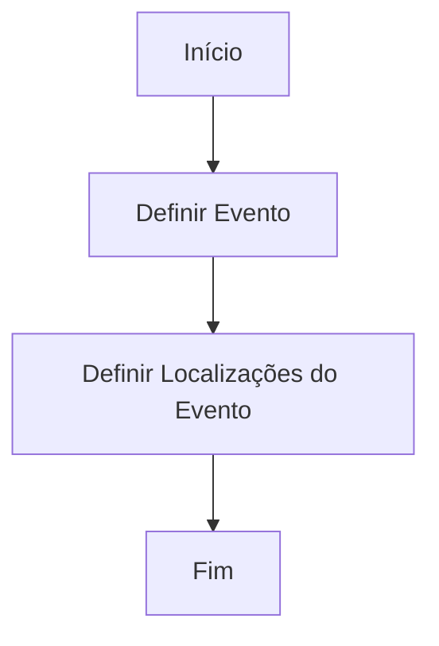

# Definição de Eventos Catastróficos — Processo de Documentação Reef

## 1. Metadados do Documento
- **Arquivo de Origem:** Não identificado
- **Tipo de Documento:** Procedimento
- **Domínio / Sistema:** Reef / Mapfre
- **Público-Alvo:** Negócio, Operação e usuários responsáveis pela definição de eventos
- **Data/Versão Identificada:** Não identificada

---

## 2. Resumo Executivo & Contexto de Negócio

O documento descreve, de forma resumida, o processo para definir um **Evento Catastrófico** no contexto de documentação Reef e Mapfre. O objetivo declarado é explicar os passos necessários para a definição desse tipo de evento.

O processo contém duas etapas sequenciais: primeiro, definir o evento; depois, definir as localizações associadas ao evento. Após essas etapas, o fluxo é encerrado.

O conteúdo faz referência ao repositório ou área de documentação Reef, denominado também como “DOCUMENTACIÓN Reef”, e a elementos de navegação como Soluções, Arquiteturas, APIs, Componentes, Cloud, Documentação e Zeus.

**Nota de Análise:** o documento não apresenta critérios para classificar um evento como catastrófico, campos obrigatórios, regras de validação, responsáveis operacionais, integrações, APIs, tecnologias ou contratos de dados.

---

## 3. Arquitetura, Componentes & Tecnologias Envolvidas

Os componentes e contextos explicitamente citados são:

- **Evento Catastrófico:** objeto ou entidade a ser definido no processo.
- **Localizações do Evento:** informações definidas após a criação ou definição do evento.
- **Reef:** contexto de documentação citado no material.
- **Mapfredocument:** termo apresentado no conteúdo bruto, sem detalhamento adicional.
- **Zeus:** item de navegação ou área referenciada, sem detalhamento adicional.
- **Owner:** `user:agonzalez_mapfre.com`.
- **Lifecycle:** `Approved Source`.
- **VL:** termo exibido junto ao ciclo de vida, sem explicação adicional.



**Nota de Análise:** o documento não detalha arquitetura de software, integração entre sistemas, armazenamento de dados, protocolos, ambientes ou tecnologias implementadas.

---

## 4. Regras de Negócio, Especificações Funcionais & Processos

### Processo de definição de Evento Catastrófico

1. **Definir Evento**
   - O processo inicia com a definição de um Evento Catastrófico.
   - O documento identifica esta atividade como “DEFINIR Evento (1)”.
   - Não são especificados atributos, campos, regras de elegibilidade ou validações para a definição do evento.

2. **Definir Localizações do Evento**
   - Após definir o Evento Catastrófico, devem ser definidas as localizações relacionadas ao evento.
   - O documento identifica esta atividade como “DEFINIR Ubicaciones Evento (2)”.
   - Não são detalhados formatos de endereço, abrangência geográfica, tipos de localização ou regras para associação entre localização e evento.

3. **Fim**
   - O fluxo é concluído após a definição das localizações do evento.

---

## 5. Tabelas de Parâmetros, Ambientes e Estruturas de Dados

| Item / Parâmetro | Descrição / Função | Tipo / Valores / Formato | Ambiente / Observações |
| :--- | :--- | :--- | :--- |
| Evento Catastrófico | Entidade central do processo de definição | Não especificado | Deve ser definido antes das localizações |
| Localizações do Evento | Localizações associadas ao Evento Catastrófico | Não especificado | Segunda etapa do fluxo |
| Reef | Contexto ou área de documentação mencionada | `DOCUMENTACIÓN Reef` | Sem detalhamento técnico |
| Mapfredocument | Termo exibido no conteúdo | Não especificado | Sem definição adicional |
| Owner | Proprietário indicado na documentação | `user:agonzalez_mapfre.com` | Conforme conteúdo bruto |
| Lifecycle | Situação de ciclo de vida apresentada | `Approved Source` | Conforme conteúdo bruto |
| VL | Sigla ou identificador exibido junto ao ciclo de vida | `VL` | Significado não detalhado |
| Idioma | Idioma apresentado na interface | `ES` | Conforme conteúdo bruto |
| Soluções | Item de navegação citado | Não especificado | Sem conteúdo adicional |
| Arquiteturas | Item de navegação citado | Não especificado | Sem conteúdo adicional |
| APIs | Item de navegação citado | Não especificado | Sem conteúdo adicional |
| Componentes | Item de navegação citado | Não especificado | Sem conteúdo adicional |
| Cloud | Item de navegação citado | Não especificado | Sem conteúdo adicional |
| Zeus | Item de navegação citado | Não especificado | Sem conteúdo adicional |

---

## 6. Bateria de Perguntas & Respostas para RAG (FAQ Sintético)

### P1: Qual é o objetivo do documento sobre Eventos Catastróficos?
**R:** O objetivo é explicar os passos a seguir para definir um Evento Catastrófico.

### P2: Quantas etapas existem no processo de definição de um Evento Catastrófico?
**R:** O processo possui duas etapas: definir o evento e definir as localizações do evento.

### P3: Qual atividade deve ser realizada primeiro no processo?
**R:** A primeira atividade é definir o Evento Catastrófico, identificada no documento como “DEFINIR Evento (1)”.

### P4: O que ocorre depois da definição do Evento Catastrófico?
**R:** Depois da definição do evento, devem ser definidas as localizações associadas ao Evento Catastrófico.

### P5: O processo termina após a definição das localizações do evento?
**R:** Sim. O fluxo apresentado indica “FIN” após a etapa “DEFINIR Ubicaciones Evento (2)”.

### P6: O documento informa quais campos devem ser preenchidos para criar um Evento Catastrófico?
**R:** Não. O conteúdo apenas informa que o evento deve ser definido, sem especificar campos, atributos ou validações.

### P7: O documento detalha como uma localização deve ser associada a um Evento Catastrófico?
**R:** Não. O documento apresenta a atividade de definir localizações do evento, mas não descreve regras de associação ou formatos de dados.

### P8: Qual sistema ou contexto documental é mencionado?
**R:** O documento menciona “DOCUMENTACIÓN Reef” e também apresenta referências a Reef e Mapfre.

### P9: Quem é o proprietário indicado no conteúdo da documentação?
**R:** O proprietário indicado é `user:agonzalez_mapfre.com`.

### P10: Qual é o ciclo de vida exibido no documento?
**R:** O ciclo de vida exibido é `Approved Source`, acompanhado pelo termo `VL`.

### P11: O documento descreve APIs ou integrações para o processo de Evento Catastrófico?
**R:** Não. Embora “APIs” apareça como item de navegação, o conteúdo não especifica endpoints, métodos HTTP, contratos ou integrações.

### P12: O documento fornece critérios para identificar um evento como catastrófico?
**R:** Não. O documento usa o termo “Evento Catastrófico”, mas não define critérios de classificação, limites, condições ou regras de negócio para caracterizá-lo.

---

## 7. Glossário de Termos, Siglas & Conceitos-Chave

- **Evento Catastrófico:** evento que deve ser definido no processo apresentado; o documento não fornece uma definição conceitual adicional.
- **Localizações do Evento / Ubicaciones Evento:** locais associados a um Evento Catastrófico, definidos na segunda etapa do fluxo.
- **Reef:** contexto ou área de documentação mencionada no documento.
- **Mapfre:** nome presente no contexto documental e no identificador do proprietário.
- **Mapfredocument:** termo citado literalmente, sem explicação adicional.
- **Owner:** campo que indica o proprietário da documentação.
- **Lifecycle:** campo que apresenta o ciclo de vida do conteúdo.
- **Approved Source:** valor exibido para o campo Lifecycle.
- **VL:** sigla ou identificador citado sem expansão ou definição.
- **Zeus:** item de navegação mencionado sem detalhamento funcional.
- **ES:** indicador de idioma exibido no conteúdo.

---

## 8. Notas Críticas, Riscos & Limitações

- O documento é extremamente resumido e não especifica os dados necessários para definir um Evento Catastrófico.
- Não há critérios de validação, aprovação, cancelamento ou alteração de eventos.
- Não há definição para “Evento Catastrófico”, “VL”, “Mapfredocument” ou “Zeus”.
- Não há identificação de ambiente, URL, servidor, API, autenticação, integração ou persistência de dados.
- O conteúdo original contém caracteres corrompidos em termos como `Catrastrócos` e `denir`; a transcrição fiel preserva essas ocorrências.
- As referências a Soluções, Arquiteturas, APIs, Componentes e Cloud aparecem como navegação, não como especificações técnicas.

---

## 9. Conteúdo Bruto Estruturado (Referência Fiel)

```text
--- [PÁGINA 1 DE 1] ---

DEFINICIÓN Eventos Catrastrócos
Objetivo
Explicar los pasos a seguir para denir un Evento catastróco
Proceso para la denición de un Evento Catastróco
DEFINIR
Evento (1)
DEFINIR
Ubicaciones
Evento(2)
FIN
1. DEFINIR Evento
2. DEFINIR Ubicaciones Evento
Documentation / DOCUMENTACIÓN Reef
DOCUMENTACIÓN Reef
Mapfredocument
DOCUMENTACIÓN Reef
Owner
user:agonzalez_mapfre.com
Lifecycle
Approved Source
 / 
 VL
Buscar Inicio Soluciones Arquitecturas APIs Componentes Cloud Documentación Zeus Reef Ayuda
ES
```
