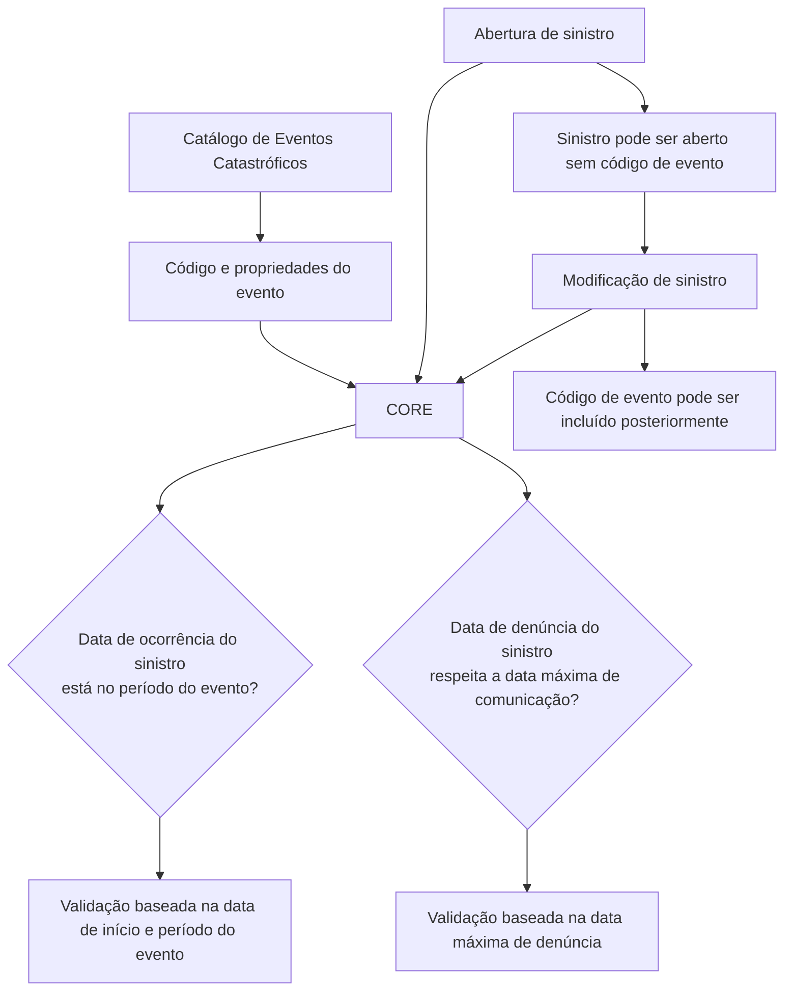

# Definição de Eventos Catastróficos no CORE — Catálogo, Propriedades e Validações de Sinistros

## 1. Metadados do Documento
- **Arquivo de Origem:** Não informado no conteúdo extraído
- **Tipo de Documento:** Especificação Técnica
- **Domínio / Sistema:** Reef / CORE / gestão de sinistros catastróficos
- **Público-Alvo:** Desenvolvedores, Analistas Funcionais, Operação e Negócio
- **Data/Versão Identificada:** Não identificada

---

## 2. Resumo Executivo & Contexto de Negócio

O documento define o catálogo de eventos catastróficos utilizado para agrupar sinistros originados por um mesmo evento determinado. Cada evento catastrófico possui um código identificador e propriedades descritivas, temporais e operacionais.

A manutenção de eventos catastróficos registra informações como nome, tipo de evento, período de ocorrência, prazo máximo para denúncia de sinistro, código de identificação eventualmente exigido por autoridades e descrição textual. O documento exemplifica tipos de eventos como terremoto e furacão.

O CORE utiliza as informações temporais do evento catastrófico durante a abertura e a modificação de sinistros. A data de ocorrência do sinistro é validada contra o período do evento, e a data de denúncia do sinistro é comparada com a data máxima de comunicação definida no catálogo.

O processo permite abrir um sinistro sem código de evento quando o evento ainda não foi registrado. Posteriormente, o código de evento pode ser incluído por meio da modificação do sinistro.

---

## 3. Arquitetura, Componentes & Tecnologias Envolvidas

O conteúdo menciona os seguintes componentes e contextos:

| Componente / Termo | Papel documentado |
| :--- | :--- |
| **Reef** | Repositório ou contexto de documentação onde o conteúdo está publicado. |
| **CORE** | Sistema que consulta dados do evento catastrófico durante a abertura e modificação de sinistros. |
| **Catálogo de eventos catastróficos** | Fonte das propriedades e restrições aplicadas aos sinistros vinculados a eventos. |
| **Sinistro** | Registro cuja ocorrência e denúncia podem ser validadas em relação ao evento catastrófico. |
| **Mantenimiento Eventos Catastróficos** | Funcionalidade ou tela mencionada para manutenção dos eventos catastróficos. |



**Nota de Análise:** O documento não detalha interfaces técnicas, métodos HTTP, contratos JSON, banco de dados, integrações, tecnologias de implementação ou regras de aprovação/reprovação após as validações do CORE.

---

## 4. Regras de Negócio, Especificações Funcionais & Processos

### Objetivo funcional

O catálogo existe para definir códigos de eventos catastróficos e agrupar sinistros que tenham ocorrido em consequência de um evento determinado.

### Identificação do evento

1. Cada evento catastrófico possui um **código de evento**.
2. O código de evento é a chave usada para identificar os diferentes eventos catastróficos que podem originar um sinistro.
3. Um sinistro pode ser aberto sem código de evento caso o evento ainda não tenha sido registrado.
4. O código de evento pode ser incluído posteriormente na modificação do sinistro.

### Caracterização do evento

1. O evento possui um nome.
2. O evento possui um tipo ou natureza, com exemplos documentados de terremoto e furacão.
3. O evento pode possuir descrição textual.
4. O evento pode possuir um código de identificação que, em determinados casos, deve ser informado às autoridades.

### Regras temporais

1. A data de início indica quando o evento catastrófico começou.
2. A hora de início indica o horário de início do evento e é opcional.
3. A data de fim indica quando o evento terminou e é opcional.
4. A hora final indica o horário em que o evento terminou.
5. A data de denúncia do evento determina a data-limite para denunciar um sinistro produzido por aquele evento catastrófico.

### Validação de data de ocorrência do sinistro

1. O CORE consulta a data de início do evento catastrófico.
2. A validação é realizada tanto na abertura quanto na modificação do sinistro.
3. O CORE valida que a data de ocorrência do sinistro esteja incluída no período do evento catastrófico.
4. A finalidade da regra é determinar se o sinistro é ou não consequência do evento.

### Validação de prazo de denúncia

1. O CORE consulta a data máxima de comunicação do sinistro definida para o evento.
2. A validação é realizada tanto na abertura quanto na modificação do sinistro.
3. A data máxima de comunicação é comparada com a data de denúncia informada ou modificada no sinistro.
4. A finalidade da regra é controlar que o sinistro não seja comunicado após o prazo máximo definido no catálogo.

---

## 5. Tabelas de Parâmetros, Ambientes e Estruturas de Dados

| Item / Parâmetro | Descrição / Função | Tipo / Valores / Formato | Ambiente / Observações |
| :--- | :--- | :--- | :--- |
| Código de evento | Chave para identificar os diferentes eventos catastróficos que podem originar um sinistro. | Código identificador; formato não detalhado. | Pode ser incluído posteriormente em um sinistro já aberto. |
| Nome do evento | Nome do evento catastrófico. | Texto; formato não detalhado. | Não há detalhamento adicional. |
| Tipo de evento | Natureza do evento catastrófico. | Exemplos: terremoto, furacão. | O documento menciona “Tipos de eventos”, sem lista completa. |
| Data de início do evento | Data em que o evento catastrófico começou. | Data; formato não detalhado. | Usada em controles com a data de ocorrência do sinistro. |
| Hora de início do evento | Horário de início do evento. | Hora; formato não detalhado. | Opcional. |
| Data fim do evento | Data em que o evento catastrófico terminou. | Data; formato não detalhado. | Opcional. |
| Hora final do evento | Horário de término do evento. | Hora; formato não detalhado. | O documento não declara explicitamente se é opcional. |
| Data de denúncia do evento | Data-limite para denunciar um sinistro produzido pelo evento catastrófico. | Data; formato não detalhado. | Consultada pelo CORE na abertura e modificação do sinistro. |
| Código de identificação do evento | Código identificador que, por vezes, deve ser informado às autoridades. | Código; formato não detalhado. | A obrigatoriedade e as autoridades não são detalhadas. |
| Descrição do evento | Descrição textual do evento. | Texto; formato não detalhado. | O documento repete a expressão “Descrição do evento”. |
| Data de ocorrência do sinistro | Data em que o sinistro ocorreu. | Data; formato não detalhado. | Validada contra o período do evento no CORE. |
| Data de denúncia do sinistro | Data informada ou modificada para a denúncia do sinistro. | Data; formato não detalhado. | Comparada com a data máxima de comunicação do evento. |

---

## 6. Bateria de Perguntas & Respostas para RAG (FAQ Sintético)

### P1: Qual é o objetivo do catálogo de eventos catastróficos?
**R:** O catálogo define diferentes códigos de eventos catastróficos para agrupar sinistros que tenham ocorrido em consequência de um evento determinado.

### P2: Qual propriedade identifica um evento catastrófico que pode originar um sinistro?
**R:** A propriedade **Código de evento** contém a chave utilizada para identificar os diferentes eventos catastróficos que podem originar um sinistro.

### P3: Posso abrir um sinistro quando o evento catastrófico ainda não foi registrado?
**R:** Sim. O documento informa que o sinistro pode ser aberto sem o código de evento. Posteriormente, o sinistro pode ser modificado para incluir o código de evento.

### P4: O CORE valida a data de ocorrência do sinistro em relação ao evento catastrófico?
**R:** Sim. Na abertura e na modificação do sinistro, o CORE consulta a data de início do evento catastrófico e valida que a data de ocorrência do sinistro esteja incluída no período do evento.

### P5: Qual é a finalidade da data de início do evento catastrófico?
**R:** A data de início indica quando o evento começou e é importante para realizar controles com a data de ocorrência do sinistro, verificando se o sinistro é ou não fruto do evento.

### P6: Como o CORE controla denúncias realizadas após o prazo do evento?
**R:** Na abertura e na modificação do sinistro, o CORE consulta a data máxima de comunicação definida para o evento e a compara com a data de denúncia introduzida ou modificada no sinistro.

### P7: Quais tipos de evento catastrófico são exemplificados no documento?
**R:** O documento cita terremoto e furacão como exemplos da natureza ou tipo de evento catastrófico. Não apresenta uma lista completa de tipos permitidos.

### P8: Quais campos de data e hora são opcionais para o evento catastrófico?
**R:** A hora de início do evento é explicitamente indicada como opcional. A data de fim do evento também é explicitamente indicada como opcional. O documento não afirma se a hora final é opcional.

### P9: Para que serve o código de identificação do evento?
**R:** O código de identificação do evento é um identificador que, em algumas situações, deve ser informado às autoridades. O documento não especifica as autoridades nem os critérios dessas situações.

### P10: Em quais operações do sinistro são realizadas as validações de evento?
**R:** As validações documentadas ocorrem tanto na abertura do sinistro quanto na modificação do sinistro.

---

## 7. Glossário de Termos, Siglas & Conceitos-Chave

- **CORE:** Sistema citado como responsável por consultar datas do evento catastrófico e validar informações durante a abertura e modificação de sinistros.
- **Evento catastrófico:** Evento identificado por código, nome, tipo, período e demais propriedades, capaz de originar sinistros.
- **Catálogo de eventos catastróficos:** Cadastro que centraliza os eventos catastróficos e suas propriedades.
- **Código de evento:** Chave para identificar eventos catastróficos que podem originar sinistros.
- **Sinistro:** Registro aberto ou modificado no CORE e potencialmente associado a um evento catastrófico.
- **Data máxima de comunicação:** Data-limite definida para comunicar ou denunciar um sinistro relacionado a determinado evento.
- **Reef:** Contexto ou repositório de documentação mencionado no conteúdo extraído.

---

## 8. Notas Críticas, Riscos & Limitações

- O documento não informa o formato, tamanho, domínio de valores ou unicidade do código de evento.
- O documento não fornece a lista completa de tipos de eventos catastróficos.
- O documento não especifica como o CORE trata sinistros cuja data de ocorrência ou denúncia não atende às validações.
- O conceito de “período do evento” é usado na validação da ocorrência, mas o texto não define explicitamente como a ausência da data de fim afeta esse período.
- A hora final do evento é descrita, mas não há indicação explícita de obrigatoriedade ou opcionalidade.
- Não há detalhes sobre métodos de integração, interfaces de manutenção, persistência de dados, permissões, auditoria ou contratos técnicos.
- Não há exemplo preenchido: o conteúdo termina em “Ejemplo:” sem apresentar dados adicionais.

---

## 9. Conteúdo Bruto Estruturado (Referência Fiel)

```text
--- [PÁGINA 1 DE 2] ---

DEFINICIÓN de Eventos Catastróficos
Objetivo
Definir los diferentes códigos de eventos catastróficos, para poder agrupar siniestros que hayan ocurrido por un evento determinado.
Imagen Mantenimiento Eventos Catrastróficos:
Propiedades
Documentation / DOCUMENTACIÓN Reef
DOCUMENTACIÓN Reef
Mapfredocument
DOCUMENTACIÓN Reef
Owner
user:agonzalez_mapfre.com
Lifecycle
Approved Source
 /
 VL
Buscar Inicio Soluciones Arquitecturas APIs Componentes Cloud Documentación Zeus Reef Ayuda
ES


--- [PÁGINA 2 DE 2] ---

Código de evento
Esta propiedad contendrá la clave por la que se va a identificar los distintos eventos catrastróficos que pueden originar un siniestro.
Nombre del evento
Esta propiedad contendrá el nombre del evento catastrófico.
Tipo de evento
Esta propiedad contiene la naturaleza de evento catastrófico, si es terremoto, huracán, etc. Tipos de eventos
Fecha de inicio del evento
Esta propiedad indica la fecha en la que se inició el evento catastrófico. Esta fecha es importante ya que se podrá realizar controles con la
fecha de ocurrencia del siniestro, para saber si el siniestro es fruto o no del evento
Hora de inicio del evento
Contiene a qué hora se inició el evento. Es opcional
Fecha fin del evento
Esta propiedad contiene la fecha en la que finalizó el evento catastrófico opcional
Hora final del evento
Contiene la hora en la que finalizó el evento.
Fecha de denuncia del evento
Esta propiedad contiene la fecha límite para denunciar un siniestro producido por este evento catastrófico
Código de identificación del evento
Esta propiedad contiene un código identificador del evento por el que a veces hay que informar a las autoridades.
Descripción del evento
Descripción del evento del evento
Preguntas frecuentes
¿Qué pasa si cuando abro el siniestro no se ha registrado el evento?
R/ Se puede abrir el siniestro sin el código de evento y modificarlo luego para incluir el código de evento.
¿Se controla en CORE que el evento se haya producido dentro de la fecha de ocurrencia del siniestro?
R/Si, en la apertura del siniestro y en la modificación se consulta la fecha de inicio en la que se produjo el evento catastrófico y se valida
que la fecha de ocurrencia esté incluida en ese periodo.
¿Se controla en CORE que el siniestro no se notifique después de la fecha de denuncia máxima definida en el catálogo?
R/Si, en la apertura del siniestro y en la modificación del siniestro se consulta la fecha máxima de comunicación del siniestro para ese
evento y se compara con la fecha de denuncia introducida o modificada del siniestro.
Ejemplo:
```
