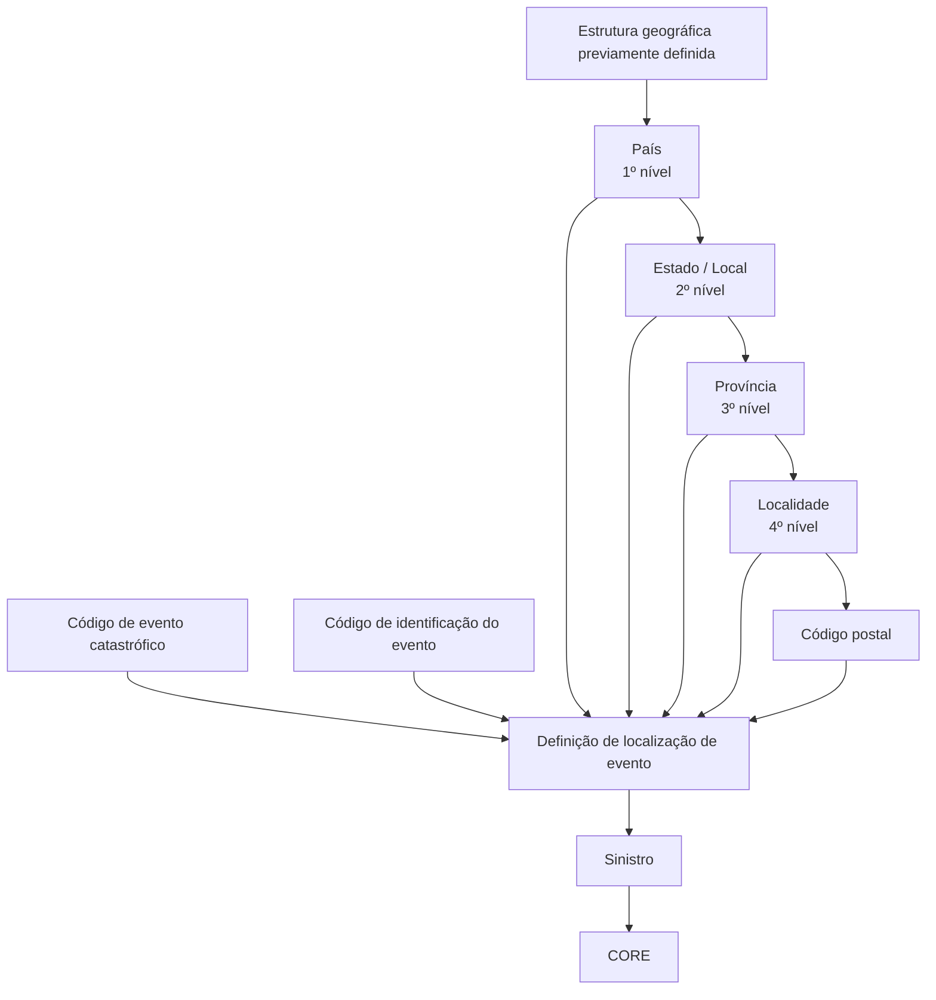

# Definição de Localizações de Eventos Catastróficos — Documentação Reef

## 1. Metadados do Documento
- **Arquivo de Origem:** Não identificado no conteúdo fornecido
- **Tipo de Documento:** Especificação Técnica / Documentação Funcional
- **Domínio / Sistema:** Reef / CORE / Mapfre
- **Público-Alvo:** Desenvolvedores, Arquitetos, Analistas Funcionais e Operação
- **Data/Versão Identificada:** Não identificada

---

## 2. Resumo Executivo & Contexto de Negócio

O documento descreve a definição e a manutenção de localizações geográficas associadas a eventos catastróficos. O objetivo funcional é permitir registrar as localizações onde os eventos ocorreram, utilizando uma estrutura geográfica previamente definida.

A estrutura geográfica apresentada possui níveis hierárquicos de país, estado/local, província, localidade e código postal. Os níveis geográficos admitem códigos genéricos com o significado de “em todos”, permitindo que uma definição de localização tenha abrangência ampla em determinados níveis da hierarquia.

A identificação de um evento catastrófico é feita por meio de um código de evento e de um código de identificação do evento. O documento relaciona esses eventos à possibilidade de originarem um sinistro, mas não detalha contratos de integração, métodos HTTP, modelos de dados completos, regras de persistência ou validações técnicas implementadas.

O estado de habilitação da definição também é controlado por uma marca de inabilitação. A documentação esclarece que o CORE não controla se o evento ocorreu efetivamente no local de ocorrência do sinistro; essa validação poderia ser implementada na estrutura do local do sinistro, quando o sinistro estiver associado a um evento, ou por meio de um controle técnico.

---

## 3. Arquitetura, Componentes & Tecnologias Envolvidas

Os elementos e sistemas explicitamente citados são:

- **Reef:** Contexto da documentação apresentada.
- **CORE:** Sistema no qual não existe controle descrito para validar se o evento ocorreu no local de ocorrência do sinistro.
- **Mapfre:** Referência presente no contexto da documentação.
- **Eventos catastróficos:** Eventos identificados que podem originar um sinistro.
- **Estrutura geográfica:** Pré-requisito para a definição de localizações de eventos.
- **Sinistro:** Entidade associável a um evento, cujo local de ocorrência pode ser objeto de validação.

A relação funcional documentada é a associação entre um evento catastrófico, uma definição de localização geográfica e, potencialmente, um sinistro.



> **Nota de Análise:** O documento não descreve interfaces, APIs, bancos de dados, tecnologias de implementação, ambientes, URLs, portas, componentes de infraestrutura ou contratos JSON/XML.

---

## 4. Regras de Negócio, Especificações Funcionais & Processos

### 4.1 Objetivo da definição de localizações

A funcionalidade tem como objetivo definir as localizações geográficas nas quais ocorreram eventos. Essas localizações se aplicam a eventos catastróficos que podem originar um sinistro.

### 4.2 Pré-requisito geográfico

A estrutura geográfica deve estar definida previamente antes da utilização da definição de localizações de eventos catastróficos.

### 4.3 Hierarquia geográfica

A estrutura geográfica citada é composta pelos seguintes níveis:

1. País: primeiro nível da estrutura geográfica.
2. Estado/local: segundo nível da estrutura geográfica.
3. Província: terceiro nível da estrutura geográfica.
4. Localidade: quarto nível da estrutura geográfica.
5. Código postal: informação complementar de localização.

### 4.4 Uso de códigos genéricos

Em todos os níveis da estrutura geográfica são admitidos códigos genéricos. O significado funcional indicado para um código genérico é “em todos”.

O documento menciona explicitamente a possibilidade de código genérico para:

- Estado/local;
- Província;
- Localidade;
- Código postal.

> **Nota de Análise:** Embora o documento declare que todos os níveis da estrutura geográfica admitem códigos genéricos, a descrição individual do campo de país não explicita essa possibilidade. Não há detalhamento sobre o formato, valor literal ou mecanismo de interpretação desses códigos genéricos.

### 4.5 Identificação de eventos

O código de evento é a chave utilizada para identificar os diferentes eventos catastróficos que podem originar um sinistro.

O código de identificação do evento contém um código identificador do evento. O documento não diferencia tecnicamente o formato, a unicidade, a obrigatoriedade ou a relação entre o código de evento e o código de identificação do evento.

### 4.6 Habilitação da definição

A marca de inabilitação indica se a definição de localização de evento está habilitada ou inabilitada para uso.

### 4.7 Validação entre evento e local de ocorrência do sinistro

O FAQ do documento afirma que o CORE não controla se o evento ocorreu no local de ocorrência do sinistro.

A validação poderia ser colocada em uma das seguintes alternativas:

1. Na estrutura do local do sinistro, caso o sinistro esteja associado a um evento.
2. Em um controle técnico.

> **Nota de Análise:** O documento não determina qual alternativa deve ser implementada, nem descreve regras de comparação geográfica, tratamento de códigos genéricos, mensagens de erro ou comportamento quando a validação falhar.

---

## 5. Tabelas de Parâmetros, Ambientes e Estruturas de Dados

| Item / Parâmetro | Descrição / Função | Tipo / Valores / Formato | Ambiente / Observações |
| :--- | :--- | :--- | :--- |
| Código de evento | Chave para identificar os diferentes eventos catastróficos que podem originar um sinistro. | Código; formato não detalhado. | Não informado. |
| Código de identificação do evento | Código identificador do evento. | Código; formato não detalhado. | Não informado. |
| Código de país | Representa o país, primeiro nível da estrutura geográfica. | Código; formato não detalhado. | A documentação informa genericamente que todos os níveis admitem códigos genéricos, mas não detalha isso especificamente para país. |
| Código de estado | Representa o local/estado, segundo nível da estrutura geográfica. | Código; pode ser código genérico. | Código genérico significa “em todos”. |
| Código de província | Representa o terceiro nível da estrutura geográfica. | Código; pode ser código genérico. | Código genérico significa “em todos”. |
| Código de localidade | Representa o quarto nível da estrutura geográfica. | Código; pode ser código genérico. | Código genérico significa “em todos”. |
| Código postal | Representa o código postal da localização. | Código; pode ser código genérico. | Código genérico significa “em todos”. |
| Marca inabilitada | Indica se a definição está habilitada ou inabilitada para ser usada. | Indicador; valores exatos não detalhados. | Não informado. |
| Estrutura geográfica | Base hierárquica necessária para definir localizações de eventos. | País, estado/local, província, localidade e código postal. | Deve estar definida previamente. |
| Validação de local do sinistro | Controle para verificar se um evento ocorreu no local de ocorrência de um sinistro. | Não detalhado. | O CORE não executa esse controle segundo o FAQ. |

| Sistema / Componente | Papel documentado | Limitação ou observação |
| :--- | :--- | :--- |
| Reef | Contexto da documentação de localizações de eventos catastróficos. | Não são detalhados módulos ou integrações do Reef. |
| CORE | Sistema citado na pergunta frequente sobre validação do evento no local do sinistro. | Não controla se o evento ocorreu no local de ocorrência. |
| Estrutura do local do sinistro | Possível ponto para implementar validação quando o sinistro estiver associado a um evento. | A implementação não é especificada. |
| Controle técnico | Alternativa possível para a validação de local de ocorrência. | Não há detalhamento técnico. |

---

## 6. Bateria de Perguntas & Respostas para RAG (FAQ Sintético)

### P1: Qual é o objetivo da definição de localizações de eventos catastróficos?
**R:** O objetivo é definir as localizações geográficas nas quais ocorreram eventos. A definição utiliza uma estrutura geográfica previamente estabelecida e é aplicável aos eventos catastróficos que podem originar um sinistro.

### P2: Qual pré-requisito é necessário antes de configurar localizações de eventos?
**R:** A estrutura geográfica deve estar definida previamente. O documento não descreve como essa estrutura é cadastrada, mantida ou validada.

### P3: Quais níveis compõem a estrutura geográfica dos eventos?
**R:** A estrutura contém país como primeiro nível, estado ou local como segundo nível, província como terceiro nível, localidade como quarto nível e código postal como elemento de localização associado.

### P4: O que significa um código genérico na estrutura geográfica?
**R:** Um código genérico significa “em todos”. O documento informa que todos os níveis da estrutura geográfica admitem códigos genéricos e explicita essa possibilidade para estado/local, província, localidade e código postal.

### P5: Qual é a função do código de evento?
**R:** O código de evento é a chave usada para identificar os distintos eventos catastróficos que podem originar um sinistro.

### P6: Qual é a diferença entre código de evento e código de identificação do evento?
**R:** O documento informa que o código de evento identifica os diferentes eventos catastróficos e que o código de identificação do evento contém um código identificador do evento. Contudo, a documentação não apresenta uma distinção técnica adicional entre os dois campos.

### P7: Como a definição informa se uma localização de evento pode ser utilizada?
**R:** A marca inabilitada indica se a definição está inabilitada ou habilitada para uso. Os valores permitidos, o formato do campo e as regras de alteração não são detalhados.

### P8: O CORE valida se um evento ocorreu no local de ocorrência do sinistro?
**R:** Não. Segundo a seção de perguntas frequentes, o CORE não controla se o evento ocorreu no local de ocorrência do sinistro.

### P9: Onde poderia ser implementada a validação entre um evento e o local de ocorrência de um sinistro?
**R:** A validação poderia ser implementada na estrutura do local do sinistro, caso o sinistro esteja associado a um evento, ou em um controle técnico.

### P10: A documentação define como comparar o local do sinistro com a localização do evento?
**R:** Não. A documentação apenas indica possíveis locais para implementar a validação. Não há regras de comparação geográfica, critérios de compatibilidade, comportamento para códigos genéricos ou mensagens de erro.

### P11: Existem APIs, URLs ou contratos de integração para a manutenção das localizações de eventos?
**R:** Não. O conteúdo fornecido não apresenta APIs, URLs, métodos HTTP, contratos de mensagens, tabelas de banco de dados ou tecnologias de integração.

### P12: Um evento catastrófico pode estar relacionado a um sinistro?
**R:** Sim. O documento afirma que os eventos catastróficos identificados pelo código de evento podem originar um sinistro e menciona a situação em que um sinistro foi associado a um evento.

---

## 7. Glossário de Termos, Siglas & Conceitos-Chave

- **CORE:** Sistema citado como não responsável por controlar se o evento ocorreu no local de ocorrência do sinistro.
- **Evento catastrófico:** Evento identificado por código que pode originar um sinistro.
- **Código de evento:** Chave para identificar eventos catastróficos distintos.
- **Código de identificação do evento:** Código identificador associado ao evento; sem detalhamento adicional no documento.
- **Estrutura geográfica:** Hierarquia de localização composta por país, estado/local, província, localidade e código postal.
- **Código genérico:** Código que significa “em todos” em um nível da estrutura geográfica.
- **Sinistro:** Entidade que pode ser originada por um evento catastrófico e associada a um evento.
- **Marca inabilitada:** Propriedade que define se uma definição está habilitada ou inabilitada para uso.
- **Reef:** Contexto ou sistema de documentação citado no conteúdo.
- **Mapfre:** Referência corporativa presente nos metadados visíveis da documentação.

---

## 8. Notas Críticas, Riscos & Limitações

- O documento não identifica o arquivo de origem, data, versão, autor técnico, ambiente ou histórico de alterações.
- Não há definição do formato dos códigos de evento, identificação de evento, país, estado, província, localidade ou código postal.
- Não são especificados os valores concretos, a sintaxe ou as regras de precedência dos códigos genéricos.
- Não há regras detalhadas para validar a compatibilidade entre a localização de um evento e o local de ocorrência de um sinistro.
- O CORE não realiza o controle de que o evento tenha ocorrido no local do sinistro.
- A validação sugerida na estrutura do local do sinistro ou em um controle técnico permanece como possibilidade, não como implementação confirmada.
- Não são apresentados endpoints, integrações, contratos de dados, persistência, auditoria, segurança, permissões ou mecanismos de tratamento de erro.
- Não há detalhamento adicional sobre a imagem de manutenção de localizações de eventos catastróficos mencionada no texto extraído.

---

## 9. Conteúdo Bruto Estruturado (Referência Fiel)

```text
--- [PÁGINA 1 DE 2] ---

DEFINICIÓN de Ubicaciones de Eventos
Objetivo
Denir las ubicaciones geográcas en las que han ocurrido los eventos. En todos los niveles de la estructura geográca se admiten códigos
genéricos que signica "en todos". La estructura geográca tiene que estar denida previamente.
Imagen Mantenimiento Ubicaciones de Eventos Catrastrócos:
Propiedades
Documentation / DOCUMENTACIÓN Reef
DOCUMENTACIÓN Reef
Mapfredocument
DOCUMENTACIÓN Reef
Owner
user:agonzalez_mapfre.com
Lifecycle
Approved Source
 /
 VL
Buscar Inicio Soluciones Arquitecturas APIs Componentes Cloud Documentación Zeus Reef Ayuda
ES


--- [PÁGINA 2 DE 2] ---

Código de evento
Esta propiedadcontendrá la clave por la que se va a identicar los distintos eventos catrastrócos que pueden originar un siniestro.
Código de identicación del evento
Esta propiedadcontiene un código identicador del evento.
Código de país
Esta propiedadcontiene el país, primer nivel de la estructura geográca
Código de estado
Esta propiedadcontiene el local,segundo nivel de la estructura geográca. Puede ser código genérico.
Código de provincia
Esta propiedadcontiene el tercer nivel de la estructura geográca. Puede ser código genérico.
Código de localidad
Esta propiedadcontiene el cuarto nivel de la estructura geográca. Puede ser código genérico.
Código de postal
Esta propiedadcontiene el código postal. Puede ser código genérico.
marca inhabilitada
Esta propiedadindica si esta denición está inhabilitada o habilitada para ser usada.
Preguntas frecuentes
¿Se controla en CORE que el evento se haya ocurrido en el lugar de ocurrencia?
R/No, la información del lugar del siniestro no es CORE, se podría poner la validación en la estructura del lugar del siniestro, si se ha
asociado el siniestro a un evento, o en un control técnico.
```
