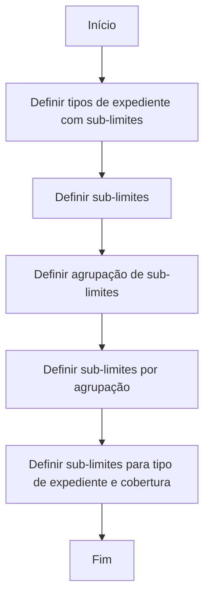

# Definição de Sub-limites para Tipos de Expediente e Coberturas

## 1. Metadados do Documento
- **Arquivo de Origem:** `Não identificado — texto bruto fornecido na solicitação`
- **Tipo de Documento:** `Procedimento`
- **Domínio / Sistema:** `Reef / Mapfredocument — definição de sub-limites`
- **Público-Alvo:** `Não identificado no conteúdo`
- **Data/Versão Identificada:** `Não identificada`

---

## 2. Resumo Executivo & Contexto de Negócio

O documento descreve o procedimento para definir expedientes cujas coberturas possuem um detalhamento de conceitos indenizáveis e os respectivos limites. Esses detalhes e limites são denominados **sub-limites**.

O objetivo explícito é explicar os passos necessários para configurar sub-limites associados aos tipos de expediente. O processo apresentado estabelece uma sequência de cinco definições, iniciando pela identificação dos tipos de expediente que terão sub-limites e terminando na definição de sub-limites para a combinação de tipo de expediente e cobertura.

O fluxo contempla a criação de sub-limites, o agrupamento desses sub-limites e a associação de sub-limites por agrupamento. A estrutura sugere que os conceitos indenizáveis e seus limites podem ser organizados em agrupações antes da vinculação final a uma cobertura de determinado tipo de expediente.

O conteúdo foi localizado em uma área de documentação intitulada `DOCUMENTACIÓN Reef`, com referência a `Mapfredocument`. O texto não apresenta detalhes adicionais sobre interfaces, regras de cálculo, contratos de integração, usuários autorizados ou comportamento técnico do sistema.

> **Nota de Análise:** O documento apresenta apenas o objetivo e as cinco etapas do processo de definição de sub-limites. Não há detalhamento adicional sobre campos obrigatórios, valores permitidos, métodos de cálculo, validações, APIs ou persistência de dados.

---

## 3. Arquitetura, Componentes & Tecnologias Envolvidas

Os elementos identificados no conteúdo são:

- **Reef:** domínio ou área de documentação referenciada como `DOCUMENTACIÓN Reef`.
- **Mapfredocument:** ambiente ou repositório documental mencionado no rodapé do conteúdo.
- **Tipos de Expediente:** entidades para as quais podem ser definidos sub-limites.
- **Cobertura:** entidade associada à definição final de sub-limites.
- **Sub-limites:** detalhe dos conceitos que podem ser indenizados e dos limites de cada conceito.
- **Agrupação de Sub-limites:** estrutura de agrupamento aplicável aos sub-limites.

O documento não descreve arquitetura de software, componentes técnicos, microsserviços, bancos de dados, integrações ou tecnologias de implementação. O diagrama abaixo representa exclusivamente o processo funcional apresentado.



---

## 4. Regras de Negócio, Especificações Funcionais & Processos

### Objetivo funcional

O processo existe para definir os expedientes cujas coberturas terão:

1. Um detalhe dos conceitos que podem ser indenizados.
2. Os limites correspondentes a cada conceito indenizável.
3. Esses detalhes e limites são chamados de **sub-limites**.

### Processo de definição de sub-limites

1. **Definir tipos de expediente com sub-limite**
   - Identificar ou definir os tipos de expediente que utilizarão sub-limites.
   - Esta etapa inicia o processo de configuração.

2. **Definir sub-limites**
   - Definir os sub-limites que representam o detalhe de conceitos indenizáveis e os limites associados.
   - O documento não informa atributos, formatos, valores ou critérios de validação para um sub-limite.

3. **Definir agrupações de sub-limites**
   - Definir agrupações para os sub-limites.
   - O documento não especifica se uma agrupação pode conter múltiplos sub-limites, nem regras de exclusividade ou hierarquia.

4. **Definir sub-limites por agrupação**
   - Associar ou definir sub-limites no contexto de uma agrupação.
   - O documento não detalha critérios para essa associação.

5. **Definir sub-limites para tipo de expediente e cobertura**
   - Realizar a definição final de sub-limites para a combinação de tipo de expediente e cobertura.
   - Esta etapa encerra o processo descrito.

### Restrições e detalhamento ausente

- Não foram informados critérios de elegibilidade para tipos de expediente.
- Não foram informados valores monetários, unidades, moedas ou fórmulas de limite.
- Não foram informados papéis, permissões ou responsabilidades operacionais.
- Não foram descritos fluxos de aprovação, publicação, alteração ou exclusão de sub-limites.
- Não foram identificados contratos de API, métodos HTTP, payloads JSON, tabelas de banco de dados ou trilhas de auditoria.

---

## 5. Tabelas de Parâmetros, Ambientes e Estruturas de Dados

| Item / Parâmetro | Descrição / Função | Tipo / Valores / Formato | Ambiente / Observações |
| :--- | :--- | :--- | :--- |
| Sub-limites | Detalhe dos conceitos que podem ser indenizados e dos limites de cada conceito. | Não especificado. | Aplicável a coberturas de expedientes. |
| Tipo de Expediente | Entidade para a qual pode ser definida a utilização de sub-limites. | Não especificado. | Primeira e última etapa do processo. |
| Cobertura | Entidade associada à definição final de sub-limites. | Não especificado. | Relacionada ao tipo de expediente na etapa final. |
| Agrupação de Sub-limites | Estrutura utilizada para agrupar sub-limites. | Não especificado. | Definida após a criação dos sub-limites. |
| Sub-limites por Agrupação | Definição ou associação de sub-limites dentro de uma agrupação. | Não especificado. | Quarta etapa do processo. |
| DOCUMENTACIÓN Reef | Área de documentação referenciada pelo conteúdo. | Nome de seção ou repositório documental. | Referência apresentada no rodapé. |
| Mapfredocument | Referência documental exibida no conteúdo. | Não especificado. | Sem detalhamento técnico adicional. |
| Lifecycle | Campo exibido na referência documental. | `Approved` | Associado ao conteúdo exibido. |
| Owner | Campo exibido na referência documental. | `user:agonzalez_mapfre.com` | Valor literal presente no texto. |
| Source | Campo exibido na referência documental. | `VL` | Valor literal presente no texto. |

---

## 6. Bateria de Perguntas & Respostas para RAG (FAQ Sintético)

### P1: Qual é o objetivo do procedimento de definição de sub-limites?
**R:** O objetivo é explicar os passos para definir os expedientes cujas coberturas terão detalhados os conceitos que podem ser indenizados e os limites aplicáveis a cada conceito. Esses detalhes e limites são chamados de sub-limites.

### P2: O que são sub-limites no contexto do documento?
**R:** Sub-limites são o detalhe dos conceitos que podem ser indenizados em uma cobertura e os limites correspondentes a cada um desses conceitos.

### P3: Qual é a primeira etapa do processo de definição de sub-limites?
**R:** A primeira etapa é definir os tipos de expediente que terão sub-limites.

### P4: Quantas etapas o processo de definição de sub-limites possui?
**R:** O processo apresentado possui cinco etapas: definir tipos de expediente com sub-limites, definir sub-limites, definir agrupações de sub-limites, definir sub-limites por agrupação e definir sub-limites para tipo de expediente e cobertura.

### P5: Em que momento as agrupações de sub-limites são definidas?
**R:** As agrupações de sub-limites são definidas após a etapa de definição dos sub-limites e antes da etapa de definição de sub-limites por agrupação.

### P6: Qual é a etapa final do fluxo de definição de sub-limites?
**R:** A etapa final é definir os sub-limites para a combinação de tipo de expediente e cobertura.

### P7: O documento especifica valores, fórmulas ou moedas para os limites indenizáveis?
**R:** Não. O documento apenas informa que existem limites para conceitos indenizáveis, sem especificar valores, fórmulas, unidades ou moedas.

### P8: O documento descreve APIs ou contratos técnicos para a configuração de sub-limites?
**R:** Não. O conteúdo não apresenta métodos HTTP, APIs, contratos JSON, modelos de dados ou detalhes de integração técnica.

### P9: O documento informa quais usuários podem configurar tipos de expediente, agrupações ou sub-limites?
**R:** Não. Não há definição de perfis de acesso, permissões ou responsabilidades operacionais para a configuração de sub-limites.

### P10: Onde o conteúdo de definição de sub-limites está referenciado?
**R:** O conteúdo apresenta referência à área `DOCUMENTACIÓN Reef` e a `Mapfredocument`. Também são exibidos os campos `Lifecycle: Approved`, `Owner: user:agonzalez_mapfre.com` e `Source: VL`.

---

## 7. Glossário de Termos, Siglas & Conceitos-Chave

- **Sub-limites:** detalhe dos conceitos que podem ser indenizados e dos limites de cada conceito.
- **Tipo de Expediente:** tipo de expediente para o qual podem ser definidos sub-limites.
- **Cobertura:** entidade vinculada à definição final de sub-limites em conjunto com o tipo de expediente.
- **Agrupação de Sub-limites:** agrupamento definido para organizar sub-limites.
- **Sub-limites por Agrupação:** definição ou associação de sub-limites em uma agrupação.
- **Reef:** nome identificado na área `DOCUMENTACIÓN Reef`; o documento não expande ou define a sigla.
- **Mapfredocument:** referência documental exibida no conteúdo; sem definição adicional.
- **Lifecycle:** campo de ciclo de vida documental, apresentado com o valor `Approved`.
- **VL:** valor exibido no campo `Source`; o significado não é definido no conteúdo.

---

## 8. Notas Críticas, Riscos & Limitações

- O documento não detalha como os sub-limites são cadastrados, alterados, consultados ou removidos.
- Não há definição de critérios de validação para limites, conceitos indenizáveis, agrupações ou associações com coberturas.
- Não há informações sobre consequências operacionais caso um tipo de expediente ou cobertura não possua sub-limites configurados.
- Não há especificação de permissões, segregação de funções, aprovação ou auditoria das alterações.
- Não há detalhes sobre integrações, arquitetura técnica, banco de dados, interfaces ou APIs.
- A referência `Checking links...` aparece no conteúdo, mas não informa resultado de validação de links.
- A área documental indica `Lifecycle: Approved`, porém não há data, versão ou histórico de alterações disponível no texto extraído.

---

## 9. Conteúdo Bruto Estruturado (Referência Fiel)

```text
--- [PÁGINA 1 DE 1] ---

DEFINICIÓN Sub-límites
Objetivo
Explicar los pasos a seguir para denir los expedientes cuyas coberturas van a tener denidos un detalle de los conceptos que se pueden
indemnizar y los límites de cada uno de ellos, llamados sub-límites.
Proceso para la denición de Sub-límites de los Tipos de Expediente
DEFINIR
Tipos expediente
con Sub-límites
DEFINIR
Sub-límites
DEFINIR
Agrupación
de Sub-límites
DEFINIR
Sub-límites
por Agrupación
DEFINIR
Sub-límites
Tipo de Expediente
Cobertura
FIN
1. DEFINIR Tipos expediente con Sub-límite
2. DEFINIR Sub-límites
3. DEFINIR Agrupaciones de Sub-límites
4. DEFINIR Sub-límites por agrupación
5. DEFINIR Sub-límites Tipo de Expediente Cobertura
Checking links...
Ejemplo:
Documentation / DOCUMENTACIÓN Reef
DOCUMENTACIÓN Reef
Mapfredocument
DOCUMENTACIÓN Reef
Owner
user:agonzalez_mapfre.com
Lifecycle
Approved Source
 / 
 VL
Buscar Inicio Soluciones Arquitecturas APIs Componentes Cloud Documentación Zeus Reef Ayuda
ES
```
