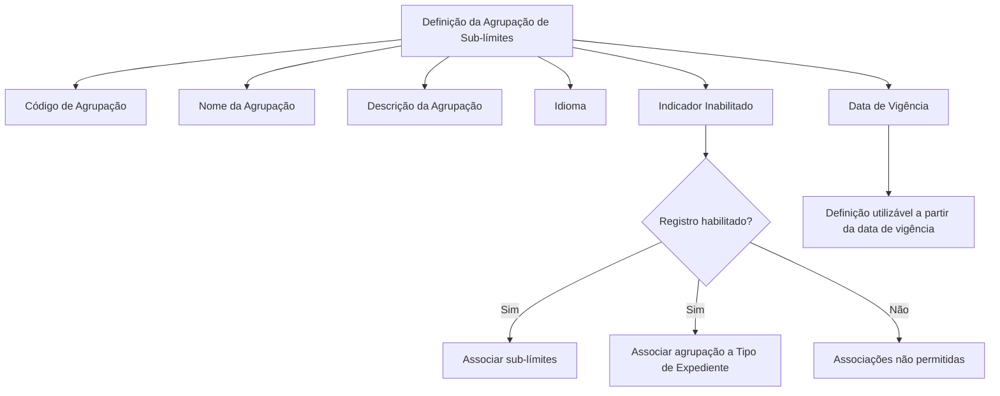

# Definição de Agrupações de Sub-limites — Documentação Reef

## 1. Metadados do Documento
- **Arquivo de Origem:** Não identificado no conteúdo fornecido
- **Tipo de Documento:** Especificação Funcional
- **Domínio / Sistema:** Reef / Mapfredocument
- **Público-Alvo:** Negócio, analistas funcionais e usuários responsáveis pela configuração de agrupações de sub-limites
- **Data/Versão Identificada:** Não identificada
- **Lifecycle Identificado:** Approved
- **Owner Identificado:** `user:agonzalez_mapfre.com`

---

## 2. Resumo Executivo & Contexto de Negócio

O documento descreve a definição de agrupações de sub-límites no contexto da documentação Reef. O objetivo declarado é explicar como definir agrupações que, posteriormente, receberão associação de sub-límites.

Uma agrupação de sub-límites possui uma chave identificadora, um nome, uma descrição, um idioma, um indicador de habilitação e uma data de vigência. Esses atributos compõem a definição necessária para que uma agrupação seja reconhecida e utilizada pelo sistema.

A habilitação do registro determina se a agrupação pode receber associações de sub-límites ou ser associada a um Tipo de Expediente. A data de vigência estabelece a partir de qual data a definição pode ser utilizada pelo sistema.

O conteúdo fornecido apresenta propriedades funcionais da agrupação, mas não detalha telas, APIs, métodos HTTP, contratos JSON, persistência de dados, regras de unicidade, valores permitidos para idiomas, nem procedimentos operacionais de criação ou alteração.

---

## 3. Arquitetura, Componentes & Tecnologias Envolvidas

### Sistemas, domínios e componentes citados

| Componente / Termo | Papel identificado no documento |
| :--- | :--- |
| Reef | Contexto da documentação apresentada como “DOCUMENTACIÓN Reef”. |
| Mapfredocument | Termo exibido na área de documentação. O papel técnico não é detalhado. |
| Agrupação de sub-límites | Entidade funcional definida para posterior associação de sub-límites. |
| Sub-límites | Elementos que podem ser associados a uma agrupação de sub-límites. |
| Tipo de Expediente | Entidade à qual uma agrupação pode ser associada, desde que o registro esteja habilitado. |
| Código de Agrupação | Chave da agrupação de sub-límites. |
| Idioma | Código do idioma em que os textos da agrupação estão definidos. |
| Data de Vigência | Data a partir da qual a definição pode ser utilizada pelo sistema. |



**Nota de Análise:** O documento descreve relações funcionais entre agrupações, sub-límites e Tipo de Expediente, mas não apresenta uma arquitetura de software, componentes técnicos, integrações ou protocolos de comunicação.

---

## 4. Regras de Negócio, Especificações Funcionais & Processos

### Objetivo funcional

1. Definir agrupações.
2. Associar sub-límites posteriormente às agrupações definidas.
3. Permitir, quando o registro estiver habilitado, a associação da agrupação a um Tipo de Expediente.

### Propriedades da agrupação de sub-límites

1. **Código de Agrupação**
   - Contém a chave da agrupação de sub-límites.
   - O documento não informa formato, tamanho, regra de geração ou condição de unicidade para a chave.

2. **Nome da agrupação**
   - Contém o nome atribuído à chave de agrupação.
   - O documento não define obrigatoriedade, tamanho máximo ou convenção de nomenclatura.

3. **Descrição da Agrupação**
   - Contém uma descrição da agrupação.
   - A finalidade é detalhar melhor o que será associado à agrupação.

4. **Idioma**
   - Contém o código do idioma no qual os textos estão definidos.
   - Os idiomas são codificados.
   - O documento não lista códigos de idioma aceitos nem especifica o padrão de codificação.

5. **Inabilitado**
   - Indica se o registro está habilitado ou não.
   - Um registro deve estar habilitado para permitir associação de sub-límites.
   - Um registro deve estar habilitado para permitir associação da agrupação a um Tipo de Expediente.
   - O documento não especifica os valores técnicos usados para representar habilitado ou inabilitado.

6. **Fecha Vigencia / Data de Vigência**
   - Indica a data em que a definição entra em vigor.
   - A definição pode ser utilizada pelo sistema a partir dessa data.
   - O documento não informa formato de data, comportamento para data futura, retroatividade ou tratamento para data ausente.

### Fluxo funcional identificado

1. Definir uma agrupação de sub-límites.
2. Informar o código, nome, descrição, idioma, condição de habilitação e data de vigência.
3. Aguardar ou respeitar a entrada em vigor definida pela data de vigência.
4. Quando o registro estiver habilitado, associar sub-límites à agrupação.
5. Quando o registro estiver habilitado, associar a agrupação a um Tipo de Expediente.

**Nota de Análise:** O documento não detalha a ordem obrigatória de associação, nem determina se uma agrupação precisa possuir sub-límites antes de ser associada a um Tipo de Expediente.

---

## 5. Tabelas de Parâmetros, Ambientes e Estruturas de Dados

| Item / Parâmetro | Descrição / Função | Tipo / Valores / Formato | Ambiente / Observações |
| :--- | :--- | :--- | :--- |
| Código de Agrupação | Chave da agrupação de sub-límites. | Não especificado. | Não há regra de unicidade ou formato no conteúdo. |
| Nome da agrupação | Nome atribuído à chave de agrupação. | Não especificado. | Não há limite de tamanho ou obrigatoriedade descritos. |
| Descrição da Agrupação | Detalha o que será associado à agrupação. | Não especificado. | Sem estrutura ou tamanho informado. |
| Idioma | Código do idioma em que os textos estão definidos. | Idioma codificado; códigos não listados. | O documento afirma que os idiomas são codificados. |
| Inabilitado | Indica se o registro está ou não habilitado. | Não especificado. | A habilitação condiciona a associação de sub-límites e a associação a Tipo de Expediente. |
| Fecha Vigencia / Data de Vigência | Define quando a definição entra em vigor para utilização no sistema. | Data; formato não especificado. | Não há detalhamento sobre vigência futura, expiração ou alteração. |
| Sub-límites | Itens posteriormente associados às agrupações. | Não especificado. | Não há catálogo, estrutura ou regras de associação documentadas. |
| Tipo de Expediente | Entidade que pode receber associação de uma agrupação habilitada. | Não especificado. | Não há definição adicional do conceito ou processo de associação. |
| Lifecycle | Estado documental identificado. | `Approved` | Relacionado ao artefato de documentação. |
| Owner | Proprietário indicado no documento. | `user:agonzalez_mapfre.com` | Relacionado ao artefato de documentação. |
| Idioma da interface documental | Idioma exibido na navegação. | `ES` | Indicado no trecho de interface do portal documental. |

---

## 6. Bateria de Perguntas & Respostas para RAG (FAQ Sintético)

### P1: Qual é o objetivo da definição de agrupações de sub-límites?
**R:** O objetivo é definir agrupações às quais, posteriormente, serão associados sub-límites. O documento apresenta as propriedades necessárias para registrar essa definição no contexto Reef.

### P2: O que representa o Código de Agrupação?
**R:** O Código de Agrupação contém a chave da agrupação de sub-límites. O documento não informa o formato da chave, seu tamanho, sua origem ou regras de unicidade.

### P3: Para que serve o Nome da agrupação?
**R:** O Nome da agrupação contém o nome que será atribuído à chave de agrupação. O conteúdo não especifica convenções de nomenclatura, obrigatoriedade ou quantidade máxima de caracteres.

### P4: Qual é a finalidade da Descrição da Agrupação?
**R:** A Descrição da Agrupação detalha melhor o que será associado à agrupação de sub-límites. O documento não descreve formato, tamanho ou obrigatoriedade para essa descrição.

### P5: Como o idioma é representado na definição de uma agrupação?
**R:** O atributo Idioma contém o código do idioma em que os textos estão definidos. O documento afirma que os idiomas são codificados, mas não apresenta a lista de códigos válidos nem o padrão utilizado.

### P6: O que o atributo Inabilitado controla?
**R:** O atributo Inabilitado indica se o registro está ou não habilitado. Um registro precisa estar habilitado para que seja possível associar sub-límites à agrupação e associar a agrupação a um Tipo de Expediente.

### P7: Uma agrupação inabilitada pode receber sub-límites?
**R:** Não. O documento informa que o registro deve estar habilitado para que seja possível associar sub-límites à agrupação.

### P8: Uma agrupação inabilitada pode ser associada a um Tipo de Expediente?
**R:** Não. O documento informa que o registro deve estar habilitado para permitir a associação da agrupação a um Tipo de Expediente.

### P9: Qual é a função da Data de Vigência?
**R:** A Data de Vigência informa ao sistema a data em que a definição entra em vigor e pode passar a ser utilizada. O documento não especifica o formato da data ou regras para vigência futura e retroativa.

### P10: O documento descreve APIs ou contratos técnicos para manutenção das agrupações?
**R:** Não. O conteúdo apresenta propriedades funcionais da agrupação de sub-límites, mas não detalha APIs, endpoints, métodos HTTP, contratos JSON, banco de dados ou integrações técnicas.

### P11: O documento informa quais sub-límites podem ser associados a uma agrupação?
**R:** Não. O documento apenas afirma que sub-límites serão posteriormente associados às agrupações, sem apresentar catálogo, critérios de compatibilidade ou estrutura dos sub-límites.

### P12: Qual é o estado de ciclo de vida identificado para o documento?
**R:** O trecho documental informa o Lifecycle como `Approved`.

---

## 7. Glossário de Termos, Siglas & Conceitos-Chave

- **Agrupação de sub-límites:** Entidade definida para receber posteriormente a associação de sub-límites.
- **Código de Agrupação:** Chave da agrupação de sub-límites.
- **Descrição da Agrupação:** Texto destinado a detalhar o que será associado à agrupação.
- **Idioma:** Código do idioma em que os textos da definição estão definidos.
- **Inabilitado:** Propriedade que indica se o registro está habilitado ou não para associações.
- **Sub-límites:** Elementos que podem ser associados a uma agrupação de sub-límites.
- **Tipo de Expediente:** Entidade à qual uma agrupação habilitada pode ser associada.
- **Data de Vigência:** Data em que uma definição entra em vigor para utilização pelo sistema.
- **Reef:** Contexto ou domínio da documentação identificada como “DOCUMENTACIÓN Reef”.
- **Lifecycle:** Estado do ciclo de vida do documento; o valor identificado é `Approved`.
- **Owner:** Proprietário identificado do artefato documental; o valor apresentado é `user:agonzalez_mapfre.com`.

---

## 8. Notas Críticas, Riscos & Limitações

- O documento possui conteúdo funcional resumido e não apresenta detalhamento técnico de implementação.
- Não são informados valores, formatos ou validações para Código de Agrupação, Nome, Descrição, Idioma, Inabilitado e Data de Vigência.
- Não há lista de idiomas codificados aceitos.
- Não há definição do formato ou semântica técnica do indicador Inabilitado.
- Não há informação sobre regras de unicidade do Código de Agrupação.
- Não há informação sobre comportamento de uma agrupação antes da Data de Vigência.
- Não há informação sobre expiração, fim de vigência, exclusão, versionamento ou alteração de agrupações.
- Não são apresentados métodos de associação de sub-límites, critérios de compatibilidade ou limites de quantidade.
- Não são documentados APIs, métodos HTTP, contratos JSON, eventos, integrações, bancos de dados, logs ou URLs de ambiente.
- **Nota de Análise:** O documento lista a associação de agrupações a um Tipo de Expediente, mas não detalha o significado funcional de Tipo de Expediente nem suas regras de compatibilidade.

---

## 9. Conteúdo Bruto Estruturado (Referência Fiel)

```text
--- [PÁGINA 1 DE 1] ---

DEFINICIÓN de agrupaciónes de Sub-límites
Objetivo
Este documento tiene como objetivo explicar como denir las agrupaciónes a las que posteriormente se les va a asociar sub-límites
Propiedades
Código de Agrupación
Esta propiedadcontiene la clave de la agrupación de sub-limites.
Nombre de la agrupación
Esta propiedadcontendrá el nombre que se le va a dar a la clave de agrupación
Descripción de la Agrupación
Esta propiedadcontiene una descripción de la agrupación, para detallar más que se va a asociar en la agrupación
Idioma
Esta propiedadcontiene el código del idioma en el que están denido los textos. Estos idiomas están codicados.
Inhabilitado
Esta propiedadindica si el registro está o no habilitado para ser poder asociarle sub-límites o poder asociar esta agrupación a un Tipo de
Expediente.
Fecha Vigencia
Indica al sistema en qué fecha entra en vigor esta denición para ser utilizada
Documentation / DOCUMENTACIÓN Reef
DOCUMENTACIÓN Reef
Mapfredocument
DOCUMENTACIÓN Reef
Owner
user:agonzalez_mapfre.com
Lifecycle
Approved Source
 /
VL
Buscar Inicio Soluciones Arquitecturas APIs Componentes Cloud Documentación Zeus Reef Ayuda
ES
```
