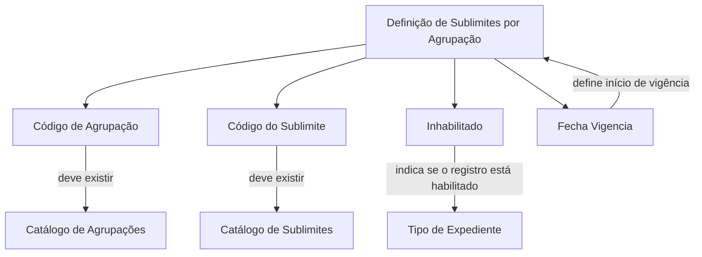

# Definição de Sublimites por Agrupação — Documentação Reef

## 1. Metadados do Documento
- **Arquivo de Origem:** `Não identificado`
- **Tipo de Documento:** `Especificação Técnica`
- **Domínio / Sistema:** `Reef / Mapfre`
- **Público-Alvo:** `Não identificado`
- **Data/Versão Identificada:** `Não identificada`
- **Proprietário identificado:** `user:agonzalez_mapfre.com`
- **Lifecycle identificado:** `Approved Source`

---

## 2. Resumo Executivo & Contexto de Negócio

O documento define como associar sub-limites a agrupações no contexto da documentação Reef. A associação é configurada por meio de propriedades que identificam a agrupação, o sub-limite, a condição de habilitação do registro e a data de vigência da definição.

A definição exige que o código de agrupação já exista no catálogo de agrupações. Da mesma forma, o código do sub-limite deve existir previamente no catálogo de sub-limites. Essas validações estabelecem dependências explícitas entre o registro de associação e os respectivos catálogos.

O documento também informa que o atributo **Inhabilitado** determina se o registro está habilitado ou não para permitir a associação de sub-limites a um **Tipo de Expediente**. O atributo **Fecha Vigencia** determina a data a partir da qual a definição pode ser utilizada pelo sistema.

Não há detalhamento adicional sobre telas, APIs, contratos JSON, métodos HTTP, persistência de dados, regras de precedência entre vigências ou comportamento em caso de códigos inexistentes.

---

## 3. Arquitetura, Componentes & Tecnologias Envolvidas

Os elementos funcionais identificados são:

| Componente / Conceito | Papel descrito no documento |
| :--- | :--- |
| Reef | Sistema ou domínio documental mencionado no cabeçalho. |
| Agrupação | Entidade à qual os sub-limites são associados. |
| Sublimite | Entidade que será associada a uma agrupação. |
| Catálogo de agrupações | Fonte na qual a chave da agrupação deve existir. |
| Catálogo de sub-limites | Fonte na qual a chave do sub-limite deve existir. |
| Tipo de Expediente | Entidade mencionada no contexto de habilitação da associação de sub-limites. |
| Definição de sub-limites por agrupação | Registro configurado com código de agrupação, código de sub-limite, condição de habilitação e data de vigência. |



> **Nota de Análise:** O documento descreve uma relação de associação e validação de catálogos, mas não especifica a arquitetura técnica, serviços, banco de dados, interfaces, URLs, tecnologias ou contratos de integração.

---

## 4. Regras de Negócio, Especificações Funcionais & Processos

1. A definição tem como objetivo associar sub-limites às agrupações.
2. O **Código de Agrupação** contém a chave da agrupação à qual os sub-limites serão associados.
3. A chave informada no **Código de Agrupação** deve existir no catálogo de agrupações.
4. O **Código do Sublimite** contém a chave do sub-limite que será associado à agrupação.
5. A chave informada no **Código do Sublimite** deve existir no catálogo de sub-limites.
6. O atributo **Inhabilitado** indica se o registro está ou não habilitado para permitir a associação de sub-limites a um Tipo de Expediente.
7. O atributo **Fecha Vigencia** indica ao sistema a data em que a definição entra em vigor para ser utilizada.
8. O documento não estabelece formato, obrigatoriedade, unicidade, intervalo de datas, comportamento de alteração ou exclusão das propriedades.
9. O documento não especifica se mais de um sub-limite pode ser associado à mesma agrupação, nem se uma mesma combinação de agrupação e sub-limite pode possuir múltiplas vigências.

---

## 5. Tabelas de Parâmetros, Ambientes e Estruturas de Dados

| Item / Parâmetro | Descrição / Função | Tipo / Valores / Formato | Ambiente / Observações |
| :--- | :--- | :--- | :--- |
| Código de Agrupação | Contém a chave da agrupação à qual os sub-limites serão associados. | Chave; formato não especificado. | A chave deve existir no catálogo de agrupações. |
| Código do Sublimite | Contém a chave do sub-limite a ser associado à agrupação. | Chave; formato não especificado. | A chave deve existir no catálogo de sub-limites. |
| Inhabilitado | Indica se o registro está ou não habilitado para permitir a associação de sub-limites a um Tipo de Expediente. | Valor/formato não especificado. | Não são informados os valores possíveis nem o comportamento operacional detalhado. |
| Fecha Vigencia | Indica a data em que a definição entra em vigor para utilização pelo sistema. | Data; formato não especificado. | Não há regra documentada para término de vigência. |
| Catálogo de Agrupações | Repositório de referência das chaves de agrupação. | Não especificado. | O Código de Agrupação deve existir neste catálogo. |
| Catálogo de Sublimites | Repositório de referência das chaves de sub-limite. | Não especificado. | O Código do Sublimite deve existir neste catálogo. |
| Owner | Proprietário identificado no conteúdo bruto. | `user:agonzalez_mapfre.com` | Valor apresentado literalmente no documento. |
| Lifecycle | Estado de ciclo de vida identificado no conteúdo bruto. | `Approved Source` | Não há definição adicional do estado. |

---

## 6. Bateria de Perguntas & Respostas para RAG (FAQ Sintético)

### P1: Qual é o objetivo da definição de sub-limites por agrupação?
**R:** O objetivo é associar sub-limites às agrupações. A definição é composta, no mínimo, pelo código de agrupação, código do sub-limite, condição de habilitação e data de vigência.

### P2: O que representa o Código de Agrupação?
**R:** O Código de Agrupação contém a chave da agrupação à qual os sub-limites serão associados. Essa chave deve existir no catálogo de agrupações.

### P3: Qual validação é exigida para o Código de Agrupação?
**R:** A chave informada no Código de Agrupação deve existir previamente no catálogo de agrupações.

### P4: O que representa o Código do Sublimite?
**R:** O Código do Sublimite contém a chave do sub-limite que se deseja associar à agrupação. Essa chave deve existir no catálogo de sub-limites.

### P5: Qual validação é exigida para o Código do Sublimite?
**R:** A chave informada no Código do Sublimite deve existir previamente no catálogo de sub-limites.

### P6: Qual é a finalidade do atributo Inhabilitado?
**R:** O atributo Inhabilitado indica se o registro está ou não habilitado para permitir a associação de sub-limites a um Tipo de Expediente. O documento não define os valores possíveis, o formato do campo ou o comportamento detalhado para registros inabilitados.

### P7: Para que serve a Fecha Vigencia?
**R:** A Fecha Vigencia informa ao sistema a data em que a definição entra em vigor e pode ser utilizada. O documento não informa o formato da data nem uma data de fim de vigência.

### P8: O documento define APIs ou métodos HTTP para manter associações de sub-limites?
**R:** Não. O documento não apresenta APIs, métodos HTTP, endpoints, contratos JSON, URLs, tecnologias de implementação ou procedimentos operacionais para manutenção das associações.

### P9: O documento informa como tratar um código inexistente no catálogo?
**R:** O documento estabelece que o Código de Agrupação deve existir no catálogo de agrupações e que o Código do Sublimite deve existir no catálogo de sub-limites. Entretanto, não detalha mensagens de erro, fluxo de rejeição ou tratamento técnico para códigos inexistentes.

### P10: É possível associar vários sub-limites à mesma agrupação?
**R:** O documento declara que sub-limites podem ser associados às agrupações, mas não especifica cardinalidade, limites de associações, unicidade da combinação ou regras para associações duplicadas.

---

## 7. Glossário de Termos, Siglas & Conceitos-Chave

- **Agrupação:** Entidade identificada por uma chave e à qual sub-limites são associados.
- **Catálogo de Agrupações:** Catálogo no qual deve existir a chave informada no Código de Agrupação.
- **Catálogo de Sublimites:** Catálogo no qual deve existir a chave informada no Código do Sublimite.
- **Código de Agrupação:** Propriedade que contém a chave da agrupação à qual os sub-limites serão associados.
- **Código do Sublimite:** Propriedade que contém a chave do sub-limite associado à agrupação.
- **Fecha Vigencia:** Propriedade que determina a data de entrada em vigor da definição.
- **Inhabilitado:** Propriedade que indica se o registro está ou não habilitado para associação de sub-limites a um Tipo de Expediente.
- **Reef:** Nome identificado na documentação; o conteúdo não fornece expansão ou definição adicional.
- **Tipo de Expediente:** Entidade mencionada como contexto para associação de sub-limites; não possui definição adicional no documento.

---

## 8. Notas Críticas, Riscos & Limitações

- O documento não identifica o nome do arquivo de origem, versão, data de publicação ou público-alvo.
- Não há detalhamento de arquitetura de software, banco de dados, integrações, APIs, métodos HTTP, URLs, ambientes, autenticação ou autorização.
- Não são definidos os tipos de dados, formatos ou valores permitidos para Código de Agrupação, Código do Sublimite, Inhabilitado e Fecha Vigencia.
- Não há regras documentadas para duplicidade, exclusão, alteração, data final de vigência, sobreposição de vigências ou precedência entre registros.
- O termo **VL** aparece no conteúdo bruto sem definição contextual.
- O documento não explica o significado de **Approved Source** além de sua apresentação como valor de Lifecycle.
- A redação original do atributo **Inhabilitado** contém ambiguidade gramatical; a interpretação foi mantida estritamente limitada ao texto apresentado.

---

## 9. Conteúdo Bruto Estruturado (Referência Fiel)

```text
--- [PÁGINA 1 DE 1] ---

DEFINICIÓN de Sub-límites por Agrupación
Objetivo
Este documento explica como asociar sub-límites a las agrupaciones
Propiedades
Código de Agrupación
Esta propiedadcontiene la clave de la agrupación a la que se le va a asociar los sublímites. La clave tiene que existir en el catálogo de
agrupaciones
Código del sub-límite
Esta propiedadcontendrá la clave del sub-límite que se quiere asociar a la agrupación. Tiene que existir en el catálogo de sub-límites
Inhabilitado
Esta propiedadindica si el registro está o no habilitado para ser poder asociarle sub-límites a un Tipo de Expediente.
Fecha Vigencia
Indica al sistema en qué fecha entra en vigor esta denición para ser utilizada
Documentation / DOCUMENTACIÓN Reef
DOCUMENTACIÓN Reef
Mapfredocument
DOCUMENTACIÓN Reef
Owner
user:agonzalez_mapfre.com
Lifecycle
Approved Source
 /
 VL
Buscar Inicio Soluciones Arquitecturas APIs Componentes Cloud Documentación Zeus Reef Ayuda
ES
```
