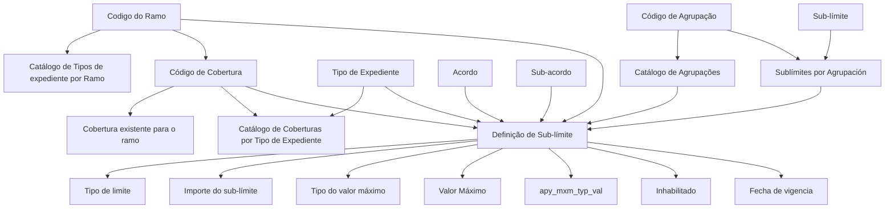

# Definição de Sub-limites por Ramo, Tipo de Expediente e Cobertura

## 1. Metadados do Documento
- **Arquivo de Origem:** `Não identificado no conteúdo fornecido`
- **Tipo de Documento:** `Especificação Técnica`
- **Domínio / Sistema:** `Reef / Mapfre`
- **Público-Alvo:** `Equipes de negócio, análise funcional e desenvolvimento que mantêm catálogos de ramos, coberturas, expedientes, acordos e sub-limites`
- **Data/Versão Identificada:** `Não identificada`

---

## 2. Resumo Executivo & Contexto de Negócio

O documento descreve a definição de sub-limites para cada combinação de ramo, tipo de expediente e cobertura. A finalidade explícita é estabelecer as propriedades necessárias para associar sub-limites a elementos de negócio existentes em catálogos relacionados a ramos, coberturas, tipos de expediente, agrupações e sub-limites por agrupação.

A definição de um sub-limite depende de relações prévias entre entidades de catálogo. O código do ramo deve estar definido no catálogo de Tipos de expediente por Ramo; a cobertura deve existir para o ramo informado; e o tipo de expediente deve possuir previamente a cobertura definida no catálogo de Coberturas por Tipo de Expediente. Essas dependências funcionam como critérios de consistência para a configuração.

O documento também prevê variações de sub-limites por acordo e sub-acordo. Um acordo representa um pacto ou convênio entre a companhia e um terceiro que permite alterações em conceitos de negócio determinados de um ramo, sem afetar todas as partes da apólice. Um sub-acordo representa condições especiais dentro do contrato. Tanto acordo quanto sub-acordo podem possuir sub-limites distintos por cobertura.

Além do cadastro básico, a especificação trata da determinação de tipos e valores de sub-limite. Alguns valores podem ser fixos; outros podem depender de lógicas de negócio baseadas em fatores ou condições. A documentação define tipos de limite, valores máximos, moedas e escopos de aplicação do importe máximo, incluindo sinistro, expediente e vigência por risco.

---

## 3. Arquitetura, Componentes & Tecnologias Envolvidas

O conteúdo não descreve arquitetura de software, protocolos, APIs, bancos de dados, microsserviços, ambientes técnicos, URLs operacionais ou tecnologias de implementação. O relacionamento funcional entre os catálogos e as propriedades de sub-limite pode ser representado da seguinte forma:



### Componentes e entidades funcionais identificados

| Componente / Entidade | Descrição sustentada pelo documento |
| :--- | :--- |
| Ramo | Elemento identificado por uma chave de ramo associada ao tipo de expediente. |
| Tipo de expediente | Entidade à qual um sub-limite é associado e que deve possuir previamente a cobertura informada. |
| Cobertura | Cobertura associada ao ramo e ao tipo de expediente. |
| Acordo | Pacto ou convênio entre a companhia e um terceiro que permite alterações em conceitos de negócio determinados do ramo. |
| Sub-acordo | Subcontrato que representa condições especiais dentro do contrato. |
| Agrupação de sub-limites | Agrupação identificada por código e existente no catálogo de Agrupações. |
| Sub-límite | Código que deve existir para a agrupação no catálogo de Sublímites por Agrupación. |
| Lógica de negócio | Regra usada quando o tipo ou importe de sub-limite, ou o tipo ou importe máximo, não for fixo. |
| `apy_mxm_typ_val` | Tipo sobre o qual deve ser aplicado o importe máximo. |

> **Nota de Análise:** O documento não detalha entidades técnicas persistentes, contratos de integração, métodos HTTP, formatos JSON, interfaces de usuário ou mecanismos de cálculo executável para as lógicas de negócio.

---

## 4. Regras de Negócio, Especificações Funcionais & Processos

### 4.1. Regras de consistência para associação de sub-limites

1. O **Código do Ramo** deve conter a chave do ramo do tipo de expediente para o qual serão definidos os sub-limites.
2. O **Código do Ramo** deve estar definido no catálogo de **Tipos de expediente por Ramo**.
3. O **Código de Cobertura** deve conter a chave da cobertura à qual os sub-limites serão associados.
4. A **Cobertura** deve existir para o código do ramo informado anteriormente.
5. O **Tipo de Expediente** deve conter a chave do tipo de expediente ao qual será associado um sub-limite.
6. O **Tipo de Expediente** deve ter a cobertura previamente indicada no catálogo de **Coberturas por Tipo de Expediente**.
7. O **Código de Agrupação** deve existir no catálogo de **Agrupações**.
8. O código de **Sub-límite** deve existir, para a agrupação previamente informada, no catálogo de **Sublímites por Agrupación**.
9. O atributo **Inhabilitado** indica se o registro está habilitado ou não para utilização.
10. A **Fecha de vigencia** indica a data de entrada em vigor da definição.

### 4.2. Regras relacionadas a acordo e sub-acordo

- O **Acordo** contém a chave de um pacto ou convênio entre a companhia e um terceiro.
- O acordo permite realizar alterações sobre um ramo já definido.
- As alterações permitidas por acordo afetam determinados conceitos de negócio, não todas as partes da apólice.
- Dentro de um acordo podem existir sub-limites distintos por cobertura.
- O **Sub-acordo** contém a chave de um subcontrato.
- O sub-acordo representa condições especiais dentro do contrato.
- Dentro da combinação de acordo e sub-acordo podem existir sub-limites distintos por cobertura.

### 4.3. Tipos de sub-limite

O atributo **Tipo de limite** pode possuir os seguintes valores:

1. `Importe`
2. `% sobre la suma asegurada de la cobertura`
3. `% sobre la suma asegurada de la cobertura principal`
4. `(porcentaje por mil) sobre la suma asegurada de la cobertura`
5. `(porcentaje por mil) sobre la suma asegurada de la cobertura principal`

### 4.4. Lógicas de negócio para sub-limite

- A **Lógica que determina el tipo de sub-límite** deve conter a lógica de negócio que define o tipo de limite quando o tipo não for fixo e depender de vários fatores ou condições.
- O **Importe del sub-límite** contém o importe do sub-limite.
- A **Moneda del importe** representa a moeda do importe do sub-limite.
- A **Lógica de Negocio que determina el importe del sub-límite** deve conter a lógica responsável por calcular o importe do sub-limite quando esse importe precisar ser calculado.

### 4.5. Valores máximos

O atributo **Tipo del valor máximo** pode possuir três valores:

1. `Importe`
2. `Numero`
3. `Días`

Regras associadas:

- A **Lógica que determina el tipo del importe máximo** deve definir o tipo do importe máximo quando o tipo do valor máximo não for fixo e depender de vários fatores.
- O **Valor Máximo** contém o valor máximo.
- A **Moneda del valor máximo** contém a moeda na qual o importe máximo está expresso.
- A **Lógica de negocio que calcula el importe máximo** deve calcular o importe máximo quando o tipo do valor máximo não for fixo e depender de vários fatores ou condições.

### 4.6. Escopo de aplicação do importe máximo

O atributo `apy_mxm_typ_val` contém o tipo sobre o qual o importe máximo será aplicado. Os valores informados são:

1. `Siniestro`
2. `Expediente`
3. `Vigencia por riesgo`

Para o valor `Siniestro`, o documento determina que é necessário somar o valor atribuído ao sub-limite em todos os expedientes do sinistro, para que o conjunto não ultrapasse o valor máximo. Para o valor `Expediente`, somente o expediente considerado deve ser levado em conta.

> **Nota de Análise:** O documento menciona o comportamento para `Siniestro` e `Expediente`, mas não detalha a regra operacional de cálculo para `Vigencia por riesgo`.

---

## 5. Tabelas de Parâmetros, Ambientes e Estruturas de Dados

| Item / Parâmetro | Descrição / Função | Tipo / Valores / Formato | Ambiente / Observações |
| :--- | :--- | :--- | :--- |
| Código del Ramo | Chave do ramo do tipo de expediente para o qual serão definidos sub-limites. | Chave/código; formato não especificado. | Deve estar definido no catálogo de Tipos de expediente por Ramo. |
| Código de Cobertura | Chave da cobertura à qual serão associados os sub-limites. | Chave/código; formato não especificado. | A cobertura deve existir para o código do ramo previamente indicado. |
| Tipo de Expediente | Chave do tipo de expediente ao qual será associado um sub-limite. | Chave/código; formato não especificado. | Deve possuir a cobertura indicada no catálogo de Coberturas por Tipo de Expediente. |
| Acuerdo | Chave de pacto ou convênio entre a companhia e um terceiro. | Chave/código; formato não especificado. | Pode definir sub-limites distintos por cobertura. |
| Sub-acuerdo | Chave de subcontrato que representa condições especiais dentro do contrato. | Chave/código; formato não especificado. | Pode definir sub-limites distintos por cobertura junto ao acordo. |
| Código de Agrupación | Código da agrupação de sub-limites. | Chave/código; formato não especificado. | Deve existir no catálogo de Agrupaciones. |
| Sub-límite | Código do sub-limite. | Chave/código; formato não especificado. | Deve existir para a agrupação no catálogo de Sublímites por Agrupación. |
| Tipo de límite | Indica o tipo do sub-limite. | `Importe`; `% sobre la suma asegurada de la cobertura`; `% sobre la suma asegurada de la cobertura principal`; `(porcentaje por mil) sobre la suma asegurada de la cobertura`; `(porcentaje por mil) sobre la suma asegurada de la cobertura principal`. | Sem ambiente especificado. |
| Lógica que determina el tipo de sub-límite | Define o tipo de limite quando não é fixo. | Lógica de negócio; estrutura não especificada. | Aplicável quando o tipo depende de fatores ou condições. |
| Importe del sub-límite | Contém o importe do sub-limite. | Valor monetário ou valor não detalhado. | Sem regra de formato especificada. |
| Moneda del importe | Moeda do importe do sub-limite. | Moeda; códigos aceitos não especificados. | Sem ambiente especificado. |
| Lógica de Negocio que determina el importe del sub-límite | Calcula o importe do sub-limite quando necessário. | Lógica de negócio; estrutura não especificada. | Aplicável quando o importe deve ser calculado. |
| Tipo del valor máximo | Define a natureza do valor máximo. | `Importe`; `Numero`; `Días`. | Sem ambiente especificado. |
| Lógica que determina el tipo del importe máximo | Define o tipo do importe máximo quando não é fixo. | Lógica de negócio; estrutura não especificada. | Aplicável quando depende de vários fatores. |
| Valor Máximo | Contém o valor máximo. | Valor; formato não especificado. | Sem ambiente especificado. |
| Moneda del valor máximo | Moeda em que o importe máximo é expresso. | Moeda; códigos aceitos não especificados. | Aplicável a importe máximo. |
| Lógica de negocio que calcula el importe máximo | Calcula o importe máximo quando necessário. | Lógica de negócio; estrutura não especificada. | Aplicável quando o valor máximo não é fixo. |
| `apy_mxm_typ_val` | Tipo sobre o qual será aplicado o importe máximo. | `Siniestro`; `Expediente`; `Vigencia por riesgo`. | Para sinistro, considera a soma dos expedientes do sinistro; para expediente, considera somente o expediente. |
| Inhabilitado | Indica se o registro está habilitado para uso. | Indicador booleano implícito; valores não especificados. | Sem ambiente especificado. |
| Fecha de vigencia | Data de entrada em vigor da definição. | Data; formato não especificado. | Sem ambiente especificado. |

> **Nota de Análise:** Não foram identificados servidores, URLs, portas, variáveis de ambiente, diretórios de logs ou ambientes de execução no conteúdo fornecido.

---

## 6. Bateria de Perguntas & Respostas para RAG (FAQ Sintético)

### P1: Qual é o objetivo da definição de sub-limites descrita no documento?
**R:** O objetivo é definir sub-limites para cada tipo de expediente e cobertura dentro de um ramo. A definição é composta por propriedades que relacionam ramo, cobertura, tipo de expediente, acordo, sub-acordo, agrupação e sub-limite.

### P2: Qual validação deve ser feita para o Código del Ramo?
**R:** O Código del Ramo deve conter a chave do ramo do tipo de expediente para o qual os sub-limites serão definidos. Esse ramo deve estar definido no catálogo de Tipos de expediente por Ramo.

### P3: Qual condição deve ser atendida pelo Código de Cobertura?
**R:** O Código de Cobertura deve identificar a cobertura que receberá os sub-limites. A cobertura precisa existir para o código do ramo informado anteriormente.

### P4: Qual é a dependência do Tipo de Expediente em relação à cobertura?
**R:** O Tipo de Expediente deve conter a chave do tipo de expediente ao qual será associado um sub-limite. Esse tipo de expediente deve possuir previamente a cobertura indicada no catálogo de Coberturas por Tipo de Expediente.

### P5: Como acordo e sub-acordo influenciam os sub-limites?
**R:** Um acordo representa um pacto ou convênio entre a companhia e um terceiro que permite alterações em conceitos de negócio determinados de um ramo já definido. Um sub-acordo representa condições especiais dentro do contrato. O documento estabelece que podem existir sub-limites diferentes por cobertura dentro do acordo e também dentro da combinação de acordo e sub-acordo.

### P6: Quais valores são permitidos para o Tipo de límite?
**R:** O Tipo de límite pode ser `Importe`, `% sobre la suma asegurada de la cobertura`, `% sobre la suma asegurada de la cobertura principal`, `(porcentaje por mil) sobre la suma asegurada de la cobertura` ou `(porcentaje por mil) sobre la suma asegurada de la cobertura principal`.

### P7: Quando deve ser utilizada a lógica que determina o tipo de sub-limite?
**R:** A lógica que determina o tipo de sub-limite deve ser usada quando o tipo de limite não for fixo e depender de vários fatores ou condições. O documento não especifica quais fatores, condições ou linguagem de implementação devem ser utilizados.

### P8: Quais são os tipos possíveis para o valor máximo?
**R:** O Tipo del valor máximo pode assumir três valores: `Importe`, `Numero` ou `Días`.

### P9: Como funciona o importe máximo quando `apy_mxm_typ_val` é Siniestro?
**R:** Quando o importe máximo é por `Siniestro`, deve-se somar o valor atribuído àquele sub-limite em todos os expedientes do sinistro. A soma total não pode ultrapassar o valor máximo definido.

### P10: Como funciona o importe máximo quando `apy_mxm_typ_val` é Expediente?
**R:** Quando o importe máximo é por `Expediente`, somente o expediente em questão deve ser considerado para a aplicação do valor máximo.

### P11: O documento detalha o cálculo para `Vigencia por riesgo` em `apy_mxm_typ_val`?
**R:** Não. O documento lista `Vigencia por riesgo` como um valor possível para `apy_mxm_typ_val`, mas não apresenta regra de cálculo, agregação ou validação específica para esse valor.

### P12: Qual é a finalidade do campo Inhabilitado?
**R:** O campo Inhabilitado indica se o registro está ou não habilitado para ser utilizado. O documento não especifica os valores literais aceitos para esse indicador.

### P13: Qual é a finalidade da Fecha de vigencia?
**R:** A Fecha de vigencia indica a data em que a definição de sub-limite entra em vigor. O documento não informa formato de data, timezone ou tratamento para sobreposição de vigências.

---

## 7. Glossário de Termos, Siglas & Conceitos-Chave

- **Ramo:** Elemento identificado por uma chave, relacionado ao tipo de expediente para o qual se definem sub-limites.
- **Cobertura:** Cobertura associada a um ramo e a um tipo de expediente.
- **Tipo de Expediente:** Tipo de expediente ao qual um sub-limite é associado.
- **Acuerdo / Acordo:** Pacto ou convênio entre a companhia e um terceiro que permite alterações em conceitos de negócio determinados de um ramo.
- **Sub-acuerdo / Sub-acordo:** Subcontrato que representa condições especiais dentro de um contrato.
- **Agrupación / Agrupação:** Agrupação de sub-limites que deve existir no catálogo de Agrupaciones.
- **Sub-límite:** Limite associado a uma agrupação, ramo, cobertura e tipo de expediente, sujeito às propriedades descritas.
- **Importe:** Valor monetário ou importe associado ao sub-limite ou ao valor máximo.
- **Suma asegurada:** Soma assegurada da cobertura ou da cobertura principal, usada como base para determinados tipos de limite.
- **Siniestro:** Sinistro; escopo em que o valor do sub-limite deve ser somado entre todos os expedientes do sinistro.
- **Expediente:** Expediente; escopo em que somente o expediente considerado é levado em conta para o valor máximo.
- **Vigencia por riesgo:** Valor possível para o escopo de aplicação do importe máximo; sem comportamento detalhado.
- **`apy_mxm_typ_val`:** Atributo que identifica o tipo sobre o qual o importe máximo será aplicado.
- **Inhabilitado:** Indicador de que o registro está ou não habilitado para utilização.
- **Fecha de vigencia:** Data em que a definição entra em vigor.

---

## 8. Notas Críticas, Riscos & Limitações

- O documento não informa o nome do arquivo de origem, autor, data de publicação, versão ou histórico de alterações.
- O conteúdo não especifica arquitetura técnica, APIs, endpoints, banco de dados, modelos de persistência, serviços, filas, mecanismos de integração ou ambientes de execução.
- Não há definição de formatos para códigos, moedas, datas, valores monetários, percentuais ou indicadores de habilitação.
- As lógicas de negócio para cálculo ou determinação de tipos são mencionadas, mas suas regras, expressões, critérios, responsáveis e mecanismos de execução não são detalhados.
- O comportamento de `apy_mxm_typ_val` é detalhado para `Siniestro` e parcialmente para `Expediente`, mas não é detalhado para `Vigencia por riesgo`.
- O documento menciona exemplos, mas os exemplos não estão presentes no conteúdo extraído.
- A extração contém caracteres possivelmente corrompidos, como `denir`, `jo` e `nida`; o significado foi interpretado somente quando o contexto textual tornou a leitura inequívoca.

---

## 9. Conteúdo Bruto Estruturado (Referência Fiel)

```text
--- [PÁGINA 1 DE 3] ---

DEFINICIÓN de Sub-límites por Ramo Tipo de Expediente Cobertura
Objetivo
Este documento tiene como objetivo explicar como denir los sub-limites para cada tipo de expediente, cobertura dentro de un ramo.
Propiedades
Código del Ramo
Esta propiedadcontendrá la clave del Ramo del tipo de expediente al que le vamos a denir sub-límites. Tendrá que estar denido en el
catálogo de Tipos de expediente por Ramo
Código de Cobertura
Esta propiedadtendrá la clave de la cobertura a la que se va a asociar los sub-límites. Esta cobertura tendrá que existir para el código del
ramo que se ha indicado previamente
Tipo de Expediente
Esta propiedad contendrá la clave del tipo de expediente al que se le va a asociar un sub-límite. Este tipo de expediente tiene que tener
denida la cobertura previamente indicada en el catálogo de Coberturas por Tipo de Expediente
Acuerdo
Esta propiedadcontiene la clave del pacto o convenio, entre la compañía y un tercero que permite realizar alteraciones de un ramo ya denido.
Estas alteraciones afectan a un número de conceptos de negocio determinados no a todas las partes de la póliza. Dentro del acuerdo se
podría tener unos sub-límites distintos por cobertura.
Sub-acuerdo
Esta propiedadcontiene la clave del sub-contrato, esto representaría unas condiciones especiales dentro del contrato. Dentro del acuerdo y
del sub-acuerdo se podría tener unos sub-límites distintos por cobertura.
Código de Agrupación
Esta propiedadcontendrá el código de la agrupación de sublimites. Tiene que existir en el catálogo de Agrupaciones
Ejemplo:
Ejemplo:
Documentation / DOCUMENTACIÓN Reef
DOCUMENTACIÓN Reef
Mapfredocument
DOCUMENTACIÓN Reef
Owner
user:agonzalez_mapfre.com
Lifecycle
Approved Source
 / 
 VL
Buscar Inicio Soluciones Arquitecturas APIs Componentes Cloud Documentación Zeus Reef Ayuda
ES


--- [PÁGINA 2 DE 3] ---

Sub-límite
Esta propiedadcontendrá el código de sub-límite. Este código tiene que existir para la agrupación anteriormente introducida, en el catálogo de
Sublímites por Agrupación
Tipo de límite
Esta propiedadindica que tipo sub-limite es, los valores que puede contener son:
Importe
% sobre la suma asegurada de la cobertura
% sobre la suma asegurada de la cobertura principal
(porcentaje por mil) sobre la suma asegurada de la cobertura
(porcentaje por mil) sobre la suma asegurada de la cobertura principal
Lógica que determina el tipo de sub-límite
Esta propiedadtendrá la lógica de negocio que determinará el tipo de límite del sub-límite, siempre que este no sea jo y dependa de varios
factores o condiciones.
Importe del sub-límite
Esta propiedadcoentiene el importe sub-límite
Moneda del importe
Es la moneda del importe del sub-límite
Lógica de Negocio que determina el importe del sub-límite
Cuando el importe del sub-límite haya que calcularlo, aquí estará la lógica de negocio que se encargue de calcular el importe sub-límite.
Tipo del valor máximo
Esta propiedadcontendrá el tipo del valor máximo. Este podrá tener estos tres valores
1. Importe
2. Numero
3. Días
Lógica que determina el tipo del importe máximo
Si el tipo del valor máximo no es jo sino que depende de varios factores, tendremos en este atributo la Lógica de negocio que determina el
tipo del importe máximo.
Valor Máximo
Esta propiedadcontendrá el valor máximo
Moneda del valor máximo
Moneda en la que está expresado el importe máximo
Lógica de negocio que calcula el importe máximo
Si el tipo del valor máximo no es jo sino que depende de varios factores, tendremos en este atributo la Lógica de negocio que determina el
tipo del importe máximo.
apy_mxm_typ_val
Esta propiedadcontiene el tipo sobre el que se va a aplicar el importe máximo. Esta propiedadpuede contener uno de estos valores Si el
importe máximo es por siniestros, habrá que sumar lo valorado en ese sub-límite en todos los expedientes del siniestro para no superar entre
todo el valor máximo, si el valor máximo el por expediente, sólo se tomará en cuenta ese expediente,... etc


--- [PÁGINA 3 DE 3] ---

1. Siniestro
2. Expediente
3. Vigencia por riesgo
Inhabilitado
Esta propiedadindica si el registro está o no habilitado para ser utilizado.
Fecha de vigencia
Fecha en la que entra en vigor la denición
```
