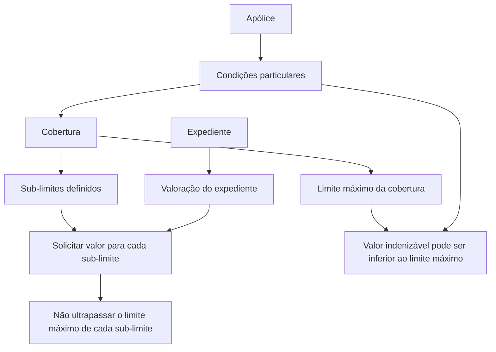

# Definição de Sub-limites — Documentação Reef

## 1. Metadados do Documento
- **Arquivo de Origem:** `Não identificado`
- **Tipo de Documento:** `Especificação Técnica`
- **Domínio / Sistema:** `Reef / Mapfre`
- **Público-Alvo:** `Tramitadores e equipes responsáveis pela valoração de expedientes`
- **Data/Versão Identificada:** `Não identificada`

---

## 2. Resumo Executivo & Contexto de Negócio

O documento define o conceito e as propriedades de **sub-limites** no contexto de coberturas, apólices, sinistros e expedientes. Um sub-limite representa o valor máximo de indenização que pode ser pago ao segurado quando uma cobertura afetada possuir sub-limites definidos.

Uma cobertura possui um limite máximo, mas o documento esclarece que nem sempre será pago 100% desse limite. As condições particulares da apólice podem determinar que o limite aplicável seja inferior ao limite máximo da cobertura.

Quando uma cobertura de um expediente possui sub-limites definidos, o valor da valoração do expediente deve ser solicitado para cada sub-limite. Essa separação tem como objetivo impedir que o valor associado a cada sub-limite ultrapasse o respectivo valor máximo.

A documentação descreve propriedades de cadastro para sub-limites: código, nome, descrição, idioma e indicador de habilitação. Não são apresentados contratos de API, métodos HTTP, estruturas JSON, cálculos monetários detalhados ou regras de persistência.

---

## 3. Arquitetura, Componentes & Tecnologias Envolvidas

Os componentes e conceitos explicitamente citados são:

| Componente / Conceito | Papel descrito |
| :--- | :--- |
| Reef | Sistema ou domínio documental mencionado como “DOCUMENTACIÓN Reef”. |
| Mapfre | Organização ou contexto documental citado no texto. |
| Cobertura | Entidade que possui um limite máximo e pode possuir sub-limites definidos. |
| Sub-limite | Máximo de indenização aplicável ao segurado para uma cobertura afetada. |
| Apólice | Fonte das condições particulares que podem definir limite inferior ao máximo da cobertura. |
| Expediente | Entidade cuja valoração deve ser solicitada por sub-limite quando aplicável. |
| Tramitador | Usuário para o qual a descrição do sub-limite auxilia na compreensão de seu escopo. |



> **Nota de Análise:** O documento não detalha arquitetura de software, integrações, tecnologias de implementação, bases de dados, APIs ou ambientes técnicos.

---

## 4. Regras de Negócio, Especificações Funcionais & Processos

1. Um **sub-limite** é o máximo de indenização pago ao segurado em caso de sinistro quando a cobertura afetada possuir sub-limites definidos.
2. A cobertura possui um limite máximo definido.
3. O pagamento associado à cobertura não é necessariamente igual a 100% do limite máximo.
4. As condições particulares da apólice podem estabelecer um limite inferior ao limite máximo da cobertura.
5. Quando uma cobertura de um expediente possuir sub-limites definidos, a valoração do expediente deve ser solicitada para cada sub-limite.
6. A solicitação ou separação da valoração por sub-limite deve evitar que o limite máximo de cada sub-limite seja ultrapassado.
7. O código do sub-limite corresponde à chave do sub-limite.
8. O nome do sub-limite deve ser registrado no idioma indicado.
9. A descrição do sub-limite deve ser mais ampla que o nome e deve ajudar o tramitador a identificar o que o sub-limite contempla.
10. O idioma armazena o código do idioma no qual os textos do sub-limite estão definidos; os idiomas são codificados.
11. O campo de inabilitação informa se o registro está habilitado para uso na valoração de expedientes.

---

## 5. Tabelas de Parâmetros, Ambientes e Estruturas de Dados

| Item / Parâmetro | Descrição / Função | Tipo / Valores / Formato | Ambiente / Observações |
| :--- | :--- | :--- | :--- |
| Código do sub-limite | Contém a chave do sub-limite. | Não especificado. | Identificador do sub-limite. |
| Nome do sub-limite | Contém o nome do sub-limite. | Texto; deve ser registrado no idioma indicado. | Não há tamanho, obrigatoriedade ou catálogo informado. |
| Descrição do sub-limite | Contém descrição ampliada do sub-limite para auxiliar o tramitador. | Texto descritivo. | Deve explicar o que o sub-limite contempla. |
| Idioma | Contém o código do idioma em que os textos estão definidos. | Código de idioma; idiomas codificados. | O catálogo de idiomas não foi apresentado. |
| Inabilitado | Indica se o registro está ou não habilitado para utilização. | Indicador booleano ou equivalente não especificado. | Aplicável à valoração de expedientes. |
| Limite máximo da cobertura | Limite máximo definido para a cobertura. | Valor monetário ou formato não especificado. | Nem sempre é pago integralmente. |
| Sub-limite | Máximo de indenização aplicável quando uma cobertura afetada possui sub-limites. | Valor monetário ou formato não especificado. | Não deve ser ultrapassado na valoração do expediente. |
| Condições particulares da apólice | Podem determinar valor inferior ao limite máximo da cobertura. | Não especificado. | Regra que condiciona o valor efetivamente aplicável. |

---

## 6. Bateria de Perguntas & Respostas para RAG (FAQ Sintético)

### P1: O que é um sub-limite no contexto de coberturas e sinistros?
**R:** Um sub-limite é o máximo de indenização que será pago ao segurado em caso de sinistro quando uma cobertura afetada possuir sub-limites definidos.

### P2: Uma cobertura sempre paga 100% do seu limite máximo?
**R:** Não. O documento informa que a cobertura possui um limite máximo definido, mas nem sempre será pago 100% desse valor. As condições particulares da apólice podem estabelecer um limite inferior.

### P3: Qual é a relação entre condições particulares da apólice e o limite da cobertura?
**R:** As condições particulares da apólice podem determinar que o limite aplicável seja inferior ao limite máximo definido para a cobertura.

### P4: O que deve ocorrer na valoração de um expediente com cobertura que possui sub-limites?
**R:** A valoração do expediente deve ser solicitada para cada um dos sub-limites definidos, evitando que o limite máximo de cada sub-limite seja ultrapassado.

### P5: Qual é a finalidade do código do sub-limite?
**R:** O código do sub-limite contém a chave que identifica o sub-limite.

### P6: Como o nome de um sub-limite deve ser registrado?
**R:** O nome do sub-limite deve ser registrado no idioma indicado.

### P7: Qual é a diferença entre nome e descrição do sub-limite?
**R:** O nome identifica o sub-limite, enquanto a descrição deve ser mais ampla e ajudar o tramitador a compreender o que o sub-limite contempla.

### P8: O que o campo Idioma representa no cadastro de sub-limites?
**R:** O campo Idioma contém o código do idioma no qual os textos do sub-limite estão definidos. O documento informa que esses idiomas são codificados, mas não apresenta o catálogo de códigos.

### P9: Para que serve o indicador Inabilitado?
**R:** O indicador Inabilitado informa se o registro está ou não habilitado para ser utilizado na valoração de expedientes.

### P10: O documento especifica APIs ou contratos JSON para sub-limites?
**R:** Não. O documento descreve o conceito de sub-limites e suas propriedades, mas não detalha métodos HTTP, endpoints, contratos JSON, modelos de persistência ou regras de integração.

---

## 7. Glossário de Termos, Siglas & Conceitos-Chave

- **Cobertura:** Entidade que possui um limite máximo e pode ter sub-limites definidos.
- **Condições particulares:** Condições da apólice que podem estabelecer valor inferior ao limite máximo da cobertura.
- **Expediente:** Entidade cuja valoração deve considerar cada sub-limite quando a cobertura possuir sub-limites definidos.
- **Indenização:** Valor pago ao segurado em caso de sinistro, sujeito aos limites e sub-limites aplicáveis.
- **Mapfre:** Nome citado no contexto da documentação.
- **Reef:** Nome citado como contexto da documentação.
- **Segurado:** Parte que pode receber indenização em caso de sinistro.
- **Sinistro:** Evento em que pode haver pagamento de indenização ao segurado.
- **Sub-limite:** Máximo de indenização aplicável a uma cobertura que tenha sub-limites definidos.
- **Tramitador:** Usuário que utiliza a descrição do sub-limite para entender o seu escopo.
- **Valoração:** Processo no qual o valor do expediente deve ser solicitado e controlado por sub-limite.

---

## 8. Notas Críticas, Riscos & Limitações

- O documento não apresenta valores monetários, fórmulas, moedas, arredondamentos ou critérios de cálculo para sub-limites.
- O documento não informa se os sub-limites são obrigatórios, opcionais, cumulativos ou exclusivos.
- O catálogo de idiomas codificados não foi fornecido.
- O tipo técnico do campo **Inabilitado** não é especificado.
- Não há detalhes sobre validações sistêmicas, mensagens de erro, permissões, auditoria ou processo de aprovação.
- Não há definição de APIs, contratos JSON, banco de dados, integrações ou arquitetura técnica do sistema Reef.
- O trecho de origem apresenta caracteres de extração aparentemente corrompidos em palavras como “definido” e “codificados”; o conteúdo foi interpretado somente quando o contexto textual permitiu.

---

## 9. Conteúdo Bruto Estruturado (Referência Fiel)

```text
--- [PÁGINA 1 DE 1] ---

DEFINICIÓN de Sub-límites
Objetivo
Este documento tiene como objetivo explicar como denir sub-límites
Propiedades
Código del sub-límite
Esta propiedadcontendrá la clave del sub-límite.
Un sub-límite es el máximo de indemnización que en caso de siniestro se va a pagar al asegurado, cuando se afecte a una cobertura que los
tenga denidos. La cobertura tendrá un límite máximo denido, pero no siempre se pagará el 100%, dependiendo de condiciones, conforme
se detalla en las condiciones particulares de la póliza, este límite puede ser inferior.
Cuando una cobertura de un expediente, tenga denido sub-límites el importe de la valoración del expediente, se pedirá para cada uno de
sub-límites para no sobrepasar el límite máximo de los mismos.
Nombre del sub-límite
Esta propiedadcontiene el nombre sub-límite, que tendrá que registrarse en el idioma que se indique
Descripción del sub-límite
Esta propiedadcontendrá la descripción del sub-límite. Esto será una descripción más amplia que el nombre, que ayude al tramitador a saber
que contempla el sub-límite.
Idioma
Esta propiedadcontiene el código del idioma en el que están denido los textos. Estos idiomas están codicados.
Inhabilitado
Esta propiedadindica si el registro está o no habilitado para ser utilizado en la valoración de expedientes.
Ejemplo:
Info
Documentation / DOCUMENTACIÓN Reef
DOCUMENTACIÓN Reef
Mapfredocument
DOCUMENTACIÓN Reef
Owner
user:agonzalez_mapfre.com
Lifecycle
Approved Source
 /
 VL
Buscar Inicio Soluciones Arquitecturas APIs Componentes Cloud Documentación Zeus Reef Ayuda
ES
```
