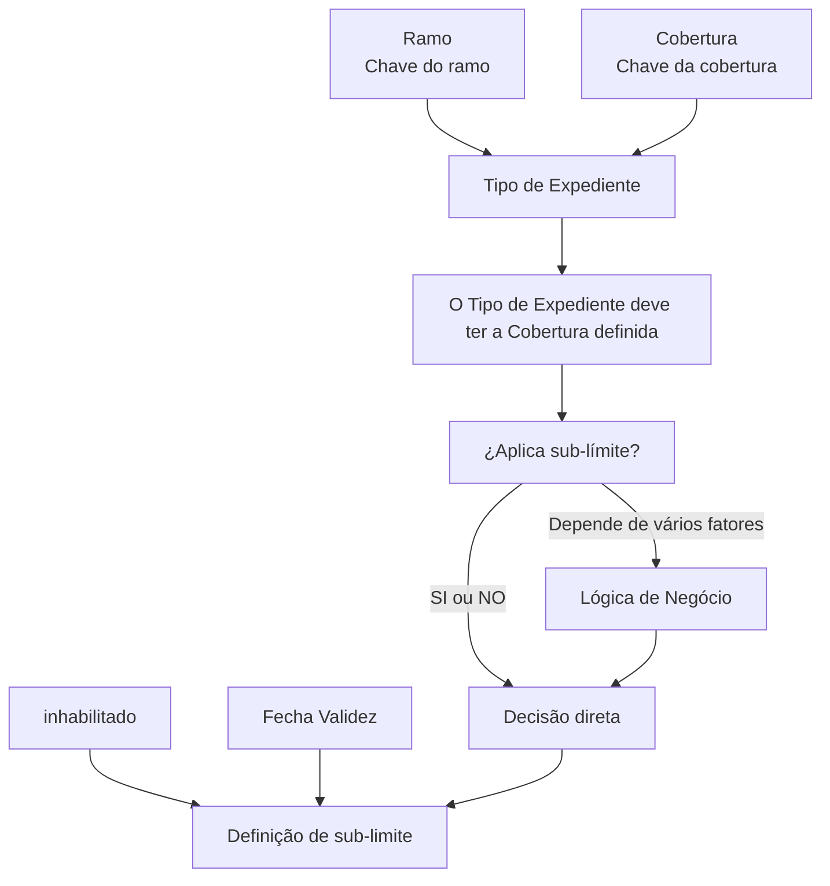

# Definição de Tipos de Expedientes e Aplicação de Sub-limites — Documentação Reef

## 1. Metadados do Documento
- **Arquivo de Origem:** Não identificado
- **Tipo de Documento:** Especificação Funcional
- **Domínio / Sistema:** Reef / Mapfre
- **Público-Alvo:** Negócio, Analistas Funcionais, Desenvolvedores e Operação
- **Data/Versão Identificada:** Não identificada

---

## 2. Resumo Executivo & Contexto de Negócio

O documento descreve a definição de tipos de expedientes que possuem, ou podem possuir, sub-limites associados a coberturas. O objetivo declarado é explicar como configurar os Tipos de Expedientes para os quais os sub-limites são definidos.

A configuração relaciona quatro elementos principais: **Ramo**, **Cobertura**, **Tipo de Expediente** e a indicação de aplicação de sub-limite. O Ramo identifica a chave do ramo dos tipos de expedientes; a Cobertura identifica a chave da cobertura que poderá ter sub-limites; e o Tipo de Expediente representa o expediente ao qual a definição será aplicada.

O documento também prevê situações em que a aplicação de sub-limite não pode ser resolvida apenas com uma indicação direta de “SI” ou “NO”. Nesses casos, uma lógica de negócio deve ser definida para resolver a decisão com base em vários fatores, embora os fatores e a implementação dessa lógica não sejam detalhados.

A definição possui mecanismos de controle de vigência e habilitação. A propriedade **inhabilitado** informa se a definição está habilitada, enquanto a **Fecha Validez** determina a data de entrada em vigor da configuração.

---

## 3. Arquitetura, Componentes & Tecnologias Envolvidas

Os elementos identificados no documento são:

| Componente / Termo | Papel identificado |
| :--- | :--- |
| Reef | Repositório ou domínio de documentação mencionado no conteúdo. |
| Mapfredocument | Referência apresentada na navegação da documentação. |
| Ramo | Chave do ramo associada aos tipos de expedientes configurados. |
| Cobertura | Chave da cobertura para a qual se define a existência ou não de sub-limites. |
| Tipo de Expediente | Tipo de expediente afetado pela definição de sub-limites; deve possuir a cobertura definida. |
| Lógica de Negócio | Mecanismo para decidir a aplicação de sub-limite quando a resposta não é diretamente “SI” ou “NO”. |
| inhabilitado | Propriedade que informa se a definição está habilitada. |
| Fecha Validez | Data em que a definição entra em vigor. |



**Nota de Análise:** O documento não detalha serviços, APIs, métodos HTTP, contratos JSON, persistência de dados, tecnologias de implementação ou ambientes de execução.

---

## 4. Regras de Negócio, Especificações Funcionais & Processos

1. A definição de sub-limites é realizada para Tipos de Expedientes que possuem ou podem possuir sub-limites.
2. A propriedade **Ramo** deve conter a chave do ramo dos Tipos de Expedientes para os quais os sub-limites estão sendo definidos.
3. A propriedade **Cobertura** deve conter a chave da cobertura para a qual será definido se existem ou não sub-limites.
4. A propriedade **Tipo de Expediente** deve indicar o tipo de expediente ao qual será aplicada a definição de sub-limites.
5. O Tipo de Expediente selecionado deve possuir a Cobertura definida.
6. A propriedade **¿Aplica sub-límite?** deve informar se o Tipo de Expediente, em relação à Cobertura, possui sub-limites definidos.
7. Quando a aplicação do sub-limite não puder ser determinada diretamente como **SI** ou **NO**, a definição deve conter uma lógica de negócio que resolva a decisão.
8. A lógica de negócio para aplicação de sub-limite pode depender de vários fatores, mas o documento não especifica esses fatores.
9. A propriedade **inhabilitado** informa se o registro ou a definição está habilitada.
10. A propriedade **Fecha Validez** informa a data a partir da qual a definição entra em vigor.

---

## 5. Tabelas de Parâmetros, Ambientes e Estruturas de Dados

| Item / Parâmetro | Descrição / Função | Tipo / Valores / Formato | Ambiente / Observações |
| :--- | :--- | :--- | :--- |
| Ramo | Chave do ramo dos Tipos de Expedientes para os quais são definidos sub-limites. | Chave do ramo; formato não detalhado. | Não informado. |
| Cobertura | Chave da cobertura para a qual é definido se há ou não sub-limites. | Chave da cobertura; formato não detalhado. | Não informado. |
| Tipo de Expediente | Tipo de expediente ao qual será definida a aplicação de sub-limites. | Tipo de expediente; formato não detalhado. | Deve possuir a Cobertura definida. |
| ¿Aplica sub-límite? | Indica se o Tipo de Expediente associado à Cobertura possui sub-limites definidos. | Valores citados: `SI` ou `NO`; pode depender de lógica de negócio. | A decisão pode depender de vários fatores. |
| Lógica de Negócio | Resolve a aplicação de sub-limite quando `SI` ou `NO` não são suficientes. | Não detalhado. | Fatores de decisão não especificados. |
| inhabilitado | Indica se o registro ou definição está habilitada. | Estado de habilitação; valores não detalhados. | Não informado. |
| Fecha Validez | Define a data de entrada em vigor da definição. | Data; formato não detalhado. | Controla a vigência da definição. |
| Owner | Proprietário exibido na documentação. | `user:agonzalez_mapfre.com` | Informação de governança documental. |
| Lifecycle | Estado do ciclo de vida exibido na documentação. | `Approved Source / VL` | Sem detalhamento adicional. |

---

## 6. Bateria de Perguntas & Respostas para RAG (FAQ Sintético)

### P1: Qual é o objetivo do documento sobre Tipos de Expedientes e sub-limites?
**R:** O objetivo é explicar como definir os Tipos de Expedientes que possuem ou podem possuir sub-limites definidos para uma Cobertura.

### P2: Qual é a função da propriedade Ramo na definição de sub-limites?
**R:** A propriedade Ramo contém a chave do ramo dos Tipos de Expedientes para os quais os sub-limites estão sendo definidos.

### P3: O que a propriedade Cobertura representa?
**R:** A propriedade Cobertura contém a chave da cobertura para a qual será definido se existem ou não sub-limites.

### P4: Qual restrição existe para o Tipo de Expediente configurado?
**R:** O Tipo de Expediente ao qual será definida a aplicação de sub-limites deve possuir a Cobertura definida.

### P5: O que indica a propriedade “¿Aplica sub-límite?”?
**R:** A propriedade “¿Aplica sub-límite?” informa se o Tipo de Expediente, em relação à Cobertura, possui ou não sub-limites definidos.

### P6: Quando é necessário usar uma lógica de negócio para decidir a aplicação de sub-limite?
**R:** A lógica de negócio é necessária quando a aplicação do sub-limite para a combinação de Cobertura e Tipo de Expediente não pode ser resolvida diretamente com `SI` ou `NO` e depende de vários fatores.

### P7: O documento especifica quais fatores são avaliados pela lógica de negócio de sub-limites?
**R:** Não. O documento afirma que a aplicação pode depender de vários fatores, mas não identifica os fatores, regras de avaliação ou critérios de decisão.

### P8: O que a propriedade inhabilitado controla?
**R:** A propriedade inhabilitado indica se o registro ou a definição de sub-limites está habilitada.

### P9: Qual é a finalidade da Fecha Validez?
**R:** A Fecha Validez é a data na qual a definição de sub-limites entra em vigor.

### P10: O documento informa APIs, métodos HTTP ou contratos de integração?
**R:** Não. O documento não apresenta APIs, métodos HTTP, contratos JSON, bancos de dados, tecnologias de implementação ou detalhes de integração.

---

## 7. Glossário de Termos, Siglas & Conceitos-Chave

- **Ramo:** Chave do ramo dos Tipos de Expedientes aos quais a definição de sub-limites se aplica.
- **Cobertura:** Chave da cobertura para a qual se define a existência ou ausência de sub-limites.
- **Tipo de Expediente:** Tipo de expediente que recebe a definição de sub-limites e que deve possuir a Cobertura definida.
- **Sub-límite:** Elemento cuja aplicação é definida para a relação entre Cobertura e Tipo de Expediente.
- **¿Aplica sub-límite?:** Propriedade que informa se há sub-limites definidos para um Tipo de Expediente em relação a uma Cobertura.
- **Lógica de Negócio:** Regra não detalhada que decide a aplicação de sub-limite quando uma resposta direta `SI` ou `NO` não é suficiente.
- **inhabilitado:** Propriedade que indica se a definição está habilitada.
- **Fecha Validez:** Data de entrada em vigor da definição.
- **Reef:** Nome mencionado no contexto de documentação.
- **VL:** Sigla apresentada no campo Lifecycle, sem expansão no documento.

---

## 8. Notas Críticas, Riscos & Limitações

- O documento não detalha os fatores usados pela Lógica de Negócio para decidir a aplicação de sub-limites.
- Não são especificados os valores técnicos aceitos para Ramo, Cobertura, Tipo de Expediente, inhabilitado ou Fecha Validez.
- Não há descrição de fluxos de aprovação, manutenção, exclusão ou atualização das definições.
- Não há informações sobre persistência, interfaces, APIs, integrações, logs, segurança, permissões ou ambientes.
- O texto afirma que o Tipo de Expediente deve ter a Cobertura definida, mas não descreve como essa validação ocorre nem qual é o comportamento em caso de inconsistência.
- O campo Lifecycle apresenta `Approved Source / VL`, mas o significado operacional de `VL` não é detalhado.

---

## 9. Conteúdo Bruto Estruturado (Referência Fiel)

```text
--- [PÁGINA 1 DE 1] ---

DEFINICIÓN de Tipos de Expedientes Coberturas que pueden tener
Sub-límites
Objetivo
Este documento tiene como objetivo explicar como denir los Tipos de Expedientes que tienen o pueden tener denido sub-límites
Propiedades
Ramo
Clave del Ramo de los tipos de expedientes a el que estamos deniendo sub-límites.
Cobertura
Tendrá la clave de la cobertura a la que se le van a denir si tiene o no sub-límites.
Tipo de Expediente
Esta propiedadcontiene el tipo de expediente al que se le va a denir sub-límites. Este tipo de expediente tiene que tener la cobertura denida
¿Aplica sub-límite?
Esta propiedadindica si este tipo de expediente que afecta a la cobertura, tiene o no sub-límites denidos
Lógica de Negocio que determina si se aplica o no el sub-límite
Si la aplicación del sub-límite para la cobertura y tipo de expediente no es SI o NO, si no que depende da varios factores aquí estará denida la
lógica de negocio que lo resuelve
inhabilitado
Esta propiedadindica si el registro está o no habilitada esta denición.
Fecha Validez
Fecha en la que entra en vigor la denición
Documentation / DOCUMENTACIÓN Reef
DOCUMENTACIÓN Reef
Mapfredocument
DOCUMENTACIÓN Reef
Owner
user:agonzalez_mapfre.com
Lifecycle
Approved Source
 / 
 VL
Buscar Inicio Soluciones Arquitecturas APIs Componentes Cloud Documentación Zeus Reef Ayuda
ES
```
