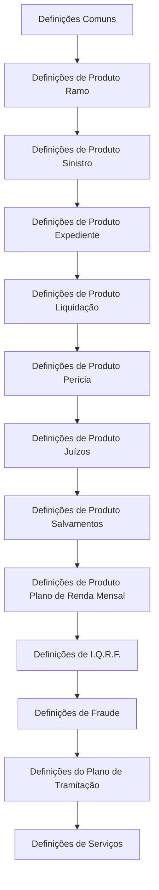
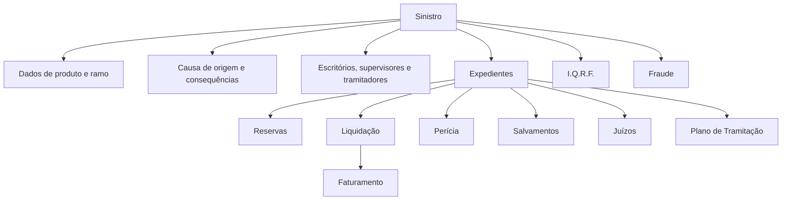

# Definições de Sinistros no REEF — Estrutura de Configuração de Produtos, Tramitação e Serviços

## 1. Metadados do Documento
- **Arquivo de Origem:** Não identificado no conteúdo extraído
- **Tipo de Documento:** Arquitetura de Software / Manual Funcional
- **Domínio / Sistema:** REEF — módulos de Siniestros (Sinistros)
- **Público-Alvo:** Analistas funcionais, configuradores de produto, desenvolvedores, arquitetos e operação
- **Data/Versão Identificada:** Não identificada

---

## 2. Resumo Executivo & Contexto de Negócio

O documento apresenta uma estrutura de definição e configuração dos módulos de **Siniestros** no sistema REEF. O conteúdo organiza os elementos necessários para parametrizar o ciclo de vida de sinistros, desde definições comuns e configuração de produto até processos de expediente, liquidação, perícia, salvamentos, juízos, fraude, faturamento e planos de tramitação.

A sequência inicial explicitada pelo documento indica uma ordem de definição: definições comuns, produto ramo, produto sinistro, produto expediente, produto liquidação, produto perícia, produto juízos, produto salvamentos, plano de renda mensal, I.Q.R.F., fraude e plano de tramitação. Essa organização sugere dependências funcionais entre dados mestres corporativos, configurações de ramo/produto e regras específicas de processamento de sinistros.

O documento também descreve elementos de estrutura organizacional e operacional, incluindo companhias, moedas, estruturas geográfica e comercial, escritórios gestores e tramitadores, supervisores, tramitadores e papéis de Call Center. Esses elementos suportam a distribuição de responsabilidade, alocação de trabalho, acesso à operação e tratamento de sinistros.

As definições de produto abrangem regras de cobertura, franquias/dedutíveis, causas, consequências, reservas, validações, valores iniciais, valores máximos e documentos requeridos. O escopo cobre tanto a abertura e o tratamento de sinistros quanto atividades financeiras, periciais, recuperação de bens, processos judiciais e controles de fraude.

O conteúdo extraído funciona predominantemente como um índice funcional de configurações disponíveis no REEF. O documento cita diversos conceitos e entidades, mas não detalha contratos de integração, métodos HTTP, esquemas JSON, versões de componentes, URLs de ambientes, portas de rede ou regras de cálculo específicas.

---

## 3. Arquitetura, Componentes & Tecnologias Envolvidas

O sistema citado é o **REEF**, em contexto de documentação corporativa associada a “Mapfredocument”. O domínio funcional principal é o tratamento de sinistros, denominado no documento como **Siniestros**.

Os componentes funcionais identificados são:

- Definições comuns de sinistros.
- Definições de produto ramo.
- Definições de produto sinistro.
- Definições de produto expediente.
- Definições de produto liquidação.
- Definições de produto perícia.
- Definições de produto salvamentos.
- Definições de produto juízos.
- Definições de I.Q.R.F.
- Definições de fraude.
- Definições de plano de renda mensal.
- Definições de faturamento.
- Definições do plano de tramitação.
- Definições de serviços.

O fluxo abaixo representa exclusivamente a ordem de módulos indicada no conteúdo. O documento não fornece integrações técnicas, protocolos ou fluxos de dados entre serviços.



### Estrutura funcional de tratamento de sinistros



> **Nota de Análise:** o documento apresenta módulos e itens de configuração, mas não detalha a arquitetura técnica do REEF, tais como camadas de aplicação, bancos de dados, APIs, mensageria, infraestrutura, ambientes ou mecanismos de autenticação.

---

## 4. Regras de Negócio, Especificações Funcionais & Processos

### 4.1 Ordem de definição dos módulos de sinistros

O documento estabelece a seguinte ordem para a realização das definições dos módulos de sinistros:

1. Definições Comuns.
2. Definições de Produto Ramo.
3. Definições de Produto Sinistro.
4. Definições de Produto Expediente.
5. Definições de Produto Liquidação.
6. Definições de Produto Perícia.
7. Definições de Produto Juízos.
8. Definições de Produto Salvamentos.
9. Definições de Produto Plano de Renda Mensal.
10. Definições de I.Q.R.F.
11. Definições de Fraude.
12. Definições do Plano de Tramitação.

### 4.2 Definições comuns de sinistros

As definições comuns referenciadas incluem:

- Companhia.
- Moeda.
- Estrutura geográfica.
- Estrutura comercial.
- Tratamento.
- Estrutura de produto.
- Componentes da numeração do sinistro.
- Características gerais de sinistros.
- Estrutura de tramitação.
- Escritórios tramitadores.
- Supervisores.
- Tramitadores.
- Relação entre escritórios gestores e tramitadores.
- Documentos requeridos.
- Eventos catastróficos.
- Eventos catastróficos por estrutura geográfica.
- Reserva de numeração de sinistros.
- Características gerais de Sinistros-Ramo.
- Extemporaneidade.
- Responsáveis de supervisores.
- Critérios de atribuição de supervisores.
- Critérios de atribuição de tramitadores.
- Papéis de tramitador do Call Center.

### 4.3 Definições de Produto Ramo

O documento relaciona as seguintes definições para produto ramo:

- Coberturas.
- Franquias / dedutíveis.
- Características gerais de Sinistros-Ramo.
- Extemporaneidade.
- Critérios de atribuição de supervisores.
- Critérios de atribuição de tramitadores.
- Papéis de tramitador do Call Center.

> **Nota de Análise:** o documento não define os valores, fórmulas, limites ou critérios específicos de cobertura, franquia/dedutível ou extemporaneidade.

### 4.4 Definições de Produto Sinistro

As definições de produto sinistro incluem:

- Causas de origem do sinistro.
- Consequências.
- Perguntas associadas às consequências.
- Valores iniciais de intervenção externa.
- Causas de origem do sinistro por ramo.
- Informação adicional do sinistro antes das consequências.
- Associação entre causas de origem e consequências.
- Informação adicional do sinistro após as consequências.
- Valores iniciais de sinistros.
- Validações de sinistros.
- Causas de modificação do sinistro.
- Causas de reabilitação do sinistro.
- Restrições, acessos de operação e observações do plano.

### 4.5 Definições de Produto Expediente

As definições de produto expediente incluem:

- Tipos de expedientes.
- Comportamento por tipo de expediente.
- Conceitos de reserva.
- Características de tipos de expediente por ramo.
- Informação de dados fixos do expediente.
- Causas de abertura de expediente.
- Informação complementar do expediente.
- Tipos de expediente de recobro associáveis a tipos de expediente.
- Tipos de expediente mutuamente excludentes dentro de um sinistro.
- Associação entre tipo de expediente, coberturas e conceitos de reserva.
- Associação entre causas, consequências, tipo de expediente e cobertura.
- Provisão inicial para causa, consequência, tipo de expediente, cobertura e conceito de reserva.
- Valor máximo para causa, consequência, tipo de expediente, cobertura e conceito de reserva.
- Limites de avaliação inicial.
- Documentos para tramitar o tipo de expediente.

### 4.6 Definições de Produto Liquidação

As definições de produto liquidação incluem:

- Escritórios pagadores.
- Documentos para compra e venda.
- Conceitos de cobrança e pagamento diversos de sinistros.
- Impostos.
- Características de impostos.
- Agrupamentos de impostos.
- Impostos por agrupamento.
- Associação de impostos a conceitos de cobrança e pagamento diversos.
- Numeração de ordens de pagamento.
- Conceitos de cobrança/pagamento permitidos por tipo de expediente e conceito de reserva.
- Terceiros e conceitos permitidos para cobrar ou pagar uma liquidação.
- Convênios de pagamento de terceiros.
- Valores iniciais de liquidação.
- Validações de liquidação.
- Aplicação de prêmios pendentes nas liquidações.
- Informação adicional de liquidação.
- Valores iniciais de liquidação.
- Valores máximos de liquidação.
- Causas de modificação de liquidação.

### 4.7 Definições de Produto Perícia

As definições de produto perícia incluem:

- Peritos.
- Centros de perícia.
- Oficinas.
- Guindastes.
- Partes de uma propriedade.
- Subpartes de uma propriedade.
- Danos por propriedade.
- Códigos de reparação por propriedade.
- Associação de peritos a centros de perícia.
- Locais de trabalho do perito.
- Tabelas de honorários de peritos por local de trabalho.
- Tipos de resultados de visitas.
- Tipos de expedientes que permitem perícia.
- Terceiros permitidos para realizar perícia.
- Tipo de propriedade a periciar por tipo de expediente.
- Causas de perícia.
- Causas de resultado de visita.
- Informação adicional de perícia.
- Detalhamento de conceitos de cobrança e pagamento diversos.
- Valores iniciais de perícia.
- Validações de perícia.

### 4.8 Definições de Produto Salvamentos

As definições de produto salvamentos incluem:

- Recuperadores.
- Depósitos de salvamentos.
- Possíveis localizações dos bens recuperados.
- Documentos necessários para bens recuperados.
- Classificação de bens recuperados conforme estado de conservação.
- Terceiros permitidos para comprar um bem recuperado.
- Valores iniciais de salvamentos.
- Validações de salvamentos.
- Informação adicional de salvamentos.
- Causas de liberação de inventário.
- Causas de anulação de inventário.

### 4.9 Definições de Produto Juízos

As definições de produto juízos incluem:

- Advogados.
- Procuradores.
- Tribunais.
- Juros de mora.
- Detalhamento de conceitos de cobrança e pagamento diversos.
- Valores iniciais de juízos.
- Validações de juízos.
- Informação adicional de juízos.
- Causas de reabertura do juízo.

### 4.10 I.Q.R.F.

O módulo I.Q.R.F. contempla:

- Motivos de incidência, queixa, reclamação e felicitação.
- Informante de incidência, queixa, reclamação e felicitação.
- Afetado por incidência, queixa, reclamação e felicitação.
- Classificação de incidência, queixa, reclamação e felicitação.
- Características de incidência, queixa, reclamação e felicitação.

> **Nota de Análise:** o documento usa a sigla I.Q.R.F., mas não apresenta sua expansão formal.

### 4.11 Fraude

As definições de fraude incluem:

- Definição de fraude.
- Características de fraude.
- Tipo de fraude.
- Motivo da fraude.
- Motivos de fraude por tipo de fraude.
- Valor de fraude.
- Tipo de conclusão da fraude.
- Classificação da fraude.
- Estados de gestão da fraude.

### 4.12 Plano de Renda Mensal

O plano de renda mensal inclui:

- Planos de Renda Mensais.
- Características de Planos de Renda Mensais.
- Planos de renda por ramo, tipo de expediente e modalidade.
- Definição do plano de renda.

### 4.13 Faturamento

As definições de faturamento incluem:

- Detalhamento de conceitos de cobrança e pagamento diversos de faturamento.
- Conceito de detalhe por tipo de fatura.
- Causas de faturamento, identificadas como gastos não amparados.
- Valores iniciais de faturamento.
- Restrições, acessos de operação e observações do plano.

### 4.14 Plano de Tramitação

As definições do plano de tramitação incluem:

- Planos de tramitação.
- Níveis.
- Trâmites.
- Associação de trâmites a um nível.
- Associação de níveis a um plano.
- Associação entre plano, nível e trâmite.
- Operações-estruturas de um trâmite.
- Observações de operações-estruturas no plano de tramitação.
- Cartas de um trâmite.
- Tipificação de avisos.
- Tipificação de anotações livres.
- Papéis para trabalhar com planos, trâmites, níveis e trâmites.
- Associação do plano de tramitação ao tipo de expediente.
- Tipificação de confirmação do tramitador.
- Detalhe-resumo do tramitador.
- Restrições de consulta do centro telefônico.

### 4.15 Serviços

As definições de serviços citam:

- Oficinas.
- Moeda.
- Causa de processo.
- Motivos de bloqueio.
- Motivos de bloqueio por estado.
- Avisos de serviços.
- Vínculos.

---

## 5. Tabelas de Parâmetros, Ambientes e Estruturas de Dados

| Item / Parâmetro | Descrição / Função | Tipo / Valores / Formato | Ambiente / Observações |
| :--- | :--- | :--- | :--- |
| Companhia | Definição comum para sinistros | Não detalhado | Sem ambiente informado |
| Moeda | Definição comum e elemento citado em serviços | Não detalhado | Sem moedas específicas informadas |
| Estrutura geográfica | Estrutura organizacional/geográfica | Não detalhado | Associada a eventos catastróficos |
| Estrutura comercial | Estrutura comercial corporativa | Não detalhado | Sem detalhamento adicional |
| Estrutura de produto | Estrutura de configuração de produtos | Não detalhado | Base para definições de sinistros |
| Componentes da numeração do sinistro | Componentes utilizados na numeração de sinistros | Não detalhado | Inclui reserva de numeração de sinistros |
| Coberturas | Definições de produto ramo | Não detalhado | Sem valores ou condições específicas |
| Franquicias / Deducibles | Franquias ou dedutíveis de produto ramo | Não detalhado | Sem valores ou fórmulas específicas |
| Extemporaneidad | Regra ou característica de Sinistros-Ramo | Não detalhado | Sem critérios explicitados |
| Causas de origem do sinistro | Classificação da origem de um sinistro | Não detalhado | Pode ser configurada por ramo |
| Consequências | Classificação de consequências do sinistro | Não detalhado | Possui perguntas associadas |
| Valores iniciais de intervenção externa | Valores iniciais relacionados à intervenção externa | Não detalhado | Sem regras de cálculo |
| Tipos de expediente | Tipos configuráveis de expediente | Não detalhado | Relacionados a reservas, coberturas e perícia |
| Conceitos de reserva | Conceitos aplicáveis à reserva | Não detalhado | Associáveis a tipos de expediente e cobertura |
| Provisão inicial | Provisão por causa, consequência, tipo de expediente, cobertura e conceito de reserva | Não detalhado | Sem fórmulas ou valores |
| Valor máximo | Limite por causa, consequência, tipo de expediente, cobertura e conceito de reserva | Não detalhado | Sem valores específicos |
| Escritórios pagadores | Estrutura responsável por pagamentos | Não detalhado | Produto liquidação |
| Impostos | Configuração tributária | Características, agrupamentos e associações | Associáveis a conceitos de cobrança/pagamento |
| Numeração de ordens de pagamento | Numeração de ordens de pagamento | Não detalhado | Produto liquidação |
| Terceiros permitidos | Terceiros autorizados para cobrança, pagamento, perícia ou compra de bem recuperado | Não detalhado | O critério varia conforme o módulo |
| Convênios de pagamento de terceiros | Convênios aplicáveis a pagamentos de terceiros | Não detalhado | Produto liquidação |
| Peritos | Profissionais de perícia | Não detalhado | Associáveis a centros e locais de trabalho |
| Centros de perícia | Centros vinculados à atividade de perícia | Não detalhado | Associáveis a peritos |
| Tabelas de honorários | Honorários de peritos por local de trabalho | Não detalhado | Sem valores monetários |
| Bens recuperados | Bens sujeitos a salvamento | Localização, documentação e estado de conservação | Produto salvamentos |
| Juros de mora | Juros relacionados a juízos | Não detalhado | Produto juízos |
| Tipo de fraude | Classificação de fraude | Não detalhado | Possui motivos associados |
| Valor de fraude | Valor associado à fraude | Não detalhado | Sem moeda, cálculo ou limite |
| Estados de gestão da fraude | Estados para gestão de fraude | Não detalhado | Sem máquina de estados descrita |
| Planos de Renda Mensais | Planos de renda mensal | Associáveis a ramo, tipo de expediente e modalidade | Produto P.R.M. |
| Planos de tramitação | Planos para organizar níveis e trâmites | Plano, nível e trâmite | Associáveis a tipo de expediente |
| Motivos de bloqueio | Motivos para bloqueio | Não detalhado | Definições de serviços |
| Motivos de bloqueio por estado | Motivos de bloqueio condicionados a estado | Não detalhado | Definições de serviços |
| Owner | Proprietário identificado na documentação | `user:agonzalez_mapfre.com` | Informação presente no portal documental |
| Lifecycle | Ciclo de vida documental | `Approved Source` | Informação presente no portal documental |

> **Nota de Análise:** o documento não informa servidores, URLs, portas, credenciais, variáveis de ambiente, caminhos de logs ou configurações de infraestrutura.

---

## 6. Bateria de Perguntas & Respostas para RAG (FAQ Sintético)

### P1: Qual é a ordem indicada para definir os módulos de sinistros no REEF?
**R:** A ordem indicada é: Definições Comuns, Produto Ramo, Produto Sinistro, Produto Expediente, Produto Liquidação, Produto Perícia, Produto Juízos, Produto Salvamentos, Produto Plano de Renda Mensal, I.Q.R.F., Fraude e Plano de Tramitação.

### P2: Quais elementos organizacionais participam da estrutura de tramitação de sinistros?
**R:** A estrutura de tramitação cita escritórios tramitadores, supervisores, tramitadores, relação entre escritórios gestores e tramitadores, critérios de atribuição de supervisores, critérios de atribuição de tramitadores e papéis de tramitador do Call Center.

### P3: O que pode ser configurado no produto sinistro?
**R:** O produto sinistro contempla causas de origem, consequências, perguntas associadas às consequências, valores iniciais de intervenção externa, causas por ramo, informações adicionais antes e depois das consequências, associação causa-consequência, valores iniciais, validações, causas de modificação, causas de reabilitação e restrições/acessos/observações do plano.

### P4: Como as reservas são relacionadas aos expedientes?
**R:** O documento indica conceitos de reserva, associação entre tipo de expediente, coberturas e conceitos de reserva, provisão inicial e valor máximo definidos pela combinação de causa, consequência, tipo de expediente, cobertura e conceito de reserva.

### P5: Quais configurações financeiras pertencem ao módulo de liquidação?
**R:** O módulo de liquidação inclui escritórios pagadores, documentos para compra e venda, conceitos de cobrança e pagamento diversos, impostos, agrupamentos de impostos, associação de impostos a conceitos financeiros, numeração de ordens de pagamento, convênios de pagamento de terceiros, valores iniciais, valores máximos, validações e aplicação de prêmios pendentes.

### P6: Quais entidades são configuradas para perícia?
**R:** O documento cita peritos, centros de perícia, oficinas, guindastes, partes e subpartes de propriedade, danos por propriedade, códigos de reparação, locais de trabalho do perito, tabelas de honorários, resultados de visitas, causas de perícia e causas de resultado de visita.

### P7: Que regras o documento associa ao módulo de salvamentos?
**R:** O módulo de salvamentos contempla recuperadores, depósitos de salvamentos, localizações possíveis dos bens recuperados, documentos necessários, classificação por estado de conservação, terceiros autorizados a comprar bens recuperados, valores iniciais, validações, informações adicionais e causas de liberação ou anulação de inventário.

### P8: Quais informações o REEF prevê para o tratamento de fraude?
**R:** O documento lista definição e características de fraude, tipo de fraude, motivo de fraude, motivos por tipo de fraude, valor de fraude, tipo de conclusão, classificação e estados de gestão da fraude. O conteúdo não apresenta os valores, critérios ou transições de estado específicos.

### P9: Como é estruturado um plano de tramitação?
**R:** Um plano de tramitação é composto por planos, níveis e trâmites. O documento também cita associação de trâmites a níveis, associação de níveis a planos, associação plano/nível/trâmite, operações-estruturas de um trâmite, observações, cartas, tipificação de avisos, anotações livres, papéis e associação do plano ao tipo de expediente.

### P10: O documento fornece APIs, URLs de ambiente ou detalhes de integração do REEF?
**R:** Não. O conteúdo extraído não apresenta endpoints, métodos HTTP, contratos JSON, URLs de ambientes, portas, servidores, protocolos de integração ou especificações de API.

---

## 7. Glossário de Termos, Siglas & Conceitos-Chave

- **REEF:** Sistema/documentação corporativa referenciada como contexto dos módulos de sinistros.
- **Siniestros:** Termo em espanhol utilizado para sinistros.
- **Ramo:** Contexto de produto ou linha de negócio de seguros.
- **Expediente:** Entidade funcional associada ao tratamento de um sinistro; o documento prevê tipos, dados fixos, causas de abertura, reservas, documentos e relações com coberturas.
- **Liquidación:** Módulo de liquidação com conceitos de cobrança, pagamento, impostos, ordens de pagamento e validações.
- **Peritación:** Processo ou módulo de perícia.
- **Peritos:** Profissionais responsáveis por atividades de perícia.
- **Salvamentos:** Módulo relacionado a bens recuperados, recuperadores, depósitos e inventário.
- **Juicios:** Módulo relacionado a processos judiciais, advogados, procuradores, tribunais e juros de mora.
- **I.Q.R.F.:** Sigla utilizada para incidência, queixa, reclamação e felicitação; a expansão formal da sigla não é apresentada.
- **Fraude:** Módulo de definição, classificação e gestão de fraude.
- **P.R.M.:** Plan de Renta Mensual; plano de renda mensal.
- **Tramitación:** Processo de tramitação ou condução operacional do sinistro.
- **Tramitador:** Papel responsável por trabalhar com a tramitação de sinistros.
- **Call Center:** Centro telefônico citado em papéis de tramitador e restrições de consulta.
- **Coberturas:** Coberturas de produto ramo.
- **Franquicias / Deducibles:** Franquias ou dedutíveis.
- **Recobro:** Tipo de expediente citado como associável a outros tipos de expediente.
- **Provisión Inicial:** Provisão inicial associada a combinações de causa, consequência, tipo de expediente, cobertura e conceito de reserva.
- **Mapfredocument:** Termo apresentado no cabeçalho da documentação REEF.

---

## 8. Notas Críticas, Riscos & Limitações

- O conteúdo é predominantemente um inventário de configurações funcionais; não contém detalhes suficientes para implementar regras de negócio, cálculos, integrações ou contratos técnicos.
- Não foram identificados valores concretos para coberturas, franquias/dedutíveis, reservas, provisões, limites, impostos, honorários, valores de fraude ou juros de mora.
- Não há descrição de ambientes, URLs, servidores, portas, credenciais, banco de dados, filas, logs, monitoramento ou mecanismos de segurança.
- Não há máquina de estados detalhada para fraude, sinistros, expedientes, liquidações, perícias, salvamentos ou juízos.
- O documento cita validações em diversos módulos, mas não informa as regras, mensagens de erro, campos envolvidos ou condições de aprovação/reprovação.
- A sigla **I.Q.R.F.** não possui expansão formal no texto extraído.
- A extração contém caracteres corrompidos, como `Deniciones`, `geográca`, `Ocinas` e `Conrmación`; esses artefatos foram preservados na referência bruta para auditoria.
- O documento lista o módulo de serviços, porém não detalha os comportamentos de “Causa Proceso”, “Motivos Bloqueos”, “Motivos Bloqueos por estado”, “Avisos Servicios” ou “Vínculos”.

---

## 9. Conteúdo Bruto Estruturado (Referência Fiel)

```text
--- [PÁGINA 1 DE 6] ---

DEFINICIÓN de SINIESTROS
Elementos que intervienen en la denición de los Módulos de Siniestros y orden en el que se debe realizar
Deniciones Comunes
Deniciones de Producto Ramo
Deniciones de Producto Siniestro
Deniciones de Producto Expediente
Deniciones de Producto Liquidación
Deniciones de Producto Peritación
Deniciones de Producto Juicios
Deniciones de Producto Salvamentos
Deniciones de Producto Plan de Renta Mensual
Deniciones de I.Q.R.F.
Deniciones Fraude
Deniciones del Plan de Tramitación
Deniciones Comunes
Deniciones Previas
Compañía
Moneda
Estructura Geográca
Estructura Comercial
Tratamiento
Estructura de producto
Deniciones Siniestros
Componentes de la Numeración del siniestro
Características Generales Siniestros
Documentation / DOCUMENTACIÓN Reef
DOCUMENTACIÓN Reef
Mapfredocument
DOCUMENTACIÓN Reef
Owner
user:agonzalez_mapfre.com
Lifecycle
Approved Source
 /
 VL
Buscar Inicio Soluciones Arquitecturas APIs Componentes Cloud Documentación Zeus Reef Ayuda
ES


--- [PÁGINA 2 DE 6] ---

Estructura Tramitación:
OFICINAS TRAMITADORAS
DEFINICIÓN SUPERVISORES
DEFINICIÓN DE TRAMITADORES
Relación Ocinas Gestoras y Tramitadoras
Documentos Requeridos
Eventos Catastrócos
Eventos Catastrócos por estructura geográca
Deniciones de Producto Ramo
Deniciones Previas
Coberturas
Franquicias / Deducibles
Deniciones Comunes
Reserva de numeración de siniestros
Características generales de Siniestros-Ramo
Extemporaneidad
Responsables de Supervisores
Criterios de asignación supervisores
Criterios de asignación tramitadores
Roles tramitador del CALL CENTER
Deniciones de Producto Siniestro
Deniciones Comunes
Causas Origen del Siniestro
Consecuencias
Preguntas Asociadas a las Consecuencias
Valores iniciales Intervención Externa
Deniciones Siniestro por Producto
Causas Origen del Siniestro Ramo
Información adicional del Siniestro previo Consecuencias
Asociación de Causas Origen–Consecuencias
Información adicional del Siniestro posterior Consecuencias
Valores Iniciales Siniestros
Validaciones Siniestros
Causas Modicación del Siniestro
Causas Rehabilitación del Siniestro
Restricciones-Accesos Operación- Observaciones Plan
Deniciones de Producto Expediente
Deniciones Comunes
Tipos de Expedientes


--- [PÁGINA 3 DE 6] ---

Comportamiento Tipo de Expediente
Conceptos de Reserva
Deniciones Expediente por Producto
Características Tipos de expedientes Ramo
Información Datos Fijos Expediente
Causas Apertura de Expediente
Información Complementaria Expediente
Tipos de Expedientes de Recobro que se pueden asociar a Tipos de Expediente
Tipos de Expediente Excluyentes dentro de un Siniestro
Tipo de Expediente Coberturas y Conceptos de Reserva
Causas-Consecuencias-Tipo de Expediente-Cobertura
Provisión Inicial Causas-Consecuencias-Tipo Expediente-Cobertura-Concepto Reserva
Importe Máximo Causas-Consecuencias-Tipo Expediente-Cobertura-Concepto Reserva
Importes límite de valoración inicial
Documentos para tramitar el Tipo de expediente
Deniciones de Producto Liquidación
Deniciones Previas
Ocinas Pagadoras
Documentos para Compra - Venta
Conceptos de Cobro y Pago Vario de Siniestros
[Impuestos]
Características de Impuestos
Agrupaciones de Impuestos
Impuestos por agrupación
Asociación de Impuestos a Conceptos de cobro y pago vario
Numeración de órdenes de pago
Denición Liquidación por Producto
Conceptos de Cobro/Pago permitidos por Tipo de Expediente y Concepto de Reserva
Terceros y Conceptos permitidos para cobrar/pagar una liquidación
Convenios de pago de terceros
Valores Iniciales Liquidación
Validaciones Liquidación
Aplicación de Primas Pendientes en las liquidaciones
Información adicional Liquidación
Importes Inicial Liquidación
Importes Máximos Liquidación
Causas Modicación de Liquidación
Deniciones de Producto Peritación
Deniciones Previas


--- [PÁGINA 4 DE 6] ---

Peritos
Centros de Peritación
Talleres
Grúas
Deniciones Comunes
Partes de una propiedad
Subpartes de una propiedad
Daños por propiedad
Códigos de reparaciones por propiedad
Asociación de Peritos a Centros de Peritación
Lugares de trabajo del perito
Cuadros de honorarios de peritos por lugar de trabajo
Tipos de Resultados de Visitas
Deniciones Producto Peritación
Tipos de Expedientes que permiten Peritación
Terceros permitidos para Peritar
Tipo de propiedad a peritar por Tipo de Expediente
Causas Peritación
Causas Resultado Visita
Información adicional Peritación
Desglose de conceptos de cobro y pago vario
Valores Iniciales Peritación
Validaciones Peritación
Deniciones de Producto Salvamentos
Deniciones Previas
Recuperadores
Depósitos de Salvamentos
Deniciones Producto Salvamento
Posibles ubicaciones de los bienes recuperados
Documentos necesarios para bienes recuperados
Clasicación de bienes recuperados según su estado conservación
Terceros permitidos para comprar un bien recuperado
Valores iniciales Salvamentos
Validaciones Salvamentos
Información adicional Salvamentos
Causas Liberación Inventario
Causas Anulación Inventario
Deniciones de Producto Juicios


--- [PÁGINA 5 DE 6] ---

Deniciones Previas
Abogados
Procuradores
Juzgados
Deniciones Comunes
Intereses de demora
Denición Producto Juicio
Desglose de conceptos de cobro y pago vario
Valores iniciales Juicios
Validaciones Juicios
Información Adicional Juicios
Causas Reapertura del Juicio
Deniciones de I.Q.R.F.
Deniciones Comunes
Motivos de Incidencia, Queja, Reclamación y Felicitación
Informante Incidencia, Queja, Reclamación y Felicitación
Afectado Incidencia, Queja, Reclamación y Felicitación
Clasicación Incidencia, Queja, Reclamación y Felicitación
Deniciones Producto I.Q.R.F.
Características Incidencia, Queja, Reclamación y Felicitación
Deniciones Fraude
Denición Fraude
Características de Fraude
Tipo de Fraude
Motivo del Fraude
Motivos de Fraude por Tipo de Fraude
Importe Fraude
Tipo de Conclusión del Fraude
Clasicación del Fraude
Estados de Gestión del Fraude
Deniciones de Producto Plan de Renta Mensual
Deniciones Plan de Renta Mensual (P.R.M)
Planes de Renta Mensuales
Características Planes de Renta Mensuales
Planes de Renta por Ramo, Tipo de Expediente y Modalidad
Plan de Renta Denición
Deniciones de Producto Facturación


--- [PÁGINA 6 DE 6] ---

Deniciones Facturación
Desglose de conceptos de cobro y pago vario Facturación
Concepto de Detalle por Tipo de Factura
Causas de Facturación (Gastos no Amparados)
Valores Iniciales Facturación
Restricciones-Accesos Operación-Observaciones Plan
Deniciones del Plan de Tramitación
Deniciones Comunes
Planes de tramitación
Niveles
Trámites
Asociación de trámites a un nivel
Asociación de niveles a un plan
Asociación de plan /nivel / trámite
Operaciones-Estructuras de un Trámite
Observaciones de Operaciones-Estructuras en el Plan de Tramitación
Cartas de un Trámite
Tipicación de Avisos
Tipicación de Anotaciones Libres
Roles para trabajar con planes trámites, niveles, trámites
Deniciones Producto Plan Tramitación
Asociación del Plan de tramitación al Tipo de Expediente
Tipicación de Conrmación del Tramitador
Detalle Resumen del Tramitador
Restricciones consulta del Centro Telefónico
Deniciones de Servicios
Deniciones Previas
[Talleres]
[Moneda]
Deniciones Comunes
[Causa Proceso]
[Motivos Bloqueos]
[Motivos Bloqueos por estado]
[Causa Proceso]
[Avisos Servicios]
Vínculos
Checking links...
```
