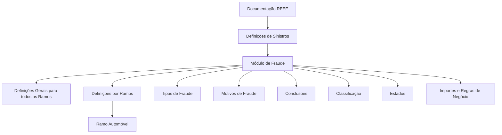

# Documentação REEF — Definições do Módulo de Fraude para Sinistros de Automóvel

## 1. Metadados do Documento
- **Arquivo de Origem:** Não identificado
- **Tipo de Documento:** Especificação Técnica
- **Domínio / Sistema:** REEF / Mapfre — Definições de Sinistros, módulo de fraude
- **Público-Alvo:** Negócio, analistas funcionais, desenvolvedores e operação
- **Data/Versão Identificada:** Não identificada

---

## 2. Resumo Executivo & Contexto de Negócio

O documento apresenta definições funcionais relacionadas ao módulo de fraude no contexto de sinistros de automóvel. O conteúdo está hospedado ou referenciado como “DOCUMENTACIÓN Reef” e contém classificação, tipos, motivos, conclusões e estados aplicáveis ao tratamento de fraude.

A estrutura distingue definições gerais, aplicáveis a todos os ramos, de definições específicas por ramo. O ramo explicitamente citado é Automóvel, embora o extrato não detalhe regras exclusivas para esse ramo.

O módulo de fraude contempla tipos como fraude identificada sem provas, fraude parcial e fraude confirmado. Também contempla motivos associados a possíveis comportamentos fraudulentos, incluindo delinquência organizada, solicitação de valor superior ao autorizado, solicitação dos mesmos danos e alegação de lesões fora do acidente.

O documento também cita importes fixos ou regras de negócio para cálculo de dinheiro economizado. Entretanto, não apresenta fórmulas, valores, condições de aplicação, contratos técnicos, métodos HTTP, estruturas JSON ou detalhes operacionais adicionais.

---

## 3. Arquitetura, Componentes & Tecnologias Envolvidas

| Componente / Conceito | Papel identificado |
| :--- | :--- |
| REEF | Sistema ou domínio documental referenciado como “DOCUMENTACIÓN Reef”. |
| Mapfre | Organização ou contexto corporativo citado no conteúdo. |
| Módulo de Fraude | Módulo que concentra definições de fraude para sinistros. |
| Sinistros de Automóvel | Contexto funcional mencionado no título do conteúdo bruto. |
| Ramos | Agrupamento para definições específicas por ramo. |
| D.I.S.M.A. | Referência citada como estado de revisão; significado não detalhado. |
| Zeus | Item presente na navegação documental; relação funcional não detalhada. |
| Cloud | Item presente na navegação documental; tecnologia, provedor ou uso não detalhado. |
| APIs | Item presente na navegação documental; nenhuma API é especificada. |



> **Nota de Análise:** O conteúdo não descreve uma arquitetura de software, integrações entre sistemas, microsserviços, bancos de dados, APIs ou tecnologias de implementação.

---

## 4. Regras de Negócio, Especificações Funcionais & Processos

### 4.1 Escopo das definições

1. O documento prevê **definições gerais para todos os ramos**.
2. O documento prevê **definições por ramos**.
3. O contexto explicitamente identificado é o de **sinistros de automóvel**.
4. O extrato não detalha quais definições diferenciam o ramo Automóvel dos demais ramos.

### 4.2 Tipos de fraude

O módulo de fraude lista os seguintes tipos:

- Fraude identificada sem provas.
- Fraude parcial.
- Fraude confirmado.

> **Nota de Análise:** O documento não define critérios de elegibilidade, transição ou evidência necessários para classificar um caso em cada tipo de fraude.

### 4.3 Motivos de fraude

Os motivos citados para fraude são:

- Delinquência organizada.
- Solicitação de valor superior ao autorizado.
- Solicitação dos mesmos danos.
- Solicitação de lesões fora do acidente.

O documento também menciona a existência de “motivos de fraude por tipos de conclusão”, mas não apresenta o mapeamento entre motivo, tipo de fraude e conclusão.

### 4.4 Conclusões

Os tipos de conclusão explicitamente citados são:

- Procedente.
- Rejeitado.

> **Nota de Análise:** Não há detalhamento sobre as regras que determinam quando uma conclusão deve ser “Procedente” ou “Rejeitado”.

### 4.5 Classificação de fraude

As classificações de fraude apresentadas são:

- Fraude doloso.
- Fraude ocasional.

> **Nota de Análise:** O documento não explica a diferença conceitual ou operacional entre fraude doloso e fraude ocasional.

### 4.6 Estados de fraude

Os estados mencionados são:

- Atribuído.
- Revisão.
- Revisão D.I.S.M.A.

> **Nota de Análise:** O documento não apresenta uma máquina de estados, eventos de transição, responsáveis por cada estado ou regras de entrada e saída.

### 4.7 Importes e dinheiro economizado

O conteúdo indica que podem existir:

- Importes fixos; ou
- Regras de negócio para calcular dinheiro economizado.

> **Nota de Análise:** Nenhum importe, fórmula, moeda, regra de cálculo, condição de aplicação ou exemplo numérico foi disponibilizado no conteúdo bruto.

---

## 5. Tabelas de Parâmetros, Ambientes e Estruturas de Dados

| Item / Parâmetro | Descrição / Função | Tipo / Valores / Formato | Ambiente / Observações |
| :--- | :--- | :--- | :--- |
| Sistema documental | Referência à documentação REEF. | “DOCUMENTACIÓN Reef” | Sem URL, versão ou ambiente identificados. |
| Módulo | Módulo funcional para definições de fraude. | Módulo de Fraude | Contexto de sinistros. |
| Contexto de sinistro | Domínio citado no título do conteúdo. | Automóvel | Não há detalhamento adicional. |
| Escopo geral | Definições aplicáveis a todos os ramos. | Definições gerais | Regras não detalhadas. |
| Escopo por ramo | Definições específicas por ramo. | Definições por Ramos | Apenas Automóvel é citado. |
| Tipo de fraude | Classificação do tipo de fraude. | Fraude identificada sem provas; fraude parcial; fraude confirmado | Critérios não especificados. |
| Motivo de fraude | Razão associada à fraude. | Delinquência organizada; valor superior ao autorizado; mesmos danos; lesões fora do acidente | Lista aparentemente não exaustiva, pois termina com reticências. |
| Conclusão | Resultado de conclusão do caso. | Procedente; rejeitado | Regras não especificadas. |
| Motivos por tipo e conclusão | Associação entre motivos, tipos e conclusões. | Não detalhado | Apenas mencionado. |
| Classificação | Categoria de fraude. | Fraude doloso; fraude ocasional | Sem definição dos conceitos. |
| Estado | Situação do caso de fraude. | Atribuído; revisão; revisão D.I.S.M.A. | Fluxo e transições não detalhados. |
| Importes | Valores ou regras para apurar economia. | Importes fixos ou regras de negócio | Fórmulas e valores não disponibilizados. |
| Owner | Proprietário documental informado. | `user:agonzalez_mapfre.com` | Informação apresentada literalmente no conteúdo. |
| Lifecycle | Estado de ciclo de vida do documento. | Approved Source / VL | Significado de “VL” não identificado. |
| Navegação documental | Itens de navegação presentes no extrato. | Buscar, Inicio, Soluciones, Arquitecturas, APIs, Componentes, Cloud, Documentación, Zeus, Reef, Ayuda | Não representa necessariamente componentes da solução. |

---

## 6. Bateria de Perguntas & Respostas para RAG (FAQ Sintético)

### P1: Qual é o objetivo do módulo de fraude documentado no REEF?
**R:** O módulo de fraude reúne definições para o tratamento de fraude no contexto de sinistros. O conteúdo cita tipos, motivos, conclusões, classificações, estados e importes ou regras de negócio para cálculo de dinheiro economizado.

### P2: Quais tipos de fraude são mencionados no documento?
**R:** O documento cita três tipos: fraude identificada sem provas, fraude parcial e fraude confirmado. O conteúdo não especifica critérios, evidências ou regras para enquadrar um caso em cada tipo.

### P3: Quais motivos de fraude estão explicitamente listados?
**R:** Os motivos explicitamente apresentados são delinquência organizada, solicitação de valor superior ao autorizado, solicitação dos mesmos danos e solicitação de lesões fora do acidente.

### P4: Quais conclusões podem ser registradas para um caso de fraude?
**R:** O conteúdo cita duas conclusões: procedente e rejeitado. Não são apresentadas regras de negócio que determinem a seleção de uma dessas conclusões.

### P5: Como a fraude pode ser classificada no documento?
**R:** A fraude pode ser classificada como fraude doloso ou fraude ocasional. O extrato não fornece definições, critérios ou exemplos para diferenciar essas classificações.

### P6: Quais estados do processo de fraude são mencionados?
**R:** O documento menciona os estados atribuído, revisão e revisão D.I.S.M.A. Não há descrição do fluxo de transição entre os estados nem do significado da sigla D.I.S.M.A.

### P7: O documento descreve regras para calcular dinheiro economizado?
**R:** O documento informa que existem importes fixos ou regras de negócio para calcular dinheiro economizado. Entretanto, o conteúdo bruto não contém fórmulas, importes, moedas, exemplos ou condições de cálculo.

### P8: O documento diferencia definições gerais e definições por ramo?
**R:** Sim. O conteúdo separa definições gerais para todos os ramos de definições por ramos. O ramo Automóvel é citado, mas o extrato não detalha quais regras são específicas desse ramo.

### P9: Existe um mapeamento entre motivos de fraude, tipos e conclusões?
**R:** O conteúdo menciona “motivos de fraude por tipos de conclusão”, indicando que esse relacionamento existe. Porém, o mapeamento concreto entre motivos, tipos de fraude e conclusões não está presente no extrato.

### P10: Quais APIs ou contratos técnicos do módulo de fraude são apresentados?
**R:** Nenhuma API, endpoint, método HTTP, contrato JSON, esquema de dados ou integração técnica é apresentado. A palavra “APIs” aparece somente na navegação documental.

---

## 7. Glossário de Termos, Siglas & Conceitos-Chave

- **REEF:** Nome do sistema, domínio ou conjunto documental referenciado como “DOCUMENTACIÓN Reef”.
- **Mapfre:** Organização ou contexto corporativo mencionado no conteúdo.
- **Sinistro:** Contexto funcional associado ao tratamento de ocorrências; o documento cita especificamente sinistros de Automóvel.
- **Módulo de Fraude:** Módulo que contém definições de tipos, motivos, conclusões, classificações e estados de fraude.
- **Ramo:** Agrupamento funcional para definições específicas; o conteúdo diferencia definições gerais e definições por ramos.
- **Fraude identificada sem provas:** Tipo de fraude citado sem definição adicional.
- **Fraude parcial:** Tipo de fraude citado sem definição adicional.
- **Fraude confirmado:** Tipo de fraude citado sem definição adicional.
- **Fraude doloso:** Classificação de fraude citada sem definição adicional.
- **Fraude ocasional:** Classificação de fraude citada sem definição adicional.
- **D.I.S.M.A.:** Sigla citada no estado “revisão D.I.S.M.A.”; significado não informado.
- **Importes:** Valores fixos ou regras de negócio relacionados ao cálculo de dinheiro economizado.
- **Lifecycle:** Campo de ciclo de vida do documento, apresentado com o valor “Approved Source / VL”.
- **VL:** Sigla apresentada no campo Lifecycle; significado não informado.

---

## 8. Notas Críticas, Riscos & Limitações

- O conteúdo é resumido e não fornece detalhamento suficiente para implementar regras de classificação, conclusão ou transição de estados.
- Não há fórmulas, valores, moedas ou condições para cálculo de dinheiro economizado.
- Não há matriz explícita entre motivos de fraude, tipos de fraude e tipos de conclusão.
- A sigla **D.I.S.M.A.** não é definida.
- O valor **VL**, presente no campo Lifecycle, não é definido.
- Não há informações sobre APIs, integrações, contratos de dados, ambientes, URLs, servidores, autenticação ou observabilidade.
- A lista de motivos de fraude termina com reticências no conteúdo original, portanto não é possível tratá-la como lista completa.
- Não são apresentadas regras específicas para sinistros de Automóvel, apesar de o ramo ser citado.

---

## 9. Conteúdo Bruto Estruturado (Referência Fiel)

```text
--- [PÁGINA 1 DE 2] ---

DOCUMENTACIÓN de DEFINICIÓN de SINIESTROS (Automóvil)
DEFINICIONES - MÓDULO FRAUDE
GENERAL
De niciones para todos los Ramos
FRAUDE DEFINICIÓN
De nición de comportamientos del
módulo
TIPOS
Tipos de Fraude: Fraude identi cado sin
pruebas, Fraude parcial, Fraude
Con rmado...
MOTIVOS
Motivos del Fraude: Delincuencia
organizada, Reclama monto superior al
autorizado, Reclama los mismos daños,
Reclama lesiones fuera del accidente...
CONCLUSIÓN
Tipo de Conclusión: Procedente,
Rechazado
MOTIVOS POR TIPO Y CONCLUSIÓN
Motivos de Fraude por tipos de conclusión
CLASIFICACIÓN
Clasi cación de los fraudes: fraude
doloso, fraude ocasional
ESTADOS
Estado en el que se puede encontrar el
Fraude: asignado, revisión, revisión
D.I.S.M.A.,
RAMO
De niciones por Ramos
Documentation / DOCUMENTACIÓN Reef
DOCUMENTACIÓN Reef
Mapfredocument
DOCUMENTACIÓN Reef
Owner
user:agonzalez_mapfre.com
Lifecycle
Approved Source
 /
VL
Buscar Inicio Soluciones Arquitecturas APIs Componentes Cloud Documentación Zeus Reef Ayuda
ES

--- [PÁGINA 2 DE 2] ---

IMPORTES
Importes  jos o reglas de negocio para calcular dinero ahorrado
```
