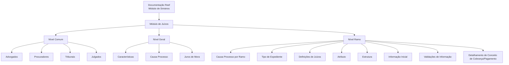

# Documentação Reef — Definições do Módulo de Juízos para Sinistros de Automóvel

## 1. Metadados do Documento
- **Arquivo de Origem:** Não identificado; conteúdo bruto fornecido pelo solicitante
- **Tipo de Documento:** Especificação Funcional
- **Domínio / Sistema:** Reef / Mapfre — módulo de sinistros e juízos
- **Público-Alvo:** Negócio, analistas funcionais e equipes responsáveis pela configuração do módulo
- **Data/Versão Identificada:** Não identificada
- **Status identificado no conteúdo:** Approved

---

## 2. Resumo Executivo & Contexto de Negócio

O documento descreve definições de configuração para o módulo de **juízos** dentro do contexto de **sinistros de automóvel**. A documentação está organizada em níveis de definição: **Comum**, **Geral** e **Ramo**.

O nível **Comum** concentra cadastros necessários à definição do módulo, mas que não são exclusivos de sinistros. Esses cadastros incluem advogados, procuradores, tribunais e julgados que trabalham com a companhia.

O nível **Geral** contém definições que impactam todos os expedientes com juízos. Entre os itens apresentados estão características gerais do módulo, causas de processo e tipos de juros de mora.

O nível **Ramo** contém configurações exclusivas do ramo definido. Essas configurações abrangem causas de processo por ramo, tipos de expediente, atributos, estruturas de informações, informações iniciais, validações de informações e detalhamento econômico de conceitos de cobrança e pagamento de juízos.

> **Nota de Análise:** O conteúdo não apresenta contratos técnicos, métodos HTTP, modelos JSON, banco de dados, URLs de ambiente, versões de software ou responsabilidades operacionais detalhadas.

---

## 3. Arquitetura, Componentes & Tecnologias Envolvidas

Os componentes funcionais identificados são:

- **Reef:** Contexto de documentação em que o conteúdo está publicado.
- **Mapfre:** Organização ou contexto documental mencionado no conteúdo.
- **Módulo de sinistros:** Módulo que contém configurações gerais relacionadas a juízos.
- **Módulo de juízos:** Domínio funcional que concentra definições de expedientes judiciais.
- **Nível Comum:** Cadastros compartilhados e necessários para definições.
- **Nível Geral:** Configurações que afetam todos os expedientes com juízos.
- **Nível Ramo:** Configurações exclusivas de cada ramo definido.



> **Nota de Análise:** O diagrama representa uma organização funcional extraída do documento, não uma arquitetura técnica de integração ou infraestrutura.

---

## 4. Regras de Negócio, Especificações Funcionais & Processos

### 4.1. Definições no nível Comum

O nível **Comum** contém definições que não são exclusivas do módulo de sinistros, mas são necessárias para realizar a definição do módulo de juízos.

As definições apresentadas são:

1. **Advogados:** definir os advogados que trabalharão com a companhia.
2. **Procuradores:** definir os procuradores que trabalharão com a companhia.
3. **Tribunais:** definir os tribunais que trabalharão com a companhia.
4. **Julgados:** definir os julgados que trabalharão com a companhia.

### 4.2. Definições no nível Geral

O nível **Geral** reúne definições que afetarão todos os expedientes com juízos.

1. **Características:** define características gerais do módulo de sinistros e determina comportamentos do módulo de juízos. O documento apresenta como exemplo a definição de permissão para existir mais de um sinistro em um juízo.
2. **Causa Processo:** permite catalogar, em nível de companhia, os motivos pelos quais se deseja reabrir um juízo.
3. **Juros de Mora:** permite definir os diferentes tipos de juros de mora aplicáveis aos juízos.

### 4.3. Definições no nível Ramo

O nível **Ramo** contém definições exclusivas do ramo que está sendo configurado.

1. **Causa Processo:** permite catalogar os motivos pelos quais se deseja realizar a reabertura de um juízo para cada ramo.
2. **Tipo Expediente:** permite definir os tipos de danos aos quais será associado um juízo.
3. **Juízo:** representa as definições de juízos.
4. **Atributo:** permite definir informações adicionais necessárias em cada instalação dos juízos.
5. **Estrutura:** representa informações adicionais do juízo, compostas por atributos, pela obrigatoriedade ou não de solicitar informação e pela ordem em que a informação será solicitada.
6. **Informação Inicial:** permite registrar informação padrão e inicial da informação de core das operações de juízo, evitando que essa informação precise ser inserida posteriormente.
7. **Validações Informação:** permite definir comportamentos e validações para a informação de core de juízos.
8. **Detalhamento Conceito Cobrança/Pagamento Juízos:** determina o detalhamento econômico dos juízos. O documento cita como exemplos consignações judiciais e honorários de advogado.

> **Nota de Análise:** O documento não especifica valores de configuração, critérios de validação detalhados, cálculos de juros, condições de reabertura, fluxos de aprovação ou regras de obrigatoriedade por atributo.

---

## 5. Tabelas de Parâmetros, Ambientes e Estruturas de Dados

| Item / Parâmetro | Descrição / Função | Tipo / Valores / Formato | Ambiente / Observações |
| :--- | :--- | :--- | :--- |
| Advogados | Define os advogados que trabalharão com a companhia. | Cadastro funcional | Nível Comum |
| Procuradores | Define os procuradores que trabalharão com a companhia. | Cadastro funcional | Nível Comum |
| Tribunais | Define os tribunais que trabalharão com a companhia. | Cadastro funcional | Nível Comum |
| Julgados | Define os julgados que trabalharão com a companhia. | Cadastro funcional | Nível Comum |
| Características | Define características gerais do módulo de sinistros e comportamentos do módulo de juízos. | Configuração funcional | Nível Geral; exemplo citado: permitir mais de um sinistro em um juízo |
| Causa Processo — companhia | Cataloga motivos para reabrir um juízo em nível de companhia. | Catálogo de motivos | Nível Geral |
| Juros de Mora | Define diferentes tipos de juros de mora para juízos. | Tipos de juros | Nível Geral |
| Causa Processo — ramo | Cataloga motivos para reabrir um juízo para cada ramo. | Catálogo de motivos | Nível Ramo |
| Tipo Expediente | Define tipos de danos aos quais um juízo será associado. | Tipos de danos | Nível Ramo |
| Juízo | Agrupa definições de juízos. | Definição funcional | Nível Ramo |
| Atributo | Define informação adicional necessária em cada instalação de juízos. | Informação adicional | Nível Ramo |
| Estrutura | Define informação adicional do juízo composta por atributos, obrigatoriedade e ordem de solicitação. | Estrutura de informação | Nível Ramo |
| Obrigatoriedade da informação | Indica se uma informação deve ou não ser solicitada. | Obrigatória ou não obrigatória | Componente da Estrutura |
| Ordem de solicitação | Define a sequência em que a informação será solicitada. | Ordem | Componente da Estrutura |
| Informação Inicial | Registra informação padrão e inicial para operações de juízo. | Informação de core | Nível Ramo |
| Validações Informação | Define comportamentos e validações para a informação de core dos juízos. | Regras de validação | Nível Ramo |
| Detalhamento Conceito Cobrança/Pagamento | Determina o detalhamento econômico dos juízos. | Conceitos econômicos | Nível Ramo; exemplos: consignações judiciais e honorários de advogado |
| Owner | `user:agonzalez_mapfre.com` | Identificador de proprietário | Metadado exibido no conteúdo |
| Lifecycle | `Approved` | Status de ciclo de vida | Metadado exibido no conteúdo |

> **Nota de Análise:** Não foram identificados servidores, endereços de ambiente, portas, caminhos de logs, APIs, formatos de payload ou estruturas físicas de dados.

---

## 6. Bateria de Perguntas & Respostas para RAG (FAQ Sintético)

### P1: Qual é o objetivo das definições no nível Comum do módulo de juízos?
**R:** O nível Comum contém definições necessárias para configurar o módulo de juízos, embora essas definições não sejam exclusivas do módulo de sinistros. O documento inclui os cadastros de advogados, procuradores, tribunais e julgados que trabalham com a companhia.

### P2: Quais entidades podem ser definidas no nível Comum?
**R:** O documento lista quatro entidades no nível Comum: advogados, procuradores, tribunais e julgados. Cada entidade corresponde a participantes ou referências necessárias para a operação de juízos com a companhia.

### P3: O que a configuração de Características controla no módulo de juízos?
**R:** A configuração de Características define características gerais do módulo de sinistros e determina comportamentos do módulo de juízos. O exemplo fornecido no documento é definir se é permitido haver mais de um sinistro em um juízo.

### P4: Qual é a diferença entre Causa Processo no nível Geral e no nível Ramo?
**R:** No nível Geral, Causa Processo permite catalogar, em nível de companhia, os motivos para reabrir um juízo. No nível Ramo, Causa Processo permite catalogar os motivos de reabertura especificamente para cada ramo definido.

### P5: Onde são definidos os tipos de juros de mora dos juízos?
**R:** Os diferentes tipos de juros de mora para juízos são definidos no nível Geral, por meio do item Interesses de Demora, apresentado no documento como Juros de Mora.

### P6: Para que serve o Tipo Expediente no nível Ramo?
**R:** Tipo Expediente permite definir os tipos de danos aos quais um juízo será associado. O documento não detalha quais tipos de danos existem nem os critérios de associação.

### P7: Como a Estrutura organiza informações adicionais de um juízo?
**R:** A Estrutura organiza informações adicionais do juízo por meio de atributos, definição de obrigatoriedade ou não da solicitação de informações e definição da ordem em que as informações serão solicitadas.

### P8: Qual é a finalidade da Informação Inicial nas operações de juízo?
**R:** Informação Inicial permite registrar informação padrão e inicial da informação de core das operações de juízo. A finalidade indicada é evitar que essa informação tenha de ser introduzida posteriormente.

### P9: O que pode ser configurado em Validações Informação?
**R:** Validações Informação permite definir comportamentos e validações da informação de core de juízos. O documento não detalha regras de validação específicas, mensagens de erro ou condições de aprovação.

### P10: Como o documento trata o detalhamento econômico dos juízos?
**R:** O item Detalhamento Conceito Cobrança/Pagamento Juízos determina o detalhamento econômico dos juízos. Como exemplos, o documento cita consignações judiciais e honorários de advogado.

### P11: O documento especifica APIs, métodos HTTP ou contratos JSON para o módulo de juízos?
**R:** Não. O conteúdo apresenta definições funcionais e de configuração do módulo de juízos, mas não descreve APIs, métodos HTTP, contratos JSON, serviços, integrações ou modelos técnicos de persistência.

### P12: O documento informa quais ambientes, servidores ou rotas de log devem ser usados?
**R:** Não. Não há identificação de ambientes técnicos, servidores, URLs de serviço, portas, rotas de logs ou procedimentos de operação no conteúdo fornecido.

---

## 7. Glossário de Termos, Siglas & Conceitos-Chave

- **Reef:** Nome presente na documentação exibida como “DOCUMENTACIÓN Reef”; o documento não detalha a função técnica da plataforma ou sistema Reef.
- **Mapfre:** Nome presente na documentação como “Mapfredocument”; o documento não detalha a relação organizacional ou técnica.
- **Sinistros:** Módulo mencionado como contexto das características gerais e das definições de juízos.
- **Juízos / Juicios:** Módulo ou domínio funcional objeto das definições descritas no documento.
- **Expediente:** Registro ou caso associado a juízos, conforme a expressão “expedientes con juicios”.
- **Ramo:** Nível de configuração cujas definições são exclusivas do ramo que está sendo definido.
- **Causa Processo:** Catálogo de motivos para reabertura de um juízo, configurável em nível de companhia ou de ramo.
- **Juros de Mora / Intereses de Demora:** Tipos de juros de mora definidos para juízos.
- **Tipo Expediente:** Definição dos tipos de danos aos quais um juízo será associado.
- **Atributo:** Informação adicional necessária em cada instalação de juízos.
- **Estrutura:** Composição de informações adicionais do juízo, com atributos, obrigatoriedade e ordem de solicitação.
- **Informação de Core:** Informação central das operações de juízo, mencionada no documento sem detalhamento de campos ou sistemas.
- **Consignações Judiciais:** Exemplo de conceito econômico no detalhamento de cobrança e pagamento de juízos.
- **Honorários de Advogado:** Exemplo de conceito econômico no detalhamento de cobrança e pagamento de juízos.

---

## 8. Notas Críticas, Riscos & Limitações

- O documento apresenta conteúdo funcional resumido e não fornece detalhamento técnico de implementação.
- Não foram identificadas integrações entre sistemas, serviços, APIs, bancos de dados, contratos de dados, eventos ou mecanismos de autenticação.
- Não foram informados valores, fórmulas, periodicidades ou critérios aplicáveis aos juros de mora.
- Não foram definidos os motivos concretos de reabertura disponíveis em Causa Processo.
- Não foram detalhados os tipos de danos disponíveis em Tipo Expediente.
- Não foram listados atributos, campos, regras de obrigatoriedade ou ordem de apresentação da Estrutura.
- Não foram especificadas as validações aplicáveis à informação de core de juízos.
- Não foram fornecidos ambientes, URLs, servidores, caminhos de logs ou procedimentos operacionais.
- A expressão “Definiciones de juicios” é apresentada sem detalhamento adicional de regras ou campos.
- O conteúdo inclui elementos de navegação da plataforma documental, mas não explica a finalidade operacional desses elementos.

---

## 9. Conteúdo Bruto Estruturado (Referência Fiel)

```text
--- [PÁGINA 1 DE 2] ---

DOCUMENTACIÓN de DEFINICIÓN de SINIESTROS (Automóvil)
DEFINICIONES - MÓDULO JUICIOS
COMÚN
En este nivel se encuentran deniciones que NO son exclusivas del módulo de siniestros, pero son
necesarias para poder realizar la denición. Entre otras deniciones se encuentra:
ABOGADOS
Denir los abogados que van a trabajar
con la compañía
PROCURADORES
Denir los procuradores que van a trabajar
con la compañía
TRIBUNALES
Denir los tribunales que van a trabajar
con la compañía
JUZGADO
Denir los juzgados que van a trabajar con
la compañía
GENERAL
En este nivel se encuentran deniciones que afectarán a todos los expedientes con juicios.
CARACTERÍSTICAS
Características Generales del módulo de
siniestros, determina comportamientos
del módulo de juicios por ejemplo si se
permite más de un siniestro en un juicio
CAUSA PROCESO
Permite catalogar los motivos por los que
se quiere re-aperturar un juicio a nivel de
compañía
INTERESES DE DEMORA
Permite denir los Tipos distintos tipos de
interés de demora para los juicios
Documentation / DOCUMENTACIÓN Reef
DOCUMENTACIÓN Reef
Mapfredocument
DOCUMENTACIÓN Reef
Owner
user:agonzalez_mapfre.com
Lifecycle
Approved Source
 / 
 VL
Buscar Inicio Soluciones Arquitecturas APIs Componentes Cloud Documentación Zeus Reef Ayuda
ES


--- [PÁGINA 2 DE 2] ---

RAMO
Son exclusivas del ramo que se está deniendo.
CAUSA PROCESO
Permite catalogar los motivos por los que se quiere realizar la
reapertura de un juicio para cada ramo
TIPO EXPEDIENTE
Permite denir los Tipos de Daños a los que se le va a asociar un
juicio
JUICIO
Deniciones de juicios
ATRIBUTO
Permite denir la información adicional
que se necesite en cada instalación de los
juicios.
ESTRUCTURA
Información adicional del juicio
compuesta por atributos, obligatoriedad o
no de pedir información, orden en el que
se va a pedir
INFORMACIÓN INICIAL
Permite registrar información por defecto,
inicial de la información de core de las
operaciones de juicio, para no tener que
introducirla posteriormente
VALIDACIONES INFORMACIÓN
Denir comportamientos y validaciones de
la información de core, de juicios
DESGLOSE CONCEPTO COBRO PAGO
JUICIOS
Determinar el desglose económico de los
juicios. Por ejemplo consignaciones
judiciales u honorarios abogado...
```
