# Documentação de Definição de Sinistros (Automóvel) — Definições do Módulo de Liquidações

## 1. Metadados do Documento
- **Arquivo de Origem:** Não identificado no conteúdo extraído
- **Tipo de Documento:** Documentação funcional
- **Domínio / Sistema:** Reef / Mapfre — módulo de sinistros e liquidações para automóvel
- **Público-Alvo:** Negócio, analistas funcionais, desenvolvedores e operação
- **Data/Versão Identificada:** Não identificada
- **Owner identificado:** `user:agonzalez_mapfre.com`
- **Lifecycle identificado:** Approved Source

---

## 2. Resumo Executivo & Contexto de Negócio

O documento apresenta definições funcionais necessárias ao módulo de liquidações do domínio de sinistros de automóvel. A organização das definições é dividida em três níveis: **Comum**, para elementos não exclusivos de sinistros; **Geral**, para definições que afetam todas as liquidações; e **Ramo**, para definições relacionadas às liquidações de expedientes.

No nível Comum, a documentação relaciona entidades necessárias para realizar a definição do módulo, incluindo oficinas pagadoras, documentos de pagamento, conceitos de cobrança e pagamento, impostos, numeração de ordens de pagamento e controle técnico. Esses elementos estabelecem cadastros e regras transversais utilizados no processo de liquidação.

No nível Geral, o documento cita as causas de processos como mecanismo para catalogar os motivos pelos quais uma operação de liquidações deve ser realizada. No nível Ramo, a documentação detalha definições que determinam comportamentos, informações, validações, coberturas, conceitos econômicos, beneficiários e limites monetários das liquidações.

O conteúdo não descreve métodos HTTP, contratos de integração, banco de dados, URLs, ambientes, tecnologias de implementação, rotas de log ou sequência operacional completa. A documentação é predominantemente um inventário funcional de definições e comportamentos do módulo de liquidações.

---

## 3. Arquitetura, Componentes & Tecnologias Envolvidas

O conteúdo não apresenta uma arquitetura técnica de software, microsserviços, protocolos, APIs ou tecnologias. A estrutura abaixo representa exclusivamente a hierarquia funcional de definições descrita no documento.

```mermaid
graph TD
  A[Definições do Módulo de Liquidações<br/>Sinistros — Automóvel]

  A --> B[Nível Comum]
  A --> C[Nível Geral]
  A --> D[Nível Ramo]

  B --> B1[Oficinas Pagadoras]
  B --> B2[Documentos de Pagamento]
  B --> B3[Conceitos de Cobrança e Pagamento]
  B --> B4[Imposto]
  B --> B5[Numeração de Ordens de Pagamento]
  B --> B6[Controle Técnico]

  C --> C1[Causas de Processos]

  D --> D1[Características Gerais]
  D --> D2[Causa Processo]
  D --> D3[Liquidação]
  D --> D4[Atributo]
  D --> D5[Estrutura]
  D --> D6[Informação Inicial]
  D --> D7[Validações de Informação]
  D --> D8[Cobertura]
  D --> D9[Conceito Reserva]
  D --> D10[Conceito Cobrança e Pagamento]
  D --> D11[Beneficiários Liquidação]
  D --> D12[Valor Inicial]
  D --> D13[Valor Máximo]
  D --> D14[Controle Técnico]
```



**Componentes funcionais identificados:**
- **Módulo de sinistros:** Módulo ao qual se referem as características gerais e as operações de liquidações.
- **Módulo de liquidações:** Escopo principal das definições documentadas.
- **Expediente:** Entidade associada a tipos de liquidação, coberturas e desglose econômico.
- **Produto:** Origem das coberturas que podem ser afetadas pelos tipos de expedientes.
- **Ordem de pagamento:** Entidade associada a documentos de pagamento, conceitos econômicos e numeração.
- **Reef / Mapfre:** Identificações exibidas no conteúdo de origem.

> **Nota de Análise:** O documento não detalha componentes técnicos, tecnologias, métodos HTTP, contratos JSON, persistência de dados ou integrações entre sistemas.

---

## 4. Regras de Negócio, Especificações Funcionais & Processos

### 4.1. Nível Comum

O nível Comum contém definições que não são exclusivas do módulo de sinistros, mas são necessárias para realizar a definição do módulo de liquidações.

1. **Oficinas Pagadoras**
   - Registra oficinas que podem realizar pagamentos.

2. **Documentos de Pagamento**
   - Registra documentos que podem ser pagos ou cobrados.
   - Os exemplos apresentados são: fatura e nota de crédito.

3. **Conceitos de Cobrança e Pagamento**
   - Define o desglose econômico que as ordens de pagamento transportarão para detalhar o gasto.

4. **Imposto**
   - Define tipos de obrigações tributárias que devem ser considerados.
   - Inclui características e formas de cálculo das obrigações tributárias.

5. **Numeração de Ordens de Pagamento**
   - Define o “saco de ordens de pagamento”, expressão utilizada literalmente pelo documento.

6. **Controle Técnico**
   - Define erros e tipos de erros.

### 4.2. Nível Geral

O nível Geral contém definições que afetam todas as liquidações.

1. **Causas de Processos**
   - Permite catalogar os motivos pelos quais se deseja realizar uma operação de liquidações.

### 4.3. Nível Ramo

O nível Ramo contém definições que afetam todas as liquidações. O documento lista os seguintes elementos:

1. **Características Gerais**
   - Define características gerais do módulo de sinistros.
   - Determina comportamentos do módulo de liquidações.
   - O documento cita como exemplo a determinação sobre registrar ou não faturas de sinistros.

2. **Causa Processo**
   - Permite catalogar os motivos pelos quais uma operação deve ser realizada.
   - O exemplo fornecido é o motivo para a anulação de uma liquidação.

3. **Liquidação**
   - Contém definições que afetam cada uma das possíveis liquidações de um expediente.

4. **Atributo**
   - Permite definir informações adicionais da liquidação.
   - O exemplo fornecido são dados de finiquito.

5. **Estrutura**
   - Representa informação adicional da liquidação composta por atributos.
   - Define a obrigatoriedade, ou não, de solicitar informações.
   - Define a ordem em que as informações serão solicitadas.

6. **Informação Inicial**
   - Permite registrar informação prévia para atributos das operações de liquidações.
   - A finalidade declarada é evitar a introdução posterior dessas informações.
   - O exemplo fornecido é atribuir inicialmente à moeda da fatura o valor da moeda do país.

7. **Validações de Informação**
   - Define comportamentos e validações para informações de core solicitadas nas operações de liquidações.
   - Regra exemplificada: se o documento for Real, o fornecedor da fatura não pode ser o tomador nem o segurado.

8. **Cobertura**
   - Define, entre todas as coberturas definidas no produto, qual cobertura será afetada por cada tipo de expediente.
   - Define o comportamento da cobertura nas liquidações.

9. **Conceito Reserva**
   - Determina o desglose econômico do expediente para as liquidações.

10. **Conceito Cobrança e Pagamento**
    - Determina o desglose econômico das liquidações.

11. **Beneficiários Liquidação**
    - Determina as pessoas físicas e jurídicas às quais uma liquidação pode ser paga ou cobrada.

12. **Valor Inicial**
    - Define o valor com o qual serão liquidados:
      - o conceito de reserva; e
      - o conceito de cobrança e pagamento diverso.

13. **Valor Máximo**
    - Determina o valor máximo pelo qual podem ser liquidados:
      - uma cobertura;
      - um conceito de reserva; e
      - um conceito de cobrança e pagamento diverso.

14. **Controle Técnico**
    - Define as condições em que as operações de liquidação podem ser paralisadas.
    - Define condições de obrigatoriedade de autorização.

---

## 5. Tabelas de Parâmetros, Ambientes e Estruturas de Dados

| Item / Parâmetro | Descrição / Função | Tipo / Valores / Formato | Ambiente / Observações |
| :--- | :--- | :--- | :--- |
| Nível Comum | Definições não exclusivas do módulo de sinistros, necessárias para a definição | Nível funcional | Aplicável ao módulo de liquidações |
| Oficinas Pagadoras | Registro de oficinas que podem realizar pagamentos | Cadastro | Não há campos ou critérios detalhados |
| Documentos de Pagamento | Registro de documentos que podem ser pagos ou cobrados | Cadastro; exemplos: fatura, nota de crédito | Não há lista completa de documentos |
| Conceitos de Cobrança e Pagamento — Comum | Define o desglose econômico levado pelas ordens de pagamento para detalhar gasto | Definição econômica | Associado a ordens de pagamento |
| Imposto | Define obrigações tributárias, características e formas de cálculo | Definição tributária | Não há fórmulas ou alíquotas detalhadas |
| Numeração de Ordens de Pagamento | Define o saco de ordens de pagamento | Definição de numeração | O significado técnico de “saco” não é detalhado |
| Controle Técnico — Comum | Define erros e tipos de erros | Controle / catálogo de erros | Não há catálogo de erros apresentado |
| Nível Geral | Definições que afetam todas as liquidações | Nível funcional | Aplicável a todas as liquidações |
| Causas de Processos | Cataloga motivos para realizar uma operação de liquidações | Catálogo de motivos | Não há lista de causas apresentada |
| Nível Ramo | Definições que afetam todas as liquidações | Nível funcional | Relacionado ao ramo de sinistros |
| Características Gerais | Determina comportamentos do módulo de liquidações | Configuração funcional | Exemplo: registrar faturas de sinistros |
| Causa Processo | Cataloga o motivo de realização de uma operação | Catálogo de motivos | Exemplo: anulação de uma liquidação |
| Liquidação | Definições que afetam cada liquidação possível de um expediente | Entidade / definição funcional | Não há tipos de liquidação listados |
| Atributo | Define informação adicional da liquidação | Campo ou informação adicional | Exemplo: dados de finiquito |
| Estrutura | Agrupa atributos e define obrigatoriedade e ordem de solicitação | Estrutura de dados funcional | Não há estrutura de campos detalhada |
| Informação Inicial | Registra previamente dados de atributos | Valor inicial / pré-preenchimento | Exemplo: moeda da fatura recebe a moeda do país |
| Validações de Informação | Define comportamentos e validações das informações de core | Regra de validação | Documento Real: fornecedor não pode ser tomador ou segurado |
| Cobertura | Define cobertura afetada por tipo de expediente e seu comportamento nas liquidações | Regra de associação | Coberturas são definidas no produto |
| Conceito Reserva | Determina o desglose econômico do expediente | Conceito econômico | Aplicável às liquidações |
| Conceito Cobrança e Pagamento — Ramo | Determina o desglose econômico das liquidações | Conceito econômico | Distinto da definição homônima no nível Comum |
| Beneficiários Liquidação | Define pessoas físicas e jurídicas passíveis de pagamento ou cobrança | Elegibilidade de beneficiário | Não há critérios de seleção detalhados |
| Valor Inicial | Define o valor para liquidar conceito de reserva e conceito de cobrança/pagamento diverso | Valor monetário | Não há fórmula nem moeda especificada |
| Valor Máximo | Define limite máximo de liquidação para cobertura, conceito de reserva e conceito de cobrança/pagamento diverso | Valor monetário máximo | Não há valor numérico especificado |
| Controle Técnico — Ramo | Define condições de paralisação ou autorização obrigatória de operações | Regra de controle | Não há condições específicas apresentadas |
| Owner | Proprietário identificado na página de origem | `user:agonzalez_mapfre.com` | Metadado exibido |
| Lifecycle | Ciclo de vida identificado na página de origem | `Approved Source` | Metadado exibido |

---

## 6. Bateria de Perguntas & Respostas para RAG (FAQ Sintético)

### P1: Qual é o objetivo das definições do nível Comum no módulo de liquidações?
**R:** O nível Comum reúne definições que não são exclusivas do módulo de sinistros, mas são necessárias para realizar a definição do módulo de liquidações. Entre os elementos listados estão oficinas pagadoras, documentos de pagamento, conceitos de cobrança e pagamento, imposto, numeração de ordens de pagamento e controle técnico.

### P2: Quais documentos podem ser registrados em Documentos de Pagamento?
**R:** O documento informa que Documentos de Pagamento registra documentos que podem ser pagos ou cobrados. Como exemplos, cita fatura e nota de crédito. A documentação não apresenta uma lista completa de tipos de documento.

### P3: Qual é a finalidade dos Conceitos de Cobrança e Pagamento no nível Comum?
**R:** No nível Comum, Conceitos de Cobrança e Pagamento define o desglose econômico que as ordens de pagamento levarão para detalhar o gasto.

### P4: O que o componente Imposto define para o módulo de liquidações?
**R:** Imposto define os tipos de obrigações tributárias que devem ser considerados, bem como suas características e formas de cálculo. O documento não fornece alíquotas, fórmulas ou regras tributárias específicas.

### P5: Como as Causas de Processos são utilizadas no nível Geral?
**R:** As Causas de Processos permitem catalogar os motivos pelos quais se deseja realizar uma operação de liquidações. A documentação não lista quais causas ou motivos podem ser cadastrados.

### P6: Qual exemplo de configuração é fornecido em Características Gerais?
**R:** Características Gerais determina comportamentos do módulo de liquidações. O documento fornece como exemplo a determinação de registrar ou não faturas de sinistros.

### P7: Qual validação é apresentada para um documento Real?
**R:** A documentação informa que, se o documento for Real, o fornecedor da fatura não pode ser o tomador nem o segurado. Essa regra é apresentada como exemplo de validação das informações de core solicitadas nas operações de liquidações.

### P8: Para que serve a Informação Inicial nas operações de liquidações?
**R:** Informação Inicial permite registrar informação prévia para atributos das operações de liquidações, evitando que a informação seja introduzida posteriormente. O exemplo apresentado atribui inicialmente à moeda da fatura o valor da moeda do país.

### P9: Como a Cobertura é relacionada aos tipos de expediente?
**R:** Cobertura define, entre todas as coberturas definidas no produto, qual será afetada por cada tipo de expediente e qual será o comportamento dessa cobertura nas liquidações.

### P10: Quem pode ser beneficiário de uma liquidação?
**R:** Beneficiários Liquidação determina as pessoas físicas e jurídicas para as quais uma liquidação pode ser paga ou cobrada. O documento não define critérios adicionais de elegibilidade.

### P11: O que é definido por Valor Inicial e Valor Máximo?
**R:** Valor Inicial define o valor com o qual serão liquidados o conceito de reserva e o conceito de cobrança e pagamento diverso. Valor Máximo determina o limite máximo pelo qual podem ser liquidados uma cobertura, um conceito de reserva e um conceito de cobrança e pagamento diverso.

### P12: Qual é a função do Controle Técnico no nível Ramo?
**R:** O Controle Técnico no nível Ramo define em quais condições as operações de liquidação podem ser paralisadas ou em quais condições existe obrigação de autorização. O documento não detalha as condições concretas, os perfis autorizadores ou o fluxo de aprovação.

---

## 7. Glossário de Termos, Siglas & Conceitos-Chave

- **Reef:** Nome identificado na documentação de origem. O documento não expande ou define a sigla/nome.
- **Mapfre:** Identificação exibida no conteúdo de origem, incluindo `Mapfredocument`. O documento não fornece definição adicional.
- **Liquidação:** Operação ou entidade do módulo de liquidações; o documento menciona liquidações de expedientes.
- **Expediente:** Entidade para a qual existem possíveis liquidações e cujo desglose econômico é determinado pelo Conceito Reserva.
- **Desglose econômico:** Detalhamento econômico associado a ordens de pagamento, expedientes ou liquidações.
- **Conceito Reserva:** Definição que determina o desglose econômico do expediente para liquidações.
- **Conceito Cobrança e Pagamento:** Definição relacionada ao desglose econômico de ordens de pagamento, no nível Comum, e das liquidações, no nível Ramo.
- **Cobertura:** Cobertura definida no produto, associada a tipos de expediente e a comportamento em liquidações.
- **Tomador:** Papel mencionado na regra de validação de documento Real; o documento não o define.
- **Segurado:** Papel mencionado na regra de validação de documento Real; o documento não o define.
- **Finiquito:** Exemplo de informação adicional de uma liquidação; o documento não detalha o conceito.
- **Documento Real:** Tipo ou condição de documento mencionada na regra de validação; o documento não define seu significado.
- **Controle Técnico:** Definição de erros e tipos de erros no nível Comum; no nível Ramo, definição de condições de paralisação ou autorização das operações de liquidação.

---

## 8. Notas Críticas, Riscos & Limitações

- O conteúdo não fornece arquitetura técnica, tecnologias, integrações, APIs, contratos, modelos de dados, banco de dados, ambientes, servidores, URLs, credenciais ou caminhos de logs.
- Não há detalhamento dos campos, tipos, formatos, valores permitidos ou obrigatoriedade dos atributos de liquidação.
- Não são apresentados valores monetários, moedas, fórmulas de cálculo, critérios de cálculo de impostos ou limites máximos.
- O documento usa os termos **Causas de Processos** no nível Geral e **Causa Processo** no nível Ramo, mas não explica formalmente a diferença entre ambos.
- O documento lista Controle Técnico nos níveis Comum e Ramo, porém descreve atribuições distintas: erros e tipos de erros no nível Comum; paralisação e autorização obrigatória no nível Ramo.
- O termo “saco de ordens de pagamento” é apresentado sem definição adicional.
- A regra referente a documento Real é exemplificativa; a documentação não informa se existem outras regras de validação de informação.
- **Nota de Análise:** O documento lista funcionalidades e definições do módulo de liquidações, mas não detalha fluxos de execução, perfis, permissões, contratos ou parâmetros configuráveis.

---

## 9. Conteúdo Bruto Estruturado (Referência Fiel)

```text
--- [PÁGINA 1 DE 2] ---

DOCUMENTACIÓN de DEFINICIÓN de SINIESTROS (Automóvil)
DEFINICIONES - MÓDULO LIQUIDACIONES
COMÚN
En este nivel se encuentran deniciones que NO son exclusivas del módulo de siniestros, pero son
necesarias para poder realizar la denición. Entre otras deniciones se encuentra:
OFICINAS PAGADORAS
Registro de Ocinas que pueden realizar
pagos
DOCUMENTOS DE PAGO
Registro de Documentos que se pueden
pagar o cobrar. Factura, Nota de Crédito..
CONCEPTOS COBRO Y PAGO
Denición del desglose económico que
llevarán las órdenes de pago para detallar
el gasto
IMPUESTO
Denición de los tipos de obligaciones
tributarias que se deben tener en cuenta,
así como sus características y formas de
cálculo
NUMERACIÓN ORDENES PAGO
Denición del saco de órdenes de pago
CONTROL TÉCNICO
Denición de errores, tipos de Errores
GENERAL
En este nivel se encuentran deniciones que afectarán a todas las liquidaciones
CAUSAS DE PROCESOS 
Permite catalogar los motivos por los que se quiere realizar una operación de liquidaciones
Documentation / DOCUMENTACIÓN Reef
DOCUMENTACIÓN Reef
Mapfredocument
DOCUMENTACIÓN Reef
Owner
user:agonzalez_mapfre.com
Lifecycle
Approved Source
 / 
 VL
Buscar Inicio Soluciones Arquitecturas APIs Componentes Cloud Documentación Zeus Reef Ayuda
ES


--- [PÁGINA 2 DE 2] ---

RAMO
En este nivel se encuentran deniciones que afectarán a todos las liquidaciones. Entre otros se dene:
CARACTERÍSTICAS GENERALES 
Características Generales del módulo de siniestros, determina
comportamientos del módulo liquidaciones por ejemplo si se va
van a registrar las facturas de siniestros...
CAUSA PROCESO 
Permite catalogar los motivos por los que se quiere realizar una
operación. Ejemplo Motivo para la Anulación de una liquidación
LIQUIDACIÓN
Deniciones que afectan a cada uno de las posibles liquidaciones de un expediente
ATRIBUTO
Permite denir la información adicional de
la liquidación, como datos de niquito
ESTRUCTURA
Información adicional de la liquidación
compuesta por atributos, obligatoriedad o
no de pedir información, orden en el que
se va a pedir
INFORMACIÓN INICIAL
Registrar información previa para los
atributos de las operaciones de
liquidaciones, para no tener que
introducirla posteriormente. Un ejemplo
sería dar a la moneda de la factura
inicialmente el valor de la moneda del país
VALIDACIONES INFORMACIÓN
Denir comportamientos y validaciones de
la información de core, que se piden en las
operaciones de liquidaciones. Ejemplo si
el documento es Real el Proveedor de la
factura no puede ser el tomador, o el
asegurado
COBERTURA 
Denir de todas las coberturas denidas
en el producto, cual va a ser afectada por
cada uno de los tipos de expedientes y su
comportamiento en las liquidaciones
CONCEPTO RESERVA 
Determinar el desglose económico del
expediente para las liquidaciones
CONCEPTO COBRO PAGO 
Determina el desglose económico de las
liquidaciones
BENEFICIARIOS LIQUIDACIÓN
Determina las personas físicas y Jurídicas
a las que se les puede pagar o cobrar una
liquidación
VALOR INICIAL
Denición del importe con el que se va a
liquidar el concepto de reserva y el
concepto de cobro y pago vario
VALOR MÁXIMO
Determinar el importe Máximo por el que
se puede liquidar una cobertura concepto
de reserva, concepto de cobro y pago
vario
CONTROL TÉCNICO
Denir en qué condiciones se puede
paralizar las operaciones de liquidación u
obligación de ser autorizada
```
