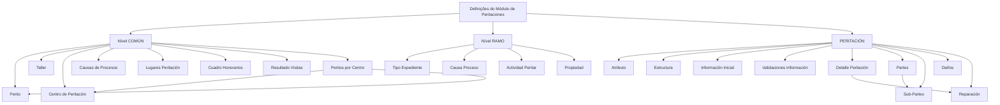

# Documentação de Definição de Sinistros (Automóvel) — Definições do Módulo de Peritaciones

## 1. Metadados do Documento
- **Arquivo de Origem:** Não identificado no conteúdo fornecido
- **Tipo de Documento:** Especificação Funcional
- **Domínio / Sistema:** Reef / Mapfre — Sinistros de Automóvel / Módulo de Peritaciones
- **Público-Alvo:** Negócio, analistas funcionais, configuradores e operação
- **Data/Versão Identificada:** Não identificada
- **Owner identificado:** `user:agonzalez_mapfre.com`
- **Lifecycle identificado:** Approved Source

---

## 2. Resumo Executivo & Contexto de Negócio

O documento descreve definições funcionais necessárias para configurar o módulo de **peritaciones** no contexto de **sinistros de automóvel**. A estrutura apresentada separa definições comuns, reutilizáveis entre módulos, de definições específicas do ramo configurado.

No nível **COMÚN**, o documento concentra cadastros e parâmetros que não são exclusivos do módulo de sinistros, mas são necessários para viabilizar a definição de peritaciones. Esse nível inclui peritos, oficinas, centros de peritação, causas de processos, locais de peritação, quadros de honorários, resultados de visitas e a associação de peritos aos centros.

No nível **RAMO**, o documento apresenta elementos exclusivos do ramo que está sendo definido. Esses elementos determinam quais tipos de expediente ou dano podem passar por peritação, se a peritação é obrigatória, quais atividades podem executá-la e quais propriedades, atributos, estruturas, detalhes, partes, subpartes, danos e reparações devem ser tratados.

A seção **PERITACIÓN** agrupa regras que afetam todas as peritaciones, incluindo atributos, informação inicial, validações da informação core, detalhamento da peritação, partes e subpartes da propriedade, danos e reparações. O conteúdo estabelece uma base de parametrização para que operações de peritação possam registrar dados prévios, validar informações, identificar danos e gerar elementos como uma ordem de reparação.

O documento não detalha fluxos de telas, métodos HTTP, integrações, contratos JSON, tecnologias de implementação, modelos de dados físicos ou procedimentos operacionais de execução. As informações apresentadas são predominantemente descrições funcionais de cadastros e definições.

---

## 3. Arquitetura, Componentes & Tecnologias Envolvidas

### Componentes e conceitos identificados

- **Reef:** ambiente ou sistema documental identificado no conteúdo.
- **Mapfre / Mapfredocument:** referências corporativas presentes no texto extraído.
- **Módulo de Peritaciones:** módulo para definição e realização de peritações.
- **Sinistros de Automóvel:** contexto funcional referido pelo título do conteúdo bruto.
- **Nível COMÚN:** definições não exclusivas do módulo de sinistros, necessárias para a configuração de peritaciones.
- **Nível RAMO:** definições exclusivas do ramo que está sendo configurado.
- **PERITACIÓN:** agrupamento de definições que afetam todas as peritaciones.



**Nota de Análise:** O documento apresenta uma hierarquia funcional de parametrizações, não uma arquitetura técnica de software. Não há detalhamento de componentes de infraestrutura, APIs, bancos de dados, protocolos, ambientes técnicos ou integrações.

---

## 4. Regras de Negócio, Especificações Funcionais & Processos

### 4.1 Definições do nível COMÚN

1. O nível **COMÚN** reúne definições que não são exclusivas do módulo de sinistros.
2. As definições do nível **COMÚN** são necessárias para realizar a definição de peritaciones.
3. O cadastro de **PERITO** permite registrar todos os peritos da companhia.
4. O cadastro de **TALLER** permite registrar todas as oficinas da companhia.
5. O cadastro de **CENTRO DE PERITACIÓN** permite registrar diferentes centros de peritação para posterior associação de peritos.
6. **CAUSAS DE PROCESOS** permite catalogar os motivos pelos quais se deseja realizar uma peritação.
7. **LUGARES PERITACIÓN** permite definir os locais de trabalho de peritos e inspetores onde as peritaciones podem ser realizadas.
8. Os exemplos de locais de peritação apresentados são:
   - oficina;
   - residência do segurado;
   - empresa do segurado.
9. **CUADRO HONORARIOS** permite definir honorários distintos para peritos, inspetores externos e outros perfis, conforme os diferentes locais de trabalho dos peritos.
10. **RESULTADO VISITAS** permite definir diferentes resultados para as visitas.
11. Um resultado de visita pode desencadear ou não o resultado da peritação.
12. Quando uma visita é falha, o resultado da peritação não é disparado.
13. Uma visita falha exige que a visita seja realizada novamente.
14. **PERITOS POR CENTRO** permite associar peritos aos diferentes centros de peritação.

### 4.2 Definições do nível RAMO

1. O nível **RAMO** contém definições exclusivas do ramo que está sendo definido.
2. **TIPO EXPEDIENTE** permite definir os tipos de dano para os quais uma peritação poderá ser realizada.
3. Para cada tipo de dano, deve ser definido se a peritação é obrigatória ou não.
4. **CAUSA PROCESO** permite catalogar motivos para realizar uma operação.
5. O documento apresenta como exemplos de causa de processo:
   - causa da peritação;
   - subscrição;
   - avaliação de danos para reparação.
6. **ACTIVIDAD PERITAR** define quais atividades estão habilitadas para realizar peritaciones.
7. O documento cita como atividades ou perfis: peritos, inspetores e tramitadores.
8. **PROPIEDAD** define a propriedade que será peritada por tipo de dano.

### 4.3 Definições que afetam todas as peritaciones

1. A seção **PERITACIÓN** afeta todas as peritaciones.
2. **ATRIBUTO** permite definir informação adicional da peritação.
3. **ESTRUCTURA** corresponde à informação adicional da peritação.
4. **INFORMACIÓN INICIAL** permite registrar informação prévia para atributos das operações de peritaciones.
5. A informação inicial evita que determinados dados precisem ser introduzidos posteriormente.
6. O exemplo fornecido para informação inicial é atribuir, por defeito, a atividade de perito para realizar a peritação.
7. **VALIDACIONES INFORMACIÓN** permite definir comportamentos e validações da informação core solicitada nas operações de peritação.
8. **DETALLE PERITACIÓN** determina o conceito de detalhe da peritação para realizar uma ordem de reparação.
9. Os exemplos de detalhe da peritação são reparação, chapa, pintura e mão de obra.
10. **PARTES** define as partes de uma propriedade.
11. Para a propriedade veículo, os exemplos de partes são a parte dianteira e a parte lateral direita.
12. **SUB-PARTES** define divisões das partes de uma propriedade.
13. Para a parte dianteira de um veículo, os exemplos de subpartes são capô e para-choques.
14. **DAÑOS** permite definir danos por propriedade.
15. **REPARACIÓN** permite codificar as possíveis reparações de uma propriedade.
16. Os exemplos de reparação apresentados são substituir e reparar.

---

## 5. Tabelas de Parâmetros, Ambientes e Estruturas de Dados

| Item / Parâmetro | Descrição / Função | Tipo / Valores / Formato | Ambiente / Observações |
| :--- | :--- | :--- | :--- |
| COMÚN | Nível de definições não exclusivas de sinistros, necessário para configurar peritaciones. | Nível funcional | Aplicável à definição de peritaciones. |
| PERITO | Registra todos os peritos da companhia. | Cadastro de entidade | O documento não informa campos do cadastro. |
| TALLER | Registra todas as oficinas da companhia. | Cadastro de entidade | O documento não informa campos do cadastro. |
| CENTRO DE PERITACIÓN | Registra centros de peritação para posterior associação de peritos. | Cadastro de entidade | Relacionado a PERITOS POR CENTRO. |
| CAUSAS DE PROCESOS | Cataloga os motivos pelos quais se deseja realizar uma peritação. | Catálogo de motivos | Definição do nível COMÚN. |
| LUGARES PERITACIÓN | Define locais de trabalho onde peritos e inspetores podem realizar peritaciones. | Catálogo de locais | Exemplos: oficina, residência do segurado e empresa do segurado. |
| CUADRO HONORARIOS | Define honorários para peritos, inspetores externos e outros perfis conforme o local de trabalho. | Quadro de honorários | O documento não informa valores monetários nem regras de cálculo. |
| RESULTADO VISITAS | Define resultados de visitas e seu impacto no disparo do resultado da peritação. | Catálogo / regra de transição | Uma visita falha não dispara o resultado da peritação e deve ser repetida. |
| PERITOS POR CENTRO | Associa peritos aos centros de peritação. | Relacionamento entre entidades | Relaciona PERITO e CENTRO DE PERITACIÓN. |
| RAMO | Nível com definições exclusivas do ramo configurado. | Nível funcional | O ramo específico é associado ao contexto de sinistros de automóvel no título. |
| TIPO EXPEDIENTE | Define tipos de dano que podem receber peritação e se esta é obrigatória. | Catálogo com indicador de obrigatoriedade | O documento não lista tipos de dano concretos. |
| CAUSA PROCESO | Cataloga motivos para realizar uma operação. | Catálogo de motivos | Exemplos: peritação, subscrição e avaliação de danos para reparação. |
| ACTIVIDAD PERITAR | Define atividades habilitadas a executar peritaciones. | Catálogo de atividades | Exemplos: peritos, inspetores e tramitadores. |
| PROPIEDAD | Define a propriedade a peritar por tipo de dano. | Definição de propriedade | Veículo é citado como exemplo de propriedade. |
| ATRIBUTO | Define informação adicional da peritação. | Atributo funcional | Não há lista de atributos no documento. |
| ESTRUCTURA | Representa informação adicional da peritação. | Estrutura de informação | Não há formato técnico informado. |
| INFORMACIÓN INICIAL | Registra dados prévios para atributos das operações de peritaciones. | Dados iniciais / valores por defeito | Exemplo: atribuir a atividade de perito por defeito. |
| VALIDACIONES INFORMACIÓN | Define comportamentos e validações da informação core pedida nas operações. | Regras de validação | O documento não especifica regras individuais. |
| DETALLE PERITACIÓN | Determina conceitos de detalhe da peritação para emissão de ordem de reparação. | Catálogo de detalhes | Exemplos: reparação, chapa, pintura e mão de obra. |
| PARTES | Define partes de uma propriedade. | Estrutura hierárquica | Para veículo: parte dianteira e lateral direita. |
| SUB-PARTES | Define subdivisões das partes de uma propriedade. | Estrutura hierárquica | Para parte dianteira: capô e para-choques. |
| DAÑOS | Define danos por propriedade. | Catálogo de danos | O documento não lista danos concretos. |
| REPARACIÓN | Codifica possíveis reparações de uma propriedade. | Catálogo de reparações | Exemplos: substituir e reparar. |
| Reef | Referência de sistema ou ambiente documental. | Sistema / portal documental | O conteúdo contém referências a “DOCUMENTACIÓN Reef”. |
| Mapfredocument | Referência documental corporativa. | Sistema / repositório documental | Não há detalhamento adicional. |
| Owner | Proprietário identificado no texto. | Identificador de usuário | `user:agonzalez_mapfre.com` |
| Lifecycle | Estado identificado no texto. | Estado documental | `Approved Source` |

---

## 6. Bateria de Perguntas & Respostas para RAG (FAQ Sintético)

### P1: Qual é a finalidade das definições do nível COMÚN no módulo de Peritaciones?
**R:** O nível COMÚN contém definições que não são exclusivas do módulo de sinistros, mas que são necessárias para realizar a definição de peritaciones. Entre essas definições estão peritos, oficinas, centros de peritação, causas de processos, locais de peritação, quadros de honorários, resultados de visitas e associação de peritos por centro.

### P2: Como uma visita falha afeta o resultado de uma peritação?
**R:** Quando o resultado de uma visita é falho, o resultado da peritação não é disparado. O documento estabelece que, nesse caso, será necessário realizar a visita novamente.

### P3: Para que serve o cadastro de Centro de Peritación?
**R:** O cadastro de CENTRO DE PERITACIÓN permite registrar diferentes centros de peritação. Após o registro, os peritos podem ser associados aos centros por meio da definição PERITOS POR CENTRO.

### P4: Quais locais podem ser definidos em Lugares Peritación?
**R:** LUGARES PERITACIÓN permite definir os locais de trabalho em que peritos e inspetores poderão realizar peritaciones. O documento apresenta como exemplos uma oficina, a residência do segurado e a empresa do segurado.

### P5: Como são definidos os honorários de peritos e inspetores externos?
**R:** O CUADRO HONORARIOS permite definir honorários diferentes para peritos, inspetores externos e outros perfis, considerando os diferentes locais de trabalho dos peritos. O documento não informa valores, moedas ou fórmulas de cálculo.

### P6: O que deve ser definido em Tipo Expediente?
**R:** TIPO EXPEDIENTE permite definir os tipos de dano para os quais será possível realizar uma peritação. Também deve indicar se a peritação é obrigatória ou não para cada tipo de dano.

### P7: Quais atividades podem ser habilitadas para realizar peritaciones?
**R:** ACTIVIDAD PERITAR define quais atividades estão capacitadas para realizar peritaciones. O documento cita como exemplos peritos, inspetores e tramitadores.

### P8: Qual é a finalidade da Informação Inicial em operações de peritaciones?
**R:** INFORMACIÓN INICIAL permite registrar informação prévia para os atributos das operações de peritaciones, evitando a necessidade de introduzir esses dados posteriormente. O exemplo apresentado é definir por defeito a atividade de perito para realizar a peritação.

### P9: Para que servem as Validaciones Información?
**R:** VALIDACIONES INFORMACIÓN permite definir comportamentos e validações para a informação core solicitada nas operações de peritação. O documento não detalha quais campos core existem nem quais validações específicas devem ser aplicadas.

### P10: Como Detalle Peritación se relaciona com uma ordem de reparação?
**R:** DETALLE PERITACIÓN determina o conceito de detalhe da peritação necessário para realizar uma ordem de reparação. Os exemplos apresentados são reparação, chapa, pintura e mão de obra.

### P11: Como a estrutura de partes e subpartes é aplicada a um veículo?
**R:** PARTES permite definir partes de uma propriedade. Para um veículo, o documento cita como exemplos a parte dianteira e a parte lateral direita. SUB-PARTES permite subdividir essas partes; para a parte dianteira, os exemplos são capô e para-choques.

### P12: Quais reparações podem ser codificadas para uma propriedade?
**R:** REPARACIÓN permite codificar as possíveis reparações de uma propriedade. O documento apresenta substituir e reparar como exemplos, sem informar uma lista completa de códigos ou condições para cada reparação.

---

## 7. Glossário de Termos, Siglas & Conceitos-Chave

- **Peritación / Peritaciones:** processo ou operação de peritação tratado pelo módulo documentado.
- **PERITO:** entidade utilizada para registrar todos os peritos da companhia.
- **TALLER:** entidade utilizada para registrar todas as oficinas da companhia.
- **CENTRO DE PERITACIÓN:** centro de peritação ao qual peritos podem ser associados.
- **PERITOS POR CENTRO:** definição que associa peritos aos diferentes centros de peritação.
- **CAUSAS DE PROCESOS:** catálogo de motivos pelos quais se pretende realizar uma peritação.
- **LUGARES PERITACIÓN:** locais onde peritos e inspetores podem realizar peritaciones.
- **CUADRO HONORARIOS:** definição de honorários para peritos, inspetores externos e outros perfis conforme o local de trabalho.
- **RESULTADO VISITAS:** definição dos possíveis resultados de visitas e do seu efeito sobre a peritação.
- **RAMO:** nível de definições exclusivas do ramo que está sendo configurado.
- **TIPO EXPEDIENTE:** definição de tipos de dano suscetíveis a peritação e da obrigatoriedade da peritação.
- **CAUSA PROCESO:** motivo para realizar uma operação, como peritação, subscrição ou avaliação de danos para reparação.
- **ACTIVIDAD PERITAR:** atividade habilitada para realizar peritaciones.
- **PROPIEDAD:** propriedade a ser peritada por tipo de dano.
- **ATRIBUTO:** informação adicional da peritação.
- **ESTRUCTURA:** informação adicional da peritação.
- **INFORMACIÓN INICIAL:** informação prévia para atributos de operações de peritaciones.
- **VALIDACIONES INFORMACIÓN:** comportamentos e validações da informação core requerida nas operações de peritação.
- **DETALLE PERITACIÓN:** conceito de detalhe usado para realizar uma ordem de reparação.
- **PARTES:** partes de uma propriedade.
- **SUB-PARTES:** divisões das partes de uma propriedade.
- **DAÑOS:** definição de danos por propriedade.
- **REPARACIÓN:** codificação de reparações possíveis para uma propriedade.
- **Reef:** referência de sistema ou ambiente documental presente na extração.
- **Mapfredocument:** referência documental corporativa presente na extração.

---

## 8. Notas Críticas, Riscos & Limitações

- **Nota de Análise:** O conteúdo não identifica o nome do arquivo de origem, a data, a versão ou a autoria formal do documento; somente `user:agonzalez_mapfre.com` é apresentado como owner.
- **Nota de Análise:** O documento não descreve tecnologias, APIs, bases de dados, integrações, protocolos, URLs de ambiente, servidores, credenciais ou rotas de logs.
- **Nota de Análise:** O documento não apresenta os campos, formatos, chaves, códigos ou relacionamentos técnicos dos cadastros de perito, oficina, centro de peritação, propriedade, dano ou reparação.
- **Nota de Análise:** O documento determina que uma visita falha não dispara o resultado da peritação e requer nova visita, mas não define estados formais, responsáveis, prazos ou mecanismo de reprocessamento.
- **Nota de Análise:** O documento lista o mecanismo de validações da informação core, porém não detalha os campos core, critérios de validação, mensagens de erro ou comportamento em caso de rejeição.
- **Nota de Análise:** O documento cita a realização de uma ordem de reparação a partir do detalhe da peritação, mas não detalha o fluxo de criação, aprovação, transmissão ou execução dessa ordem.
- **Risco de interpretação:** Os termos PERITACIÓN, CAUSAS DE PROCESOS e CAUSA PROCESO aparecem em contextos próximos, mas o documento não define formalmente suas diferenças de modelo ou escopo.

---

## 9. Conteúdo Bruto Estruturado (Referência Fiel)

```text
--- [PÁGINA 1 DE 2] ---

DOCUMENTACIÓN de DEFINICIÓN de SINIESTROS (Automóvil)
DEFINICIONES - MÓDULO PERITACIONES
COMÚN
En este nivel se encuentran deniciones que NO son exclusivas del módulo de siniestros, pero son
necesarias para poder realizar la denición de peritaciones. En otros se encuentran:
PERITO
Registrar todos los peritos de la compañía
TALLER
Registrar todos los talleres de la compañía
CENTRO DE PERITACIÓN
Registrar los diferentes Centros de
Peritación, para posteriormente asociar
peritos
GENERAL
En este Nivel se encuentran deniciones que afectarán a todos los posibles expedientes a los que se les
pueda realizar una peritación. Entre otros se dene:
CAUSAS DE PROCESOS 
Permite catalogar los motivos por los que
se quiere realizar una peritación
LUGARES PERITACIÓN
Permite denir los lugares de trabajo de
los peritos, inspectores, es decir dónde va
a poder realizar las peritaciones. Por
ejemplo en un taller, en el hogar del
asegurado, en la empresa del asegurado,
etc
CUADRO HONORARIOS
Permite denir para peritos, inspectores
externos etc, diferentes honorarios según
los distintos lugares de trabajo de los
peritos
RESULTADO VISITAS
 PERITOS POR CENTRO
Documentation / DOCUMENTACIÓN Reef
DOCUMENTACIÓN Reef
Mapfredocument
DOCUMENTACIÓN Reef
Owner
user:agonzalez_mapfre.com
Lifecycle
Approved Source
 / 
 VL
Buscar Inicio Soluciones Arquitecturas APIs Componentes Cloud Documentación Zeus Reef Ayuda
ES


--- [PÁGINA 2 DE 2] ---

Permite denir diferentes resultados de
las visitas pudiendo desencadenar o no el
resultado de la peritación. Por ejemplo si
la visita es fallida no se disparará el
resultado de la peritación, ya que habrá
que volver a realizar la visita
Permite asociar los peritos a los distintos
centros de periración
RAMO
Son exclusivas del ramo que se está deniendo
TIPO EXPEDIENTE 
Permite denir los Tipos de Daño a los
que se les va a poder realizar una
peritación y si esta es obligatoria o no
CAUSA PROCESO 
Permite catalogar los motivos por los que
se quiere realizar una operación. Ejemplo
causa de la peritación, para suscripción,
evaluación de daños para reparación
ACTIVIDAD PERITAR
Denir que actividad está capacitada para
realizar peritaciones, peritos, inspectores,
tramitadores..
PROPIEDAD
Denición de la propiedad que se va a
peritar por tipo de daño
PERITACIÓN
Afecta a todas las peritaciones
ATRIBUTO
Permite denir la información adicional de
la peritación
ESTRUCTURA
Información adicional de la peritación
INFORMACIÓN INICIAL
Registrar información previa para los
atributos de las operaciones de
peritaciones, para no tener que
introducirla posteriormente. Un ejemplo
sería dar a la actividad para realizar la
peritación por defecto perito
VALIDACIONES INFORMACIÓN
Denir comportamientos y validaciones la
información core, que se pide en las
operaciones de peritación.
DETALLE PERITACIÓN
Determina el concepto de detalle de la
peritación para realizar una orden de
reparación. Ejemplo Reparación, chapa,
pintura, mano de obra...
PARTES
Partes de una propiedad Si es un vehículo,
parte delantera, parte lateral derecha...
SUB-PARTES
División de las partes de una propiedad Si
es la parte delantera se puede sub-dividir
en capó, para-golpes... etc
DAÑOS
Denición de Daños por propiedad
REPARACIÓN
Codicación de las posibles reparaciones
de una propiedad, sustituir, reparar
```
