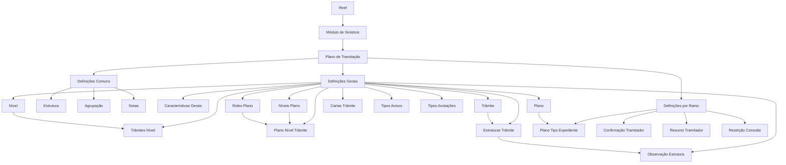

# Documentação Reef — Definições do Módulo de Sinistros e Plano de Tramitação

## 1. Metadados do Documento
- **Arquivo de Origem:** Não identificado no conteúdo fornecido
- **Tipo de Documento:** Especificação Técnica
- **Domínio / Sistema:** Reef / Mapfre — módulo de sinistros e plano de tramitação
- **Público-Alvo:** Desenvolvedores, Arquitetos, Analistas Funcionais, Operação
- **Data/Versão Identificada:** Não identificada

---

## 2. Resumo Executivo & Contexto de Negócio

O documento apresenta as definições funcionais que estruturam o módulo de sinistros do sistema Reef, especificamente o Plano de Tramitação. O Plano de Tramitação organiza os passos necessários para tratar um expediente de sinistro, agrupando trâmites por níveis e relacionando-os a tipos de expediente, danos, papéis e regras de negócio.

As definições estão separadas em três níveis: **Comum**, **Geral** e **Ramo**. O nível Comum contém estruturas, agrupações e notas que não são exclusivas de sinistros, mas são necessárias para configurar o plano. O nível Geral concentra configurações globais do módulo, planos, níveis, trâmites, operações, observações, cartas, avisos, anotações e papéis. O nível Ramo associa planos a tipos de expediente e define informações específicas para tramitação.

O modelo permite controlar quais procedimentos devem ser executados para cada expediente, quais operações cada trâmite realiza, quais observações ficam registradas, quais comunicações podem ser enviadas e quais usuários podem operar níveis específicos do plano. Também contempla confirmações de trâmites, resumos operacionais e restrições de consulta para operadores de centros telefônicos.

O conteúdo não informa tecnologias de implementação, contratos de integração, URLs, ambientes, persistência de dados, métodos HTTP ou detalhes de APIs. A documentação é predominantemente funcional e conceitual.

---

## 3. Arquitetura, Componentes & Tecnologias Envolvidas

Os componentes e conceitos identificados são:

- **Reef:** sistema referenciado pela documentação.
- **Módulo de Sinistros:** módulo responsável pelos comportamentos relacionados ao plano de tramitação.
- **Plano de Tramitação:** definição completa dos passos necessários para tramitar um expediente.
- **Estrutura:** conjunto de atributos que forma uma estrutura de informação.
- **Agrupação:** associação de estruturas ao agrupamento do plano de tramitação.
- **Notas:** informações de notas utilizadas para obter comunicados.
- **Plano:** código de plano associado a tipos de expediente.
- **Nível:** agrupação de trâmites.
- **Trâmite:** passo individual necessário para completar um processo.
- **Estruturas de Trâmite:** operações que podem ser executadas por um trâmite.
- **Observação Estrutura:** observação gravada no plano quando uma operação é executada.
- **Cartas Trâmite:** textos enviados a destinatários.
- **Tipos de Avisos:** classificação de avisos gerados.
- **Tipos de Anotações:** definição de anotações livres.
- **Papéis do Plano:** papéis autorizados a operar planos ou níveis.
- **Plano Tipo Expediente:** associação entre tipo de expediente, tipo de dano e plano de tramitação.
- **Confirmação Tramitador:** perguntas usadas para confirmar trâmites.
- **Resumo Tramitador:** informações operacionais exibidas para cada tramitador.
- **Restrição Consulta:** definição de conteúdos que operadores de um centro telefônico podem ou não visualizar.



> **Nota de Análise:** o documento não detalha tecnologias, microsserviços, bancos de dados, integrações externas, APIs, protocolos ou ambientes de execução.

---

## 4. Regras de Negócio, Especificações Funcionais & Processos

### 4.1. Organização das definições do Plano de Tramitação

As definições do módulo de sinistros são organizadas em três camadas funcionais:

1. **Comum:** definições anteriores ao Plano de Tramitação e não exclusivas de sinistros.
2. **Geral:** definições gerais que estabelecem a estrutura e o comportamento do Plano de Tramitação.
3. **Ramo:** definições do Plano de Tramitação aplicáveis por ramo, tipo de expediente ou tipo de dano.

### 4.2. Regras das definições comuns

- Uma **Estrutura** representa um conjunto de atributos que compõem uma estrutura de informação.
- Uma **Agrupação** associa estruturas à agrupação do Plano de Tramitação.
- **Notas** definem informações de notas destinadas à obtenção de comunicados.

### 4.3. Regras gerais do módulo de sinistros

- As **Características Gerais** determinam comportamentos do módulo de sinistros e do Plano de Tramitação.
- Entre os comportamentos explicitamente exemplificados estão:
  - utilização de papéis;
  - utilização de datas de controle;
  - utilização do calendário laboral para cálculo de datas.
- Um **Plano** corresponde à definição de códigos de planos que serão associados aos tipos de expediente.
- Um **Nível** agrupa trâmites.
- Um **Trâmite** representa cada passo que deve ser realizado para completar um processo.
- **Trâmites Nível** associam trâmites da mesma natureza sob um nível. O documento cita como exemplo um nível de peritagem que agrupa todos os trâmites de peritagens.
- **Níveis Plano** definem os diversos níveis que um plano conterá.
- **Plano Nível Trâmite** representa a definição completa de um Plano de Tramitação, incluindo todos os passos que podem ser realizados para tramitar um expediente, agrupados por níveis.
- **Estruturas Trâmite** definem uma ou mais operações que podem ser executadas em um trâmite. O documento cita como exemplo que o trâmite de solicitação de peritagem executará a solicitação de peritagem.
- **Observação Estrutura** define a observação que será registrada no plano sempre que uma operação for executada. O documento cita como exemplo uma liquidação, cuja observação pode registrar a quem se paga e o valor.
- **Cartas Trâmite** definem textos que podem ser enviados a diferentes destinatários.
- **Tipos Avisos** classificam os diferentes avisos que podem ser gerados.
- **Tipos Anotações** definem anotações livres que podem ser realizadas.
- **Roles Plano** definem papéis para operar com os Planos de Tramitação. Um papel pode ser autorizado apenas a executar o nível de peritagens, enquanto outro pode ser autorizado apenas a executar o nível de juízos.

### 4.4. Regras por ramo

- **Plano Tipo Expediente** define qual plano será responsável por tramitar um dano para cada tipo de expediente e tipo de dano.
- A seleção do plano pode ocorrer de duas formas:
  1. por um plano fixo;
  2. por uma lógica de negócio que avalia condições especiais.
- **Confirmação Tramitador** define perguntas usadas para confirmação de trâmites.
- Os exemplos de confirmação apresentados são:
  - confirmação de perda total;
  - confirmação de coberturas;
  - confirmação da situação de uma apólice.
- **Resumo Tramitador** define as informações do Plano de Tramitação que cada tramitador visualizará.
- Os exemplos de informações do resumo são:
  - número de casos pendentes por tipo de expediente;
  - número de avisos pendentes.
- **Restrição Consulta** define quais trâmites, níveis e tipos de trâmites podem ser visualizados ou não por tramitadores de um centro telefônico.

---

## 5. Tabelas de Parâmetros, Ambientes e Estruturas de Dados

| Item / Parâmetro | Descrição / Função | Tipo / Valores / Formato | Ambiente / Observações |
| :--- | :--- | :--- | :--- |
| Estrutura | Conjunto de atributos que forma uma estrutura de informação. | Definição de informação. | Nível Comum. |
| Agrupação | Associa estruturas à agrupação do Plano de Tramitação. | Associação. | Nível Comum. |
| Notas | Define informação de notas para obtenção de comunicados. | Definição de informação. | Nível Comum. |
| Características Gerais | Determina comportamentos do módulo de sinistros e do Plano de Tramitação. | Papéis, datas de controle e calendário laboral são exemplos citados. | Nível Geral. |
| Plano | Define códigos de planos associados a tipos de expediente. | Código de plano. | Nível Geral. |
| Nível | Agrupa trâmites. | Agrupação de trâmites. | Nível Geral. |
| Trâmite | Cada passo necessário para completar um processo. | Passo de processo. | Nível Geral. |
| Trâmites Nível | Associa trâmites da mesma natureza a um nível. | Associação de trâmites. | Exemplo: nível de peritagem. |
| Níveis Plano | Define os diferentes níveis contidos em um plano. | Definição de níveis. | Nível Geral. |
| Plano Nível Trâmite | Define integralmente o Plano de Tramitação. | Passos agrupados por níveis. | Nível Geral. |
| Estruturas Trâmite | Define operações executáveis em um trâmite. | Uma ou mais operações. | Exemplo: solicitação de peritagem. |
| Observação Estrutura | Define a observação gravada ao executar uma operação. | Registro de observação. | Exemplo: destinatário e valor de uma liquidação. |
| Cartas Trâmite | Define textos enviados a diferentes destinatários. | Texto de comunicação. | Nível Geral. |
| Tipos Avisos | Classifica os avisos que podem ser gerados. | Tipificação. | Nível Geral. |
| Tipos Anotações | Define anotações livres. | Anotação livre. | Nível Geral. |
| Roles Plano | Define papéis para trabalho com planos e níveis. | Papel com permissões de execução. | Exemplo: peritagens ou juízos. |
| Plano Tipo Expediente | Define o plano responsável por tramitar dano conforme expediente e dano. | Plano fixo ou lógica de negócio. | Nível Ramo. |
| Confirmação Tramitador | Define perguntas de confirmação de trâmites. | Perguntas de confirmação. | Exemplos: perda total, coberturas e situação de apólice. |
| Resumo Tramitador | Define informações do plano apresentadas a cada tramitador. | Indicadores operacionais. | Exemplos: casos e avisos pendentes. |
| Restrição Consulta | Define conteúdos visíveis ou não para tramitadores de centro telefônico. | Trâmites, níveis e tipos de trâmites. | Nível Ramo. |

> **Nota de Análise:** o documento não apresenta servidores, URLs, portas, credenciais, rotas de log, nomes de ambientes, formatos de payload ou estruturas de banco de dados.

---

## 6. Bateria de Perguntas & Respostas para RAG (FAQ Sintético)

### P1: O que é o Plano de Tramitação no módulo de sinistros do Reef?
**R:** O Plano de Tramitação é a definição completa dos diferentes passos que podem ser realizados para tramitar um expediente de sinistro. Esses passos são agrupados em níveis e incluem trâmites, operações, observações, comunicações, avisos, anotações e papéis de execução.

### P2: Quais são os níveis de definição apresentados para o Plano de Tramitação?
**R:** O documento divide as definições em três níveis: Comum, Geral e Ramo. O nível Comum contém definições prévias necessárias ao plano; o nível Geral define a estrutura e os comportamentos do módulo; e o nível Ramo contém definições aplicáveis a tipos de expediente, tipos de dano e operadores.

### P3: Qual é a finalidade das Características Gerais no módulo de sinistros?
**R:** As Características Gerais determinam comportamentos do módulo de sinistros e do Plano de Tramitação. O documento menciona, como exemplos, a decisão de trabalhar com papéis, datas de controle e calendário laboral para cálculo de datas.

### P4: Como os trâmites são organizados em níveis?
**R:** Um nível é uma agrupação de trâmites. A definição Trâmites Nível associa trâmites da mesma natureza a um nível. Como exemplo, o documento informa que um nível de peritagem pode reunir todos os trâmites de peritagens.

### P5: O que são Estruturas Trâmite?
**R:** Estruturas Trâmite definem uma ou mais operações que podem ser realizadas em um trâmite. O exemplo fornecido afirma que o trâmite de solicitação de peritagem executará a operação de solicitação de peritagem.

### P6: Que informação é registrada por Observação Estrutura?
**R:** Observação Estrutura define a observação que será gravada no Plano de Tramitação toda vez que uma operação for executada. Para uma liquidação, o documento exemplifica que a observação pode registrar a quem se realiza o pagamento e o valor correspondente.

### P7: Como o plano é selecionado para um tipo de expediente ou dano?
**R:** A definição Plano Tipo Expediente determina qual plano tramitará um dano para cada tipo de expediente e tipo de dano. O plano pode ser fixo ou definido por lógica de negócio que avalia condições especiais.

### P8: Para que servem os Roles Plano?
**R:** Roles Plano definem os papéis que podem trabalhar com os Planos de Tramitação. Os papéis podem limitar a execução a níveis específicos; por exemplo, um papel pode executar somente o nível de peritagens, enquanto outro pode executar somente o nível de juízos.

### P9: Quais exemplos de confirmação são tratados por Confirmação Tramitador?
**R:** Confirmação Tramitador define perguntas para confirmar trâmites. O documento cita confirmações de perda total, coberturas e situação de apólice.

### P10: Que informações podem ser exibidas no Resumo Tramitador?
**R:** O Resumo Tramitador define as informações do Plano de Tramitação que cada tramitador deve visualizar. Os exemplos apresentados são o número de casos pendentes por tipo de expediente e o número de avisos pendentes.

### P11: O que a Restrição Consulta controla?
**R:** Restrição Consulta define quais trâmites, níveis e tipos de trâmites os tramitadores de um centro telefônico podem visualizar ou não visualizar.

### P12: O documento informa APIs ou tecnologias usadas pelo módulo de sinistros?
**R:** Não. O conteúdo fornecido não descreve APIs, endpoints, métodos HTTP, tecnologias de desenvolvimento, bancos de dados, ambientes, servidores ou contratos de integração.

---

## 7. Glossário de Termos, Siglas & Conceitos-Chave

- **Reef:** sistema referenciado como origem da documentação.
- **Sinistros:** domínio funcional relacionado ao tratamento de expedientes de sinistro.
- **Plano de Tramitação:** definição de passos e níveis para tramitar um expediente.
- **Expediente:** item ou caso submetido ao processo de tramitação.
- **Trâmite:** passo individual necessário para completar um processo.
- **Nível:** agrupação de trâmites.
- **Peritagem:** natureza de trâmites citada como exemplo de agrupação em nível.
- **Juízos:** nível citado como exemplo de escopo de execução de um papel.
- **Ramo:** camada de definições específicas do Plano de Tramitação.
- **Role / Papel:** autorização para trabalhar com planos ou executar níveis do Plano de Tramitação.
- **Calendário laboral:** calendário utilizado para cálculo de datas quando esse comportamento estiver habilitado.
- **Perda total:** exemplo de assunto sujeito à confirmação de trâmite.
- **Coberturas:** exemplo de assunto sujeito à confirmação de trâmite.
- **Apólice:** elemento cuja situação pode ser confirmada durante um trâmite.

---

## 8. Notas Críticas, Riscos & Limitações

- O documento não identifica nome de arquivo, data, versão, autor técnico ou histórico de alterações.
- O conteúdo não especifica tecnologias, linguagens, frameworks, APIs, protocolos, microsserviços, bancos de dados ou infraestrutura.
- Não há detalhamento dos critérios ou condições especiais utilizados pela lógica de negócio para selecionar um plano por tipo de expediente.
- Não são definidos os campos, formatos, obrigatoriedades ou persistência das Estruturas, Observações, Avisos, Anotações e Cartas.
- Não há matriz detalhada de permissões para Roles Plano; apenas existem exemplos de papéis restritos a níveis de peritagens ou juízos.
- Não há detalhamento de como as restrições de consulta são aplicadas aos tramitadores de centros telefônicos.
- Não foram identificados contratos ou fluxos de integração para solicitação de peritagem, liquidação, envio de cartas ou geração de avisos.

---

## 9. Conteúdo Bruto Estruturado (Referência Fiel)

```text
--- [PÁGINA 1 DE 2] ---

DOCUMENTACIÓN de DEFINICIÓN de SINIESTROS
DEFINICIONES MÓDULO - PLAN TRAMITACIÓN
 Los elementos de denición atienden a distintos niveles:
COMÚN
Son deniciones Previas al Plan de tramitación. En este nivel se encuentran deniciones que NO son
exclusivas de siniestros, pero son necesarias para poder realizar la denición. Entre otras deniciones se
encuentra:
ESTRUCTURA
Denición de un conjunto de atributos que
forman una estructura de información.
AGRUPACIÓN
Asociación de Estructuras a la agrupación
del plan de tramitación
NOTAS
Denición de información de notas para
obtener comunicados
GENERAL
Deniciones Generales del Plan de Tramitación
CARACTERÍSTICAS GENERALES 
Características Generales del módulo de
siniestros, determina comportamientos
del módulo de plan de tramitación por
ejemplo si se va a trabajar con roles, si se
va a trabajar con fechas de control, si se
va a utilizar el calendario laboral para el
cálculo de fechas...
PLAN 
Denición de códigos que planes que
serán asociados a los tipos de
expedientes
NIVEL 
Agrupación de Trámites
Documentation / DOCUMENTACIÓN Reef
DOCUMENTACIÓN Reef
Mapfredocument
DOCUMENTACIÓN Reef
Owner
user:agonzalez_mapfre.com
Lifecycle
Approved Source
 / 
 VL
Buscar Inicio Soluciones Arquitecturas APIs Componentes Cloud Documentación Zeus Reef Ayuda
ES


--- [PÁGINA 2 DE 2] ---

TRÁMITE 
Denición de cada paso que hay que
realizar para completar un proceso
TRAMITES NIVEL 
Asociación de trámites de la misma
naturaleza bajo un nivel, por ejemplo Nivel
de peritación aglutinará todos los trámites
de peritaciones
NIVELES PLAN 
Denición de los distintos niveles que va a
contener un plan
PLAN NIVEL TRÁMITE 
Denición completa de un plan de
tramitación, todos los diferentes pasos
que se pueden realizar para tramitar el
expediente agrupados en niveles.
ESTRUCTURAS TRÁMITE
Denición de la o las operaciones que
puede realizarse en un trámite. Ejemplo el
tramite de solicitud de peritación ejecutará
la solicitud de peritación
OBSERVACIÓN ESTRUCTURA
Denición de la observación que se
grabará en el plan cada vez que se ejecute
una operación. Ejemplo si se ejecuta una
liquidación a quien se paga, el importe, etc
CARTAS TRÁMITE
Denición de Textos que se pueden enviar
a distintos destinatarios
TIPOS AVISOS 
Tipicar los distintos avisos que se
pueden generar
TIPOS ANOTACIONES
Denir las distintas anotaciones libres que
se pueden realizar
ROLES PLAN
Denir los distintos roles para poder
trabajar con los planes de tramitación.
Puede haber roles que sólo puedan
ejecutar el nivel de peritaciones, o roles
que sólo puedan ejecutar el nivel de
juicios etc
RAMO
Deniciones por RAMO del Plan de Tramitación
PLAN TIPO EXPEDIENTE 
Denir para cada tipo de expediente, tipo
de daños qué plan se va a encargar de
tramitar ese daño. Puede ser un plan jo o
que se determine mediante una lógica de
negocio evaluando condiciones
especiales
CONFIRMACIÓN TRAMITADOR
Denición de preguntas para conrmación
de trámites. Ejemplo conrmar una
pérdida total, conrmar unas coberturas,
una situación de póliza, etc
RESUMEN TRAMITADOR
Denición de la información del plan de
tramitación que queremos que vea cada
tramitador, por ejemplo número de casos
pendientes por tipo de expediente, número
de avisos pendientes, etc
RESTRICCIÓN CONSULTA
Denición de trámites, niveles, tipos de
trámites que que pueden ver y no pueden
ver los tramitadores de un centro
telefónico
```
