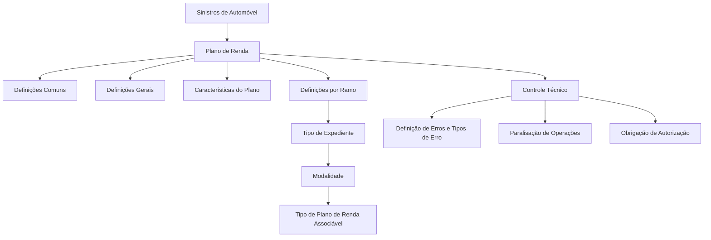

# Documentação de Definição de Sinistros (Automóvel) — Módulo Plano de Renda

## 1. Metadados do Documento
- **Arquivo de Origem:** `Não identificado`
- **Tipo de Documento:** `Especificação Técnica`
- **Domínio / Sistema:** `Reef / Mapfre — Sinistros de Automóvel`
- **Público-Alvo:** `Desenvolvedores, Arquitetos, Operação e Negócio`
- **Data/Versão Identificada:** `Não identificada`

---

## 2. Resumo Executivo & Contexto de Negócio

O documento apresenta definições funcionais relacionadas ao módulo **Plano de Renda** no contexto de **Sinistros de Automóvel**. A documentação está publicada no repositório ou portal de documentação Reef, com referência a Mapfre e Mapfredocument.

A estrutura apresentada organiza as definições do módulo em níveis: **Comum**, **Geral**, **Plano de Renda**, **Características**, **Ramo**, **Tipo de Expediente**, **Modalidade** e **Controle Técnico**. Esses níveis descrevem como planos de renda são codificados, validados e associados aos expedientes de sinistro.

O nível **Comum** concentra definições não exclusivas do módulo de sinistros, mas necessárias para sua configuração. O nível **Geral** abrange definições aplicáveis a todos os expedientes que possuam um plano de renda.

O documento também estabelece que a associação de planos de renda depende de atributos como ramo, tipo de expediente e modalidade. O **Controle Técnico** atua na definição de erros, tipos de erros e condições nas quais operações do plano de renda podem ser paralisadas ou submetidas à autorização.

Não há detalhamento no conteúdo fornecido sobre contratos de API, métodos HTTP, estruturas JSON, banco de dados, regras de cálculo de cotas, critérios específicos de autorização ou fluxos operacionais completos.

---

## 3. Arquitetura, Componentes & Tecnologias Envolvidas

Os componentes e conceitos identificados são:

| Componente / Conceito | Papel identificado no documento |
| :--- | :--- |
| Reef | Contexto ou portal de documentação identificado como “DOCUMENTACIÓN Reef”. |
| Mapfre | Contexto corporativo identificado no cabeçalho e em “Mapfredocument”. |
| Sinistros | Domínio funcional no qual o módulo Plano de Renda é definido. |
| Automóvel | Segmento de sinistros explicitamente indicado no título. |
| Plano de Renda | Módulo que define codificação, validações, características e associações de planos. |
| Controle Técnico | Camada funcional para definição de erros, tipos de erro, paralisação de operações e exigência de autorização. |
| Ramo | Nível de definição aplicável aos expedientes de sinistro. |
| Tipo de Expediente | Define quais tipos de expediente podem trabalhar com planos de renda por ramo. |
| Modalidade | Permite associar, por ramo, tipo de expediente e modalidade, o tipo de plano de renda aplicável. |
| Características | Define características do plano de renda, incluindo número de cotas e existência de cotas extras. |



**Nota de Análise:** o diagrama representa relações conceituais extraídas dos tópicos do documento. O conteúdo não descreve integrações técnicas, comunicação entre serviços, persistência de dados ou interfaces de usuário.

---

## 4. Regras de Negócio, Especificações Funcionais & Processos

### 4.1 Definições comuns

O nível **Comum** contém definições necessárias para a configuração do módulo de sinistros, embora não sejam exclusivas desse módulo.

Entre as definições comuns, o documento menciona o **Controle Técnico**, responsável pela definição de erros e tipos de erros.

### 4.2 Definições gerais

O nível **Geral** contém definições que afetam todos os possíveis expedientes que possuam um plano de renda.

O documento não especifica quais atributos, regras ou dados compõem essas definições gerais.

### 4.3 Plano de Renda

O nível **Plano de Renda** define:

- A codificação dos possíveis planos de renda.
- As validações dos possíveis planos de renda.

**Nota de Análise:** o documento não informa a estrutura da codificação, os códigos válidos, as regras de validação, mensagens de erro ou critérios de rejeição.

### 4.4 Características do plano de renda

O nível **Características** define características do plano de renda, incluindo:

- Número de cotas.
- Existência de cotas extras.
- Outras características não detalhadas no conteúdo disponível.

### 4.5 Ramo

O nível **Ramo** contém definições que afetam todos os possíveis expedientes de um sinistro.

O documento relaciona o ramo à definição de tipos de expediente e à associação de planos de renda por modalidade.

### 4.6 Tipo de expediente

O nível **Tipo de Expediente** define quais tipos de expediente, por ramo, podem trabalhar com planos de renda.

Regra identificada:

1. Um ramo possui definição de tipos de expediente.
2. A elegibilidade para trabalhar com planos de renda é determinada por essa combinação de ramo e tipo de expediente.

### 4.7 Modalidade

O nível **Modalidade** permite associar o tipo de plano de renda com base em:

1. Ramo.
2. Tipo de expediente.
3. Modalidade.

Regra identificada:

> A associação de um tipo de plano de renda é contextualizada pela combinação de ramo, tipo de expediente e modalidade.

### 4.8 Controle técnico

O **Controle Técnico** possui dois papéis explicitamente descritos:

1. Definir erros e tipos de erros.
2. Definir as condições em que as operações de plano de renda:
   - Podem ser paralisadas.
   - Devem ser autorizadas.

**Nota de Análise:** o documento não informa quais condições causam paralisação, quem autoriza as operações, quais níveis de autorização existem ou como a autorização é registrada.

---

## 5. Tabelas de Parâmetros, Ambientes e Estruturas de Dados

| Item / Parâmetro | Descrição / Função | Tipo / Valores / Formato | Ambiente / Observações |
| :--- | :--- | :--- | :--- |
| Módulo Plano de Renda | Módulo objeto da documentação. | Não detalhado. | Contexto de Sinistros de Automóvel. |
| Codificação do plano de renda | Define a codificação dos possíveis planos de renda. | Não detalhado. | Não são apresentados códigos ou formato. |
| Validações do plano de renda | Define validações aplicáveis aos possíveis planos de renda. | Não detalhado. | Não são descritos critérios de validação. |
| Número de cotas | Característica do plano de renda. | Não detalhado. | Não são informados limites ou formato numérico. |
| Cotas extras | Característica que indica se o plano possui cotas extras. | Não detalhado. | Não são informadas regras de elegibilidade. |
| Ramo | Nível de definição que afeta expedientes de sinistro. | Não detalhado. | Usado em associação com tipo de expediente e modalidade. |
| Tipo de expediente | Define quais tipos de expediente por ramo podem trabalhar com planos de renda. | Não detalhado. | Depende do ramo. |
| Modalidade | Permite associar um tipo de plano de renda. | Não detalhado. | Associação realizada por ramo, tipo de expediente e modalidade. |
| Tipo de plano de renda | Plano que pode ser associado à combinação de ramo, tipo de expediente e modalidade. | Não detalhado. | Não são listados tipos de plano. |
| Controle Técnico | Define erros, tipos de erro, condições de paralisação e obrigação de autorização. | Não detalhado. | Aplicável a operações de plano de renda. |
| Erro | Elemento definido pelo Controle Técnico. | Não detalhado. | Não são listados códigos ou mensagens. |
| Tipo de erro | Classificação de erro definida pelo Controle Técnico. | Não detalhado. | Não são listadas classificações. |
| Paralisação de operação | Possível interrupção de operações de plano de renda sob determinadas condições. | Condição não detalhada. | Condições não identificadas no texto. |
| Obrigação de autorização | Exigência de autorização para operações de plano de renda sob determinadas condições. | Condição não detalhada. | Autoridade e processo de autorização não identificados. |
| Owner | Identificador exibido no conteúdo de origem. | `user:agonzalez_mapfre.com` | Metadado apresentado no portal documental. |
| Lifecycle | Estado de ciclo de vida exibido no conteúdo de origem. | `Approved Source / VL` | Significado de `VL` não detalhado. |

---

## 6. Bateria de Perguntas & Respostas para RAG (FAQ Sintético)

### P1: Qual é o escopo da documentação de definição de sinistros apresentada?
**R:** A documentação trata de definições para o módulo Plano de Renda no contexto de Sinistros de Automóvel. O conteúdo organiza as definições em níveis como Comum, Geral, Plano de Renda, Características, Ramo, Tipo de Expediente, Modalidade e Controle Técnico.

### P2: O que é definido no nível Comum do módulo Plano de Renda?
**R:** O nível Comum contém definições que não são exclusivas do módulo de sinistros, mas que são necessárias para realizar a definição do módulo. Entre as definições mencionadas está o Controle Técnico, relacionado à definição de erros e tipos de erros.

### P3: O que abrange o nível Geral na documentação do Plano de Renda?
**R:** O nível Geral contém definições que afetam todos os possíveis expedientes que possuem um plano de renda. O documento não detalha quais regras, atributos ou parâmetros específicos pertencem a esse nível.

### P4: O que o nível Plano de Renda define?
**R:** O nível Plano de Renda define a codificação dos possíveis planos de renda e as validações aplicáveis a esses planos. O conteúdo não apresenta os códigos, formatos ou regras de validação específicas.

### P5: Quais características de um plano de renda são citadas?
**R:** O documento cita como características do plano de renda o número de cotas e a existência de cotas extras. Não são fornecidos limites, formatos, valores permitidos ou regras de cálculo para essas características.

### P6: Como o ramo se relaciona aos planos de renda?
**R:** O nível Ramo contém definições que afetam os possíveis expedientes de um sinistro. O ramo também é usado para determinar quais tipos de expediente podem trabalhar com planos de renda e para associar tipos de plano de renda junto com tipo de expediente e modalidade.

### P7: Como é determinada a possibilidade de um tipo de expediente trabalhar com planos de renda?
**R:** O nível Tipo de Expediente define quais tipos de expediente, por ramo, podem trabalhar com planos de renda. Portanto, a elegibilidade depende da definição aplicável ao ramo e ao tipo de expediente.

### P8: Como ocorre a associação de um tipo de plano de renda?
**R:** A Modalidade permite associar, por ramo, tipo de expediente e modalidade, qual tipo de plano de renda pode ser associado. O documento não detalha a estrutura dessa associação nem os valores permitidos para cada atributo.

### P9: Qual é a responsabilidade do Controle Técnico no Plano de Renda?
**R:** O Controle Técnico é responsável por definir erros e tipos de erros. Também define sob quais condições as operações do plano de renda podem ser paralisadas ou devem obrigatoriamente ser autorizadas.

### P10: O documento informa quais condições interrompem operações de Plano de Renda?
**R:** Não. O documento afirma que o Controle Técnico define as condições em que operações de plano de renda podem ser paralisadas, mas não lista as condições, os erros associados, as regras de decisão ou as ações operacionais decorrentes.

### P11: O documento identifica serviços, APIs ou contratos técnicos do Plano de Renda?
**R:** Não. O conteúdo fornecido não descreve microsserviços, APIs, endpoints, métodos HTTP, contratos JSON, bancos de dados, filas, protocolos de integração ou tecnologias de implementação.

### P12: Quem é identificado como owner da documentação?
**R:** O conteúdo bruto apresenta o campo `Owner` com o valor `user:agonzalez_mapfre.com`. O documento não detalha o nome da pessoa, responsabilidades do owner ou processo de governança associado.

---

## 7. Glossário de Termos, Siglas & Conceitos-Chave

- **Controle Técnico:** nível ou componente funcional responsável por definir erros, tipos de erros, condições de paralisação de operações e obrigação de autorização no Plano de Renda.
- **Cotas:** característica do plano de renda explicitamente mencionada como “número de cotas”.
- **Cotas Extras:** característica que indica se um plano de renda possui cotas adicionais.
- **Expediente:** entidade ou tipo de caso de sinistro mencionado na definição de elegibilidade para planos de renda.
- **Mapfre:** referência corporativa apresentada no conteúdo, incluindo a expressão “Mapfredocument”.
- **Modalidade:** nível que permite associar um tipo de plano de renda considerando ramo, tipo de expediente e modalidade.
- **Plano de Renda:** módulo que contém codificação, validações, características e regras de associação relacionadas a planos de renda.
- **Ramo:** nível de definição que afeta expedientes de sinistro e participa da determinação de elegibilidade e associação de planos de renda.
- **Reef:** nome identificado na documentação e no menu do portal documental.
- **Sinistros:** domínio funcional relacionado a eventos ou expedientes de seguro.
- **Tipo de Expediente:** classificação que, em combinação com o ramo, define quais expedientes podem trabalhar com planos de renda.
- **VL:** sigla exibida no campo Lifecycle como `Approved Source / VL`; o significado não é detalhado no documento.

---

## 8. Notas Críticas, Riscos & Limitações

- O conteúdo fornecido é resumido e não apresenta detalhamento operacional suficiente para implementação técnica direta.
- Não são informados códigos de planos de renda, critérios de validação, estruturas de dados, campos obrigatórios ou valores permitidos.
- Não são descritas as condições específicas que causam paralisação de operações do Plano de Renda.
- Não são definidos os responsáveis, níveis, fluxos ou evidências necessários para autorização de operações.
- O documento não apresenta contratos de API, integrações, tecnologias, ambientes, URLs, credenciais, portas ou rotas de log.
- O significado da sigla `VL`, exibida no campo Lifecycle, não é explicado.
- A extração contém caracteres potencialmente corrompidos, como `deniciones` e `Denir`, que aparentam representar termos como “definiciones” e “definir”. A transcrição bruta abaixo preserva esses caracteres conforme recebidos.

---

## 9. Conteúdo Bruto Estruturado (Referência Fiel)

```text
--- [PÁGINA 1 DE 2] ---

DOCUMENTACIÓN de DEFINICIÓN de SINIESTROS (Automóvil)
DEFINICIONES - MÓDULO PLAN DE RENTA
COMÚN
En este nivel se encuentran deniciones que NO son exclusivas del módulo de siniestros, pero son
necesarias para poder realizar la denición. Entre otras deniciones se encuentra:
CONTROL TÉCNICO
Denición de errores, tipos de Errores
GENERAL
En este nivel se encuentran deniciones que afectarán a todos los posibles expedientes que tienen un plan
de renta
PLAN DE RENTA
Denición de la codicación de los posibles planes y sus
validaciones
CARACTERÍSTICAS
Denición de las características del plan de renta, número de
cuotas, si tiene cuotas extras, etc
RAMO
En este nivel se encuentran deniciones que afectarán a todos los posibles expedientes de un siniestro
Documentation / DOCUMENTACIÓN Reef
DOCUMENTACIÓN Reef
Mapfredocument
DOCUMENTACIÓN Reef
Owner
user:agonzalez_mapfre.com
Lifecycle
Approved Source
 / 
 VL
Buscar Inicio Soluciones Arquitecturas APIs Componentes Cloud Documentación Zeus Reef Ayuda
ES


--- [PÁGINA 2 DE 2] ---

TIPO EXPEDIENTE 
Dene que tipos de expediente por Ramo
van a poder trabajar con planes de Renta
MODALIDAD
Permite asociar por ramo, tipo de
expediente y modalidad que tipo de plan
de renta se puede asociar
CONTROL TÉCNICO
Denir en qué condiciones se puede
paralizar las operaciones de plan de renta
u obligación de ser autorizada
```
