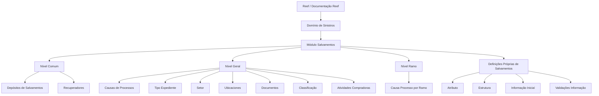

# Documentação de Definição de Sinistros — Módulo Salvamentos no Reef

## 1. Metadados do Documento
- **Arquivo de Origem:** `Não identificado`
- **Tipo de Documento:** `Especificação Técnica`
- **Domínio / Sistema:** `Reef / Mapfre — Definições de Sinistros, Módulo Salvamentos`
- **Público-Alvo:** `Analistas Funcionais, Desenvolvedores, Arquitetos e Operação`
- **Data/Versão Identificada:** `Não identificada`

---

## 2. Resumo Executivo & Contexto de Negócio

O documento descreve as definições de configuração do módulo de **Salvamentos** dentro do domínio de **Sinistros** no sistema Reef. As definições são organizadas por níveis de abrangência: definições comuns, gerais, específicas por ramo e definições próprias de salvamentos.

No nível **Comum**, o documento inclui entidades necessárias para a definição de salvamentos, embora não sejam exclusivas do módulo de sinistros. Entre essas entidades estão depósitos de salvamentos e recuperadores, que suportam o armazenamento de bens recuperados e a busca de veículos ou propriedades roubadas pertencentes a segurados.

No nível **Geral**, o documento apresenta configurações aplicáveis a todos os possíveis expedientes de salvamentos. Essas configurações incluem causas de processos, tipos de expediente, setor, ubicaciones, documentos, classificação e atividades compradoras.

No nível **Ramo**, o documento estabelece definições exclusivas do ramo que está sendo configurado, incluindo a causa de processo para as operações daquele ramo. No nível **Salvamentos**, são definidas informações próprias do módulo, tais como atributos, estruturas, informações iniciais e validações da informação.

O material possui caráter predominantemente funcional e configuracional. Ele não detalha contratos técnicos, métodos HTTP, modelos de dados físicos, integrações, URLs de ambientes, tecnologias de implementação ou regras de persistência.

---

## 3. Arquitetura, Componentes & Tecnologias Envolvidas

Os componentes funcionais citados no documento são:

- **Reef:** ambiente ou sistema onde a documentação está publicada.
- **Mapfre:** referência corporativa identificada no conteúdo da documentação.
- **Módulo Salvamentos:** módulo responsável pelas definições relacionadas a bens salvados ou recuperados.
- **Sinistros:** domínio funcional que contém o módulo de Salvamentos.
- **Comum:** nível de definições não exclusivas de sinistros, mas necessárias ao módulo.
- **Geral:** nível aplicável a todos os expedientes de salvamentos.
- **Ramo:** nível de definições exclusivo do ramo em configuração.
- **Salvamentos:** nível de definições próprias das operações de salvamento.



**Nota de Análise:** o documento não apresenta arquitetura de software, integrações técnicas, microsserviços, bancos de dados, protocolos, APIs ou ferramentas de implantação. O diagrama representa exclusivamente a organização funcional das definições descritas.

---

## 4. Regras de Negócio, Especificações Funcionais & Processos

### 4.1. Definições no nível Comum

O nível **Comum** contém definições que não são exclusivas do módulo de sinistros, mas são necessárias para realizar a definição do módulo de Salvamentos.

1. **Depósitos de Salvamentos**
   - Devem ser definidos em terceiros.
   - Representam os locais onde os salvados podem ser depositados.

2. **Recuperadores**
   - Devem ser definidos como pessoas responsáveis por buscar veículos ou propriedades de segurados.
   - O contexto citado para a atuação dos recuperadores envolve veículos ou propriedades roubadas.

### 4.2. Definições no nível Geral

O nível **Geral** contém definições que afetam todos os possíveis expedientes de salvamentos.

1. **Causas de Processos**
   - Permitem catalogar os motivos pelos quais se deseja realizar uma operação.

2. **Tipo Expediente**
   - Permite definir os tipos de dano.
   - Permite definir a classe do expediente.
   - O documento cita como possibilidades a classificação de recobro e o seu tipo, bem como a condição de não ser de recobro.

3. **Setor**
   - Afeta todos os ramos do setor que está sendo definido.

4. **Ubicaciones**
   - Definem as possíveis localizações dos bens recuperados.

5. **Documentos**
   - Definem os documentos necessários para que os bens recuperados possam ser vendidos.

6. **Classificação**
   - Define as possíveis classificações dos bens recuperados em relação ao seu estado para venda.

7. **Atividades Compradoras**
   - Definem as atividades que podem comprar salvados.

### 4.3. Definições no nível Ramo

O nível **Ramo** contém configurações exclusivas do ramo que está sendo definido.

1. **Causa Processo**
   - Permite catalogar os motivos pelos quais se deseja realizar operações para cada ramo.

### 4.4. Definições próprias de Salvamentos

O nível **Salvamentos** contém definições específicas das operações de salvamentos.

1. **Atributo**
   - Permite definir informação adicional de salvamentos.
   - O documento cita como exemplo dados do salvado.

2. **Estrutura**
   - Representa informação adicional de salvamentos composta por atributos.
   - Permite definir a obrigatoriedade, ou não, de solicitar cada informação.
   - Permite definir a ordem em que a informação será solicitada.

3. **Informação Inicial**
   - Permite registrar informação prévia para os atributos das operações de salvamentos.
   - O objetivo é evitar que a informação precise ser introduzida posteriormente.

4. **Validações Informação**
   - Permite definir comportamentos e validações da informação core.
   - As validações aplicam-se às informações solicitadas nas operações de salvamentos.

---

## 5. Tabelas de Parâmetros, Ambientes e Estruturas de Dados

| Item / Parâmetro | Descrição / Função | Tipo / Valores / Formato | Ambiente / Observações |
| :--- | :--- | :--- | :--- |
| Depósitos de Salvamentos | Define locais onde salvados podem ser depositados. | Locais definidos em terceiros. | Nível Comum; necessário para a definição do módulo. |
| Recuperadores | Define pessoas que buscam veículos ou propriedades de segurados roubados. | Pessoas. | Nível Comum; necessário para a definição do módulo. |
| Causas de Processos | Cataloga motivos para realizar uma operação. | Motivos de operação. | Nível Geral; afeta possíveis expedientes de salvamentos. |
| Tipo Expediente | Define tipos de dano e classe do expediente. | Recobro e tipo de recobro; não recobro. | Nível Geral. |
| Setor | Abrange todos os ramos do setor em definição. | Setor e seus ramos. | Nível Geral. |
| Ubicaciones | Define possíveis localizações dos bens recuperados. | Localizações. | Nível Geral. |
| Documentos | Define documentos necessários para venda de bens recuperados. | Documentos requeridos. | Nível Geral. |
| Classificação | Define classificações dos bens recuperados conforme o estado para venda. | Classificações de estado. | Nível Geral. |
| Atividades Compradoras | Define atividades que podem comprar salvados. | Atividades compradoras. | Nível Geral. |
| Causa Processo | Cataloga motivos para operações por ramo. | Motivos de operação por ramo. | Nível Ramo; exclusivo do ramo definido. |
| Atributo | Define informação adicional de salvamentos. | Dados do salvado e outras informações adicionais. | Definição própria de Salvamentos. |
| Estrutura | Organiza informação adicional composta por atributos. | Atributos, obrigatoriedade e ordem de solicitação. | Definição própria de Salvamentos. |
| Informação Inicial | Registra previamente informações dos atributos. | Informação prévia para atributos. | Evita introdução posterior de informações. |
| Validações Informação | Define comportamentos e validações da informação core. | Regras de comportamento e validação. | Aplicável às operações de salvamentos. |

**Nota de Análise:** o documento não fornece tipos técnicos de dados, formatos de campos, valores permitidos, identificadores, tabelas físicas, URLs, servidores ou dados de ambiente.

---

## 6. Bateria de Perguntas & Respostas para RAG (FAQ Sintético)

### P1: Qual é o objetivo dos depósitos de salvamentos no módulo de Salvamentos?
**R:** Os depósitos de salvamentos permitem definir, em terceiros, os lugares onde os salvados podem ser depositados. Essa definição pertence ao nível Comum, pois é necessária para configurar o módulo, embora não seja exclusiva do domínio de sinistros.

### P2: Quem são os recuperadores no contexto de Salvamentos?
**R:** Recuperadores são as pessoas definidas para buscar veículos ou propriedades de segurados que tenham sido roubados. A definição de recuperadores está no nível Comum do módulo de Salvamentos.

### P3: O que as causas de processos configuram?
**R:** As causas de processos permitem catalogar os motivos pelos quais se deseja realizar uma operação. No nível Geral, essa configuração afeta todos os possíveis expedientes de salvamentos.

### P4: Qual é a finalidade de Tipo Expediente?
**R:** Tipo Expediente permite definir os tipos de dano e a classe do expediente. O documento menciona a classificação relacionada a recobro, seu tipo e a condição de não ser de recobro.

### P5: Como o documento define a abrangência do setor?
**R:** O setor afeta todos os ramos pertencentes ao setor que está sendo definido. Essa configuração está localizada no nível Geral das definições de Salvamentos.

### P6: Para que servem as ubicaciones dos bens recuperados?
**R:** Ubicaciones servem para definir as possíveis localizações dos bens recuperados. Essa definição pertence ao nível Geral e auxilia a classificar onde os bens recuperados podem estar localizados.

### P7: Qual é a função dos documentos no processo de bens recuperados?
**R:** Documentos definem quais documentos são necessários para que os bens recuperados possam ser vendidos. O documento não especifica quais documentos são exigidos nem os critérios de validação documental.

### P8: O que a classificação representa para os bens recuperados?
**R:** A classificação representa as possíveis classificações dos bens recuperados de acordo com o estado em que se encontram para serem vendidos.

### P9: O que são atividades compradoras?
**R:** Atividades compradoras são as atividades que podem comprar salvados. O material não detalha critérios de elegibilidade, aprovação ou tipos de compradores.

### P10: Qual é a diferença entre Causas de Processos e Causa Processo por Ramo?
**R:** Causas de Processos, no nível Geral, catalogam motivos para realizar operações aplicáveis aos possíveis expedientes de salvamentos. Causa Processo, no nível Ramo, cataloga os motivos para realizar operações específicas de cada ramo definido.

### P11: Como a estrutura de Salvamentos controla as informações solicitadas?
**R:** A estrutura de Salvamentos é composta por atributos e permite definir se cada informação é obrigatória ou não, além de estabelecer a ordem em que as informações serão solicitadas.

### P12: Qual é a finalidade da Informação Inicial?
**R:** Informação Inicial permite registrar previamente informações relacionadas aos atributos das operações de salvamentos, evitando que essas informações precisem ser introduzidas posteriormente.

### P13: O que as Validações Informação abrangem?
**R:** Validações Informação permitem definir comportamentos e validações para a informação core solicitada nas operações de salvamentos. O documento não descreve regras de validação específicas.

---

## 7. Glossário de Termos, Siglas & Conceitos-Chave

- **Reef:** sistema ou ambiente de documentação identificado no conteúdo como “Documentación Reef”.
- **Mapfre:** referência corporativa presente no conteúdo da documentação.
- **Sinistros:** domínio funcional associado ao módulo de Salvamentos.
- **Salvamentos:** módulo que contém definições sobre bens salvados ou recuperados e operações correspondentes.
- **Salvado:** bem relacionado à operação de salvamentos; o documento cita dados do salvado como exemplo de atributo.
- **Recobro:** classificação citada em Tipo Expediente; o documento não fornece definição adicional.
- **Expediente:** entidade ou caso de salvamentos; o documento menciona possíveis expedientes de salvamentos.
- **Ramo:** nível de configuração exclusivo do ramo que está sendo definido.
- **Setor:** agrupamento que afeta todos os ramos do setor em definição.
- **Atributo:** informação adicional relacionada a Salvamentos, como dados do salvado.
- **Estrutura:** composição de atributos que controla obrigatoriedade e ordem de solicitação de informações.
- **Informação core:** informação solicitada nas operações de salvamentos e sujeita a comportamentos e validações.
- **Ubicaciones:** possíveis localizações de bens recuperados.
- **Atividades Compradoras:** atividades com capacidade de comprar salvados.

---

## 8. Notas Críticas, Riscos & Limitações

- O documento apresenta uma visão resumida das definições funcionais do módulo de Salvamentos, sem detalhar implementação técnica.
- Não há especificação de APIs, métodos HTTP, contratos JSON, eventos, bancos de dados, tabelas, campos, integrações ou regras de segurança.
- Não são informados valores permitidos, critérios de obrigatoriedade concretos, regras de validação específicas, workflows de aprovação ou exceções operacionais.
- O termo **recobro** é citado, mas não é definido pelo conteúdo fornecido.
- O documento cita informação core em Validações Informação, mas não identifica quais campos ou estruturas formam essa informação core.
- Não há identificação de versão, data de publicação, responsável técnico ou arquivo de origem.
- A extração contém caracteres aparentando problemas de codificação em termos como `denir`, `denición` e `clasicaciones`; esta análise preserva o significado evidente do texto sem introduzir conteúdo não documentado.

---

## 9. Conteúdo Bruto Estruturado (Referência Fiel)

```text
--- [PÁGINA 1 DE 2] ---

DOCUMENTACIÓN de DEFINICIÓN de SINIESTROS
DEFINICIONES - MÓDULO SALVAMENTOS
COMÚN
En este nivel se encuentran deniciones que NO son exclusivas del módulo de siniestros, pero son
necesarias para poder realizar la denición. Entre otras deniciones se encuentra:
DEPÓSITOS DE SALVAMENTOS
Denir en terceros los lugares donde se pueden depositar los
salvados
RECUPERADORES
Denir a las personas que se van a dedidar a buscar vehículos o
propiedades de nuestros asegurados que han sido robados
GENERAL
En este nivel se encuentran deniciones que afectarán a todos los posibles expedientes de salvamentos
CAUSAS DE PROCESOS
Permite catalogar los motivos por los que se quiere realizar una
operación
TIPO EXPEDIENTE
Permite denir los Tipos de Daño y su clase (Si es de Recobro y su
tipo, Si no es de Recobro)
SECTOR
Afectan a todos los ramos del sector que se está deniendo
Documentation / DOCUMENTACIÓN Reef
DOCUMENTACIÓN Reef
Mapfredocument
DOCUMENTACIÓN Reef
Owner
user:agonzalez_mapfre.com
Lifecycle
Approved Source
 /
 VL
Buscar Inicio Soluciones Arquitecturas APIs Componentes Cloud Documentación Zeus Reef Ayuda
ES

--- [PÁGINA 2 DE 2] ---

UBICACIONES
Denición de las Posibles ubicaciones de
los bienes recuperados
DOCUMENTOS
Denición de Documentos necesarios
para que los bienes recuperados puedan
ser vendidos
CLASIFICACIÓN
Posibles clasicaciones de los bienes
recuperados con respecto al estado para
ser vendidos
ACTIVIDADES COMPRADORAS
Denición de las Actividades que pueden
Comprar salvados
RAMO
Son exclusivas del ramo que se está deniendo
CAUSA PROCESO
Permite catalogar los motivos por los que se quiere realizar las operaciones para cada ramo
SALVAMENTOS
Deniciones propias de salvamentos
ATRIBUTO
Permite denir la información adicional de
salvamentos , como datos del salvado, etc
ESTRUCTURA
Información adicional de salvamentos
compuesta por atributos, obligatoriedad o
no de pedir información, orden en el que
se va a pedir
INFORMACIÓN INICIAL
Registrar información previa para los
atributos de las operaciones de
salvamentos, para no tener que
introducirla posteriormente.
VALIDACIONES INFORMACIÓN
Denir comportamientos y validaciones de
la información core, que se piden en las
operaciones de salvamentos
```
