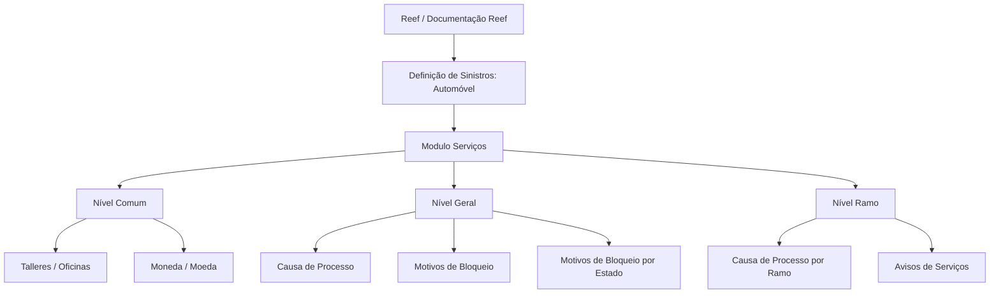

# Documentação de Definição de Sinistros (Automóvel) — Módulo de Serviços e Configurações por Ramo

## 1. Metadados do Documento
- **Arquivo de Origem:** Não identificado no conteúdo extraído
- **Tipo de Documento:** Especificação Técnica / Documentação Funcional
- **Domínio / Sistema:** Reef — Definição de Sinistros (Automóvel), Módulo Serviços
- **Público-Alvo:** Desenvolvedores, Arquitetos, Analistas Funcionais e Operação
- **Data/Versão Identificada:** Não identificada

---

## 2. Resumo Executivo & Contexto de Negócio

O documento apresenta definições funcionais para o módulo de serviços associado ao domínio de sinistros de automóvel. A estrutura descrita organiza configurações em níveis: **Comum**, **Geral** e **Ramo**.

O nível **Comum** concentra definições não exclusivas do módulo de sinistros, mas necessárias para a definição de perícias. Entre os elementos mencionados estão oficinas, moedas e dados relacionados aos meios de pagamento e contato das oficinas da companhia.

O nível **Geral** reúne definições aplicáveis a todos os possíveis expedientes aos quais um serviço pode ser associado. Nesse nível, o documento destaca causas de processo e motivos de bloqueio de serviços.

O nível **Ramo** contém definições específicas para cada ramo. São mencionadas configurações de causas de processo por ramo e avisos de serviços, considerando tipo de serviço, tipo de expediente, nível e trâmite.

---

## 3. Arquitetura, Componentes & Tecnologias Envolvidas

O conteúdo não descreve arquitetura de infraestrutura, protocolos, APIs, tecnologias de implementação, bancos de dados, ambientes técnicos ou integrações entre microsserviços. A arquitetura identificável é funcional e hierárquica, organizada por níveis de definição no módulo de serviços.

### Componentes e níveis identificados

| Componente / Nível | Finalidade identificada |
| :--- | :--- |
| Reef | Sistema ou contexto documental referido como “DOCUMENTACIÓN Reef”. |
| Definição de Sinistros (Automóvel) | Domínio funcional documentado. |
| Módulo Serviços | Módulo que concentra definições necessárias para serviços associados a expedientes. |
| Comum | Nível com definições não exclusivas de sinistros, necessárias para a definição de perícias. |
| Geral | Nível com definições que afetam todos os possíveis expedientes aos quais um serviço pode ser associado. |
| Ramo | Nível com definições específicas para cada ramo. |
| Talleres / Oficinas | Cadastro de oficinas da companhia, incluindo meios de pagamento e contato. |
| Moneda / Moeda | Informações gerais sobre moedas. |
| Causa Proceso / Causa de Processo | Catalogação de motivos de cancelamento, reabertura ou reapertura de serviços. |
| Motivos Bloqueo / Motivos de Bloqueio | Catalogação das causas pelas quais um serviço é bloqueado. |
| Motivos Bloqueo por Estado / Motivos de Bloqueio por Estado | Item listado no nível Geral sem detalhamento adicional. |
| Avisos Servicios / Avisos de Serviços | Definição de avisos por tipo de serviço, expediente, nível e trâmite. |



> **Nota de Análise:** O documento não detalha contratos de API, métodos HTTP, esquemas JSON, persistência de dados, tecnologias de implementação, responsabilidades de microsserviços ou URLs de ambientes.

---

## 4. Regras de Negócio, Especificações Funcionais & Processos

### 4.1. Nível Comum

O nível **Comum** reúne definições que não são exclusivas do módulo de sinistros, mas são necessárias para realizar a definição de perícias.

#### Oficinas

A definição de **Talleres** determina o registro de todas as oficinas da companhia. O registro contempla, ao menos, os seguintes dados:

- Meios de pagamento.
- Meio de contato.
- Outros dados, indicados pelo texto por “etc.”, sem especificação adicional.

#### Moeda

A definição de **Moneda** contém informações gerais das moedas.

> **Nota de Análise:** O documento não informa os campos do cadastro de oficinas, os meios de pagamento aceitos, os canais de contato, códigos de moeda, regras de conversão ou critérios de utilização das moedas.

### 4.2. Nível Geral

O nível **Geral** concentra definições que afetam todos os possíveis expedientes aos quais um serviço pode ser associado.

#### Causa de Processo

A funcionalidade **Causa Proceso** permite catalogar os motivos pelos quais se deseja:

1. Cancelar um serviço.
2. Reabrir ou reaperturar um serviço.

#### Motivos de Bloqueio

A funcionalidade **Motivos Bloqueo** permite catalogar as causas pelas quais um serviço é bloqueado.

#### Motivos de Bloqueio por Estado

O item **Motivos Bloqueo por Estado** é listado como uma definição do nível Geral.

> **Nota de Análise:** O documento não apresenta regras de transição de estado, estados possíveis do serviço, critérios de bloqueio, critérios de desbloqueio ou relação explícita entre motivos de bloqueio e estados.

### 4.3. Nível Ramo

O nível **Ramo** concentra definições para cada ramo.

#### Causa de Processo por Ramo

A definição de **Causa Proceso** no nível Ramo permite catalogar os motivos pelos quais se deseja realizar a:

- Cancelamento de um serviço por ramo.
- Reabertura de um serviço por ramo.

#### Avisos de Serviços

A definição de **Avisos Servicios** permite definir avisos conforme os seguintes critérios mencionados:

- Tipo de serviço.
- Tipo de expediente.
- Nível.
- Trâmite.
- Outros critérios não detalhados, indicados por “etc.”.

> **Nota de Análise:** O documento não especifica o conteúdo dos avisos, destinatários, canais de notificação, periodicidade, eventos disparadores, prioridades ou regras de escalonamento.

---

## 5. Tabelas de Parâmetros, Ambientes e Estruturas de Dados

| Item / Parâmetro | Descrição / Função | Tipo / Valores / Formato | Ambiente / Observações |
| :--- | :--- | :--- | :--- |
| Comum | Nível de definições não exclusivas de sinistros e necessárias para a definição de perícias. | Nível funcional | Aplicável ao módulo de serviços. |
| Talleres / Oficinas | Registra todas as oficinas da companhia. | Cadastro | Inclui meios de pagamento, meio de contato e outros dados não detalhados. |
| Meios de pagamento | Informação associada às oficinas. | Não especificado | O documento não lista valores possíveis. |
| Meio de contato | Informação associada às oficinas. | Não especificado | O documento não lista canais ou formatos. |
| Moneda / Moeda | Contém informações gerais das moedas. | Informação geral | Sem campos, códigos ou regras detalhados. |
| Geral | Nível de definições que afetam todos os possíveis expedientes associados a um serviço. | Nível funcional | Aplicável a possíveis expedientes. |
| Causa Proceso / Causa de Processo | Cataloga motivos para cancelar ou reabrir um serviço. | Catálogo de motivos | Definição no nível Geral. |
| Motivos Bloqueo / Motivos de Bloqueio | Cataloga causas de bloqueio de um serviço. | Catálogo de causas | Definição no nível Geral. |
| Motivos Bloqueo por Estado | Item listado entre as definições do nível Geral. | Não especificado | Não há detalhamento funcional adicional. |
| Ramo | Nível com definições para cada ramo. | Nível funcional | Possui configurações específicas por ramo. |
| Causa Proceso por Ramo | Cataloga motivos de cancelamento ou reabertura de serviço para cada ramo. | Catálogo de motivos por ramo | O documento não informa os ramos disponíveis. |
| Avisos Servicios / Avisos de Serviços | Define avisos relacionados a serviços. | Configuração de avisos | Considera tipo de serviço, tipo de expediente, nível, trâmite e critérios não detalhados. |
| Tipo de serviço | Critério para definição de avisos de serviços. | Não especificado | Sem lista de valores. |
| Tipo de expediente | Critério para definição de avisos de serviços. | Não especificado | Sem lista de valores. |
| Nível | Critério para definição de avisos de serviços. | Não especificado | O documento não define a taxonomia de níveis. |
| Trâmite | Critério para definição de avisos de serviços. | Não especificado | O documento não define trâmites possíveis. |

---

## 6. Bateria de Perguntas & Respostas para RAG (FAQ Sintético)

### P1: Qual é o objetivo do nível Comum no módulo de serviços de sinistros?
**R:** O nível Comum reúne definições que não são exclusivas do módulo de sinistros, mas que são necessárias para realizar a definição de perícias. Entre as definições citadas estão oficinas e moedas.

### P2: Quais informações devem ser registradas para as oficinas da companhia?
**R:** O documento informa que todas as oficinas da companhia devem ser registradas com seus meios de pagamento, meio de contato e outros dados não especificados no conteúdo extraído.

### P3: O que a definição Moneda representa no documento?
**R:** A definição Moneda representa as informações gerais das moedas. O documento não detalha campos, códigos, tipos de moeda ou regras de conversão.

### P4: Para que serve Causa Proceso no nível Geral?
**R:** No nível Geral, Causa Proceso permite catalogar os motivos pelos quais se deseja cancelar um serviço ou reabrir um serviço. Essa definição afeta todos os possíveis expedientes aos quais um serviço pode ser associado.

### P5: Qual é a finalidade de Motivos Bloqueo?
**R:** Motivos Bloqueo permite catalogar as causas pelas quais um serviço é bloqueado. O documento não especifica quais causas existem, como o bloqueio é aplicado ou como ocorre o desbloqueio.

### P6: O documento define os estados possíveis para Motivos Bloqueo por Estado?
**R:** Não. Motivos Bloqueo por Estado é listado como uma definição do nível Geral, mas o conteúdo extraído não descreve estados possíveis, regras de associação, transições ou comportamentos operacionais.

### P7: Como Causa Proceso funciona no nível Ramo?
**R:** No nível Ramo, Causa Proceso permite catalogar os motivos pelos quais se deseja realizar o cancelamento ou a reabertura de um serviço para cada ramo.

### P8: Quais critérios podem ser usados para definir Avisos Servicios?
**R:** Avisos Servicios podem ser definidos por tipo de serviço, tipo de expediente, nível, trâmite e outros critérios não detalhados pelo documento.

### P9: O documento informa como os avisos de serviços são enviados?
**R:** Não. O documento informa os critérios de definição dos avisos de serviços, mas não detalha destinatários, canais, formatos, eventos disparadores, periodicidade ou mecanismos de entrega.

### P10: Quais são os níveis funcionais de configuração descritos?
**R:** O documento descreve três níveis funcionais: Comum, Geral e Ramo. O nível Comum reúne definições compartilhadas necessárias para perícias; o nível Geral reúne definições aplicáveis aos expedientes associados a serviços; e o nível Ramo reúne definições específicas por ramo.

---

## 7. Glossário de Termos, Siglas & Conceitos-Chave

- **Reef:** Nome citado na documentação como “DOCUMENTACIÓN Reef”. O conteúdo não expande ou define formalmente o termo.
- **Sinistros:** Domínio funcional associado ao documento “Definición de Siniestros (Automóvil)”.
- **Automóvel:** Segmento de sinistros explicitamente indicado no título do conteúdo bruto.
- **Módulo Serviços:** Módulo no qual são organizadas as definições descritas.
- **Comum:** Nível de definições não exclusivas de sinistros e necessárias para a definição de perícias.
- **Geral:** Nível de definições que afetam todos os possíveis expedientes aos quais um serviço pode ser associado.
- **Ramo:** Nível de definições específicas para cada ramo.
- **Talleres:** Termo em espanhol para oficinas; representa o cadastro de oficinas da companhia.
- **Moneda:** Termo em espanhol para moeda; representa informações gerais das moedas.
- **Causa Proceso:** Termo em espanhol para causa de processo; catálogo de motivos para cancelamento ou reabertura de serviço.
- **Motivos Bloqueo:** Termo em espanhol para motivos de bloqueio; catálogo de causas para bloqueio de serviço.
- **Avisos Servicios:** Termo em espanhol para avisos de serviços; configuração de avisos por critérios funcionais.
- **Expediente:** Entidade mencionada como possível associação de um serviço; o documento não fornece uma definição adicional.
- **Peritaciones:** Termo citado no contexto de definições necessárias para perícias; o documento não oferece detalhamento adicional.
- **Trámite:** Termo citado como critério de aviso de serviço; o documento não define seu significado operacional.

---

## 8. Notas Críticas, Riscos & Limitações

- O conteúdo extraído não identifica nome do arquivo, data, versão, autor técnico ou histórico de revisões.
- O documento não descreve arquitetura técnica, integrações, APIs, tecnologias, ambientes, servidores, URLs, portas, bancos de dados ou mecanismos de autenticação.
- Os itens **Motivos Bloqueo por Estado** e parte dos critérios de **Avisos Servicios** são apenas listados, sem detalhamento adicional.
- Não há dicionário de dados para oficinas, moedas, expedientes, serviços, ramos ou avisos.
- Não há relação explícita entre causas de processo, bloqueios, estados de serviço e avisos.
- O texto usa os termos “etc.” para oficinas e avisos de serviços, indicando existência de atributos ou critérios adicionais não detalhados.
- A navegação de origem cita “Mapfredocument”, “Zeus”, “Reef”, “Cloud”, “APIs” e “Componentes”, mas não descreve relações técnicas ou funcionais entre esses elementos.

---

## 9. Conteúdo Bruto Estruturado (Referência Fiel)

```text
--- [PÁGINA 1 DE 2] ---

DOCUMENTACIÓN de DEFINICIÓN de SINIESTROS (Automóvil)
DEFINICIONES - MÓDULO SERVICIOS
COMÚN
En este nivel se encuentran deniciones que NO son exclusivas del módulo de siniestros, pero son
necesarias para poder realizar la denición de peritaciones. En otros se encuentran:
TALLERES
Registrar todos los talleres de la compañía con sus medios de
pago, medio de contacto, etc
MONEDA
Información General de las monedas
GENERAL
En este Nivel se encuentran deniciones que afectarán a todos los posibles expedientes a los que se les
pueda asociar un servicio. Entre otros se dene:
CAUSA PROCESO
Permite catalogar los motivos por los que
se quiere cancelar un servicio o
reaperturar un servicio
MOTIVOS BLOQUEO
Permite catalogar las causas por las que
se bloquea un servicio
MOTIVOS BLOQUEO POR ESTADO
RAMO
Documentation / DOCUMENTACIÓN Reef
DOCUMENTACIÓN Reef
Mapfredocument
DOCUMENTACIÓN Reef
Owner
user:agonzalez_mapfre.com
Lifecycle
Approved Source
 /
VL
Buscar Inicio Soluciones Arquitecturas APIs Componentes Cloud Documentación Zeus Reef Ayuda
ES

--- [PÁGINA 2 DE 2] ---

En este Nivel se encuentran deniciones para cada ramo
CAUSA PROCESO
Permite catalogar los motivos por los que se quiere realizar la
cancelación o reapertura de un servicio para cada ramo
AVISOS SERVICIOS
Permite denir los avisos por tipo de servicio, tipo de expediente,
nivel, trámite etc
```
