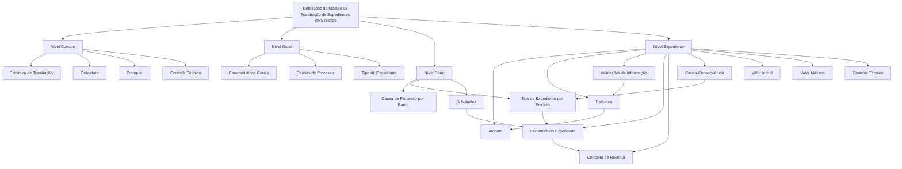

# Definições do Módulo de Tramitação de Expedientes de Sinistros — Reef / Mapfre

## 1. Metadados do Documento
- **Arquivo de Origem:** Não identificado; conteúdo extraído de “DOCUMENTACIÓN DEFINICIÓN de SINIESTROS”.
- **Tipo de Documento:** Especificação Funcional / Documentação de Definições.
- **Domínio / Sistema:** Reef / Mapfre — módulo de tramitação de expedientes de sinistros.
- **Público-Alvo:** Analistas funcionais, desenvolvedores, arquitetos e equipes de operação de sinistros.
- **Data/Versão Identificada:** Não identificada.
- **Owner identificado no conteúdo:** `user:agonzalez_mapfre.com`
- **Lifecycle identificado no conteúdo:** `Approved`

---

## 2. Resumo Executivo & Contexto de Negócio

O documento descreve a estrutura de definições configuráveis do módulo de tramitação de expedientes de sinistros no contexto Reef / Mapfre. A organização funcional está segmentada em quatro níveis: **Comum**, **Geral**, **Ramo** e **Expediente**. Cada nível concentra definições com escopos distintos, desde configurações compartilhadas até regras aplicáveis a um expediente específico.

No nível **Comum**, o documento reúne definições que não são exclusivas do módulo de sinistros, mas são necessárias para sua configuração. Entre essas definições estão a estrutura de tramitação, coberturas, franquias e controles técnicos. Essas configurações suportam a associação de escritórios, supervisores e tramitadores, além de elementos contratuais e operacionais relacionados ao seguro.

No nível **Geral**, são definidas configurações que afetam todos os possíveis expedientes de um sinistro. O conteúdo identifica características gerais, causas de processo e tipos de expediente. As características gerais controlam, por exemplo, se causas devem ser solicitadas na abertura do expediente ou em uma alteração de valoração.

O nível **Ramo** contém definições exclusivas do ramo configurado. Nesse nível, os tipos de expediente podem ser associados a produtos, tipos de dano, coberturas e características; causas de processo podem ser catalogadas por ramo; e sub-limites podem ser definidos por ramo, tipo de expediente e cobertura.

O nível **Expediente** concentra definições aplicáveis a cada expediente possível de um sinistro. Inclui atributos, estruturas de informação, validações de dados, comportamento de coberturas, conceitos de reserva, relações de causa-consequência, valor inicial, valor máximo e controles técnicos. O documento não detalha interfaces, métodos HTTP, contratos JSON, banco de dados, integrações ou regras de cálculo além das descrições funcionais apresentadas.

---

## 3. Arquitetura, Componentes & Tecnologias Envolvidas

### Componentes e domínios identificados

- **Reef:** Sistema ou contexto documental citado como “DOCUMENTACIÓN Reef”.
- **Mapfre:** Organização ou domínio citado no conteúdo.
- **Módulo de tramitação de expedientes:** Módulo funcional destinado à definição do comportamento de operações de expedientes de sinistros.
- **Sinistro:** Contexto de negócio ao qual os expedientes pertencem.
- **Expediente:** Unidade tratada pelo módulo, com definições, atributos, validações, coberturas e informações econômicas próprias.
- **Ramo:** Escopo de configuração exclusivo de um ramo de seguro.
- **Produto:** Entidade à qual podem ser associados tipos de dano, coberturas e características de tipos de expediente.
- **Cobertura:** Obrigação principal em um contrato de seguro; influencia os processos de emissão e prestações.
- **Conceito de reserva:** Elemento usado para determinar o desdobramento econômico de um expediente.
- **Controle técnico:** Definições de erros, tipos de erros e condições para paralisar ou exigir autorização na tramitação.
- **Estrutura de tramitação:** Definição de escritórios onde expedientes são tratados e associação de supervisores e tramitadores.

### Relação funcional entre níveis de definição



> **Nota de Análise:** O conteúdo apresenta uma arquitetura funcional de configurações. Não há detalhamento de arquitetura física, infraestrutura, microsserviços, APIs, tecnologias de desenvolvimento, ambientes de implantação, URLs, portas, repositórios, pipelines CI/CD ou protocolos de integração.

---

## 4. Regras de Negócio, Especificações Funcionais & Processos

### 4.1. Nível Comum

O nível **Comum** agrupa definições que não são exclusivas do módulo de sinistros, porém são necessárias para realizar a definição do módulo.

#### Estrutura de tramitação
A estrutura de tramitação define os escritórios nos quais os expedientes são tratados. Também permite associar supervisores e tramitadores a esses escritórios ou à estrutura configurada.

#### Cobertura
Uma cobertura é definida como a obrigação principal em um contrato de seguro. O documento informa que existem diversos tipos de cobertura e que esses tipos determinam o comportamento tanto no processo de emissão quanto no processo de prestações.

#### Franquia
A franquia estabelece a quantia pela qual o segurado responde em caso de sinistro.

#### Controle técnico
O controle técnico permite definir erros e tipos de erros aplicáveis à tramitação de expedientes.

---

### 4.2. Nível Geral

O nível **Geral** contém definições que afetam todos os possíveis expedientes de um sinistro.

#### Características gerais
As características gerais do módulo de sinistros permitem definir o comportamento das operações de expediente. O documento apresenta como exemplos:

1. Definir se causas devem ser solicitadas durante a abertura de um expediente.
2. Definir se causas devem ser solicitadas durante uma alteração de valoração.

O texto não informa quais operações adicionais existem, quais valores de configuração são possíveis, nem quais consequências específicas decorrem de cada escolha.

#### Causas de processo
As causas de processo permitem catalogar os motivos pelos quais se deseja realizar uma operação.

#### Tipo de expediente
O tipo de expediente permite definir os tipos de dano.

---

### 4.3. Nível Ramo

As definições do nível **Ramo** são exclusivas do ramo que está sendo definido.

#### Tipo de expediente por produto
O tipo de expediente permite associar a cada produto:

- Os tipos de dano possíveis;
- As coberturas correspondentes;
- As características relacionadas.

#### Causa de processo por ramo
A causa de processo permite catalogar, para cada ramo, os motivos pelos quais se deseja realizar operações de expediente.

#### Sub-limites
Os sub-limites permitem definir, por ramo:

- Quais tipos de expediente utilizarão sub-limites;
- Quais coberturas utilizarão sub-limites.

O documento não detalha a fórmula, moeda, periodicidade, hierarquia ou critérios de cálculo dos sub-limites.

---

### 4.4. Nível Expediente

O nível **Expediente** contém definições que afetam cada um dos possíveis expedientes de um sinistro.

#### Atributo
Um atributo permite definir informação adicional do expediente.

#### Estrutura
Uma estrutura é composta por atributos e permite definir:

- A informação adicional do expediente;
- A obrigatoriedade ou não de solicitar informações;
- A ordem em que as informações serão solicitadas.

#### Validações de informação
As validações de informação permitem definir comportamentos e validações da informação core solicitada nas operações de expediente.

Exemplo explícito do documento:

- Tornar obrigatória a data de declaração de um expediente.

#### Cobertura do expediente
A definição de cobertura permite indicar, dentre todas as coberturas definidas no produto:

- Qual cobertura será afetada por cada tipo de expediente;
- Qual será o comportamento dessa cobertura para cada tipo de expediente.

#### Conceito de reserva
O conceito de reserva determina o desdobramento econômico do expediente. O documento cita os seguintes tipos de conceitos de reserva:

- Indenização;
- Honorários;
- Gastos.

#### Causa-consequência
A definição de causa-consequência permite propor os possíveis tipos de expediente que poderão ser abertos por causa-consequência.

#### Valor inicial
O valor inicial define o custo médio pelo qual o expediente será valorado quando não houver uma valoração clara.

#### Valor máximo
O valor máximo determina o importe máximo pelo qual uma cobertura, associada a um conceito de reserva, pode ser valorada.

#### Controle técnico
No contexto de expediente, o controle técnico permite definir as condições em que:

- A tramitação de um expediente pode ser paralisada;
- Uma tramitação ou obrigação deve ser autorizada.

> **Nota de Análise:** O documento não especifica quais condições técnicas, regras de autorização, perfis responsáveis, estados de expediente, mensagens de erro ou mecanismos de paralisação devem ser configurados.

---

## 5. Tabelas de Parâmetros, Ambientes e Estruturas de Dados

| Item / Parâmetro | Descrição / Função | Tipo / Valores / Formato | Ambiente / Observações |
| :--- | :--- | :--- | :--- |
| Estrutura de tramitação | Define escritórios onde os expedientes são tratados e associa supervisores e tramitadores. | Definição organizacional. | Nível Comum. |
| Cobertura | Representa a obrigação principal de um contrato de seguro e influencia emissão e prestações. | Existem diversos tipos de cobertura; tipos não detalhados. | Nível Comum; também configurada no nível Expediente. |
| Franquia | Estabelece a quantia pela qual o segurado responde em caso de sinistro. | Quantia; formato não detalhado. | Nível Comum. |
| Controle técnico — Comum | Define erros e tipos de erros para a tramitação de expediente. | Erros e tipos de erro; valores não detalhados. | Nível Comum. |
| Características gerais | Define o comportamento das operações de expediente. | Configuração de comportamento; valores não detalhados. | Nível Geral. |
| Solicitação de causas na abertura | Exemplo de comportamento configurável nas características gerais. | Solicitar ou não solicitar; representação não detalhada. | Nível Geral. |
| Solicitação de causas na alteração de valoração | Exemplo de comportamento configurável nas características gerais. | Solicitar ou não solicitar; representação não detalhada. | Nível Geral. |
| Causa de processo | Cataloga motivos para realizar uma operação. | Catálogo de motivos; estrutura não detalhada. | Nível Geral e nível Ramo. |
| Tipo de expediente — Geral | Permite definir os tipos de dano. | Tipos de dano; valores não detalhados. | Nível Geral. |
| Tipo de expediente por produto | Associa a cada produto tipos de dano, coberturas e características. | Associação entre produto, dano, cobertura e características. | Nível Ramo. |
| Causa de processo por ramo | Cataloga motivos das operações de expediente para cada ramo. | Catálogo por ramo; valores não detalhados. | Nível Ramo. |
| Sub-limites | Define por ramo quais tipos de expediente e coberturas utilizarão sub-limites. | Configuração de uso de sub-limites; cálculo não detalhado. | Nível Ramo. |
| Atributo | Define informação adicional do expediente. | Atributo; estrutura e tipos não detalhados. | Nível Expediente. |
| Estrutura | Organiza atributos, obrigatoriedade das informações e ordem de solicitação. | Conjunto ordenado de atributos e regras de obrigatoriedade. | Nível Expediente. |
| Validações de informação | Define comportamentos e validações da informação core solicitada nas operações. | Regras de validação; exemplos não exaustivos. | Nível Expediente. |
| Data de declaração | Informação que pode ser configurada como obrigatória. | Data; formato não detalhado. | Exemplo de validação de informação. |
| Cobertura do expediente | Define a cobertura afetada por tipo de expediente e seu comportamento. | Associação entre cobertura e tipo de expediente. | Nível Expediente; coberturas originam-se do produto. |
| Conceito de reserva | Determina o desdobramento econômico do expediente. | Indenização, Honorários ou Gastos. | Nível Expediente. |
| Causa-consequência | Propõe possíveis tipos de expediente que podem ser abertos por causa-consequência. | Relação entre causa-consequência e tipo de expediente. | Nível Expediente. |
| Valor inicial | Define custo médio para valoração sem valoração clara. | Valor monetário ou custo médio; formato não detalhado. | Nível Expediente. |
| Valor máximo | Determina o importe máximo para valorar cobertura e conceito de reserva. | Importe máximo; moeda e cálculo não detalhados. | Nível Expediente. |
| Controle técnico — Expediente | Define condições para paralisar tramitação ou exigir autorização. | Condições de controle e autorização; valores não detalhados. | Nível Expediente. |
| Owner | Proprietário identificado no portal documental. | `user:agonzalez_mapfre.com` | Metadado exibido no conteúdo. |
| Lifecycle | Situação do documento no portal. | `Approved` | Metadado exibido no conteúdo. |

> **Nota de Análise:** O conteúdo não apresenta URLs de ambientes, nomes de servidores, credenciais, portas, arquivos de log, variáveis de configuração, esquemas de banco de dados, contratos de API ou modelos de payload.

---

## 6. Bateria de Perguntas & Respostas para RAG (FAQ Sintético)

### P1: Quais são os níveis de definição do módulo de tramitação de expedientes de sinistros?
**R:** O módulo está organizado nos níveis **Comum**, **Geral**, **Ramo** e **Expediente**. O nível Comum contém definições compartilhadas necessárias à configuração; o nível Geral afeta todos os possíveis expedientes de um sinistro; o nível Ramo contém definições exclusivas do ramo; e o nível Expediente reúne definições aplicáveis a cada expediente de sinistro.

### P2: O que é definido pela estrutura de tramitação no nível Comum?
**R:** A estrutura de tramitação define os escritórios nos quais os expedientes são tratados. Também permite associar supervisores e tramitadores à estrutura de tramitação definida.

### P3: Como o documento define cobertura no contexto de sinistros?
**R:** Cobertura é a obrigação principal em um contrato de seguro. O documento informa que existem diversos tipos de cobertura e que eles determinam comportamentos nos processos de emissão e de prestações. No nível Expediente, a configuração de cobertura identifica qual cobertura do produto é afetada por cada tipo de expediente e qual comportamento essa cobertura terá.

### P4: Para que serve a franquia no módulo de sinistros?
**R:** A franquia estabelece a quantidade pela qual o segurado responde em caso de sinistro. O documento não informa regras de cálculo, moeda, limites ou critérios específicos para configuração da franquia.

### P5: O que as características gerais do módulo de sinistros permitem configurar?
**R:** As características gerais permitem definir o comportamento das operações de expediente. O documento fornece como exemplos a decisão de solicitar causas durante a abertura de um expediente e durante uma alteração de valoração.

### P6: Qual é a função das causas de processo?
**R:** As causas de processo permitem catalogar os motivos pelos quais se deseja realizar uma operação. No nível Ramo, essa catalogação é aplicada especificamente às operações de expediente de cada ramo.

### P7: Como os tipos de expediente são relacionados a produtos no nível Ramo?
**R:** No nível Ramo, o tipo de expediente permite associar a cada produto os tipos de dano possíveis, as coberturas correspondentes e as características relacionadas. O documento não detalha a estrutura técnica dessa associação.

### P8: O que são sub-limites e como são configurados?
**R:** Sub-limites são configurados por ramo para determinar quais tipos de expediente e quais coberturas utilizarão sub-limites. O documento não especifica o cálculo, os valores, as moedas, os períodos ou a hierarquia de aplicação desses sub-limites.

### P9: O que é uma estrutura de expediente?
**R:** A estrutura do expediente é uma composição de atributos que define a informação adicional do expediente. A estrutura também indica se uma informação deve ser obrigatoriamente solicitada e em qual ordem as informações serão pedidas.

### P10: Qual exemplo de validação de informação é fornecido pelo documento?
**R:** O documento apresenta como exemplo a configuração que torna obrigatória a data de declaração de um expediente. As validações de informação são usadas para definir comportamentos e validações da informação core solicitada nas operações de expediente.

### P11: Quais conceitos de reserva são citados no documento?
**R:** O documento cita três tipos de conceitos de reserva: **Indenização**, **Honorários** e **Gastos**. Esses conceitos determinam o desdobramento econômico do expediente.

### P12: Em que situação o valor inicial deve ser utilizado?
**R:** O valor inicial define o custo médio pelo qual um expediente será valorado quando não houver uma valoração clara. O documento não detalha o método de cálculo do custo médio nem critérios adicionais para determinar a ausência de valoração clara.

### P13: O que limita o valor máximo de uma cobertura?
**R:** O valor máximo determina o importe máximo pelo qual uma cobertura associada a um conceito de reserva pode ser valorada. Não são informados valores, moeda, regras de arredondamento ou mecanismos de exceção.

### P14: Quando o controle técnico pode interferir na tramitação de um expediente?
**R:** No nível Expediente, o controle técnico permite definir as condições em que a tramitação pode ser paralisada ou em que uma obrigação deve ser autorizada. O documento não detalha as condições, os tipos de autorização nem os responsáveis por autorizar.

### P15: O documento descreve APIs, microsserviços ou integrações técnicas?
**R:** Não. O conteúdo apresenta definições funcionais do módulo de tramitação de expedientes de sinistros, mas não descreve APIs, métodos HTTP, microsserviços, contratos JSON, bancos de dados, protocolos de integração, ambientes técnicos ou pipelines de implantação.

---

## 7. Glossário de Termos, Siglas & Conceitos-Chave

- **Reef:** Nome citado na documentação e no portal documental como “DOCUMENTACIÓN Reef”. O conteúdo não expande o significado do termo.
- **Mapfre:** Nome citado no contexto documental. O conteúdo não detalha seu papel organizacional ou técnico.
- **Sinistro:** Evento no contexto de seguro que pode gerar um ou mais expedientes.
- **Expediente:** Unidade de tramitação associada a um sinistro e sujeita a atributos, validações, coberturas, reservas e controles técnicos.
- **Ramo:** Escopo de configuração de seguro para o qual existem definições exclusivas.
- **Produto:** Entidade à qual são associados tipos de dano, coberturas e características de tipos de expediente.
- **Cobertura:** Obrigação principal de um contrato de seguro; pode afetar emissão, prestações e comportamento de expedientes.
- **Franquia:** Quantia pela qual o segurado responde em caso de sinistro.
- **Estrutura de tramitação:** Definição de escritórios de tratamento de expedientes e associação de supervisores e tramitadores.
- **Tramitador:** Papel associado à tramitação de expedientes; responsabilidades detalhadas não são fornecidas.
- **Supervisor:** Papel associado à estrutura de tramitação; responsabilidades detalhadas não são fornecidas.
- **Causa de processo:** Motivo catalogado para realização de uma operação.
- **Tipo de expediente:** Classificação usada para definir tipos de dano e associá-los a produtos, coberturas e características.
- **Tipo de dano:** Classificação de dano definida por meio do tipo de expediente.
- **Sub-limite:** Configuração aplicável a tipos de expediente e coberturas por ramo; critérios de cálculo não detalhados.
- **Atributo:** Informação adicional definida para um expediente.
- **Estrutura:** Composição de atributos com regras de obrigatoriedade e ordem de solicitação.
- **Informação core:** Informação solicitada em operações de expediente e sujeita a comportamentos e validações.
- **Conceito de reserva:** Classificação usada para determinar o desdobramento econômico de um expediente.
- **Indenização:** Tipo de conceito de reserva citado no documento.
- **Honorários:** Tipo de conceito de reserva citado no documento.
- **Gastos:** Tipo de conceito de reserva citado no documento.
- **Causa-consequência:** Configuração que propõe os possíveis tipos de expediente que podem ser abertos.
- **Valor inicial:** Custo médio utilizado para valorar um expediente quando não há valoração clara.
- **Valor máximo:** Importe máximo de valoração para uma combinação de cobertura e conceito de reserva.
- **Controle técnico:** Definição de erros, tipos de erros, condições de paralisação e exigências de autorização aplicáveis à tramitação.

---

## 8. Notas Críticas, Riscos & Limitações

- O documento não identifica um nome de arquivo de origem, data, versão, autoria formal ou histórico de alterações.
- O conteúdo fornece uma taxonomia funcional, mas não especifica implementação técnica, APIs, métodos HTTP, contratos JSON, modelos de dados, tabelas de banco de dados ou integrações entre sistemas.
- Não há detalhamento de ambientes de desenvolvimento, homologação, produção, URLs, servidores, portas, variáveis de configuração, rotas de logs ou mecanismos de observabilidade.
- Os termos **Reef** e **Mapfre** são citados, mas o documento não define seus significados completos nem a fronteira técnica entre eles.
- Não são apresentados valores concretos para franquias, valores iniciais, valores máximos ou sub-limites.
- Não são definidos os estados de ciclo de vida de um expediente, transições, responsáveis, permissões, perfis de autorização ou critérios de auditoria.
- O controle técnico é mencionado em dois níveis, mas o documento não detalha catálogo de erros, severidades, mensagens, ações corretivas, critérios de paralisação ou fluxo de autorização.
- O conteúdo apresenta caracteres de extração corrompidos em algumas palavras, como `deniciones`, `ocinas` e `denir`. A interpretação semântica foi limitada ao texto visível e ao contexto imediato, sem introduzir conteúdo externo.
- **Nota de Análise:** O documento lista configurações de tipos de expediente, coberturas, reservas e validações, porém não detalha os métodos de manutenção, persistência ou consulta dessas configurações.

---

## 9. Conteúdo Bruto Estruturado (Referência Fiel)

```text
--- [PÁGINA 1 DE 2] ---

DOCUMENTACIÓN DEFINICIÓN de SINIESTROS
DEFINICIONES - MÓDULO TRAMITACIÓN EXPEDIENTES
COMÚN
En este nivel se encuentran deniciones que NO son exclusivas del módulo de siniestros, pero son
necesarias para poder realizar la denición. Entre otras deniciones se encuentra:
ESTRUCTURA TRAMITACIÓN
Denición de ocinas donde se tramitan
expedientes, se asocian supervisores,
tramitadores
COBERTURA
Obligación principal en un contrato de
seguro. Existen diversos tipos de
cobertura que determinan el
comportamiento tanto en el proceso de
emisión, como en el proceso de
prestaciones
FRANQUICIA
Establecer la cantidad por la que el
asegurado responde en caso de siniestro
CONTROL TÉCNICO
Denición de errores, tipos de Errores para
tramitación de expediente
GENERAL
En este nivel se encuentran deniciones que afectarán a todos los posibles expedientes de un siniestro.
Entre otros se dene:
CARACTERÍSTICAS GENERALES
CAUSAS DE PROCESOS
TIPO EXPEDIENTE
Documentation / DOCUMENTACIÓN Reef
DOCUMENTACIÓN Reef
Mapfredocument
DOCUMENTACIÓN Reef
Owner
user:agonzalez_mapfre.com
Lifecycle
Approved Source
/
VL
Buscar Inicio Soluciones Arquitecturas APIs Componentes Cloud Documentación Zeus Reef Ayuda
ES

--- [PÁGINA 2 DE 2] ---

Características generales del módulo de
siniestros, permite denir el
comportamiento de las operaciones de
expedientes como por ejemplo si se va a
pedir causas en la apertura de expediente,
en al cambio de valoración...
Permite catalogar los motivos por los que
se quiere realizar una operación
Permite denir los Tipos de Daño
RAMO
Son exclusivas del ramo que se está deniendo. Por ejemplo:
TIPO EXPEDIENTE
Permite asociar a cada Producto los Tipos
de daños posibles, sus coberturas y sus
características
CAUSA PROCESO
Permite catalogar los motivos por los que
se quiere realizar las operaciones de
expedientes para cada ramo
SUB-LIMITES
Permite denir por Ramo, qué tipos de
expediente y coberturas van a utilizar sub-
límites.
EXPEDIENTE
Deniciones que afectan a cada uno de los posibles expedientes del siniestro
ATRIBUTO
Permite denir la información adicional
del expediente.
ESTRUCTURA
Información adicional del expediente
compuesta por atributos, obligatoriedad o
no de pedir información, orden en el que
se va a pedir
VALIDACIONES INFORMACIÓN
Denir comportamientos y validaciones de
la información core, que se pide en las
operaciones de expedientes. Ejemplo
poner obligatoria la fecha de declaración
de un expediente
COBERTURA
Denir de todas las coberturas denidas
en el producto, cual va a ser afectada por
cada uno de los tipos de expedientes y su
comportamiento
CONCEPTO RESERVA
Determinar el desglose económico del
expediente. Los tipos de conceptos de
reserva pueden ser Indemnización,
Honorarios o Gastos
CAUSA-CONSECUENCIA
Permite proponer los posibles Tipos de
Expedientes que se podrán aperturar por
causa consecuencia
VALOR INICIAL
Denición del coste medio con el que se
va a valorar el expediente si no se tiene
una valoración clara
VALOR MÁXIMO
Determinar el importe Máximo por el que
se puede valorar una cobertura concepto
de reserva
CONTROL TÉCNICO
Denir en qué condiciones se puede
paralizar la tramitación de un expediente u
obligación de ser autorizada
```
