# Definições do Módulo de Tramitação de Sinistros de Automóvel — Documentação REEF

## 1. Metadados do Documento
- **Arquivo de Origem:** Não identificado no conteúdo extraído
- **Tipo de Documento:** Especificação Funcional / Documentação de Definições
- **Domínio / Sistema:** REEF / Módulo de Tramitação de Sinistros de Automóvel
- **Público-Alvo:** Analistas funcionais, equipes de negócio, desenvolvedores, supervisores e operação de sinistros
- **Data/Versão Identificada:** Não identificada
- **Proprietário identificado:** `agonzalez_mapfre.com`
- **Lifecycle identificado:** Approved Source

---

## 2. Resumo Executivo & Contexto de Negócio

O documento descreve definições funcionais usadas no módulo de tramitação de sinistros, no contexto de Automóvel e da documentação REEF. A organização apresentada divide as definições em níveis: **Comum**, **Geral**, **Ramo** e **Sinistro**. Cada nível concentra elementos de configuração com diferentes alcances funcionais.

O nível **Comum** reúne definições não exclusivas do módulo de sinistros, mas necessárias para sua configuração. Entre essas definições estão informações corporativas, como companhia e moeda, além de estruturas geográficas, comerciais, de produto e de tramitação.

O nível **Geral** contém definições não exclusivas de um ramo específico, porém aplicáveis ao módulo de sinistros. São destacados mecanismos de numeração de sinistros, registro de eventos catastróficos e características gerais que determinam comportamentos do módulo.

Os níveis **Ramo** e **Sinistro** especializam a configuração. O nível Ramo inclui regras específicas, como extemporaneidade, causas de processo e especialidades de supervisores e tramitadores. O nível Sinistro reúne definições que afetam todos os expedientes de um sinistro, incluindo causa de origem, consequência, atributos, estruturas de informação, informação inicial, validações e controle técnico.

---

## 3. Arquitetura, Componentes & Tecnologias Envolvidas

O conteúdo não descreve arquitetura técnica de software, integrações, tecnologias, APIs, microsserviços, bancos de dados ou ambientes de execução. A estrutura disponível é uma arquitetura funcional de definições e configurações do módulo de tramitação de sinistros.

### Componentes funcionais identificados

- **REEF:** Sistema ou domínio documental citado como “DOCUMENTACIÓN Reef”.
- **Mapfredocument:** Nome citado na navegação do conteúdo extraído.
- **Módulo de Tramitação de Sinistros:** Módulo funcional que utiliza definições comuns, gerais, específicas de ramo e específicas de sinistro.
- **Compañía:** Informação geral da empresa.
- **Moneda:** Informação geral das moedas.
- **Estrutura Geográfica:** Divisões do país por zonas.
- **Estrutura Comercial:** Divisões organizativas da companhia.
- **Estrutura Produto:** Divisões dos ramos.
- **Estrutura Tramitação:** Definição de escritórios responsáveis pela tramitação de expedientes e associação de supervisores e tramitadores.
- **Numeração:** Determinação dos elementos que integram o número do sinistro e sua ordem.
- **Eventos:** Registro de fenômenos catastróficos ocorridos em uma zona geográfica.
- **Características Gerais:** Determinação de comportamentos do módulo de sinistros.
- **Extemporaneidade:** Número máximo de dias entre a ocorrência e a comunicação do sinistro à companhia.
- **Causa de Processo:** Catalogação de motivos para operações de sinistros por ramo.
- **Especialidade de Supervisores:** Especialização de supervisores em produtos determinados.
- **Especialidade de Tramitadores:** Especialização de tramitadores em produtos determinados.
- **Causa de Origem:** Catálogo de causas que originam um sinistro.
- **Consequência:** Definição de danos possíveis decorrentes de um sinistro.
- **Causa-Consequência:** Associação entre causas de origem e danos possíveis.
- **Atributo:** Informação adicional do sinistro.
- **Estrutura:** Organização de informação adicional composta por atributos, obrigatoriedade e ordem de solicitação.
- **Informação Inicial:** Valores prévios para atributos das operações de sinistros.
- **Validações de Informação:** Comportamentos e validações para informações core solicitadas nas operações de sinistros.
- **Controle Técnico:** Definição das condições para paralisar a tramitação ou exigir autorização.

```mermaid
graph TD
    REEF["Documentação REEF<br/>Módulo de Tramitação de Sinistros"] --> COMUM["Nível Comum"]
    REEF --> GERAL["Nível Geral"]
    REEF --> RAMO["Nível Ramo"]
    REEF --> SINIESTRO["Nível Sinistro"]

    COMUM --> COMPANHIA["Companhia"]
    COMUM --> MOEDA["Moeda"]
    COMUM --> GEO["Estrutura Geográfica"]
    COMUM --> COMERCIAL["Estrutura Comercial"]
    COMUM --> PRODUTO["Estrutura Produto"]
    COMUM --> CT_COMUM["Controle Técnico"]
    COMUM --> TRAMITACAO["Estrutura Tramitação"]

    GERAL --> NUMERACAO["Numeração"]
    GERAL --> EVENTOS["Eventos"]
    GERAL --> CARACTERISTICAS["Características Gerais"]
    GERAL --> CAUSAS_GERAL["Causas de Processos"]

    RAMO --> EXTEMPORANEIDADE["Extemporaneidade"]
    RAMO --> CAUSA_RAMO["Causa de Processo"]
    RAMO --> ESP_SUP["Especialidade Supervisores"]
    RAMO --> ESP_TRAM["Especialidade Tramitadores"]

    SINIESTRO --> CAUSA_ORIGEM["Causa Origem"]
    SINIESTRO --> CONSEQUENCIA["Consequência"]
    SINIESTRO --> CAUSA_CONSEQUENCIA["Causa-Consequência"]
    SINIESTRO --> ATRIBUTO["Atributo"]
    SINIESTRO --> ESTRUTURA["Estrutura"]
    SINIESTRO --> INFO_INICIAL["Informação Inicial"]
    SINIESTRO --> VALIDACOES["Validações Informação"]
    SINIESTRO --> CT_SIN["Controle Técnico"]
```



> **Nota de Análise:** O documento apresenta uma hierarquia funcional de configurações, mas não detalha relações técnicas de implementação, contratos de integração, métodos HTTP, modelos de dados físicos, URLs, versões ou tecnologias de infraestrutura.

---

## 4. Regras de Negócio, Especificações Funcionais & Processos

### 4.1. Definições do nível Comum

As definições do nível **Comum** não são exclusivas do módulo de sinistros, mas são necessárias para realizar a definição do módulo de tramitação de sinistros.

1. **Companhia**
   - Contém informação geral da empresa.

2. **Moeda**
   - Contém informação geral das moedas.

3. **Estrutura Geográfica**
   - Organiza divisões do país por zonas.
   - A estrutura geográfica é relevante para o registro de eventos ocorridos em uma zona geográfica determinada.

4. **Estrutura Comercial**
   - Organiza divisões organizativas da companhia.

5. **Estrutura Produto**
   - Organiza divisões dos ramos.

6. **Controle Técnico**
   - Define erros e tipos de erros.

7. **Estrutura Tramitação**
   - Define os escritórios onde são tramitados os expedientes.
   - Associa supervisores e tramitadores aos escritórios de tramitação.

### 4.2. Definições do nível Geral

As definições do nível **Geral** não são exclusivas de um ramo e são utilizadas no módulo de sinistros.

1. **Numeração**
   - Determina quais elementos formarão parte do número de sinistros.
   - Determina a ordem dos elementos que formarão o número de sinistros.

2. **Eventos**
   - Registra todos os fenômenos catastróficos ocorridos em uma zona geográfica determinada.

3. **Características Gerais**
   - Determina comportamentos do módulo de sinistros.

4. **Causas de Processos**
   - Permite catalogar os motivos pelos quais se deseja realizar uma operação.

### 4.3. Definições do nível Ramo

As definições do nível **Ramo** são exclusivas do ramo que está sendo definido.

1. **Extemporaneidade**
   - Permite indicar o número máximo de dias que podem transcorrer entre:
     - a data de ocorrência do sinistro; e
     - a data de notificação à companhia.

2. **Causa de Processo**
   - Permite catalogar os motivos para realizar operações de sinistros para cada ramo.

3. **Especialidade de Supervisores**
   - Permite especializar supervisores em produtos determinados.

4. **Especialidade de Tramitadores**
   - Permite especializar tramitadores em produtos determinados.

### 4.4. Definições do nível Sinistro

As definições do nível **Sinistro** afetam todos os possíveis expedientes de um sinistro.

1. **Causa de Origem**
   - Cataloga as diferentes causas que originam um sinistro.

2. **Consequência**
   - Define os possíveis danos ocorridos por um sinistro.
   - O documento cita como exemplos danos materiais e danos pessoais.

3. **Causa-Consequência**
   - Define, para cada causa de origem de sinistro, os possíveis danos decorrentes do sinistro.
   - Os exemplos citados são danos materiais e danos pessoais.

4. **Atributo**
   - Define informação adicional do sinistro.
   - O documento cita como exemplos dados do veículo contrário e dados do lesionado.

5. **Estrutura**
   - Define informação adicional do sinistro composta por atributos.
   - Define se a solicitação da informação é obrigatória ou não.
   - Define a ordem em que a informação será solicitada.

6. **Informação Inicial**
   - Registra informação prévia para atributos das operações de sinistros.
   - O objetivo é evitar a introdução posterior da mesma informação.
   - O documento cita como exemplo a data de comunicação do sinistro preenchida com a data do dia.

7. **Validações de Informação**
   - Define comportamentos e validações da informação core solicitada nas operações de sinistros.
   - O documento cita como exemplo tornar obrigatória a hora de declaração de um sinistro.

8. **Controle Técnico**
   - Define as condições em que a tramitação de um sinistro pode ser paralisada.
   - Define situações em que existe obrigação de autorização.

---

## 5. Tabelas de Parâmetros, Ambientes e Estruturas de Dados

| Item / Parâmetro | Descrição / Função | Tipo / Valores / Formato | Ambiente / Observações |
| :--- | :--- | :--- | :--- |
| Companhia | Informação geral da empresa | Não detalhado | Definição do nível Comum |
| Moeda | Informação geral das moedas | Não detalhado | Definição do nível Comum |
| Estrutura Geográfica | Divisões do país por zonas | Zonas geográficas não detalhadas | Definição do nível Comum |
| Estrutura Comercial | Divisões organizativas da companhia | Estrutura organizativa não detalhada | Definição do nível Comum |
| Estrutura Produto | Divisões dos ramos | Ramos não detalhados | Definição do nível Comum |
| Controle Técnico — Comum | Definição de erros e tipos de erros | Erros e tipos não detalhados | Definição do nível Comum |
| Estrutura Tramitação | Define escritórios de tramitação e associa supervisores e tramitadores | Escritórios, supervisores e tramitadores não detalhados | Definição do nível Comum |
| Numeração | Determina elementos do número do sinistro e sua ordem | Elementos e formato não detalhados | Definição do nível Geral |
| Eventos | Registra fenômenos catastróficos em uma zona geográfica determinada | Eventos e zonas não detalhados | Definição do nível Geral |
| Características Gerais | Determina comportamentos do módulo de sinistros | Comportamentos não detalhados | Definição do nível Geral |
| Causas de Processos | Cataloga motivos para realizar uma operação | Motivos não detalhados | Definição do nível Geral |
| Extemporaneidade | Define o máximo de dias entre ocorrência e notificação do sinistro | Número máximo de dias não informado | Definição exclusiva do Ramo |
| Causa de Processo | Cataloga motivos para operações de sinistros por ramo | Motivos não detalhados | Definição exclusiva do Ramo |
| Especialidade Supervisores | Especializa supervisores em produtos determinados | Produtos e especialidades não detalhados | Definição exclusiva do Ramo |
| Especialidade Tramitadores | Especializa tramitadores em produtos determinados | Produtos e especialidades não detalhados | Definição exclusiva do Ramo |
| Causa Origem | Cataloga causas que originam um sinistro | Causas não detalhadas | Definição do nível Sinistro |
| Consequência | Define danos possíveis de um sinistro | Exemplos: danos materiais e danos pessoais | Definição do nível Sinistro |
| Causa-Consequência | Associa causas de origem aos danos possíveis | Relações não detalhadas | Definição do nível Sinistro |
| Atributo | Define informação adicional do sinistro | Exemplos: dados de veículo contrário e lesionado | Definição do nível Sinistro |
| Estrutura | Organiza atributos, obrigatoriedade e ordem de solicitação | Obrigatoriedade e ordenação não detalhadas | Definição do nível Sinistro |
| Informação Inicial | Registra valores prévios de atributos para evitar entrada posterior | Exemplo: data de comunicação preenchida com a data do dia | Definição do nível Sinistro |
| Validações Informação | Define validações e comportamentos para informação core | Exemplo: hora da declaração obrigatória | Definição do nível Sinistro |
| Controle Técnico — Sinistro | Define condições para paralisar tramitação ou exigir autorização | Condições e autorizações não detalhadas | Definição do nível Sinistro |

> **Nota de Análise:** O documento não apresenta servidores, URLs, portas, variáveis de configuração, rotas de logs, credenciais, ambientes de desenvolvimento, homologação ou produção.

---

## 6. Bateria de Perguntas & Respostas para RAG (FAQ Sintético)

### P1: Qual é a finalidade das definições do nível Comum no módulo de tramitação de sinistros?
**R:** As definições do nível Comum não são exclusivas do módulo de sinistros, mas são necessárias para realizar sua definição. Elas incluem informações de companhia, moeda, estruturas geográfica, comercial e de produto, controle técnico e estrutura de tramitação.

### P2: Como a numeração de sinistros é definida?
**R:** A definição de Numeração determina quais elementos formarão parte do número de sinistros e em qual ordem esses elementos serão organizados. O documento não especifica quais elementos compõem o número nem o formato final da numeração.

### P3: O que é controlado pela regra de extemporaneidade?
**R:** A extemporaneidade permite indicar o número máximo de dias que podem transcorrer entre a data de ocorrência do sinistro e a data em que o sinistro é notificado à companhia. O valor máximo de dias não está informado no conteúdo extraído.

### P4: Qual é a diferença entre Causa de Origem e Causa de Processo?
**R:** Causa de Origem pertence ao nível Sinistro e cataloga as diferentes causas que originam um sinistro. Causa de Processo é usada para catalogar motivos pelos quais se deseja realizar operações; no nível Ramo, essa catalogação é específica para operações de sinistros de cada ramo.

### P5: Como o documento relaciona causas e danos de sinistros?
**R:** A definição Causa-Consequência permite definir, para cada causa de origem de sinistro, os possíveis danos ocorridos. O documento fornece como exemplos danos materiais e danos pessoais, mas não apresenta o catálogo concreto de relações entre causas e consequências.

### P6: Que informações adicionais podem ser configuradas por meio de atributos?
**R:** Atributos permitem definir informação adicional do sinistro. O documento cita como exemplos dados do veículo contrário e dados do lesionado, sem detalhar todos os atributos disponíveis ou os respectivos formatos.

### P7: Como a estrutura de informação de um sinistro controla obrigatoriedade e sequência de preenchimento?
**R:** A Estrutura é composta por atributos e permite definir se cada informação deve ser solicitada obrigatoriamente ou não. A Estrutura também determina a ordem na qual essas informações serão solicitadas durante as operações de sinistros.

### P8: Para que serve a Informação Inicial nas operações de sinistros?
**R:** A Informação Inicial registra valores prévios para atributos das operações de sinistros, evitando que a mesma informação seja introduzida posteriormente. O exemplo apresentado é preencher a data de comunicação do sinistro com a data do dia.

### P9: Que tipo de validação pode ser configurada para a informação core de sinistros?
**R:** As Validações de Informação definem comportamentos e validações para a informação core solicitada nas operações de sinistros. O exemplo informado é configurar a hora de declaração de um sinistro como um campo obrigatório.

### P10: Quando a tramitação de um sinistro pode ser paralisada?
**R:** O Controle Técnico define as condições em que a tramitação de um sinistro pode ser paralisada e as condições em que existe obrigação de autorização. O documento não detalha quais condições, erros, tipos de erros ou níveis de autorização são configuráveis.

### P11: Como supervisores e tramitadores são associados à tramitação de expedientes?
**R:** A Estrutura Tramitação define os escritórios onde os expedientes são tramitados e associa supervisores e tramitadores a essa estrutura. Além disso, no nível Ramo, é possível especializar supervisores e tramitadores em produtos determinados.

### P12: Qual é a finalidade da definição de Eventos?
**R:** Eventos registram todos os fenômenos catastróficos ocorridos em uma zona geográfica determinada. O documento não detalha os tipos de fenômenos, a estrutura do registro ou as regras de associação com sinistros.

---

## 7. Glossário de Termos, Siglas & Conceitos-Chave

- **REEF:** Nome citado na documentação como “DOCUMENTACIÓN Reef”. O conteúdo extraído não expande a sigla nem descreve tecnicamente o sistema.
- **Mapfredocument:** Nome citado no conteúdo de navegação extraído. Não há definição funcional adicional.
- **Módulo de Tramitação de Sinistros:** Módulo que utiliza definições comuns, gerais, de ramo e de sinistro para configuração da tramitação de expedientes.
- **Sinistro:** Ocorrência para a qual podem existir expedientes, causas de origem, consequências, atributos, informações iniciais, validações e controles técnicos.
- **Expediente:** Registro tramitado em escritórios definidos pela Estrutura Tramitação.
- **Ramo:** Nível de definição exclusivo do ramo que está sendo configurado.
- **Extemporaneidade:** Número máximo de dias entre a ocorrência do sinistro e sua notificação à companhia.
- **Tramitador:** Papel associado à tramitação de expedientes e que pode ser especializado em produtos determinados.
- **Supervisor:** Papel associado à estrutura de tramitação e que pode ser especializado em produtos determinados.
- **Atributo:** Informação adicional associada a um sinistro.
- **Informação Core:** Informação solicitada nas operações de sinistros e sujeita a comportamentos e validações.
- **Controle Técnico:** Definições de erros, tipos de erros e condições que podem paralisar a tramitação ou requerer autorização.
- **Causa-Consequência:** Configuração que associa causas de origem de sinistro aos danos possíveis.
- **Fenômeno Catastrófico:** Ocorrência registrada pela definição de Eventos em uma zona geográfica determinada.

---

## 8. Notas Críticas, Riscos & Limitações

- O documento não identifica o arquivo de origem, data, versão, autores técnicos ou histórico de alterações.
- O conteúdo não apresenta detalhes técnicos de implementação, tais como arquitetura de aplicação, serviços, APIs, integrações, contratos JSON, bancos de dados, tecnologias, protocolos ou mecanismos de autenticação.
- Não foram informados valores concretos de extemporaneidade, listas de causas, consequências, atributos, produtos, zonas geográficas, escritórios ou regras de autorização.
- As condições que paralisam a tramitação de sinistros não foram detalhadas.
- Os erros e tipos de erros do Controle Técnico são citados, mas não são enumerados.
- A numeração de sinistros é descrita conceitualmente, mas seus elementos constituintes e formato não são especificados.
- Não há indicação de ambientes, URLs, servidores, logs, rotinas operacionais, responsáveis por suporte ou procedimentos de contingência.
- **Nota de Análise:** O documento lista conceitos funcionais de configuração, mas não fornece detalhe suficiente para implementação técnica direta ou operação sem consulta a documentação complementar.

---

## 9. Conteúdo Bruto Estruturado (Referência Fiel)

```text
--- [PÁGINA 1 DE 2] ---

DOCUMENTACIÓN DEFINICIÓN de SINIESTROS (Automóvil)
DEFINICIONES - MÓDULO TRAMITACIÓN SINIESTROS
COMÚN
En este nivel se encuentran deniciones que NO son exclusivas del módulo de siniestros, pero son
necesarias para poder realizar la denición. Entre otras deniciones se encuentra:
COMPAÑÍA
Información General de la empresa
MONEDA
Información General de las monedas
ESTRUCTURA GEOGRÁFICA
Divisiones del país por zonas
ESTRUCTURA COMERCIAL
Divisiones organizativas de la compañía
ESTRUCTURA PRODUCTO
Divisiones de los ramos
CONTROL TÉCNICO
Denición de errores, tipos de Errores
ESTRUCTURA TRAMITACIÓN
Denición de ocinas donde se tramitan
expedientes, se asocian supervisores,
tramitadores
GENERAL
Son deniciones que NO son exclusivas de un ramo y se utilizan en el módulo de siniestros. Las más
importantes son:
NUMERACIÓN 
Determina qué elementos formarán parte
del número de siniestros y en qué orden
EVENTOS :
Registra todos los fenómenos
catrastrócos ocurridos en una zona
CARACTERÍSTICAS GENERALES 
Determinar comportamientos del módulo
de siniestros
Documentation / DOCUMENTACIÓN Reef
DOCUMENTACIÓN Reef
Mapfredocument
DOCUMENTACIÓN Reef
Owner
user:agonzalez_mapfre.com
Lifecycle
Approved Source
 / 
 VL
Buscar Inicio Soluciones Arquitecturas APIs Componentes Cloud Documentación Zeus Reef Ayuda
ES


--- [PÁGINA 2 DE 2] ---

geográca determinada
CAUSAS DE PROCESOS 
Permite catalogar los motivos por los que
se quiere realizar una operación
RAMO
Son exclusivas del ramo que se está deniendo
EXTEMPORANEIDAD
Permite indicar el número máximo de días
que pueden transcurrir entre la fecha de
ocurrencia del siniestro y la fecha en la
que se notica a la compañía
CAUSA PROCESO 
Permite catalogar los motivos por los que
se quiere realizar las operaciones de
siniestros para cada ramo
ESPECIALIDAD SUPERVISORES 
Permite especializar a los supervisores en
Productos determinados
ESPECIALIDAD TRAMITADORES 
Permite especializar a los tramitadores en
Productos determinados
SINIESTRO
En este nivel se encuentran deniciones que afectarán a todos los posibles expedientes de un siniestro
CAUSA ORIGEN 
Catalogar las diferentes causas que
originan un siniestro
CONSECUENCIA 
Permite denir los posibles daños
ocurridos por el siniestro (Daños
materiales, daños personales...)
CAUSA-CONSECUENCIA 
Permite denir para cada causa de origen
de siniestros las posibles daños ocurridos
por el siniestro (Daños materiales, daños
personales...)
ATRIBUTO
Permite denir la información adicional
del siniestro, como datos vehículo
contrario, datos lesionado, etc.
ESTRUCTURA
Información adicional del siniestro
compuesta por atributos, obligatoriedad o
no de pedir información, orden en el que
se va a pedir
INFORMACIÓN INICIAL 
Registrar información previa para los
atributos de las operaciones de siniestros,
para no tener que introducirla
posteriormente. Un ejemplo sería la fecha
de comunicación del siniestro que salga la
fecha del día
VALIDACIONES INFORMACIÓN 
Denir comportamientos y validaciones de
la información core, que se piden en las
operaciones de siniestros. Ejemplo poner
obligatoria la hora de declaración de un
siniestro
CONTROL TÉCNICO
Denición de en qué condiciones se puede
paralizar la tramitación de un siniestro u
obligación de ser autorizado
```
