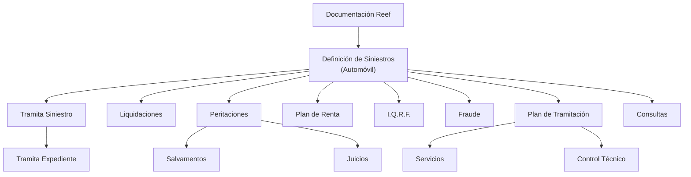

# Documentação Reef — Definições de Sinistros (Automóvel)

## 1. Metadados do Documento
- **Arquivo de Origem:** Não identificado no conteúdo fornecido
- **Tipo de Documento:** Documentação de definições de negócio
- **Domínio / Sistema:** Reef / Mapfre — Sinistros de Automóvel
- **Público-Alvo:** Não identificado; o conteúdo indica uso em documentação corporativa
- **Data/Versão Identificada:** Não identificada

---

## 2. Resumo Executivo & Contexto de Negócio

O conteúdo apresenta uma referência de documentação Reef relacionada à definição e aos tipos de negócio de sinistros de automóvel. A página identifica o tema como “DOCUMENTACIÓN de DEFINICIÓN de SINIESTROS (Automóvil)”.

A estrutura exibida organiza módulos e tópicos associados ao tratamento de sinistros, incluindo tramitação de sinistros e expedientes, liquidações, peritações, salvamentos, juízos, fraude, plano de tramitação, serviços, controle técnico e consultas.

A navegação apresentada associa a documentação ao ambiente corporativo Mapfre, com referências a “Mapfredocument”, “Documentación Reef”, “Zeus”, arquiteturas, APIs, componentes e cloud. Entretanto, o conteúdo não detalha integrações, responsabilidades técnicas, regras operacionais, contratos de API ou fluxos de dados.

A página também apresenta metadados de governança documental: o proprietário identificado é `agonzalez_mapfre.com`, e o ciclo de vida aparece como `Approved Source / VL`.

---

## 3. Arquitetura, Componentes & Tecnologias Envolvidas

### Componentes e tópicos identificados

| Componente / Tópico | Papel identificado no conteúdo | Detalhamento disponível |
| :--- | :--- | :--- |
| Reef | Sistema ou domínio associado à documentação | Não detalhado |
| Mapfredocument | Referência de documentação corporativa | Não detalhado |
| Sinistros (Automóvel) | Domínio principal da documentação | Associado a definições e tipo de negócio |
| Tramita Siniestro | Módulo ou tópico listado | Não detalhado |
| Tramita Expediente | Subtópico de Tramita Siniestro | Não detalhado |
| Liquidaciones | Módulo ou tópico listado | Não detalhado |
| Peritaciones | Módulo ou tópico listado | Não detalhado |
| Salvamentos | Subtópico de Peritaciones | Não detalhado |
| Juicios | Subtópico de Peritaciones | Não detalhado |
| Plan de Renta | Tópico listado | Não detalhado |
| I.Q.R.F. | Termo exibido junto de imagem | Não definido |
| Fraude | Tópico listado | Não detalhado |
| Plan de Tramitación | Módulo ou tópico listado | Não detalhado |
| Servicios | Subtópico de Plan de Tramitación | Não detalhado |
| Control Técnico | Subtópico de Plan de Tramitación | Não detalhado |
| Consultas | Tópico listado | Não detalhado |
| Zeus | Item de navegação documental | Não detalhado |
| APIs | Item de navegação documental | Não detalhado |
| Cloud | Item de navegação documental | Não detalhado |



> **Nota de Análise:** O diagrama representa a hierarquia visual dos tópicos listados no conteúdo. O documento não descreve chamadas técnicas, integração entre sistemas, protocolos, APIs, bancos de dados ou fluxo transacional entre os componentes.

---

## 4. Regras de Negócio, Especificações Funcionais & Processos

O conteúdo não apresenta regras de negócio explícitas, condições de validação, cálculos, estados de processo, responsáveis, métodos HTTP, contratos JSON ou procedimentos operacionais detalhados.

Os seguintes tópicos funcionais são listados como parte da documentação de sinistros de automóvel:

1. **Tramita Siniestro**, com referência a **Tramita Expediente**.
2. **Liquidaciones**.
3. **Peritaciones**, com referência a **Salvamentos** e **Juicios**.
4. **Plan de Renta**.
5. **I.Q.R.F.**.
6. **Fraude**.
7. **Plan de Tramitación**, com referência a **Servicios** e **Control Técnico**.
8. **Consultas**.

> **Nota de Análise:** A fonte apresenta somente uma taxonomia de módulos e assuntos. Não há detalhamento adicional que permita afirmar regras de elegibilidade, etapas obrigatórias, critérios de aprovação, cálculos de liquidação ou comportamento funcional de cada módulo.

---

## 5. Tabelas de Parâmetros, Ambientes e Estruturas de Dados

| Item / Parâmetro | Descrição / Função | Tipo / Valores / Formato | Ambiente / Observações |
| :--- | :--- | :--- | :--- |
| Owner | Proprietário exibido para a documentação | `user:agonzalez_mapfre.com` | Associado a “DOCUMENTACIÓN Reef” |
| Lifecycle | Estado de ciclo de vida exibido | `Approved Source / VL` | O significado de `VL` não é definido |
| Idioma | Idioma selecionado na navegação | `ES` | Interface exibida em espanhol |
| Domínio documental | Área de documentação | Reef | Também aparece como “Documentation / DOCUMENTACIÓN Reef” |
| Organização de referência | Marca ou contexto corporativo exibido | Mapfre / Mapfredocument | Relação técnica não detalhada |
| Navegação documental | Áreas de navegação listadas | Buscar, Inicio, Soluciones, Arquitecturas, APIs, Componentes, Cloud, Documentación, Zeus, Reef, Ayuda | Itens de interface; não são especificações técnicas |
| I.Q.R.F. | Termo exibido com imagem | `I.Q.R.F.` | Sigla não expandida no conteúdo |

> **Nota de Análise:** Não foram identificados URLs, endereços de servidores, portas, variáveis de ambiente, rotas de logs, schemas, estruturas de dados ou parâmetros de configuração.

---

## 6. Bateria de Perguntas & Respostas para RAG (FAQ Sintético)

### P1: Qual é o tema principal da documentação Reef apresentada?
**R:** A documentação está orientada à definição e aos tipos de negócio de sinistros de automóvel, identificada como “DOCUMENTACIÓN de DEFINICIÓN de SINIESTROS (Automóvil)”.

### P2: Quais módulos ou tópicos de sinistros são listados no documento?
**R:** O documento lista Tramita Siniestro, Tramita Expediente, Liquidaciones, Peritaciones, Salvamentos, Juicios, Plan de Renta, I.Q.R.F., Fraude, Plan de Tramitación, Servicios, Control Técnico e Consultas.

### P3: Qual tópico está associado a Tramita Siniestro na estrutura exibida?
**R:** O tópico Tramita Expediente aparece subordinado visualmente a Tramita Siniestro no conteúdo fornecido.

### P4: Quais assuntos aparecem relacionados a Peritaciones?
**R:** Salvamentos e Juicios aparecem subordinados visualmente a Peritaciones. O documento não descreve os processos ou regras desses assuntos.

### P5: O documento especifica regras de negócio para liquidações ou peritações?
**R:** Não. Liquidaciones e Peritaciones são somente listados como módulos ou tópicos. Não há regras de cálculo, validação, aprovação ou execução operacional detalhadas.

### P6: Há APIs, métodos HTTP ou contratos de integração descritos para Reef?
**R:** Não. “APIs” aparece apenas como item da navegação da interface. O conteúdo não informa endpoints, métodos HTTP, payloads, autenticação ou contratos de integração.

### P7: Quem é identificado como proprietário da documentação Reef?
**R:** O campo Owner exibe `user:agonzalez_mapfre.com`.

### P8: Qual é o estado de ciclo de vida exibido para a documentação?
**R:** O ciclo de vida exibido é `Approved Source / VL`. O texto não define o significado de `VL`.

### P9: O documento fornece URLs de ambientes, servidores ou caminhos de logs?
**R:** Não. Não há URLs, hosts, portas, ambientes técnicos ou caminhos de logs no conteúdo fornecido.

### P10: Qual é a relação documentada entre Reef e Mapfre?
**R:** O conteúdo apresenta referências a “DOCUMENTACIÓN Reef” e “Mapfredocument”, indicando um contexto documental corporativo associado a Mapfre. Não há explicação técnica adicional sobre a integração ou dependência entre Reef e Mapfre.

---

## 7. Glossário de Termos, Siglas & Conceitos-Chave

- **Reef:** Nome do domínio ou sistema associado à documentação. O conteúdo não fornece definição funcional ou técnica.
- **Sinistros (Automóvel):** Tema principal da documentação; refere-se ao domínio de sinistros de automóveis.
- **Tramita Siniestro:** Módulo ou tópico listado para tratamento de sinistros; comportamento não detalhado.
- **Tramita Expediente:** Tópico visualmente associado a Tramita Siniestro; significado operacional não detalhado.
- **Liquidaciones:** Módulo ou tópico listado; regras de liquidação não informadas.
- **Peritaciones:** Módulo ou tópico listado; processo de perícia não informado.
- **Salvamentos:** Tópico visualmente associado a Peritaciones; não detalhado.
- **Juicios:** Tópico visualmente associado a Peritaciones; não detalhado.
- **Plan de Renta:** Tópico listado; não detalhado.
- **I.Q.R.F.:** Sigla exibida no conteúdo, sem expansão ou definição.
- **Fraude:** Tópico listado; mecanismos de detecção ou tratamento não detalhados.
- **Plan de Tramitación:** Módulo ou tópico listado; não detalhado.
- **Servicios:** Tópico visualmente associado a Plan de Tramitación; não detalhado.
- **Control Técnico:** Tópico visualmente associado a Plan de Tramitación; não detalhado.
- **Consultas:** Tópico listado; tipos de consulta não especificados.
- **Zeus:** Item de navegação da documentação; não definido no conteúdo.
- **VL:** Código exibido no ciclo de vida `Approved Source / VL`; significado não definido.

---

## 8. Notas Críticas, Riscos & Limitações

- O conteúdo contém uma única página com uma estrutura resumida de tópicos e navegação documental.
- Não há detalhes sobre arquitetura de software, componentes implantáveis, tecnologias, ambientes, bancos de dados, APIs ou integrações.
- Não há regras de negócio operacionais para sinistros, expedientes, liquidações, peritações, fraude ou controle técnico.
- A sigla **I.Q.R.F.** é apresentada sem definição.
- O valor **VL**, apresentado no ciclo de vida documental, não possui explicação no conteúdo.
- A hierarquia entre tópicos foi preservada conforme a disposição visual, mas a fonte não descreve relações de execução, dependência ou fluxo de dados entre os módulos.

---

## 9. Conteúdo Bruto Estruturado (Referência Fiel)

```text
--- [PÁGINA 1 DE 1] ---

DOCUMENTACIÓN de DEFINICIÓN de SINIESTROS (Automóvil)
Documentación orientada a la denición y tipo de negocio

DEFINICIONES-MÓDULOS
 TRAMITA SINIESTRO
  TRAMITA EXPEDIENTE
  LIQUIDACIONES
 PERITACIONES
  SALVAMENTOS
  JUICIOS
 PLAN DE RENTA

Imagen I.Q.R.F. I.Q.R.F.

 FRAUDE
 PLAN DE TRAMITACIÓN
  SERVICIOS
  CONTROL TÉCNICO
 CONSULTAS

Documentation / DOCUMENTACIÓN Reef
DOCUMENTACIÓN Reef

Mapfredocument
DOCUMENTACIÓN Reef

Owner
user:agonzalez_mapfre.com

Lifecycle
Approved Source
 /
 VL

Buscar Inicio Soluciones Arquitecturas APIs Componentes Cloud Documentación Zeus Reef Ayuda
ES
```
