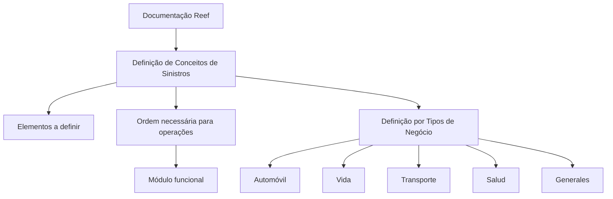

# Documentação Reef — Definição de Conceitos de Sinistros por Tipo de Negócio

## 1. Metadados do Documento
- **Arquivo de Origem:** `Não identificado no conteúdo extraído`
- **Tipo de Documento:** `Documentação funcional`
- **Domínio / Sistema:** `Reef / Siniestros / Mapfre`
- **Público-Alvo:** `Não identificado explicitamente; conteúdo direcionado à documentação de um módulo funcional`
- **Data/Versão Identificada:** `Não identificada`

---

## 2. Resumo Executivo & Contexto de Negócio

O conteúdo apresenta uma documentação Reef relacionada à **definição de conceitos de sinistros** (`Siniestros`). O objetivo declarado é definir os elementos e a ordem necessária para executar operações em um módulo funcional.

A documentação classifica a definição por tipos de negócio. Os tipos explicitamente listados são: **Automóvil**, **Vida**, **Transporte**, **Salud** e **Generales**.

O material contém referências institucionais e de navegação para **Documentation / DOCUMENTACIÓN Reef**, **Mapfredocument** e uma interface documental com itens como Soluciones, Arquitecturas, APIs, Componentes, Cloud, Documentación, Zeus, Reef e Ayuda.

Não há detalhamento técnico sobre contratos de API, infraestrutura, bancos de dados, métodos HTTP, modelos de dados, regras de cálculo ou procedimentos operacionais específicos. O documento também não fornece a sequência concreta das operações do módulo funcional.

---

## 3. Arquitetura, Componentes & Tecnologias Envolvidas

Os elementos explicitamente identificados são:

| Componente / Termo | Papel identificado no conteúdo |
| :--- | :--- |
| Reef | Sistema ou domínio documental mencionado no título e na navegação. |
| Siniestros | Domínio funcional referente à definição de conceitos. |
| Módulo funcional | Módulo no qual operações devem ser realizadas seguindo uma ordem necessária. |
| Mapfredocument | Referência documental exibida no conteúdo. |
| Zeus | Item disponível na navegação da documentação. |
| Soluciones | Item de navegação da documentação. |
| Arquitecturas | Item de navegação da documentação. |
| APIs | Item de navegação da documentação. |
| Componentes | Item de navegação da documentação. |
| Cloud | Item de navegação da documentação. |
| Documentación | Item de navegação da documentação. |



> **Nota de Análise:** O conteúdo não descreve uma arquitetura de software, integração entre componentes, tecnologias de implementação, ambientes ou fluxos técnicos. O diagrama representa somente a organização funcional explicitamente indicada.

---

## 4. Regras de Negócio, Especificações Funcionais & Processos

1. O documento estabelece que existem **elementos que devem ser definidos**.
2. O documento estabelece que há uma **ordem necessária a seguir**.
3. A finalidade da definição dos elementos e da ordem é permitir a realização de **operações com um módulo funcional**.
4. A definição de conceitos de sinistros é organizada por **tipos de negócio**.
5. Os tipos de negócio listados são:
   - Automóvil;
   - Vida;
   - Transporte;
   - Salud;
   - Generales.

> **Nota de Análise:** O documento afirma que existe uma ordem necessária, mas não apresenta as etapas dessa ordem, critérios de execução, responsáveis, condições de entrada, condições de saída ou exceções operacionais.

> **Nota de Análise:** O conteúdo não detalha quais são os elementos de sinistros que precisam ser definidos para cada tipo de negócio.

---

## 5. Tabelas de Parâmetros, Ambientes e Estruturas de Dados

| Item / Parâmetro | Descrição / Função | Tipo / Valores / Formato | Ambiente / Observações |
| :--- | :--- | :--- | :--- |
| Domínio funcional | Área abordada pela documentação. | Siniestros | Associado à documentação Reef. |
| Objetivo da definição | Permitir operações em módulo funcional. | Definição de elementos e ordem necessária | A sequência operacional não é detalhada. |
| Tipo de negócio | Classificação da definição de conceitos. | Automóvil | Sem regras adicionais descritas. |
| Tipo de negócio | Classificação da definição de conceitos. | Vida | Sem regras adicionais descritas. |
| Tipo de negócio | Classificação da definição de conceitos. | Transporte | Sem regras adicionais descritas. |
| Tipo de negócio | Classificação da definição de conceitos. | Salud | Sem regras adicionais descritas. |
| Tipo de negócio | Classificação da definição de conceitos. | Generales | Sem regras adicionais descritas. |
| Owner | Proprietário exibido no conteúdo documental. | `user:agonzalez_mapfre.com` | Valor reproduzido literalmente da extração. |
| Lifecycle | Estado de ciclo de vida exibido. | `Approved Source` | Relação exata com outros campos não detalhada. |
| Navegação | Opções da interface documental. | Buscar, Inicio, Soluciones, Arquitecturas, APIs, Componentes, Cloud, Documentación, Zeus, Reef, Ayuda | Idioma exibido: `ES`. |

---

## 6. Bateria de Perguntas & Respostas para RAG (FAQ Sintético)

### P1: Qual é o objetivo da documentação Reef sobre definição de conceitos de sinistros?
**R:** O objetivo indicado é definir os elementos e a ordem necessária para que seja possível realizar operações com um módulo funcional.

### P2: Quais tipos de negócio são mencionados na definição de conceitos de sinistros?
**R:** O documento lista cinco tipos de negócio: Automóvil, Vida, Transporte, Salud e Generales.

### P3: O documento descreve quais elementos de sinistros devem ser definidos?
**R:** Não. O documento afirma que há elementos que devem ser definidos, mas não identifica ou detalha esses elementos no conteúdo extraído.

### P4: O documento apresenta a sequência operacional necessária para o módulo funcional?
**R:** Não. O conteúdo informa que existe uma ordem necessária a seguir, mas não descreve as etapas, dependências, validações ou exceções dessa sequência.

### P5: Existe detalhamento de APIs ou contratos de integração da solução Reef?
**R:** Não. Embora “APIs” apareça como item de navegação documental, o conteúdo não apresenta endpoints, métodos HTTP, contratos JSON, autenticação ou integrações técnicas.

### P6: Qual sistema ou domínio é citado como contexto da documentação?
**R:** O documento menciona Documentation Reef, DOCUMENTACIÓN Reef e Reef. Também cita o domínio funcional de Siniestros e a referência Mapfredocument.

### P7: Quem é o owner identificado no conteúdo extraído?
**R:** O campo Owner apresenta o valor literal `user:agonzalez_mapfre.com`.

### P8: Qual é o estado de ciclo de vida exibido na documentação?
**R:** O campo Lifecycle apresenta o valor `Approved Source`. O documento não explica o significado operacional desse estado.

### P9: Há informações sobre ambientes, servidores, URLs ou portas?
**R:** Não. O conteúdo extraído não apresenta URLs de ambientes, endereços de servidores, portas, variáveis de configuração ou caminhos de logs.

### P10: A documentação define regras específicas para Automóvil, Vida, Transporte, Salud ou Generales?
**R:** Não. Os cinco tipos de negócio são apenas listados; não há regras, parâmetros ou diferenças funcionais detalhadas para cada categoria.

---

## 7. Glossário de Termos, Siglas & Conceitos-Chave

- **Reef:** Nome do sistema, domínio ou conjunto documental mencionado como “Documentation Reef” e “DOCUMENTACIÓN Reef”.
- **Siniestros:** Termo em espanhol usado no documento para o domínio de sinistros.
- **Módulo funcional:** Módulo no qual devem ser realizadas operações após a definição de elementos e de uma ordem necessária.
- **Automóvil:** Tipo de negócio listado na definição de conceitos de sinistros.
- **Vida:** Tipo de negócio listado na definição de conceitos de sinistros.
- **Transporte:** Tipo de negócio listado na definição de conceitos de sinistros.
- **Salud:** Tipo de negócio listado na definição de conceitos de sinistros.
- **Generales:** Tipo de negócio listado na definição de conceitos de sinistros.
- **Mapfredocument:** Referência documental exibida no conteúdo.
- **Zeus:** Item de navegação mencionado na interface documental.
- **Lifecycle:** Campo de ciclo de vida exibido com o valor `Approved Source`.
- **Owner:** Campo de propriedade exibido com o valor `user:agonzalez_mapfre.com`.

---

## 8. Notas Críticas, Riscos & Limitações

- O conteúdo é extremamente resumido e não apresenta detalhamento suficiente para implementar operações no módulo funcional.
- A ordem necessária para operações é mencionada, mas não é descrita.
- Os elementos que devem ser definidos não são identificados.
- Os tipos de negócio não possuem regras funcionais individualizadas no material extraído.
- Não há informação sobre arquitetura de software, integrações, APIs, modelos de dados, autenticação, segurança, ambientes, logs ou observabilidade.
- Há caracteres aparentemente corrompidos na extração, como em `denir` e `n`, que provavelmente correspondem a palavras em espanhol com caracteres não preservados.
- O valor do campo Owner é reproduzido literalmente por fidelidade documental; o documento não descreve sua finalidade ou responsabilidade associada.

---

## 9. Conteúdo Bruto Estruturado (Referência Fiel)

```text
--- [PÁGINA 1 DE 1] ---

DEFINICIÓN de CONCEPTOS de Siniestros
Elementos que se han de denir así como el orden necesario a seguir con el n de poder realizar operaciones con un módulo funcional.
DEFINICIÓN POR TIPOS DE NEGOCIO
 AUTOMÓVIL
  VIDA
  TRANSPORTE
 SALUD
  GENERALES
Documentation / DOCUMENTACIÓN Reef
DOCUMENTACIÓN Reef
Mapfredocument
DOCUMENTACIÓN Reef
Owner
user:agonzalez_mapfre.com
Lifecycle
Approved Source
 / 
 VL
Buscar Inicio Soluciones Arquitecturas APIs Componentes Cloud Documentación Zeus Reef Ayuda
ES
```
