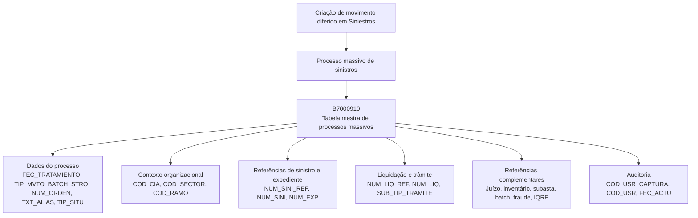

# Criar Movimento Diferido em Sinistros — Visão Técnica e Modelo de Dados B7000910

## 1. Metadados do Documento
- **Arquivo de Origem:** `Não identificado no conteúdo fornecido`
- **Tipo de Documento:** `Especificação Técnica`
- **Domínio / Sistema:** `Reef / Mapfre / Siniestros`
- **Público-Alvo:** `Desenvolvedores, Arquitetos, Operação`
- **Data/Versão Identificada:** `Não identificada`
- **Ciclo de Vida Identificado:** `Approved Source`
- **Proprietário Identificado:** `user:agonzalez_mapfre.com`

---

## 2. Resumo Executivo & Contexto de Negócio

O documento descreve, sob o título “Crear movimiento diferido en Siniestros (visión técnica)”, o modelo de dados envolvido na criação de movimentos diferidos no domínio de sinistros. O foco explícito está na tabela `B7000910`, identificada como a tabela mestra de processos massivos de sinistros.

A especificação apresenta os campos da tabela `B7000910`, indicando para cada coluna se seu valor pode mudar, se o preenchimento é obrigatório e qual é o significado funcional declarado. Os dados abrangem identificação do processo massivo, companhia, setor, ramo, sinistro, expediente, liquidação, trâmite, juízo, inventário, subasta, processos batch, fraude, IQRF e dados de auditoria de usuários e datas.

O campo `TIP_SITU` é apresentado como indicador de situação da linha, com o valor `1-Sin Procesar`. O documento não detalha outros valores possíveis para `TIP_SITU`, transições de estado ou critérios de processamento posterior.

A documentação está associada ao ambiente documental Reef / Mapfre e possui estado “Approved Source”. Não são informados métodos HTTP, contratos de integração, tecnologias de implementação, sequências de execução, regras de cálculo ou mecanismos de tratamento de erro.

---

## 3. Arquitetura, Componentes & Tecnologias Envolvidas

### Componentes e elementos identificados

| Componente / Elemento | Papel descrito |
| :--- | :--- |
| `Reef` | Contexto de documentação identificado como “DOCUMENTACIÓN Reef”. |
| `Mapfre` | Contexto corporativo identificado por “Mapfredocument”. |
| `Siniestros` | Domínio funcional no qual ocorre a criação do movimento diferido. |
| `B7000910` | Tabela mestra de processos massivos de sinistros. |
| Processo massivo de sinistros | Processo associado aos campos de data de tratamento, tipo de movimento batch, número de ordem e situação. |
| Processo batch | Referenciado por `TIP_MVTO_BATCH_STRO`, `COD_BATCH_REF` e `IDN_BATCH`. |
| IQRF | Entidade ou identificador referenciado pelos campos `IDN_IQRF` e `IDN_IQRF_REF`; o documento não expande a sigla. |
| Fraude | Entidade ou identificador referenciado por `IDN_FRAUDE` e `IDN_FRAUDE_REF`. |



> **Nota de Análise:** O documento identifica a tabela `B7000910`, mas não detalha serviços, APIs, bancos de dados, tecnologias, protocolos de integração ou contratos de dados associados à criação do movimento diferido.

---

## 4. Regras de Negócio, Especificações Funcionais & Processos

### Processo identificado

1. O documento trata da criação de um movimento diferido no domínio de `Siniestros`.
2. A operação envolve a tabela `B7000910`, denominada “MAESTRA PROCESOS MASIVO DE SINIESTROS”.
3. Cada linha de `B7000910` representa um registro relacionado a um processo massivo de sinistros.
4. `FEC_TRATAMIENTO` é obrigatório e representa a data em que é realizado o processo massivo.
5. `TIP_MVTO_BATCH_STRO` é obrigatório e representa o tipo do movimento batch.
6. `NUM_ORDEN` é obrigatório e representa o número do processo massivo.
7. `TXT_ALIAS` não é obrigatório e representa o nome que se deseja atribuir ao processo.
8. `TIP_SITU` é obrigatório e representa a situação em que a linha se encontra. O valor apresentado é `1-Sin Procesar`.
9. `COD_CIA`, `COD_SECTOR` e `COD_RAMO` são obrigatórios e representam, respectivamente, companhia, setor e ramo.
10. São obrigatórios os dados de sinistro de referência, sinistro e número de expediente: `NUM_SINI_REF`, `NUM_SINI` e `NUM_EXP`.
11. São obrigatórios os dados de liquidação de referência, liquidação e subtipo de trâmite: `NUM_LIQ_REF`, `NUM_LIQ` e `SUB_TIP_TRAMITE`.
12. Os dados de juízo, inventário, subasta, batch, fraude e IQRF apresentados são opcionais.
13. Os campos de auditoria `COD_USR_CAPTURA`, `COD_USR` e `FEC_ACTU` são obrigatórios.
14. O documento não descreve validações de formato, tamanhos, chaves, relacionamentos referenciais, regras de unicidade, regras de atualização ou regras de exclusão.

---

## 5. Tabelas de Parâmetros, Ambientes e Estruturas de Dados

### Tabela `B7000910` — Mestra de Processos Massivos de Sinistros

| Item / Parâmetro | Descrição / Função | Tipo / Valores / Formato | Ambiente / Observações |
| :--- | :--- | :--- | :--- |
| `B7000910` | Tabela mestra de processos massivos de sinistros. | Não informado. | Domínio Siniestros. |
| `FEC_TRATAMIENTO` | Data em que é realizado o processo massivo. | Valor: `N.A.`; obrigatório: `Sí`; muda: `Sí`. | Campo de tratamento do processo massivo. |
| `TIP_MVTO_BATCH_STRO` | Tipo do movimento batch. | Valor: `N.A.`; obrigatório: `Sí`; muda: `Sí`. | Associado ao movimento batch de sinistros. |
| `NUM_ORDEN` | Número do processo massivo. | Valor: `N.A.`; obrigatório: `Sí`; muda: `Sí`. | Identificador de ordem do processo. |
| `TXT_ALIAS` | Nome que se deseja atribuir ao processo. | Valor: `N.A.`; obrigatório: `No`; muda: `Sí`. | Alias opcional do processo. |
| `TIP_SITU` | Situação em que a linha se encontra. | Valor: `1-Sin Procesar`; obrigatório: `Sí`; muda: `Sí`. | O documento informa somente o valor `1-Sin Procesar`. |
| `COD_CIA` | Companhia. | Valor: `N.A.`; obrigatório: `Sí`; muda: `Sí`. | Contexto organizacional. |
| `COD_SECTOR` | Setor. | Valor: `N.A.`; obrigatório: `Sí`; muda: `Sí`. | Contexto organizacional. |
| `COD_RAMO` | Ramo. | Valor: `N.A.`; obrigatório: `Sí`; muda: `Sí`. | Contexto organizacional. |
| `NUM_SINI_REF` | Sinistro de referência de outros sistemas. | Valor: `N.A.`; obrigatório: `Sí`; muda: `Sí`. | Referência externa de sinistro. |
| `NUM_SINI` | Sinistro. | Valor: `N.A.`; obrigatório: `Sí`; muda: `Sí`. | Identificação de sinistro. |
| `NUM_EXP` | Número de expediente. | Valor: `N.A.`; obrigatório: `Sí`; muda: `Sí`. | Identificação de expediente. |
| `NUM_LIQ_REF` | Número de liquidação de referência. | Valor: `N.A.`; obrigatório: `Sí`; muda: `Sí`. | Referência de liquidação. |
| `NUM_LIQ` | Número de liquidação. | Valor: `N.A.`; obrigatório: `Sí`; muda: `Sí`. | Identificação de liquidação. |
| `SUB_TIP_TRAMITE` | Tipo de trâmite. | Valor: `N.A.`; obrigatório: `Sí`; muda: `Sí`. | Subtipo/tipo de trâmite conforme descrição original. |
| `NUM_JUICIO_REF` | Número do juízo de referência. | Valor: `N.A.`; obrigatório: `No`; muda: `Sí`. | Campo opcional. |
| `NUM_JUICIO` | Número do juízo. | Valor: `N.A.`; obrigatório: `No`; muda: `Sí`. | Campo opcional. |
| `COD_INVENTARIO_REF` | Inventário de referência. | Valor: `N.A.`; obrigatório: `No`; muda: `Sí`. | Campo opcional. |
| `COD_INVENTARIO` | Número de inventário. | Valor: `N.A.`; obrigatório: `No`; muda: `Sí`. | Campo opcional. |
| `COD_SUBASTA_REF` | Código de subasta de referência. | Valor: `N.A.`; obrigatório: `No`; muda: `Sí`. | Campo opcional. |
| `COD_SUBASTA` | Subasta. | Valor: `N.A.`; obrigatório: `No`; muda: `Sí`. | Campo opcional. |
| `COD_BATCH_REF` | Código de referência para processos batch. | Valor: `N.A.`; obrigatório: `No`; muda: `Sí`. | Campo opcional. |
| `IDN_BATCH` | Identificador batch. | Valor: `N.A.`; obrigatório: `No`; muda: `Sí`. | Campo opcional. |
| `NUM_SQN_VAL` | Sequência. | Valor: `N.A.`; obrigatório: `No`; muda: `Sí`. | Campo opcional. |
| `IDN_FRAUDE` | Identificador de fraude. | Valor: `N.A.`; obrigatório: `No`; muda: `Sí`. | Campo opcional. |
| `IDN_FRAUDE_REF` | Referência de identificador de fraude. | Valor: `N.A.`; obrigatório: `No`; muda: `Sí`. | Campo opcional. |
| `IDN_IQRF` | Identificador IQRF. | Valor: `N.A.`; obrigatório: `No`; muda: `Sí`. | Campo opcional; a sigla IQRF não é definida. |
| `IDN_IQRF_REF` | Referência de identificador IQRF. | Valor: `N.A.`; obrigatório: `No`; muda: `Sí`. | Campo opcional; a sigla IQRF não é definida. |
| `COD_USR_CAPTURA` | Usuário que simula a captura. | Valor: `N.A.`; obrigatório: `Sí`; muda: `Sí`. | Auditoria de captura. |
| `COD_USR` | Usuário que atualizou a linha. | Valor: `N.A.`; obrigatório: `Sí`; muda: `Sí`. | Auditoria de atualização. |
| `FEC_ACTU` | Data de atualização da linha. | Valor: `N.A.`; obrigatório: `Sí`; muda: `Sí`. | Auditoria temporal da atualização. |

---

## 6. Bateria de Perguntas & Respostas para RAG (FAQ Sintético)

### P1: Qual tabela está envolvida na criação de movimento diferido em Siniestros?
**R:** A tabela envolvida é `B7000910`, descrita como “MAESTRA PROCESOS MASIVO DE SINIESTROS”. O documento apresenta essa tabela como o modelo de dados utilizado na operação de criação de movimento diferido em sinistros.

### P2: Qual é a situação inicial indicada para uma linha na tabela B7000910?
**R:** O campo `TIP_SITU` possui o valor indicado `1-Sin Procesar` e é obrigatório. O documento o define como a situação em que a linha se encontra, mas não informa outros estados possíveis nem regras de transição.

### P3: Quais campos obrigatórios identificam o processo massivo de sinistros?
**R:** Os campos obrigatórios relacionados ao processo massivo são `FEC_TRATAMIENTO`, que registra a data de realização do processo massivo; `TIP_MVTO_BATCH_STRO`, que informa o tipo de movimento batch; e `NUM_ORDEN`, que representa o número do processo massivo.

### P4: O alias do processo massivo é obrigatório?
**R:** Não. O campo `TXT_ALIAS` é marcado como não obrigatório. Sua finalidade é armazenar o nome que se deseja atribuir ao processo.

### P5: Quais informações organizacionais são obrigatórias em B7000910?
**R:** Os campos obrigatórios de contexto organizacional são `COD_CIA` para companhia, `COD_SECTOR` para setor e `COD_RAMO` para ramo.

### P6: Quais dados de sinistro e expediente são obrigatórios?
**R:** São obrigatórios `NUM_SINI_REF`, definido como sinistro de referência de outros sistemas; `NUM_SINI`, definido como sinistro; e `NUM_EXP`, definido como número de expediente.

### P7: Quais informações de liquidação e trâmite devem ser preenchidas obrigatoriamente?
**R:** Os campos obrigatórios são `NUM_LIQ_REF`, correspondente ao número de liquidação de referência; `NUM_LIQ`, correspondente ao número de liquidação; e `SUB_TIP_TRAMITE`, definido no documento como tipo de trâmite.

### P8: Os campos de juízo são obrigatórios para o processo massivo?
**R:** Não. `NUM_JUICIO_REF`, para número do juízo de referência, e `NUM_JUICIO`, para número do juízo, são ambos campos não obrigatórios.

### P9: Quais campos opcionais tratam inventário e subasta?
**R:** Os campos opcionais são `COD_INVENTARIO_REF` para inventário de referência, `COD_INVENTARIO` para número de inventário, `COD_SUBASTA_REF` para código de subasta de referência e `COD_SUBASTA` para subasta.

### P10: Como a tabela B7000910 registra referências de processos batch?
**R:** A tabela possui `COD_BATCH_REF`, definido como código de referência para processos batch, e `IDN_BATCH`, definido como identificador batch. Ambos são não obrigatórios.

### P11: Quais campos opcionais são destinados a fraude e IQRF?
**R:** Para fraude, a tabela possui `IDN_FRAUDE` e `IDN_FRAUDE_REF`. Para IQRF, possui `IDN_IQRF` e `IDN_IQRF_REF`. Todos são não obrigatórios. O documento não define o significado da sigla IQRF nem descreve relações entre esses campos.

### P12: Quais campos de auditoria são obrigatórios em B7000910?
**R:** Os campos obrigatórios de auditoria são `COD_USR_CAPTURA`, que registra o usuário que simula a captura; `COD_USR`, que registra o usuário que atualizou a linha; e `FEC_ACTU`, que registra a data de atualização da linha.

---

## 7. Glossário de Termos, Siglas & Conceitos-Chave

- **B7000910:** Tabela mestra de processos massivos de sinistros.
- **Batch:** Termo utilizado nos campos relacionados a movimento batch, código de referência batch e identificador batch. O documento não apresenta definição adicional.
- **COD_CIA:** Código de companhia.
- **COD_RAMO:** Código de ramo.
- **COD_SECTOR:** Código de setor.
- **FEC_ACTU:** Data de atualização da linha.
- **FEC_TRATAMIENTO:** Data em que é realizado o processo massivo.
- **IDN_BATCH:** Identificador batch.
- **IDN_FRAUDE:** Identificador de fraude.
- **IDN_FRAUDE_REF:** Referência de identificador de fraude.
- **IDN_IQRF:** Identificador IQRF.
- **IDN_IQRF_REF:** Referência de identificador IQRF.
- **IQRF:** Sigla presente no documento, sem significado expandido.
- **NUM_EXP:** Número de expediente.
- **NUM_LIQ:** Número de liquidação.
- **NUM_LIQ_REF:** Número de liquidação de referência.
- **NUM_ORDEN:** Número do processo massivo.
- **NUM_SINI:** Sinistro.
- **NUM_SINI_REF:** Sinistro de referência de outros sistemas.
- **NUM_SQN_VAL:** Sequência.
- **Siniestros:** Domínio de sinistros referido pelo documento.
- **Subasta:** Termo presente nos campos `COD_SUBASTA` e `COD_SUBASTA_REF`; não é detalhado no documento.
- **TIP_MVTO_BATCH_STRO:** Tipo do movimento batch.
- **TIP_SITU:** Situação em que a linha se encontra.
- **TXT_ALIAS:** Nome atribuído ao processo.

---

## 8. Notas Críticas, Riscos & Limitações

- O documento contém exclusivamente a estrutura de campos da tabela `B7000910` e suas características de obrigatoriedade, alteração e descrição.
- Não são informados tipos físicos de dados, tamanhos máximos, precisão, nulabilidade técnica, chaves primárias, chaves estrangeiras ou índices.
- A coluna “CAMBIA” indica `Sí` para todos os campos apresentados, mas o documento não define quando cada alteração é permitida ou quais perfis podem realizá-la.
- `TIP_SITU` apresenta somente o valor `1-Sin Procesar`; não há catálogo completo de estados, máquina de estados ou regras de transição.
- O documento não especifica APIs, métodos HTTP, mensagens, eventos, filas, serviços, jobs, procedimentos armazenados ou contratos JSON.
- A sigla `IQRF` não é expandida nem contextualizada.
- Não há informação sobre ambientes, URLs, servidores, credenciais, logs, observabilidade, tratamento de falhas, reprocessamento ou reconciliação.
- Não são detalhados os critérios de associação entre sinistro, expediente, liquidação, juízo, inventário, subasta, fraude e batch.

---

## 9. Conteúdo Bruto Estruturado (Referência Fiel)

```text
--- [PÁGINA 1 DE 2] ---

EN CONSTRUCCIÓN
CREAR movimiento diferido en Siniestros (visión técnica)
Modelo de datos involucrado
Las tablas que intervienen en esta operación son:
B7000910
TABLA DESCRIPCIÓN
B7000910 MAESTRA PROCESOS MASIVO DE SINIESTROS
COLUMNA CAMBIA
VALOR
MOTIVO/VALOR OBLIGATORIA COMENTARIO
FEC_TRATAMIENTO S N.A. SI FECHA EN LA QUE SE REALIZA EL
PROCESO MASIVO
TIP_MVTO_BATCH_STRO S N.A. SI TIPO DEL MOVIMIENTO BATCH
NUM_ORDEN S N.A. SI NUMERO DEL PROCESO MASIVO
TXT_ALIAS S N.A. NO NOMBRE QUE SE QUIERA DAR AL
PROCESO
TIP_SITU S 1-Sin Procesar SI SITUACION EN LA QUE SE ENCUENTRA LA
FILA
COD_CIA S N.A. SI COMPANIA
COD_SECTOR S N.A. SI SECTOR
COD_RAMO S N.A. SI RAMO
Documentation / DOCUMENTACIÓN Reef
DOCUMENTACIÓN Reef
Mapfredocument
DOCUMENTACIÓN Reef
Owner
user:agonzalez_mapfre.com
Lifecycle
Approved Source
 /
VL
Buscar Inicio Soluciones Arquitecturas APIs Componentes Cloud Documentación Zeus Reef Ayuda
ES


--- [PÁGINA 2 DE 2] ---

COLUMNA CAMBIA
VALOR
MOTIVO/VALOR OBLIGATORIA COMENTARIO
NUM_SINI_REF S N.A. SI SINIESTRO REFERENCIA DE OTROS
SISTEMAS.
NUM_SINI S N.A. SI SINIESTRO
NUM_EXP S N.A. SI NUMERO DE EXPEDIENTE
NUM_LIQ_REF S N.A. SI NUMERO DE LIQUIDACION DE
REFERENCIA
NUM_LIQ S N.A. SI NUMERO DE LIQUIDACION
SUB_TIP_TRAMITE S N.A. SI TIPO DE TRAMITE
NUM_JUICIO_REF S N.A. NO NUMERO DEL JUICIO DE REFERENCIA
NUM_JUICIO S N.A. NO NUMERO DEL JUICIO
COD_INVENTARIO_REF S N.A. NO INVENTARIO DE REFERENCIA
COD_INVENTARIO S N.A. NO NUMERO DE INVENTARIO
COD_SUBASTA_REF S N.A. NO CODIGO DE SUBASTA DE REFERENCIA
COD_SUBASTA S N.A. NO SUBASTA
COD_BATCH_REF S N.A. NO CODIGO DE REFERENCIA PARA
PROCESOS BATCH
IDN_BATCH S N.A. NO IDENTIFICADOR BATCH
NUM_SQN_VAL S N.A. NO SECUENCIA
IDN_FRAUDE S N.A. NO IDENTIFICADOR DE FRAUDE
IDN_FRAUDE_REF S N.A. NO REFERENCIA DE IDENTIFICADOR DE
FRAUDE
IDN_IQRF S N.A. NO IDENTIFICADOR IQRF
IDN_IQRF_REF S N.A. NO REFERENCIA DE IDENTIFICADOR IQRF
COD_USR_CAPTURA S N.A. SI USUARIO QUE SIMULA LA CAPTURA
COD_USR S N.A. SI USUARIO QUE ACTUALIZO LA FILA
FEC_ACTU S N.A. SI FECHA DE ACTUALIZACION DE LA FILA
```
