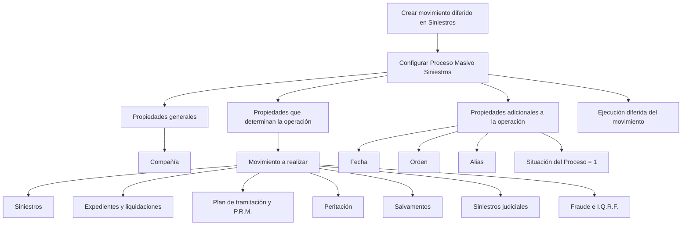

# Criação de Movimento Diferido em Siniestros — Processo Massivo no REEF

## 1. Metadados do Documento
- **Arquivo de Origem:** Não identificado no conteúdo extraído
- **Tipo de Documento:** Procedimento / documentação funcional
- **Domínio / Sistema:** Reef / Mapfre — Siniestros, Expedientes e Processos Massivos
- **Público-Alvo:** Desenvolvedores, analistas funcionais e operação
- **Data/Versão Identificada:** Não identificada

---

## 2. Resumo Executivo & Contexto de Negócio

O documento descreve a ação **“Crear movimiento diferido en Siniestros”**, apresentada como o primeiro passo obrigatório para criar um processo massivo de Siniestros. A finalidade dessa ação é gerar as informações necessárias para que um movimento seja executado de forma diferida.

O processo massivo é configurado por propriedades gerais, propriedades que determinam a operação e propriedades adicionais. A propriedade geral identificada é a **Compañía**, entidade na qual a operação diferida será lançada. A seleção do movimento define a operação de negócio que será executada posteriormente.

O catálogo funcional contém movimentos para Siniestros, Expedientes, liquidações, planos de renda mensal, peritação, salvamentos, siniestros judiciais, fraude e I.Q.R.F. Alguns movimentos disparam uma única operação; outros podem gerar múltiplas operações, como criação ou alteração conforme a existência prévia de dados.

A execução é contextualizada por uma **Fecha del Proceso Masivo**, uma **Orden** para diferenciar processos criados na mesma data, um **Alias** descritivo e uma **Situación del Proceso**. Durante a criação, a situação deve conter o valor `'1'`, que indica que o processo ainda não foi processado.

O documento não descreve interfaces técnicas, APIs, contratos JSON, métodos HTTP, agendamento, persistência, mecanismos de autenticação ou tratamento de erros. O foco é funcional: identificação dos tipos de movimento e das operações de negócio associadas.

---

## 3. Arquitetura, Componentes & Tecnologias Envolvidas

### Componentes e conceitos identificados

| Componente / Conceito | Papel descrito |
| :--- | :--- |
| Reef | Área de documentação citada no conteúdo extraído. |
| Mapfre | Contexto corporativo citado pela navegação e pelo domínio documental. |
| Siniestros | Domínio de sinistros no qual são configurados movimentos diferidos e processos massivos. |
| Proceso Masivo Siniestros | Processo configurável e executado de forma diferida. |
| Movimiento a realizar | Propriedade que define a operação funcional a executar no processo massivo. |
| Compañía | Entidade na qual a operação diferida será lançada. |
| Expediente | Entidade relacionada a operações de abertura, alteração, terminação, reabilitação, valoração, liquidação e tramitação. |
| Plan de tramitación | Estrutura de tramitação do expediente, contemplando avisos, anotações, níveis e trâmites. |
| Plan de Renta Mensual (P.R.M.) | Plano associado a um expediente, com operações de criação, anulação e terminação. |
| Peritación | Domínio com solicitação, resultado, detalhe de danos e ordens de reparação. |
| Salvamentos | Domínio de inventário, subasta, associação, anulação, liberação e venda. |
| Siniestros judiciales | Domínio de demanda, sentença, intervenção e associação a expediente. |
| Fraude | Registro de fraude para sinistro ou expediente. |
| I.Q.R.F. | Entidade citada em operações de criação e modificação para sinistro e expediente; o significado da sigla não é detalhado. |



> **Nota de Análise:** O documento apresenta o fluxo funcional de configuração do processo massivo, mas não identifica microsserviços, banco de dados, filas, APIs, URLs, ambientes, portas ou tecnologias de implementação.

---

## 4. Regras de Negócio, Especificações Funcionais & Processos

### Fluxo obrigatório para criação do processo massivo

1. Criar um movimento diferido em Siniestros.
2. Informar a **Compañía**, entidade na qual a operação diferida será lançada.
3. Selecionar o **Movimiento a realizar**, que determina a operação executada de forma diferida.
4. Informar a **Fecha del Proceso Masivo**.
5. Informar a **Orden** para distinguir processos criados na mesma data.
6. Informar um **Alias** descritivo quando for necessário identificar concretamente o processo massivo.
7. Definir a **Situación del Proceso** com o valor `'1'` no momento da criação, indicando que o processo não foi processado.

### Regras funcionais por tipo de movimento

- Os movimentos **10**, **11**, **12** e **14** tratam o ciclo de vida de um sinistro: abertura, modificação, terminação e reabilitação.
- O movimento **12 — Terminación de Siniestro** termina somente sinistros que não possuam expedientes.
- O movimento **14 — Rehabilitación de Siniestro** reabilita um sinistro terminado para permitir a inclusão de um novo expediente.
- Os movimentos **20** e **21** abrem um expediente com valoração média, mas o movimento 20 é explicitamente originado do Batch de Siniestros.
- Os movimentos **31** e **32** somente podem modificar ou anular uma liquidação e ordem de pagamento quando a liquidação não estiver paga.
- O movimento **33** gera uma liquidação quando o expediente está terminado.
- Os movimentos **60**, **61**, **62**, **71**, **72**, **80** e **81** possuem comportamento condicional de criação ou modificação conforme a existência prévia da informação.
- O movimento **73** associa sinistro ou expediente a inventário e inventário a subasta.
- O movimento **75** anula um inventário que não pôde ser vendido e não poderá ser vendido.
- O movimento **76** libera um inventário de uma subasta e o deixa pendente para associação a outra subasta.
- O movimento **77** atualiza uma subasta e marca o inventário como vendido, atualizando os dados da venda.
- O texto do movimento **115 — Crear I.Q.R.F. Siniestro** afirma que gera uma modificação de I.Q.R.F. e executa **MODIFICAR i.q.r.f.**, apesar do nome indicar criação. Esta inconsistência deve ser validada com a fonte funcional responsável.

---

## 5. Tabelas de Parâmetros, Ambientes e Estruturas de Dados

### Propriedades do processo massivo

| Item / Parâmetro | Descrição / Função | Tipo / Valores / Formato | Ambiente / Observações |
| :--- | :--- | :--- | :--- |
| Compañía | Entidade na qual a operação diferida será lançada. | Não detalhado | Propriedade geral. |
| Movimiento a realizar | Determina a operação que será realizada de forma diferida. | Código numérico do movimento | Propriedade que determina a operação. |
| Fecha | Data do processo massivo. | Data; formato não detalhado | Propriedade adicional. |
| Orden | Diferencia um processo massivo de outro na mesma data. | Número; formato não detalhado | Propriedade adicional. |
| Alias | Descrição para fornecer informação concreta sobre o processo definido. | Texto | Exemplo citado: `Aperturas Centro Telefónico de agosto`. |
| Situación del Proceso | Indica o estado do processo. | `'1'` ao criar o processo | O valor `'1'` indica que o processo não foi processado. |

### Catálogo de movimentos de Siniestros, Expedientes e tramitação

| Item / Parâmetro | Descrição / Função | Tipo / Valores / Formato | Ambiente / Observações |
| :--- | :--- | :--- | :--- |
| 10 — Apertura de Siniestro | Abre um sinistro e tenta abrir expedientes. | APERTURAR siniestro | Movimento diferido. |
| 11 — Modificación de Siniestro | Modifica os dados de um sinistro. | MODIFICAR siniestro | Movimento diferido. |
| 12 — Terminación de Siniestro | Termina sinistros que não tenham expedientes. | TERMINAR siniestro | Movimento diferido. |
| 14 — Rehabilitación de Siniestro | Reabilita sinistro terminado para incluir novo expediente. | REHABILITAR siniestro | Movimento diferido. |
| 20 — Apertura de Expediente desde el Batch de Siniestros | Abre novo expediente com valoração média. | APERTURAR expediente desde Batch de Siniestros; CREAR valoración Expediente | Executa várias operações. |
| 21 — Apertura de Expediente | Abre novo expediente com valoração média. | APERTURAR expediente; CREAR valoración Expediente | Executa operações distintas. |
| 22 — Modificación de Expediente | Modifica somente os dados de um expediente. | MODIFICAR expediente | Movimento diferido. |
| 23 — Terminación de Expediente | Termina expedientes. | TERMINAR expediente | Movimento diferido. |
| 24 — Rehabilitación de Expediente | Reabilita expediente terminado. | REHABILITAR expediente | Movimento diferido. |
| 25 — Cambio de Valoración de Expediente | Modifica a valoração de expediente pendente. | MODIFICAR valoración expediente | Requer expediente pendente. |
| 30 — Liquidación de Expediente | Gera liquidação de expediente e uma ordem de pagamento. | LIQUIDAR expediente | Movimento diferido. |
| 31 — Rectificación de Liquidación | Modifica liquidação e ordem de pagamento. | MODIFICAR liquidación | Somente se não estiver paga. |
| 32 — Anulación de Liquidación | Anula liquidação e ordem de pagamento. | ANULAR liquidación | Somente se não estiver paga. |
| 33 — Justificante suelto | Gera liquidação quando o expediente está terminado. | GENERAR liquidación | Liquidación a Expediente Terminado. |
| 40 — Crear Aviso | Gera novo aviso no plano de tramitação de um expediente. | CREAR aviso | Movimento diferido. |
| 41 — Crear Anotaciones Libres | Gera anotação livre no plano de tramitação de um expediente. | CREAR anotación | Movimento diferido. |
| 42 — Crear Nivel en el Plan | Gera nível no plano de tramitação de um expediente. | CREAR nivel | Movimento diferido. |
| 43 — Crear Trámite en el Plan | Gera trâmite no plano de tramitação de um expediente. | CREAR trámite | Movimento diferido. |
| 44 — Reasignar Tramitador Expediente | Altera o tramitador de um expediente. | REASIGNAR tramitador | Movimento diferido. |
| 46 — Finalizar Trámite Pendiente | Finaliza um trâmite no plano de tramitação de um expediente. | FINALIZAR trámite | Movimento diferido. |
| 50 — Plan de Renta Mensual | Cria Plano de Renda Mensal para expediente. | CREAR plan de renta mensual | Movimento diferido. |
| 51 — Anulación de un P.R.M. | Anula Plano de Renda Mensal de expediente. | ANULAR plan de renta | Movimento diferido. |
| 52 — Terminación de un P.R.M. | Termina Plano de Renda Mensal de expediente. | TERMINAR plan de renta | Movimento diferido. |
| 53 — Terminación de un P.R.M. sin anular | Termina Plano de Renda Mensal sem anulá-lo. | TERMINAR plan de renta sin anular | Movimento diferido. |

### Catálogo de movimentos de peritação, salvamentos, judiciais, fraude e I.Q.R.F.

| Item / Parâmetro | Descrição / Função | Tipo / Valores / Formato | Ambiente / Observações |
| :--- | :--- | :--- | :--- |
| 60 — Solicitud y Resultado de la Peritación | Cria ou modifica solicitação de peritação; cria ou modifica resultado quando não informado. | CREAR solicitud peritacion; MODIFICAR solicitud peritacion; CREAR resultado peritacion; MODIFICAR resultado peritacion | Pode gerar operações distintas. |
| 61 — Crear Modificar Detalle de daños | Cria, se não existir, ou modifica o detalhe de danos da peritação. | CREAR Detalle de daños; MODIFICAR peritación | Pode executar duas operações. |
| 62 — Crear Órdenes de Reparación | Gera ordem de reparação se não existir e a modifica se existir. | CREAR orden reparación; MODIFICAR orden reparación | Comportamento condicionado à existência. |
| 70 — Entrada y Salida de un inventario en Salvamentos | Gera entrada de inventário; caso já esteja registrado, gera saída. | CREAR entrada inventario; CREAR salida inventario | Movimento de salvamentos. |
| 71 — Actualización del Inventario en Salvamentos | Gera informação do inventário ou atualização se já existir. | CREAR salvamento; MODIFICAR salvamento | Pode gerar operações distintas. |
| 72 — Crear y Modificar Subastas | Cria subasta se não existir ou a modifica se existir. | CREAR Subasta; MODIFICAR Subasta | Pode gerar operações distintas. |
| 73 — Selección de Inventarios a Subasta y Asociación de Expedientes a Inventarios | Associa sinistro ou expediente a inventário e inventário a subasta. | ASOCIAR siniestro salvamento; ASOCIAR expediente salvamento; ASOCIAR inventario subasta | Pode gerar operações distintas. |
| 74 — Anulación de inventario | Anula inventário de salvamentos. | ANULAR inventario | Movimento diferido. |
| 75 — Anulación Salvamento | Atualiza subasta anulando inventário não vendido e que não poderá ser vendido. | ANULAR inventario | Movimento diferido. |
| 76 — Liberación Salvamento | Atualiza subasta, libera inventário e o deixa pendente para associação a outra subasta. | LIBERAR inventario | Movimento diferido. |
| 77 — Venta del Inventario | Atualiza subasta e inventário como vendido, atualizando dados da venda. | VENDER inventario | Movimento diferido. |
| 80 — Siniestros judiciales | Cria ou modifica dados da demanda de um juízo. | CREAR juicio demanda; MODIFICAR juicio demanda; ASOCIAR juicio expediente; CREAR juicio intervención; MODIFICAR juicio intervención | Pode gerar operações distintas. |
| 81 — Crear Datos de la Sentencia | Cria ou modifica dados da sentença de um juízo. | CREAR juicio sentencia; MODIFICAR juicio sentencia; ASOCIAR juicio expediente; CREAR juicio intervención; MODIFICAR juicio intervención | Pode gerar operações distintas. |
| 110 — Crear Fraude Siniestro | Gera novo fraude para um sinistro. | CREAR fraude | Movimento diferido. |
| 111 — Modificar Fraude sinestro | Gera modificação de fraude de um sinistro. | MODIFICAR fraude | O documento registra “sinestro”. |
| 112 — Crear Fraude Expediente | Gera novo fraude para um expediente. | CREAR fraude expediente | Movimento diferido. |
| 114 — Modificar Fraude Expediente | Gera modificação de fraude de um expediente. | MODIFICAR fraude expediente | Movimento diferido. |
| 115 — Crear I.Q.R.F. Siniestro | O texto afirma gerar modificação de I.Q.R.F. de sinistro. | MODIFICAR i.q.r.f. | Inconsistência entre título “Crear” e operação descrita. |
| 116 — Modificar I.Q.R.F. Siniestro | Gera modificação de I.Q.R.F. de sinistro. | MODIFICAR i.q.r.f. | Movimento diferido. |
| 117 — Crear I.Q.R.F. Expediente | Gera novo I.Q.R.F. para expediente. | CREAR i.q.r.f expediente | Movimento diferido. |
| 118 — Modificar I.Q.R.F. Expediente | Gera modificação de I.Q.R.F. de expediente. | MODIFICAR i.q.r.f. expediente | Movimento diferido. |

---

## 6. Bateria de Perguntas & Respostas para RAG (FAQ Sintético)

### P1: Qual é o primeiro passo obrigatório para criar um processo massivo em Siniestros?
**R:** O primeiro passo obrigatório é executar a ação **“Crear movimiento diferido en Siniestros”**. Essa ação gera as informações necessárias para realizar posteriormente um movimento de forma diferida.

### P2: Quais propriedades devem ser informadas ao criar um processo massivo de Siniestros?
**R:** O processo inclui a propriedade geral **Compañía**; a propriedade operacional **Movimiento a realizar**; e as propriedades adicionais **Fecha**, **Orden**, **Alias** e **Situación del Proceso**.

### P3: Qual valor deve ser definido para a situação durante a criação de um processo massivo?
**R:** Durante a criação, a **Situación del Proceso** deve conter o valor `'1'`. Esse valor indica que o processo massivo ainda não foi processado.

### P4: Qual movimento abre um expediente com valoração média a partir do Batch de Siniestros?
**R:** O movimento **20 — Apertura de Expediente desde el Batch de Siniestros** abre um novo expediente com valoração média. Esse movimento executa as operações **APERTURAR expediente desde Batch de Siniestros** e **CREAR valoración Expediente**.

### P5: Quando uma liquidação pode ser retificada ou anulada?
**R:** A retificação, movimento **31**, e a anulação, movimento **32**, podem ser realizadas somente quando a liquidação e a ordem de pagamento associada não estiverem pagas.

### P6: Como o processo massivo diferencia dois processos criados na mesma data?
**R:** A propriedade **Orden** diferencia um processo massivo de outro quando ambos são criados na mesma data. O documento menciona, como exemplo de identificação complementar, um Alias e números de ordem.

### P7: Qual é a diferença entre os movimentos 52 e 53 de Plano de Renda Mensal?
**R:** O movimento **52 — Terminación de un P.R.M.** termina o Plano de Renda Mensal. O movimento **53 — Terminación de un P.R.M. sin anular** termina o Plano de Renda Mensal sem anulá-lo.

### P8: Quais operações podem ser geradas pelo movimento 60 de Solicitud y Resultado de la Peritación?
**R:** O movimento **60** pode executar **CREAR solicitud peritacion**, **MODIFICAR solicitud peritacion**, **CREAR resultado peritacion** e **MODIFICAR resultado peritacion**. A solicitação pode ser modificada caso já exista; o resultado pode ser criado ou modificado se ainda não estiver informado.

### P9: O que acontece no movimento 73 de associação de inventários a subasta?
**R:** O movimento **73** associa um sinistro ou expediente a um inventário e também associa um inventário a uma subasta. As operações possíveis são **ASOCIAR siniestro salvamento**, **ASOCIAR expediente salvamento** e **ASOCIAR inventario subasta**.

### P10: Qual é o propósito do movimento 76 — Liberación Salvamento?
**R:** O movimento **76** atualiza uma subasta, libera um inventário e deixa esse inventário pendente para que possa ser associado posteriormente a outra subasta. A operação executada é **LIBERAR inventario**.

### P11: Quais operações estão previstas para o movimento 80 de Siniestros judiciales?
**R:** O movimento **80** cria ou modifica dados de demanda de um juízo. Pode executar **CREAR juicio demanda**, **MODIFICAR juicio demanda**, **ASOCIAR juicio expediente**, **CREAR juicio intervención** e **MODIFICAR juicio intervención**.

### P12: Há alguma inconsistência documentada no catálogo de I.Q.R.F.?
**R:** Sim. O movimento **115** é intitulado **“Crear I.Q.R.F. Siniestro”**, mas sua descrição indica que gera uma modificação de I.Q.R.F. para sinistro e que executa **MODIFICAR i.q.r.f.**. O documento não esclarece essa divergência.

---

## 7. Glossário de Termos, Siglas & Conceitos-Chave

- **Alias:** Propriedade que permite criar uma descrição concreta para o processo massivo definido.
- **Batch de Siniestros:** Referência a batch de sinistros usada no movimento 20 para abertura de expediente.
- **Compañía:** Entidade na qual será lançada a operação diferida.
- **Expediente:** Entidade de negócio manipulada por operações de abertura, modificação, terminação, reabilitação, valoração, liquidação e tramitação.
- **Fecha:** Data do processo massivo.
- **I.Q.R.F.:** Sigla citada para operações sobre sinistro e expediente; seu significado não é definido no documento.
- **Movimiento diferido:** Movimento cuja execução ocorrerá de forma diferida.
- **Movimiento a realizar:** Propriedade que determina a operação do processo massivo.
- **Orden:** Propriedade que diferencia processos massivos criados na mesma data.
- **P.R.M.:** Plan de Renta Mensual.
- **Peritación:** Domínio que contempla solicitação, resultado, detalhe de danos e ordem de reparação.
- **Plan de tramitación:** Plano de um expediente que pode conter avisos, anotações livres, níveis e trâmites.
- **Proceso Masivo:** Processo criado para executar uma operação de forma diferida.
- **Salvamentos:** Domínio de inventários, subastas e operações relacionadas.
- **Siniestro:** Entidade central do domínio tratada por operações de abertura, modificação, terminação e reabilitação.
- **Situación del Proceso:** Propriedade que indica o estado do processo; `'1'` indica processo não processado.
- **Subasta:** Entidade associada a inventários no domínio de salvamentos.
- **Tramitador:** Responsável pelo trâmite de um expediente.

---

## 8. Notas Críticas, Riscos & Limitações

- O documento é funcional e não fornece detalhes técnicos sobre APIs, integrações, protocolos, persistência, mecanismos de execução assíncrona, logs ou monitoramento.
- Não foram identificados ambientes, URLs, servidores, versões, portas ou parâmetros de infraestrutura.
- O formato de data da propriedade **Fecha** não é especificado.
- O documento não informa regras de validação para **Compañía**, **Orden**, **Alias** ou para os códigos de movimento além das descrições apresentadas.
- O documento não descreve o que ocorre após a execução do processo massivo, incluindo transições de estado da **Situación del Proceso**.
- Há uma inconsistência no movimento **115 — Crear I.Q.R.F. Siniestro**: título de criação, mas descrição e operação de modificação.
- A sigla **I.Q.R.F.** não é expandida nem conceituada.
- O conteúdo extraído contém caracteres de substituição em palavras como “Modi�cación”, “Recti�cación” e “de�ne”, indicando possível problema de codificação na extração original.

---

## 9. Conteúdo Bruto Estruturado (Referência Fiel)

```text
--- [PÁGINA 1 DE 5] ---

EN CONSTRUCCIÓN
CREAR movimiento diferido en Siniestros (enlace con visión técnica)
¿En que consiste?
Esta acción supone el primer paso que se debe realizar para crear un proceso masivo. Esta acción además, es obligatoria realizarla.
Objetivo
Genera la información necesaria que permitirá realizar un movimiento que se ejecutará de forma diferida.
Proceso a seguir
En este caso hay indicar información a las siguientes propiedades:
CREAR proceso masivo Siniestros
Propiedades generales
Propiedades que determinan la operación a realizar
Propiedades adicionales a la operación
Propiedades generales
Compañía
Entidad en la que se lanzará la operación en diferido.
Propiedades que determinan la operación a realizar (Tipo)
Movimiento a realizar
Determina la operación que se realizará en diferido.
Los posibles movimientos se encuentran detallados a continuación:
10 Apertura de Siniestro
Abre un siniestro e intenta abrir expedientes, por lo que la operación que se ejecuta es APERTURAR siniestro.
11 Modi�cación de Siniestro
Modi�ca los datos de un siniestro, por lo que la operación que se ejecuta es MODIFICAR siniestro.
12 Terminación de Siniestro
Documentation / DOCUMENTACIÓN Reef
DOCUMENTACIÓN Reef
Mapfredocument
DOCUMENTACIÓN Reef
Owner
user:agonzalez_mapfre.com
Lifecycle
Approved Source
 / 
 VL
Buscar Inicio Soluciones Arquitecturas APIs Componentes Cloud Documentación Zeus Reef Ayuda
ES

--- [PÁGINA 2 DE 5] ---

Termina siniestros que no tengan expedientes, por lo que la operación que se ejecuta es TERMINAR siniestro.
14 Rehabilitación de Siniestro
Rehabilita un siniestro que está terminado, para incluir un nuevo expediente, por lo que la operación que se ejecuta es REHABILITAR siniestro.
20 Apertura de Expediente desde el Batch de Siniestros
Abre un nuevo expediente con valoración promedio. Este proceso ejecuta varias operaciones:
APERTURAR expediente desde Batch de Siniestros.
CREAR valoración Expediente
21 Apertura de Expediente
Abre un nuevo expediente con valoración promedio. Este proceso ejecuta distintas operaciones:
APERTURAR expediente.
CREAR valoración Expediente
22 Modi�cación de Expediente
Modi�ca sólo los datos de un expediente, por lo que la operación que se ejecuta es MODIFICAR expediente.
23 Terminación de Expediente
Termina expedientes, por lo que la operación que se ejecuta es TERMINAR expediente.
24 Rehabilitación de Expediente
Rehabilita un expediente que está terminado, por lo que la operación que se ejecuta es REHABILITAR expediente.
25 Cambio de Valoración de Expediente
Modi�ca la valoración de un expediente que está pendiente, por lo que la operación que se ejecuta es MODIFICAR valoración expediente.
30 Liquidación de Expediente
Genera una liquidación de expediente, una orden de pago, por lo que la operación que se ejecuta es LIQUIDAR expediente.
31 Recti�cación de Liquidación
Modi�ca una liquidación de expediente y la orden de pago, siempre y cuando no esté pagada, por lo que la operación que se ejecuta es
MODIFICAR liquidación.
32 Anulación de Liquidación
Anula una liquidación de expediente y la orden de pago, siempre y cuando no esté pagada, por lo que la operación que se ejecuta es ANULAR
liquidación.
33 Justi�cante suelto (Liquidación a Expediente Terminado)
Genera una liquidación, cuando el expediente está terminado por lo que la operación que se ejecuta es GENERAR liquidación.
40 Crear Aviso
Genera un nuevo Aviso en el plan de tramitación de un expediente, por lo que la operación que se ejecuta es CREAR aviso.
41 Crear Anotaciones Libres
Genera una Anotación libre en el plan de tramitación de un expediente, por lo que la operación que se ejecuta es CREAR anotación.
42 Crear Nivel en el Plan
Genera un nivel en el plan de tramitación de un expediente, por lo que la operación que se ejecuta es CREAR nivel.
43 Crear Trámite en el Plan
Genera un trámite en el plan de tramitación de un expediente, por lo que la operación que se ejecuta es CREAR trámite.
44 Reasignar Tramitador Expediente
Cambia el tramitador de un expediente, por lo que la operación que se ejecuta es REASIGNAR tramitador.
46 Finalizar Trámite Pendiente

--- [PÁGINA 3 DE 5] ---

Finaliza un trámite del plan de tramitación de un expediente, por lo que la operación que se ejecuta es FINALIZAR trámite.
50 Plan de Renta Mensual
Crea un Plan de Renta Mensual a un expediente, por lo que la operación que se ejecuta es CREAR plan de renta mensual.
51 Anulación de un P.R.M.
Anula el Plan de Renta Mensual de un expediente, por lo que la operación que se ejecuta es ANULAR plan de renta.
52 Terminación de un P.R.M.
Termina el Plan de Renta Mensual de un expediente, por lo que la operación que se ejecuta es TERMINAR plan de renta.
53 Terminación de un P.R.M. sin anular
Termina un plan de Renta Mensual de un expediente sin anularlo, por lo que la operación que se ejecuta es TERMINAR plan de renta sin
anular.
60 Solicitud y Resultado de la Peritación
Crea la solicitud de la peritación o la modi�ca si ya existe, también puede crear el resultado de la misma o modi�car el resultado si no
estuviera informado. Este proceso puede generar distintas operaciones:
CREAR solicitud peritacion
MODIFICAR solicitud peritacion
CREAR resultado peritacion
MODIFICAR resultado peritacion
61 Crear Modi�car Detalle de daños
Crear si no existe o Modi�car el detalle de los daños de la peritación, por lo que la operaciones que se pueden ejecutar son:
CREAR Detalle de daños
MODIFICAR peritación.
62 Crear Órdenes de Reparación
Genera una orden de reparación si no existe y si existe la modi�ca, por lo que las operaciones que se ejecutan son:
CREAR orden reparación
MODIFICAR orden reparación.
70 Entrada y Salida de un inventario en Salvamentos
Genera la entrada de un inventario y si ya está registrado, genera la salida del inventario , por lo que las operaciones que se pueden ejecutar
son:
CREAR entrada inventario
CREAR salida inventario
71 Actualización del Inventario en Salvamentos
Genera la información del inventario y si ya está registrado, o genera la actualización del inventario si ya existe. Este proceso puede generar
distintas operaciones:
CREAR salvamento
MODIFICAR salvamento.
72 Crear y Modi�car Subastas
Crear si no existe o Modi�car si existe, una subasta. Este proceso puede generar distintas operaciones:
CREAR Subasta
MODIFICAR Subasta
73 Selección de Inventarios a Subasta y Asociación de Expedientes a Inventarios
Asocia un siniestro o expediente a una inventario y un inventario a una subasta. Este proceso puede generar distintas operaciones:
ASOCIAR siniestro salvamento

--- [PÁGINA 4 DE 5] ---

ASOCIAR expediente salvamento
ASOCIAR inventario subasta
74 Anulación de inventario
Anula un inventario de salvamentos, por lo que la operación que se ejecuta es ANULAR inventario.
75 Anulación Salvamento
Actualiza la subasta anulando un inventario que no ha podido venderse y que no se va a poder vender, por lo que la operación que se ejecuta
es ANULAR inventario.
76 Liberación Salvamento
Actualiza una subasta, liberando un inventario y dejando pendiente dicho inventario para poder ser asociado a otra subasta, por lo que la
operación que se ejecuta es LIBERAR inventario.
77 Venta del Inventario
Actualiza una subasta, actualizando el inventario como vendido actualizando los datos de la venta operación que se ejecuta es VENDER
inventario.
80 Siniestros judiciales
Crear si no existe o Modi�car si existe, los datos de la demanda de un juicio. Este proceso puede generar distintas operaciones:
CREAR juicio demanda
MODIFICAR juicio demanda
ASOCIAR juicio expediente
CREAR juicio intervención
MODIFICAR juicio intervención
81 Crear Datos de la Sentencia
Crear si no existe o Modi�car si existe, los datos de la sentencia de un juicio. Este proceso puede generar distintas operaciones:
CREAR juicio sentencia
MODIFICAR juicio sentencia
ASOCIAR juicio expediente
CREAR juicio intervención
MODIFICAR juicio intervención
110 Crear Fraude Siniestro
Genera un nuevo Fraude para un siniestro, por lo que la operación que se ejecuta es CREAR fraude.
111 Modi�car Fraude sinestro
Genera una modi�cación a un Fraude de un siniestro, por lo que la operación que se ejecuta es MODIFICAR fraude.
112 Crear Fraude Expediente
Genera un nuevo Fraude para un expediente, por lo que la operación que se ejecuta es CREAR fraude expediente.
114 Modi�car Fraude Expediente
Genera una modi�cación a un Fraude de un expediente, por lo que la operación que se ejecuta es MODIFICAR fraude expediente.
115 Crear I.Q.R.F. Siniestro
Genera una modi�cación a un I.Q.R.F. de un siniestro, por lo que la operación que se ejecuta es MODIFICAR i.q.r.f..
116 Modi�car I.Q.R.F. Siniestro
Genera una modi�cación a un I.Q.R.F. de un siniestro, por lo que la operación que se ejecuta es MODIFICAR i.q.r.f..
117 Crear I.Q.R.F. Expediente
Genera un nuevo I.Q.R.F. para un expediente, por lo que la operación que se ejecuta es CREAR i.q.r.f expediente.
118 Modi�car I.Q.R.F. Expediente

--- [PÁGINA 5 DE 5] ---

Genera una modi�cación a un I.Q.R.F. de un expediente, por lo que la operación que se ejecuta es MODIFICAR i.q.r.f. expediente.
Fecha
Fecha del Proceso Masivo.
Propiedades adicionales a la operación
Orden
El sistema permite crear más de un proceso masivo en una misma fecha. Esta propiedad es la que diferencia un proceso de otro en un
mismo día.
Alias
Permite crear una descripción que haga que el proceso masivo de�nido contenga información concreta.
Por ejemplo, si se de�ne un proceso masivo que abran los siniestros desde otra aplicación del mes de agosto, se puede especi�car esta
propiedad con esta información (Aperturas Centro Telefónico de agosto), número de orden 1, número de orden 2.
Situación del Proceso
Indica en que estado se encuentra el proceso. Cuando estamos creando un proceso masivo el proceso debe contener un '1', que indica que
no se ha procesado.
Checking links...
```
