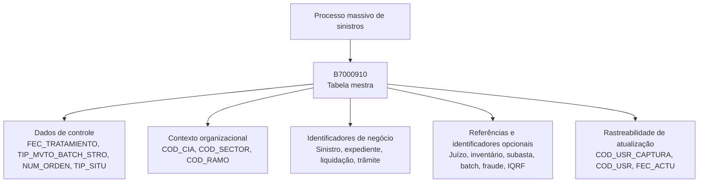

# Modelo de Dados para Processos Massivos de Sinistros — Tabela B7000910

## 1. Metadados do Documento
- **Arquivo de Origem:** Não identificado no conteúdo fornecido
- **Tipo de Documento:** Especificação Técnica
- **Domínio / Sistema:** Reef / Mapfre — Processos Massivos de Sinistros
- **Público-Alvo:** Desenvolvedores, Arquitetos, Operação e Analistas Funcionais
- **Data/Versão Identificada:** Não identificada

---

## 2. Resumo Executivo & Contexto de Negócio

O documento descreve candidatos a alterações em elementos relacionados a sinistros, sob uma visão técnica, com foco no modelo de dados envolvido em processos massivos. A tabela identificada é `B7000910`, descrita como a tabela mestra de processos massivos de sinistros.

A estrutura `B7000910` concentra dados de identificação, situação e rastreabilidade de um processo massivo. Entre os atributos obrigatórios estão a data de tratamento, o tipo de movimento batch, o número de ordem do processo, a situação do registro, companhia, setor e ramo.

O modelo também registra identificadores de negócio associados ao sinistro, expediente, liquidação, trâmite, juízo, inventário, subasta, batch, fraude e IQRF. Parte desses identificadores possui campos de referência correspondentes, permitindo armazenar vínculos com registros ou sistemas de origem.

O documento indica que a situação inicial possível para `TIP_SITU` é `1-Sin Procesar`. Contudo, o conteúdo não detalha o ciclo de vida completo da situação, os mecanismos de execução do processo massivo, contratos de integração, tipos físicos das colunas, chaves, índices ou regras de atualização.

---

## 3. Arquitetura, Componentes & Tecnologias Envolvidas

Os componentes e referências identificados são:

| Componente / Termo | Papel identificado |
| :--- | :--- |
| `B7000910` | Tabela mestra de processos massivos de sinistros |
| Reef | Área ou repositório de documentação citado no conteúdo |
| Mapfre | Contexto corporativo identificado pela referência a “Mapfredocument” e ao domínio de sinistros |
| Processo massivo de sinistros | Processo cujo tratamento e rastreabilidade são registrados na tabela `B7000910` |
| Batch | Conceito citado em campos como `TIP_MVTO_BATCH_STRO`, `COD_BATCH_REF` e `IDN_BATCH` |
| Outros sistemas | Sistemas externos ou relacionados que podem fornecer o número de sinistro de referência (`NUM_SINI_REF`) |



> **Nota de Análise:** O documento não descreve aplicações, microsserviços, bancos de dados, APIs, tecnologias de persistência, ambientes, URLs, portas ou contratos de integração. O diagrama representa exclusivamente a relação funcional explicitamente sustentada entre o processo massivo e os grupos de dados da tabela `B7000910`.

---

## 4. Regras de Negócio, Especificações Funcionais & Processos

### 4.1 Objetivo do modelo de dados

A tabela `B7000910` participa de uma operação de processos massivos de sinistros e é descrita como “MAESTRA PROCESOS MASIVO DE SINIESTROS”. O registro armazena:

1. Dados de execução e controle do processo massivo.
2. Dados organizacionais de companhia, setor e ramo.
3. Identificadores de sinistro e entidades relacionadas.
4. Referências para entidades provenientes de outros sistemas ou processos.
5. Dados de usuário e data de atualização.

### 4.2 Regras e condições explicitamente identificadas

1. `FEC_TRATAMIENTO` é obrigatória e representa a data em que é realizado o processo massivo.
2. `TIP_MVTO_BATCH_STRO` é obrigatório e representa o tipo de movimento batch.
3. `NUM_ORDEN` é obrigatório e representa o número do processo massivo.
4. `TXT_ALIAS` não é obrigatório e permite registrar o nome que se deseja atribuir ao processo.
5. `TIP_SITU` é obrigatório e possui o valor apresentado `1-Sin Procesar`, descrito como a situação em que a linha se encontra.
6. `COD_CIA`, `COD_SECTOR` e `COD_RAMO` são obrigatórios para registrar, respectivamente, companhia, setor e ramo.
7. `NUM_SINI_REF` é obrigatório e representa o sinistro de referência de outros sistemas.
8. `NUM_SINI`, `NUM_EXP`, `NUM_LIQ_REF`, `NUM_LIQ` e `SUB_TIP_TRAMITE` são obrigatórios.
9. Os identificadores e referências de juízo, inventário, subasta, batch, sequência, fraude e IQRF apresentados no documento não são obrigatórios.
10. `COD_USR_CAPTURA`, `COD_USR` e `FEC_ACTU` são obrigatórios para registrar usuário que simula a captura, usuário que atualizou a linha e data de atualização da linha.

> **Nota de Análise:** O documento não especifica quais ações alteram `TIP_SITU`, quais outros valores de situação são permitidos, nem quais validações relacionais devem existir entre identificadores de referência e seus respectivos identificadores principais.

---

## 5. Tabelas de Parâmetros, Ambientes e Estruturas de Dados

### 5.1 Estrutura identificada

| Item / Parâmetro | Descrição / Função | Tipo / Valores / Formato | Ambiente / Observações |
| :--- | :--- | :--- | :--- |
| `B7000910` | Tabela mestra de processos massivos de sinistros | Tabela de dados | O documento não especifica banco de dados, esquema, chave primária ou índices |

### 5.2 Campos da tabela `B7000910`

| Item / Parâmetro | Descrição / Função | Tipo / Valores / Formato | Ambiente / Observações |
| :--- | :--- | :--- | :--- |
| `FEC_TRATAMIENTO` | Data em que se realiza o processo massivo | Valor/Motivo: `N.A.` | Obrigatória: Sim; Cambia: `S` |
| `TIP_MVTO_BATCH_STRO` | Tipo do movimento batch | Valor/Motivo: `N.A.` | Obrigatória: Sim; Cambia: `S` |
| `NUM_ORDEN` | Número do processo massivo | Valor/Motivo: `N.A.` | Obrigatória: Sim; Cambia: `S` |
| `TXT_ALIAS` | Nome que se deseja atribuir ao processo | Valor/Motivo: `N.A.` | Obrigatória: Não; Cambia: `S` |
| `TIP_SITU` | Situação em que a linha se encontra | Valor/Motivo: `1-Sin Procesar` | Obrigatória: Sim; Cambia: `S` |
| `COD_CIA` | Companhia | Valor/Motivo: `N.A.` | Obrigatória: Sim; Cambia: `S` |
| `COD_SECTOR` | Setor | Valor/Motivo: `N.A.` | Obrigatória: Sim; Cambia: `S` |
| `COD_RAMO` | Ramo | Valor/Motivo: `N.A.` | Obrigatória: Sim; Cambia: `S` |
| `NUM_SINI_REF` | Sinistro de referência de outros sistemas | Valor/Motivo: `N.A.` | Obrigatória: Sim; Cambia: `S` |
| `NUM_SINI` | Sinistro | Valor/Motivo: `N.A.` | Obrigatória: Sim; Cambia: `S` |
| `NUM_EXP` | Número de expediente | Valor/Motivo: `N.A.` | Obrigatória: Sim; Cambia: `S` |
| `NUM_LIQ_REF` | Número de liquidação de referência | Valor/Motivo: `N.A.` | Obrigatória: Sim; Cambia: `S` |
| `NUM_LIQ` | Número de liquidação | Valor/Motivo: `N.A.` | Obrigatória: Sim; Cambia: `S` |
| `SUB_TIP_TRAMITE` | Tipo de trâmite | Valor/Motivo: `N.A.` | Obrigatória: Sim; Cambia: `S` |
| `NUM_JUICIO_REF` | Número do juízo de referência | Valor/Motivo: `N.A.` | Obrigatória: Não; Cambia: `S` |
| `NUM_JUICIO` | Número do juízo | Valor/Motivo: `N.A.` | Obrigatória: Não; Cambia: `S` |
| `COD_INVENTARIO_REF` | Inventário de referência | Valor/Motivo: `N.A.` | Obrigatória: Não; Cambia: `S` |
| `COD_INVENTARIO` | Número de inventário | Valor/Motivo: `N.A.` | Obrigatória: Não; Cambia: `S` |
| `COD_SUBASTA_REF` | Código de subasta de referência | Valor/Motivo: `N.A.` | Obrigatória: Não; Cambia: `S` |
| `COD_SUBASTA` | Subasta | Valor/Motivo: `N.A.` | Obrigatória: Não; Cambia: `S` |
| `COD_BATCH_REF` | Código de referência para processos batch | Valor/Motivo: `N.A.` | Obrigatória: Não; Cambia: `S` |
| `IDN_BATCH` | Identificador batch | Valor/Motivo: `N.A.` | Obrigatória: Não; Cambia: `S` |
| `NUM_SQN_VAL` | Sequência | Valor/Motivo: `N.A.` | Obrigatória: Não; Cambia: `S` |
| `IDN_FRAUDE` | Identificador de fraude | Valor/Motivo: `N.A.` | Obrigatória: Não; Cambia: `S` |
| `IDN_FRAUDE_REF` | Referência de identificador de fraude | Valor/Motivo: `N.A.` | Obrigatória: Não; Cambia: `S` |
| `IDN_IQRF` | Identificador IQRF | Valor/Motivo: `N.A.` | Obrigatória: Não; Cambia: `S` |
| `IDN_IQRF_REF` | Referência de identificador IQRF | Valor/Motivo: `N.A.` | Obrigatória: Não; Cambia: `S` |
| `COD_USR_CAPTURA` | Usuário que simula a captura | Valor/Motivo: `N.A.` | Obrigatória: Sim; Cambia: `S` |
| `COD_USR` | Usuário que atualizou a linha | Valor/Motivo: `N.A.` | Obrigatória: Sim; Cambia: `S` |
| `FEC_ACTU` | Data de atualização da linha | Valor/Motivo: `N.A.` | Obrigatória: Sim; Cambia: `S` |

> **Nota de Análise:** O documento apresenta `S` na coluna “CAMBIA” para todos os campos listados. Não há definição adicional para o significado operacional de `S`; portanto, este artefato preserva o valor sem interpretar além do texto original.

---

## 6. Bateria de Perguntas & Respostas para RAG (FAQ Sintético)

### P1: Qual tabela é utilizada como mestra para processos massivos de sinistros?
**R:** A tabela utilizada é a `B7000910`, descrita no documento como “MAESTRA PROCESOS MASIVO DE SINIESTROS”.

### P2: Qual campo registra a data em que o processo massivo é realizado?
**R:** O campo `FEC_TRATAMIENTO` registra a data em que o processo massivo é realizado. O documento o classifica como obrigatório.

### P3: Qual é o campo que identifica o número do processo massivo de sinistros?
**R:** O campo `NUM_ORDEN` identifica o número do processo massivo. O campo é obrigatório na tabela `B7000910`.

### P4: É possível atribuir um nome personalizado a um processo massivo?
**R:** Sim. O campo `TXT_ALIAS` registra o nome que se deseja atribuir ao processo. Segundo o documento, `TXT_ALIAS` não é obrigatório.

### P5: Qual situação inicial é apresentada para um registro de processo massivo?
**R:** O documento apresenta o valor `1-Sin Procesar` para o campo `TIP_SITU`. Esse campo representa a situação em que a linha se encontra e é obrigatório. O documento não apresenta outros valores de situação nem transições entre situações.

### P6: Quais campos organizacionais são obrigatórios na tabela B7000910?
**R:** Os campos organizacionais obrigatórios identificados são `COD_CIA` para companhia, `COD_SECTOR` para setor e `COD_RAMO` para ramo.

### P7: Como o processo massivo registra um sinistro proveniente de outros sistemas?
**R:** O campo `NUM_SINI_REF` registra o sinistro de referência de outros sistemas. O documento indica que `NUM_SINI_REF` é obrigatório.

### P8: Quais identificadores de sinistro e liquidação são obrigatórios?
**R:** São obrigatórios os campos `NUM_SINI` para sinistro, `NUM_EXP` para número de expediente, `NUM_LIQ_REF` para número de liquidação de referência, `NUM_LIQ` para número de liquidação e `SUB_TIP_TRAMITE` para tipo de trâmite.

### P9: Os dados de juízo, inventário e subasta precisam ser sempre preenchidos?
**R:** Não. Os campos `NUM_JUICIO_REF`, `NUM_JUICIO`, `COD_INVENTARIO_REF`, `COD_INVENTARIO`, `COD_SUBASTA_REF` e `COD_SUBASTA` são apresentados como não obrigatórios.

### P10: Quais campos opcionais suportam rastreabilidade de processos batch, fraude e IQRF?
**R:** Os campos opcionais identificados são `COD_BATCH_REF`, `IDN_BATCH`, `NUM_SQN_VAL`, `IDN_FRAUDE`, `IDN_FRAUDE_REF`, `IDN_IQRF` e `IDN_IQRF_REF`. Eles representam, respectivamente, referência batch, identificador batch, sequência, identificador e referência de fraude, e identificador e referência IQRF.

### P11: Como a tabela registra a autoria e a data de atualização de uma linha?
**R:** A tabela utiliza `COD_USR_CAPTURA` para o usuário que simula a captura, `COD_USR` para o usuário que atualizou a linha e `FEC_ACTU` para a data de atualização. Os três campos são obrigatórios.

### P12: O documento define os tipos físicos, chaves ou índices da tabela B7000910?
**R:** Não. O documento lista nomes de colunas, obrigatoriedade, valores/motivos e comentários funcionais, mas não define tipos físicos de dados, chaves primárias, chaves estrangeiras, índices, tamanho de campos ou regras de integridade referencial.

---

## 7. Glossário de Termos, Siglas & Conceitos-Chave

- **`B7000910`:** Tabela descrita como mestra de processos massivos de sinistros.
- **Batch:** Termo presente em campos referentes ao tipo de movimento batch, código de referência batch e identificador batch.
- **`COD_CIA`:** Campo que representa companhia.
- **`COD_SECTOR`:** Campo que representa setor.
- **`COD_RAMO`:** Campo que representa ramo.
- **`FEC_ACTU`:** Campo que representa a data de atualização da linha.
- **`FEC_TRATAMIENTO`:** Campo que representa a data de realização do processo massivo.
- **`IDN_BATCH`:** Identificador batch.
- **`IDN_FRAUDE`:** Identificador de fraude.
- **`IDN_FRAUDE_REF`:** Referência de identificador de fraude.
- **`IDN_IQRF`:** Identificador IQRF; o documento não expande a sigla IQRF.
- **`IDN_IQRF_REF`:** Referência de identificador IQRF.
- **IQRF:** Sigla presente no documento sem expansão ou definição adicional.
- **Liquidação:** Entidade identificada pelos campos `NUM_LIQ_REF` e `NUM_LIQ`.
- **Processo massivo de sinistros:** Processo registrado e controlado na tabela `B7000910`.
- **Reef:** Referência ao contexto ou repositório de documentação no conteúdo original.
- **Sinistro:** Entidade de negócio identificada por `NUM_SINI` e por `NUM_SINI_REF`.
- **Subasta:** Termo utilizado na descrição de campos de código e referência de subasta; o documento não fornece definição adicional.
- **Trâmite:** Entidade ou tipo de procedimento identificado pelo campo `SUB_TIP_TRAMITE`.

---

## 8. Notas Críticas, Riscos & Limitações

1. O conteúdo não identifica o nome do arquivo de origem, data, versão ou autor formal do documento. O texto contém a referência de owner `user:agonzalez_mapfre.com`, mas não apresenta esse valor como metadado estruturado do documento.
2. A especificação não informa tipos físicos, tamanhos, formatos, domínios, nulidade técnica, chaves, relacionamentos, índices ou mecanismos de auditoria da tabela `B7000910`.
3. A coluna “CAMBIA” apresenta o valor `S` para todos os campos, mas não define formalmente o significado de `S`.
4. A situação `TIP_SITU` possui apenas o valor `1-Sin Procesar` explicitamente apresentado. Não há catálogo completo de situações, máquina de estados, critérios de transição ou responsável por atualização.
5. O documento cita identificadores e referências para fraude e IQRF, porém não define a sigla IQRF nem os sistemas responsáveis por esses identificadores.
6. Não há definição de integrações, APIs, métodos HTTP, eventos, contratos JSON, mecanismos de carga batch, periodicidade, tratamento de erros, reprocessamento ou observabilidade.
7. Não são apresentados ambientes, URLs, servidores, credenciais, rotas de log, ferramentas de deploy ou mecanismos de controle de acesso.

---

## 9. Conteúdo Bruto Estruturado (Referência Fiel)

```text
--- [PÁGINA 1 DE 2] ---

EN CONSTRUCCIÓN
INDICAR CAMBIOS elementos candidatos en Siniestros (visión
técnica)
Modelo de datos involucrado
Las tablas que intervienen en esta operación son:
B7000910
TABLA DESCRIPCIÓN
B7000910 MAESTRA PROCESOS MASIVO DE SINIESTROS
COLUMNA CAMBIA
VALOR
MOTIVO/VALOR OBLIGATORIA COMENTARIO
FEC_TRATAMIENTO S N.A. SI FECHA EN LA QUE SE REALIZA EL
PROCESO MASIVO
TIP_MVTO_BATCH_STRO S N.A. SI TIPO DEL MOVIMIENTO BATCH
NUM_ORDEN S N.A. SI NUMERO DEL PROCESO MASIVO
TXT_ALIAS S N.A. NO NOMBRE QUE SE QUIERA DAR AL
PROCESO
TIP_SITU S 1-Sin Procesar SI SITUACION EN LA QUE SE ENCUENTRA LA
FILA
COD_CIA S N.A. SI COMPANIA
COD_SECTOR S N.A. SI SECTOR
COD_RAMO S N.A. SI RAMO
Documentation / DOCUMENTACIÓN Reef
DOCUMENTACIÓN Reef
Mapfredocument
DOCUMENTACIÓN Reef
Owner
user:agonzalez_mapfre.com
Lifecycle
Approved Source
 / 
 VL
Buscar Inicio Soluciones Arquitecturas APIs Componentes Cloud Documentación Zeus Reef Ayuda
ES


--- [PÁGINA 2 DE 2] ---

COLUMNA CAMBIA
VALOR
MOTIVO/VALOR OBLIGATORIA COMENTARIO
NUM_SINI_REF S N.A. SI SINIESTRO REFERENCIA DE OTROS
SISTEMAS.
NUM_SINI S N.A. SI SINIESTRO
NUM_EXP S N.A. SI NUMERO DE EXPEDIENTE
NUM_LIQ_REF S N.A. SI NUMERO DE LIQUIDACION DE
REFERENCIA
NUM_LIQ S N.A. SI NUMERO DE LIQUIDACION
SUB_TIP_TRAMITE S N.A. SI TIPO DE TRAMITE
NUM_JUICIO_REF S N.A. NO NUMERO DEL JUICIO DE REFERENCIA
NUM_JUICIO S N.A. NO NUMERO DEL JUICIO
COD_INVENTARIO_REF S N.A. NO INVENTARIO DE REFERENCIA
COD_INVENTARIO S N.A. NO NUMERO DE INVENTARIO
COD_SUBASTA_REF S N.A. NO CODIGO DE SUBASTA DE REFERENCIA
COD_SUBASTA S N.A. NO SUBASTA
COD_BATCH_REF S N.A. NO CODIGO DE REFERENCIA PARA
PROCESOS BATCH
IDN_BATCH S N.A. NO IDENTIFICADOR BATCH
NUM_SQN_VAL S N.A. NO SECUENCIA
IDN_FRAUDE S N.A. NO IDENTIFICADOR DE FRAUDE
IDN_FRAUDE_REF S N.A. NO REFERENCIA DE IDENTIFICADOR DE
FRAUDE
IDN_IQRF S N.A. NO IDENTIFICADOR IQRF
IDN_IQRF_REF S N.A. NO REFERENCIA DE IDENTIFICADOR IQRF
COD_USR_CAPTURA S N.A. SI USUARIO QUE SIMULA LA CAPTURA
COD_USR S N.A. SI USUARIO QUE ACTUALIZO LA FILA
FEC_ACTU S N.A. SI FECHA DE ACTUALIZACION DE LA FILA
```
