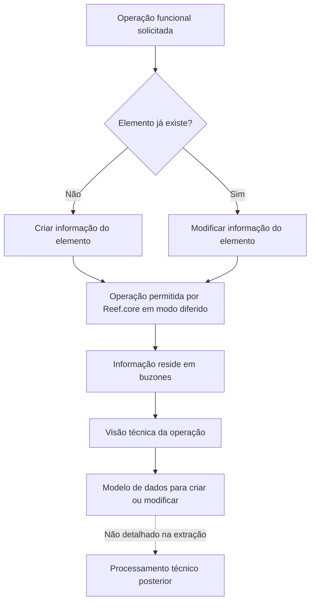
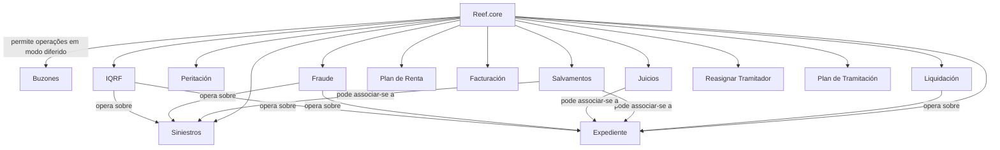

# Reef.core — Elementos Candidatos em Siniestros: Operações Diferidas para Criação e Alteração

## 1. Metadados do Documento
- **Arquivo de Origem:** Não identificado no conteúdo extraído.
- **Tipo de Documento:** Especificação funcional / catálogo de operações.
- **Domínio / Sistema:** Reef.core; gestão de siniestros, expedientes, liquidações, peritações, salvamentos, juízos, faturação, fraude, IQRF e plano de tramitação.
- **Público-Alvo:** Analistas funcionais, desenvolvedores, arquitetos, equipas de integração e operação.
- **Data/Versão Identificada:** Não identificada.
- **Estado identificado no conteúdo:** “EN CONSTRUCCIÓN”.
- **Ciclo de vida identificado:** Approved Source.
- **Proprietário identificado:** `user:agonzalez_mapfre.com`.

---

## 2. Resumo Executivo & Contexto de Negócio

O documento descreve os **elementos candidatos em Siniestros** no contexto do sistema **Reef.core**. O objetivo declarado é estabelecer a informação necessária para criar um elemento inexistente ou aplicar mudanças a um elemento já existente, incluindo siniestro, expediente, liquidação e peritação.

A informação a disponibilizar depende da operação funcional que o Reef.core permite executar em **modo diferido**. A característica diferenciadora do modo diferido é que a informação não é tratada diretamente no fluxo operacional imediato: a informação reside nos denominados **buzones**.

O documento funciona como um catálogo de operações funcionais organizadas por domínio. Para cada operação, o conteúdo indica a existência de um acesso (“Acceder”) à respetiva visão técnica, que deveria especificar o modelo de dados necessário para criar ou modificar a entidade. Contudo, os destinos desses acessos, os modelos de dados, os contratos, os campos, os métodos HTTP e as regras de validação não estão presentes na extração fornecida.

Os domínios cobertos incluem siniestros, expedientes, liquidações, peritações, salvamentos, juízos, plano de renda, faturação, fraude, IQRF, reatribuição de tramitador e plano de tramitação. O documento não fornece detalhamento funcional adicional sobre cada operação além do respetivo nome.

> **Nota de Análise:** O documento lista operações funcionais e referências a uma visão técnica por meio de “Acceder”, mas não apresenta os links efetivos, esquemas de dados, contratos de integração, estados, permissões ou critérios de processamento.

---

## 3. Arquitetura, Componentes & Tecnologias Envolvidas

### Componentes e conceitos identificados

| Componente / Conceito | Papel identificado no documento | Detalhamento disponível |
| :--- | :--- | :--- |
| Reef.core | Sistema que permite operações funcionais em modo diferido. | O documento não descreve arquitetura interna, endpoints, tecnologias ou versões. |
| Siniestros | Domínio principal de gestão de ocorrências/sinistros. | Contém operações de criação, modificação, término e reabilitação. |
| Expediente | Domínio associado ao siniestro. | Contém operações de criação, alteração, avaliação, término e reabilitação. |
| Liquidación | Domínio de liquidação associado a expediente. | Contém criação, modificação, anulação e justificante avulso. |
| Peritación | Domínio de solicitação, resultado, danos e ordens de reparação de perícia. | Contém criação, modificação e anulação de ordem de reparação. |
| Salvamentos | Domínio de entradas, saídas, associação, leilão, venda, libertação e anulação de salvamentos. | Não há modelo de dados ou fluxo detalhado. |
| Juicios | Domínio de demandas, sentenças, associações a expedientes e intervenções. | Não há modelo de dados ou fluxo detalhado. |
| Plan de Renta | Domínio de plano de renda. | Contém criação, anulação e término. |
| Facturación | Domínio de faturação. | Contém criação, modificação, geração de liquidação e anulação. |
| Fraude | Domínio de fraude para siniestro e expediente. | Contém criação e modificação. |
| IQRF | Domínio IQRF para siniestro e expediente. | Contém criação e modificação. A sigla não é expandida no documento. |
| Reasignar Tramitador | Operação para reatribuir um tramitador. | O documento não define critérios, papéis ou regras de atribuição. |
| Plan de Tramitación | Domínio para níveis, trâmites, avisos e anotações. | Contém inclusão, criação e término. |
| Buzones | Repositórios/caixas onde reside a informação relativa às operações em modo diferido. | O documento não especifica tecnologia, localização, esquema, retenção ou mecanismo de consumo. |
| Visión Técnica | Referência à especificação técnica e ao modelo de dados de uma operação. | Não está incluída no conteúdo extraído. |

### Fluxo funcional identificado



### Relações de domínio explicitamente suportadas pelo conteúdo



> **Nota de Análise:** As associações representadas no diagrama decorrem exclusivamente dos nomes das operações listadas. O documento não detalha cardinalidades, chaves de relacionamento, ordem de processamento, contratos ou persistência dos dados.

---

## 4. Regras de Negócio, Especificações Funcionais & Processos

### 4.1 Regra central para elementos candidatos

1. O processo trata da informação necessária para criar ou modificar um elemento em Siniestros.
2. Quando o elemento não existe, deve ser estabelecida a informação necessária para a sua criação.
3. Quando o elemento já existe, devem ser estabelecidas as alterações a realizar nesse elemento.
4. Os exemplos de elementos citados são: siniestro, expediente, liquidación e peritación.
5. A informação necessária depende da operação funcional que o Reef.core permite executar em modo diferido.
6. A diferença indicada para o modo diferido é que a informação reside nos denominados buzones.
7. O documento informa que cada operação apresentada possui referências para:
   - a operação;
   - a visão técnica que especifica o modelo de dados com a informação a criar ou modificar.
8. A extração não contém o conteúdo dos links, os modelos de dados ou qualquer especificação técnica detalhada.

### 4.2 Operações por domínio

#### Siniestros

- Criar siniestro.
- Modificar siniestro.
- Terminar siniestro.
- Reabilitar siniestro.

#### Expediente

- Criar expediente.
- Modificar informação de expediente.
- Avaliar expediente.
- Modificar avaliação de expediente.
- Terminar expediente.
- Reabilitar expediente.

#### Liquidación

- Criar liquidação de expediente.
- Modificar liquidação.
- Anular liquidação.
- Gerar ou tratar justificante avulso (“Justificante suelto”).

#### Peritación

- Criar solicitação de perícia.
- Modificar solicitação de perícia.
- Criar resultado de perícia.
- Modificar resultado de perícia.
- Criar dano de perícia.
- Modificar dano de perícia.
- Criar ordem de reparação.
- Modificar ordem de reparação.
- Anular ordem de reparação.

#### Salvamentos

- Criar entrada de salvamento.
- Criar saída de salvamento.
- Modificar salvamento.
- Associar salvamento a siniestro.
- Associar salvamento a expediente.
- Criar leilão.
- Modificar leilão.
- Associar inventário a leilão.
- Vender salvamento.
- Libertar salvamento.
- Anular salvamento.

#### Juicios

- Criar demanda judicial.
- Modificar demanda judicial.
- Criar sentença judicial.
- Modificar sentença judicial.
- Associar juízo a expediente.
- Criar intervenção.
- Modificar intervenção.

#### Plan de Renta

- Criar plano de renda.
- Anular plano de renda.
- Terminar plano de renda.
- Terminar plano de renda sem anular.

#### Facturación

- Criar faturação.
- Modificar faturação.
- Modificar faturação não liquidada.
- Gerar liquidação de faturação.
- Anular faturação.
- Anular faturação não liquidada.

#### Fraude

- Criar fraude de siniestro.
- Modificar fraude de siniestro.
- Criar fraude de expediente.
- Modificar fraude de expediente.

#### IQRF

- Criar IQRF de siniestro.
- Modificar IQRF de siniestro.
- Criar IQRF de expediente.
- Modificar IQRF de expediente.

#### Reasignar Tramitador

- Reatribuir tramitador.

#### Plan de Tramitación

- Incluir nível.
- Incluir trâmite.
- Criar aviso.
- Criar anotação.
- Terminar trâmite.
- Terminar aviso.

### 4.3 Restrições e lacunas de especificação

| Tema | Situação no conteúdo |
| :--- | :--- |
| Campos obrigatórios | Não detalhados. |
| Tipos de dados | Não detalhados. |
| Validações | Não detalhadas. |
| Regras de autorização | Não detalhadas. |
| Perfis de utilizador | Não detalhados. |
| Métodos HTTP | Não detalhados. |
| Contratos JSON/XML | Não detalhados. |
| URLs ou endpoints | Não detalhados. |
| Estados permitidos | Não detalhados. |
| Ordem de execução | Não detalhada. |
| Processamento dos buzones | Não detalhado. |
| Erros, reprocessamento e idempotência | Não detalhados. |
| Critérios de término, reabilitação e anulação | Não detalhados. |

---

## 5. Tabelas de Parâmetros, Ambientes e Estruturas de Dados

### 5.1 Catálogo de operações

| Domínio | Item / Operação | Descrição / Função | Tipo / Valores / Formato | Ambiente / Observações |
| :--- | :--- | :--- | :--- | :--- |
| Siniestros | CREAR siniestro | Criar um siniestro. | Operação funcional. | Referência “Acceder” para visão técnica; conteúdo não extraído. |
| Siniestros | MODIFICAR siniestro | Modificar um siniestro existente. | Operação funcional. | Referência “Acceder” para visão técnica; conteúdo não extraído. |
| Siniestros | TERMINAR siniestro | Terminar um siniestro. | Operação funcional. | Critérios de término não detalhados. |
| Siniestros | REHABILITAR siniestro | Reabilitar um siniestro. | Operação funcional. | Critérios de reabilitação não detalhados. |
| Expediente | CREAR expediente | Criar um expediente. | Operação funcional. | Modelo de dados não presente. |
| Expediente | MODIFICAR información expediente | Modificar informação de expediente. | Operação funcional. | Campos modificáveis não detalhados. |
| Expediente | VALORAR expediente | Avaliar um expediente. | Operação funcional. | Critérios de avaliação não detalhados. |
| Expediente | MODIFICAR valoración expediente | Modificar a avaliação de um expediente. | Operação funcional. | Critérios e dados não detalhados. |
| Expediente | TERMINAR expediente | Terminar um expediente. | Operação funcional. | Critérios de término não detalhados. |
| Expediente | REHABILITAR expediente | Reabilitar um expediente. | Operação funcional. | Critérios de reabilitação não detalhados. |
| Liquidación | CREAR liquidación expediente | Criar liquidação de expediente. | Operação funcional. | Associação com expediente indicada no nome. |
| Liquidación | MODIFICAR liquidación | Modificar uma liquidação. | Operação funcional. | Campos não detalhados. |
| Liquidación | ANULAR liquidación | Anular uma liquidação. | Operação funcional. | Regras de anulação não detalhadas. |
| Liquidación | JUSTIFICANTE suelto | Operação para justificante avulso. | Operação funcional. | Sem detalhamento adicional. |
| Peritación | CREAR solicitud peritación | Criar solicitação de perícia. | Operação funcional. | Sem contrato de dados. |
| Peritación | MODIFICAR solicitud peritación | Modificar solicitação de perícia. | Operação funcional. | Sem regras adicionais. |
| Peritación | CREAR resultado peritación | Criar resultado de perícia. | Operação funcional. | Sem estrutura de resultado. |
| Peritación | MODIFICAR resultado peritación | Modificar resultado de perícia. | Operação funcional. | Sem estrutura de resultado. |
| Peritación | CREAR daño peritación | Criar dano de perícia. | Operação funcional. | Sem modelo de dano. |
| Peritación | MODIFICAR daño peritación | Modificar dano de perícia. | Operação funcional. | Sem modelo de dano. |
| Peritación | CREAR orden reparación | Criar ordem de reparação. | Operação funcional. | Sem fluxo de reparação. |
| Peritación | MODIFICAR orden reparación | Modificar ordem de reparação. | Operação funcional. | Sem campos modificáveis. |
| Peritación | ANULAR orden reparación | Anular ordem de reparação. | Operação funcional. | Sem regras de anulação. |
| Salvamentos | CREAR entrada salvamento | Criar entrada de salvamento. | Operação funcional. | Sem modelo de dados. |
| Salvamentos | CREAR salida salvamento | Criar saída de salvamento. | Operação funcional. | Sem modelo de dados. |
| Salvamentos | MODIFICAR salvamento | Modificar salvamento. | Operação funcional. | Sem campos modificáveis. |
| Salvamentos | ASOCIAR salvamento siniestro | Associar salvamento a siniestro. | Operação funcional. | Relação indicada pelo nome. |
| Salvamentos | ASOCIAR salvamento expediente | Associar salvamento a expediente. | Operação funcional. | Relação indicada pelo nome. |
| Salvamentos | CREAR subasta | Criar leilão. | Operação funcional. | Sem regras de leilão. |
| Salvamentos | MODIFICAR subasta | Modificar leilão. | Operação funcional. | Sem campos modificáveis. |
| Salvamentos | ASOCIAR inventario subasta | Associar inventário a leilão. | Operação funcional. | Sem modelo de inventário. |
| Salvamentos | VENDER salvamento | Vender salvamento. | Operação funcional. | Sem regras de venda. |
| Salvamentos | LIBERAR salvamento | Libertar salvamento. | Operação funcional. | Sem significado funcional adicional. |
| Salvamentos | ANULAR salvamento | Anular salvamento. | Operação funcional. | Sem regras de anulação. |
| Juicios | CREAR juicio demanda | Criar demanda judicial. | Operação funcional. | Sem dados processuais. |
| Juicios | MODIFICAR juicio demanda | Modificar demanda judicial. | Operação funcional. | Sem campos modificáveis. |
| Juicios | CREAR juicio sentencia | Criar sentença judicial. | Operação funcional. | Sem dados processuais. |
| Juicios | MODIFICAR juicio sentencia | Modificar sentença judicial. | Operação funcional. | Sem campos modificáveis. |
| Juicios | ASOCIAR juicio expediente | Associar juízo a expediente. | Operação funcional. | Relação indicada pelo nome. |
| Juicios | CREAR intervención | Criar intervenção. | Operação funcional. | Sem definição adicional. |
| Juicios | MODIFICAR intervención | Modificar intervenção. | Operação funcional. | Sem definição adicional. |
| Plan de Renta | CREAR plan de Renta | Criar plano de renda. | Operação funcional. | Sem estrutura de plano. |
| Plan de Renta | ANULAR plan de Renta | Anular plano de renda. | Operação funcional. | Sem regras de anulação. |
| Plan de Renta | TERMINAR plan de Renta | Terminar plano de renda. | Operação funcional. | Sem critérios de término. |
| Plan de Renta | TERMINAR plan de Renta sin anular | Terminar plano de renda sem anular. | Operação funcional. | O documento distingue término de anulação, sem explicar a diferença. |
| Facturación | CREAR facturación | Criar faturação. | Operação funcional. | Sem estrutura de faturação. |
| Facturación | MODIFICAR facturación | Modificar faturação. | Operação funcional. | Sem campos modificáveis. |
| Facturación | MODIFICAR facturación no liquidada | Modificar faturação não liquidada. | Operação funcional. | Estado “no liquidada” citado, sem definição. |
| Facturación | GENERAR liquidación facturación | Gerar liquidação de faturação. | Operação funcional. | Sem critérios de geração. |
| Facturación | ANULAR facturación | Anular faturação. | Operação funcional. | Sem regras de anulação. |
| Facturación | ANULAR facturación no liquidada | Anular faturação não liquidada. | Operação funcional. | Estado “no liquidada” citado, sem definição. |
| Fraude | CREAR fraude siniestro | Criar fraude de siniestro. | Operação funcional. | Sem modelo de fraude. |
| Fraude | MODIFICAR fraude siniestro | Modificar fraude de siniestro. | Operação funcional. | Sem campos modificáveis. |
| Fraude | CREAR fraude expediente | Criar fraude de expediente. | Operação funcional. | Sem modelo de fraude. |
| Fraude | MODIFICAR fraude expediente | Modificar fraude de expediente. | Operação funcional. | Sem campos modificáveis. |
| IQRF | CREAR I.Q.R.F. siniestro | Criar IQRF de siniestro. | Operação funcional. | Sigla não expandida no conteúdo. |
| IQRF | MODIFICAR I.Q.R.F. siniestro | Modificar IQRF de siniestro. | Operação funcional. | Sem campos modificáveis. |
| IQRF | CREAR I.Q.R.F. expediente | Criar IQRF de expediente. | Operação funcional. | Sigla não expandida no conteúdo. |
| IQRF | MODIFICAR I.Q.R.F. expediente | Modificar IQRF de expediente. | Operação funcional. | Sem campos modificáveis. |
| Reasignar Tramitador | REASIGNAR Tramitador | Reatribuir tramitador. | Operação funcional. | Sem regras de seleção ou permissões. |
| Plan de Tramitación | INCLUIR Nivel | Incluir nível. | Operação funcional. | Sem estrutura de nível. |
| Plan de Tramitación | INCLUIR Trámite | Incluir trâmite. | Operação funcional. | Sem estrutura de trâmite. |
| Plan de Tramitación | CREAR Aviso | Criar aviso. | Operação funcional. | Sem estrutura de aviso. |
| Plan de Tramitación | CREAR Anotación | Criar anotação. | Operação funcional. | Sem estrutura de anotação. |
| Plan de Tramitación | TERMINAR Trámite | Terminar trâmite. | Operação funcional. | Sem critérios de término. |
| Plan de Tramitación | TERMINAR Aviso | Terminar aviso. | Operação funcional. | Sem critérios de término. |

### 5.2 Ambientes, URLs, logs e infraestrutura

| Item / Parâmetro | Descrição / Função | Tipo / Valores / Formato | Ambiente / Observações |
| :--- | :--- | :--- | :--- |
| Ambientes | Não identificados. | Não aplicável. | O documento não lista DEV, QA, UAT, PRE ou PROD. |
| URLs | Não identificadas. | Não aplicável. | A extração contém “Acceder”, mas não inclui links ou URLs. |
| Rotas de logs | Não identificadas. | Não aplicável. | O documento não inclui caminhos, ferramentas ou níveis de log. |
| Servidores | Não identificados. | Não aplicável. | O documento não inclui hosts, portas ou clusters. |
| Portas | Não identificadas. | Não aplicável. | Não devem ser inferidas. |
| Tecnologias de mensageria | Não identificadas. | Não aplicável. | Os buzones são citados, mas a tecnologia subjacente não é especificada. |
| Versão do Reef.core | Não identificada. | Não aplicável. | Nenhuma versão é apresentada. |

---

## 6. Bateria de Perguntas & Respostas para RAG (FAQ Sintético)

### P1: Qual é o objetivo do documento de elementos candidatos em Siniestros?
**R:** O objetivo é estabelecer a informação necessária para criar um elemento quando ele não existe ou definir as mudanças a realizar quando o elemento já existe. Os exemplos citados incluem siniestro, expediente, liquidação e peritação.

### P2: O que diferencia as operações em modo diferido no Reef.core?
**R:** O documento indica que, em modo diferido, a informação necessária para criar ou modificar um elemento reside nos denominados buzones. A extração não explica a tecnologia, a localização, o mecanismo de consumo ou o processamento desses buzones.

### P3: Como saber quais dados devem ser enviados para criar ou modificar um elemento no Reef.core?
**R:** O documento informa que cada operação possui uma referência à respetiva visão técnica, que deveria especificar o modelo de dados com a informação a criar ou modificar. Contudo, os links e os modelos de dados não estão presentes no conteúdo extraído.

### P4: Quais operações de siniestro estão catalogadas?
**R:** As operações catalogadas para siniestros são: criar siniestro, modificar siniestro, terminar siniestro e reabilitar siniestro. O documento não apresenta critérios, campos ou transições de estado para essas operações.

### P5: Quais operações estão disponíveis para um expediente?
**R:** O documento lista criar expediente, modificar informação de expediente, avaliar expediente, modificar avaliação de expediente, terminar expediente e reabilitar expediente. Não são detalhados os dados da avaliação, regras de negócio ou validações.

### P6: É possível associar um salvamento a um siniestro ou a um expediente?
**R:** Sim. O catálogo contém as operações “ASOCIAR salvamento siniestro” e “ASOCIAR salvamento expediente”. O conteúdo não descreve chaves de associação, cardinalidades ou pré-requisitos.

### P7: Que operações de perícia são suportadas pelo catálogo?
**R:** O catálogo inclui criação e modificação de solicitação de perícia, resultado de perícia e dano de perícia; também inclui criação, modificação e anulação de ordem de reparação. A estrutura dos dados de perícia não é fornecida.

### P8: Quais operações de faturação distinguem itens não liquidados?
**R:** O documento lista “MODIFICAR facturación no liquidada” e “ANULAR facturación no liquidada”. Também lista criar faturação, modificar faturação, gerar liquidação de faturação e anular faturação. O estado “no liquidada” não é definido no documento.

### P9: O que significa IQRF no contexto do Reef.core?
**R:** O documento utiliza a sigla I.Q.R.F. em operações de criação e modificação para siniestro e expediente, mas não fornece a expansão ou definição da sigla. Portanto, não é possível determinar o significado de IQRF apenas com base no conteúdo extraído.

### P10: Qual é a diferença entre terminar e anular um plano de renda?
**R:** O documento lista as operações “ANULAR plan de Renta”, “TERMINAR plan de Renta” e “TERMINAR plan de Renta sin anular”. Isso demonstra que término e anulação são operações distintas. No entanto, os critérios funcionais e os efeitos de cada operação não são explicados.

### P11: Quais operações de fraude são previstas?
**R:** Estão previstas criação e modificação de fraude para siniestro, além de criação e modificação de fraude para expediente. Não há descrição de indicadores de fraude, estados, campos ou fluxos de aprovação.

### P12: O documento descreve APIs, métodos HTTP ou contratos JSON?
**R:** Não. O documento referencia uma visão técnica por operação, mas a extração não inclui métodos HTTP, URLs, payloads JSON, esquemas XML, códigos de resposta ou mecanismos de autenticação.

---

## 7. Glossário de Termos, Siglas & Conceitos-Chave

- **Reef.core:** Sistema citado como responsável por permitir operações funcionais em modo diferido.
- **Siniestro:** Entidade de sinistro/ocorrência no domínio apresentado.
- **Expediente:** Entidade de expediente associada ao domínio de siniestros.
- **Liquidación:** Entidade ou processo de liquidação, incluindo liquidação de expediente e de faturação.
- **Peritación:** Domínio relacionado com solicitação, resultado, dano e ordem de reparação de perícia.
- **Salvamento:** Domínio que contempla entrada, saída, associação, leilão, venda, libertação e anulação.
- **Juicio:** Domínio judicial que contempla demanda, sentença, associação a expediente e intervenção.
- **Plan de Renta:** Plano de renda com operações de criação, anulação e término.
- **Facturación:** Domínio de faturação.
- **Fraude:** Domínio para criação e modificação de fraude associada a siniestro ou expediente.
- **IQRF / I.Q.R.F.:** Sigla mencionada para siniestro e expediente; significado não definido no documento.
- **Tramitador:** Papel ou responsável que pode ser reatribuído por meio da operação “REASIGNAR Tramitador”.
- **Plan de Tramitación:** Domínio que inclui nível, trâmite, aviso, anotação e operações de término.
- **Buzones:** Denominação utilizada pelo documento para os locais onde reside a informação das operações em modo diferido.
- **Modo diferido:** Modalidade operacional em que a informação relacionada às operações reside em buzones.
- **Visión Técnica:** Referência à documentação técnica que especificaria o modelo de dados da operação.
- **Acceder:** Texto apresentado como acesso à visão técnica de cada operação; os links correspondentes não foram extraídos.
- **Justificante suelto:** Operação de justificante avulso; não possui definição adicional no conteúdo.

---

## 8. Notas Críticas, Riscos & Limitações

- O documento encontra-se marcado como **“EN CONSTRUCCIÓN”**, o que indica possível incompletude ou evolução do conteúdo.
- Os links “Acceder” para operações e visões técnicas não estão disponíveis na extração, impedindo a consulta dos modelos de dados mencionados.
- Não há contratos de integração, endpoints, métodos HTTP, protocolos, formatos de payload, códigos de erro ou mecanismos de autenticação.
- Não há descrição sobre a tecnologia ou operação dos buzones, incluindo persistência, filas, eventos, consumidores, tempos de processamento, retentativas, monitorização ou reprocessamento.
- Não são apresentados ambientes, URLs, servidores, portas, rotas de logs, variáveis de configuração ou versões de componentes.
- Não são detalhadas regras de permissão, papéis de utilizador, auditoria, segregação de funções ou aprovações.
- As operações de término, reabilitação, anulação, libertação e venda são citadas, mas os seus pré-requisitos, efeitos e restrições não são definidos.
- A sigla **IQRF** não é expandida nem definida.
- A relação entre siniestro, expediente, liquidação, peritação, salvamento, juízo, fraude e IQRF é parcialmente inferível pelos nomes das operações, mas não está formalmente modelada no texto.
- O texto não contém critérios de validação, estruturas de dados ou regras de idempotência; qualquer implementação requer consulta às visões técnicas referenciadas.

---

## 9. Conteúdo Bruto Estruturado (Referência Fiel)

```text
--- [PÁGINA 1 DE 5] ---

EN CONSTRUCCIÓN
INDICAR CAMBIOS elementos candidatos en Siniestros
¿En que consiste?
Establecer la información (en el caso que el elemento no exista) o los cambios a realizar (en el caso que el elemento exista) a un siniestro,
expediente, liquidación, peritación....
Objetivo
Conocer que información que se necesita para crear o modicar un elemento.
Proceso a seguir
La información necesaria para crear (en el caso que el elemento no exista) o para modicar (en el caso que el elemento exista), depende de
la operación funcional que Reef.core permita realizar en modo diferido. La diferencia radica que la información residirá en los denominados
buzones.
La información mostrada a continuación cuenta con enlaces a la operación y enlaces a la versión técnica que especica el modelo de datos
que contiene la información a crear o modicar.
SINIESTROS
OPERACIÓN VISIÓN TÉCNICA
CREAR siniestro Acceder
MODIFICAR siniestro Acceder
TERMINAR siniestro Acceder
REHABILITAR siniestro Acceder
EXPEDIENTE
OPERACIÓN VISIÓN TÉCNICA
Documentation / DOCUMENTACIÓN Reef
DOCUMENTACIÓN Reef
Mapfredocument
DOCUMENTACIÓN Reef
Owner
user:agonzalez_mapfre.com
Lifecycle
Approved Source
 / 
 VL
Buscar Inicio Soluciones Arquitecturas APIs Componentes Cloud Documentación Zeus Reef Ayuda
ES


--- [PÁGINA 2 DE 5] ---

EXPEDIENTE
CREAR expediente Acceder
MODIFICAR información expediente Acceder
VALORAR expediente Acceder
MODIFICAR valoración expediente Acceder
TERMINAR expediente Acceder
REHABILITAR expediente Acceder
LIQUIDACIÓN
OPERACIÓN VISIÓN TÉCNICA
CREAR liquidación expediente Acceder
MODIFICAR liquidación Acceder
ANULAR liquidación Acceder
JUSTIFICANTE suelto Acceder
PERITACIÓN
OPERACIÓN VISIÓN TÉCNICA
CREAR solicitud peritación Acceder
MODIFICAR solicitud peritación Acceder
CREAR resultado peritación Acceder
MODIFICAR resultado peritación Acceder
CREAR daño peritación Acceder
MODIFICAR daño peritación Acceder
CREAR orden reparación Acceder
MODIFICAR orden reparación Acceder
ANULAR orden reparación Acceder
SALVAMENTOS
OPERACIÓN VISIÓN TÉCNICA


--- [PÁGINA 3 DE 5] ---

SALVAMENTOS
CREAR entrada salvamento Acceder
CREAR salida salvamento Acceder
MODIFICAR salvamento Acceder
ASOCIAR salvamento siniestro Acceder
ASOCIAR salvamento expediente Acceder
CREAR subasta Acceder
MODIFICAR subasta Acceder
ASOCIAR inventario subasta Acceder
VENDER salvamento Acceder
LIBERAR salvamento Acceder
ANULAR salvamento Acceder
JUICIOS
OPERACIÓN VISIÓN TÉCNICA
CREAR juicio demanda Acceder
MODIFICAR juicio demanda Acceder
CREAR juicio sentencia Acceder
MODIFICAR juicio sentencia Acceder
ASOCIAR juicio expediente Acceder
CREAR intervención Acceder
MODIFICAR intervención Acceder
PLAN DE RENTA
OPERACIÓN VISIÓN TÉCNICA
CREAR plan de Renta Acceder
ANULAR plan de Renta Acceder
TERMINAR plan de Renta Acceder
TERMINAR plan de Renta sin anular Acceder


--- [PÁGINA 4 DE 5] ---

FACTURACIÓN
OPERACIÓN VISIÓN TÉCNICA
CREAR facturación Acceder
MODIFICAR facturación Acceder
MODIFICAR facturación no liquidada Acceder
GENERAR liquidación facturación Acceder
ANULAR facturación Acceder
ANULAR facturación no liquidada Acceder
FRAUDE
OPERACIÓN VISIÓN TÉCNICA
CREAR fraude siniestro Acceder
MODIFICAR fraude siniestro Acceder
CREAR fraude expediente Acceder
MODIFICAR fraude expediente Acceder
IQRF
OPERACIÓN VISIÓN TÉCNICA
CREAR I.Q.R.F. siniestro Acceder
MODIFICAR I.Q.R.F. siniestro Acceder
CREAR I.Q.R.F. expediente Acceder
MODIFICAR I.Q.R.F. expediente Acceder
REASIGNAR TRAMITADOR
OPERACIÓN VISIÓN TÉCNICA
REASIGNAR Tramitador Acceder
PLAN DE TRAMITACIÓN
OPERACIÓN VISIÓN TÉCNICA
INCLUIR Nivel Acceder


--- [PÁGINA 5 DE 5] ---

PLAN DE TRAMITACIÓN
INCLUIR Trámite Acceder
CREAR Aviso Acceder
CREAR Anotación Acceder
TERMINAR Trámite Acceder
TERMINAR Aviso Acceder
Checking links...
```
