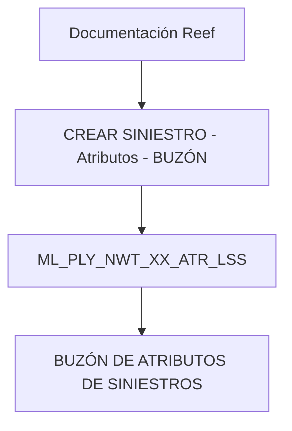

# Criar Siniestro — Atributos — Buzón (Visão Técnica)

## 1. Metadados do Documento
- **Arquivo de Origem:** Não identificado no conteúdo extraído
- **Tipo de Documento:** Especificação Técnica
- **Domínio / Sistema:** Reef / Mapfre — criação de sinistro
- **Público-Alvo:** Desenvolvedores, Arquitetos e Operação
- **Data/Versão Identificada:** Não identificada

---

## 2. Resumo Executivo & Contexto de Negócio

O conteúdo descreve, em visão técnica, a operação **“CREAR SINIESTRO - Atributos - BUZÓN”**, relacionada à criação de sinistro e ao tratamento de atributos associados a essa operação.

A única estrutura de dados explicitamente identificada é a tabela `ML_PLY_NWT_XX_ATR_LSS`, descrita como **“BUZÓN DE ATRIBUTOS DE SINIESTROS”**. Portanto, o documento estabelece que essa tabela participa da operação de criação de sinistro com atributos e buzón.

O conteúdo está associado à documentação **Reef** e referencia **Mapfre** por meio do elemento “Mapfredocument”. Também exibe elementos de navegação de um portal corporativo de documentação, incluindo seções como Soluções, Arquiteturas, APIs, Componentes, Cloud, Documentação, Zeus e Reef.

O trecho disponível não detalha regras de validação, contratos de integração, operações HTTP, campos da tabela, processos de persistência, ambientes ou responsabilidades operacionais adicionais.

---

## 3. Arquitetura, Componentes & Tecnologias Envolvidas

| Componente / Artefato | Papel identificado |
| :--- | :--- |
| Reef | Contexto de documentação técnica referenciado no conteúdo. |
| Mapfre | Referência corporativa exibida como `Mapfredocument`. |
| Operação `CREAR SINIESTRO - Atributos - BUZÓN` | Operação técnica relacionada à criação de sinistro, atributos e buzón. |
| `ML_PLY_NWT_XX_ATR_LSS` | Tabela envolvida na operação; descrita como buzón de atributos de sinistros. |
| Documentación Reef | Área ou contexto documental exibido no portal. |
| Zeus | Seção de navegação exibida no portal; não há detalhamento funcional. |
| Soluciones, Arquitecturas, APIs, Componentes, Cloud | Seções de navegação exibidas; não há detalhamento técnico associado. |



**Nota de Análise:** O diagrama representa somente a associação explicitamente apresentada entre a operação e a tabela. O conteúdo não descreve microsserviços, APIs, protocolos, métodos HTTP, fluxos de dados, tecnologias de persistência ou contratos JSON.

---

## 4. Regras de Negócio, Especificações Funcionais & Processos

1. Existe uma operação denominada **“CREAR SINIESTRO - Atributos - BUZÓN”**.
2. A operação está apresentada sob a perspectiva de **“visión técnica”**.
3. A tabela `ML_PLY_NWT_XX_ATR_LSS` é indicada como uma das tabelas que intervêm na operação.
4. A descrição fornecida para `ML_PLY_NWT_XX_ATR_LSS` é **“BUZÓN DE ATRIBUTOS DE SINIESTROS”**.
5. O conteúdo não informa:
   - critérios para criação de sinistro;
   - atributos obrigatórios ou opcionais;
   - estrutura de colunas da tabela;
   - regras de preenchimento do buzón;
   - validações, mensagens de erro ou exceções;
   - ordem de execução do processo;
   - integrações com outros sistemas;
   - responsáveis pela operação ou SLAs.

---

## 5. Tabelas de Parâmetros, Ambientes e Estruturas de Dados

| Item / Parâmetro | Descrição / Função | Tipo / Valores / Formato | Ambiente / Observações |
| :--- | :--- | :--- | :--- |
| Operação | `CREAR SINIESTRO - Atributos - BUZÓN` | Nome de operação | Apresentada como visão técnica. |
| Tabela | `ML_PLY_NWT_XX_ATR_LSS` | Identificador de tabela | Indicada como tabela que intervém na operação. |
| Descrição da tabela | `BUZÓN DE ATRIBUTOS DE SINIESTROS` | Descrição textual | Não há colunas, chaves, tipos ou regras de dados detalhados. |
| Owner | `user:agonzalez_mapfre.com` | Identificador de proprietário | Exibido na área de documentação. |
| Lifecycle | `Approved Source` | Estado de ciclo de vida | Exibido na área de documentação. |
| Idioma | `ES` | Código de idioma | Exibido no portal documental. |
| Versão | `VL` | Identificador textual | Exibido no conteúdo; sem explicação adicional. |

---

## 6. Bateria de Perguntas & Respostas para RAG (FAQ Sintético)

### P1: Qual operação é documentada no conteúdo técnico?
**R:** A operação documentada é `CREAR SINIESTRO - Atributos - BUZÓN`, apresentada como uma visão técnica relacionada à criação de sinistro, atributos e buzón.

### P2: Qual tabela participa da operação de criação de sinistro com atributos e buzón?
**R:** A tabela identificada no conteúdo é `ML_PLY_NWT_XX_ATR_LSS`.

### P3: Qual é a descrição da tabela `ML_PLY_NWT_XX_ATR_LSS`?
**R:** A tabela `ML_PLY_NWT_XX_ATR_LSS` é descrita como `BUZÓN DE ATRIBUTOS DE SINIESTROS`.

### P4: O documento detalha as colunas da tabela `ML_PLY_NWT_XX_ATR_LSS`?
**R:** Não. O conteúdo identifica a tabela e sua descrição, mas não informa colunas, tipos de dados, chaves, índices ou regras de preenchimento.

### P5: O documento especifica APIs ou métodos HTTP para criar sinistros?
**R:** Não. Embora a navegação do portal inclua uma seção chamada APIs, o trecho não descreve endpoints, métodos HTTP, contratos JSON ou mecanismos de integração.

### P6: Qual sistema ou domínio documental é citado no conteúdo?
**R:** O conteúdo referencia `DOCUMENTACIÓN Reef` e apresenta Reef como contexto documental. Também há referência a `Mapfredocument`.

### P7: Existem regras de negócio para validar atributos de sinistros?
**R:** Não. O conteúdo não apresenta atributos obrigatórios, condições de validação, regras de cálculo, mensagens de erro ou fluxos de exceção.

### P8: Quem é o owner exibido no conteúdo documental?
**R:** O owner exibido é `user:agonzalez_mapfre.com`.

### P9: Qual é o lifecycle informado para o conteúdo?
**R:** O lifecycle exibido é `Approved Source`.

### P10: O documento informa ambientes, URLs, servidores ou rotas de logs?
**R:** Não. O trecho não contém URLs de ambientes, nomes de servidores, portas, caminhos de logs ou variáveis de configuração.

---

## 7. Glossário de Termos, Siglas & Conceitos-Chave

- **Buzón:** Termo usado no documento na expressão `BUZÓN DE ATRIBUTOS DE SINIESTROS`; não há definição funcional adicional.
- **CREAR SINIESTRO:** Expressão em espanhol para a operação de criação de sinistro.
- **Reef:** Contexto ou área de documentação referenciada como `DOCUMENTACIÓN Reef`.
- **`ML_PLY_NWT_XX_ATR_LSS`:** Tabela descrita como buzón de atributos de sinistros.
- **Lifecycle:** Campo exibido na documentação com o valor `Approved Source`.
- **VL:** Identificador exibido no conteúdo sem significado detalhado.
- **ES:** Código de idioma exibido no portal documental.

---

## 8. Notas Críticas, Riscos & Limitações

- O conteúdo extraído é reduzido e não permite reconstruir o processo completo de criação de sinistro.
- Não há definição dos campos, chaves, relacionamentos ou modelo físico da tabela `ML_PLY_NWT_XX_ATR_LSS`.
- Não há detalhamento de APIs, integrações, microsserviços, autenticação, tratamento de falhas ou requisitos não funcionais.
- Não há indicação de ambientes, URLs, servidores, portas, logs ou procedimentos operacionais.
- **Nota de Análise:** O documento lista a tabela `ML_PLY_NWT_XX_ATR_LSS`, porém não detalha as operações de banco de dados, métodos HTTP ou contratos JSON relacionados à criação de sinistro.

---

## 9. Conteúdo Bruto Estruturado (Referência Fiel)

```text
--- [PÁGINA 1 DE 1] ---

Imagen LOGO
EN CONSTRUCCIÓN
CREAR Siniestro - Atributos - buzón (visión técnica)
Modelo de datos involucrado
Las tablas que intervienen en esta operación son:
OPERACIÓN
CREAR SINIESTRO - Atributos- BUZÓN
TABLA DESCRIPCIÓN
ML_PLY_NWT_XX_ATR_LSS BUZÓN DE ATRIBUTOS DE SINIESTROS
|
Documentation / DOCUMENTACIÓN Reef
DOCUMENTACIÓN Reef
Mapfredocument
DOCUMENTACIÓN Reef
Owner
user:agonzalez_mapfre.com
Lifecycle
Approved Source
 /
 VL
Buscar Inicio Soluciones Arquitecturas APIs Componentes Cloud Documentación Zeus Reef Ayuda
ES
```
