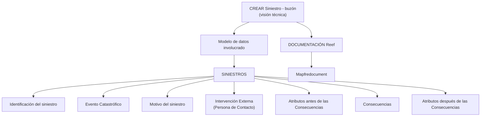

# Criar Sinistro – Caixa Postal (Visão Técnica): Modelo de Dados Envolvido

## 1. Metadados do Documento
- **Arquivo de Origem:** `Não identificado no conteúdo fornecido`
- **Tipo de Documento:** `Especificação Técnica`
- **Domínio / Sistema:** `SINIESTROS / Reef / Mapfredocument`
- **Público-Alvo:** `Não identificado explicitamente; o conteúdo possui orientação técnica`
- **Data/Versão Identificada:** `Não identificada`

---

## 2. Resumo Executivo & Contexto de Negócio

O documento apresenta uma visão técnica em construção para o processo **“CREAR Siniestro - buzón”**, isto é, criação de sinistro associada a uma caixa postal/buzón. O conteúdo declara que existe um modelo de dados envolvido nesse processo.

A principal finalidade do material é apontar os elementos documentais relacionados ao modelo de dados de **SINIESTROS**. Os elementos são disponibilizados como links de acesso, identificados no conteúdo pelo texto **“Acceder”**.

A estrutura listada sugere uma organização do sinistro em torno de identificação, evento catastrófico, motivo, intervenção externa, atributos antes das consequências, consequências e atributos posteriores às consequências.

O documento também referencia a documentação **Reef**, o repositório ou contexto **Mapfredocument**, além de indicar `user:agonzalez_mapfre.com` como proprietário e `Approved Source / VL` como informações de ciclo de vida/origem. Não há detalhamento sobre contratos de integração, métodos HTTP, modelos de campos, regras de preenchimento ou mecanismos técnicos de acesso.

---

## 3. Arquitetura, Componentes & Tecnologias Envolvidas

| Componente / Referência | Papel identificado no documento | Detalhamento disponível |
| :--- | :--- | :--- |
| `CREAR Siniestro - buzón` | Processo ou tópico técnico de criação de sinistro via buzón | Identificado como “visión técnica” e “en construcción” |
| `SINIESTROS` | Domínio documental que agrupa os elementos do modelo de dados | Contém links para entidades/tópicos relacionados |
| `Reef` | Contexto ou área de documentação | Referenciado como “DOCUMENTACIÓN Reef” |
| `Mapfredocument` | Referência documental/sistema citada | Não detalhada |
| `Owner` | Propriedade do conteúdo | `user:agonzalez_mapfre.com` |
| `Lifecycle` | Metadado de ciclo de vida | `Approved Source / VL` |



**Nota de Análise:** o diagrama representa somente a hierarquia documental e os tópicos explicitamente listados. O conteúdo não descreve integrações, bancos de dados, interfaces, protocolos, tecnologias de implementação ou fluxos de execução.

---

## 4. Regras de Negócio, Especificações Funcionais & Processos

O conteúdo fornecido não especifica regras de negócio detalhadas, condições de validação, cálculos, critérios de elegibilidade, contratos de dados ou etapas operacionais executáveis.

Os tópicos identificados como integrantes do modelo de dados de sinistros são:

1. **Identificación del siniestro**
2. **Evento Catastrófico**
3. **Motivo del siniestro**
4. **Intervención Externa (Persona de Contacto)**
5. **Atributos antes de las Consecuencias**
6. **Consecuencias**
7. **Atributos después de las Consecuencias**

Cada tópico apresenta a indicação **“Acceder”**, sinalizando a existência de um acesso documental, mas os URLs de destino não foram incluídos no texto bruto disponibilizado.

**Nota de Análise:** o documento lista o modelo de dados relacionado a `CREAR Siniestro - buzón`, porém não detalha atributos, tipos de dados, cardinalidades, obrigatoriedade, métodos de acesso, contratos JSON, APIs ou validações aplicáveis a cada tópico.

---

## 5. Tabelas de Parâmetros, Ambientes e Estruturas de Dados

| Item / Parâmetro | Descrição / Função | Tipo / Valores / Formato | Ambiente / Observações |
| :--- | :--- | :--- | :--- |
| Processo | `CREAR Siniestro - buzón` | Visão técnica | Marcado como `EN CONSTRUCCIÓN` |
| Domínio | `SINIESTROS` | Agrupador do modelo de dados | Possui referências “Acceder” |
| Estrutura documental | `Identificación del siniestro` | Tópico do modelo de dados | Sem campos ou especificação adicional |
| Estrutura documental | `Evento Catastrófico` | Tópico do modelo de dados | Sem campos ou especificação adicional |
| Estrutura documental | `Motivo del siniestro` | Tópico do modelo de dados | Sem campos ou especificação adicional |
| Estrutura documental | `Intervención Externa (Persona de Contacto)` | Tópico do modelo de dados | Sem campos ou especificação adicional |
| Estrutura documental | `Atributos antes de las Consecuencias` | Tópico do modelo de dados | Sem campos ou especificação adicional |
| Estrutura documental | `Consecuencias` | Tópico do modelo de dados | Sem campos ou especificação adicional |
| Estrutura documental | `Atributos después de las Consecuencias` | Tópico do modelo de dados | Sem campos ou especificação adicional |
| Documentação | `DOCUMENTACIÓN Reef` | Referência documental | Aparece repetidamente no conteúdo |
| Sistema / referência | `Mapfredocument` | Nome citado no conteúdo | Função não detalhada |
| Proprietário | `user:agonzalez_mapfre.com` | Identificador de owner | Exibido no campo `Owner` |
| Ciclo de vida | `Approved Source / VL` | Valor exibido para `Lifecycle` | Significado de `VL` não informado |
| Idioma da interface | `ES` | Código apresentado na interface | Provavelmente espanhol; o documento não explicita a definição |

---

## 6. Bateria de Perguntas & Respostas para RAG (FAQ Sintético)

### P1: Qual processo técnico é abordado pelo documento?
**R:** O documento aborda o processo **“CREAR Siniestro - buzón”**, identificado explicitamente como uma **visão técnica** e marcado com o status **“EN CONSTRUCCIÓN”**.

### P2: Qual é o domínio funcional principal citado no documento?
**R:** O domínio funcional principal citado é **SINIESTROS**. O documento informa que o modelo de dados envolvido no processo está disponível em links associados a esse domínio.

### P3: Quais tópicos de modelo de dados são listados para SINIESTROS?
**R:** Os tópicos listados são: **Identificación del siniestro**, **Evento Catastrófico**, **Motivo del siniestro**, **Intervención Externa (Persona de Contacto)**, **Atributos antes de las Consecuencias**, **Consecuencias** e **Atributos después de las Consecuencias**.

### P4: O documento especifica os campos da identificação do sinistro?
**R:** Não. O documento apenas lista **“Identificación del siniestro”** como um tópico acessível do modelo de dados de SINIESTROS. Não há campos, tipos, obrigatoriedades ou regras de validação descritos no conteúdo fornecido.

### P5: Existe detalhamento técnico sobre evento catastrófico?
**R:** Não. **“Evento Catastrófico”** aparece como uma referência do modelo de dados de SINIESTROS, com indicação de acesso, mas sem descrição de atributos, regras de negócio ou fluxos.

### P6: O que o documento informa sobre intervenção externa?
**R:** O documento lista **“Intervención Externa (Persona de Contacto)”** como parte do modelo de dados envolvido. Não fornece detalhes sobre a pessoa de contato, critérios de intervenção, campos ou integrações relacionadas.

### P7: Como as consequências são organizadas no modelo apresentado?
**R:** O conteúdo apresenta três tópicos relacionados: **“Atributos antes de las Consecuencias”**, **“Consecuencias”** e **“Atributos después de las Consecuencias”**. O documento não explica a semântica, sequência operacional ou atributos dessas estruturas.

### P8: O documento fornece URLs para os links “Acceder”?
**R:** Não. O texto bruto mostra a palavra **“Acceder”** após cada tópico, mas não inclui os URLs ou destinos dos links.

### P9: Qual documentação é citada como referência?
**R:** A documentação citada é **“DOCUMENTACIÓN Reef”**. O texto também menciona **Mapfredocument**, sem explicar a relação técnica ou funcional entre Mapfredocument e Reef.

### P10: Quem é identificado como owner do conteúdo?
**R:** O campo **Owner** apresenta o valor `user:agonzalez_mapfre.com`.

### P11: Qual é o estado de ciclo de vida apresentado?
**R:** O documento mostra o campo **Lifecycle** com o valor **“Approved Source / VL”**. O significado específico de `VL` não é detalhado no texto.

### P12: O documento descreve APIs, métodos HTTP ou contratos JSON?
**R:** Não. Não há informações sobre APIs, endpoints, métodos HTTP, payloads JSON, autenticação, protocolos, erros ou contratos de integração.

---

## 7. Glossário de Termos, Siglas & Conceitos-Chave

- **Buzón:** termo em espanhol presente no título `CREAR Siniestro - buzón`; o documento não define formalmente seu significado operacional.
- **CREAR Siniestro:** expressão em espanhol que identifica o tópico/processo de criação de sinistro.
- **Consecuencias:** tópico do modelo de dados de SINIESTROS; sem definição adicional no documento.
- **DOCUMENTACIÓN Reef:** referência documental citada no conteúdo.
- **ES:** código exibido na interface; o documento não define formalmente a sigla.
- **Evento Catastrófico:** tópico do modelo de dados de SINIESTROS.
- **Intervención Externa:** tópico do modelo de dados associado a `Persona de Contacto`.
- **Lifecycle:** campo de metadado exibido com o valor `Approved Source / VL`.
- **Mapfredocument:** referência citada no conteúdo; não definida tecnicamente.
- **SINIESTROS:** domínio que concentra os tópicos do modelo de dados citado.
- **VL:** sigla exibida junto ao campo Lifecycle; significado não identificado no conteúdo.

---

## 8. Notas Críticas, Riscos & Limitações

- O documento está explicitamente marcado como **“EN CONSTRUCCIÓN”**, indicando possível incompletude ou evolução do conteúdo.
- Os links indicados como **“Acceder”** não incluem URLs no texto bruto; não é possível determinar seus destinos.
- Não existem detalhes sobre entidades, campos, chaves, tipos, relacionamentos, cardinalidades ou modelo lógico/físico de dados.
- Não há especificação de APIs, integrações, métodos HTTP, autenticação, mensageria, logs, tratamento de erros ou ambientes.
- O significado de `Approved Source / VL` não é explicado.
- Os papéis, responsabilidades operacionais e público-alvo não são declarados explicitamente.
- A repetição de `DOCUMENTACIÓN Reef` e a menção a `Mapfredocument` não são acompanhadas de explicação sobre governança documental ou integração entre plataformas.

---

## 9. Conteúdo Bruto Estruturado (Referência Fiel)

```text
--- [PÁGINA 1 DE 1] ---

Imagen LOGO
EN CONSTRUCCIÓN
CREAR Siniestro - buzón (visión técnica)
Modelo de datos involucrado
El modelo de datos (buzón) que interviene se encuentra en los siguientes enlaces
SINIESTROS
VISIÓN TÉCNICA
Identicación del siniestro Acceder
Evento Catastróco Acceder
Motivo del siniestro Acceder
Intervención Externa (Persona de Contacto) Acceder
Atributos antes de las Consecuencias Acceder
Consecuencias Acceder
Atributos después de las Consecuencias Acceder
Documentation / DOCUMENTACIÓN Reef
DOCUMENTACIÓN Reef
Mapfredocument
DOCUMENTACIÓN Reef
Owner
user:agonzalez_mapfre.com
Lifecycle
Approved Source
 /
 VL
Buscar Inicio Soluciones Arquitecturas APIs Componentes Cloud Documentación Zeus Reef Ayuda
ES
```
