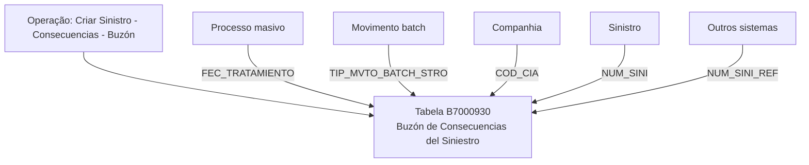

# Criar Sinistro — Consequências — Buzón: Visão Técnica e Modelo de Dados

## 1. Metadados do Documento
- **Arquivo de Origem:** `Não informado — conteúdo bruto fornecido na solicitação`
- **Tipo de Documento:** `Especificação Técnica`
- **Domínio / Sistema:** `Reef / Mapfre — operação Criar Sinistro - Consecuencias - Buzón`
- **Público-Alvo:** `Desenvolvedores, Arquitetos e Operação`
- **Data/Versão Identificada:** `Não identificada`

---

## 2. Resumo Executivo & Contexto de Negócio

O documento apresenta uma visão técnica, ainda marcada como **“EN CONSTRUCCIÓN”**, da operação **“CREAR Siniestro - Consecuencias - BUZÓN”** no contexto de documentação Reef e Mapfre. O foco explícito é o modelo de dados envolvido na operação.

A operação utiliza a tabela **B7000930**, descrita como **“BUZON DE CONSECUENCIAS DEL SINIESTRO”**. O conteúdo identifica colunas que sofrem alteração durante o processo e indica que todas as colunas listadas são obrigatórias.

Os campos descritos registram a data do processo massivo, o tipo de movimento batch, a companhia, o sinistro e uma referência de sinistro oriunda de outros sistemas. Não há detalhamento de APIs, métodos HTTP, contratos JSON, mecanismos de integração, regras de persistência ou sequência de processamento.

A documentação está associada ao espaço **Documentation / DOCUMENTACIÓN Reef**, contém referência a **Mapfredocument** e apresenta o proprietário identificado como `user:agonzalez_mapfre.com`, com ciclo de vida indicado como **Approved**.

---

## 3. Arquitetura, Componentes & Tecnologias Envolvidas

Os componentes e elementos explicitamente citados são:

| Componente / Elemento | Papel identificado no conteúdo |
| :--- | :--- |
| Reef | Contexto de documentação da operação. |
| Mapfre | Contexto corporativo associado à documentação. |
| Criar Sinistro - Consecuencias - Buzón | Operação técnica documentada. |
| B7000930 | Tabela envolvida na operação. |
| Buzón de Consecuencias del Siniestro | Descrição funcional da tabela B7000930. |
| Processo masivo | Processo citado como responsável pela data de tratamento. |
| Movimento batch | Tipo de movimento registrado na coluna `TIP_MVTO_BATCH_STRO`. |
| Outros sistemas | Origem possível do sinistro de referência registrado em `NUM_SINI_REF`. |



> **Nota de Análise:** O documento não detalha aplicações, microsserviços, APIs, protocolos, tecnologias de banco de dados, métodos HTTP, contratos JSON ou ambientes de execução.

---

## 4. Regras de Negócio, Especificações Funcionais & Processos

1. A operação documentada é denominada **“CREAR Siniestro - Consecuencias - BUZÓN”**.
2. A tabela envolvida na operação é a **B7000930**, cuja descrição é **“BUZON DE CONSECUENCIAS DEL SINIESTRO”**.
3. A coluna `FEC_TRATAMIENTO` sofre alteração e é obrigatória. O documento a define como a data em que é realizado o processo massivo.
4. A coluna `TIP_MVTO_BATCH_STRO` sofre alteração e é obrigatória. O documento a define como o tipo do movimento batch.
5. A coluna `COD_CIA` sofre alteração e é obrigatória. O documento a define como companhia.
6. A coluna `NUM_SINI` sofre alteração e é obrigatória. O documento a define como sinistro.
7. A coluna `NUM_SINI_REF` sofre alteração e é obrigatória. O documento a define como sinistro de referência de outros sistemas.
8. Para todas as colunas apresentadas, o campo **CAMBIA** possui valor `S`, o campo **VALOR** possui valor `N.A.` e o campo **OBLIGATORIA** possui valor `SI`.
9. O documento não especifica valores permitidos, formatos de data, regras de unicidade, chaves, relacionamentos entre tabelas, tratamento de falhas ou critérios de reprocessamento.

---

## 5. Tabelas de Parâmetros, Ambientes e Estruturas de Dados

| Item / Parâmetro | Descrição / Função | Tipo / Valores / Formato | Ambiente / Observações |
| :--- | :--- | :--- | :--- |
| Operação | Criar Sinistro - Consecuencias - Buzón | Não especificado | Visão técnica em construção. |
| B7000930 | Buzón de Consecuencias del Siniestro | Tabela | Tabela envolvida na operação. |
| FEC_TRATAMIENTO | Data em que é realizado o processo massivo | Não especificado | `CAMBIA: S`; `VALOR: N.A.`; obrigatória: `SI`. |
| TIP_MVTO_BATCH_STRO | Tipo do movimento batch | Não especificado | `CAMBIA: S`; `VALOR: N.A.`; obrigatória: `SI`. |
| COD_CIA | Companhia | Não especificado | `CAMBIA: S`; `VALOR: N.A.`; obrigatória: `SI`. |
| NUM_SINI | Sinistro | Não especificado | `CAMBIA: S`; `VALOR: N.A.`; obrigatória: `SI`. |
| NUM_SINI_REF | Sinistro de referência de outros sistemas | Não especificado | `CAMBIA: S`; `VALOR: N.A.`; obrigatória: `SI`. |
| Lifecycle | Estado do documento | `Approved` | Associado à documentação Reef. |
| Owner | Proprietário identificado na página | `user:agonzalez_mapfre.com` | Associado à documentação Reef. |

---

## 6. Bateria de Perguntas & Respostas para RAG (FAQ Sintético)

### P1: Qual tabela participa da operação Criar Sinistro - Consecuencias - Buzón?
**R:** A operação utiliza a tabela **B7000930**, descrita no documento como **“BUZON DE CONSECUENCIAS DEL SINIESTRO”**.

### P2: Qual campo registra a data de execução do processo massivo?
**R:** O campo `FEC_TRATAMIENTO` registra a data em que é realizado o processo massivo. O documento indica que esse campo muda (`S`) e é obrigatório (`SI`).

### P3: Qual coluna identifica o tipo de movimento batch do sinistro?
**R:** A coluna `TIP_MVTO_BATCH_STRO` identifica o tipo do movimento batch. O documento informa que a coluna muda (`S`) e é obrigatória (`SI`).

### P4: Qual campo registra a companhia na tabela B7000930?
**R:** A coluna `COD_CIA` representa a companhia. Ela está marcada como alterada (`S`) e obrigatória (`SI`).

### P5: Qual coluna contém o número do sinistro na operação?
**R:** A coluna `NUM_SINI` contém o sinistro. O documento não informa formato, tamanho ou regras de validação para esse campo, mas o classifica como obrigatório.

### P6: Como é registrada a referência de sinistro proveniente de outros sistemas?
**R:** A referência é registrada no campo `NUM_SINI_REF`, definido como **“SINIESTRO REFERENCIA DE OTROS SISTEMAS”**. O campo é obrigatório e sofre alteração na operação.

### P7: Todos os campos apresentados na tabela B7000930 são obrigatórios?
**R:** Sim. `FEC_TRATAMIENTO`, `TIP_MVTO_BATCH_STRO`, `COD_CIA`, `NUM_SINI` e `NUM_SINI_REF` estão marcados com `SI` na coluna de obrigatoriedade.

### P8: O documento especifica o formato da data em FEC_TRATAMIENTO?
**R:** Não. O documento informa somente que `FEC_TRATAMIENTO` corresponde à data de realização do processo massivo; não define formato, timezone ou regra de preenchimento.

### P9: A documentação apresenta APIs ou contratos de integração para a operação?
**R:** Não. O conteúdo apresenta a operação e a tabela B7000930, mas não detalha APIs, endpoints, métodos HTTP, contratos JSON, protocolos ou interfaces de integração.

### P10: Qual é o estado de ciclo de vida identificado para a documentação Reef?
**R:** O estado de ciclo de vida apresentado no conteúdo é **Approved**.

---

## 7. Glossário de Termos, Siglas & Conceitos-Chave

- **B7000930:** Tabela descrita como “BUZON DE CONSECUENCIAS DEL SINIESTRO”.
- **Buzón:** Termo usado no documento para identificar o repositório ou tabela de consequências do sinistro; não há definição adicional.
- **COD_CIA:** Coluna que representa a companhia.
- **FEC_TRATAMIENTO:** Coluna que representa a data de realização do processo massivo.
- **NUM_SINI:** Coluna que representa o sinistro.
- **NUM_SINI_REF:** Coluna que representa o sinistro de referência de outros sistemas.
- **Proceso masivo:** Processo citado como relacionado à data de tratamento; não há detalhamento adicional.
- **Reef:** Contexto ou espaço de documentação mencionado no conteúdo.
- **Siniestro:** Termo associado ao sinistro na operação e nos campos da tabela.
- **TIP_MVTO_BATCH_STRO:** Coluna que representa o tipo do movimento batch.
- **Valor `N.A.`:** Valor apresentado para todas as colunas da tabela; o documento não define o significado da sigla.

---

## 8. Notas Críticas, Riscos & Limitações

- O documento está identificado como **“EN CONSTRUCCIÓN”**, indicando conteúdo potencialmente incompleto.
- Não há especificação de tipos de dados, tamanhos, domínios de valores, chaves primárias, chaves estrangeiras ou índices da tabela B7000930.
- Não há detalhamento sobre execução, agendamento, falhas, reprocessamento ou monitoramento do processo massivo.
- Não há definição do significado de `N.A.` no campo **VALOR**.
- Não são apresentados contratos de integração, APIs, URLs, ambientes, permissões, logs ou mecanismos de auditoria.
- Não há detalhamento adicional sobre a origem, o fluxo ou a validação de `NUM_SINI_REF` para outros sistemas.

---

## 9. Conteúdo Bruto Estruturado (Referência Fiel)

```text
--- [PÁGINA 1 DE 1] ---

Imagen LOGO
EN CONSTRUCCIÓN
CREAR Siniestro - Consecuencias - buzón (visión técnica)
Modelo de datos involucrado
Las tablas que intervienen en esta operación son:
OPERACIÓN
CREAR SINIESTRO- Consecuencias- BUZÓN
TABLA DESCRIPCIÓN
B7000930 BUZON DE CONSECUENCIAS DEL SINIESTRO
COLUMNA CAMBIA
VALOR
MOTIVO/VALOR OBLIGATORIA COMENTARIO
FEC_TRATAMIENTO S N.A. SI FECHA EN LA QUE SE REALIZA EL
PROCESO MASIVO
TIP_MVTO_BATCH_STRO S N.A. SI TIPO DEL MOVIMIENTO BATCH
COD_CIA S N.A. SI COMPANIA
NUM_SINI S N.A. SI SINIESTRO
NUM_SINI_REF S N.A. SI SINIESTRO REFERENCIA DE OTROS
SISTEMAS.
Documentation / DOCUMENTACIÓN Reef
DOCUMENTACIÓN Reef
Mapfredocument
DOCUMENTACIÓN Reef
Owner
user:agonzalez_mapfre.com
Lifecycle
Approved Source
 /
VL
Buscar Inicio Soluciones Arquitecturas APIs Componentes Cloud Documentación Zeus Reef Ayuda
ES
```
