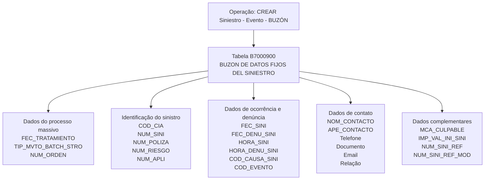

# Criar Sinistro — Evento — Buzón: Modelo de Dados Envolvido

## 1. Metadados do Documento
- **Arquivo de Origem:** Não identificado no conteúdo fornecido
- **Tipo de Documento:** Especificação Técnica
- **Domínio / Sistema:** Reef / Mapfre — operação de criação de sinistro por evento e buzón
- **Público-Alvo:** Desenvolvedores, Arquitetos e Operação
- **Data/Versão Identificada:** Não identificada

---

## 2. Resumo Executivo & Contexto de Negócio

O documento descreve a visão técnica da operação **“CREAR Siniestro - Evento - BUZÓN”**, relacionada à criação de um sinistro a partir de um evento e de informações mantidas em um buzón. O conteúdo está identificado como documentação Reef e associado ao contexto Mapfre.

A especificação concentra-se exclusivamente no modelo de dados envolvido na operação. A tabela identificada é a **B7000900**, descrita como **“BUZON DE DATOS FIJOS DEL SINIESTRO”**, isto é, o repositório de dados fixos do sinistro utilizado pela operação.

A documentação apresenta os campos da tabela B7000900, indicando para cada coluna se o valor pode ser alterado, o motivo/valor associado, a obrigatoriedade e uma descrição funcional. Os campos abrangem dados de processamento massivo, identificação da companhia, identificação do sinistro, apólice, risco, ocorrência, denúncia, contato e estimativa inicial de valor.

Não há detalhamento de métodos HTTP, contratos JSON, integrações externas, regras de persistência, mecanismos de validação, tecnologias de implementação ou URLs de ambiente. O documento também não descreve o comportamento operacional após a gravação ou atualização dos dados na tabela B7000900.

---

## 3. Arquitetura, Componentes & Tecnologias Envolvidas

### Componentes e entidades identificados

| Componente / Entidade | Tipo | Descrição baseada no documento |
| :--- | :--- | :--- |
| CREAR Siniestro - Evento - BUZÓN | Operação | Operação técnica de criação de sinistro por evento e buzón. |
| B7000900 | Tabela | Tabela denominada “BUZON DE DATOS FIJOS DEL SINIESTRO”. |
| Reef | Documentação / domínio | Contexto documental identificado como “DOCUMENTACIÓN Reef”. |
| Mapfre | Contexto corporativo | Marca ou contexto corporativo exibido no conteúdo como “Mapfredocument”. |
| Processo massivo | Processo | Processo associado aos campos `FEC_TRATAMIENTO`, `TIP_MVTO_BATCH_STRO` e `NUM_ORDEN`. |



> **Nota de Análise:** O documento identifica a operação e a tabela B7000900, mas não detalha o mecanismo técnico de inserção, atualização ou consulta dos registros. Também não informa serviços, APIs, métodos HTTP, contratos JSON, banco de dados, tecnologias ou ambientes de execução.

---

## 4. Regras de Negócio, Especificações Funcionais & Processos

### Operação documentada

A operação documentada é **“CREAR Siniestro - Evento - BUZÓN”**. O modelo de dados envolvido na operação é composto pela tabela **B7000900 — BUZON DE DATOS FIJOS DEL SINIESTRO**.

### Regras de obrigatoriedade identificadas

Os seguintes campos são marcados como obrigatórios no documento:

- `FEC_TRATAMIENTO`: data em que é realizado o processo massivo.
- `TIP_MVTO_BATCH_STRO`: tipo do movimento batch.
- `COD_CIA`: companhia.
- `NUM_SINI`: sinistro.
- `NUM_SINI_REF`: sinistro de referência de outros sistemas.
- `NUM_POLIZA`: apólice.
- `NUM_RIESGO`: risco.
- `NUM_APLI`: número de aplicação.
- `FEC_SINI`: data de ocorrência do sinistro.
- `FEC_DENU_SINI`: data de notificação ou denúncia do sinistro.
- `COD_CAUSA_SINI`: causa do sinistro.
- `COD_USR`: usuário que atualizou a linha.
- `FEC_ACTU`: data de atualização da linha.
- `NUM_ORDEN`: número do processo massivo.

### Campos não obrigatórios identificados

O documento marca como não obrigatórios os campos de horário, evento catastrófico, dados de contato, culpabilidade, documento do contato, relacionamento com o segurado, e-mail, valor inicial estimado do sinistro, sinistro de referência para modificação e meios de contato.

### Alteração de valor

Todos os campos listados no conteúdo possuem o indicador **“S”** na coluna **“CAMBIA VALOR”**. O documento não explica o significado expandido do indicador `S`, mas registra uniformemente esse valor para todas as colunas apresentadas.

### Processo massivo

A tabela B7000900 possui campos explicitamente associados a processamento massivo:

1. `FEC_TRATAMIENTO` registra a data em que o processo massivo é realizado.
2. `TIP_MVTO_BATCH_STRO` registra o tipo do movimento batch.
3. `NUM_ORDEN` registra o número do processo massivo.

> **Nota de Análise:** O documento não descreve o fluxo completo do processo massivo, seus gatilhos, frequência, responsáveis, regras de reprocessamento, tratamento de erro ou estados de execução.

---

## 5. Tabelas de Parâmetros, Ambientes e Estruturas de Dados

### Estrutura da tabela B7000900 — BUZON DE DATOS FIJOS DEL SINIESTRO

| Item / Parâmetro | Descrição / Função | Tipo / Valores / Formato | Ambiente / Observações |
| :--- | :--- | :--- | :--- |
| `FEC_TRATAMIENTO` | Data em que é realizado o processo massivo. | Cambia valor: `S`; motivo/valor: `N.A.`; obrigatória: Sim. | Associada ao processo massivo. |
| `TIP_MVTO_BATCH_STRO` | Tipo do movimento batch. | Cambia valor: `S`; motivo/valor: `N.A.`; obrigatória: Sim. | Associada ao processamento batch do sinistro. |
| `COD_CIA` | Companhia. | Cambia valor: `S`; motivo/valor: `N.A.`; obrigatória: Sim. | Sem detalhamento adicional. |
| `NUM_SINI` | Sinistro. | Cambia valor: `S`; motivo/valor: `N.A.`; obrigatória: Sim. | Identificador de sinistro conforme descrição fornecida. |
| `NUM_SINI_REF` | Sinistro de referência de outros sistemas. | Cambia valor: `S`; motivo/valor: `N.A.`; obrigatória: Sim. | Referência originada em outros sistemas. |
| `NUM_POLIZA` | Apólice. | Cambia valor: `S`; motivo/valor: `N.A.`; obrigatória: Sim. | Sem detalhamento adicional. |
| `NUM_RIESGO` | Risco. | Cambia valor: `S`; motivo/valor: `N.A.`; obrigatória: Sim. | Sem detalhamento adicional. |
| `NUM_APLI` | Número de aplicação. | Cambia valor: `S`; motivo/valor: `N.A.`; obrigatória: Sim. | Sem detalhamento adicional. |
| `FEC_SINI` | Data de ocorrência do sinistro. | Cambia valor: `S`; motivo/valor: `N.A.`; obrigatória: Sim. | Sem formato de data informado. |
| `FEC_DENU_SINI` | Data de notificação ou denúncia do sinistro. | Cambia valor: `S`; motivo/valor: `N.A.`; obrigatória: Sim. | Sem formato de data informado. |
| `HORA_SINI` | Hora de ocorrência do sinistro. | Cambia valor: `S`; motivo/valor: `N.A.`; obrigatória: Não. | Sem formato de horário informado. |
| `COD_CAUSA_SINI` | Causa do sinistro. | Cambia valor: `S`; motivo/valor: `N.A.`; obrigatória: Sim. | Sem catálogo de causas informado. |
| `COD_EVENTO` | Evento catastrófico que originou o sinistro. | Cambia valor: `S`; motivo/valor: `N.A.`; obrigatória: Não. | O documento utiliza a grafia “CATRASTROFICO”. |
| `NOM_CONTACTO` | Pessoa de contato. | Cambia valor: `S`; motivo/valor: `N.A.`; obrigatória: Não. | Sem tamanho ou formato informado. |
| `APE_CONTACTO` | Sobrenomes do contato. | Cambia valor: `S`; motivo/valor: `N.A.`; obrigatória: Não. | Sem tamanho ou formato informado. |
| `TEL_PAIS_CONTACTO` | País do telefone da pessoa de contato. | Cambia valor: `S`; motivo/valor: `N.A.`; obrigatória: Não. | Sem padrão de código de país informado. |
| `TEL_ZONA_CONTACTO` | Zona do telefone da pessoa de contato. | Cambia valor: `S`; motivo/valor: `N.A.`; obrigatória: Não. | Sem padrão de código de área informado. |
| `TEL_NUMERO_CONTACTO` | Número de telefone da pessoa de contato. | Cambia valor: `S`; motivo/valor: `N.A.`; obrigatória: Não. | Sem formato de telefone informado. |
| `MCA_CULPABLE` | Indica se é ou não culpável pelo sinistro. | Cambia valor: `S`; motivo/valor: `N.A.`; obrigatória: Não. | Não há valores válidos explicitados. |
| `COD_USR` | Usuário que atualizou a linha. | Cambia valor: `S`; motivo/valor: `N.A.`; obrigatória: Sim. | Campo de atualização do registro. |
| `FEC_ACTU` | Data de atualização da linha. | Cambia valor: `S`; motivo/valor: `N.A.`; obrigatória: Sim. | Sem formato de data informado. |
| `TIP_DOCUM_CONTACTO` | Tipo de documento da pessoa de contato. | Cambia valor: `S`; motivo/valor: `N.A.`; obrigatória: Não. | Não há catálogo de tipos de documento. |
| `COD_DOCUM_CONTACTO` | Documento da pessoa de contato. | Cambia valor: `S`; motivo/valor: `N.A.`; obrigatória: Não. | Sem formato ou validação informados. |
| `TIP_RELACION` | Relação com o segurado. | Cambia valor: `S`; motivo/valor: `N.A.`; obrigatória: Não. | Não há catálogo de relacionamentos. |
| `EMAIL_CONTACTO` | Endereço de correio eletrônico da pessoa de contato. | Cambia valor: `S`; motivo/valor: `N.A.`; obrigatória: Não. | Sem regra de validação de e-mail informada. |
| `HORA_DENU_SINI` | Hora da denúncia do sinistro. | Cambia valor: `S`; motivo/valor: `N.A.`; obrigatória: Não. | Sem formato de horário informado. |
| `NUM_ORDEN` | Número do processo massivo. | Cambia valor: `S`; motivo/valor: `N.A.`; obrigatória: Sim. | Associado ao processo massivo. |
| `IMP_VAL_INI_SINI` | Valor da estimativa inicial da avaliação do sinistro. | Cambia valor: `S`; motivo/valor: `N.A.`; obrigatória: Não. | Sem moeda, precisão ou escala informadas. |
| `NUM_SINI_REF_MOD` | Sinistro de referência de outros sistemas para modificação. | Cambia valor: `S`; motivo/valor: `N.A.`; obrigatória: Não. | Referência para modificação. |
| `TXT_CNH_CLR` | Meio de contato móvel. | Cambia valor: `S`; motivo/valor: `N.A.`; obrigatória: Não. | Sem formato informado. |
| `TXT_CNH_TLP` | Meio de contato telefone. | Cambia valor: `S`; motivo/valor: `N.A.`; obrigatória: Não. | Sem formato informado. |
| `TXT_CNH_EML` | Meio de contato e-mail. | Cambia valor: `S`; motivo/valor: `N.A.`; obrigatória: Não. | Sem formato informado. |

### Ambientes, servidores, URLs e rotas de log

| Item / Parâmetro | Descrição / Função | Tipo / Valores / Formato | Ambiente / Observações |
| :--- | :--- | :--- | :--- |
| Ambientes | Não identificados. | Não informado. | O documento não fornece ambientes de desenvolvimento, homologação ou produção. |
| URLs | Não identificadas. | Não informado. | O documento não contém URLs técnicas de integração. |
| Servidores | Não identificados. | Não informado. | O documento não identifica hosts, bancos de dados ou servidores. |
| Rotas de log | Não identificadas. | Não informado. | O documento não apresenta caminhos, ferramentas ou políticas de logs. |

---

## 6. Bateria de Perguntas & Respostas para RAG (FAQ Sintético)

### P1: Qual tabela está envolvida na operação CREAR Siniestro - Evento - BUZÓN?
**R:** A operação **CREAR Siniestro - Evento - BUZÓN** utiliza a tabela **B7000900**, descrita no documento como **BUZON DE DATOS FIJOS DEL SINIESTRO**.

### P2: Quais campos obrigatórios identificam o sinistro, a companhia, a apólice e o risco?
**R:** O documento marca como obrigatórios os campos `COD_CIA` para companhia, `NUM_SINI` para sinistro, `NUM_POLIZA` para apólice e `NUM_RIESGO` para risco. O campo `NUM_APLI`, correspondente ao número de aplicação, também é obrigatório.

### P3: Quais são os campos obrigatórios relacionados ao processamento massivo?
**R:** Os campos obrigatórios relacionados ao processo massivo são `FEC_TRATAMIENTO`, que registra a data de realização do processo massivo; `TIP_MVTO_BATCH_STRO`, que representa o tipo do movimento batch; e `NUM_ORDEN`, que representa o número do processo massivo.

### P4: Como a tabela B7000900 registra a data e a hora de ocorrência do sinistro?
**R:** A data de ocorrência do sinistro é armazenada em `FEC_SINI`, campo obrigatório. A hora de ocorrência é armazenada em `HORA_SINI`, campo não obrigatório. O documento não especifica os formatos de data ou horário.

### P5: Quais campos registram a notificação ou denúncia do sinistro?
**R:** A data de notificação ou denúncia do sinistro é registrada em `FEC_DENU_SINI`, campo obrigatório. A hora da denúncia do sinistro é registrada em `HORA_DENU_SINI`, campo não obrigatório.

### P6: O evento catastrófico que originou o sinistro é obrigatório?
**R:** Não. O campo `COD_EVENTO`, descrito como o evento catastrófico que originou o sinistro, está marcado como não obrigatório no documento.

### P7: Quais informações de contato podem ser registradas para a pessoa de contato?
**R:** A tabela B7000900 permite registrar nome em `NOM_CONTACTO`, sobrenomes em `APE_CONTACTO`, país do telefone em `TEL_PAIS_CONTACTO`, zona do telefone em `TEL_ZONA_CONTACTO`, número do telefone em `TEL_NUMERO_CONTACTO`, tipo de documento em `TIP_DOCUM_CONTACTO`, documento em `COD_DOCUM_CONTACTO`, relação com o segurado em `TIP_RELACION`, e-mail em `EMAIL_CONTACTO` e meios de contato em `TXT_CNH_CLR`, `TXT_CNH_TLP` e `TXT_CNH_EML`. Todos esses campos estão marcados como não obrigatórios.

### P8: Como o documento representa a culpabilidade relacionada ao sinistro?
**R:** A culpabilidade é representada pelo campo `MCA_CULPABLE`, descrito como indicador de se é ou não culpável pelo sinistro. O campo não é obrigatório e o documento não apresenta os valores permitidos para o indicador.

### P9: Quais campos permitem rastrear a atualização de uma linha da tabela B7000900?
**R:** O rastreamento de atualização é realizado pelos campos obrigatórios `COD_USR`, descrito como o usuário que atualizou a linha, e `FEC_ACTU`, descrito como a data de atualização da linha.

### P10: Como é registrada a estimativa inicial de valor do sinistro?
**R:** A estimativa inicial da avaliação do sinistro é registrada no campo `IMP_VAL_INI_SINI`. O campo é não obrigatório. O documento não informa moeda, precisão decimal, escala ou regras de cálculo para esse valor.

### P11: Qual é a diferença entre NUM_SINI_REF e NUM_SINI_REF_MOD?
**R:** `NUM_SINI_REF` é obrigatório e representa o sinistro de referência proveniente de outros sistemas. `NUM_SINI_REF_MOD` não é obrigatório e representa o sinistro de referência de outros sistemas para modificação.

### P12: O documento descreve APIs, métodos HTTP ou contratos JSON para criar o sinistro?
**R:** Não. O documento apresenta a operação e os campos da tabela B7000900, mas não detalha APIs, métodos HTTP, endpoints, payloads JSON, mecanismos de integração ou contratos técnicos.

---

## 7. Glossário de Termos, Siglas & Conceitos-Chave

- **B7000900:** Tabela identificada como **BUZON DE DATOS FIJOS DEL SINIESTRO**.
- **BUZÓN:** Termo presente no nome da operação e na descrição da tabela, associado ao repositório de dados fixos do sinistro.
- **COD_CIA:** Campo que representa a companhia.
- **COD_CAUSA_SINI:** Campo que representa a causa do sinistro.
- **COD_EVENTO:** Campo que representa o evento catastrófico que originou o sinistro.
- **COD_USR:** Campo que representa o usuário que atualizou a linha.
- **FEC_ACTU:** Campo que representa a data de atualização da linha.
- **FEC_DENU_SINI:** Campo que representa a data de notificação ou denúncia do sinistro.
- **FEC_SINI:** Campo que representa a data de ocorrência do sinistro.
- **FEC_TRATAMIENTO:** Campo que representa a data de realização do processo massivo.
- **HORA_DENU_SINI:** Campo que representa a hora da denúncia do sinistro.
- **HORA_SINI:** Campo que representa a hora de ocorrência do sinistro.
- **IMP_VAL_INI_SINI:** Campo que representa o valor da estimativa inicial da avaliação do sinistro.
- **MCA_CULPABLE:** Campo que indica se é ou não culpável pelo sinistro.
- **NUM_APLI:** Campo que representa o número de aplicação.
- **NUM_ORDEN:** Campo que representa o número do processo massivo.
- **NUM_POLIZA:** Campo que representa a apólice.
- **NUM_RIESGO:** Campo que representa o risco.
- **NUM_SINI:** Campo que representa o sinistro.
- **NUM_SINI_REF:** Campo que representa o sinistro de referência de outros sistemas.
- **NUM_SINI_REF_MOD:** Campo que representa o sinistro de referência de outros sistemas para modificação.
- **Reef:** Nome presente na identificação da documentação: “DOCUMENTACIÓN Reef”.
- **Sinistro:** Entidade de negócio central da operação documentada.
- **TIP_MVTO_BATCH_STRO:** Campo que representa o tipo do movimento batch.
- **TIP_RELACION:** Campo que representa a relação com o segurado.

---

## 8. Notas Críticas, Riscos & Limitações

- O conteúdo fornecido apresenta somente o modelo de dados da tabela B7000900 para a operação **CREAR Siniestro - Evento - BUZÓN**.
- O documento não especifica tipos físicos de dados, tamanho de campos, formatos de data, formatos de horário, precisão monetária, domínios, chaves primárias, chaves estrangeiras, índices ou restrições de banco de dados.
- O indicador `S` em **CAMBIA VALOR** é apresentado para todos os campos, mas não possui definição expandida no conteúdo.
- O valor `N.A.` é apresentado na coluna **MOTIVO/VALOR** para todos os campos, mas o documento não explica seu significado funcional.
- Não há informação sobre regras de validação para `EMAIL_CONTACTO`, telefone, documento de contato, causa de sinistro, evento catastrófico, culpabilidade ou relacionamento com o segurado.
- Não há descrição de fluxos de integração, APIs, contratos JSON, mecanismos de autenticação, tecnologias, serviços, filas, logs, URLs ou ambientes.
- Não há evidência documental sobre como a tabela B7000900 é persistida, consultada, atualizada ou integrada a outros sistemas.
- Não há versão, data de publicação ou nome de arquivo identificados no conteúdo fornecido.

---

## 9. Conteúdo Bruto Estruturado (Referência Fiel)

```text
--- [PÁGINA 1 DE 3] ---

Imagen LOGO
EN CONSTRUCCIÓN
CREAR Siniestro - Evento - buzón (visión técnica){#titulo}
Modelo de datos involucrado
Las tablas que intervienen en esta operación son:
OPERACIÓN
CREAR SINIESTRO - Evento - BUZÓN
TABLA DESCRIPCIÓN
B7000900 BUZON DE DATOS FIJOS DEL SINIESTRO
COLUMNA CAMBIA
VALOR
MOTIVO/VALOR OBLIGATORIA COMENTARIO
FEC_TRATAMIENTO S N.A. SI FECHA EN LA QUE SE REALIZA EL
PROCESO MASIVO
TIP_MVTO_BATCH_STRO S N.A. SI TIPO DEL MOVIMIENTO BATCH
COD_CIA S N.A. SI COMPANIA
NUM_SINI S N.A. SI SINIESTRO
NUM_SINI_REF S N.A. SI SINIESTRO REFERENCIA DE OTROS
SISTEMAS.
NUM_POLIZA S N.A. SI POLIZA
NUM_RIESGO S N.A. SI RIESGO
NUM_APLI S N.A. SI NUMERO DE APLICACION
Documentation / DOCUMENTACIÓN Reef
DOCUMENTACIÓN Reef
Mapfredocument
DOCUMENTACIÓN Reef
Owner
user:agonzalez_mapfre.com
Lifecycle
Approved Source
 /
VL
Buscar Inicio Soluciones Arquitecturas APIs Componentes Cloud Documentación Zeus Reef Ayuda
ES


--- [PÁGINA 2 DE 3] ---

COLUMNA CAMBIA
VALOR
MOTIVO/VALOR OBLIGATORIA COMENTARIO
FEC_SINI S N.A. SI FECHA DE OCURRENCIA DEL SINIESTRO
FEC_DENU_SINI S N.A. SI FECHA DE NOTIFICACION, DENUNCIA DEL
SINIESTRO.
HORA_SINI S N.A. NO HORA DE OCURRENCIA DEL SINIESTRO.
COD_CAUSA_SINI S N.A. SI CAUSA DEL SINIESTRO
COD_EVENTO S N.A. NO EVENTO CATRASTROFICO QUE ORIGINO
EL SINIESTRO
NOM_CONTACTO S N.A. NO PERSONA DE CONTACTO
APE_CONTACTO S N.A. NO APELLIDOS DEL CONTACTO
TEL_PAIS_CONTACTO S N.A. NO PAIS DEL TELEFEONO PERSONA DE
CONTACTO
TEL_ZONA_CONTACTO S N.A. NO ZONA DEL TELEFEONO PERSONA DE
CONTACTO
TEL_NUMERO_CONTACTO S N.A. NO NUMERO DE TELEFONO PERSONA DE
CONTACTO
MCA_CULPABLE S N.A. NO SI ES O NO CULPABLE DEL SINIESTRO
COD_USR S N.A. SI USUARIO QUE ACTUALIZO LA FILA
FEC_ACTU S N.A. SI FECHA DE ACTUALIZACION DE LA FILA
TIP_DOCUM_CONTACTO S N.A. NO TIPO DE DOCUMENTO DE LA PERSONA DE
CONTACTO
COD_DOCUM_CONTACTO S N.A. NO DOCUMENTO DE LA PERSONA DE
CONTACTO
TIP_RELACION S N.A. NO RELACION CON EL ASEGURADO
EMAIL_CONTACTO S N.A. NO DIRECCION DE CORREO ELECTRONICO DE
LA PERSONA DE CONTACTO
HORA_DENU_SINI S N.A. NO HORA DE LA DENUNCIA DEL SINIESTRO
NUM_ORDEN S N.A. SI NUMERO DEL PROCESO MASIVO
IMP_VAL_INI_SINI S N.A. NO IMPORTE DE ESTIMACIÓN DE LA
VALORACION DEL SINIESTRO
NUM_SINI_REF_MOD S N.A. NO SINIESTRO DE REFERENCIA DE OTROS
SISTEMAS PARA MODIFICACION


--- [PÁGINA 3 DE 3] ---

COLUMNA CAMBIA
VALOR
MOTIVO/VALOR OBLIGATORIA COMENTARIO
TXT_CNH_CLR S N.A. NO MEDIO CONTACTO MOVIL
TXT_CNH_TLP S N.A. NO MEDIO CONTACTO TELEFONO
TXT_CNH_EML S N.A. NO MEDIO CONTACTO EMAIL
```
