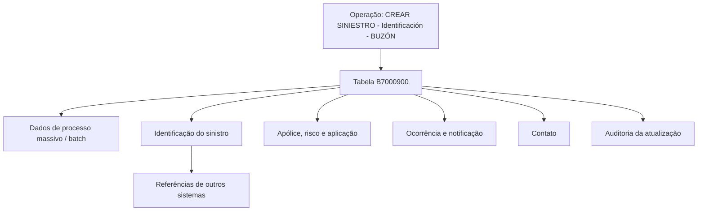

# Criar Sinistro — Identificação — Buzón: Modelo de Dados Técnico

## 1. Metadados do Documento
- **Arquivo de Origem:** Não identificado no conteúdo extraído
- **Tipo de Documento:** Especificação Técnica
- **Domínio / Sistema:** Reef / Mapfre — operação “CREAR SINIESTRO - Identificación - BUZÓN”
- **Público-Alvo:** Desenvolvedores, Arquitetos, Operação e Analistas Funcionais
- **Data/Versão Identificada:** Não identificada

---

## 2. Resumo Executivo & Contexto de Negócio

O documento descreve o modelo de dados envolvido na operação **“CREAR SINIESTRO - Identificación - BUZÓN”**, relacionada à criação de um sinistro e à manutenção de seus dados fixos em um buzón. O conteúdo está disponível na documentação Reef, identificada visualmente como “DOCUMENTACIÓN Reef” e vinculada ao contexto Mapfre.

A entidade de dados explicitamente identificada é a tabela **B7000900**, descrita como **“BUZON DE DATOS FIJOS DEL SINIESTRO”**. Essa tabela concentra atributos necessários para registrar informações de processamento em lote, identificação do sinistro, apólice, risco, ocorrência, notificação, contato e atualização da linha.

A especificação apresenta, para cada coluna, se o campo muda de valor, o valor/motivo informado como `N.A.`, a obrigatoriedade e um comentário funcional em espanhol. Os campos obrigatórios abrangem dados de processamento, companhia, identificação do sinistro, apólice, risco, aplicação, ocorrência, notificação, causa, auditoria e número do processo massivo.

O documento não especifica contratos de API, métodos HTTP, regras de persistência, tipos físicos de dados, tamanhos de campos, chaves primárias, índices, relacionamentos com outras tabelas ou validações detalhadas. Também não explica o comportamento dos indicadores de alteração de valor, além de informar `S` para todos os campos listados.

---

## 3. Arquitetura, Componentes & Tecnologias Envolvidas

Os elementos explicitamente citados são:

- **Reef:** repositório ou contexto de documentação em que o artefato está publicado.
- **Mapfre / Mapfredocument:** contexto corporativo visualmente associado à documentação.
- **Operação:** `CREAR SINIESTRO - Identificación - BUZÓN`.
- **Tabela B7000900:** buzón de dados fixos do sinistro.
- **Processo massivo / batch:** mecanismo mencionado por campos de data de tratamento, tipo de movimento batch e número do processo massivo.
- **Outros sistemas:** origem ou referência externa associada aos campos de número de sinistro de referência.



**Nota de Análise:** O documento identifica a tabela B7000900 e seus campos, mas não detalha componentes de aplicação, serviços, APIs, mecanismos de integração, tecnologias de banco de dados, protocolos ou contratos JSON.

---

## 4. Regras de Negócio, Especificações Funcionais & Processos

### Operação documentada

A operação é denominada **“CREAR SINIESTRO - Identificación - BUZÓN”**. A documentação declara que as tabelas que intervêm na operação incluem a tabela **B7000900**, denominada **“BUZON DE DATOS FIJOS DEL SINIESTRO”**.

### Regras de obrigatoriedade extraídas

Os seguintes atributos são marcados como obrigatórios (`SI`):

1. `FEC_TRATAMIENTO`: data em que é realizado o processo massivo.
2. `TIP_MVTO_BATCH_STRO`: tipo do movimento batch.
3. `COD_CIA`: companhia.
4. `NUM_SINI`: sinistro.
5. `NUM_SINI_REF`: sinistro de referência de outros sistemas.
6. `NUM_POLIZA`: apólice.
7. `NUM_RIESGO`: risco.
8. `NUM_APLI`: número de aplicação.
9. `FEC_SINI`: data de ocorrência do sinistro.
10. `FEC_DENU_SINI`: data de notificação ou denúncia do sinistro.
11. `COD_CAUSA_SINI`: causa do sinistro.
12. `COD_USR`: usuário que atualizou a linha.
13. `FEC_ACTU`: data de atualização da linha.
14. `NUM_ORDEN`: número do processo massivo.

### Dados opcionais extraídos

Os campos abaixo são marcados como não obrigatórios (`NO`):

- Hora de ocorrência do sinistro.
- Evento catastrófico que originou o sinistro.
- Nome, sobrenome, país/zona/número de telefone, documento, relação e e-mail da pessoa de contato.
- Indicador de culpabilidade do sinistro.
- Hora da denúncia do sinistro.
- Valor inicial de estimativa do sinistro.
- Sinistro de referência de outros sistemas para modificação.
- Meios de contato móvel, telefone e e-mail.

### Restrições e lacunas documentais

- Todos os campos exibidos possuem `S` na coluna **CAMBIA VALOR**.
- Todos os campos exibidos possuem `N.A.` na coluna **MOTIVO/VALOR**.
- O documento não define os valores permitidos para `MCA_CULPABLE`.
- O documento não define o formato de datas, horários, identificadores, documentos, telefone, e-mail ou valores monetários.
- O documento não descreve quando usar `NUM_SINI_REF` em relação a `NUM_SINI_REF_MOD`.
- O documento não detalha a taxonomia ou valores aceitos para `COD_CAUSA_SINI`, `COD_EVENTO`, `TIP_MVTO_BATCH_STRO`, `TIP_DOCUM_CONTACTO` e `TIP_RELACION`.

---

## 5. Tabelas de Parâmetros, Ambientes e Estruturas de Dados

| Item / Parâmetro | Descrição / Função | Tipo / Valores / Formato | Ambiente / Observações |
| :--- | :--- | :--- | :--- |
| `B7000900` | Buzón de dados fixos do sinistro | Tabela | Entidade de dados da operação “CREAR SINIESTRO - Identificación - BUZÓN” |
| `FEC_TRATAMIENTO` | Data em que se realiza o processo massivo | Não especificado | Obrigatório: `SI`; muda valor: `S`; motivo/valor: `N.A.` |
| `TIP_MVTO_BATCH_STRO` | Tipo do movimento batch | Não especificado | Obrigatório: `SI`; muda valor: `S`; motivo/valor: `N.A.` |
| `COD_CIA` | Companhia | Não especificado | Obrigatório: `SI`; muda valor: `S`; motivo/valor: `N.A.` |
| `NUM_SINI` | Sinistro | Não especificado | Obrigatório: `SI`; muda valor: `S`; motivo/valor: `N.A.` |
| `NUM_SINI_REF` | Sinistro de referência de outros sistemas | Não especificado | Obrigatório: `SI`; muda valor: `S`; motivo/valor: `N.A.` |
| `NUM_POLIZA` | Apólice | Não especificado | Obrigatório: `SI`; muda valor: `S`; motivo/valor: `N.A.` |
| `NUM_RIESGO` | Risco | Não especificado | Obrigatório: `SI`; muda valor: `S`; motivo/valor: `N.A.` |
| `NUM_APLI` | Número de aplicação | Não especificado | Obrigatório: `SI`; muda valor: `S`; motivo/valor: `N.A.` |
| `FEC_SINI` | Data de ocorrência do sinistro | Não especificado | Obrigatório: `SI`; muda valor: `S`; motivo/valor: `N.A.` |
| `FEC_DENU_SINI` | Data de notificação ou denúncia do sinistro | Não especificado | Obrigatório: `SI`; muda valor: `S`; motivo/valor: `N.A.` |
| `HORA_SINI` | Hora de ocorrência do sinistro | Não especificado | Obrigatório: `NO`; muda valor: `S`; motivo/valor: `N.A.` |
| `COD_CAUSA_SINI` | Causa do sinistro | Não especificado | Obrigatório: `SI`; muda valor: `S`; motivo/valor: `N.A.` |
| `COD_EVENTO` | Evento catastrófico que originou o sinistro | Não especificado | Obrigatório: `NO`; muda valor: `S`; motivo/valor: `N.A.` |
| `NOM_CONTACTO` | Pessoa de contato | Não especificado | Obrigatório: `NO`; muda valor: `S`; motivo/valor: `N.A.` |
| `APE_CONTACTO` | Sobrenomes do contato | Não especificado | Obrigatório: `NO`; muda valor: `S`; motivo/valor: `N.A.` |
| `TEL_PAIS_CONTACTO` | País do telefone da pessoa de contato | Não especificado | Obrigatório: `NO`; muda valor: `S`; motivo/valor: `N.A.` |
| `TEL_ZONA_CONTACTO` | Zona do telefone da pessoa de contato | Não especificado | Obrigatório: `NO`; muda valor: `S`; motivo/valor: `N.A.` |
| `TEL_NUMERO_CONTACTO` | Número de telefone da pessoa de contato | Não especificado | Obrigatório: `NO`; muda valor: `S`; motivo/valor: `N.A.` |
| `MCA_CULPABLE` | Indica se é ou não culpável pelo sinistro | Não especificado | Obrigatório: `NO`; muda valor: `S`; motivo/valor: `N.A.` |
| `COD_USR` | Usuário que atualizou a linha | Não especificado | Obrigatório: `SI`; muda valor: `S`; motivo/valor: `N.A.` |
| `FEC_ACTU` | Data de atualização da linha | Não especificado | Obrigatório: `SI`; muda valor: `S`; motivo/valor: `N.A.` |
| `TIP_DOCUM_CONTACTO` | Tipo de documento da pessoa de contato | Não especificado | Obrigatório: `NO`; muda valor: `S`; motivo/valor: `N.A.` |
| `COD_DOCUM_CONTACTO` | Documento da pessoa de contato | Não especificado | Obrigatório: `NO`; muda valor: `S`; motivo/valor: `N.A.` |
| `TIP_RELACION` | Relação com o segurado | Não especificado | Obrigatório: `NO`; muda valor: `S`; motivo/valor: `N.A.` |
| `EMAIL_CONTACTO` | Endereço de e-mail da pessoa de contato | Não especificado | Obrigatório: `NO`; muda valor: `S`; motivo/valor: `N.A.` |
| `HORA_DENU_SINI` | Hora da denúncia do sinistro | Não especificado | Obrigatório: `NO`; muda valor: `S`; motivo/valor: `N.A.` |
| `NUM_ORDEN` | Número do processo massivo | Não especificado | Obrigatório: `SI`; muda valor: `S`; motivo/valor: `N.A.` |
| `IMP_VAL_INI_SINI` | Valor da estimativa da valoração do sinistro | Não especificado | Obrigatório: `NO`; muda valor: `S`; motivo/valor: `N.A.` |
| `NUM_SINI_REF_MOD` | Sinistro de referência de outros sistemas para modificação | Não especificado | Obrigatório: `NO`; muda valor: `S`; motivo/valor: `N.A.` |
| `TXT_CNH_CLR` | Meio de contato móvel | Não especificado | Obrigatório: `NO`; muda valor: `S`; motivo/valor: `N.A.` |
| `TXT_CNH_TLP` | Meio de contato telefone | Não especificado | Obrigatório: `NO`; muda valor: `S`; motivo/valor: `N.A.` |
| `TXT_CNH_EML` | Meio de contato e-mail | Não especificado | Obrigatório: `NO`; muda valor: `S`; motivo/valor: `N.A.` |

---

## 6. Bateria de Perguntas & Respostas para RAG (FAQ Sintético)

### P1: Qual tabela armazena os dados fixos do sinistro na operação “CREAR SINIESTRO - Identificación - BUZÓN”?
**R:** A tabela identificada pelo documento é a `B7000900`, descrita como **“BUZON DE DATOS FIJOS DEL SINIESTRO”**. O documento a apresenta como a tabela envolvida na operação de criação de sinistro, identificação e buzón.

### P2: Quais campos obrigatórios identificam o sinistro, a apólice, o risco e a aplicação?
**R:** Os campos obrigatórios são `NUM_SINI` para o sinistro, `NUM_POLIZA` para a apólice, `NUM_RIESGO` para o risco e `NUM_APLI` para o número de aplicação. Todos estão marcados como obrigatórios (`SI`) na tabela B7000900.

### P3: Quais informações do processo massivo ou batch são obrigatórias na tabela B7000900?
**R:** O documento marca como obrigatórios `FEC_TRATAMIENTO`, correspondente à data em que é realizado o processo massivo; `TIP_MVTO_BATCH_STRO`, correspondente ao tipo do movimento batch; e `NUM_ORDEN`, correspondente ao número do processo massivo.

### P4: Quais datas obrigatórias devem ser informadas para um sinistro?
**R:** O documento marca como obrigatórios `FEC_TRATAMIENTO`, `FEC_SINI`, `FEC_DENU_SINI` e `FEC_ACTU`. Elas correspondem, respectivamente, à data de execução do processo massivo, à data de ocorrência do sinistro, à data de notificação ou denúncia do sinistro e à data de atualização da linha.

### P5: A hora de ocorrência e a hora de denúncia do sinistro são obrigatórias?
**R:** Não. `HORA_SINI`, que representa a hora de ocorrência do sinistro, e `HORA_DENU_SINI`, que representa a hora da denúncia do sinistro, estão marcadas como não obrigatórias (`NO`).

### P6: O que representa o campo NUM_SINI_REF?
**R:** `NUM_SINI_REF` representa o sinistro de referência de outros sistemas. O documento o marca como obrigatório (`SI`). A especificação não detalha quais outros sistemas são envolvidos nem a regra para composição ou validação desse identificador.

### P7: Qual campo deve ser usado para registrar um sinistro de referência destinado à modificação?
**R:** O campo é `NUM_SINI_REF_MOD`, descrito como “sinistro de referência de outros sistemas para modificação”. Esse campo é não obrigatório (`NO`). O documento não esclarece a diferença operacional detalhada entre `NUM_SINI_REF` e `NUM_SINI_REF_MOD`.

### P8: Quais dados de contato podem ser registrados na tabela B7000900?
**R:** A tabela permite registrar nome (`NOM_CONTACTO`), sobrenome (`APE_CONTACTO`), país, zona e número de telefone (`TEL_PAIS_CONTACTO`, `TEL_ZONA_CONTACTO`, `TEL_NUMERO_CONTACTO`), tipo e número de documento (`TIP_DOCUM_CONTACTO`, `COD_DOCUM_CONTACTO`), relação com o segurado (`TIP_RELACION`), e-mail (`EMAIL_CONTACTO`) e meios de contato móvel, telefone e e-mail (`TXT_CNH_CLR`, `TXT_CNH_TLP`, `TXT_CNH_EML`). Todos esses campos são não obrigatórios.

### P9: Onde é registrada a causa do sinistro?
**R:** A causa do sinistro é registrada no campo `COD_CAUSA_SINI`, marcado como obrigatório (`SI`). O documento não fornece o catálogo, domínio de valores ou regras de codificação para esse campo.

### P10: Como a tabela registra o evento catastrófico relacionado ao sinistro?
**R:** O campo `COD_EVENTO` é descrito como o evento catastrófico que originou o sinistro. O preenchimento de `COD_EVENTO` é não obrigatório (`NO`) e o documento não especifica valores permitidos ou relação com `COD_CAUSA_SINI`.

### P11: Quais campos registram auditoria de atualização da linha?
**R:** A auditoria é registrada por `COD_USR`, que identifica o usuário que atualizou a linha, e `FEC_ACTU`, que identifica a data de atualização da linha. Ambos são obrigatórios (`SI`).

### P12: O documento especifica o formato dos campos de data, telefone, e-mail ou valor estimado?
**R:** Não. O documento descreve funcionalmente os campos, sua obrigatoriedade, a indicação `S` para mudança de valor e `N.A.` para motivo/valor, mas não apresenta tipos de dados físicos, formatos, tamanhos, máscaras, regras de validação ou valores permitidos.

---

## 7. Glossário de Termos, Siglas & Conceitos-Chave

- **B7000900:** tabela denominada “BUZON DE DATOS FIJOS DEL SINIESTRO”.
- **Buzón:** termo utilizado no documento para a estrutura de dados fixos do sinistro; não há definição adicional.
- **COD_CIA:** código ou atributo da companhia.
- **COD_CAUSA_SINI:** campo de causa do sinistro.
- **COD_DOCUM_CONTACTO:** documento da pessoa de contato.
- **COD_EVENTO:** evento catastrófico que originou o sinistro.
- **COD_USR:** usuário que atualizou a linha.
- **FEC_ACTU:** data de atualização da linha.
- **FEC_DENU_SINI:** data de notificação ou denúncia do sinistro.
- **FEC_SINI:** data de ocorrência do sinistro.
- **FEC_TRATAMIENTO:** data em que é realizado o processo massivo.
- **IMP_VAL_INI_SINI:** valor da estimativa da valoração do sinistro.
- **MCA_CULPABLE:** indicador de se o sinistro é ou não culpável.
- **NUM_APLI:** número de aplicação.
- **NUM_ORDEN:** número do processo massivo.
- **NUM_POLIZA:** número ou identificador da apólice.
- **NUM_RIESGO:** número ou identificador do risco.
- **NUM_SINI:** número ou identificador do sinistro.
- **NUM_SINI_REF:** sinistro de referência de outros sistemas.
- **NUM_SINI_REF_MOD:** sinistro de referência de outros sistemas para modificação.
- **Reef:** contexto ou portal de documentação identificado no documento.
- **Siniestro:** sinistro.
- **TIP_DOCUM_CONTACTO:** tipo de documento da pessoa de contato.
- **TIP_MVTO_BATCH_STRO:** tipo do movimento batch relacionado ao sinistro.
- **TIP_RELACION:** relação com o segurado.
- **TXT_CNH_CLR:** meio de contato móvel.
- **TXT_CNH_EML:** meio de contato por e-mail.
- **TXT_CNH_TLP:** meio de contato por telefone.

---

## 8. Notas Críticas, Riscos & Limitações

- O artefato contém a indicação visual **“EN CONSTRUCCIÓN”**, sugerindo que o conteúdo pode estar incompleto.
- Não foram identificados tipos de dados, comprimento, precisão, formato, domínio de valores, chaves, índices ou relacionamentos da tabela `B7000900`.
- Não há descrição de APIs, operações HTTP, filas, eventos, microsserviços, contratos de integração ou fluxos de erro.
- Os valores `S` em **CAMBIA VALOR** aparecem para todos os campos, mas o documento não explica a semântica operacional desse indicador.
- Os valores `N.A.` em **MOTIVO/VALOR** aparecem para todos os campos, sem detalhamento adicional.
- A documentação não especifica como tratar inconsistências entre `NUM_SINI`, `NUM_SINI_REF` e `NUM_SINI_REF_MOD`.
- Não há explicação sobre os valores aceitos para o indicador `MCA_CULPABLE`.
- Não há catálogo nem regra de validação documentada para códigos como `COD_CIA`, `COD_CAUSA_SINI`, `COD_EVENTO`, `TIP_DOCUM_CONTACTO`, `TIP_MVTO_BATCH_STRO` e `TIP_RELACION`.

---

## 9. Conteúdo Bruto Estruturado (Referência Fiel)

```text
--- [PÁGINA 1 DE 3] ---

Imagen LOGO
EN CONSTRUCCIÓN
CREAR Siniestro - Identicación - buzón (visión técnica){#titulo}
Modelo de datos involucrado
Las tablas que intervienen en esta operación son:
OPERACIÓN
CREAR SINIESTRO - Identificación - BUZÓN
TABLA DESCRIPCIÓN
B7000900 BUZON DE DATOS FIJOS DEL SINIESTRO
COLUMNA CAMBIA
VALOR
MOTIVO/VALOR OBLIGATORIA COMENTARIO
FEC_TRATAMIENTO S N.A. SI FECHA EN LA QUE SE REALIZA EL
PROCESO MASIVO
TIP_MVTO_BATCH_STRO S N.A. SI TIPO DEL MOVIMIENTO BATCH
COD_CIA S N.A. SI COMPANIA
NUM_SINI S N.A. SI SINIESTRO
NUM_SINI_REF S N.A. SI SINIESTRO REFERENCIA DE OTROS
SISTEMAS.
NUM_POLIZA S N.A. SI POLIZA
NUM_RIESGO S N.A. SI RIESGO
NUM_APLI S N.A. SI NUMERO DE APLICACION
Documentation / DOCUMENTACIÓN Reef
DOCUMENTACIÓN Reef
Mapfredocument
DOCUMENTACIÓN Reef
Owner
user:agonzalez_mapfre.com
Lifecycle
Approved Source
 /
VL
Buscar Inicio Soluciones Arquitecturas APIs Componentes Cloud Documentación Zeus Reef Ayuda
ES

--- [PÁGINA 2 DE 3] ---

COLUMNA CAMBIA
VALOR
MOTIVO/VALOR OBLIGATORIA COMENTARIO
FEC_SINI S N.A. SI FECHA DE OCURRENCIA DEL SINIESTRO
FEC_DENU_SINI S N.A. SI FECHA DE NOTIFICACION, DENUNCIA DEL
SINIESTRO.
HORA_SINI S N.A. NO HORA DE OCURRENCIA DEL SINIESTRO.
COD_CAUSA_SINI S N.A. SI CAUSA DEL SINIESTRO
COD_EVENTO S N.A. NO EVENTO CATRASTROFICO QUE ORIGINO
EL SINIESTRO
NOM_CONTACTO S N.A. NO PERSONA DE CONTACTO
APE_CONTACTO S N.A. NO APELLIDOS DEL CONTACTO
TEL_PAIS_CONTACTO S N.A. NO PAIS DEL TELEFEONO PERSONA DE
CONTACTO
TEL_ZONA_CONTACTO S N.A. NO ZONA DEL TELEFEONO PERSONA DE
CONTACTO
TEL_NUMERO_CONTACTO S N.A. NO NUMERO DE TELEFONO PERSONA DE
CONTACTO
MCA_CULPABLE S N.A. NO SI ES O NO CULPABLE DEL SINIESTRO
COD_USR S N.A. SI USUARIO QUE ACTUALIZO LA FILA
FEC_ACTU S N.A. SI FECHA DE ACTUALIZACION DE LA FILA
TIP_DOCUM_CONTACTO S N.A. NO TIPO DE DOCUMENTO DE LA PERSONA DE
CONTACTO
COD_DOCUM_CONTACTO S N.A. NO DOCUMENTO DE LA PERSONA DE
CONTACTO
TIP_RELACION S N.A. NO RELACION CON EL ASEGURADO
EMAIL_CONTACTO S N.A. NO DIRECCION DE CORREO ELECTRONICO DE
LA PERSONA DE CONTACTO
HORA_DENU_SINI S N.A. NO HORA DE LA DENUNCIA DEL SINIESTRO
NUM_ORDEN S N.A. SI NUMERO DEL PROCESO MASIVO
IMP_VAL_INI_SINI S N.A. NO IMPORTE DE ESTIMACIÓN DE LA
VALORACION DEL SINIESTRO
NUM_SINI_REF_MOD S N.A. NO SINIESTRO DE REFERENCIA DE OTROS
SISTEMAS PARA MODIFICACION

--- [PÁGINA 3 DE 3] ---

COLUMNA CAMBIA
VALOR
MOTIVO/VALOR OBLIGATORIA COMENTARIO
TXT_CNH_CLR S N.A. NO MEDIO CONTACTO MOVIL
TXT_CNH_TLP S N.A. NO MEDIO CONTACTO TELEFONO
TXT_CNH_EML S N.A. NO MEDIO CONTACTO EMAIL
```
