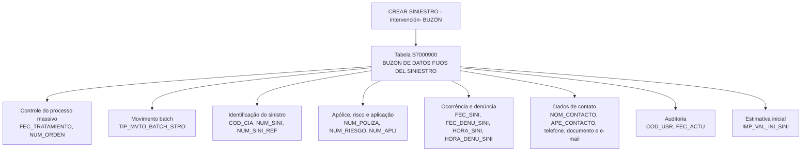

# Criar Sinistro – Intervenção–Buzón: Modelo de Dados Técnico

## 1. Metadados do Documento
- **Arquivo de Origem:** Não identificado no conteúdo fornecido
- **Tipo de Documento:** Especificação Técnica
- **Domínio / Sistema:** Reef / Mapfre — operação “CREAR SINIESTRO - Intervención- BUZÓN”
- **Público-Alvo:** Desenvolvedores, Arquitetos, Operação
- **Data/Versão Identificada:** Não identificada

---

## 2. Resumo Executivo & Contexto de Negócio

O documento descreve o modelo de dados envolvido na operação **“CREAR SINIESTRO - Intervención- BUZÓN”**, relacionada à criação de sinistros por meio de uma intervenção associada a um buzón. A documentação está identificada no contexto de **Reef**, **Mapfre** e “Mapfredocument”.

A principal estrutura de dados mencionada é a tabela **B7000900**, descrita como **“BUZON DE DATOS FIJOS DEL SINIESTRO”**. A tabela armazena informações de controle do processamento massivo, identificação do sinistro, dados de apólice e risco, datas e horas do evento, causa, contato e estimativa inicial do sinistro.

A especificação apresenta, para cada coluna, os indicadores “CAMBIA VALOR”, “MOTIVO/VALOR” e “OBLIGATORIA”, além de um comentário funcional. Para todas as colunas documentadas, o indicador **CAMBIA VALOR** é `S` e o indicador **MOTIVO/VALOR** é `N.A.`.

O documento permite identificar campos obrigatórios e não obrigatórios, mas não fornece detalhes sobre tipos físicos de banco de dados, tamanhos, chaves primárias, chaves estrangeiras, contratos de APIs, métodos HTTP, regras de persistência ou comportamento de erro.

---

## 3. Arquitetura, Componentes & Tecnologias Envolvidas

### Componentes identificados

| Componente / Termo | Papel identificado no documento | Observações |
| :--- | :--- | :--- |
| Reef | Contexto de documentação | O conteúdo apresenta referências a “DOCUMENTACIÓN Reef”. |
| Mapfre | Contexto corporativo/documental | O conteúdo apresenta “Mapfredocument”. |
| CREAR SINIESTRO - Intervención- BUZÓN | Operação documentada | Operação relacionada à criação de sinistro e buzón. |
| B7000900 | Tabela de dados | Descrita como “BUZON DE DATOS FIJOS DEL SINIESTRO”. |
| Processo massivo | Processo operacional referenciado | Associado aos campos `FEC_TRATAMIENTO` e `NUM_ORDEN`. |
| Movimento batch de sinistro | Informação de processamento | Associada ao campo `TIP_MVTO_BATCH_STRO`. |



> **Nota de Análise:** o documento identifica a operação e a tabela B7000900, mas não detalha serviços, microsserviços, APIs, tecnologias de implementação, infraestrutura, bancos de dados, métodos HTTP ou contratos JSON.

---

## 4. Regras de Negócio, Especificações Funcionais & Processos

### Regras de obrigatoriedade

1. Os campos de controle do processo massivo `FEC_TRATAMIENTO`, `TIP_MVTO_BATCH_STRO` e `NUM_ORDEN` são obrigatórios.
2. A identificação organizacional e do sinistro requer os campos obrigatórios `COD_CIA` e `NUM_SINI`.
3. O campo `NUM_SINI_REF` é obrigatório e representa o sinistro de referência proveniente de outros sistemas.
4. Os campos `NUM_POLIZA`, `NUM_RIESGO` e `NUM_APLI` são obrigatórios para identificar apólice, risco e número de aplicação.
5. A data de ocorrência `FEC_SINI`, a data de notificação/denúncia `FEC_DENU_SINI` e a causa `COD_CAUSA_SINI` são obrigatórias.
6. O campo `COD_USR`, correspondente ao usuário que atualizou a linha, é obrigatório.
7. O campo `FEC_ACTU`, correspondente à data de atualização da linha, é obrigatório.
8. A hora de ocorrência, a hora de denúncia, o evento catastrófico, os dados de contato, os meios de contato, o valor inicial estimado e o sinistro de referência para modificação são identificados como não obrigatórios.
9. Para todas as colunas documentadas, o valor de `CAMBIA VALOR` é `S`.
10. Para todas as colunas documentadas, o valor de `MOTIVO/VALOR` é `N.A.`.

### Estrutura funcional inferível pela documentação

A operação registra dados fixos do sinistro no buzón B7000900. O registro contempla: controle de execução massiva; identificação da companhia e do sinistro; dados de apólice e risco; datas de ocorrência e denúncia; classificação da causa; dados de contato; informações de auditoria; e valor estimado inicial.

> **Nota de Análise:** a documentação não descreve uma sequência operacional explícita de criação, validação, atualização, confirmação ou rejeição do sinistro. Também não informa regras de cálculo, regras condicionais, dependências entre campos ou códigos permitidos para causas, eventos, relações e documentos.

---

## 5. Tabelas de Parâmetros, Ambientes e Estruturas de Dados

### Tabela principal

| Item / Parâmetro | Descrição / Função | Tipo / Valores / Formato | Ambiente / Observações |
| :--- | :--- | :--- | :--- |
| `B7000900` | BUZON DE DATOS FIJOS DEL SINIESTRO | Tabela | Associada à operação “CREAR SINIESTRO - Intervención- BUZÓN”. |

### Colunas documentadas da tabela B7000900

| Item / Parâmetro | Descrição / Função | Tipo / Valores / Formato | Ambiente / Observações |
| :--- | :--- | :--- | :--- |
| `FEC_TRATAMIENTO` | Data em que é realizado o processo massivo | Não especificado | Muda valor: `S`; Motivo/Valor: `N.A.`; Obrigatória: Sim. |
| `TIP_MVTO_BATCH_STRO` | Tipo do movimento batch | Não especificado | Muda valor: `S`; Motivo/Valor: `N.A.`; Obrigatória: Sim. |
| `COD_CIA` | Companhia | Não especificado | Muda valor: `S`; Motivo/Valor: `N.A.`; Obrigatória: Sim. |
| `NUM_SINI` | Sinistro | Não especificado | Muda valor: `S`; Motivo/Valor: `N.A.`; Obrigatória: Sim. |
| `NUM_SINI_REF` | Sinistro de referência de outros sistemas | Não especificado | Muda valor: `S`; Motivo/Valor: `N.A.`; Obrigatória: Sim. |
| `NUM_POLIZA` | Apólice | Não especificado | Muda valor: `S`; Motivo/Valor: `N.A.`; Obrigatória: Sim. |
| `NUM_RIESGO` | Risco | Não especificado | Muda valor: `S`; Motivo/Valor: `N.A.`; Obrigatória: Sim. |
| `NUM_APLI` | Número de aplicação | Não especificado | Muda valor: `S`; Motivo/Valor: `N.A.`; Obrigatória: Sim. |
| `FEC_SINI` | Data de ocorrência do sinistro | Não especificado | Muda valor: `S`; Motivo/Valor: `N.A.`; Obrigatória: Sim. |
| `FEC_DENU_SINI` | Data de notificação ou denúncia do sinistro | Não especificado | Muda valor: `S`; Motivo/Valor: `N.A.`; Obrigatória: Sim. |
| `HORA_SINI` | Hora de ocorrência do sinistro | Não especificado | Muda valor: `S`; Motivo/Valor: `N.A.`; Obrigatória: Não. |
| `COD_CAUSA_SINI` | Causa do sinistro | Não especificado | Muda valor: `S`; Motivo/Valor: `N.A.`; Obrigatória: Sim. |
| `COD_EVENTO` | Evento catastrófico que originou o sinistro | Não especificado | Muda valor: `S`; Motivo/Valor: `N.A.`; Obrigatória: Não. |
| `NOM_CONTACTO` | Pessoa de contato | Não especificado | Muda valor: `S`; Motivo/Valor: `N.A.`; Obrigatória: Não. |
| `APE_CONTACTO` | Sobrenomes do contato | Não especificado | Muda valor: `S`; Motivo/Valor: `N.A.`; Obrigatória: Não. |
| `TEL_PAIS_CONTACTO` | País do telefone da pessoa de contato | Não especificado | Muda valor: `S`; Motivo/Valor: `N.A.`; Obrigatória: Não. |
| `TEL_ZONA_CONTACTO` | Zona do telefone da pessoa de contato | Não especificado | Muda valor: `S`; Motivo/Valor: `N.A.`; Obrigatória: Não. |
| `TEL_NUMERO_CONTACTO` | Número de telefone da pessoa de contato | Não especificado | Muda valor: `S`; Motivo/Valor: `N.A.`; Obrigatória: Não. |
| `MCA_CULPABLE` | Indica se é ou não culpável pelo sinistro | Não especificado | Muda valor: `S`; Motivo/Valor: `N.A.`; Obrigatória: Não. |
| `COD_USR` | Usuário que atualizou a linha | Não especificado | Muda valor: `S`; Motivo/Valor: `N.A.`; Obrigatória: Sim. |
| `FEC_ACTU` | Data de atualização da linha | Não especificado | Muda valor: `S`; Motivo/Valor: `N.A.`; Obrigatória: Sim. |
| `TIP_DOCUM_CONTACTO` | Tipo de documento da pessoa de contato | Não especificado | Muda valor: `S`; Motivo/Valor: `N.A.`; Obrigatória: Não. |
| `COD_DOCUM_CONTACTO` | Documento da pessoa de contato | Não especificado | Muda valor: `S`; Motivo/Valor: `N.A.`; Obrigatória: Não. |
| `TIP_RELACION` | Relação com o segurado | Não especificado | Muda valor: `S`; Motivo/Valor: `N.A.`; Obrigatória: Não. |
| `EMAIL_CONTACTO` | Endereço de correio eletrônico da pessoa de contato | Não especificado | Muda valor: `S`; Motivo/Valor: `N.A.`; Obrigatória: Não. |
| `HORA_DENU_SINI` | Hora da denúncia do sinistro | Não especificado | Muda valor: `S`; Motivo/Valor: `N.A.`; Obrigatória: Não. |
| `NUM_ORDEN` | Número do processo massivo | Não especificado | Muda valor: `S`; Motivo/Valor: `N.A.`; Obrigatória: Sim. |
| `IMP_VAL_INI_SINI` | Valor da estimativa da valoração do sinistro | Não especificado | Muda valor: `S`; Motivo/Valor: `N.A.`; Obrigatória: Não. |
| `NUM_SINI_REF_MOD` | Sinistro de referência de outros sistemas para modificação | Não especificado | Muda valor: `S`; Motivo/Valor: `N.A.`; Obrigatória: Não. |
| `TXT_CNH_CLR` | Meio de contato móvel | Não especificado | Muda valor: `S`; Motivo/Valor: `N.A.`; Obrigatória: Não. |
| `TXT_CNH_TLP` | Meio de contato telefone | Não especificado | Muda valor: `S`; Motivo/Valor: `N.A.`; Obrigatória: Não. |
| `TXT_CNH_EML` | Meio de contato e-mail | Não especificado | Muda valor: `S`; Motivo/Valor: `N.A.`; Obrigatória: Não. |

---

## 6. Bateria de Perguntas & Respostas para RAG (FAQ Sintético)

### P1: Qual tabela armazena os dados fixos do sinistro na operação “CREAR SINIESTRO - Intervención- BUZÓN”?
**R:** A tabela identificada no documento é a `B7000900`, descrita como **“BUZON DE DATOS FIJOS DEL SINIESTRO”**. A documentação a associa diretamente à operação “CREAR SINIESTRO - Intervención- BUZÓN”.

### P2: Quais campos obrigatórios identificam a companhia e o sinistro?
**R:** Os campos obrigatórios são `COD_CIA`, que representa a companhia, e `NUM_SINI`, que representa o sinistro. O campo `NUM_SINI_REF`, destinado ao sinistro de referência de outros sistemas, também é obrigatório.

### P3: Quais campos registram a data e a hora de ocorrência do sinistro?
**R:** O campo `FEC_SINI` registra a data de ocorrência do sinistro e é obrigatório. O campo `HORA_SINI` registra a hora de ocorrência do sinistro e não é obrigatório.

### P4: Qual campo registra a data de notificação ou denúncia do sinistro?
**R:** O campo `FEC_DENU_SINI` registra a data de notificação ou denúncia do sinistro e é obrigatório. A hora da denúncia é registrada pelo campo `HORA_DENU_SINI`, que não é obrigatório.

### P5: Como o documento registra a causa e o evento catastrófico do sinistro?
**R:** A causa do sinistro é registrada pelo campo obrigatório `COD_CAUSA_SINI`. O evento catastrófico que originou o sinistro é registrado pelo campo `COD_EVENTO`, que não é obrigatório.

### P6: Quais campos de processo massivo são obrigatórios na tabela B7000900?
**R:** Os campos obrigatórios relacionados ao processo massivo são `FEC_TRATAMIENTO`, que representa a data de realização do processo massivo; `TIP_MVTO_BATCH_STRO`, que representa o tipo do movimento batch; e `NUM_ORDEN`, que representa o número do processo massivo.

### P7: Quais dados de contato podem ser registrados para a pessoa de contato?
**R:** A tabela contempla nome (`NOM_CONTACTO`), sobrenomes (`APE_CONTACTO`), país, zona e número de telefone (`TEL_PAIS_CONTACTO`, `TEL_ZONA_CONTACTO`, `TEL_NUMERO_CONTACTO`), tipo e código de documento (`TIP_DOCUM_CONTACTO`, `COD_DOCUM_CONTACTO`), relação com o segurado (`TIP_RELACION`) e e-mail (`EMAIL_CONTACTO`). Todos esses campos são não obrigatórios.

### P8: Onde é registrada a informação de culpabilidade do sinistro?
**R:** A informação é registrada no campo `MCA_CULPABLE`, descrito como indicador de se é ou não culpável pelo sinistro. O documento indica que esse campo não é obrigatório.

### P9: Quais campos fornecem rastreabilidade de atualização do registro?
**R:** O campo obrigatório `COD_USR` identifica o usuário que atualizou a linha. O campo obrigatório `FEC_ACTU` informa a data de atualização da linha.

### P10: Existe um campo para valor inicial estimado do sinistro?
**R:** Sim. O campo `IMP_VAL_INI_SINI` registra o importe da estimativa da valoração do sinistro. O documento indica que esse campo não é obrigatório.

### P11: Como são tratados os campos de referência externa do sinistro?
**R:** O campo obrigatório `NUM_SINI_REF` registra o sinistro de referência proveniente de outros sistemas. O campo não obrigatório `NUM_SINI_REF_MOD` registra o sinistro de referência de outros sistemas para modificação.

### P12: O documento especifica os tipos físicos, tamanhos ou formatos das colunas da tabela B7000900?
**R:** Não. O documento fornece nome de coluna, descrição, indicador de mudança de valor, motivo/valor e obrigatoriedade, mas não informa tipos físicos de dados, tamanhos, máscaras, domínios ou valores permitidos.

---

## 7. Glossário de Termos, Siglas & Conceitos-Chave

- **B7000900:** Tabela denominada “BUZON DE DATOS FIJOS DEL SINIESTRO”.
- **BUZÓN:** Termo usado no nome da operação e na descrição da tabela; o documento não oferece definição adicional.
- **Siniestro:** Sinistro.
- **Póliza:** Apólice.
- **COD_CIA:** Código da companhia.
- **NUM_SINI:** Número ou identificação do sinistro.
- **NUM_SINI_REF:** Sinistro de referência de outros sistemas.
- **NUM_SINI_REF_MOD:** Sinistro de referência de outros sistemas para modificação.
- **NUM_POLIZA:** Número ou identificação da apólice.
- **NUM_RIESGO:** Número ou identificação do risco.
- **NUM_APLI:** Número de aplicação.
- **FEC_TRATAMIENTO:** Data de realização do processo massivo.
- **TIP_MVTO_BATCH_STRO:** Tipo de movimento batch de sinistro.
- **FEC_SINI:** Data de ocorrência do sinistro.
- **FEC_DENU_SINI:** Data de notificação ou denúncia do sinistro.
- **HORA_SINI:** Hora de ocorrência do sinistro.
- **HORA_DENU_SINI:** Hora da denúncia do sinistro.
- **COD_CAUSA_SINI:** Código ou informação da causa do sinistro.
- **COD_EVENTO:** Evento catastrófico que originou o sinistro.
- **MCA_CULPABLE:** Indicador de culpabilidade do sinistro.
- **COD_USR:** Usuário que atualizou a linha.
- **FEC_ACTU:** Data de atualização da linha.
- **IMP_VAL_INI_SINI:** Importe da estimativa de valoração do sinistro.
- **N.A.:** Valor apresentado pelo documento na coluna “MOTIVO/VALOR”; não há expansão ou definição adicional.
- **S:** Valor apresentado pelo documento na coluna “CAMBIA VALOR”; não há definição adicional além da indicação de que o valor muda.

---

## 8. Notas Críticas, Riscos & Limitações

- O arquivo de origem, a data e a versão do documento não foram identificados no conteúdo fornecido.
- A documentação não informa os tipos físicos, comprimentos, precisão numérica, formatos de data, valores de domínio, chaves ou índices da tabela `B7000900`.
- O documento não descreve a semântica técnica dos indicadores `S` em “CAMBIA VALOR” e `N.A.` em “MOTIVO/VALOR”.
- Não há detalhamento de APIs, serviços, microsserviços, contratos de integração, autenticação, autorização, transações ou tratamento de erros.
- Não são definidos os valores válidos para `COD_CAUSA_SINI`, `COD_EVENTO`, `MCA_CULPABLE`, `TIP_DOCUM_CONTACTO` e `TIP_RELACION`.
- Não há regras explícitas de consistência entre o sinistro, sinistro de referência, apólice, risco e número de aplicação.
- A documentação lista meios de contato móvel, telefone e e-mail (`TXT_CNH_CLR`, `TXT_CNH_TLP`, `TXT_CNH_EML`), mas não detalha formato, conteúdo ou relação desses campos com os demais dados de contato.

---

## 9. Conteúdo Bruto Estruturado (Referência Fiel)

```text
--- [PÁGINA 1 DE 3] ---

Imagen LOGO
EN CONSTRUCCIÓN
CREAR Siniestro - Intervencion- buzón (visión técnica)
Modelo de datos involucrado
Las tablas que intervienen en esta operación son:
OPERACIÓN
CREAR SINIESTRO - Intervención- BUZÓN
TABLA DESCRIPCIÓN
B7000900 BUZON DE DATOS FIJOS DEL SINIESTRO
COLUMNA CAMBIA
VALOR
MOTIVO/VALOR OBLIGATORIA COMENTARIO
FEC_TRATAMIENTO S N.A. SI FECHA EN LA QUE SE REALIZA EL
PROCESO MASIVO
TIP_MVTO_BATCH_STRO S N.A. SI TIPO DEL MOVIMIENTO BATCH
COD_CIA S N.A. SI COMPANIA
NUM_SINI S N.A. SI SINIESTRO
NUM_SINI_REF S N.A. SI SINIESTRO REFERENCIA DE OTROS
SISTEMAS.
NUM_POLIZA S N.A. SI POLIZA
NUM_RIESGO S N.A. SI RIESGO
NUM_APLI S N.A. SI NUMERO DE APLICACION
Documentation / DOCUMENTACIÓN Reef
DOCUMENTACIÓN Reef
Mapfredocument
DOCUMENTACIÓN Reef
Owner
user:agonzalez_mapfre.com
Lifecycle
Approved Source
 /
VL
Buscar Inicio Soluciones Arquitecturas APIs Componentes Cloud Documentación Zeus Reef Ayuda
ES


--- [PÁGINA 2 DE 3] ---

COLUMNA CAMBIA
VALOR
MOTIVO/VALOR OBLIGATORIA COMENTARIO
FEC_SINI S N.A. SI FECHA DE OCURRENCIA DEL SINIESTRO
FEC_DENU_SINI S N.A. SI FECHA DE NOTIFICACION, DENUNCIA DEL
SINIESTRO.
HORA_SINI S N.A. NO HORA DE OCURRENCIA DEL SINIESTRO.
COD_CAUSA_SINI S N.A. SI CAUSA DEL SINIESTRO
COD_EVENTO S N.A. NO EVENTO CATRASTROFICO QUE ORIGINO
EL SINIESTRO
NOM_CONTACTO S N.A. NO PERSONA DE CONTACTO
APE_CONTACTO S N.A. NO APELLIDOS DEL CONTACTO
TEL_PAIS_CONTACTO S N.A. NO PAIS DEL TELEFEONO PERSONA DE
CONTACTO
TEL_ZONA_CONTACTO S N.A. NO ZONA DEL TELEFEONO PERSONA DE
CONTACTO
TEL_NUMERO_CONTACTO S N.A. NO NUMERO DE TELEFONO PERSONA DE
CONTACTO
MCA_CULPABLE S N.A. NO SI ES O NO CULPABLE DEL SINIESTRO
COD_USR S N.A. SI USUARIO QUE ACTUALIZO LA FILA
FEC_ACTU S N.A. SI FECHA DE ACTUALIZACION DE LA FILA
TIP_DOCUM_CONTACTO S N.A. NO TIPO DE DOCUMENTO DE LA PERSONA DE
CONTACTO
COD_DOCUM_CONTACTO S N.A. NO DOCUMENTO DE LA PERSONA DE
CONTACTO
TIP_RELACION S N.A. NO RELACION CON EL ASEGURADO
EMAIL_CONTACTO S N.A. NO DIRECCION DE CORREO ELECTRONICO DE
LA PERSONA DE CONTACTO
HORA_DENU_SINI S N.A. NO HORA DE LA DENUNCIA DEL SINIESTRO
NUM_ORDEN S N.A. SI NUMERO DEL PROCESO MASIVO
IMP_VAL_INI_SINI S N.A. NO IMPORTE DE ESTIMACIÓN DE LA
VALORACION DEL SINIESTRO
NUM_SINI_REF_MOD S N.A. NO SINIESTRO DE REFERENCIA DE OTROS
SISTEMAS PARA MODIFICACION


--- [PÁGINA 3 DE 3] ---

COLUMNA CAMBIA
VALOR
MOTIVO/VALOR OBLIGATORIA COMENTARIO
TXT_CNH_CLR S N.A. NO MEDIO CONTACTO MOVIL
TXT_CNH_TLP S N.A. NO MEDIO CONTACTO TELEFONO
TXT_CNH_EML S N.A. NO MEDIO CONTACTO EMAIL
```
