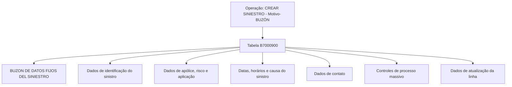

# Criar Sinistro — Motivo/Buzón: Modelo de Dados e Campos da Operação

## 1. Metadados do Documento
- **Arquivo de Origem:** `Não informado; conteúdo bruto fornecido na solicitação`
- **Tipo de Documento:** `Especificação Técnica`
- **Domínio / Sistema:** `Reef / Mapfre — operação de criação de sinistro`
- **Público-Alvo:** `Desenvolvedores, Arquitetos, Analistas Funcionais e Operação`
- **Data/Versão Identificada:** `Não identificada`

---

## 2. Resumo Executivo & Contexto de Negócio

O documento descreve a visão técnica da operação **“CREAR Siniestro - Motivo- buzón”**, associada à criação de um sinistro e ao respectivo tratamento de dados em um buzón. O conteúdo concentra-se no modelo de dados envolvido na operação, identificando a tabela `B7000900` como a estrutura participante.

A tabela `B7000900`, denominada **“BUZON DE DATOS FIJOS DEL SINIESTRO”**, reúne atributos de identificação, referência de apólice e risco, datas e horários do sinistro, causa, evento catastrófico, informações de contato, dados de atualização e controles de processo massivo.

A especificação indica, para cada coluna, se o preenchimento é obrigatório. Entre os dados obrigatórios estão a identificação da companhia, sinistro, apólice, risco, aplicação, datas relevantes, causa do sinistro, usuário atualizador, data de atualização e número do processo massivo. Informações de contato, horário, evento catastrófico, culpabilidade e valor inicial estimado aparecem como não obrigatórias.

O texto não apresenta contratos de API, métodos HTTP, formatos de payload, validações detalhadas, regras de transformação de dados, códigos de erro ou sequência operacional do processo massivo. Portanto, o documento deve ser utilizado como referência primária para a estrutura de dados declarada, não como especificação completa de integração.

---

## 3. Arquitetura, Componentes & Tecnologias Envolvidas

### Componentes e estruturas identificados

| Componente / Elemento | Tipo | Descrição sustentada pelo documento |
| :--- | :--- | :--- |
| `CREAR SINIESTRO - Motivo- BUZÓN` | Operação | Operação técnica relacionada à criação de sinistro, motivo e buzón. |
| `B7000900` | Tabela | Tabela envolvida na operação. |
| `BUZON DE DATOS FIJOS DEL SINIESTRO` | Descrição da tabela | Nome funcional associado à tabela `B7000900`. |
| Reef | Sistema / documentação | O conteúdo menciona “DOCUMENTACIÓN Reef”. |
| Mapfre | Contexto corporativo / documentação | O conteúdo menciona “Mapfredocument”. |
| Processo massivo | Processo | Referenciado por campos de data de tratamento, tipo de movimento batch e número de ordem. |



> **Nota de Análise:** O documento identifica a operação e a tabela envolvida, mas não detalha sistemas chamadores, fluxos de integração, APIs, tecnologias de persistência, ambientes, mecanismos de autenticação ou contratos JSON.

---

## 4. Regras de Negócio, Especificações Funcionais & Processos

### Operação documentada

A operação apresentada é **“CREAR SINIESTRO - Motivo- BUZÓN”**. O texto declara que as tabelas envolvidas nessa operação incluem a tabela `B7000900`.

### Estrutura funcional declarada

A tabela `B7000900` concentra dados fixos do sinistro em buzón, incluindo:

1. **Controle de processo massivo**
   - `FEC_TRATAMIENTO`: data em que é realizado o processo massivo.
   - `TIP_MVTO_BATCH_STRO`: tipo do movimento batch.
   - `NUM_ORDEN`: número do processo massivo.

2. **Identificação do sinistro e do contexto segurador**
   - `COD_CIA`: companhia.
   - `NUM_SINI`: sinistro.
   - `NUM_SINI_REF`: sinistro de referência de outros sistemas.
   - `NUM_POLIZA`: apólice.
   - `NUM_RIESGO`: risco.
   - `NUM_APLI`: número de aplicação.
   - `NUM_SINI_REF_MOD`: sinistro de referência de outros sistemas para modificação.

3. **Ocorrência e comunicação do sinistro**
   - `FEC_SINI`: data de ocorrência do sinistro.
   - `FEC_DENU_SINI`: data de notificação ou denúncia do sinistro.
   - `HORA_SINI`: hora de ocorrência do sinistro.
   - `HORA_DENU_SINI`: hora da denúncia do sinistro.
   - `COD_CAUSA_SINI`: causa do sinistro.
   - `COD_EVENTO`: evento catastrófico que originou o sinistro.
   - `MCA_CULPABLE`: indicação de culpabilidade do sinistro.
   - `IMP_VAL_INI_SINI`: valor estimado inicial da avaliação do sinistro.

4. **Dados de contato**
   - Nome, sobrenome, documento, relação com o segurado, telefone, e-mail e meios de contato móvel, telefônico e por e-mail.

5. **Auditoria de atualização**
   - `COD_USR`: usuário que atualizou a linha.
   - `FEC_ACTU`: data de atualização da linha.

### Obrigatoriedade declarada

O documento classifica explicitamente os campos como obrigatórios (`SI`) ou não obrigatórios (`NO`). Não há explicação para a coluna **“CAMBIA VALOR”**, que apresenta `S` para todos os campos extraídos, nem para a indicação `N.A.` na coluna **“MOTIVO/VALOR”**.

> **Nota de Análise:** A especificação não descreve regras condicionais, valores permitidos, máscaras de formato, chaves primárias, chaves estrangeiras, cardinalidades, validações cruzadas ou comportamento de persistência quando um campo não obrigatório não é informado.

---

## 5. Tabelas de Parâmetros, Ambientes e Estruturas de Dados

### Tabela principal envolvida

| Item / Parâmetro | Descrição / Função | Tipo / Valores / Formato | Ambiente / Observações |
| :--- | :--- | :--- | :--- |
| `B7000900` | Buzón de dados fixos do sinistro. | Tabela. | Envolvida na operação `CREAR SINIESTRO - Motivo- BUZÓN`. |

### Colunas da tabela `B7000900`

| Item / Parâmetro | Descrição / Função | Tipo / Valores / Formato | Ambiente / Observações |
| :--- | :--- | :--- | :--- |
| `FEC_TRATAMIENTO` | Data em que é realizado o processo massivo. | Muda valor: `S`; motivo/valor: `N.A.`; obrigatória: `SI`. | Campo obrigatório. |
| `TIP_MVTO_BATCH_STRO` | Tipo do movimento batch. | Muda valor: `S`; motivo/valor: `N.A.`; obrigatória: `SI`. | Campo obrigatório. |
| `COD_CIA` | Companhia. | Muda valor: `S`; motivo/valor: `N.A.`; obrigatória: `SI`. | Campo obrigatório. |
| `NUM_SINI` | Sinistro. | Muda valor: `S`; motivo/valor: `N.A.`; obrigatória: `SI`. | Campo obrigatório. |
| `NUM_SINI_REF` | Sinistro de referência de outros sistemas. | Muda valor: `S`; motivo/valor: `N.A.`; obrigatória: `SI`. | Campo obrigatório. |
| `NUM_POLIZA` | Apólice. | Muda valor: `S`; motivo/valor: `N.A.`; obrigatória: `SI`. | Campo obrigatório. |
| `NUM_RIESGO` | Risco. | Muda valor: `S`; motivo/valor: `N.A.`; obrigatória: `SI`. | Campo obrigatório. |
| `NUM_APLI` | Número de aplicação. | Muda valor: `S`; motivo/valor: `N.A.`; obrigatória: `SI`. | Campo obrigatório. |
| `FEC_SINI` | Data de ocorrência do sinistro. | Muda valor: `S`; motivo/valor: `N.A.`; obrigatória: `SI`. | Campo obrigatório. |
| `FEC_DENU_SINI` | Data de notificação ou denúncia do sinistro. | Muda valor: `S`; motivo/valor: `N.A.`; obrigatória: `SI`. | Campo obrigatório. |
| `HORA_SINI` | Hora de ocorrência do sinistro. | Muda valor: `S`; motivo/valor: `N.A.`; obrigatória: `NO`. | Campo não obrigatório. |
| `COD_CAUSA_SINI` | Causa do sinistro. | Muda valor: `S`; motivo/valor: `N.A.`; obrigatória: `SI`. | Campo obrigatório. |
| `COD_EVENTO` | Evento catastrófico que originou o sinistro. | Muda valor: `S`; motivo/valor: `N.A.`; obrigatória: `NO`. | Campo não obrigatório. |
| `NOM_CONTACTO` | Pessoa de contato. | Muda valor: `S`; motivo/valor: `N.A.`; obrigatória: `NO`. | Campo não obrigatório. |
| `APE_CONTACTO` | Sobrenomes do contato. | Muda valor: `S`; motivo/valor: `N.A.`; obrigatória: `NO`. | Campo não obrigatório. |
| `TEL_PAIS_CONTACTO` | País do telefone da pessoa de contato. | Muda valor: `S`; motivo/valor: `N.A.`; obrigatória: `NO`. | Campo não obrigatório. |
| `TEL_ZONA_CONTACTO` | Zona do telefone da pessoa de contato. | Muda valor: `S`; motivo/valor: `N.A.`; obrigatória: `NO`. | Campo não obrigatório. |
| `TEL_NUMERO_CONTACTO` | Número de telefone da pessoa de contato. | Muda valor: `S`; motivo/valor: `N.A.`; obrigatória: `NO`. | Campo não obrigatório. |
| `MCA_CULPABLE` | Indica se o sinistro é ou não culpável. | Muda valor: `S`; motivo/valor: `N.A.`; obrigatória: `NO`. | Campo não obrigatório. |
| `COD_USR` | Usuário que atualizou a linha. | Muda valor: `S`; motivo/valor: `N.A.`; obrigatória: `SI`. | Campo obrigatório. |
| `FEC_ACTU` | Data de atualização da linha. | Muda valor: `S`; motivo/valor: `N.A.`; obrigatória: `SI`. | Campo obrigatório. |
| `TIP_DOCUM_CONTACTO` | Tipo de documento da pessoa de contato. | Muda valor: `S`; motivo/valor: `N.A.`; obrigatória: `NO`. | Campo não obrigatório. |
| `COD_DOCUM_CONTACTO` | Documento da pessoa de contato. | Muda valor: `S`; motivo/valor: `N.A.`; obrigatória: `NO`. | Campo não obrigatório. |
| `TIP_RELACION` | Relação com o segurado. | Muda valor: `S`; motivo/valor: `N.A.`; obrigatória: `NO`. | Campo não obrigatório. |
| `EMAIL_CONTACTO` | Endereço de correio eletrônico da pessoa de contato. | Muda valor: `S`; motivo/valor: `N.A.`; obrigatória: `NO`. | Campo não obrigatório. |
| `HORA_DENU_SINI` | Hora da denúncia do sinistro. | Muda valor: `S`; motivo/valor: `N.A.`; obrigatória: `NO`. | Campo não obrigatório. |
| `NUM_ORDEN` | Número do processo massivo. | Muda valor: `S`; motivo/valor: `N.A.`; obrigatória: `SI`. | Campo obrigatório. |
| `IMP_VAL_INI_SINI` | Valor estimado inicial da avaliação do sinistro. | Muda valor: `S`; motivo/valor: `N.A.`; obrigatória: `NO`. | Campo não obrigatório. |
| `NUM_SINI_REF_MOD` | Sinistro de referência de outros sistemas para modificação. | Muda valor: `S`; motivo/valor: `N.A.`; obrigatória: `NO`. | Campo não obrigatório. |
| `TXT_CNH_CLR` | Meio de contato móvel. | Muda valor: `S`; motivo/valor: `N.A.`; obrigatória: `NO`. | Campo não obrigatório. |
| `TXT_CNH_TLP` | Meio de contato telefônico. | Muda valor: `S`; motivo/valor: `N.A.`; obrigatória: `NO`. | Campo não obrigatório. |
| `TXT_CNH_EML` | Meio de contato por e-mail. | Muda valor: `S`; motivo/valor: `N.A.`; obrigatória: `NO`. | Campo não obrigatório. |

### Ambientes, rotas e URLs

| Item / Parâmetro | Descrição / Função | Tipo / Valores / Formato | Ambiente / Observações |
| :--- | :--- | :--- | :--- |
| Ambientes técnicos | Não detalhados. | Não aplicável. | O documento não apresenta DEV, QA, UAT, produção, servidores, URLs ou rotas de log. |
| APIs e contratos | Não detalhados. | Não aplicável. | O documento não apresenta métodos HTTP, endpoints, esquemas JSON ou códigos de resposta. |

---

## 6. Bateria de Perguntas & Respostas para RAG (FAQ Sintético)

### P1: Qual é a tabela utilizada pela operação “CREAR SINIESTRO - Motivo- BUZÓN”?
**R:** A operação “CREAR SINIESTRO - Motivo- BUZÓN” envolve a tabela `B7000900`, descrita como **“BUZON DE DATOS FIJOS DEL SINIESTRO”**.

### P2: Quais são os campos obrigatórios de identificação do sinistro na tabela B7000900?
**R:** Os campos obrigatórios de identificação e contexto do sinistro são `COD_CIA` para companhia, `NUM_SINI` para sinistro, `NUM_SINI_REF` para sinistro de referência de outros sistemas, `NUM_POLIZA` para apólice, `NUM_RIESGO` para risco e `NUM_APLI` para número de aplicação.

### P3: Quais campos obrigatórios estão relacionados ao processo massivo?
**R:** Os campos obrigatórios relacionados ao processo massivo são `FEC_TRATAMIENTO`, que registra a data em que o processo massivo é realizado; `TIP_MVTO_BATCH_STRO`, que identifica o tipo do movimento batch; e `NUM_ORDEN`, que contém o número do processo massivo.

### P4: A data de ocorrência do sinistro é obrigatória?
**R:** Sim. O campo `FEC_SINI`, descrito como a data de ocorrência do sinistro, está marcado como obrigatório (`SI`) na tabela `B7000900`.

### P5: Quais dados sobre notificação ou denúncia do sinistro são previstos?
**R:** A tabela prevê `FEC_DENU_SINI`, obrigatório, para a data de notificação ou denúncia do sinistro, e `HORA_DENU_SINI`, não obrigatório, para a hora da denúncia do sinistro.

### P6: O evento catastrófico que originou o sinistro é obrigatório?
**R:** Não. O campo `COD_EVENTO`, descrito como o evento catastrófico que originou o sinistro, está marcado como não obrigatório (`NO`).

### P7: Quais dados de contato podem ser registrados para o sinistro?
**R:** A tabela permite registrar `NOM_CONTACTO`, `APE_CONTACTO`, `TEL_PAIS_CONTACTO`, `TEL_ZONA_CONTACTO`, `TEL_NUMERO_CONTACTO`, `TIP_DOCUM_CONTACTO`, `COD_DOCUM_CONTACTO`, `TIP_RELACION`, `EMAIL_CONTACTO`, `TXT_CNH_CLR`, `TXT_CNH_TLP` e `TXT_CNH_EML`. Todos esses campos de contato estão classificados como não obrigatórios no documento.

### P8: Quais campos registram auditoria de atualização da linha?
**R:** Os campos `COD_USR`, para o usuário que atualizou a linha, e `FEC_ACTU`, para a data de atualização da linha, registram a atualização. Ambos são obrigatórios.

### P9: Existe um campo para indicar culpabilidade do sinistro?
**R:** Sim. O campo `MCA_CULPABLE` indica se o sinistro é ou não culpável. A especificação o classifica como não obrigatório.

### P10: O documento define métodos HTTP ou contratos de API para criar o sinistro?
**R:** Não. O documento apresenta a tabela `B7000900`, suas colunas, descrições e obrigatoriedade, mas não define endpoints, métodos HTTP, payloads JSON, autenticação, respostas ou códigos de erro.

### P11: Qual campo armazena o valor estimado inicial do sinistro?
**R:** O campo `IMP_VAL_INI_SINI` armazena o importe ou valor estimado inicial da avaliação do sinistro. Esse campo é não obrigatório.

### P12: Como é tratado o sinistro de referência vindo de outros sistemas?
**R:** O documento apresenta `NUM_SINI_REF` como campo obrigatório para o sinistro de referência de outros sistemas. Também apresenta `NUM_SINI_REF_MOD`, não obrigatório, especificamente para o sinistro de referência de outros sistemas destinado à modificação.

---

## 7. Glossário de Termos, Siglas & Conceitos-Chave

- **B7000900:** Tabela denominada “BUZON DE DATOS FIJOS DEL SINIESTRO”.
- **Buzón:** Termo utilizado no nome da tabela e da operação; o documento não detalha sua implementação ou função técnica além da designação apresentada.
- **Sinistro:** Entidade principal da operação, com dados de ocorrência, denúncia, causa, contato e avaliação.
- **Apólice (`NUM_POLIZA`):** Identificador da apólice associado ao sinistro.
- **Risco (`NUM_RIESGO`):** Identificador do risco associado ao sinistro.
- **Processo massivo:** Processo referido pelos campos `FEC_TRATAMIENTO`, `TIP_MVTO_BATCH_STRO` e `NUM_ORDEN`.
- **Batch:** Termo utilizado na descrição de `TIP_MVTO_BATCH_STRO` para indicar o tipo do movimento batch.
- **`COD_CIA`:** Código ou identificação da companhia.
- **`COD_CAUSA_SINI`:** Código da causa do sinistro.
- **`COD_EVENTO`:** Código do evento catastrófico que originou o sinistro.
- **`COD_USR`:** Usuário que atualizou a linha.
- **`FEC_ACTU`:** Data de atualização da linha.
- **`FEC_DENU_SINI`:** Data de notificação ou denúncia do sinistro.
- **`FEC_SINI`:** Data de ocorrência do sinistro.
- **`FEC_TRATAMIENTO`:** Data em que é realizado o processo massivo.
- **`HORA_DENU_SINI`:** Hora da denúncia do sinistro.
- **`HORA_SINI`:** Hora de ocorrência do sinistro.
- **`IMP_VAL_INI_SINI`:** Valor estimado inicial da avaliação do sinistro.
- **`MCA_CULPABLE`:** Indicador de culpabilidade do sinistro.
- **`N.A.`:** Valor exibido na coluna “MOTIVO/VALOR”; o documento não define seu significado.
- **`S`:** Valor exibido na coluna “CAMBIA VALOR”; o documento não define seu significado.
- **`SI` / `NO`:** Valores apresentados na coluna “OBLIGATORIA” para indicar, respectivamente, que o campo é obrigatório ou não obrigatório.

---

## 8. Notas Críticas, Riscos & Limitações

- A especificação documenta somente uma tabela, `B7000900`, e não apresenta um modelo de dados completo com chaves, índices, relacionamentos, tipos físicos ou restrições de banco de dados.
- Não há definição dos tipos de dados, tamanhos, domínios aceitos, formatos de data, formato de hora, codificações de companhia, causa, evento ou documento.
- A coluna **“CAMBIA VALOR”** contém `S` em todos os campos, mas o significado de `S` não é explicado.
- A coluna **“MOTIVO/VALOR”** contém `N.A.` em todos os campos apresentados, sem definição semântica.
- O texto não descreve o fluxo de execução da criação de sinistro, as condições para alteração, o comportamento transacional ou regras de rejeição.
- Não foram identificados ambientes, URLs, servidores, logs, rotas de monitoramento, políticas de retenção ou procedimentos de suporte operacional.
- O documento menciona sinistros de referência provenientes de outros sistemas, porém não identifica quais são esses sistemas nem como ocorre a integração.
- O conteúdo não especifica proteção de dados pessoais para campos de contato, como nome, sobrenome, telefone, documento e e-mail.

---

## 9. Conteúdo Bruto Estruturado (Referência Fiel)

```text
--- [PÁGINA 1 DE 3] ---

Imagen LOGO
EN CONSTRUCCIÓN
CREAR Siniestro - Motivo- buzón (visión técnica)
Modelo de datos involucrado
Las tablas que intervienen en esta operación son:
OPERACIÓN
CREAR SINIESTRO - Motivo- BUZÓN
TABLA DESCRIPCIÓN
B7000900 BUZON DE DATOS FIJOS DEL SINIESTRO
COLUMNA CAMBIA
VALOR
MOTIVO/VALOR OBLIGATORIA COMENTARIO
FEC_TRATAMIENTO S N.A. SI FECHA EN LA QUE SE REALIZA EL
PROCESO MASIVO
TIP_MVTO_BATCH_STRO S N.A. SI TIPO DEL MOVIMIENTO BATCH
COD_CIA S N.A. SI COMPANIA
NUM_SINI S N.A. SI SINIESTRO
NUM_SINI_REF S N.A. SI SINIESTRO REFERENCIA DE OTROS
SISTEMAS.
NUM_POLIZA S N.A. SI POLIZA
NUM_RIESGO S N.A. SI RIESGO
NUM_APLI S N.A. SI NUMERO DE APLICACION
Documentation / DOCUMENTACIÓN Reef
DOCUMENTACIÓN Reef
Mapfredocument
DOCUMENTACIÓN Reef
Owner
user:agonzalez_mapfre.com
Lifecycle
Approved Source
 /
VL
Buscar Inicio Soluciones Arquitecturas APIs Componentes Cloud Documentación Zeus Reef Ayuda
ES


--- [PÁGINA 2 DE 3] ---

COLUMNA CAMBIA
VALOR
MOTIVO/VALOR OBLIGATORIA COMENTARIO
FEC_SINI S N.A. SI FECHA DE OCURRENCIA DEL SINIESTRO
FEC_DENU_SINI S N.A. SI FECHA DE NOTIFICACION, DENUNCIA DEL
SINIESTRO.
HORA_SINI S N.A. NO HORA DE OCURRENCIA DEL SINIESTRO.
COD_CAUSA_SINI S N.A. SI CAUSA DEL SINIESTRO
COD_EVENTO S N.A. NO EVENTO CATRASTROFICO QUE ORIGINO
EL SINIESTRO
NOM_CONTACTO S N.A. NO PERSONA DE CONTACTO
APE_CONTACTO S N.A. NO APELLIDOS DEL CONTACTO
TEL_PAIS_CONTACTO S N.A. NO PAIS DEL TELEFEONO PERSONA DE
CONTACTO
TEL_ZONA_CONTACTO S N.A. NO ZONA DEL TELEFEONO PERSONA DE
CONTACTO
TEL_NUMERO_CONTACTO S N.A. NO NUMERO DE TELEFONO PERSONA DE
CONTACTO
MCA_CULPABLE S N.A. NO SI ES O NO CULPABLE DEL SINIESTRO
COD_USR S N.A. SI USUARIO QUE ACTUALIZO LA FILA
FEC_ACTU S N.A. SI FECHA DE ACTUALIZACION DE LA FILA
TIP_DOCUM_CONTACTO S N.A. NO TIPO DE DOCUMENTO DE LA PERSONA DE
CONTACTO
COD_DOCUM_CONTACTO S N.A. NO DOCUMENTO DE LA PERSONA DE
CONTACTO
TIP_RELACION S N.A. NO RELACION CON EL ASEGURADO
EMAIL_CONTACTO S N.A. NO DIRECCION DE CORREO ELECTRONICO DE
LA PERSONA DE CONTACTO
HORA_DENU_SINI S N.A. NO HORA DE LA DENUNCIA DEL SINIESTRO
NUM_ORDEN S N.A. SI NUMERO DEL PROCESO MASIVO
IMP_VAL_INI_SINI S N.A. NO IMPORTE DE ESTIMACIÓN DE LA
VALORACION DEL SINIESTRO
NUM_SINI_REF_MOD S N.A. NO SINIESTRO DE REFERENCIA DE OTROS
SISTEMAS PARA MODIFICACION


--- [PÁGINA 3 DE 3] ---

COLUMNA CAMBIA
VALOR
MOTIVO/VALOR OBLIGATORIA COMENTARIO
TXT_CNH_CLR S N.A. NO MEDIO CONTACTO MOVIL
TXT_CNH_TLP S N.A. NO MEDIO CONTACTO TELEFONO
TXT_CNH_EML S N.A. NO MEDIO CONTACTO EMAIL
```
