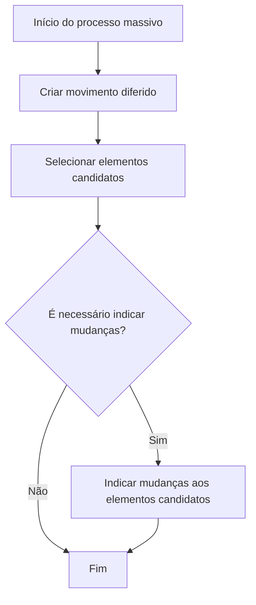
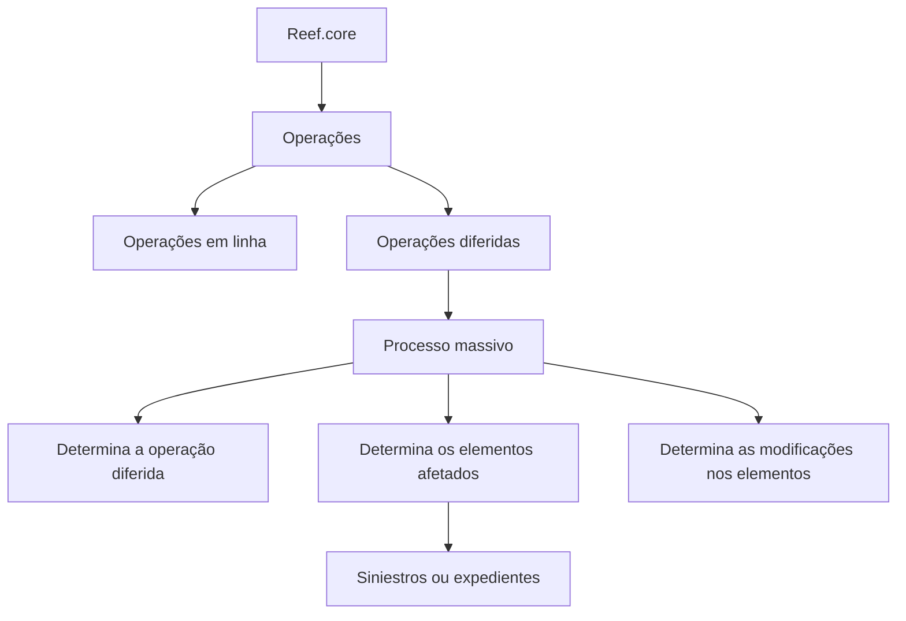

# Criação de Processo Massivo em Siniestros — Documentação Reef.core

## 1. Metadados do Documento
- **Arquivo de Origem:** Não identificado no conteúdo extraído
- **Tipo de Documento:** Procedimento
- **Domínio / Sistema:** Reef.core / Siniestros
- **Público-Alvo:** Desenvolvedores, Arquitetos, Operação e Analistas Funcionais
- **Data/Versão Identificada:** Não identificada
- **Owner identificado:** `user:agonzalez_mapfre.com`
- **Lifecycle identificado:** Approved

---

## 2. Resumo Executivo & Contexto de Negócio

O documento descreve, em estado de construção (“EN CONSTRUCCIÓN”), o conceito de **processo massivo** no domínio de **Siniestros** da plataforma **Reef.core**. Reef.core é apresentado como formado por uma série de operações que podem ser executadas imediatamente, em linha, ou de maneira diferida no tempo.

Uma operação diferida pode ser aplicada a um ou múltiplos elementos. O exemplo fornecido é a seleção de uma série de sinistros ou expedientes para execução de determinada operação, como a alteração de avaliação (“cambiar valoración”).

O processo massivo é definido como o mecanismo que determina: qual operação diferida será executada, quais elementos serão afetados pela operação e quais modificações esses elementos sofrerão. Portanto, o processo massivo organiza a preparação de uma execução posterior, não a execução de uma operação específica.

O objetivo declarado é conhecer as ações necessárias para que uma operação possa ser lançada posteriormente de forma diferida. O documento afirma expressamente que não se concentra em nenhuma operação concreta.

O fluxo descrito possui três etapas principais: criar um movimento diferido, selecionar elementos candidatos e, quando necessário, indicar alterações aos elementos candidatos.

---

## 3. Arquitetura, Componentes & Tecnologias Envolvidas

### Componentes e conceitos identificados

| Componente / Conceito | Descrição sustentada pelo documento |
| :--- | :--- |
| Reef.core | Sistema formado por uma série de operações. |
| Siniestros | Domínio no qual o processo massivo é descrito. |
| Operação em linha | Operação realizada no momento. |
| Operação diferida | Operação cuja execução ocorre posteriormente no tempo. |
| Processo massivo | Processo que determina a operação diferida, os elementos afetados e as modificações sofridas pelos elementos. |
| Movimento diferido | Etapa inicial do processo massivo, identificada como “CREAR movimiento diferido”. |
| Elementos candidatos | Elementos selecionados para receber a operação diferida. |
| Siniestros / expedientes | Exemplos de elementos que podem ser selecionados para uma operação. |
| Alteração de avaliação | Exemplo de operação aplicável a sinistros ou expedientes. |
| Mapfredocument | Referência apresentada na área de documentação. |
| DOCUMENTACIÓN Reef | Referência apresentada como área documental. |

### Fluxo funcional do processo massivo



### Relação conceitual entre operação diferida e processo massivo



> **Nota de Análise:** O documento não detalha microsserviços, APIs, métodos HTTP, contratos JSON, bancos de dados, URLs de ambientes, servidores, tecnologias de implementação ou mecanismos técnicos de agendamento para a execução diferida.

---

## 4. Regras de Negócio, Especificações Funcionais & Processos

### Definição de operação em Reef.core

1. Reef.core é formado por uma série de operações.
2. Certas operações podem ser realizadas no momento, isto é, em linha.
3. Certas operações podem ser realizadas de forma diferida no tempo.
4. Quando uma operação pode ser diferida, é permitido determinar os elementos que serão afetados.
5. Uma operação diferida pode afetar um único elemento ou vários elementos.

### Definição de processo massivo

Um processo massivo determina simultaneamente:

1. A operação diferida que será realizada.
2. Os elementos que serão afetados por essa operação.
3. As modificações que os elementos sofrerão.

### Exemplo funcional informado

O documento informa que é possível selecionar uma série de sinistros ou expedientes para realizar determinada operação. O exemplo explícito de operação é alterar a avaliação (“cambiar valoración”).

### Processo operacional obrigatório

| Ordem | Etapa | Descrição |
| :--- | :--- | :--- |
| 1 | Criar movimento diferido | Criar o movimento associado à operação que será realizada posteriormente. |
| 2 | Selecionar elementos candidatos | Selecionar os elementos que poderão ser afetados pela operação diferida. |
| 3 | Indicar mudanças aos elementos candidatos | Informar as alterações a aplicar aos elementos candidatos, somente quando for necessário indicar mudanças. |
| Final | Fim | Finalização do fluxo após a seleção dos elementos ou após a indicação das mudanças necessárias. |

### Regra condicional identificada

| Condição | Ação resultante |
| :--- | :--- |
| Há necessidade de indicar mudanças | Executar a etapa “INDICAR cambios a elementos candidatos”. |
| Não há necessidade de indicar mudanças | Encerrar o processo após a seleção dos elementos candidatos. |

> **Nota de Análise:** O documento não especifica quais critérios determinam se há necessidade de indicar mudanças. Também não detalha quais tipos de mudanças podem ser aplicados, como os elementos candidatos são selecionados, nem como a execução diferida é disparada após a criação do processo massivo.

---

## 5. Tabelas de Parâmetros, Ambientes e Estruturas de Dados

| Item / Parâmetro | Descrição / Função | Tipo / Valores / Formato | Ambiente / Observações |
| :--- | :--- | :--- | :--- |
| Operação | Ação disponível em Reef.core. | Em linha ou diferida. | O documento não lista operações disponíveis. |
| Operação diferida | Operação executada posteriormente no tempo. | Pode afetar um ou vários elementos. | Pode ser definida em um processo massivo. |
| Processo massivo | Processo de definição de operação, elementos e modificações. | Processo funcional. | Aplicado ao domínio de Siniestros. |
| Movimento diferido | Elemento criado na primeira etapa do processo. | Não detalhado. | Necessário antes da seleção de elementos candidatos. |
| Elementos candidatos | Elementos escolhidos para serem afetados pela operação. | Um ou vários elementos. | Podem incluir sinistros ou expedientes. |
| Mudanças aos elementos | Alterações aplicadas aos elementos candidatos. | Não detalhado. | Aplicável apenas quando houver necessidade de indicar mudanças. |
| Siniestros | Exemplo de elemento que pode ser selecionado. | Não detalhado. | Domínio do documento. |
| Expedientes | Exemplo de elemento que pode ser selecionado. | Não detalhado. | Associado ao exemplo de operação. |
| Cambiar valoración | Exemplo de operação a executar sobre sinistros ou expedientes. | Operação exemplificativa. | Não são detalhadas regras ou parâmetros de avaliação. |
| Owner | Proprietário apresentado na documentação. | `user:agonzalez_mapfre.com` | Identificado no conteúdo bruto. |
| Lifecycle | Estado de ciclo de vida apresentado. | Approved | Identificado no conteúdo bruto. |

> **Nota de Análise:** Não foram identificados parâmetros técnicos, endereços de servidores, ambientes, variáveis de configuração, rotas de log, portas, URLs, formatos de payload ou estruturas formais de dados.

---

## 6. Bateria de Perguntas & Respostas para RAG (FAQ Sintético)

### P1: O que é um processo massivo no contexto de Reef.core?
**R:** Um processo massivo é o processo que determina qual operação diferida será realizada, quais elementos serão afetados pela operação e quais modificações esses elementos sofrerão. O documento relaciona o processo massivo ao domínio de Siniestros.

### P2: Qual é a diferença entre uma operação em linha e uma operação diferida em Reef.core?
**R:** Uma operação em linha é realizada no momento. Uma operação diferida é realizada posteriormente no tempo. O documento informa que determinadas operações de Reef.core podem ser realizadas em ambas as modalidades.

### P3: Quais etapas devem ser realizadas para criar um processo massivo?
**R:** O processo possui três etapas: criar o movimento diferido, selecionar os elementos candidatos e, quando necessário, indicar mudanças aos elementos candidatos.

### P4: O que deve ser feito após criar um movimento diferido?
**R:** Após criar o movimento diferido, devem ser selecionados os elementos candidatos que poderão ser afetados pela operação diferida.

### P5: Quando é necessário indicar mudanças aos elementos candidatos?
**R:** A indicação de mudanças deve ocorrer quando houver necessidade de indicar alterações aos elementos candidatos. O documento apresenta essa decisão como uma condição do fluxo, mas não especifica os critérios usados para determinar essa necessidade.

### P6: Um processo massivo pode afetar mais de um elemento?
**R:** Sim. O documento informa que, quando uma operação pode ser diferida, é possível determinar os elementos afetados, podendo ser um único elemento ou vários elementos.

### P7: Quais elementos podem ser selecionados em um processo massivo?
**R:** O documento usa sinistros e expedientes como exemplos de elementos que podem ser selecionados para a realização de uma operação determinada.

### P8: Qual exemplo de operação é citado no documento?
**R:** O exemplo citado é a alteração de avaliação, apresentada como “cambiar valoración”, aplicável a uma série de sinistros ou expedientes selecionados.

### P9: O documento explica como lançar tecnicamente uma operação diferida?
**R:** Não. O objetivo do documento é explicar as ações necessárias para preparar uma operação que será lançada posteriormente de forma diferida. O documento afirma que não se concentra em nenhuma operação concreta e não detalha implementação técnica, APIs ou agendamento.

### P10: O que acontece se não for necessário indicar mudanças aos elementos candidatos?
**R:** Se não houver necessidade de indicar mudanças, o fluxo termina após a seleção dos elementos candidatos.

### P11: O documento define quais modificações podem ser feitas nos elementos candidatos?
**R:** Não. O documento informa que o processo massivo determina as modificações que os elementos sofrerão, mas não lista tipos de alteração, regras de validação ou formatos para essas modificações.

### P12: Quem é o owner identificado na documentação?
**R:** O conteúdo bruto identifica o owner como `user:agonzalez_mapfre.com`.

---

## 7. Glossário de Termos, Siglas & Conceitos-Chave

- **Reef.core:** Sistema formado por uma série de operações, algumas realizáveis em linha ou de forma diferida.
- **Siniestros:** Domínio funcional mencionado no título e no exemplo de seleção de elementos.
- **Expedientes:** Elementos citados como possíveis candidatos para uma operação.
- **Operação em linha:** Operação realizada no momento.
- **Operação diferida:** Operação realizada posteriormente no tempo.
- **Processo massivo:** Processo que determina a operação diferida, os elementos afetados e as modificações aplicadas.
- **Movimento diferido:** Elemento criado como primeira etapa do processo descrito.
- **Elementos candidatos:** Elementos selecionados para receber uma operação diferida.
- **Cambiar valoración:** Alteração de avaliação; exemplo de operação mencionado no documento.
- **Lifecycle:** Campo apresentado na documentação com valor “Approved”.
- **Owner:** Campo que identifica o proprietário da documentação.
- **Mapfredocument:** Referência exibida na área de documentação; o documento não detalha sua função.

---

## 8. Notas Críticas, Riscos & Limitações

- O documento está marcado como “EN CONSTRUCCIÓN”, indicando que o conteúdo pode estar incompleto.
- O documento não detalha nenhuma operação concreta, apesar de apresentar “cambiar valoración” como exemplo.
- Não há especificação de APIs, métodos HTTP, contratos JSON, eventos, filas, agendadores ou mecanismos de execução da operação diferida.
- Não são informados critérios para seleção dos elementos candidatos.
- Não são informados critérios de validação para determinar quando devem ser indicadas mudanças aos elementos candidatos.
- Não há catálogo de mudanças possíveis, campos alteráveis ou regras de consistência para os elementos.
- Não foram identificados ambientes, URLs, servidores, rotas de log, tecnologias, dependências ou responsáveis técnicos além do campo owner apresentado.
- Não há detalhamento sobre tratamento de erros, reprocessamento, auditoria, autorização, permissões ou rastreabilidade do processo massivo.

---

## 9. Conteúdo Bruto Estruturado (Referência Fiel)

```text
--- [PÁGINA 1 DE 1] ---

EN CONSTRUCCIÓN
CREAR proceso masivo en Siniestros
¿En que consiste?
Reef.core está formado por una serie de operaciones. Ciertas operaciones se pueden realizar tanto en el momento (en línea), como diferidas
en el tiempo. Cuando una operación se puede diferir, además, se permite determinar a qué elementos afectará la operación (puede ser uno o
varios elementos). Por ejemplo, se puede seleccionar una serie de siniestros/expedientes a los que realizar un determinada operación por
ejemplo cambiar valoración.
Al proceso que determina qué operación diferida se va a realizar, a qué elementos afectará esa operación y qué modicaciones sufrirán los
elementos, se le denomina proceso masivo.
Objetivo
Conocer que acciones se deben realizar para que posteriormente se pueda lanzar una operación de forma diferida. Este documento no se
centra en ninguna operación en concreto.
Proceso a seguir
SI
NO
CREAR
movimiento
diferido (1)
SELECCIONAR
elementos
candidatos (2)
¿Hay
que
indicar
cambios? INDICAR cambios
a elementos
candidatos (3)
FIN
1. CREAR movimiento diferido
2. SELECCIONAR elementos candidatos
3. INDICAR cambios a elementos candidatos
Checking links...
Documentation / DOCUMENTACIÓN Reef
DOCUMENTACIÓN Reef
Mapfredocument
DOCUMENTACIÓN Reef
Owner
user:agonzalez_mapfre.com
Lifecycle
Approved Source
 / 
 VL
Buscar Inicio Soluciones Arquitecturas APIs Componentes Cloud Documentación Zeus Reef Ayuda
ES
```
