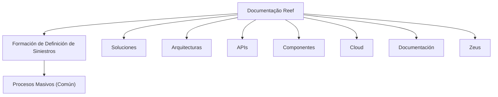

# Formação de Definição de Sinistros — Processos Massivos (Comum)

## 1. Metadados do Documento
- **Arquivo de Origem:** Não identificado no conteúdo fornecido
- **Tipo de Documento:** Apresentação Executiva / Material de Formação
- **Domínio / Sistema:** Reef; Mapfre; definição de sinistros; processos massivos
- **Público-Alvo:** Não identificado explicitamente
- **Data/Versão Identificada:** Não identificada

---

## 2. Resumo Executivo & Contexto de Negócio

O conteúdo apresenta um material denominado **“Formación de Definición de Siniestros — Procesos Masivos (Común)”**. O idioma predominante é espanhol, e o escopo declarado envolve a definição de processos massivos relacionados a sinistros.

O documento referencia o ambiente ou repositório de documentação **Reef**, incluindo menções a “Documentation / DOCUMENTACIÓN Reef”, “Mapfredocument” e à navegação por áreas como soluções, arquiteturas, APIs, componentes, cloud, documentação, Zeus e Reef.

O estado exibido é **“EN CONSTRUCCIÓN”**, indicando que o material ainda está em elaboração. O conteúdo bruto não descreve regras operacionais, integrações, métodos HTTP, contratos de API, estruturas de dados, responsáveis de processo ou etapas detalhadas para a execução de processos massivos.

Também são exibidos metadados de governança documental: o proprietário identificado é `user:agonzalez_mapfre.com`, e o ciclo de vida está marcado como **Approved**. Não há detalhamento adicional sobre o significado de “VL” ou sobre a relação entre o conteúdo e demais elementos da plataforma de documentação.

---

## 3. Arquitetura, Componentes & Tecnologias Envolvidas

Os elementos explicitamente citados no conteúdo são:

| Componente / Elemento | Classificação | Descrição sustentada pelo conteúdo |
| :--- | :--- | :--- |
| Reef | Sistema / documentação | Ambiente ou área de documentação mencionada repetidamente como “DOCUMENTACIÓN Reef”. |
| Mapfredocument | Repositório ou componente documental | Nome exibido no conteúdo sem explicação funcional adicional. |
| Zeus | Área de navegação | Item disponível na navegação da documentação. |
| Soluciones | Área de navegação | Categoria exibida na interface de documentação. |
| Arquitecturas | Área de navegação | Categoria exibida na interface de documentação. |
| APIs | Área de navegação | Categoria exibida na interface de documentação. |
| Componentes | Área de navegação | Categoria exibida na interface de documentação. |
| Cloud | Área de navegação | Categoria exibida na interface de documentação. |
| Definición de Siniestros | Domínio funcional | Tema principal declarado pelo título do material. |
| Procesos Masivos | Processo funcional | Processo que o conteúdo afirma pretender definir. |



**Nota de Análise:** o conteúdo não apresenta uma arquitetura técnica detalhada, fluxos de integração, microsserviços, protocolos, bancos de dados, ambientes de execução ou contratos de API. O diagrama representa somente a hierarquia documental e os itens de navegação explicitamente exibidos.

---

## 4. Regras de Negócio, Especificações Funcionais & Processos

O conteúdo informa como objetivo a ação de **“DEFINIR proceso masivo”** no contexto de **Definición de Siniestros**.

Não foram identificadas regras de negócio detalhadas, tais como:

- Critérios para iniciar, aprovar, cancelar ou reprocessar processos massivos.
- Tipos de sinistro abrangidos.
- Entradas, saídas, arquivos, eventos ou contratos de integração.
- Papéis, perfis, permissões ou responsabilidades operacionais.
- Regras de validação, cálculo, priorização ou tratamento de exceções.
- Indicadores de sucesso, SLA, janelas de processamento ou critérios de auditoria.
- Etapas operacionais para definição ou execução de processos massivos.

**Nota de Análise:** o documento declara o tema “procesos masivos”, mas não detalha o processo massivo, seus passos, métodos, parâmetros ou regras funcionais.

---

## 5. Tabelas de Parâmetros, Ambientes e Estruturas de Dados

| Item / Parâmetro | Descrição / Função | Tipo / Valores / Formato | Ambiente / Observações |
| :--- | :--- | :--- | :--- |
| Título | Formação de Definição de Sinistros — Processos Massivos | Texto | Indicado como conteúdo comum. |
| Estado do conteúdo | Em construção | `EN CONSTRUCCIÓN` | Indica material ainda em elaboração. |
| Objetivo de conteúdo | Definir processo massivo | `DEFINIR proceso masivo` | Não há detalhamento do processo. |
| Repositório / sistema documental | Reef | `DOCUMENTACIÓN Reef` | Citado repetidamente no conteúdo. |
| Referência documental | Mapfredocument | Texto | Sem detalhamento funcional adicional. |
| Proprietário | Usuário proprietário do documento | `user:agonzalez_mapfre.com` | Campo exibido como `Owner`. |
| Ciclo de vida | Estado de governança documental | `Approved` | Campo exibido como `Lifecycle`. |
| Fonte | Referência de origem | `Source / VL` | O significado de `VL` não é detalhado. |
| Idioma da interface | Espanhol | `ES` | Exibido na navegação. |
| Áreas de navegação | Soluções, arquiteturas, APIs, componentes, cloud, documentação, Zeus e Reef | Lista textual | Não são descritos os conteúdos de cada área. |

---

## 6. Bateria de Perguntas & Respostas para RAG (FAQ Sintético)

### P1: Qual é o tema principal do documento?
**R:** O documento trata de **Formación de Definición de Siniestros — Procesos Masivos (Común)**. O conteúdo declara como objetivo definir um processo massivo no domínio de definição de sinistros.

### P2: O documento descreve detalhadamente como executar um processo massivo?
**R:** Não. O conteúdo contém a indicação “DEFINIR proceso masivo”, mas não apresenta etapas de execução, critérios de entrada, regras de validação, integrações ou tratamento de exceções.

### P3: Qual sistema ou repositório de documentação é citado no material?
**R:** O material referencia repetidamente **Reef**, por meio das expressões “Documentation / DOCUMENTACIÓN Reef” e “DOCUMENTACIÓN Reef”.

### P4: O documento está concluído?
**R:** Não há evidência de conclusão do conteúdo. O texto exibe o status **“EN CONSTRUCCIÓN”**, que indica que o material está em elaboração.

### P5: Quem é o proprietário identificado do documento?
**R:** O proprietário exibido no conteúdo é `user:agonzalez_mapfre.com`, apresentado no campo `Owner`.

### P6: Qual é o estado de ciclo de vida exibido para o documento?
**R:** O campo `Lifecycle` está preenchido com o valor **Approved**.

### P7: O documento especifica APIs, métodos HTTP ou contratos JSON?
**R:** Não. Embora “APIs” seja exibido como item de navegação, o conteúdo não descreve endpoints, métodos HTTP, contratos JSON, autenticação, payloads ou respostas.

### P8: Quais áreas de navegação aparecem no ambiente documental?
**R:** O conteúdo apresenta as áreas: `Inicio`, `Soluciones`, `Arquitecturas`, `APIs`, `Componentes`, `Cloud`, `Documentación`, `Zeus`, `Reef` e `Ayuda`.

### P9: O que significa a referência “VL” exibida como fonte?
**R:** O conteúdo mostra `Source / VL`, mas não define o significado de `VL`. Qualquer interpretação adicional não é sustentada pelo documento.

### P10: O documento identifica tecnologias, servidores ou ambientes de implantação?
**R:** Não. Não foram identificadas tecnologias específicas, nomes de servidores, URLs, portas, credenciais, ambientes de desenvolvimento, homologação ou produção.

---

## 7. Glossário de Termos, Siglas & Conceitos-Chave

- **Reef:** Ambiente ou referência de documentação citada no conteúdo. O documento não apresenta definição técnica adicional.
- **Mapfredocument:** Nome citado no conteúdo; não há explicação funcional ou arquitetural associada.
- **Siniestros:** Termo em espanhol relacionado ao domínio de sinistros.
- **Procesos Masivos:** Processos em lote ou de execução em massa; o documento não detalha sua operação.
- **Owner:** Campo que identifica o proprietário do documento.
- **Lifecycle:** Campo que indica o estado de ciclo de vida documental.
- **Approved:** Valor apresentado para o ciclo de vida do documento.
- **VL:** Referência exibida como fonte; significado não identificado no conteúdo.
- **Zeus:** Item de navegação exibido no ambiente documental; sem detalhamento adicional.

---

## 8. Notas Críticas, Riscos & Limitações

- O conteúdo está marcado como **“EN CONSTRUCCIÓN”**, indicando possível incompletude ou evolução pendente.
- Não há especificação operacional do processo massivo mencionado.
- Não há regras de negócio, fluxos detalhados, exceções, requisitos não funcionais ou critérios de auditoria.
- Não há informações sobre integrações, microsserviços, APIs, dados, bancos de dados, logs ou monitoramento.
- Não há identificação de versões, datas, responsáveis funcionais ou público-alvo.
- A referência `VL` é exibida sem definição.
- **Nota de Análise:** o documento lista Reef, Mapfredocument e Zeus, porém não detalha as responsabilidades, integrações ou capacidades desses elementos.

---

## 9. Conteúdo Bruto Estruturado (Referência Fiel)

```text
--- [PÁGINA 1 DE 1] ---

EN CONSTRUCCIÓN
FORMACIÓN de DEFINICIÓN de SINIESTROS- PROCESOS MASIVOS
(Común)
CONTENIDO
DEFINIR proceso masivo
Documentation / DOCUMENTACIÓN Reef
DOCUMENTACIÓN Reef
Mapfredocument
DOCUMENTACIÓN Reef
Owner
user:agonzalez_mapfre.com
Lifecycle
Approved Source
 /
 VL
Buscar Inicio Soluciones Arquitecturas APIs Componentes Cloud Documentación Zeus Reef Ayuda
ES
```
