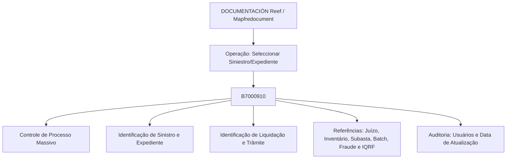

# Documentação Reef — Tabela B7000910: Processos Massivos de Sinistros

## 1. Metadados do Documento
- **Arquivo de Origem:** Não identificado no conteúdo extraído
- **Tipo de Documento:** Especificação Técnica / Documentação de modelo de dados
- **Domínio / Sistema:** Reef / Mapfre — Processos Massivos de Sinistros
- **Público-Alvo:** Desenvolvedores, Arquitetos, Operação e Analistas Funcionais
- **Data/Versão Identificada:** Não identificada
- **Owner identificado:** `user:agonzalez_mapfre.com`
- **Lifecycle identificado:** `Approved Source`

---

## 2. Resumo Executivo & Contexto de Negócio

O conteúdo documenta a operação em construção denominada **“Seleccionar Siniestro/Expediente”**, vinculada ao domínio de processos massivos de sinistros. A extração identifica a tabela **B7000910** como a tabela mestre utilizada nessa operação.

A tabela B7000910 armazena informações de controle do processo massivo, incluindo a data de tratamento, o tipo de movimento batch, o número de ordem, um alias opcional e a situação de processamento da linha. Também reúne identificadores de sinistro, expediente, liquidação, trâmite, juízo, inventário, subasta, batch, fraude e IQRF.

O documento diferencia campos obrigatórios e não obrigatórios por meio da coluna **OBLIGATORIA**. Os campos obrigatórios concentram-se na identificação e controle do processo, companhia, setor, ramo, sinistro, expediente, liquidação, tipo de trâmite, usuários e data de atualização.

Não há detalhamento de métodos HTTP, APIs, contratos JSON, regras de persistência, mecanismos de execução batch, tecnologia de banco de dados ou fluxo operacional completo. A fonte apresenta principalmente o modelo de dados e descrições funcionais das colunas da tabela B7000910.

---

## 3. Arquitetura, Componentes & Tecnologias Envolvidas

Os elementos explicitamente identificados são:

- **Reef:** contexto de documentação apresentado como “DOCUMENTACIÓN Reef”.
- **Mapfredocument:** portal ou repositório documental citado na extração.
- **B7000910:** tabela mestre de processos massivos de sinistros.
- **Operação “Seleccionar Siniestro/Expediente”:** funcionalidade marcada como “EN CONSTRUCCIÓN”.
- **Processos batch:** citados por meio dos campos `TIP_MVTO_BATCH_STRO`, `COD_BATCH_REF` e `IDN_BATCH`.



> **Nota de Análise:** O documento não descreve integrações, microsserviços, banco de dados físico, protocolos, tecnologias de execução ou contratos de interface da operação.

---

## 4. Regras de Negócio, Especificações Funcionais & Processos

1. A operação documentada é **“Seleccionar Siniestro/Expediente”** e está indicada como **“EN CONSTRUCCIÓN”**.
2. A tabela envolvida na operação é a **B7000910**, descrita como **“MAESTRA PROCESOS MASIVO DE SINIESTROS”**.
3. O campo `FEC_TRATAMIENTO` registra a data em que o processo massivo é realizado.
4. O campo `TIP_MVTO_BATCH_STRO` registra o tipo de movimento batch.
5. O campo `NUM_ORDEN` representa o número do processo massivo.
6. O campo `TXT_ALIAS` permite definir um nome para o processo e não é obrigatório.
7. O campo `TIP_SITU` representa a situação da linha; o valor explicitamente indicado é `1-Sin Procesar`.
8. Companhia, setor e ramo são obrigatórios, respectivamente por meio de `COD_CIA`, `COD_SECTOR` e `COD_RAMO`.
9. Os identificadores de sinistro, expediente, liquidação e tipo de trâmite são obrigatórios.
10. Os campos relacionados a juízo, inventário, subasta, referências batch, identificadores batch, sequência, fraude e IQRF são apresentados como não obrigatórios.
11. O usuário que simula a captura (`COD_USR_CAPTURA`), o usuário que atualizou a linha (`COD_USR`) e a data de atualização (`FEC_ACTU`) são obrigatórios.

> **Nota de Análise:** O documento não define transições de estado além do valor `1-Sin Procesar` para `TIP_SITU`. Também não informa quais valores são permitidos para os demais campos.

---

## 5. Tabelas de Parâmetros, Ambientes e Estruturas de Dados

| Item / Parâmetro | Descrição / Função | Tipo / Valores / Formato | Ambiente / Observações |
| :--- | :--- | :--- | :--- |
| `B7000910` | Tabela mestre de processos massivos de sinistros | Tabela | Relacionada à operação “Seleccionar Siniestro/Expediente” |
| `FEC_TRATAMIENTO` | Data em que é realizado o processo massivo | Valor exibido: `S` | Obrigatória: Sim |
| `TIP_MVTO_BATCH_STRO` | Tipo do movimento batch | Valor exibido: `S` | Obrigatória: Sim |
| `NUM_ORDEN` | Número do processo massivo | Valor exibido: `S` | Obrigatória: Sim |
| `TXT_ALIAS` | Nome que se deseja atribuir ao processo | Valor exibido: `S` | Obrigatória: Não |
| `TIP_SITU` | Situação em que a linha se encontra | Valor: `1-Sin Procesar` | Obrigatória: Sim |
| `COD_CIA` | Companhia | Valor exibido: `S` | Obrigatória: Sim |
| `COD_SECTOR` | Setor | Valor exibido: `S` | Obrigatória: Sim |
| `COD_RAMO` | Ramo | Valor exibido: `S` | Obrigatória: Sim |
| `NUM_SINI_REF` | Sinistro de referência de outros sistemas | Valor exibido: `S` | Obrigatória: Sim |
| `NUM_SINI` | Sinistro | Valor exibido: `S` | Obrigatória: Sim |
| `NUM_EXP` | Número de expediente | Valor exibido: `S` | Obrigatória: Sim |
| `NUM_LIQ_REF` | Número de liquidação de referência | Valor exibido: `S` | Obrigatória: Sim |
| `NUM_LIQ` | Número de liquidação | Valor exibido: `S` | Obrigatória: Sim |
| `SUB_TIP_TRAMITE` | Tipo de trâmite | Valor exibido: `S` | Obrigatória: Sim |
| `NUM_JUICIO_REF` | Número do juízo de referência | Valor exibido: `S` | Obrigatória: Não |
| `NUM_JUICIO` | Número do juízo | Valor exibido: `S` | Obrigatória: Não |
| `COD_INVENTARIO_REF` | Inventário de referência | Valor exibido: `S` | Obrigatória: Não |
| `COD_INVENTARIO` | Número de inventário | Valor exibido: `S` | Obrigatória: Não |
| `COD_SUBASTA_REF` | Código de subasta de referência | Valor exibido: `S` | Obrigatória: Não |
| `COD_SUBASTA` | Subasta | Valor exibido: `S` | Obrigatória: Não |
| `COD_BATCH_REF` | Código de referência para processos batch | Valor exibido: `S` | Obrigatória: Não |
| `IDN_BATCH` | Identificador batch | Valor exibido: `S` | Obrigatória: Não |
| `NUM_SQN_VAL` | Sequência | Valor exibido: `S` | Obrigatória: Não |
| `IDN_FRAUDE` | Identificador de fraude | Valor exibido: `S` | Obrigatória: Não |
| `IDN_FRAUDE_REF` | Referência de identificador de fraude | Valor exibido: `S` | Obrigatória: Não |
| `IDN_IQRF` | Identificador IQRF | Valor exibido: `S` | Obrigatória: Não |
| `IDN_IQRF_REF` | Referência de identificador IQRF | Valor exibido: `S` | Obrigatória: Não |
| `COD_USR_CAPTURA` | Usuário que simula a captura | Valor exibido: `S` | Obrigatória: Sim |
| `COD_USR` | Usuário que atualizou a linha | Valor exibido: `S` | Obrigatória: Sim |
| `FEC_ACTU` | Data de atualização da linha | Valor exibido: `S` | Obrigatória: Sim |

---

## 6. Bateria de Perguntas & Respostas para RAG (FAQ Sintético)

### P1: Qual tabela é utilizada na operação “Seleccionar Siniestro/Expediente”?
**R:** A operação “Seleccionar Siniestro/Expediente” utiliza a tabela `B7000910`, descrita como a tabela mestre de processos massivos de sinistros.

### P2: Qual campo indica a data de realização do processo massivo?
**R:** O campo `FEC_TRATAMIENTO` indica a data em que o processo massivo é realizado. O documento o marca como obrigatório.

### P3: Qual campo representa o número do processo massivo de sinistros?
**R:** O campo `NUM_ORDEN` representa o número do processo massivo e é obrigatório na tabela `B7000910`.

### P4: É possível atribuir um nome ao processo massivo?
**R:** Sim. O campo `TXT_ALIAS` permite informar o nome que se deseja atribuir ao processo. O documento marca `TXT_ALIAS` como não obrigatório.

### P5: Qual é a situação explicitamente documentada para uma linha ainda não processada?
**R:** O campo `TIP_SITU` possui o valor explicitamente documentado `1-Sin Procesar`, que representa a situação em que a linha se encontra. O campo é obrigatório.

### P6: Quais campos identificam companhia, setor e ramo?
**R:** Os campos são `COD_CIA` para companhia, `COD_SECTOR` para setor e `COD_RAMO` para ramo. Os três campos são obrigatórios.

### P7: Quais campos obrigatórios identificam sinistro, expediente e liquidação?
**R:** Os campos obrigatórios são `NUM_SINI_REF` para sinistro de referência de outros sistemas, `NUM_SINI` para sinistro, `NUM_EXP` para número de expediente, `NUM_LIQ_REF` para número de liquidação de referência e `NUM_LIQ` para número de liquidação.

### P8: O número de juízo é obrigatório na tabela B7000910?
**R:** Não. Os campos `NUM_JUICIO_REF`, correspondente ao número do juízo de referência, e `NUM_JUICIO`, correspondente ao número do juízo, estão marcados como não obrigatórios.

### P9: Quais dados de processos batch são registrados como opcionais?
**R:** Os campos opcionais relacionados a processos batch são `COD_BATCH_REF`, descrito como código de referência para processos batch, e `IDN_BATCH`, descrito como identificador batch. `TIP_MVTO_BATCH_STRO`, por outro lado, é obrigatório e indica o tipo de movimento batch.

### P10: Quais campos de auditoria de usuário e atualização são obrigatórios?
**R:** `COD_USR_CAPTURA` registra o usuário que simula a captura, `COD_USR` registra o usuário que atualizou a linha e `FEC_ACTU` registra a data de atualização da linha. Os três campos são obrigatórios.

### P11: O documento especifica métodos HTTP ou contratos JSON da operação?
**R:** Não. A extração identifica a operação, a tabela B7000910 e suas colunas, mas não detalha métodos HTTP, endpoints, contratos JSON ou integrações técnicas.

---

## 7. Glossário de Termos, Siglas & Conceitos-Chave

- **B7000910:** Tabela mestre de processos massivos de sinistros.
- **Batch:** Termo usado no documento para movimentos e processos batch.
- **Expediente:** Entidade identificada pelo campo `NUM_EXP`.
- **IQRF:** Sigla citada nos campos `IDN_IQRF` e `IDN_IQRF_REF`; o significado não é detalhado no documento.
- **Liquidação:** Entidade identificada pelos campos `NUM_LIQ_REF` e `NUM_LIQ`.
- **Sinistro:** Entidade identificada pelos campos `NUM_SINI_REF` e `NUM_SINI`.
- **Subasta:** Entidade identificada pelos campos `COD_SUBASTA_REF` e `COD_SUBASTA`.
- **Trâmite:** Tipo de trâmite identificado pelo campo `SUB_TIP_TRAMITE`.

---

## 8. Notas Críticas, Riscos & Limitações

- A operação “Seleccionar Siniestro/Expediente” está marcada como **“EN CONSTRUCCIÓN”**.
- O conteúdo não identifica o arquivo de origem, data, versão ou tecnologia de persistência.
- A coluna apresentada como `CAMBIA VALOR` contém predominantemente o valor `S`, mas o documento não explica formalmente sua semântica.
- O documento não fornece tipos físicos, tamanhos, domínios de valores, chaves primárias, chaves estrangeiras ou índices da tabela B7000910.
- Não há descrição de APIs, métodos HTTP, contratos JSON, autenticação, integração entre sistemas ou procedimentos de erro.
- As siglas `IQRF` e a semântica operacional de campos de fraude não são detalhadas.

---

## 9. Conteúdo Bruto Estruturado (Referência Fiel)

```text
--- [PÁGINA 1 DE 2] ---

EN CONSTRUCCIÓN
SELECCIONAR Siniestro/Expediente
Modelo de datos involucrado
Las tablas que intervienen en esta operación son:
B7000910
TABLA DESCRIPCIÓN
B7000910 MAESTRA PROCESOS MASIVO DE SINIESTROS
COLUMNA CAMBIA
VALOR
MOTIVO/VALOR OBLIGATORIA COMENTARIO
FEC_TRATAMIENTO S N.A. SI FECHA EN LA QUE SE REALIZA EL
PROCESO MASIVO
TIP_MVTO_BATCH_STRO S N.A. SI TIPO DEL MOVIMIENTO BATCH
NUM_ORDEN S N.A. SI NUMERO DEL PROCESO MASIVO
TXT_ALIAS S N.A. NO NOMBRE QUE SE QUIERA DAR AL
PROCESO
TIP_SITU S 1-Sin Procesar SI SITUACION EN LA QUE SE ENCUENTRA LA
FILA
COD_CIA S N.A. SI COMPANIA
COD_SECTOR S N.A. SI SECTOR
COD_RAMO S N.A. SI RAMO
Documentation / DOCUMENTACIÓN Reef
DOCUMENTACIÓN Reef
Mapfredocument
DOCUMENTACIÓN Reef
Owner
user:agonzalez_mapfre.com
Lifecycle
Approved Source
 /
VL
Buscar Inicio Soluciones Arquitecturas APIs Componentes Cloud Documentación Zeus Reef Ayuda
ES


--- [PÁGINA 2 DE 2] ---

COLUMNA CAMBIA
VALOR
MOTIVO/VALOR OBLIGATORIA COMENTARIO
NUM_SINI_REF S N.A. SI SINIESTRO REFERENCIA DE OTROS
SISTEMAS.
NUM_SINI S N.A. SI SINIESTRO
NUM_EXP S N.A. SI NUMERO DE EXPEDIENTE
NUM_LIQ_REF S N.A. SI NUMERO DE LIQUIDACION DE
REFERENCIA
NUM_LIQ S N.A. SI NUMERO DE LIQUIDACION
SUB_TIP_TRAMITE S N.A. SI TIPO DE TRAMITE
NUM_JUICIO_REF S N.A. NO NUMERO DEL JUICIO DE REFERENCIA
NUM_JUICIO S N.A. NO NUMERO DEL JUICIO
COD_INVENTARIO_REF S N.A. NO INVENTARIO DE REFERENCIA
COD_INVENTARIO S N.A. NO NUMERO DE INVENTARIO
COD_SUBASTA_REF S N.A. NO CODIGO DE SUBASTA DE REFERENCIA
COD_SUBASTA S N.A. NO SUBASTA
COD_BATCH_REF S N.A. NO CODIGO DE REFERENCIA PARA
PROCESOS BATCH
IDN_BATCH S N.A. NO IDENTIFICADOR BATCH
NUM_SQN_VAL S N.A. NO SECUENCIA
IDN_FRAUDE S N.A. NO IDENTIFICADOR DE FRAUDE
IDN_FRAUDE_REF S N.A. NO REFERENCIA DE IDENTIFICADOR DE
FRAUDE
IDN_IQRF S N.A. NO IDENTIFICADOR IQRF
IDN_IQRF_REF S N.A. NO REFERENCIA DE IDENTIFICADOR IQRF
COD_USR_CAPTURA S N.A. SI USUARIO QUE SIMULA LA CAPTURA
COD_USR S N.A. SI USUARIO QUE ACTUALIZO LA FILA
FEC_ACTU S N.A. SI FECHA DE ACTUALIZACION DE LA FILA
```
