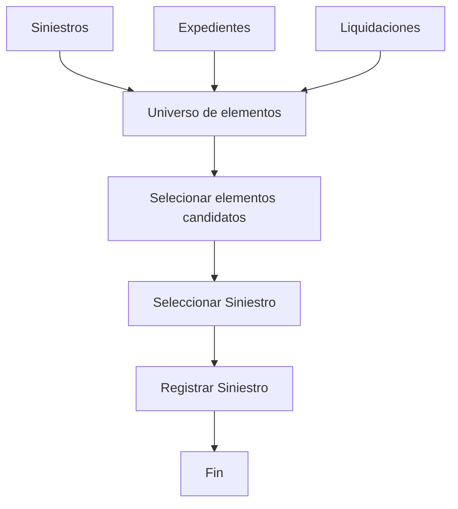

# Seleção e Registro de Sinistros no Processo Massivo — Documentação Reef

## 1. Metadados do Documento
- **Arquivo de Origem:** Não identificado no conteúdo fornecido
- **Tipo de Documento:** Procedimento
- **Domínio / Sistema:** Reef / Siniestros / Mapfre
- **Público-Alvo:** Negócio, Operação e usuários do processo massivo
- **Data/Versão Identificada:** Não identificada

---

## 2. Resumo Executivo & Contexto de Negócio

O documento descreve a etapa de construção denominada **“Seleccionar elemento candidato en Siniestros”**, relacionada à visão técnica do domínio de sinistros. O objetivo central é selecionar os elementos candidatos que inicialmente deverão ser afetados por um processo massivo.

No contexto apresentado, o universo de elementos pode incluir **siniestros**, **expedientes** e **liquidaciones**. A seleção permite extrair, desse universo, os elementos que efetivamente deverão ser processados pelo movimento massivo.

O procedimento informado possui duas etapas sequenciais: primeiro, selecionar o sinistro; depois, registrar o sinistro. O documento não detalha critérios de elegibilidade, regras de validação, campos obrigatórios, métodos de integração, contratos técnicos ou comportamento de falha.

A documentação está associada ao ambiente ou repositório documental **Reef**, com referências a **Mapfredocument** e ao proprietário `user:agonzalez_mapfre.com`. O ciclo de vida indicado é **Approved Source**.

---

## 3. Arquitetura, Componentes & Tecnologias Envolvidas

Os componentes e conceitos explicitamente citados são:

| Componente / Conceito | Papel identificado no documento |
| :--- | :--- |
| Reef | Contexto da documentação e do processo descrito. |
| Siniestros | Domínio no qual são selecionados e registrados elementos candidatos. |
| Processo masivo | Processo que afeta os elementos previamente selecionados. |
| Elemento | Entidade genérica que pode ser incluída no processo massivo. |
| Siniestros, expedientes, liquidaciones | Exemplos de elementos pertencentes ao universo elegível para processamento. |
| Mapfredocument | Referência documental exibida no conteúdo. |
| Owner `user:agonzalez_mapfre.com` | Proprietário identificado para a documentação. |
| Lifecycle `Approved Source` | Estado de ciclo de vida indicado. |



**Nota de Análise:** O documento não apresenta arquitetura de software, APIs, microsserviços, tecnologias de implementação, mecanismos de persistência, integrações ou ambientes técnicos.

---

## 4. Regras de Negócio, Especificações Funcionais & Processos

### Objetivo funcional

O objetivo declarado é conhecer as formas pelas quais os elementos podem ser incluídos para que façam parte do movimento no processo massivo.

### Regra de seleção de candidatos

A inclusão de elementos candidatos consiste em identificar, dentro do universo total de elementos, aqueles que inicialmente se pretende afetar no processo massivo.

Os exemplos de elementos fornecidos são:

- Siniestros;
- Expedientes;
- Liquidaciones.

O documento afirma que tais elementos são extraídos do universo disponível quando se deseja processá-los. Não são especificados critérios de seleção, filtros, prioridades, quantidades máximas, regras de exclusão ou condições de reprocessamento.

### Fluxo operacional informado

1. **Seleccionar Siniestro:** selecionar o sinistro como elemento candidato.
2. **Registrar Siniestro:** registrar o sinistro selecionado.
3. **Fin:** encerramento do fluxo.

**Nota de Análise:** O documento não detalha quais dados são registrados na etapa de registro do sinistro, onde esse registro é persistido, quais validações devem ocorrer ou qual resultado deve ser esperado após o encerramento.

---

## 5. Tabelas de Parâmetros, Ambientes e Estruturas de Dados

| Item / Parâmetro | Descrição / Função | Tipo / Valores / Formato | Ambiente / Observações |
| :--- | :--- | :--- | :--- |
| Elemento candidato | Elemento inicialmente pretendido para ser afetado pelo processo massivo. | Não especificado | Pode pertencer ao universo de siniestros, expedientes ou liquidaciones. |
| Universo de elementos | Conjunto de elementos disponíveis para seleção. | Não especificado | O documento usa siniestros, expedientes e liquidaciones como exemplos. |
| Processo masivo | Processo que trata os elementos candidatos selecionados. | Não especificado | Não há detalhamento técnico ou operacional adicional. |
| Seleccionar Siniestro | Primeira etapa indicada no processo. | Etapa de processo | Marcada como etapa 1. |
| Registrar Siniestro | Segunda etapa indicada no processo. | Etapa de processo | Marcada como etapa 2. |
| Owner | Proprietário da documentação. | `user:agonzalez_mapfre.com` | Identificado no rodapé do conteúdo. |
| Lifecycle | Estado do ciclo de vida documental. | `Approved Source` | Identificado no rodapé do conteúdo. |
| Idioma da interface | Idioma mostrado na navegação documental. | `ES` | Referência à interface exibida. |

---

## 6. Bateria de Perguntas & Respostas para RAG (FAQ Sintético)

### P1: Qual é o objetivo da seleção de elementos candidatos em Siniestros?
**R:** O objetivo é incluir os elementos que inicialmente se pretende afetar no processo massivo. A seleção permite identificar, dentro do universo de elementos disponíveis, aqueles que deverão fazer parte do movimento do processo massivo.

### P2: Quais tipos de elementos podem fazer parte do universo de seleção?
**R:** O documento cita como exemplos de elementos do universo de seleção os siniestros, expedientes e liquidaciones. Não afirma que esses sejam os únicos tipos possíveis.

### P3: O que significa incluir um elemento candidato no processo massivo?
**R:** Significa extrair do universo de elementos os itens que se deseja processar. Esses elementos passam a formar parte do movimento no processo massivo.

### P4: Quais são as etapas do fluxo de seleção e registro de sinistros?
**R:** O fluxo possui duas etapas: primeiro, selecionar o sinistro; depois, registrar o sinistro. Após o registro, o fluxo é encerrado.

### P5: O documento informa critérios para decidir quais sinistros devem ser selecionados?
**R:** Não. O conteúdo explica a finalidade da seleção de elementos candidatos, mas não define critérios funcionais, condições de elegibilidade, filtros ou regras de priorização para selecionar sinistros.

### P6: O documento descreve quais informações são registradas na etapa “Registrar Siniestro”?
**R:** Não. A etapa “Registrar Siniestro” é mencionada como a segunda etapa do processo, mas não há detalhamento sobre campos, estrutura de dados, validações ou local de persistência.

### P7: O processo massivo afeta apenas sinistros?
**R:** Não necessariamente. O documento apresenta siniestros, expedientes e liquidaciones como exemplos de elementos que podem compor o universo de seleção para o processo massivo.

### P8: Existe detalhamento de APIs, métodos HTTP ou contratos JSON para o processo?
**R:** Não. O documento não apresenta APIs, métodos HTTP, contratos JSON, URLs, microsserviços, tecnologias ou especificações de integração.

### P9: Qual é o ciclo de vida indicado para a documentação?
**R:** O ciclo de vida indicado é `Approved Source`.

### P10: Quem é o proprietário identificado para a documentação?
**R:** O proprietário indicado é `user:agonzalez_mapfre.com`.

### P11: O que acontece após o registro do sinistro?
**R:** Conforme o fluxo exibido, após “Registrar Siniestro” ocorre o encerramento indicado como “FIN”. O documento não descreve ações posteriores.

---

## 7. Glossário de Termos, Siglas & Conceitos-Chave

- **Reef:** Contexto ou plataforma de documentação referenciada no conteúdo como “Documentation / DOCUMENTACIÓN Reef”.
- **Siniestro:** Termo usado no documento como um tipo de elemento selecionável e registrável no processo.
- **Expediente:** Exemplo de elemento pertencente ao universo que pode ser considerado no processo massivo.
- **Liquidación:** Exemplo de elemento pertencente ao universo que pode ser considerado no processo massivo.
- **Elemento candidato:** Elemento inicialmente pretendido para ser afetado pelo processo massivo.
- **Proceso masivo:** Processo que trata os elementos extraídos do universo de elementos.
- **Mapfredocument:** Referência documental exibida no conteúdo.
- **Approved Source:** Estado de ciclo de vida informado para o conteúdo documental.

---

## 8. Notas Críticas, Riscos & Limitações

- O documento está identificado com a expressão **“EN CONSTRUCCIÓN”**, indicando conteúdo em construção.
- Não há detalhamento dos critérios de seleção de sinistros, expedientes ou liquidaciones.
- Não são informadas validações, exceções, mensagens de erro, permissões, aprovações ou mecanismos de auditoria.
- Não há especificação de campos, modelo de dados, persistência, integração ou contratos técnicos.
- Não são apresentados ambientes, URLs, servidores, rotas de logs, versões de sistema ou tecnologias.
- O documento lista as etapas “Seleccionar Siniestro” e “Registrar Siniestro”, porém não detalha as ações operacionais ou técnicas executadas em cada etapa.

---

## 9. Conteúdo Bruto Estruturado (Referência Fiel)

```text
--- [PÁGINA 1 DE 1] ---

EN CONSTRUCCIÓN
SELECCIONAR elemento candidato en Siniestros (enlace con visión
técnica)
¿En que consiste?
Es la inclusión de aquellos [elementos][Elemento] que inicialmente se pretende afectar en el proceso masivo. Es decir, del universo de
[elementos][Elemento] (como pueden ser siniestros,expedientes, liquidaciones..), se extraen aquellos que se quieren procesar.
Objetivo
Conocer las formas en las que se puede incluir [elementos][Elemento] para que estos formen parte del movimiento en el proceso masivo.
Proceso a seguir
SELECCIONAR
siniestros (1)
REGISTRAR
siniestros (2) FIN
1. SELECCIONAR Siniestro
2. REGISTRAR Siniestro
Documentation / DOCUMENTACIÓN Reef
DOCUMENTACIÓN Reef
Mapfredocument
DOCUMENTACIÓN Reef
Owner
user:agonzalez_mapfre.com
Lifecycle
Approved Source
 / 
 VL
Buscar Inicio Soluciones Arquitecturas APIs Componentes Cloud Documentación Zeus Reef Ayuda
ES
```
