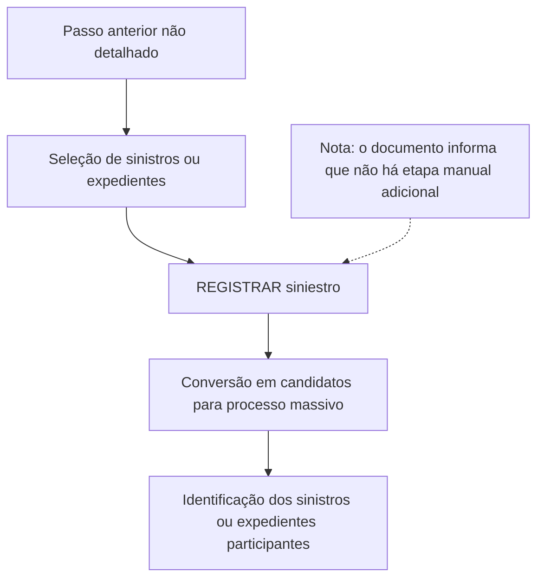

# Registro de Siniestros/Expedientes para Proceso Masivo — Documento em Construção

## 1. Metadados do Documento
- **Arquivo de Origem:** Não identificado no conteúdo fornecido
- **Tipo de Documento:** Procedimento
- **Domínio / Sistema:** Reef / Mapfre
- **Público-Alvo:** Operação, Negócio e usuários do processo massivo
- **Data/Versão Identificada:** Não identificada

---

## 2. Resumo Executivo & Contexto de Negócio

O documento descreve a etapa **“REGISTRAR siniestro”** dentro de um processo relacionado ao tratamento massivo de sinistros e expedientes. O conteúdo está explicitamente marcado como **“EN CONSTRUCCIÓN”**, indicando que a documentação ainda está em elaboração.

A finalidade declarada consiste em tomar os sinistros ou expedientes selecionados para um processo massivo e convertê-los em candidatos para esse processo. O documento não define critérios de seleção, campos envolvidos, mecanismos de execução ou regras de elegibilidade.

O objetivo operacional é conhecer quais sinistros ou expedientes participarão do processo massivo. A etapa de registro não requer ações manuais adicionais, pois ocorre como consequência do passo anterior do fluxo.

O conteúdo também referencia a documentação Reef, Mapfredocument, um proprietário identificado como `user:agonzalez_mapfre.com` e o estado de ciclo de vida **Approved Source**. Não há detalhamento adicional sobre responsabilidades, permissões, integrações, APIs, métodos HTTP ou contratos de dados.

---

## 3. Arquitetura, Componentes & Tecnologias Envolvidas

Os componentes e referências explicitamente citados são:

- **Reef:** Contexto de documentação e navegação.
- **Mapfredocument:** Referência documental exibida no conteúdo.
- **REGISTRAR siniestro:** Etapa funcional de registro de sinistros.
- **Processo massivo:** Processo para o qual sinistros ou expedientes selecionados são convertidos em candidatos.
- **Owner:** `user:agonzalez_mapfre.com`.
- **Lifecycle:** `Approved Source`.
- **VL:** Sigla exibida na área de navegação, sem definição fornecida.



> **Nota de Análise:** O documento não descreve arquitetura de software, servidores, tecnologias de implementação, banco de dados, APIs, integrações, autenticação ou contratos JSON. O diagrama representa exclusivamente o fluxo funcional declarado.

---

## 4. Regras de Negócio, Especificações Funcionais & Processos

### Finalidade da etapa “REGISTRAR siniestro”

A etapa **REGISTRAR siniestro** tem como finalidade:

1. Receber sinistros ou expedientes previamente selecionados.
2. Considerar esses sinistros ou expedientes no contexto de um processo massivo.
3. Converter os sinistros ou expedientes selecionados em candidatos para o processo massivo.
4. Permitir o conhecimento dos sinistros ou expedientes que participarão desse processo massivo.

### Regra de execução

Não é necessário seguir passos adicionais na etapa descrita, pois a execução de **REGISTRAR siniestro** é consequência do passo anterior.

### Restrições de detalhamento

O documento não informa:

- Qual é o passo anterior que desencadeia o registro.
- Quais critérios selecionam sinistros ou expedientes.
- Como um sinistro ou expediente é convertido em candidato.
- Quais são os estados possíveis de um candidato.
- Quais usuários, perfis ou sistemas executam o processo.
- Quais validações, mensagens de erro ou exceções existem.
- Quais dados do sinistro ou expediente são utilizados.
- Como o resultado do processo massivo é persistido ou consultado.

---

## 5. Tabelas de Parâmetros, Ambientes e Estruturas de Dados

| Item / Parâmetro | Descrição / Função | Tipo / Valores / Formato | Ambiente / Observações |
| :--- | :--- | :--- | :--- |
| REGISTRAR siniestro | Etapa que registra sinistros ou expedientes para participação em processo massivo. | Processo funcional | Descrita como consequência do passo anterior. |
| Siniestros | Entidades que podem ser selecionadas para um processo massivo. | Não especificado | O documento não informa estrutura, campos ou critérios. |
| Expedientes | Entidades que podem ser selecionadas para um processo massivo. | Não especificado | O documento trata sinistros e expedientes conjuntamente. |
| Proceso masivo | Processo para o qual sinistros ou expedientes selecionados são convertidos em candidatos. | Não especificado | Não há detalhes de execução, regras ou resultado. |
| Candidatos | Resultado da conversão dos sinistros ou expedientes selecionados para o processo massivo. | Não especificado | Não há definição de status, estrutura ou armazenamento. |
| Owner | Proprietário indicado na documentação. | `user:agonzalez_mapfre.com` | Referência literal apresentada no conteúdo. |
| Lifecycle | Estado de ciclo de vida da documentação. | `Approved Source` | Referência literal apresentada no conteúdo. |
| VL | Sigla presente na navegação. | `VL` | Não definida no documento. |
| Reef | Referência a documentação e navegação. | Sistema ou repositório documental não detalhado | O documento contém as expressões “Documentation / DOCUMENTACIÓN Reef” e “DOCUMENTACIÓN Reef”. |
| Mapfredocument | Referência documental. | Não especificado | Não há explicação funcional ou técnica. |

---

## 6. Bateria de Perguntas & Respostas para RAG (FAQ Sintético)

### P1: Em que consiste a etapa “REGISTRAR siniestro”?
**R:** A etapa “REGISTRAR siniestro” consiste em tomar os sinistros ou expedientes selecionados para um processo massivo e convertê-los em candidatos para esse processo massivo.

### P2: Qual é o objetivo do processo de registro de sinistros?
**R:** O objetivo é conhecer quais sinistros ou expedientes participarão do processo massivo.

### P3: É necessário executar passos manuais durante “REGISTRAR siniestro”?
**R:** Não. O documento informa que não é necessário seguir nenhum passo adicional, pois a etapa é consequência do passo anterior.

### P4: Quais entidades podem ser convertidas em candidatas para o processo massivo?
**R:** O documento menciona sinistros e expedientes selecionados como as entidades que podem ser convertidas em candidatos para o processo massivo.

### P5: O documento define como os sinistros ou expedientes são selecionados?
**R:** Não. O conteúdo informa que os sinistros ou expedientes já estão selecionados, mas não apresenta critérios, regras, filtros ou responsáveis por essa seleção.

### P6: O documento detalha APIs, métodos HTTP ou contratos JSON para “REGISTRAR siniestro”?
**R:** Não. O documento não apresenta APIs, métodos HTTP, endpoints, payloads, contratos JSON ou detalhes de integração técnica.

### P7: Quem é o proprietário identificado na documentação?
**R:** O proprietário identificado literalmente no conteúdo é `user:agonzalez_mapfre.com`.

### P8: Qual é o ciclo de vida informado para a documentação?
**R:** O ciclo de vida informado é `Approved Source`.

### P9: O que ocorre antes da etapa “REGISTRAR siniestro”?
**R:** O documento afirma que “REGISTRAR siniestro” é consequência de um passo anterior, mas não identifica nem descreve esse passo anterior.

### P10: O documento está concluído?
**R:** Não. O conteúdo inicia com a indicação “EN CONSTRUCCIÓN”, sinalizando que a documentação está em construção.

### P11: O que é “VL” no contexto apresentado?
**R:** “VL” aparece na navegação do conteúdo, porém o documento não fornece significado, definição ou relação funcional para essa sigla.

---

## 7. Glossário de Termos, Siglas & Conceitos-Chave

- **REGISTRAR siniestro:** Etapa descrita para converter sinistros ou expedientes selecionados em candidatos para um processo massivo.
- **Siniestro:** Termo apresentado no documento como uma entidade participante do processo massivo; não possui definição adicional no conteúdo.
- **Expediente:** Termo apresentado juntamente com sinistro como entidade que pode participar do processo massivo; não possui definição adicional no conteúdo.
- **Proceso masivo:** Processo para o qual sinistros ou expedientes selecionados são convertidos em candidatos.
- **Candidatos:** Sinistros ou expedientes resultantes da conversão para participação no processo massivo.
- **Reef:** Referência documental e de navegação mencionada no conteúdo.
- **Mapfredocument:** Referência documental exibida no conteúdo.
- **Owner:** Campo que identifica o proprietário da documentação.
- **Lifecycle:** Campo que identifica o estado do ciclo de vida da documentação.
- **Approved Source:** Valor exibido para o campo Lifecycle.
- **VL:** Sigla exibida sem definição no documento.

---

## 8. Notas Críticas, Riscos & Limitações

- O documento está marcado como **“EN CONSTRUCCIÓN”**.
- Não há nome de arquivo, data, versão ou autoria documental formal identificados.
- O passo anterior que origina a etapa “REGISTRAR siniestro” não foi detalhado.
- Não há critérios de seleção de sinistros ou expedientes.
- Não há definição de estruturas de dados, campos, parâmetros, formatos ou persistência.
- Não há descrição de integrações, componentes técnicos, APIs, URLs, ambientes, logs ou mecanismos de segurança.
- Não há tratamento de erros, exceções, cancelamentos, reprocessamentos ou regras de auditoria.
- **Nota de Análise:** O documento lista a etapa “REGISTRAR siniestro”, porém não detalha métodos de execução, contratos de dados, responsáveis operacionais ou validações aplicáveis.

---

## 9. Conteúdo Bruto Estruturado (Referência Fiel)

```text
--- [PÁGINA 1 DE 1] ---

EN CONSTRUCCIÓN
REGISTRAR siniestro
¿En que consiste?
Tomar los siniestros/expedientes seleccionadas para un proceso masivo y convertirlas en candidatos para este proceso.
Objetivo
Conocer aquellos siniestros/expedientes que participarían en el proceso masivo.
Proceso a seguir
No es necesario seguir paso alguno, ya que es consecuencia del paso anterior.
Documentation / DOCUMENTACIÓN Reef
DOCUMENTACIÓN Reef
Mapfredocument
DOCUMENTACIÓN Reef
Owner
user:agonzalez_mapfre.com
Lifecycle
Approved Source
 / 
 VL
Buscar Inicio Soluciones Arquitecturas APIs Componentes Cloud Documentación Zeus Reef Ayuda
ES
```
