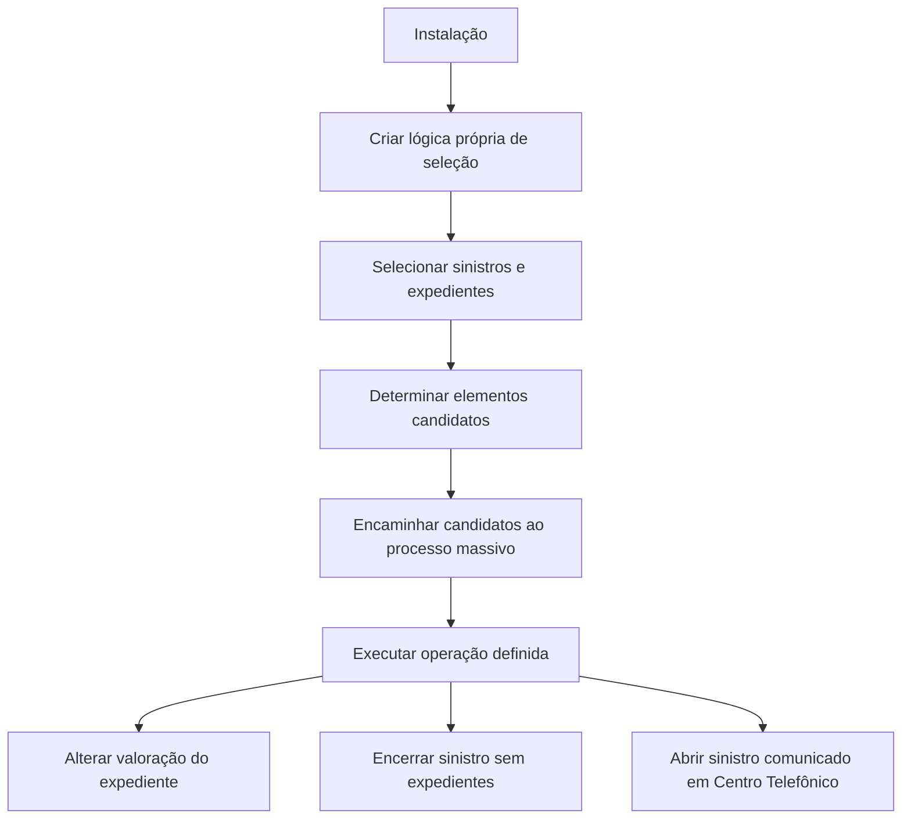

# Seleção de Sinistros e Expedientes para Processos Massivos — Documentação Reef

## 1. Metadados do Documento
- **Arquivo de Origem:** Não identificado no conteúdo fornecido
- **Tipo de Documento:** Procedimento / conteúdo funcional em construção
- **Domínio / Sistema:** Reef; Mapfre; processos massivos de sinistros e expedientes
- **Público-Alvo:** Negócio, analistas funcionais, desenvolvedores e operação
- **Data/Versão Identificada:** Não identificada
- **Owner Identificado:** `user:agonzalez_mapfre.com`
- **Lifecycle Identificado:** `Approved`

---

## 2. Resumo Executivo & Contexto de Negócio

O documento descreve um processo de seleção de sinistros e expedientes candidatos à participação em processos massivos. O propósito central é determinar quais sinistros ou expedientes devem compor uma operação previamente definida, mediante critérios de seleção específicos para cada instalação.

A seleção não é apresentada como um processo único e padronizado para todas as instalações. Cada instalação deve implementar processos personalizados, criando lógicas próprias para selecionar os sinistros e expedientes que serão processados. Essa abordagem permite adaptar os critérios de seleção às regras operacionais locais.

O conteúdo fornece exemplos de operações massivas associadas à seleção: alteração de valoração de expedientes, encerramento de sinistros sem expedientes e abertura de sinistros comunicados por um Centro Telefônico. Os exemplos indicam que o processo de seleção é uma etapa anterior e determinante para a execução da operação massiva.

A documentação está marcada como “EN CONSTRUCCIÓN”, embora o ciclo de vida exibido seja `Approved`. O texto não esclarece a relação entre esses dois estados, nem detalha implementação técnica, interfaces, contratos, agendamento, mecanismos de persistência ou métodos de execução das lógicas personalizadas.

---

## 3. Arquitetura, Componentes & Tecnologias Envolvidas

### Componentes e conceitos identificados

| Componente / Conceito | Papel descrito no conteúdo |
| :--- | :--- |
| Reef | Área ou sistema associado à documentação e ao processo de seleção. |
| Documentación Reef | Espaço documental citado no rodapé e na navegação. |
| Mapfredocument | Nome exibido na navegação documental. |
| Instalação | Unidade que deve criar e executar processos personalizados de seleção. |
| Processo personalizado da instalação | Lógica própria criada por cada instalação para selecionar sinistros e expedientes. |
| Processo massivo | Processo que recebe os elementos candidatos selecionados e executa uma operação definida. |
| Sinistro | Entidade que pode ser selecionada, aberta ou encerrada. |
| Expediente | Entidade que pode ser selecionada ou ter a valoração alterada. |
| Centro Telefônico | Origem mencionada para sinistros comunicados que podem ser usados em uma operação de abertura de sinistro. |
| Juízo | Elemento que pode ser criado pelas lógicas personalizadas, segundo o texto. |
| Peritación | Elemento que pode ser criado pelas lógicas personalizadas, segundo o texto. |
| iqrf | Termo citado como possível elemento a ser criado; o documento não o define. |

### Fluxo funcional extraído



> **Nota de Análise:** O documento descreve um fluxo funcional, mas não especifica aplicações, microsserviços, APIs, métodos HTTP, contratos JSON, bancos de dados, filas, tecnologias de integração ou infraestrutura de execução.

---

## 4. Regras de Negócio, Especificações Funcionais & Processos

### Objetivo da seleção

O processo deve determinar quais sinistros ou expedientes serão candidatos a participar do processo massivo que está sendo definido.

O objetivo operacional é extrair os sinistros ou expedientes sobre os quais se pretende realizar uma operação previamente definida.

### Regra de personalização por instalação

Cada instalação deve possuir um processo personalizado para que os elementos candidatos cheguem ao processo massivo.

Cada instalação deve criar suas próprias lógicas para selecionar sinistros e expedientes a processar. Segundo o texto, essas lógicas podem selecionar elementos para:

- Criar.
- Modificar.
- Criar um juízo.
- Criar uma peritación.
- Criar uma `iqrf`.

> **Nota de Análise:** O documento não explica o significado de `iqrf`, não define como as lógicas são implementadas e não especifica critérios comuns obrigatórios entre instalações.

### Exemplo 1 — Alteração de valoração de expediente

O processo de seleção deve extrair sinistros ou expedientes que atendam simultaneamente aos seguintes critérios:

1. Foram abertos com a reserva média.
2. Não tiveram nenhuma alteração de valoração.

A operação massiva definida para esses elementos é alterar a valoração do expediente para aumentar a reserva em 15%.

### Exemplo 2 — Encerramento de sinistro sem expediente

O processo de seleção deve extrair sinistros que atendam simultaneamente aos seguintes critérios:

1. Não possuem expedientes.
2. Foram abertos há mais de 15 anos.

A operação massiva definida para esses elementos é encerrar o sinistro sem expedientes.

### Exemplo 3 — Abertura de sinistro comunicado por Centro Telefônico

O processo deve carregar os sinistros comunicados em um Centro Telefônico.

A operação massiva definida para esses elementos é abrir o sinistro.

> **Nota de Análise:** O documento não informa quais dados devem ser recebidos do Centro Telefônico, nem define o significado operacional de “APERTURAR Siniestro”, regras de duplicidade, validações ou tratamento de falhas.

---

## 5. Tabelas de Parâmetros, Ambientes e Estruturas de Dados

### Critérios de seleção e operações massivas

| Item / Parâmetro | Descrição / Função | Tipo / Valores / Formato | Ambiente / Observações |
| :--- | :--- | :--- | :--- |
| Elemento candidato | Sinistro ou expediente selecionado para participar de um processo massivo. | Sinistro ou expediente. | Cada instalação define sua lógica de seleção. |
| Reserva inicial | Condição usada no primeiro exemplo de seleção. | Reserva média. | Aplicável a sinistros ou expedientes abertos com a reserva média. |
| Alteração de valoração | Condição de exclusão no primeiro exemplo. | Não deve existir nenhuma alteração de valoração. | Critério associado à alteração posterior da valoração. |
| Aumento de reserva | Operação prevista para o primeiro exemplo. | Aumento de 15%. | Aplicado por meio de mudança de valoração do expediente. |
| Existência de expedientes | Condição usada no segundo exemplo. | Sinistro sem expedientes. | Necessária para a operação de encerramento. |
| Antiguidade do sinistro | Condição temporal usada no segundo exemplo. | Mais de 15 anos desde a abertura. | O documento não define a data de referência para cálculo. |
| Sinistro comunicado | Fonte de seleção do terceiro exemplo. | Comunicado em um Centro Telefônico. | Associado à operação de abertura de sinistro. |
| Processo personalizado | Lógica criada por cada instalação para selecionar elementos. | Lógica específica da instalação. | Não são descritas linguagem, ferramenta ou interface. |
| Juízo | Possível resultado ou elemento a criar pelas lógicas personalizadas. | Não especificado. | Sem detalhamento adicional. |
| Peritación | Possível resultado ou elemento a criar pelas lógicas personalizadas. | Não especificado. | Sem detalhamento adicional. |
| iqrf | Possível resultado ou elemento a criar pelas lógicas personalizadas. | Não especificado. | Termo não definido no documento. |

### Informações documentais e de navegação

| Item / Parâmetro | Descrição / Função | Tipo / Valores / Formato | Ambiente / Observações |
| :--- | :--- | :--- | :--- |
| Owner | Proprietário exibido na documentação. | `user:agonzalez_mapfre.com` | Identificado no conteúdo bruto. |
| Lifecycle | Estado exibido na documentação. | `Approved` | O conteúdo também contém a expressão “EN CONSTRUCCIÓN”. |
| Idioma | Idioma selecionado na navegação. | `ES` | Conteúdo funcional em espanhol. |
| Seções de navegação | Itens exibidos na interface documental. | Buscar, Inicio, Soluciones, Arquitecturas, APIs, Componentes, Cloud, Documentación, Zeus, Reef, Ayuda | Não são especificadas relações funcionais com o processo de seleção. |

---

## 6. Bateria de Perguntas & Respostas para RAG (FAQ Sintético)

### P1: Qual é o objetivo do processo de seleção de sinistros e expedientes?
**R:** O objetivo é determinar quais sinistros ou expedientes serão candidatos a participar de um processo massivo que está sendo definido. A seleção extrai os elementos sobre os quais será executada uma operação específica.

### P2: Cada instalação utiliza a mesma lógica para selecionar sinistros e expedientes?
**R:** Não. O documento estabelece que cada instalação deve possuir um processo personalizado e criar suas próprias lógicas para selecionar os sinistros e expedientes a serem processados.

### P3: Quais tipos de ações podem estar associados às lógicas personalizadas de uma instalação?
**R:** As lógicas personalizadas podem selecionar sinistros e expedientes para criar, modificar, criar um juízo, criar uma peritación ou criar uma `iqrf`. O documento não detalha os critérios nem a implementação dessas ações.

### P4: Quais são os critérios para selecionar elementos para aumento de reserva?
**R:** O exemplo descreve a seleção de sinistros ou expedientes abertos com a reserva média e que não tenham sofrido nenhuma alteração de valoração. A operação posterior é mudar a valoração do expediente para aumentar a reserva em 15%.

### P5: Qual operação massiva é prevista para expedientes com reserva média e sem alteração de valoração?
**R:** A operação definida é alterar a valoração do expediente para aumentar a reserva em 15%.

### P6: Quando um sinistro pode ser selecionado para encerramento?
**R:** Um sinistro pode ser selecionado quando não possui expedientes e quando foi aberto há mais de 15 anos. A operação definida nesse caso é encerrar o sinistro sem expedientes.

### P7: O documento define como calcular o período de mais de 15 anos para encerramento de sinistro?
**R:** Não. O documento informa apenas que o sinistro deve ter sido aberto há mais de 15 anos. Não especifica data de referência, calendário aplicável, fuso horário ou regra de cálculo da antiguidade.

### P8: Qual é o processo descrito para sinistros comunicados por um Centro Telefônico?
**R:** O documento descreve um processo para carregar os sinistros comunicados em um Centro Telefônico. A operação massiva definida para esses elementos é abrir o sinistro.

### P9: O documento especifica APIs, microsserviços ou contratos de integração para os processos massivos?
**R:** Não. O conteúdo não informa APIs, microsserviços, métodos HTTP, contratos JSON, tecnologias de mensageria, bancos de dados ou interfaces de integração.

### P10: O que significa o termo `iqrf` no processo personalizado da instalação?
**R:** O documento menciona `iqrf` como um possível elemento a ser criado pelas lógicas personalizadas da instalação, mas não apresenta definição, sigla expandida, regra de negócio ou fluxo relacionado.

---

## 7. Glossário de Termos, Siglas & Conceitos-Chave

- **Reef:** Nome associado à documentação e ao domínio apresentado no conteúdo.
- **Sinistro:** Entidade tratada pelos processos de seleção; pode ser aberta ou encerrada conforme os exemplos.
- **Expediente:** Entidade tratada pelos processos de seleção; pode ter a valoração alterada.
- **Processo massivo:** Processo que recebe elementos candidatos selecionados e aplica uma operação definida.
- **Processo personalizado da instalação:** Lógica própria que cada instalação deve criar para selecionar sinistros e expedientes.
- **Reserva média:** Condição de abertura utilizada como critério no exemplo de alteração de valoração.
- **Valoração:** Valor ou avaliação do expediente; pode ser modificada para elevar a reserva em 15%.
- **Centro Telefônico:** Origem citada para sinistros comunicados que participam de uma operação de abertura.
- **Juízo:** Elemento mencionado como possível criação pelas lógicas personalizadas; sem definição adicional.
- **Peritación:** Elemento mencionado como possível criação pelas lógicas personalizadas; sem definição adicional.
- **iqrf:** Termo citado como possível criação pelas lógicas personalizadas; sem definição adicional.
- **Mapfredocument:** Nome exibido na navegação documental; sem definição funcional adicional.

---

## 8. Notas Críticas, Riscos & Limitações

- O conteúdo inicia com `EN CONSTRUCCIÓN`, indicando que o material pode estar incompleto, apesar de exibir `Lifecycle Approved`.
- O documento não identifica arquivo de origem, versão, data de publicação ou histórico de alterações.
- Não há especificação técnica de implementação das lógicas personalizadas por instalação.
- Não há definição de APIs, serviços, banco de dados, eventos, filas, interfaces, autenticação, autorização ou auditoria.
- Não há tratamento documentado para falhas, reprocessamento, duplicidade, concorrência, validação de dados ou reversão de operações massivas.
- O conceito de `iqrf` não é definido.
- Os conceitos de “juízo” e “peritación” são somente citados; não há regras ou estruturas associadas.
- O cálculo da condição “aberto há mais de 15 anos” não é detalhado.
- O documento não esclarece se os critérios dos exemplos são cumulativos apenas dentro de cada exemplo ou se podem ser combinados entre processos.
- Não há detalhes sobre limites de volume, agendamento, monitoramento, logs ou responsabilidades operacionais.

---

## 9. Conteúdo Bruto Estruturado (Referência Fiel)

```text
--- [PÁGINA 1 DE 1] ---

EN CONSTRUCCIÓN
SELECCIONAR siniestros
¿En que consiste?
Determinar qué siniestro/expediente serán candidatos a participar en el proceso masivo que se está deniendo.
Objetivo
Extraer aquellos siniestros/expedientes con los que se pretende realizar la operación que se está deniendo
Proceso a seguir
Para que los elementos candidatos lleguen al proceso masivo, cada instalación tendrá un proceso personalizado.
Ejemplos de Procesos de Selección:
Proceso para extraer todos aquellos siniestros/expedientes que se abrieron con la reserva promedio y no se ha realizado sobre ellos
ningún cambio de valoración. La operación que se estaría deniendo para aplicar sobre estos elementos sería CAMBIAR valoración del
Expediente para subir la reserva un 15%.
Proceso para extraer todos aquellos siniestros que no tengan expedientes, y que se hayan abierto hace más de 15 años. La operación
que se estaría deniendo sería TERMINAR Siniestro sin Expedientes.
Proceso para volcar los siniestros comunicados en un Centro Telefónico. La operación que se estaría deniendo sería APERTURAR
Siniestro.
Proceso personalizado de la instalación
Cada instalación realizará los procesos de selección de siniestros, expedientes y para ello, debe crear sus propias lógicas que seleccionen los
siniestros y expedientes a procesar para crear, para modicar, para crear un juicio, una peritación, una iqrf...
Documentation / DOCUMENTACIÓN Reef
DOCUMENTACIÓN Reef
Mapfredocument
DOCUMENTACIÓN Reef
Owner
user:agonzalez_mapfre.com
Lifecycle
Approved Source
 / 
 VL
Buscar Inicio Soluciones Arquitecturas APIs Componentes Cloud Documentación Zeus Reef Ayuda
ES
```
