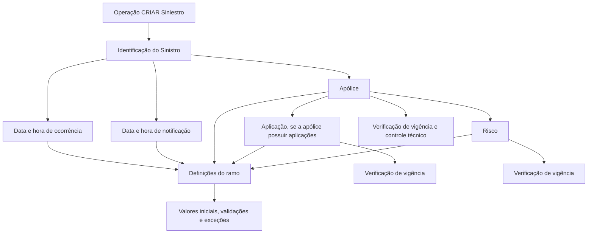

# Identificação do Sinistro — Operação de Criação de Sinistro no REEF

## 1. Metadados do Documento
- **Arquivo de Origem:** Não identificado no conteúdo fornecido
- **Tipo de Documento:** Especificação Técnica / Manual Funcional
- **Domínio / Sistema:** REEF / Mapfre — identificação de sinistro
- **Público-Alvo:** Analistas funcionais, desenvolvedores, operação e negócio
- **Data/Versão Identificada:** Não identificada

---

## 2. Resumo Executivo & Contexto de Negócio

O documento descreve as informações necessárias durante a operação **CRIAR Siniestro** no sistema REEF. O objetivo é apresentar e validar os dados de identificação do sinistro no momento de sua abertura, incluindo datas, horários, apólice, aplicação, risco e suplementos aplicáveis.

As regras descritas dependem de definições configuradas no **ramo**. Essas definições podem determinar valores iniciais para campos, obrigatoriedade de horário, validação de extemporaneidade, consideração de suplementos temporais e exceções à vigência de apólices, aplicações e riscos.

A data de ocorrência do sinistro normalmente não pode ser futura. A data de notificação também não pode ser superior ao dia corrente, e a hora de notificação não pode ultrapassar o momento de registro quando a notificação ocorre no mesmo dia.

A identificação contratual exige que a apólice esteja vigente na data de ocorrência e não esteja retida por controle técnico, salvo exceções configuradas. Aplicação e risco também possuem validações de vigência, com comportamentos distintos para apólices fixas, apólices com aplicações e apólices sem aplicações.

---

## 3. Arquitetura, Componentes & Tecnologias Envolvidas

Os elementos explicitamente citados são:

| Componente / Termo | Papel identificado no conteúdo |
| :--- | :--- |
| **REEF** | Sistema ou domínio documental associado à operação de criação de sinistro. |
| **Mapfredocument** | Referência exibida na área de documentação. |
| **CRIAR Siniestro** | Operação na qual as propriedades de identificação do sinistro são apresentadas e validadas. |
| **Ramo** | Fonte de definições que controla valores iniciais, obrigatoriedade, validações e exceções. |
| **Póliza** | Contrato afetado pelo sinistro. |
| **Aplicación** | Aplicação afetada pelo sinistro, quando a apólice possui aplicações. |
| **Riesgo** | Risco afetado pelo sinistro. |
| **Control técnico** | Estado de retenção da apólice que é verificado durante a identificação. |



> **Nota de Análise:** O conteúdo não detalha arquitetura de infraestrutura, APIs, métodos HTTP, contratos JSON, bancos de dados, ambientes técnicos ou integração entre serviços.

---

## 4. Regras de Negócio, Especificações Funcionais & Processos

### Processo de identificação do sinistro

1. A operação **CRIAR Siniestro** apresenta as propriedades necessárias para identificar o sinistro.
2. A data de ocorrência deve representar a data em que o sinistro foi produzido.
3. A data de ocorrência não pode ser superior ao dia atual, exceto quando a definição do ramo permitir comportamento diferente.
4. A data de ocorrência pode possuir valor inicial configurado.
5. A hora de ocorrência representa o horário em que o sinistro foi produzido.
6. Quando a definição do ramo tornar obrigatórios hora e minutos da data de efeito da apólice, a abertura do sinistro também exige o preenchimento de hora e minutos de ocorrência.
7. A hora de ocorrência pode possuir valor inicial configurado.
8. A data de notificação representa a data em que a empresa foi informada sobre o sinistro.
9. A data de notificação pode possuir valor inicial configurado pelo ramo.
10. Ao informar a data de notificação, o sistema valida que ela não seja superior ao dia atual.
11. Caso o ramo determine validação de extemporaneidade, a validação utiliza o máximo de dias definido. Quando a validação for aplicável, é necessário definir a extemporaneidade.
12. A hora de notificação representa a hora em que a companhia tomou conhecimento do sinistro.
13. Se a data de notificação for o dia atual, a hora de notificação não pode ser posterior ao momento de registro do sinistro.
14. A hora de notificação pode possuir valor inicial configurado pelo ramo.
15. A apólice é o número de contrato afetado pelo sinistro.
16. A apólice deve estar vigente na data de ocorrência do sinistro.
17. A definição pode estabelecer exceções para apólices fixas, sem aplicações, permitindo que a apólice não esteja vigente.
18. O sistema também verifica que a apólice não esteja retida por controle técnico.
19. A aplicação é solicitada apenas quando a apólice possui aplicações.
20. Para apólice fixa, a aplicação assume o valor `0`.
21. A aplicação pode possuir valor inicial configurado pelo ramo.
22. A aplicação deve estar vigente na data de ocorrência do sinistro.
23. A definição pode permitir exceções de vigência para aplicação em apólices com aplicações.
24. O risco representa o risco afetado pelo sinistro.
25. Se a apólice possuir somente um risco, o risco existente é apresentado por padrão.
26. O risco pode possuir valor inicial configurado pelo ramo.
27. O risco deve estar vigente na data de ocorrência do sinistro.
28. A definição pode permitir exceções para risco não vigente em apólices sem aplicações e em apólices com aplicações.
29. Ao obter a modificação da apólice correspondente à data de ocorrência, suplementos temporais são considerados, salvo definição contrária.
30. A mesma regra de suplementos temporais é aplicada à modificação da aplicação e à modificação do risco.
31. O nome do risco, ou nome do objeto segurado, é configurado por definição.

---

## 5. Tabelas de Parâmetros, Ambientes e Estruturas de Dados

| Item / Parâmetro | Descrição / Função | Tipo / Valores / Formato | Ambiente / Observações |
| :--- | :--- | :--- | :--- |
| Data de ocorrência | Data em que o sinistro ocorreu. | Data; pode ter valor inicial. | Não pode ser superior ao dia atual, exceto se a definição do ramo determinar o contrário. |
| Hora de ocorrência | Hora em que o sinistro ocorreu. | Hora; pode ter valor inicial. | Pode ser obrigatória, incluindo horas e minutos, conforme definição do ramo para a data de efeito da apólice. |
| Data de notificação | Data em que a empresa foi informada do sinistro. | Data; pode ter valor inicial. | Não pode ser superior ao dia atual. Pode estar sujeita à validação de extemporaneidade. |
| Hora de notificação | Hora em que a companhia tomou conhecimento do sinistro. | Hora; pode ter valor inicial. | Quando a data de notificação for o dia atual, não pode ser posterior ao momento de registro. |
| Extemporaneidade | Validação de atraso na notificação. | Baseada no máximo de dias definido. | Executada apenas se o ramo determinar validação de extemporaneidade. |
| Apólice | Número do contrato afetado pelo sinistro. | Número de contrato / apólice. | Deve estar vigente na data de ocorrência; valida retenção por controle técnico; há exceções configuráveis para apólices fixas sem aplicações. |
| Aplicação | Aplicação afetada pelo sinistro. | Valor configurável; `0` para apólice fixa. | Solicitada apenas se a apólice possuir aplicações; deve estar vigente na data de ocorrência, salvo exceções configuradas. |
| Risco | Risco afetado pelo sinistro. | Risco existente na apólice; pode ter valor inicial. | Se houver apenas um risco, é apresentado por padrão. Deve estar vigente, salvo exceções configuradas. |
| Suplemento da apólice | Modificação contratual correspondente à data de ocorrência. | Suplementos temporais. | Considerados por padrão, salvo definição contrária. |
| Suplemento da aplicação | Modificação da aplicação correspondente à data de ocorrência. | Suplementos temporais. | Considerados por padrão, salvo definição contrária. |
| Suplemento do risco | Modificação do risco correspondente à data de ocorrência. | Suplementos temporais. | Considerados por padrão, salvo definição contrária. |
| Nome do risco | Nome do objeto segurado. | Configurado por definição. | O documento não descreve formato, origem ou regras adicionais. |

---

## 6. Bateria de Perguntas & Respostas para RAG (FAQ Sintético)

### P1: Qual é o objetivo da operação CRIAR Siniestro no REEF?
**R:** A operação CRIAR Siniestro apresenta as informações necessárias para identificar um sinistro durante sua abertura. O processo abrange dados de ocorrência e notificação, além da identificação da apólice, aplicação, risco e suplementos associados.

### P2: A data de ocorrência do sinistro pode ser futura?
**R:** Não. A data de ocorrência não pode ser superior ao dia atual, exceto quando a definição do ramo especificar regra diferente.

### P3: Quando a hora de ocorrência deve ser obrigatoriamente informada?
**R:** A hora e os minutos de ocorrência devem ser obrigatórios na abertura do sinistro quando a definição do ramo determinar que a hora e os minutos da data de efeito da apólice são obrigatórios.

### P4: Qual validação é aplicada à data de notificação?
**R:** Ao informar a data de notificação, o sistema valida que ela não seja superior ao dia atual. A data pode assumir valor inicial se isso estiver definido no ramo.

### P5: Como funciona a validação de extemporaneidade?
**R:** Se o ramo estiver definido para validar extemporaneidade, o sistema executará a validação utilizando os dias máximos configurados. Quando a validação ocorrer, a extemporaneidade deverá ser definida.

### P6: Existe restrição para a hora de notificação no dia atual?
**R:** Sim. Se a data de notificação for o dia atual, a hora de notificação não poderá ser superior ao momento em que o sinistro está sendo registrado.

### P7: Quais validações são aplicadas à apólice?
**R:** A apólice deve estar vigente na data de ocorrência do sinistro e não pode estar retida por controle técnico. A definição pode prever exceções para apólices fixas sem aplicações, permitindo que a apólice não esteja vigente.

### P8: Quando o atributo aplicação é solicitado e qual valor recebe em apólice fixa?
**R:** A aplicação é solicitada somente quando a apólice possui aplicações. Se a apólice for fixa, a aplicação assume o valor `0`.

### P9: Como é definido o risco quando a apólice possui somente um risco?
**R:** Quando a apólice possui somente um risco, o risco existente é apresentado automaticamente como valor padrão.

### P10: Aplicação e risco precisam estar vigentes na data de ocorrência?
**R:** Sim. Aplicação e risco devem estar vigentes na data de ocorrência do sinistro. Entretanto, a definição pode permitir exceções de vigência para aplicação em apólices com aplicações e para risco em apólices com ou sem aplicações.

### P11: Os suplementos temporais são considerados ao recuperar a modificação da apólice, aplicação ou risco?
**R:** Sim. Suplementos temporais são considerados ao obter a modificação correspondente à data de ocorrência para apólice, aplicação e risco, salvo se a definição determinar o contrário.

### P12: Como é obtido o nome do risco?
**R:** O nome do risco, identificado como nome do objeto segurado, é configurado por definição. O documento não detalha a origem dessa configuração.

---

## 7. Glossário de Termos, Siglas & Conceitos-Chave

- **REEF:** Sistema ou domínio documental citado como “DOCUMENTACIÓN Reef”.
- **CRIAR Siniestro:** Operação de criação ou abertura de sinistro.
- **Siniestro:** Sinistro; evento que afeta uma apólice, aplicação ou risco.
- **Ramo:** Estrutura de definição que controla regras, valores iniciais, obrigatoriedade, validações e exceções.
- **Póliza:** Apólice; número de contrato afetado pelo sinistro.
- **Aplicación:** Aplicação associada à apólice e afetada pelo sinistro.
- **Riesgo:** Risco afetado pelo sinistro.
- **Suplemento temporal:** Suplemento considerado na obtenção da modificação de apólice, aplicação ou risco, salvo definição contrária.
- **Extemporaneidad:** Validação relacionada aos dias máximos definidos entre a ocorrência/notificação, quando habilitada pelo ramo.
- **Control técnico:** Controle que pode manter uma apólice retida.
- **Mapfredocument:** Referência documental exibida no conteúdo fonte.

---

## 8. Notas Críticas, Riscos & Limitações

- O documento depende de configurações por ramo, mas não identifica onde essas definições são mantidas nem seus valores permitidos.
- Não são detalhadas mensagens de erro, comportamento de interface, persistência de dados, APIs, serviços, contratos ou integrações técnicas.
- As exceções de vigência para apólice, aplicação e risco são mencionadas, mas os critérios de configuração não são descritos.
- A validação de extemporaneidade cita “dias máximos fixados”, porém não informa a fórmula, o valor máximo nem os efeitos de uma reprovação.
- O conteúdo bruto contém caracteres de extração corrompidos, como ``, em palavras como “definición”, “fijados”, “modificación” e “configura”.
- **Nota de Análise:** O documento lista REEF e Mapfredocument, porém não detalha componentes técnicos, métodos HTTP, URLs, ambientes, logs ou contratos JSON.

---

## 9. Conteúdo Bruto Estruturado (Referência Fiel)

```text
--- [PÁGINA 1 DE 2] ---

Identicación del Siniestro
¿En que consiste?
Mostrar la información requerida a nivel de siniestro cuando se realiza la operación que CREAR Siniestro.
Proceso a seguir
A continuación detallan las propiedades que pueden participar en esta operación
Identicación del siniestro
Fecha de ocurrencia ( )
Indica la fecha en la que se produjo el siniestro.
Esta fecha no puede ser superior a la del día, excepto que en la denición del ramo se especique lo contrario.
Se puede denir un valor inicial
Hora de ocurrencia( )
Indica la hora en la que se produjo el siniestro.
Si en la denición del ramo la fecha de efecto de la póliza la hora y minutos es obligatoria, en la apertura del siniestro será obligatorio
introducir hora y minutos de ocurrencia.
Se puede denir una hora de ocurrencia inicial
Fecha de Noticación( )
Indica la fecha en la que el siniestro ha sido informado a la empresa.
Esta fecha puede tomar un valor inicial, si así se ha denido en el ramo.
Cuando se introduzca la fecha de noticación, se validará que no sea superior a la del día.
Documentation / DOCUMENTACIÓN Reef
DOCUMENTACIÓN Reef
Mapfredocument
DOCUMENTACIÓN Reef
Owner
user:agonzalez_mapfre.com
Lifecycle
Approved Source
 / 
 VL
Buscar Inicio Soluciones Arquitecturas APIs Componentes Cloud Documentación Zeus Reef Ayuda
ES


--- [PÁGINA 2 DE 2] ---

Si el ramo tiene denido que se valide la extemporaneidad, realizará dicha validación con los días máximos jados. Si se valida hay que
denir la extemporaneidad
Hora de Noticación ( )
Indica la hora en la que la compañía tiene conocimiento del siniestro.
Si la fecha es la del día no podrá ser una hora superior a la del momento que se está ingresando el siniestro.
Esta hora puede tomar un valor inicial, si así se ha denido en el ramo.
Póliza( )
Número de contrato (póliza) a la que afecta el siniestro.
Tiene que estar vigente a la fecha de ocurrencia del siniestro. Mediante la denición, se puede haber excepciones en Pólizas jas, sin
aplicaciones en el que se puede permitir que la póliza no esté vigente . También se verica que la póliza no esté retenida por control técnico.
Aplicación ( )
Indica la aplicación a la que afecta el siniestro. Sólo pedirá este atributo, si la póliza tiene aplicaciones. Si la póliza es ja, tomará el valor 0.
La aplicación puede tomar un valor inicial, si así se ha denido en el ramo.
La aplicación tiene que estar vigente a la fecha de ocurrencia del siniestro.
Mediante la denición, se pueden hacer excepciones en las que se puede permitir que la aplicación no esté vigente:
Pólizas con aplicaciones.
Riesgo( )
Indica el riesgo que se ve afectado por el siniestro. Si la póliza tiene sólo un riesgo, saldrá por defecto el riesgo existente.
El riesgo puede tomar un valor inicial, si así se ha denido en el ramo. El riesgo tiene que estar vigente a la fecha de ocurrencia del siniestro.
Mediante la denición, se pueden hacer excepciones en las que se puede permitir que el riesgo no esté vigente:
Pólizas sin aplicaciones.
Pólizas con aplicaciones.
Suplemento de la póliza
Al obtener la modicación de la póliza, que corresponde a la fecha de ocurrencia del siniestro, se tendrá en cuenta los suplementos
temporales, a no ser que la denición no diga lo contrario.
Suplemento de la Aplicación
Al obtener la modicación de la aplicación, que corresponde a la fecha de ocurrencia del siniestro, se tendrá en cuenta los suplementos
temporales, a no ser que la denición no diga lo contrario.
Suplemento del Riesgo
Al obtener la modicación del riesgo, que corresponde a la fecha de ocurrencia del siniestro, se tendrá en cuenta los suplementos
temporales, a no ser que la denición no diga lo contrario.
Nombre del Riesgo
El Nombre del objeto asegurado se congura por denición.
```
