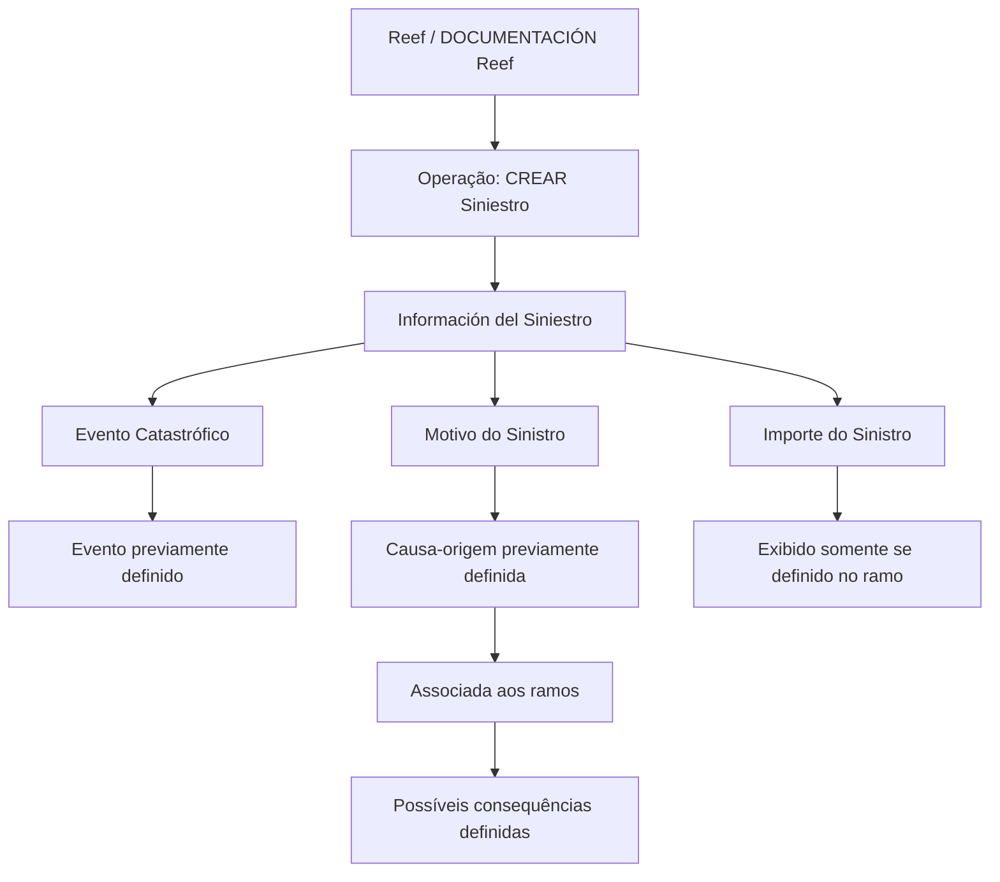

# Informação do Sinistro — Operação “CRIAR Sinistro” no Reef

## 1. Metadados do Documento
- **Arquivo de Origem:** Não identificado no conteúdo fornecido
- **Tipo de Documento:** Especificação Funcional
- **Domínio / Sistema:** Reef / Mapfre
- **Público-Alvo:** Desenvolvedores, Analistas Funcionais, Operação
- **Data/Versão Identificada:** Não identificada

---

## 2. Resumo Executivo & Contexto de Negócio

O documento descreve a funcionalidade **“Información del Siniestro”** no contexto da operação **“CREAR Siniestro”**. O objetivo declarado é apresentar, no nível do sinistro, as informações requeridas durante a criação de um sinistro.

A especificação relaciona três propriedades que podem participar da operação: **Evento Catastrófico**, **Motivo do Sinistro** e **Importe do Sinistro**. Cada propriedade possui condições e pré-requisitos funcionais próprios, especialmente relacionados à configuração prévia de eventos, causas-origem, ramos e consequências.

O conteúdo indica que o processo de criação de sinistro depende de parametrizações anteriores no domínio do Reef. Um evento catastrófico precisa estar previamente definido; as causas-origem precisam ser definidas, associadas aos ramos e vinculadas às possíveis consequências; e a exibição do valor estimado do sinistro depende de uma definição no ramo.

O material aparece identificado como **“EN CONSTRUCCIÓN”**, o que sinaliza conteúdo em elaboração. Não há detalhamento sobre interfaces, contratos de API, métodos HTTP, persistência, regras de validação técnica, mensagens de erro, permissões ou fluxo de aprovação.

---

## 3. Arquitetura, Componentes & Tecnologias Envolvidas

Os elementos explicitamente citados são:

| Componente / Termo | Papel identificado no conteúdo |
| :--- | :--- |
| Reef | Sistema ou domínio documental e funcional referido como “DOCUMENTACIÓN Reef”. |
| Mapfre | Contexto corporativo associado ao proprietário `agonzalez_mapfre.com`. |
| Operação “CREAR Siniestro” | Operação na qual são apresentadas informações requeridas no nível do sinistro. |
| Información del Siniestro | Funcionalidade ou seção que apresenta atributos do sinistro durante a criação. |
| Ramo | Elemento de configuração ao qual causas-origem são associadas e que pode determinar a exibição do valor do sinistro. |
| Evento Catastrófico | Indicador de que o sinistro decorre de um evento catastrófico previamente definido. |
| Motivo do Sinistro | Atributo que indica a origem ou causa desencadeadora do sinistro. |
| Importe do Sinistro | Atributo que contém a estimativa do sinistro, condicionado à configuração do ramo. |
| Mapfredocument | Termo exibido na área de documentação; sem detalhamento funcional adicional. |
| Zeus | Item presente na navegação do portal; sem relação funcional detalhada com a operação. |



> **Nota de Análise:** O documento não descreve uma arquitetura técnica de software, integrações entre sistemas, APIs, bancos de dados, protocolos, ambientes ou tecnologias de implementação.

---

## 4. Regras de Negócio, Especificações Funcionais & Processos

### 4.1 Objetivo funcional

A funcionalidade **Información del Siniestro** deve mostrar as informações requeridas no nível do sinistro quando a operação **CREAR Siniestro** é realizada.

### 4.2 Propriedade: Evento Catastrófico

- A propriedade indica se o sinistro ocorreu como consequência de um evento catastrófico.
- Antes de realizar a operação de criação de sinistro, o evento catastrófico deve ter sido definido.
- O conteúdo não informa:
  - valores permitidos para o indicador;
  - formato do campo;
  - catálogo de eventos;
  - regra de obrigatoriedade;
  - comportamento quando não houver evento previamente definido.

### 4.3 Propriedade: Motivo do Sinistro

- A propriedade indica a origem do sinistro.
- A propriedade também representa a causa que desencadeou o sinistro.
- As causas-origem devem ser definidas previamente.
- As causas-origem devem ser associadas aos ramos.
- Após a associação aos ramos, devem ser definidas as possíveis consequências para cada causa-origem.
- O documento não detalha como a consequência é selecionada, persistida ou validada durante a operação **CREAR Siniestro**.

### 4.4 Propriedade: Importe do Sinistro

- O atributo contém a estimativa do sinistro.
- O atributo somente é mostrado quando essa exibição tiver sido definida no ramo.
- O conteúdo não especifica:
  - moeda;
  - precisão decimal;
  - obrigatoriedade;
  - limites mínimos ou máximos;
  - regras de cálculo;
  - fonte da estimativa;
  - comportamento para ramos que não definem a apresentação do atributo.

### 4.5 Processo funcional extraído

1. Definir previamente o evento quando houver necessidade de indicar um evento catastrófico.
2. Definir previamente as causas-origem do sinistro.
3. Associar as causas-origem aos ramos.
4. Definir as possíveis consequências para cada causa-origem.
5. Configurar no ramo se o atributo **Importe do Sinistro** deve ser mostrado.
6. Executar a operação **CREAR Siniestro**.
7. Apresentar as propriedades aplicáveis no nível do sinistro.

---

## 5. Tabelas de Parâmetros, Ambientes e Estruturas de Dados

| Item / Parâmetro | Descrição / Função | Tipo / Valores / Formato | Ambiente / Observações |
| :--- | :--- | :--- | :--- |
| Evento Catastrófico | Indica se o sinistro aconteceu como consequência de um evento catastrófico. | Não especificado. O texto apresenta o atributo como `Evento Catastrófico ( )`. | O evento deve estar definido antes da operação. |
| Motivo do Sinistro | Indica a origem do sinistro e a causa que o desencadeou. | Não especificado. O texto apresenta o atributo como `Motivo del siniestro( )`. | As causas-origem devem ser definidas previamente, associadas aos ramos e vinculadas a possíveis consequências. |
| Importe do Sinistro | Contém a estimativa do sinistro. | Não especificado. O texto apresenta o atributo como `Importe del Siniestro( )`. | Exibido apenas quando definido no ramo. |
| Evento | Entidade ou configuração utilizada para identificar ocorrência catastrófica. | Não especificado. | Deve existir antes de criar o sinistro. |
| Causa-origem | Causa que desencadeia o sinistro. | Não especificado. | Deve ser previamente definida. |
| Ramo | Contexto de negócio ao qual causas-origem são associadas. | Não especificado. | Também condiciona a exibição do Importe do Sinistro. |
| Consequência | Possível consequência associada a uma causa-origem. | Não especificado. | Deve ser definida para cada causa-origem. |
| Owner | Proprietário exibido no portal documental. | `user:agonzalez_mapfre.com` | Associado à documentação Reef. |
| Lifecycle | Estado de ciclo de vida do conteúdo. | `Approved` | Exibido no cabeçalho documental. |
| Source | Identificador de origem do conteúdo. | `VL` | Exibido no cabeçalho documental. |

> **Nota de Análise:** O documento não fornece URLs, servidores, nomes de ambientes, variáveis de log, estruturas JSON, campos de banco de dados ou contratos de integração.

---

## 6. Bateria de Perguntas & Respostas para RAG (FAQ Sintético)

### P1: Qual é o objetivo da funcionalidade “Información del Siniestro”?
**R:** A funcionalidade “Información del Siniestro” tem como objetivo mostrar, no nível do sinistro, as informações requeridas quando a operação “CREAR Siniestro” é realizada.

### P2: Quais propriedades podem participar da operação “CREAR Siniestro”?
**R:** O documento lista três propriedades que podem participar da operação “CREAR Siniestro”: Evento Catastrófico, Motivo do Sinistro e Importe do Sinistro.

### P3: O que indica o atributo Evento Catastrófico?
**R:** O atributo Evento Catastrófico indica se o sinistro ocorreu como consequência de um evento catastrófico.

### P4: Qual pré-requisito existe para utilizar um evento catastrófico na criação de um sinistro?
**R:** Antes da realização da operação “CREAR Siniestro”, o evento catastrófico precisa ter sido definido previamente.

### P5: O que representa o Motivo do Sinistro?
**R:** O Motivo do Sinistro indica a origem do sinistro, ou seja, a causa que desencadeou o sinistro.

### P6: Quais configurações são necessárias para as causas-origem do sinistro?
**R:** As causas-origem devem ser definidas previamente, associadas aos ramos e, posteriormente, devem ter as possíveis consequências definidas para cada causa-origem.

### P7: O que contém o atributo Importe do Sinistro?
**R:** O atributo Importe do Sinistro contém a estimativa do sinistro.

### P8: Quando o Importe do Sinistro é exibido?
**R:** O Importe do Sinistro é mostrado apenas quando a sua exibição tiver sido definida no ramo.

### P9: O documento define o formato, a moeda ou regras de cálculo para o Importe do Sinistro?
**R:** Não. O documento apenas informa que o atributo contém a estimativa do sinistro e que sua exibição depende de uma definição no ramo. Moeda, formato, precisão e regras de cálculo não são detalhados.

### P10: O documento especifica APIs ou métodos HTTP para a operação “CREAR Siniestro”?
**R:** Não. O documento não descreve endpoints, métodos HTTP, contratos JSON, autenticação, integrações ou detalhes técnicos de implementação da operação “CREAR Siniestro”.

### P11: Qual é o estado de ciclo de vida exibido para a documentação?
**R:** O cabeçalho documental apresenta o campo Lifecycle com o valor `Approved`.

### P12: A documentação está completa?
**R:** O conteúdo contém a indicação “EN CONSTRUCCIÓN”, sugerindo que o material está em construção. Além disso, diversos detalhes técnicos e funcionais, como formatos de campos e regras de validação, não são apresentados.

---

## 7. Glossário de Termos, Siglas & Conceitos-Chave

- **CREAR Siniestro:** Operação mencionada no documento durante a qual informações requeridas são mostradas no nível do sinistro.
- **Evento Catastrófico:** Evento cuja ocorrência pode ser indicada como causa do sinistro; deve estar definido previamente.
- **Importe do Sinistro:** Atributo que contém a estimativa do sinistro.
- **Información del Siniestro:** Seção ou funcionalidade que apresenta informações do sinistro na operação de criação.
- **Motivo do Sinistro:** Origem ou causa que desencadeou o sinistro.
- **Ramo:** Elemento de configuração ao qual causas-origem são associadas e que pode determinar a exibição do Importe do Sinistro.
- **Causa-origem:** Causa previamente definida que representa a origem do sinistro.
- **Consequência:** Possível resultado associado a uma causa-origem.
- **Reef:** Sistema ou domínio referido pela documentação.
- **Mapfre:** Nome presente no contexto documental e no identificador do proprietário.
- **VL:** Valor exibido como Source no cabeçalho documental; significado não detalhado.
- **Zeus:** Item listado na navegação do portal; significado e relação com o processo não detalhados.

---

## 8. Notas Críticas, Riscos & Limitações

- O documento está identificado como **“EN CONSTRUCCIÓN”**, o que pode indicar especificação incompleta.
- Não há versão nem data identificada no conteúdo fornecido.
- Não há nome de arquivo de origem disponível.
- Não são definidos tipos, formatos, obrigatoriedade ou valores permitidos para Evento Catastrófico, Motivo do Sinistro e Importe do Sinistro.
- Não são descritas mensagens de erro, critérios de validação, perfis de acesso, auditoria ou tratamento de exceções.
- Não há especificação de contratos de API, endpoints, métodos HTTP, payloads JSON, tecnologias, bancos de dados ou integrações.
- O significado de `VL`, `Mapfredocument` e a relação de `Zeus` com a operação não são explicados.
- **Nota de Análise:** O documento lista propriedades funcionais do sinistro, mas não detalha como essas propriedades são persistidas, consumidas por serviços ou apresentadas em uma interface.

---

## 9. Conteúdo Bruto Estruturado (Referência Fiel)

```text
--- [PÁGINA 1 DE 1] ---

EN CONSTRUCCIÓN
Información del Siniestro
¿En que consiste?
Mostrar la información requerida a nivel de siniestro cuando se realiza la operación que CREAR Siniestro.
Proceso a seguir
A continuación detallan las propiedades que pueden participar en esta operación
Imagen IDENTIFICACIÓN
Información del siniestro
Evento Catastróco ( )
Indica si el siniestro ha sucedido como consecuencia de un evento catastróco. Previo a realizar la operación, se ha tenido que denir el
evento
Motivo del siniestro( )
Indica el origen del siniestro, la causa que desencadenó el siniestro. Las causas origen del siniestro deben denirse previamente, asociarse a
los ramos y posteriormente denir las posibles consecuencias para cada causa-origen.
Importe del Siniestro( )
Este atributo contendrá la estimación del siniestro. Se mostrará sólo cuando así se haya denido en el ramo
Documentation / DOCUMENTACIÓN Reef
DOCUMENTACIÓN Reef
Mapfredocument
DOCUMENTACIÓN Reef
Owner
user:agonzalez_mapfre.com
Lifecycle
Approved Source
 / 
 VL
Buscar Inicio Soluciones Arquitecturas APIs Componentes Cloud Documentación Zeus Reef Ayuda
ES
```
