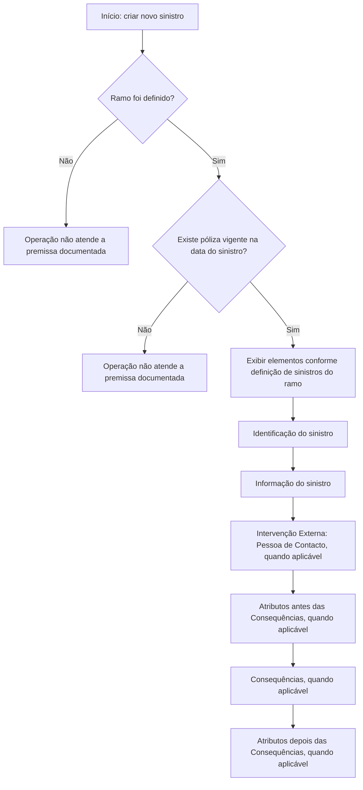

# Procedimento de Criação de Sinistro no Reef.core

## 1. Metadados do Documento
- **Arquivo de Origem:** `Não identificado no conteúdo fornecido`
- **Tipo de Documento:** `Procedimento`
- **Domínio / Sistema:** `Reef.core / documentação Reef`
- **Público-Alvo:** `Não identificado; o conteúdo descreve uma operação de criação de sinistro`
- **Data/Versão Identificada:** `Não identificada`

---

## 2. Resumo Executivo & Contexto de Negócio

O documento descreve a operação **“Crear siniestro”**, destinada à criação de um novo sinistro no sistema **Reef.core**. O objetivo explicitamente indicado é identificar a informação mínima necessária para executar a operação.

A criação de sinistro depende da definição prévia do **ramo**. A informação solicitada durante o processo varia conforme a definição de sinistros configurada para esse ramo. Portanto, o procedimento não estabelece um conjunto universal e fixo de campos para todos os ramos.

Como premissa operacional, deve existir uma **póliza vigente** na data do sinistro. O documento apresenta uma sequência de elementos da seção “INFORMACIÓN DE SINIESTRO”, incluindo identificação, informações do sinistro, intervenção externa, atributos antes e depois das consequências e consequências.

O conteúdo não detalha telas, campos específicos, validações técnicas, métodos HTTP, integrações, contratos de dados ou critérios de persistência do sinistro no Reef.core.

---

## 3. Arquitetura, Componentes & Tecnologias Envolvidas

Os elementos explicitamente citados são:

- **Reef.core:** sistema no qual é criado um novo sinistro.
- **Ramo:** definição que condiciona as informações solicitadas pela operação.
- **Póliza:** deve estar vigente na data do sinistro.
- **Mapfredocument:** nome exibido na navegação do conteúdo.
- **DOCUMENTACIÓN Reef:** contexto documental no qual o procedimento está publicado.
- **Owner:** `user:agonzalez_mapfre.com`
- **Lifecycle:** `Approved`
- **Source:** `VL`

O documento não descreve uma arquitetura técnica de camadas, microsserviços, banco de dados, APIs, protocolos ou ambientes. O diagrama abaixo representa somente o fluxo funcional explicitamente apresentado.



> **Nota de Análise:** O documento não detalha o comportamento quando uma premissa não é atendida, nem informa mensagens de erro, responsáveis pela validação ou mecanismos técnicos de bloqueio.

---

## 4. Regras de Negócio, Especificações Funcionais & Processos

### Objetivo da operação
- Criar um novo sinistro no **Reef.core**.
- Conhecer a informação mínima necessária para realizar a operação.

### Premissas para criação de sinistro
1. O **ramo** deve ter sido definido.
2. A informação solicitada depende da definição realizada para o ramo.
3. Deve existir uma **póliza vigente** na data do sinistro.

### Sequência funcional apresentada
A seção “INFORMACIÓN DE SINIESTRO” enumera os elementos e a ordem em que aparecem. A ordem depende da definição de sinistros para o ramo:

1. **Identificación del siniestro**
2. **Información del siniestro**
3. **Intervención Externa (Persona de Contacto)**, apresentada entre colchetes e parênteses no conteúdo.
4. **Atributos antes de las Consecuencias**, apresentada entre colchetes e parênteses no conteúdo.
5. **Consecuencias**, apresentada entre colchetes e parênteses no conteúdo.
6. **Atributos después de Consecuencias**, apresentada entre colchetes e parênteses no conteúdo.

> **Nota de Análise:** Os marcadores entre colchetes e parênteses são preservados do texto original. O documento não define se representam opcionalidade, condição de exibição, estado de tela ou outro comportamento.

> **Nota de Análise:** O documento não especifica os campos que compõem “Identificación del siniestro”, “Información del siniestro”, “Consecuencias” ou os grupos de atributos.

---

## 5. Tabelas de Parâmetros, Ambientes e Estruturas de Dados

| Item / Parâmetro | Descrição / Função | Tipo / Valores / Formato | Ambiente / Observações |
| :--- | :--- | :--- | :--- |
| Operação | Criar um novo sinistro | `Crear siniestro` | Executada no Reef.core |
| Sistema | Sistema de destino da criação do sinistro | `Reef.core` | Não há ambiente técnico identificado |
| Objetivo | Conhecer a informação mínima necessária para executar a operação | Texto descritivo | Não detalha campos mínimos |
| Ramo | Definição necessária para a operação; determina a informação solicitada | Não especificado | Premissa obrigatória |
| Definição de sinistros | Configuração que condiciona os elementos e sua ordem de exibição | Não especificado | Associada ao ramo |
| Póliza | Deve estar vigente na data do sinistro | Vigência na data do sinistro | Premissa obrigatória |
| Identificación del siniestro | Primeiro elemento da seção de informação de sinistro | Não especificado | Campos não detalhados |
| Información del siniestro | Segundo elemento da seção de informação de sinistro | Não especificado | Campos não detalhados |
| Intervención Externa | Elemento identificado como “Persona de Contacto” | `[ Intervención Externa (Persona de Contacto)] ( )` | Sem regra de aplicabilidade detalhada |
| Atributos antes de las Consecuencias | Grupo de atributos posicionado antes das consequências | `[ Atributos antes de las Consecuencias] ( )` | Sem estrutura detalhada |
| Consecuencias | Elemento da sequência de informação do sinistro | `[ Consecuencias] ( )` | Sem estrutura detalhada |
| Atributos después de Consecuencias | Grupo de atributos posicionado depois das consequências | `[ Atributos después de Consecuencias] ( )` | Sem estrutura detalhada |
| Owner | Responsável exibido na documentação | `user:agonzalez_mapfre.com` | Metadado documental |
| Lifecycle | Estado do ciclo de vida exibido | `Approved` | Metadado documental |
| Source | Fonte exibida no conteúdo | `VL` | Significado não detalhado |
| Navegação documental | Itens de navegação exibidos | `Buscar`, `Inicio`, `Soluciones`, `Arquitecturas`, `APIs`, `Componentes`, `Cloud`, `Documentación`, `Zeus`, `Reef`, `Ayuda` | Não representa arquitetura técnica |

---

## 6. Bateria de Perguntas & Respostas para RAG (FAQ Sintético)

### P1: Qual é a finalidade da operação “Crear siniestro” no Reef.core?
**R:** A operação “Crear siniestro” permite criar um novo sinistro no sistema Reef.core. O objetivo declarado do documento é conhecer a informação mínima necessária para realizar essa operação.

### P2: Qual é a premissa relacionada ao ramo para criar um sinistro?
**R:** Para realizar a operação de criação de sinistro, o ramo deve ter sido definido previamente. A informação solicitada no processo depende da definição realizada para esse ramo.

### P3: É necessário haver uma póliza vigente para criar um sinistro?
**R:** Sim. O documento estabelece que é necessária uma póliza vigente na data do sinistro para realizar a operação.

### P4: Quais são os primeiros elementos apresentados na seção “INFORMACIÓN DE SINIESTRO”?
**R:** Os primeiros elementos apresentados são “Identificación del siniestro” e “Información del siniestro”. O documento não detalha os campos internos de nenhum desses elementos.

### P5: A ordem dos elementos de informação do sinistro é sempre igual para todos os ramos?
**R:** Não necessariamente. O documento informa que os elementos e a ordem em que aparecem dependem da definição de sinistros para o ramo.

### P6: O que é “Intervención Externa (Persona de Contacto)” no processo de criação de sinistro?
**R:** “Intervención Externa (Persona de Contacto)” é um elemento listado na sequência de informação do sinistro. O texto não explica seus campos, sua obrigatoriedade ou as condições em que deve ser apresentado.

### P7: Onde aparecem os atributos relacionados às consequências?
**R:** O documento lista “Atributos antes de las Consecuencias”, seguido de “Consecuencias” e depois “Atributos después de Consecuencias”. Essa é a ordem exibida no conteúdo original.

### P8: O documento informa APIs, métodos HTTP ou contratos JSON para criar sinistros?
**R:** Não. O conteúdo não apresenta APIs, métodos HTTP, URLs, contratos JSON, esquemas de dados ou detalhes de integração técnica para a criação de sinistros no Reef.core.

### P9: Quais metadados documentais são exibidos?
**R:** O conteúdo exibe o owner `user:agonzalez_mapfre.com`, o lifecycle `Approved` e a source `VL`. O significado de `VL` não é explicado no texto.

### P10: Quais condições de erro ou rejeição são documentadas para a criação de sinistro?
**R:** O documento informa apenas as premissas de ramo definido e póliza vigente na data do sinistro. Não descreve mensagens de erro, regras de rejeição, responsáveis por validações ou comportamento do sistema caso as premissas não sejam atendidas.

---

## 7. Glossário de Termos, Siglas & Conceitos-Chave

- **Reef.core:** Sistema no qual a operação permite criar um novo sinistro.
- **Siniestro:** Termo utilizado no documento para o registro que será criado no Reef.core.
- **Ramo:** Definição que deve existir previamente e que condiciona as informações solicitadas para a criação do sinistro.
- **Póliza:** Registro que deve estar vigente na data do sinistro.
- **Consecuencias:** Elemento da sequência de informação do sinistro; o documento não detalha sua estrutura.
- **Intervención Externa:** Elemento listado como “Persona de Contacto”; não possui detalhamento adicional.
- **Mapfredocument:** Nome exibido no conteúdo documental; não definido adicionalmente.
- **VL:** Valor exibido como “Source”; significado não identificado no texto.

---

## 8. Notas Críticas, Riscos & Limitações

- O documento está marcado como **“EN CONSTRUCCIÓN”**, indicando conteúdo em construção.
- Não há identificação de arquivo, data, versão ou ambiente técnico.
- Não são detalhados os campos mínimos necessários para criar um sinistro, apesar de esse ser o objetivo declarado.
- O conteúdo não define os critérios de obrigatoriedade, condições de exibição ou semântica dos marcadores entre colchetes e parênteses.
- Não há contratos de integração, APIs, métodos HTTP, dados de autenticação, URLs, portas ou mecanismos de persistência.
- Não são apresentados comportamentos de erro quando o ramo não está definido ou quando não há póliza vigente.
- O significado de **VL**, apresentado como fonte, não é explicado.
- O documento não descreve as estruturas de “Consecuencias”, “Atributos antes de las Consecuencias” e “Atributos después de Consecuencias”.

---

## 9. Conteúdo Bruto Estruturado (Referência Fiel)

```text
--- [PÁGINA 1 DE 1] ---

EN CONSTRUCCIÓN
CREAR siniestro
¿En que consiste?
Esta operación permite crear un nuevo siniestro en Reef.core.
Objetivo
Conocer la información mínima necesaria con la que poder realizar la operación.
Premisas
Para poder realizar esta operación es necesario que se haya denido el ramo,la información solicitada depende de la denición que se haya
realizado del ramo. Se necesita una póliza vigente a la fecha del siniestro.
Proceso a seguir
En este apartado se enumeran los elementos y el orden en el que aparecerán (siempre dependiendo de la denición de siniestros para el
ramo del ramo).
INFORMACIÓN DE SINIESTRO
 Identicación del siniestro( )
 Información del siniestro( )
[  Intervención Externa (Persona de Contacto)] ( ) [  Atributos antes de las Consecuencias] ( )
[  Consecuencias] ( )
[  Atributos después de Consecuencias] ( )
Documentation / DOCUMENTACIÓN Reef
DOCUMENTACIÓN Reef
Mapfredocument
DOCUMENTACIÓN Reef
Owner
user:agonzalez_mapfre.com
Lifecycle
Approved Source
 / 
 VL
Buscar Inicio Soluciones Arquitecturas APIs Componentes Cloud Documentación Zeus Reef Ayuda
ES
```
