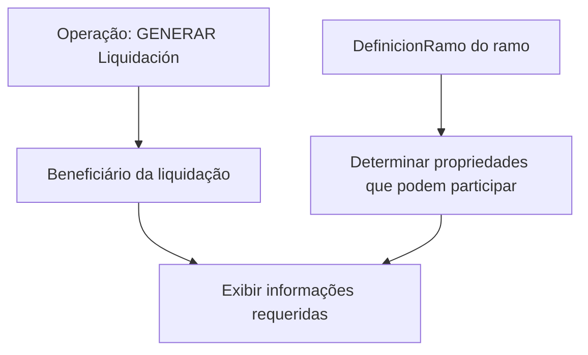

# Documentação Reef — Gerar Liquidação: Beneficiário

## 1. Metadados do Documento
- **Arquivo de Origem:** Não identificado no conteúdo fornecido
- **Tipo de Documento:** Procedimento
- **Domínio / Sistema:** Reef / Mapfre
- **Público-Alvo:** Desenvolvedores, Arquitetos, Operação e Negócio
- **Data/Versão Identificada:** Não identificada

---

## 2. Resumo Executivo & Contexto de Negócio

O conteúdo documenta a operação **“GENERAR Liquidación - Beneficiario”** no contexto da documentação Reef. A operação tem como finalidade mostrar as informações requeridas para o beneficiário quando ocorre uma ação de geração de liquidação.

O objetivo declarado é permitir conhecer quais informações podem ser solicitadas nesse nível, conforme a definição do ramo. O documento faz referência explícita a uma definição denominada **DefinicionRamo**, embora não apresente o conteúdo dessa definição nem os critérios que determinam quais propriedades serão solicitadas.

O fluxo descrito é resumido: a operação de gerar liquidação envolve o beneficiário da liquidação e possui propriedades que podem participar da operação. Não há detalhamento de contratos, campos, métodos HTTP, interfaces, persistência de dados, validações técnicas ou tratamento de erros.

O material aparenta estar em construção, conforme a indicação **“EN CONSTRUCCIÓN”**. Portanto, deve ser utilizado como referência para o propósito funcional declarado, mas não como especificação técnica completa da operação.

---

## 3. Arquitetura, Componentes & Tecnologias Envolvidas

Os elementos explicitamente citados são:

- **Reef:** contexto de documentação e navegação.
- **Mapfre:** referência corporativa apresentada como “Mapfredocument”.
- **GENERAR Liquidación:** operação funcional de geração de liquidação.
- **Beneficiario:** entidade ou nível funcional destinatário das informações apresentadas.
- **DefinicionRamo:** definição de ramo usada para determinar quais informações podem ser solicitadas.
- **DOCUMENTACIÓN Reef:** área documental onde o conteúdo está publicado.
- **Zeus:** item de navegação listado, sem relação arquitetural explicada.
- **Cloud:** item de navegação listado, sem relação arquitetural explicada.
- **VL:** identificador exibido no cabeçalho, sem definição no conteúdo.



> **Nota de Análise:** O documento não descreve microsserviços, APIs, tecnologias de implementação, bancos de dados, protocolos, ambientes ou contratos de integração. O diagrama representa apenas a relação funcional explicitamente apresentada.

---

## 4. Regras de Negócio, Especificações Funcionais & Processos

### Operação documentada

A operação identificada no documento é:

- **Nome:** `GENERAR Liquidación - Beneficiario`
- **Finalidade declarada:** mostrar ao beneficiário as informações requeridas quando a operação de gerar liquidação é realizada.

### Objetivo funcional

O documento define que, no nível de beneficiário, deve ser possível conhecer quais informações podem ser solicitadas de acordo com a definição do ramo.

A referência funcional apresentada é:

- **Definição de ramo:** `[Definición][DefinicionRamo]`
- **Impacto declarado:** a definição do ramo determina ou influencia as propriedades que podem participar da operação.

### Processo apresentado

1. Realizar a operação **GENERAR Liquidación**.
2. Considerar o **Beneficiário da liquidação**.
3. Identificar as propriedades que podem participar da operação.
4. Consultar a definição do ramo para conhecer quais informações podem ser solicitadas nesse nível.
5. Mostrar as informações requeridas para o beneficiário.

### Restrições e ausência de detalhamento

O conteúdo não especifica:

- Quais propriedades participam da operação.
- Quais informações são obrigatórias, opcionais ou condicionais.
- Quais ramos existem.
- Como a `DefinicionRamo` é consultada ou mantida.
- Métodos HTTP, endpoints, contratos JSON, esquemas de entrada ou saída.
- Regras de cálculo da liquidação.
- Critérios de elegibilidade do beneficiário.
- Mensagens de erro, códigos de retorno ou política de auditoria.

---

## 5. Tabelas de Parâmetros, Ambientes e Estruturas de Dados

| Item / Parâmetro | Descrição / Função | Tipo / Valores / Formato | Ambiente / Observações |
| :--- | :--- | :--- | :--- |
| `GENERAR Liquidación - Beneficiario` | Operação documentada para geração de liquidação no nível de beneficiário. | Nome de operação funcional. | Não há ambiente identificado. |
| Beneficiário da liquidação | Entidade ou nível para o qual devem ser mostradas as informações requeridas. | Entidade funcional. | O documento não define atributos do beneficiário. |
| `DefinicionRamo` | Definição de ramo referenciada para determinar quais informações podem ser solicitadas. | Referência ou link documental. | Conteúdo da definição não apresentado. |
| Propriedades participantes | Propriedades que podem participar da operação de gerar liquidação. | Lista não detalhada. | Não há nomes, tipos ou obrigatoriedades fornecidos. |
| Reef | Contexto documental e sistema citado. | Nome de sistema/plataforma documental. | Exibido em “DOCUMENTACIÓN Reef”. |
| Mapfredocument | Referência apresentada na área documental. | Nome exibido no documento. | Finalidade não detalhada. |
| Owner | Proprietário indicado para o conteúdo documental. | `user:agonzalez_mapfre.com` | Exibido nos metadados da documentação. |
| Lifecycle | Estado do ciclo de vida do conteúdo. | `Approved Source` | Exibido nos metadados da documentação. |
| `VL` | Identificador apresentado no cabeçalho. | Valor textual. | Significado não identificado. |
| Idioma | Idioma selecionado na navegação. | `ES` | O conteúdo principal está em espanhol. |

---

## 6. Bateria de Perguntas & Respostas para RAG (FAQ Sintético)

### P1: Em que consiste a operação “GENERAR Liquidación - Beneficiario”?
**R:** A operação consiste em mostrar ao beneficiário as informações requeridas quando é realizada a operação de geração de liquidação. O conteúdo fornecido não detalha contratos técnicos, campos ou métodos de integração associados à operação.

### P2: Qual é o objetivo da documentação de “GENERAR Liquidación - Beneficiario”?
**R:** O objetivo é conhecer quais informações podem ser solicitadas no nível de beneficiário, dependendo da definição do ramo associada à operação de liquidação.

### P3: Qual elemento determina quais informações podem ser solicitadas ao beneficiário?
**R:** O documento informa que as informações que podem ser solicitadas dependem da definição do ramo, referenciada como `[Definición][DefinicionRamo]`. O conteúdo dessa definição não está disponível no material fornecido.

### P4: Quais propriedades participam da operação de gerar liquidação?
**R:** O documento informa que existem propriedades que podem participar da operação, mas não lista seus nomes, tipos, formatos, obrigatoriedades ou condições de uso.

### P5: O documento especifica os métodos HTTP ou endpoints da operação de geração de liquidação?
**R:** Não. O conteúdo não apresenta métodos HTTP, URLs, endpoints, contratos JSON, cabeçalhos, autenticação ou códigos de resposta.

### P6: A documentação informa como calcular a liquidação?
**R:** Não. O material menciona a geração de liquidação, mas não descreve fórmulas, valores, regras de cálculo, impostos, eventos contábeis ou critérios financeiros.

### P7: O que é o “Beneficiário da liquidação” no contexto apresentado?
**R:** O beneficiário da liquidação é o nível ou entidade para o qual são mostradas as informações requeridas durante a execução da operação `GENERAR Liquidación`. Seus atributos e regras de identificação não são detalhados.

### P8: Existe alguma informação de ambiente, servidor ou URL para a operação?
**R:** Não. O documento não fornece ambientes, servidores, URLs, portas, credenciais, configurações de execução ou rotas de log.

### P9: Qual é o estado de ciclo de vida identificado para o documento?
**R:** O campo `Lifecycle` é apresentado com o valor `Approved Source`. O documento também contém a indicação “EN CONSTRUCCIÓN”; o conteúdo não explica a relação entre essa indicação e o campo de ciclo de vida.

### P10: Quem é o proprietário indicado na documentação Reef?
**R:** O campo `Owner` apresenta o valor `user:agonzalez_mapfre.com`.

### P11: O documento detalha a integração entre Reef, Zeus e Cloud?
**R:** Não. Reef, Zeus e Cloud aparecem como itens no menu de navegação, sem descrição de integração, dependência técnica ou fluxo de dados entre esses elementos.

### P12: A documentação é suficiente para implementar a operação “GENERAR Liquidación - Beneficiario”?
**R:** Não de forma completa. O documento fornece o propósito funcional geral, mas não detalha propriedades, contratos, regras de validação, mecanismos de integração, persistência, cálculos ou tratamento de falhas necessários para uma implementação técnica.

---

## 7. Glossário de Termos, Siglas & Conceitos-Chave

- **Beneficiário da liquidação:** entidade ou nível funcional para o qual devem ser mostradas informações requeridas durante a geração de liquidação.
- **DefinicionRamo:** referência à definição do ramo que condiciona as informações solicitáveis no nível de beneficiário.
- **GENERAR Liquidación:** operação funcional de geração de liquidação.
- **Lifecycle:** campo de metadado que apresenta o estado `Approved Source`.
- **Mapfredocument:** termo exibido na documentação; seu significado ou função não é detalhado.
- **Reef:** contexto documental e sistema citado no conteúdo.
- **VL:** identificador exibido no cabeçalho; significado não identificado.
- **Zeus:** item de navegação citado sem definição adicional.

---

## 8. Notas Críticas, Riscos & Limitações

- O documento está marcado como **“EN CONSTRUCCIÓN”**, indicando possível incompletude do conteúdo.
- A operação `GENERAR Liquidación - Beneficiario` não possui especificação técnica detalhada.
- A referência `DefinicionRamo` é essencial para determinar as informações solicitáveis, mas sua definição não foi fornecida.
- Não há inventário das propriedades participantes da operação.
- Não há contratos de API, métodos HTTP, URLs, ambientes, autenticação ou exemplos de requisição e resposta.
- Não há regras de cálculo, validação, obrigatoriedade ou tratamento de erro.
- A presença de `Approved Source` no campo `Lifecycle` não é explicada em relação ao aviso “EN CONSTRUCCIÓN”.
- Os itens Reef, Mapfredocument, Zeus, Cloud e VL são citados sem detalhamento suficiente para estabelecer dependências arquiteturais.

---

## 9. Conteúdo Bruto Estruturado (Referência Fiel)

```text
--- [PÁGINA 1 DE 1] ---

EN CONSTRUCCIÓN
GENERAR Liquidación - Beneciario
¿En que consiste?
Mostrar la información requerida para el Beneciario,cuando se realiza la operación que GENERAR Liquidacion.
Objetivo
Conocer que información puede solicitarse en este nivel dependiendo de la [denición][DenicionRamo] del ramo.
Proceso a seguir
A continuación detallan las propiedades que pueden participar en esta operación
Beneciario de la liquidación
Documentation / DOCUMENTACIÓN Reef
DOCUMENTACIÓN Reef
Mapfredocument
DOCUMENTACIÓN Reef
Owner
user:agonzalez_mapfre.com
Lifecycle
Approved Source
 / 
 VL
Buscar Inicio Soluciones Arquitecturas APIs Componentes Cloud Documentación Zeus Reef Ayuda
ES
```
