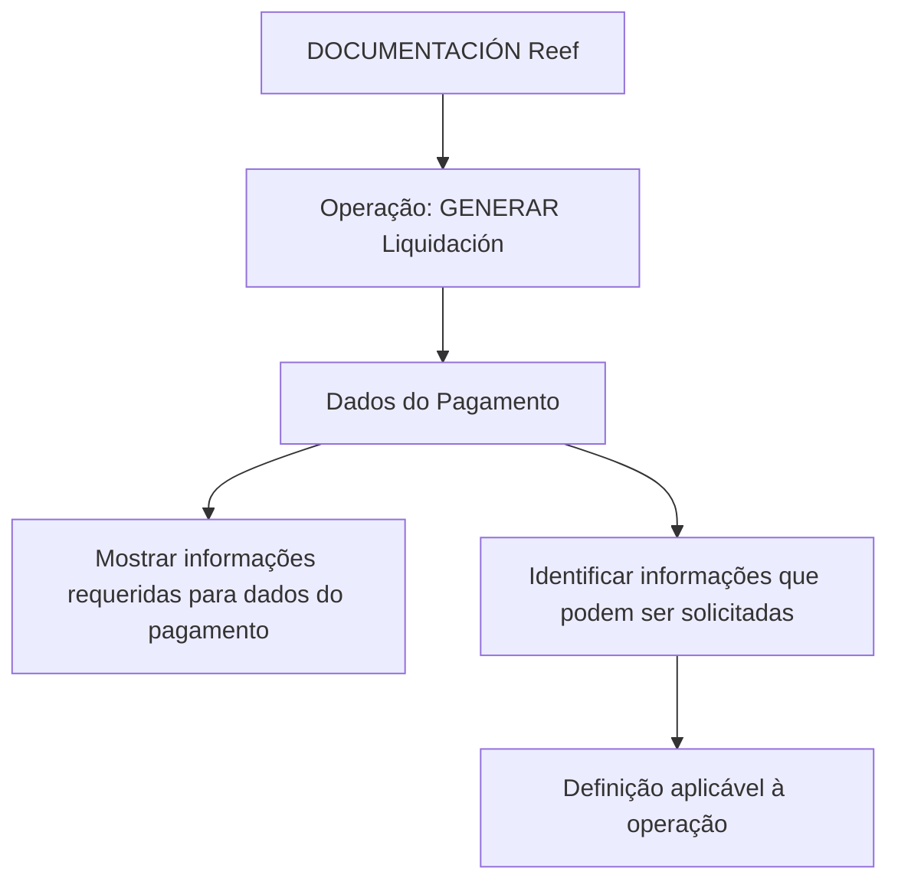

# Gerar Liquidação — Dados do Pagamento na Documentação Reef

## 1. Metadados do Documento
- **Arquivo de Origem:** Não identificado no conteúdo fornecido
- **Tipo de Documento:** Especificação Técnica
- **Domínio / Sistema:** Reef / Mapfre
- **Público-Alvo:** Desenvolvedores, Arquitetos, Analistas Funcionais e Operação
- **Data/Versão Identificada:** Não identificada

---

## 2. Resumo Executivo & Contexto de Negócio

O conteúdo documenta a operação **“GENERAR Liquidación - Datos del Pago”**, relacionada à geração de liquidação e à apresentação de dados de pagamento durante essa operação.

O objetivo declarado é identificar quais informações podem ser solicitadas no nível de **Dados do Pagamento**, de acordo com uma definição aplicável à operação de geração de liquidação.

O documento indica que existem propriedades que podem participar da operação, porém o trecho fornecido não relaciona os nomes, os formatos, as obrigatoriedades ou as regras de validação dessas propriedades.

A referência está localizada no contexto de **Documentación Reef**, com identificação de proprietário `user:agonzalez_mapfre.com`, ciclo de vida `Approved` e indicação de fonte `VL`.

---

## 3. Arquitetura, Componentes & Tecnologias Envolvidas

Componentes e contextos citados:

- **GENERAR Liquidación:** operação de geração de liquidação.
- **Datos del Pago:** nível funcional que exibe ou solicita informações necessárias ao pagamento.
- **Reef:** contexto de documentação mencionado como `DOCUMENTACIÓN Reef`.
- **Mapfre:** contexto corporativo identificado na navegação e no texto `Mapfredocument`.
- **VL:** fonte indicada no metadado `Source`.
- **Documentación Reef:** repositório ou área documental na qual o conteúdo está registrado.



> **Nota de Análise:** O conteúdo não descreve integrações, APIs, microsserviços, métodos HTTP, contratos JSON, bancos de dados, ambientes técnicos ou tecnologias de implementação.

---

## 4. Regras de Negócio, Especificações Funcionais & Processos

1. A operação documentada é **GENERAR Liquidación**.
2. Durante a operação **GENERAR Liquidación**, devem ser mostradas as informações requeridas para os **Dados do Pagamento**.
3. O objetivo funcional é conhecer quais informações podem ser solicitadas no nível de **Dados do Pagamento**.
4. As informações solicitáveis dependem de uma **definição** mencionada no documento.
5. O processo informado declara que determinadas propriedades podem participar da operação.
6. O conteúdo fornecido não apresenta:
   - a lista de propriedades participantes;
   - critérios de obrigatoriedade;
   - formatos de dados;
   - regras de cálculo;
   - mensagens de erro;
   - sequência detalhada de telas;
   - contratos de integração;
   - condições de aprovação ou rejeição.

> **Nota de Análise:** O documento afirma que “a continuación detallan las propiedades que pueden participar en esta operación”, mas o trecho disponível não contém o detalhamento dessas propriedades.

---

## 5. Tabelas de Parâmetros, Ambientes e Estruturas de Dados

| Item / Parâmetro | Descrição / Função | Tipo / Valores / Formato | Ambiente / Observações |
| :--- | :--- | :--- | :--- |
| Operação | `GENERAR Liquidación` | Nome da operação | Associada à exibição de Dados do Pagamento |
| Dados do Pagamento | Informações requeridas durante a geração de liquidação | Não especificado | Pode conter informações solicitadas conforme a definição aplicável |
| Propriedades participantes | Propriedades que podem participar da operação | Não especificado | O documento anuncia o detalhamento, mas não o apresenta no conteúdo fornecido |
| Owner | Proprietário do conteúdo | `user:agonzalez_mapfre.com` | Metadado da Documentación Reef |
| Lifecycle | Estado do ciclo de vida documental | `Approved` | Metadado da Documentación Reef |
| Source | Fonte do conteúdo | `VL` | Sigla não expandida no documento |
| Domínio documental | Área ou repositório de documentação | `DOCUMENTACIÓN Reef` | Associado ao contexto Mapfre |

---

## 6. Bateria de Perguntas & Respostas para RAG (FAQ Sintético)

### P1: O que é a operação “GENERAR Liquidación - Datos del Pago”?
**R:** É uma operação relacionada à geração de liquidação que contempla a apresentação das informações requeridas para os Dados do Pagamento.

### P2: Qual é o objetivo do documento sobre Dados do Pagamento?
**R:** O objetivo é conhecer quais informações podem ser solicitadas no nível de Dados do Pagamento, dependendo da definição aplicável à operação GENERAR Liquidación.

### P3: Quando os Dados do Pagamento devem ser apresentados?
**R:** Os Dados do Pagamento devem ser apresentados quando a operação GENERAR Liquidación é realizada.

### P4: Quais propriedades participam da operação GENERAR Liquidación?
**R:** O documento informa que existem propriedades que podem participar da operação, mas o trecho fornecido não lista quais são essas propriedades.

### P5: O documento define o formato dos dados de pagamento?
**R:** Não. O conteúdo fornecido não especifica formato, tipo, cardinalidade ou estrutura dos Dados do Pagamento.

### P6: O documento define regras de validação para Dados do Pagamento?
**R:** Não. O trecho não apresenta condições de validação, campos obrigatórios, valores permitidos ou tratamento de erros.

### P7: Qual é a dependência para determinar quais informações podem ser solicitadas?
**R:** As informações que podem ser solicitadas dependem de uma definição mencionada no documento, mas essa definição não é detalhada no conteúdo fornecido.

### P8: Em qual contexto documental a operação está registrada?
**R:** A operação está registrada no contexto `DOCUMENTACIÓN Reef`, dentro de uma navegação que também referencia Mapfre.

### P9: Quem é o proprietário identificado para o conteúdo?
**R:** O proprietário identificado é `user:agonzalez_mapfre.com`.

### P10: Qual é o estado do ciclo de vida do documento?
**R:** O ciclo de vida identificado é `Approved`.

### P11: O documento descreve APIs ou métodos HTTP da operação?
**R:** Não. O conteúdo não detalha APIs, endpoints, métodos HTTP, contratos JSON ou integrações técnicas.

### P12: O que significa a fonte “VL” indicada no documento?
**R:** O documento apresenta `VL` como valor do campo `Source`, mas não expande nem explica o significado da sigla.

---

## 7. Glossário de Termos, Siglas & Conceitos-Chave

- **GENERAR Liquidación:** Operação citada no documento para geração de liquidação.
- **Dados do Pagamento / Datos del Pago:** Nível de informações requeridas ou solicitáveis durante a operação GENERAR Liquidación.
- **DOCUMENTACIÓN Reef:** Contexto ou área documental mencionada como origem do conteúdo.
- **Lifecycle:** Metadado de ciclo de vida do documento; o valor apresentado é `Approved`.
- **Owner:** Metadado de propriedade do conteúdo; o valor apresentado é `user:agonzalez_mapfre.com`.
- **Source:** Metadado de fonte do conteúdo; o valor apresentado é `VL`.
- **VL:** Sigla apresentada como fonte, sem expansão ou definição no conteúdo fornecido.

---

## 8. Notas Críticas, Riscos & Limitações

- O conteúdo é resumido e não contém o detalhamento prometido das propriedades participantes.
- Não há especificação de campos, tipos, formatos, valores válidos ou obrigatoriedade para Dados do Pagamento.
- Não há regras de cálculo, regras de validação, mensagens de erro ou cenários excepcionais.
- Não há descrição de serviços, APIs, integrações, contratos técnicos ou ambientes.
- A sigla `VL` não é definida.
- Não foi identificada data, versão, autor formal ou nome do arquivo de origem.
- A implementação da operação não pode ser derivada exclusivamente deste trecho sem introduzir informações não sustentadas pelo documento.

---

## 9. Conteúdo Bruto Estruturado (Referência Fiel)

```text
--- [PÁGINA 1 DE 1] ---

EN CONSTRUCCIÓN
GENERAR Liquidación - Datos del Pago
¿En que consiste?
Mostrar la información requerida para los datos del Pago,cuando se realiza la operación que GENERAR Liquidación.
Objetivo
Conocer que información puede solicitarse en este nivel dependiendo de la denición.
Proceso a seguir
A continuación detallan las propiedades que pueden participar en esta operación
Datos del Pago
Documentation / DOCUMENTACIÓN Reef
DOCUMENTACIÓN Reef
Mapfredocument
DOCUMENTACIÓN Reef
Owner
user:agonzalez_mapfre.com
Lifecycle
Approved Source
 / 
 VL
Buscar Inicio Soluciones Arquitecturas APIs Componentes Cloud Documentación Zeus Reef Ayuda
ES
```
