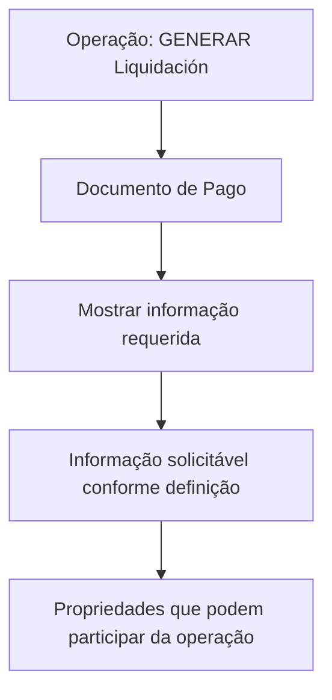

# GENERAR Liquidación — Documento de Pago: Propriedades Participantes na Operação

## 1. Metadados do Documento
- **Arquivo de Origem:** `Não identificado no conteúdo fornecido`
- **Tipo de Documento:** `Especificação Técnica`
- **Domínio / Sistema:** `Reef / Mapfre`
- **Público-Alvo:** `Não identificado`
- **Data/Versão Identificada:** `Não identificada`
- **Status identificado:** `EN CONSTRUCCIÓN`
- **Owner identificado:** `user:agonzalez_mapfre.com`
- **Lifecycle identificado:** `Approved Source`

---

## 2. Resumo Executivo & Contexto de Negócio

O documento descreve a operação **GENERAR Liquidación** no contexto de **Documento de Pago**. O propósito explicitado é apresentar as informações requeridas para o Documento de Pago quando a operação GENERAR Liquidación é executada.

O objetivo declarado é permitir o conhecimento das informações que podem ser solicitadas nesse nível, conforme a definição aplicável. O texto indica que as propriedades podem participar da operação, mas não apresenta a lista dessas propriedades no conteúdo disponível.

A documentação está associada a **Reef**, com referências a **DOCUMENTACIÓN Reef** e **Mapfredocument**. O conteúdo também exibe metadados de governança, incluindo owner e lifecycle.

> **Nota de Análise:** O material está marcado como `EN CONSTRUCCIÓN`. Não há detalhamento sobre contratos, métodos HTTP, estrutura de Documento de Pago, propriedades participantes, critérios de seleção ou regras de validação.

---

## 3. Arquitetura, Componentes & Tecnologias Envolvidas

Os elementos explicitamente citados são:

| Componente / Termo | Papel identificado no conteúdo |
| :--- | :--- |
| `GENERAR Liquidación` | Operação que aciona a apresentação de informações para Documento de Pago. |
| `Documento de Pago` | Artefato para o qual são apresentadas informações requeridas durante a operação. |
| `Reef` | Sistema ou domínio referenciado pela documentação. |
| `DOCUMENTACIÓN Reef` | Área ou referência documental associada a Reef. |
| `Mapfredocument` | Termo ou referência documental exibida no conteúdo. |
| `Owner: user:agonzalez_mapfre.com` | Responsável identificado na documentação. |
| `Lifecycle: Approved Source` | Estado de ciclo de vida exibido no conteúdo. |



> **Nota de Análise:** O diagrama representa exclusivamente a sequência conceitual descrita no texto. O documento não informa sistemas integrados, endpoints, protocolos, bancos de dados, ambientes, tecnologias de implementação ou contratos de dados.

---

## 4. Regras de Negócio, Especificações Funcionais & Processos

### Objetivo funcional identificado

A operação **GENERAR Liquidación** deve mostrar a informação requerida para o **Documento de Pago** quando essa operação for realizada.

### Critério de informação solicitável

A informação que pode ser solicitada no nível do Documento de Pago depende da respectiva definição.

### Processo descrito

1. Realizar a operação **GENERAR Liquidación**.
2. Considerar o **Documento de Pago** associado à operação.
3. Mostrar a informação requerida para o Documento de Pago.
4. Identificar as propriedades que podem participar nessa operação.

> **Nota de Análise:** O texto anuncia que detalhará as propriedades participantes, mas a relação dessas propriedades não está presente no trecho fornecido.

### Restrições de interpretação

- Não foram identificados valores de entrada.
- Não foram identificados campos obrigatórios ou opcionais.
- Não foram identificadas regras de cálculo de liquidação.
- Não foram identificadas validações, exceções ou mensagens de erro.
- Não foram identificados métodos HTTP, payloads JSON, URLs ou APIs.
- Não foram identificados papéis de usuário, permissões ou matriz de acesso.

---

## 5. Tabelas de Parâmetros, Ambientes e Estruturas de Dados

| Item / Parâmetro | Descrição / Função | Tipo / Valores / Formato | Ambiente / Observações |
| :--- | :--- | :--- | :--- |
| `GENERAR Liquidación` | Operação relacionada à geração de liquidação. | Operação | Aciona a apresentação de informações do Documento de Pago. |
| `Documento de Pago` | Documento para o qual a informação requerida deve ser mostrada. | Documento | Estrutura, campos e formato não detalhados. |
| Informação requerida | Informação exibida para o Documento de Pago durante a operação. | Não especificado | Depende da definição aplicável. |
| Propriedades participantes | Propriedades que podem participar na operação. | Não especificado | Listagem não disponível no conteúdo fornecido. |
| `Reef` | Referência de domínio, sistema ou documentação. | Não especificado | Associado a `DOCUMENTACIÓN Reef`. |
| `Mapfredocument` | Referência exibida na documentação. | Não especificado | Função não detalhada. |
| Owner | Responsável identificado no registro documental. | `user:agonzalez_mapfre.com` | Metadado de governança. |
| Lifecycle | Ciclo de vida identificado no registro documental. | `Approved Source` | Metadado de governança. |
| Status | Estado apresentado no conteúdo. | `EN CONSTRUCCIÓN` | Indica material em construção. |

---

## 6. Bateria de Perguntas & Respostas para RAG (FAQ Sintético)

### P1: Em que consiste a operação GENERAR Liquidación?
**R:** A operação **GENERAR Liquidación** consiste em mostrar a informação requerida para o **Documento de Pago** quando a operação é realizada.

### P2: Qual é o objetivo da documentação sobre GENERAR Liquidación?
**R:** O objetivo é conhecer quais informações podem ser solicitadas no nível do Documento de Pago, dependendo da definição aplicável.

### P3: Qual documento é tratado durante a operação GENERAR Liquidación?
**R:** O documento tratado é o **Documento de Pago**.

### P4: Quando a informação do Documento de Pago deve ser mostrada?
**R:** A informação requerida deve ser mostrada quando a operação **GENERAR Liquidación** é realizada.

### P5: De que depende a informação que pode ser solicitada no Documento de Pago?
**R:** A informação solicitável depende da definição aplicável naquele nível, conforme indicado no documento.

### P6: O documento informa quais propriedades participam da operação?
**R:** Não. O texto informa que detalhará as propriedades que podem participar da operação, mas a lista dessas propriedades não está presente no conteúdo fornecido.

### P7: O documento define campos, formatos ou contratos de dados do Documento de Pago?
**R:** Não. O conteúdo não apresenta campos, tipos, formatos, payloads, contratos JSON ou estrutura de dados do Documento de Pago.

### P8: O documento especifica APIs, URLs ou métodos HTTP para GENERAR Liquidación?
**R:** Não. Não há URLs, métodos HTTP, endpoints, protocolos ou contratos de integração no trecho disponível.

### P9: Qual sistema ou domínio é referenciado pela documentação?
**R:** O conteúdo faz referência a **Reef**, incluindo as expressões `DOCUMENTACIÓN Reef` e `Documentation / DOCUMENTACIÓN Reef`.

### P10: Qual é o status do material analisado?
**R:** O material apresenta o status `EN CONSTRUCCIÓN`, indicando que o conteúdo está em construção.

### P11: Quem é o owner identificado no documento?
**R:** O owner identificado é `user:agonzalez_mapfre.com`.

### P12: Qual lifecycle é exibido para o documento?
**R:** O lifecycle exibido é `Approved Source`.

---

## 7. Glossário de Termos, Siglas & Conceitos-Chave

- **GENERAR Liquidación:** Operação mencionada como responsável por apresentar a informação requerida para o Documento de Pago.
- **Documento de Pago:** Documento associado à operação GENERAR Liquidación.
- **Reef:** Sistema, domínio ou referência documental mencionada no conteúdo.
- **DOCUMENTACIÓN Reef:** Referência à documentação relacionada a Reef.
- **Mapfredocument:** Termo apresentado no conteúdo; sua função não é detalhada.
- **Owner:** Metadado que identifica o responsável pelo documento.
- **Lifecycle:** Metadado que identifica o estado do ciclo de vida do documento.
- **Approved Source:** Valor de lifecycle exibido no conteúdo.
- **EN CONSTRUCCIÓN:** Status textual que indica que o material está em construção.

---

## 8. Notas Críticas, Riscos & Limitações

- O documento está marcado como **`EN CONSTRUCCIÓN`**, o que sugere conteúdo incompleto.
- A lista de propriedades que podem participar em **GENERAR Liquidación** não está disponível no trecho analisado.
- Não há definição de campos, tipos de dados, estruturas de Documento de Pago ou parâmetros de entrada.
- Não há especificação de regras de cálculo, validações, erros, exceções ou critérios de elegibilidade.
- Não há informações sobre arquitetura física, microsserviços, APIs, URLs, ambientes, autenticação, logs ou observabilidade.
- Não há data, versão, arquivo de origem ou público-alvo identificáveis no texto fornecido.
- A referência a `Mapfredocument` não possui explicação funcional adicional.

---

## 9. Conteúdo Bruto Estruturado (Referência Fiel)

```text
--- [PÁGINA 1 DE 1] ---

EN CONSTRUCCIÓN
GENERAR Liquidación - Documento de Pago
¿En que consiste?
Mostrar la información requerida para el Documento de Pago,cuando se realiza la operación que GENERAR Liquidación.
Objetivo
Conocer que información puede solicitarse en este nivel dependiendo de la denición.
Proceso a seguir
A continuación detallan las propiedades que pueden participar en esta operación
Documento de Pago
Documentation / DOCUMENTACIÓN Reef
DOCUMENTACIÓN Reef
Mapfredocument
DOCUMENTACIÓN Reef
Owner
user:agonzalez_mapfre.com
Lifecycle
Approved Source
 /
VL
Buscar Inicio Soluciones Arquitecturas APIs Componentes Cloud Documentación Zeus Reef Ayuda
ES
```
