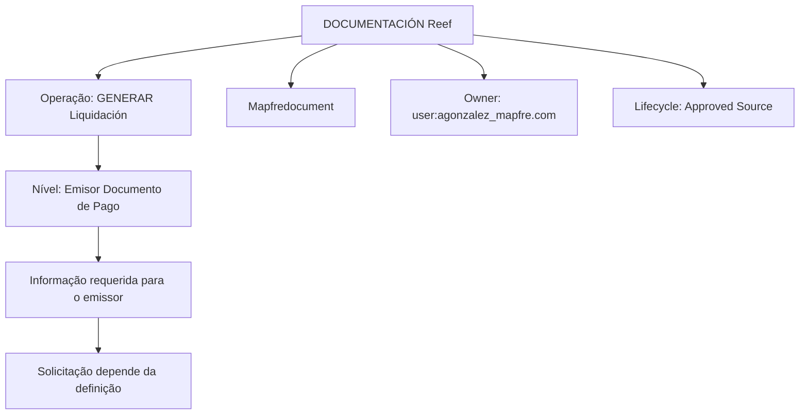

# Geração de Liquidação — Emissor do Documento de Pagamento

## 1. Metadados do Documento
- **Arquivo de Origem:** Não identificado no conteúdo fornecido
- **Tipo de Documento:** Procedimento
- **Domínio / Sistema:** Reef / Mapfredocument
- **Público-Alvo:** Negócio, Desenvolvedores e Operação
- **Data/Versão Identificada:** Não identificada

---

## 2. Resumo Executivo & Contexto de Negócio

O documento descreve a operação **“GENERAR Liquidación”**, especificamente o nível funcional denominado **“Emisor Documento de Pago”**. O objetivo declarado é apresentar as informações requeridas para o emissor do documento de pagamento quando a operação de geração de liquidação é executada.

O conteúdo indica que as informações que podem ser solicitadas nesse nível dependem de uma **definição**. Contudo, o trecho fornecido não identifica qual definição controla a solicitação, nem enumera propriedades, campos, regras de obrigatoriedade ou valores aceitos.

A documentação está associada a **Reef**, apresenta referências a **Mapfredocument** e possui ciclo de vida marcado como **Approved Source**. O proprietário identificado é `user:agonzalez_mapfre.com`.

O texto também contém elementos de navegação de um portal de documentação, incluindo áreas como Soluções, Arquiteturas, APIs, Componentes, Cloud, Documentação, Zeus, Reef e Ajuda. Esses elementos não descrevem integrações técnicas nem arquitetura executável.

---

## 3. Arquitetura, Componentes & Tecnologias Envolvidas

Os elementos explicitamente citados são:

| Componente / Elemento | Papel identificado no conteúdo |
| :--- | :--- |
| `GENERAR Liquidación` | Operação na qual são apresentadas informações requeridas para o emissor do documento de pagamento. |
| `Emisor Documento de Pago` | Nível ou contexto funcional relacionado ao emissor durante a geração de liquidação. |
| Reef | Contexto de documentação citado como “Documentation / DOCUMENTACIÓN Reef”. |
| Mapfredocument | Nome citado no conteúdo; o papel técnico não é detalhado. |
| `Approved Source` | Estado de ciclo de vida exibido para o documento. |
| `user:agonzalez_mapfre.com` | Proprietário indicado para o conteúdo documentado. |
| `VL` | Sigla exibida no cabeçalho; sem expansão ou explicação no trecho fornecido. |



> **Nota de Análise:** O conteúdo não detalha APIs, métodos HTTP, contratos JSON, bancos de dados, servidores, URLs de ambiente, tecnologias de implementação ou relações técnicas entre Reef e Mapfredocument.

---

## 4. Regras de Negócio, Especificações Funcionais & Processos

### Objetivo funcional

A operação **“GENERAR Liquidación”** deve mostrar a informação requerida para o **Emisor del Documento de Pago** quando a operação é realizada.

### Critério de determinação das informações

A documentação afirma que é necessário conhecer quais informações podem ser solicitadas no nível de emissor, sendo que essa solicitação depende de uma **definição**.

### Fluxo funcional identificado

1. A operação **“GENERAR Liquidación”** é realizada.
2. O contexto funcional considerado é o **Emisor del Documento de Pago**.
3. Informações requeridas para o emissor devem ser mostradas.
4. As propriedades que podem participar nessa operação devem ser detalhadas.
5. A seleção ou solicitação de informações depende de uma definição não especificada no trecho fornecido.

> **Nota de Análise:** O documento anuncia que detalhará “las propiedades que pueden participar en esta operación”, mas o conteúdo fornecido não contém a lista dessas propriedades, seus tipos, valores, validações ou comportamento.

---

## 5. Tabelas de Parâmetros, Ambientes e Estruturas de Dados

| Item / Parâmetro | Descrição / Função | Tipo / Valores / Formato | Ambiente / Observações |
| :--- | :--- | :--- | :--- |
| Operação | `GENERAR Liquidación` | Nome de operação | Relacionada à geração de liquidação. |
| Nível funcional | `Emisor Documento de Pago` | Nome de nível ou entidade funcional | Contexto no qual informações requeridas são mostradas. |
| Informação requerida | Informações a serem apresentadas para o emissor do documento de pagamento | Não detalhado | A solicitação depende de uma definição. |
| Propriedades participantes | Propriedades que podem participar na operação | Não listadas | O documento afirma que serão detalhadas, mas não as apresenta no trecho. |
| Documentação | `DOCUMENTACIÓN Reef` | Referência documental | Associada ao conteúdo apresentado. |
| Referência adicional | `Mapfredocument` | Nome citado | Função não detalhada. |
| Proprietário | `user:agonzalez_mapfre.com` | Identificador de usuário | Exibido como `Owner`. |
| Ciclo de vida | `Approved Source` | Estado textual | Exibido como `Lifecycle`. |
| Sigla | `VL` | Sigla não expandida | Sem contexto adicional no conteúdo. |
| Idioma de interface | `ES` | Código de idioma | Exibido no portal de documentação. |

---

## 6. Bateria de Perguntas & Respostas para RAG (FAQ Sintético)

### P1: Qual é a operação descrita no documento?
**R:** A operação descrita é **“GENERAR Liquidación”**. O conteúdo relaciona essa operação à apresentação de informações requeridas para o emissor do documento de pagamento.

### P2: Qual é o objetivo da seção “Emisor Documento de Pago”?
**R:** O objetivo é mostrar a informação requerida para o emissor do documento de pagamento quando a operação **“GENERAR Liquidación”** é executada.

### P3: De que depende a informação que pode ser solicitada ao emissor do documento de pagamento?
**R:** A informação que pode ser solicitada nesse nível depende de uma **definição**, conforme indicado no objetivo do documento. O conteúdo fornecido não especifica qual definição é utilizada nem os seus critérios.

### P4: O documento lista as propriedades participantes da operação “GENERAR Liquidación”?
**R:** Não. O texto afirma que detalhará as propriedades que podem participar da operação, mas a lista de propriedades não está presente no conteúdo fornecido.

### P5: Quais campos ou parâmetros do emissor do documento de pagamento são obrigatórios?
**R:** O conteúdo fornecido não identifica campos, parâmetros, obrigatoriedades, tipos de dados ou validações para o emissor do documento de pagamento.

### P6: O documento descreve APIs, endpoints ou contratos JSON da operação?
**R:** Não. Não há métodos HTTP, URLs, endpoints, contratos JSON, estruturas de requisição ou estruturas de resposta no conteúdo fornecido.

### P7: Qual sistema de documentação é mencionado?
**R:** O conteúdo cita **“DOCUMENTACIÓN Reef”** e também menciona **Mapfredocument**. A relação técnica ou funcional entre esses nomes não é explicada.

### P8: Quem é o proprietário identificado para a documentação?
**R:** O proprietário exibido no documento é `user:agonzalez_mapfre.com`.

### P9: Qual é o estado de ciclo de vida indicado?
**R:** O estado de ciclo de vida mostrado é **“Approved Source”**.

### P10: O que significa a sigla “VL” exibida no documento?
**R:** O conteúdo exibe a sigla `VL`, mas não fornece sua expansão ou significado. Portanto, não é possível definir seu sentido com base exclusivamente no trecho fornecido.

---

## 7. Glossário de Termos, Siglas & Conceitos-Chave

- **GENERAR Liquidación:** Operação mencionada no documento, relacionada à geração de liquidação.
- **Emisor Documento de Pago:** Nível funcional relacionado ao emissor do documento de pagamento dentro da operação “GENERAR Liquidación”.
- **Documento de Pago:** Documento cujo emissor deve ter informações requeridas apresentadas durante a operação descrita.
- **Reef:** Nome presente nas referências de documentação; o conteúdo não detalha sua definição técnica.
- **Mapfredocument:** Nome citado no documento; sua finalidade não é explicada.
- **Approved Source:** Estado de ciclo de vida exibido para a documentação.
- **Owner:** Campo de propriedade do documento, preenchido com `user:agonzalez_mapfre.com`.
- **VL:** Sigla não expandida no conteúdo fornecido.

---

## 8. Notas Críticas, Riscos & Limitações

- O trecho não contém a lista prometida de propriedades que podem participar da operação **“GENERAR Liquidación”**.
- Não há definição detalhada dos dados requeridos para o **Emisor Documento de Pago**.
- Não são informados campos obrigatórios, tipos de dados, regras de validação, valores permitidos ou mensagens de erro.
- O mecanismo ou a definição que determina quais informações podem ser solicitadas não é descrito.
- Não há detalhes sobre APIs, integrações, microsserviços, ambientes, URLs, credenciais, logs ou monitoramento.
- `Mapfredocument`, `Reef` e `VL` são citados sem detalhamento suficiente para estabelecer seus papéis técnicos ou funcionais.
- A identificação do arquivo de origem, data e versão não está presente no conteúdo fornecido.

---

## 9. Conteúdo Bruto Estruturado (Referência Fiel)

```text
--- [PÁGINA 1 DE 1] ---

EN CONSTRUCCIÓN
GENERAR Liquidación - Emisor Documento de Pago
¿En que consiste?
Mostrar la información requerida para el Emisor del Documento de Pago,cuando se realiza la operación que GENERAR Liquidación.
Objetivo
Conocer que información puede solicitarse en este nivel dependiendo de la denición.
Proceso a seguir
A continuación detallan las propiedades que pueden participar en esta operación
Emisor del Documento de Pago
Documentation / DOCUMENTACIÓN Reef
DOCUMENTACIÓN Reef
Mapfredocument
DOCUMENTACIÓN Reef
Owner
user:agonzalez_mapfre.com
Lifecycle
Approved Source
 / 
 VL
Buscar Inicio Soluciones Arquitecturas APIs Componentes Cloud Documentación Zeus Reef Ayuda
ES
```
