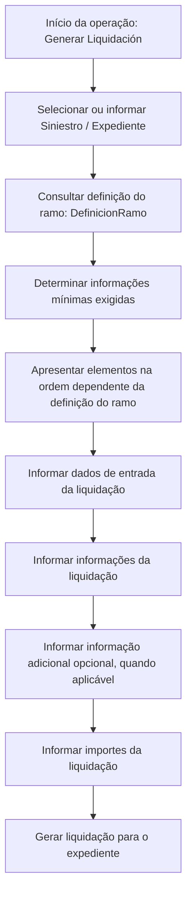

# Geração de Liquidação para Expediente — Documento Reef em Construção

## 1. Metadados do Documento
- **Arquivo de Origem:** Não identificado no conteúdo fornecido
- **Tipo de Documento:** Procedimento / documentação funcional em construção
- **Domínio / Sistema:** Reef / Mapfredocument / geração de liquidação
- **Público-Alvo:** Desenvolvedores, analistas funcionais, operação e utilizadores do sistema Reef
- **Data/Versão Identificada:** Não identificada
- **Status Identificado:** `EN CONSTRUCCIÓN`
- **Owner Identificado:** `user:agonzalez_mapfre.com`
- **Lifecycle Identificado:** `Approved Source`

---

## 2. Resumo Executivo & Contexto de Negócio

O documento descreve a operação **“GENERAR Liquidación”**, cujo objetivo é criar ou gerar uma liquidação associada a um expediente de sinistro. O conteúdo indica que a liquidação exige um conjunto mínimo de informações de entrada para que a operação possa ser realizada.

A informação solicitada para gerar a liquidação não é fixa: ela depende da definição configurada para o ramo. O texto menciona explicitamente a entidade ou conceito `[DefinicionRamo]`, indicando que a definição do ramo influencia os dados requeridos e também os elementos apresentados durante o processo.

O processo de geração de liquidação é apresentado como uma sequência de elementos. A ordem de apresentação é condicionada pela definição do ramo, o que sugere que o fluxo funcional possui comportamento parametrizado ou configurável por ramo.

O documento encontra-se marcado como “em construção” e não fornece detalhamento de contratos técnicos, métodos HTTP, validações específicas, regras de cálculo, persistência de dados, integrações externas ou comportamento de erro. A documentação está associada ao contexto Reef e contém referências a “DOCUMENTACIÓN Reef” e “Mapfredocument”.

---

## 3. Arquitetura, Componentes & Tecnologias Envolvidas

### Componentes e conceitos identificados

| Componente / Conceito | Papel identificado no documento | Detalhamento disponível |
| :--- | :--- | :--- |
| Reef | Contexto de documentação e navegação da solução. | O documento apresenta referências a “DOCUMENTACIÓN Reef”. Não descreve a arquitetura interna do Reef. |
| Mapfredocument | Termo exibido no conteúdo bruto. | Não há explicação funcional ou técnica adicional. |
| Gerar Liquidação | Operação destinada a criar ou gerar uma liquidação para um expediente. | O documento descreve os grupos de dados envolvidos, mas não detalha implementação. |
| Expediente | Entidade associada à liquidação que será criada. | Citado como “Siniestro Expediente”; não há modelo de dados detalhado. |
| Ramo | Contexto que determina os dados e a ordem dos elementos do processo. | A definição do ramo é mencionada como `[DefinicionRamo]`. |
| `[DefinicionRamo]` | Definição do ramo usada para determinar requisitos da operação. | O documento não informa estrutura, campos, localização ou regras da definição. |
| Liquidação de Referência | Dado de entrada listado para a operação. | Não há explicação sobre obrigatoriedade, origem ou finalidade. |
| Beneficiário da Liquidação | Informação da liquidação. | Não há critérios de seleção ou validação descritos. |
| Documento de Pagamento da Liquidação | Informação da liquidação. | Não há tipo documental, formato ou integração especificada. |
| Emissor do Documento de Pagamento | Informação da liquidação. | Não há regras sobre emissor, identificação ou autorização. |
| Dados do Pagamento | Informação da liquidação. | Não há detalhamento de meio de pagamento, valores ou datas. |
| Informação Adicional da Liquidação | Informação indicada como opcional. | O documento somente declara o caráter opcional. |
| Importes da Liquidação | Grupo de informações financeiras da liquidação. | Não há fórmulas, moedas, impostos ou validações informados. |

### Fluxo funcional identificado



> **Nota de Análise:** O fluxo Mermaid representa exclusivamente a sequência funcional inferível do texto fornecido. O documento não detalha serviços, APIs, bancos de dados, filas, interfaces, protocolos, tecnologias de implementação ou integrações entre sistemas.

---

## 4. Regras de Negócio, Especificações Funcionais & Processos

### Objetivo funcional

A operação **“GENERAR Liquidación”** permite criar ou gerar uma liquidação para um expediente.

### Informação mínima necessária

Para executar a operação de geração de liquidação, o documento estabelece que é necessário conhecer a informação mínima exigida. A composição dessa informação depende da definição aplicada ao ramo.

### Dependência da definição do ramo

A definição do ramo, mencionada como `[DefinicionRamo]`, determina:

1. A informação solicitada para realizar a geração da liquidação.
2. Os elementos que serão apresentados no processo.
3. A ordem em que os elementos serão apresentados.

O documento não detalha:

- Como a `[DefinicionRamo]` é criada, mantida ou consultada.
- Quais campos pertencem à `[DefinicionRamo]`.
- Quais valores de ramo existem.
- Quais dados são obrigatórios para cada ramo.
- Como o sistema trata a ausência de uma definição de ramo.
- Como são apresentadas mensagens de validação ou erro.

### Sequência de informações do processo

O documento afirma que os elementos do processo aparecem em uma ordem que depende da definição do ramo. Os seguintes grupos são explicitamente listados:

1. **Dados de entrada da liquidação**
   - Siniestro
   - Expediente
   - Liquidação de Referência

2. **Informação da liquidação**
   - Beneficiário da Liquidação
   - Documento de Pagamento da Liquidação
   - Emissor do Documento de Pagamento da Liquidação
   - Dados do Pagamento da Liquidação
   - Informação Adicional da Liquidação — opcional
   - Importes da Liquidação

### Informação opcional

A única característica de obrigatoriedade explicitamente indicada é:

- **Informação Adicional da Liquidação:** opcional.

> **Nota de Análise:** O documento não afirma explicitamente que os demais grupos ou campos são obrigatórios. Embora sejam apresentados como informações do processo, a obrigatoriedade efetiva de cada item é condicionada pela definição do ramo.

---

## 5. Tabelas de Parâmetros, Ambientes e Estruturas de Dados

| Item / Parâmetro | Descrição / Função | Tipo / Valores / Formato | Ambiente / Observações |
| :--- | :--- | :--- | :--- |
| Operação | Criar ou gerar uma liquidação para um expediente. | `GENERAR Liquidación` | Associada à documentação Reef. |
| Siniestro | Informação listada nos dados de entrada da liquidação. | Não especificado | O documento não detalha estrutura ou obrigatoriedade. |
| Expediente | Entidade para a qual a liquidação é criada. | Não especificado | Citado junto de “Siniestro” nos dados de entrada. |
| Liquidação de Referência | Informação listada nos dados de entrada. | Não especificado | Não é explicado quando deve ser informada. |
| `[DefinicionRamo]` | Definição do ramo que determina dados solicitados e ordem dos elementos. | Não especificado | Elemento central de parametrização funcional. |
| Beneficiário da Liquidação | Informação da liquidação. | Não especificado | Não há regras de identificação ou validação. |
| Documento de Pagamento da Liquidação | Informação relacionada ao pagamento da liquidação. | Não especificado | Não há detalhes de formato, tipo ou emissão. |
| Emissor do Documento de Pagamento | Informação relacionada ao emissor do documento de pagamento. | Não especificado | Não há detalhes sobre cadastro ou origem. |
| Dados do Pagamento | Grupo de dados relacionado ao pagamento da liquidação. | Não especificado | Não há detalhes de método, conta, data ou moeda. |
| Informação Adicional da Liquidação | Informação complementar da liquidação. | Opcional | Único atributo de opcionalidade explicitamente declarado. |
| Importes da Liquidação | Informação financeira da liquidação. | Não especificado | Não há fórmulas, limites ou critérios de cálculo. |
| Owner | Proprietário identificado na documentação. | `user:agonzalez_mapfre.com` | Conforme conteúdo bruto. |
| Lifecycle | Estado de ciclo de vida exibido. | `Approved Source` | Conforme conteúdo bruto. |
| Idioma exibido | Idioma selecionado na interface/documentação. | `ES` | O conteúdo funcional está majoritariamente em espanhol. |
| Status do conteúdo | Situação declarada no documento. | `EN CONSTRUCCIÓN` | Indica documentação ou funcionalidade em construção. |

---

## 6. Bateria de Perguntas & Respostas para RAG (FAQ Sintético)

### P1: Qual é o objetivo da operação “GENERAR Liquidación”?
**R:** A operação “GENERAR Liquidación” permite criar ou gerar uma liquidação para um expediente. O documento não detalha os serviços técnicos, APIs ou persistências envolvidos nessa criação.

### P2: Quais informações de entrada são listadas para gerar uma liquidação?
**R:** O documento lista três elementos em “DATOS DE ENTRADA DE LA LIQUIDACIÓN”: Siniestro, Expediente e Liquidação de Referência. Não há definição de formato, obrigatoriedade individual ou origem desses dados.

### P3: O que determina as informações necessárias para gerar uma liquidação?
**R:** As informações solicitadas dependem da definição realizada para o ramo, identificada no documento como `[DefinicionRamo]`. A documentação não descreve a estrutura ou os critérios dessa definição.

### P4: A ordem das etapas da geração de liquidação é sempre a mesma?
**R:** Não necessariamente. O documento informa que os elementos e a ordem em que aparecem dependem da definição do ramo. Não são fornecidos exemplos de ramos nem sequências específicas.

### P5: Quais informações compõem a seção “INFORMACIÓN DE LA LIQUIDACIÓN”?
**R:** A seção inclui Beneficiário da Liquidação, Documento de Pagamento da Liquidação, Emissor do Documento de Pagamento da Liquidação, Dados do Pagamento da Liquidação, Informação Adicional da Liquidação e Importes da Liquidação.

### P6: Qual informação da liquidação é explicitamente opcional?
**R:** A “Información Adicional de la liquidación” é explicitamente identificada como opcional. O texto não indica se os demais dados são obrigatórios, pois isso pode depender da definição do ramo.

### P7: O documento descreve cálculos para os importes da liquidação?
**R:** Não. O documento apenas lista “Importes de la liquidación” como um grupo de informações. Não são fornecidas fórmulas, moedas, impostos, limites, arredondamentos ou regras de validação.

### P8: O documento informa quais APIs ou métodos HTTP são usados na geração da liquidação?
**R:** Não. Não há métodos HTTP, endpoints, contratos JSON, eventos, filas, bancos de dados ou mecanismos de autenticação descritos no conteúdo fornecido.

### P9: O que é `[DefinicionRamo]` no contexto da geração de liquidação?
**R:** `[DefinicionRamo]` é a referência usada pelo documento para a definição do ramo. Essa definição condiciona os dados solicitados para a operação e a ordem de apresentação dos elementos do processo.

### P10: Qual é o estado identificado da documentação de geração de liquidação?
**R:** O conteúdo apresenta a indicação `EN CONSTRUCCIÓN`, sinalizando que a documentação ou o material relacionado à operação está em construção.

### P11: Quem é o owner identificado no conteúdo do documento?
**R:** O conteúdo bruto identifica o owner como `user:agonzalez_mapfre.com`.

### P12: O documento descreve como validar o beneficiário da liquidação?
**R:** Não. O beneficiário é listado como informação da liquidação, mas não há regras de identificação, elegibilidade, cadastro, validação ou associação com o expediente.

---

## 7. Glossário de Termos, Siglas & Conceitos-Chave

- **Reef:** Contexto de documentação identificado por referências como “DOCUMENTACIÓN Reef”. O documento não define a plataforma ou arquitetura do Reef.
- **GENERAR Liquidación:** Operação descrita para criar ou gerar uma liquidação para um expediente.
- **Liquidação:** Entidade ou resultado da operação de geração. O documento não fornece modelo de dados ou definição financeira detalhada.
- **Siniestro:** Termo apresentado nos dados de entrada da liquidação. Não há definição adicional no conteúdo.
- **Expediente:** Entidade para a qual a liquidação é gerada, segundo o objetivo descrito.
- **Liquidação de Referência:** Dado de entrada listado no processo. Sua finalidade não é detalhada.
- **Ramo:** Contexto de negócio cuja definição influencia as informações exigidas e a ordem dos elementos do processo.
- **`[DefinicionRamo]`:** Referência à definição do ramo. O documento associa essa definição à parametrização da geração de liquidação.
- **Beneficiário da Liquidação:** Informação da liquidação relativa ao beneficiário. Não há critérios de negócio especificados.
- **Documento de Pagamento da Liquidação:** Informação relacionada ao pagamento da liquidação. O tipo ou formato documental não é informado.
- **Emissor do Documento de Pagamento:** Entidade ou informação associada à emissão do documento de pagamento. Não há detalhamento adicional.
- **Dados do Pagamento:** Grupo de informações de pagamento da liquidação. O documento não identifica seus campos.
- **Importes da Liquidação:** Valores associados à liquidação. Não há regras de cálculo descritas.
- **Mapfredocument:** Termo exibido no conteúdo bruto sem definição funcional ou técnica.
- **Lifecycle:** Campo exibido no conteúdo com o valor `Approved Source`.
- **Approved Source:** Valor apresentado para o campo Lifecycle. O documento não define seu significado operacional.
- **EN CONSTRUCCIÓN:** Indicação em espanhol de que o conteúdo está em construção.

---

## 8. Notas Críticas, Riscos & Limitações

- O documento está explicitamente marcado como **`EN CONSTRUCCIÓN`**, o que limita sua utilização como especificação completa de implementação ou operação.
- A operação de geração de liquidação depende da `[DefinicionRamo]`, mas o documento não informa a estrutura, os valores possíveis, a origem, a manutenção ou as regras de consulta dessa definição.
- Não há critérios explícitos de obrigatoriedade para Siniestro, Expediente, Liquidação de Referência, beneficiário, documento de pagamento, emissor, dados de pagamento ou importes.
- Não há regras de cálculo, moeda, impostos, arredondamentos, validações de valores ou aprovações para os importes da liquidação.
- Não são documentados endpoints, métodos HTTP, contratos JSON, eventos, integrações, persistência, autenticação, autorização, perfis de acesso ou tratamento de erros.
- O documento não apresenta ambientes, URLs, servidores, portas, caminhos de logs, mecanismos de monitoramento ou procedimentos de suporte operacional.
- Alguns termos possuem problemas aparentes de codificação no conteúdo bruto, como `[denición]`, `Beneciario` e `DenicionRamo`. Esta estrutura preserva o significado aparente sem assumir correções técnicas não confirmadas.
- **Nota de Análise:** O documento lista “Mapfredocument”, mas não detalha a relação entre Mapfredocument, Reef e a operação de geração de liquidação.

---

## 9. Conteúdo Bruto Estruturado (Referência Fiel)

```text
--- [PÁGINA 1 DE 1] ---

EN CONSTRUCCIÓN
GENERAR Liquidación
¿En que consiste?
Esta operación permite crear, generar una liquidación para un expediente.
Objetivo
Conocer la información mínima necesaria con la que poder realizar la operación. La información solicitada depende de la [denición]
[DenicionRamo] que se haya realizado del ramo.
Proceso a seguir
En este apartado se enumeran los elementos y el orden en el que aparecerán (siempre dependiendo de la [denición] del ramo).
DATOS DE ENTRADA DE LA LIQUIDACIÓN
Siniestro Expediente Liquidación de Referencia
INFORMACIÓN DE LA LIQUIDACIÓN
Beneciario de la Liquidación
Documento de Pago de la Liquidación
Emisor del Documento de Pago de la liquidación
Datos del Pago de la liquidación
Información Adicional de la liquidación-Opcional
Importes de la liquidación
Documentation / DOCUMENTACIÓN Reef
DOCUMENTACIÓN Reef
Mapfredocument
DOCUMENTACIÓN Reef
Owner
user:agonzalez_mapfre.com
Lifecycle
Approved Source
 / 
 VL
Buscar Inicio Soluciones Arquitecturas APIs Componentes Cloud Documentación Zeus Reef Ayuda
ES
```
