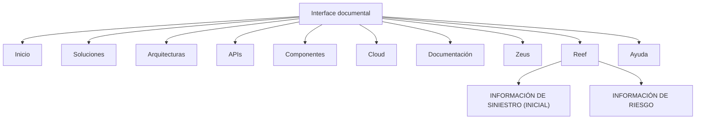

# Documentação Reef — Conteúdo de Construção, Informações de Sinistro e Risco

## 1. Metadados do Documento
- **Arquivo de Origem:** `Não identificado`
- **Tipo de Documento:** `Apresentação Executiva`
- **Domínio / Sistema:** `Reef / DOCUMENTACIÓN Reef`
- **Público-Alvo:** `Não identificado`
- **Data/Versão Identificada:** `Não identificada`

---

## 2. Resumo Executivo & Contexto de Negócio

O conteúdo apresenta uma estrutura inicial de documentação associada a **Reef**, identificada repetidamente como `DOCUMENTACIÓN Reef` e `Documentation / DOCUMENTACIÓN Reef`. O documento possui o indicador `EN CONSTRUCCI?N`, evidenciando que o material estava em construção no momento da extração.

O escopo informacional está organizado em dois blocos principais: **INFORMACIÓN DE SINIESTRO (INICIAL)** e **INFORMACIÓN DE RIESGO**. O primeiro bloco relaciona identificação do sinistro, informações gerais de apólice, coasseguro, tomador, agentes, intervenções de cliente e atributos. O segundo bloco relaciona intervenções de cliente, atributos, coberturas e cláusulas.

O texto também registra uma interface ou repositório documental com opções de navegação como `Buscar`, `Inicio`, `Soluciones`, `Arquitecturas`, `APIs`, `Componentes`, `Cloud`, `Documentación`, `Zeus`, `Reef` e `Ayuda`. A página indica o idioma `ES`, um proprietário identificado como `user:agonzalez_mapfre.com` e o ciclo de vida `Approved Source / VL`.

**Nota de Análise:** o conteúdo não detalha fluxos operacionais, contratos de APIs, tecnologias de implementação, regras de cálculo, métodos HTTP, modelos de dados, permissões ou significados das siglas apresentadas.

---

## 3. Arquitetura, Componentes & Tecnologias Envolvidas

Os componentes e referências explicitamente citados são:

| Componente / Referência | Evidência no conteúdo | Detalhamento disponível |
| :--- | :--- | :--- |
| Reef | `DOCUMENTACIÓN Reef`, `Reef` | Identificado como domínio ou seção documental; sem descrição funcional adicional. |
| Mapfredocument | `Mapfredocument` | Citado sem detalhamento. |
| Zeus | `Zeus` | Citado como opção de navegação; sem detalhamento. |
| Documentación | `Documentación` | Seção de navegação documental. |
| Arquitecturas | `Arquitecturas` | Seção de navegação; nenhuma arquitetura técnica é descrita. |
| APIs | `APIs` | Seção de navegação; não há APIs, endpoints ou contratos descritos. |
| Componentes | `Componentes` | Seção de navegação; componentes não são especificados. |
| Cloud | `Cloud` | Seção de navegação; provedor, serviços e ambientes não são informados. |



**Nota de Análise:** o diagrama representa exclusivamente as relações de navegação e agrupamento explicitamente observáveis no conteúdo. Não representa uma arquitetura de software, integração sistêmica ou fluxo de dados confirmado.

---

## 4. Regras de Negócio, Especificações Funcionais & Processos

O documento não apresenta regras de negócio formais, cálculos, critérios condicionais, exceções ou procedimentos passo a passo detalhados.

A estrutura apresentada para **INFORMACIÓN DE SINIESTRO (INICIAL)** contém os seguintes elementos:

1. Identificación del siniestro.
2. Información general de la póliza.
3. Coaseguro, apresentado com marcador `(    )`.
4. Tomador.
5. Intervenciones de cliente, apresentado com marcador `(    )`.
6. Agentes, apresentado com marcador `(    )`.
7. Atributos.

A estrutura apresentada para **INFORMACIÓN DE RIESGO** contém os seguintes elementos:

1. Intervenciones de cliente, apresentado com marcador `(    )`.
2. Atributos.
3. Intervenciones de cliente, citado novamente no conteúdo.
4. Coberturas.
5. Cláusulas.

**Nota de Análise:** os marcadores `(    )` não possuem definição no texto. Não é possível determinar se representam campos, controles de interface, estados, quantidades, permissões ou itens pendentes.

---

## 5. Tabelas de Parâmetros, Ambientes e Estruturas de Dados

| Item / Parâmetro | Descrição / Função | Tipo / Valores / Formato | Ambiente / Observações |
| :--- | :--- | :--- | :--- |
| Identificación del siniestro | Elemento da seção de informação inicial de sinistro. | Não informado. | Sem detalhamento adicional. |
| Información general de la póliza | Elemento da seção de informação inicial de sinistro. | Não informado. | Sem detalhamento adicional. |
| Coaseguro | Elemento da seção de informação inicial de sinistro. | Marcador `(    )`. | O significado do marcador não é informado. |
| Tomador | Elemento da seção de informação inicial de sinistro. | Não informado. | Sem detalhamento adicional. |
| Intervenciones de cliente | Elemento citado nas seções de sinistro e risco. | Marcador `(    )` em algumas ocorrências. | O documento não descreve intervenções, atores ou regras. |
| Agentes | Elemento da seção de informação inicial de sinistro. | Marcador `(    )`. | Sem detalhamento adicional. |
| Atributos | Elemento citado nas seções de sinistro e risco. | Não informado. | Não há lista de atributos. |
| Coberturas | Elemento da seção de informação de risco. | Não informado. | Não há catálogo ou regras de cobertura. |
| Cláusulas | Elemento da seção de informação de risco. | Não informado. | Não há texto de cláusulas. |
| Owner | Identificação de proprietário da documentação. | `user:agonzalez_mapfre.com` | Valor literal extraído. |
| Lifecycle | Estado do ciclo de vida do conteúdo. | `Approved Source / VL` | O significado de `VL` não é informado. |
| Idioma | Idioma indicado na interface documental. | `ES` | Valor literal extraído. |
| Estado do documento | Situação declarada do material. | `EN CONSTRUCCI?N` | A extração apresenta caractere possivelmente corrompido. |

---

## 6. Bateria de Perguntas & Respostas para RAG (FAQ Sintético)

### P1: Qual é o domínio ou sistema mencionado no documento?
**R:** O conteúdo identifica repetidamente `Reef`, por meio das expressões `DOCUMENTACIÓN Reef`, `Documentation / DOCUMENTACIÓN Reef` e da opção de navegação `Reef`. O documento não fornece uma definição funcional adicional para Reef.

### P2: O documento descreve informações iniciais de sinistro?
**R:** Sim. A seção `INFORMACIÓN DE SINIESTRO (INICIAL)` lista identificação do sinistro, informações gerais da apólice, coasseguro, tomador, intervenções de cliente, agentes e atributos.

### P3: Quais elementos compõem a informação de risco?
**R:** A seção `INFORMACIÓN DE RIESGO` cita intervenções de cliente, atributos, coberturas e cláusulas. `Intervenciones de cliente` aparece mais de uma vez no conteúdo extraído.

### P4: Quais tecnologias ou APIs são especificadas para Reef?
**R:** Nenhuma tecnologia, API, endpoint, contrato JSON, método HTTP, porta ou protocolo é especificado. O texto apenas apresenta `APIs` como uma opção de navegação.

### P5: O que significa o marcador `(    )` após Coaseguro, Intervenciones de cliente e Agentes?
**R:** O documento apresenta o marcador `(    )`, mas não define seu significado. Não é possível concluir se ele representa um campo, valor, estado, controle de interface ou item pendente.

### P6: Quem é identificado como proprietário da documentação Reef?
**R:** O campo `Owner` apresenta o valor literal `user:agonzalez_mapfre.com`.

### P7: Qual é o estado de ciclo de vida exibido para o conteúdo?
**R:** O conteúdo mostra `Lifecycle` com o valor `Approved Source / VL`. O documento não explica o significado de `VL`.

### P8: O documento está finalizado?
**R:** Não há evidência de finalização. O texto contém o indicador `EN CONSTRUCCI?N`, que sugere que o material estava em construção. A grafia contém um caractere possivelmente corrompido na extração.

### P9: Quais áreas podem ser acessadas pela navegação apresentada?
**R:** A navegação lista `Buscar`, `Inicio`, `Soluciones`, `Arquitecturas`, `APIs`, `Componentes`, `Cloud`, `Documentación`, `Zeus`, `Reef` e `Ayuda`.

### P10: Existem regras de negócio para coberturas e cláusulas?
**R:** Não. `Coberturas` e `Cláusulas` são apenas citadas como elementos de informação de risco; não há regras, critérios, cálculos, condições ou textos de cláusulas descritos.

### P11: Qual idioma é indicado na interface documental?
**R:** A interface apresenta o indicador `ES`. O conteúdo não fornece explicação adicional sobre configuração de idioma ou idiomas alternativos.

---

## 7. Glossário de Termos, Siglas & Conceitos-Chave

- **Reef:** nome citado na documentação e na navegação; o documento não apresenta sua definição funcional.
- **Siniestro:** termo em espanhol empregado na seção `INFORMACIÓN DE SINIESTRO (INICIAL)`.
- **Póliza:** termo em espanhol citado como `Información general de la póliza`; não há detalhamento adicional.
- **Coaseguro:** elemento listado nas informações iniciais de sinistro; não há definição no conteúdo.
- **Tomador:** elemento listado nas informações iniciais de sinistro; não há definição no conteúdo.
- **Coberturas:** elemento listado nas informações de risco; não há detalhamento no conteúdo.
- **Cláusulas:** elemento listado nas informações de risco; não há detalhamento no conteúdo.
- **Zeus:** item de navegação; não definido no documento.
- **VL:** sigla exibida em `Approved Source / VL`; significado não identificado.
- **ES:** código exibido na interface; o conteúdo não o expande.

---

## 8. Notas Críticas, Riscos & Limitações

- O material contém a indicação `EN CONSTRUCCI?N`, sugerindo conteúdo incompleto ou em elaboração.
- O texto extraído possui caracteres potencialmente corrompidos, como `CONSTRUCCI?N`, `Informaci?n`, `Identicación` e `INFORMACIÓN DE RIESGO ]`.
- Não há versão, data, autor documental formal, escopo operacional ou público-alvo explicitamente definido.
- Não há especificação de arquitetura de software, integrações, ambientes, servidores, URLs, credenciais, protocolos ou observabilidade.
- Não há definição para os marcadores `(    )`.
- Não há explicação para `VL`, `Zeus`, `Mapfredocument` ou para a relação entre esses termos e Reef.
- Não são descritos contratos de APIs, estruturas de dados, regras de validação, permissões ou matrizes de acesso.

---

## 9. Conteúdo Bruto Estruturado (Referência Fiel)

```text
--- [PÁGINA 1 DE 1] ---

Imagen LOGO
EN CONSTRUCCI?N
{#titulo}
¿En qué consiste?
Premisas
Proceso a seguir
INFORMACIÓN DE SINIESTRO (INICIAL)
 Identicación del siniestro  Informaci?n general de la p?liza  Coaseguro (    )
 Tomador  Intervenciones de cliente (    )
 Agentes (    )
 Atributos
INFORMACIÓN DE RIESGO ]
 Intervenciones de cliente (    )
 Atributos  Intervenciones de cliente (    )
 Coberturas  Cláusulas
Documentation / DOCUMENTACIÓN Reef
DOCUMENTACIÓN Reef
Mapfredocument
DOCUMENTACIÓN Reef
Owner
user:agonzalez_mapfre.com
Lifecycle
Approved Source
 / 
 VL
Buscar Inicio Soluciones Arquitecturas APIs Componentes Cloud Documentación Zeus Reef Ayuda
ES
```
