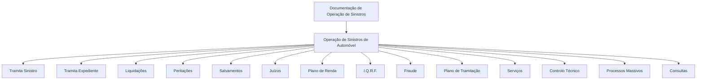

# Documentação de Operação de Sinistros — Automóvel

## 1. Metadados do Documento
- **Arquivo de Origem:** Não identificado no conteúdo fornecido
- **Tipo de Documento:** Manual Operacional
- **Domínio / Sistema:** Operação de Sinistros de Automóvel; Reef; Mapfre
- **Público-Alvo:** Operação, Negócio, Desenvolvedores e Arquitetos
- **Data/Versão Identificada:** Não identificada

---

## 2. Resumo Executivo & Contexto de Negócio

O conteúdo apresenta uma documentação de operação de sinistros voltada ao segmento de Automóvel. O material é caracterizado como uma formação orientada à operação e ao tipo de negócio, com foco em processos e módulos operacionais.

A estrutura funcional é organizada por módulos de operação de sinistros, incluindo tramitação de sinistros e expedientes, liquidações, peritações, salvamentos, juízos, plano de renda, I.Q.R.F., fraude, plano de tramitação, serviços, controlo técnico, processos massivos e consultas.

A documentação está associada ao contexto “Reef” e contém referências a “Mapfredocument”, “Zeus”, “Cloud”, “APIs”, “Componentes” e “Arquiteturas” na navegação da plataforma documental. Entretanto, o conteúdo fornecido não explica as responsabilidades técnicas, integrações, interfaces, contratos ou dependências entre esses elementos.

O estado de ciclo de vida apresentado é **Approved**, indicando que a fonte documental exibida foi aprovada. Não há versão, data, responsáveis de negócio ou detalhamento operacional adicional além da listagem de módulos.

---

## 3. Arquitetura, Componentes & Tecnologias Envolvidas

Os elementos citados no conteúdo são:

| Componente / Termo | Papel identificado no conteúdo | Detalhamento disponível |
| :--- | :--- | :--- |
| Operação de Sinistros | Domínio operacional principal | Voltada a Automóvel |
| Reef | Contexto de documentação | Não detalhado |
| Mapfredocument | Referência documental | Não detalhado |
| Zeus | Item disponível na navegação | Não detalhado |
| Soluções | Categoria de navegação | Não detalhado |
| Arquiteturas | Categoria de navegação | Não detalhado |
| APIs | Categoria de navegação | Não detalhado |
| Componentes | Categoria de navegação | Não detalhado |
| Cloud | Categoria de navegação | Não detalhado |
| Owner | Campo de propriedade documental | `user:agonzalez_mapfre.com` |
| Lifecycle | Estado do documento | `Approved` |



> **Nota de Análise:** O documento lista módulos funcionais da operação de sinistros, mas não detalha fluxos de dados, interfaces, tecnologias, métodos HTTP, contratos JSON, ambientes, bases de dados ou integrações entre componentes.

---

## 4. Regras de Negócio, Especificações Funcionais & Processos

O conteúdo fornecido identifica as seguintes áreas ou módulos operacionais:

1. **Tramita Sinistro:** módulo listado como parte das operações de sinistros.
2. **Tramita Expediente:** módulo listado como parte das operações de sinistros.
3. **Liquidações:** módulo relacionado a liquidações.
4. **Peritações:** módulo relacionado a peritações.
5. **Salvamentos:** módulo relacionado a salvamentos.
6. **Juízos:** módulo relacionado a juízos.
7. **Plano de Renda:** módulo listado no contexto operacional.
8. **I.Q.R.F.:** sigla apresentada sem expansão ou definição.
9. **Fraude:** módulo relacionado a fraude.
10. **Plano de Tramitação:** módulo listado no contexto operacional.
11. **Serviços:** módulo listado no contexto operacional.
12. **Controlo Técnico:** módulo listado no contexto operacional.
13. **Processos Massivos:** módulo relacionado a processamento massivo.
14. **Consultas:** módulo relacionado a consultas.

Não foram fornecidas regras de cálculo, condições de validação, critérios de decisão, sequências operacionais, exceções, responsabilidades, entradas, saídas ou indicadores para os módulos listados.

---

## 5. Tabelas de Parâmetros, Ambientes e Estruturas de Dados

| Item / Parâmetro | Descrição / Função | Tipo / Valores / Formato | Ambiente / Observações |
| :--- | :--- | :--- | :--- |
| Tipo de negócio | Segmento da documentação de operação de sinistros | Automóvel | Não há ambiente identificado |
| Owner | Proprietário apresentado na página documental | `user:agonzalez_mapfre.com` | Campo de propriedade documental |
| Lifecycle | Estado do ciclo de vida da fonte | `Approved` | Fonte aprovada |
| Fonte | Indicação de fonte documental | `Source` | Exibido junto ao ciclo de vida |
| Idioma | Idioma exibido na navegação | `ES` | Interface em espanhol |
| Documentação | Contexto documental repetidamente citado | `Reef` | Sem especificação adicional |
| Módulo operacional | Tramita Sinistro | Nome funcional | Sem detalhamento |
| Módulo operacional | Tramita Expediente | Nome funcional | Sem detalhamento |
| Módulo operacional | Liquidações | Nome funcional | Sem detalhamento |
| Módulo operacional | Peritações | Nome funcional | Sem detalhamento |
| Módulo operacional | Salvamentos | Nome funcional | Sem detalhamento |
| Módulo operacional | Juízos | Nome funcional | Sem detalhamento |
| Módulo operacional | Plano de Renda | Nome funcional | Sem detalhamento |
| Módulo operacional | I.Q.R.F. | Sigla funcional | Expansão não identificada |
| Módulo operacional | Fraude | Nome funcional | Sem detalhamento |
| Módulo operacional | Plano de Tramitação | Nome funcional | Sem detalhamento |
| Módulo operacional | Serviços | Nome funcional | Sem detalhamento |
| Módulo operacional | Controlo Técnico | Nome funcional | Sem detalhamento |
| Módulo operacional | Processos Massivos | Nome funcional | Sem detalhamento |
| Módulo operacional | Consultas | Nome funcional | Sem detalhamento |

---

## 6. Bateria de Perguntas & Respostas para RAG (FAQ Sintético)

### P1: Qual é o domínio de negócio da documentação apresentada?
**R:** A documentação está relacionada à operação de sinistros no segmento de Automóvel.

### P2: Quais módulos operacionais são listados para a operação de sinistros?
**R:** O conteúdo lista Tramita Sinistro, Tramita Expediente, Liquidações, Peritações, Salvamentos, Juízos, Plano de Renda, I.Q.R.F., Fraude, Plano de Tramitação, Serviços, Controlo Técnico, Processos Massivos e Consultas.

### P3: O documento descreve detalhadamente o fluxo de Tramita Sinistro?
**R:** Não. O conteúdo apenas cita “Tramita Sinistro” como módulo de operação, sem fornecer etapas, regras, responsáveis, integrações ou critérios de processamento.

### P4: Existem regras de negócio para liquidações no conteúdo fornecido?
**R:** Não. “Liquidações” aparece apenas como um módulo listado, sem regras de cálculo, validações, entradas, saídas ou condições operacionais.

### P5: O documento explica o significado da sigla I.Q.R.F.?
**R:** Não. A sigla I.Q.R.F. é apresentada na lista de módulos, mas a expansão ou definição não está disponível no conteúdo fornecido.

### P6: O documento contém URLs, servidores, portas ou ambientes técnicos?
**R:** Não. Não há URLs, endereços de servidores, portas, variáveis de ambiente ou mapeamentos de infraestrutura no conteúdo disponibilizado.

### P7: Qual é o estado de ciclo de vida da documentação?
**R:** O estado de ciclo de vida exibido é `Approved`, com referência a `Source`.

### P8: Quem é o proprietário indicado para a fonte documental?
**R:** O campo Owner apresenta `user:agonzalez_mapfre.com`.

### P9: Qual contexto documental é mencionado junto à operação de sinistros?
**R:** O conteúdo referencia “Documentation / DOCUMENTACIÓN Reef”, “DOCUMENTACIÓN Reef” e “Mapfredocument”.

### P10: Há uma descrição de integração entre Reef, Zeus, APIs e componentes?
**R:** Não. Reef, Zeus, APIs, Componentes, Cloud, Soluções e Arquiteturas aparecem como referências ou categorias de navegação, sem descrição de arquitetura ou integração.

### P11: O que o documento informa sobre processos massivos?
**R:** “Processos Massivos” é listado como um módulo operacional. O conteúdo não detalha quais processos são executados, frequência, entradas, saídas ou regras de execução.

### P12: O documento apresenta uma matriz de permissões para os módulos de sinistros?
**R:** Não. Não há matriz de perfis, permissões, funções ou responsabilidades de acesso no conteúdo fornecido.

---

## 7. Glossário de Termos, Siglas & Conceitos-Chave

- **Automóvel:** Tipo de negócio associado à operação de sinistros documentada.
- **Consultas:** Módulo listado para consulta de informações; funcionalidades não detalhadas.
- **Controlo Técnico:** Módulo listado no documento; critérios técnicos não detalhados.
- **Fraude:** Módulo listado no contexto da operação de sinistros; regras não detalhadas.
- **I.Q.R.F.:** Sigla apresentada no documento sem expansão identificada.
- **Juízos:** Módulo listado no documento; sem detalhamento adicional.
- **Liquidações:** Módulo listado no documento; sem detalhamento adicional.
- **Mapfredocument:** Referência documental citada no conteúdo.
- **Peritações:** Módulo listado no documento; sem detalhamento adicional.
- **Plano de Renda:** Módulo listado no documento; sem detalhamento adicional.
- **Plano de Tramitação:** Módulo listado no documento; sem detalhamento adicional.
- **Processos Massivos:** Módulo listado no documento; sem detalhamento adicional.
- **Reef:** Contexto ou plataforma documental mencionada no conteúdo, sem definição técnica.
- **Salvamentos:** Módulo listado no documento; sem detalhamento adicional.
- **Serviços:** Módulo listado no documento; sem detalhamento adicional.
- **Sinistros:** Domínio operacional central do documento.
- **Tramita Expediente:** Módulo listado no documento; sem detalhamento adicional.
- **Tramita Sinistro:** Módulo listado no documento; sem detalhamento adicional.

---

## 8. Notas Críticas, Riscos & Limitações

- O conteúdo fornecido é predominantemente uma listagem de módulos e não descreve processos operacionais completos.
- Não há detalhamento de fluxos entre os módulos de sinistros.
- Não há especificações técnicas de APIs, métodos HTTP, contratos, payloads, autenticação ou tratamento de erros.
- Não há informação sobre arquitetura de software, infraestrutura, ambientes, servidores, URLs, bases de dados ou mecanismos de observabilidade.
- A sigla **I.Q.R.F.** não está definida.
- Não há versão ou data identificável para a documentação.
- O diagrama Mermaid representa apenas a relação hierárquica inferida da lista de módulos; não deve ser interpretado como fluxo transacional ou integração técnica.
- Não há notas de apresentador, anexos ou conteúdo complementar disponível para enriquecer os tópicos resumidos.

---

## 9. Conteúdo Bruto Estruturado (Referência Fiel)

```text
--- [PÁGINA 1 DE 1] ---

DOCUMENTACIÓN de OPERACIÓN de SINIESTROS (Automóvil)
Imagen Operación Siniestros Común Formación orientada a la operación y tipo de negocio
OPERACIONES por MÓDULO
 TRAMITA SINIESTRO
  TRAMITA EXPEDIENTE
  LIQUIDACIONES
 PERITACIONES
  SALVAMENTOS
  JUICIOS
 PLAN DE RENTA
  I.Q.R.F.
  FRAUDE
 PLAN DE TRAMITACIÓN
  SERVICIOS
  CONTROL TÉCNICO
 PROCESOS MASIVOS
  CONSULTAS
Documentation / DOCUMENTACIÓN Reef
DOCUMENTACIÓN Reef
Mapfredocument
DOCUMENTACIÓN Reef
Owner
user:agonzalez_mapfre.com
Lifecycle
Approved Source
 / 
 VL
Buscar Inicio Soluciones Arquitecturas APIs Componentes Cloud Documentación Zeus Reef Ayuda
ES
```
